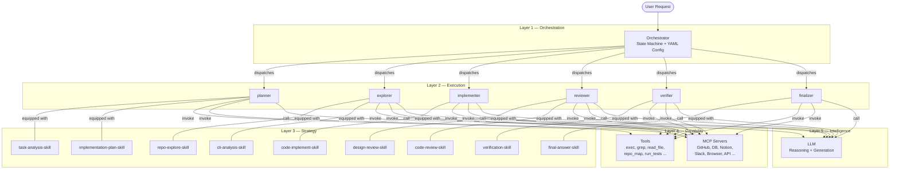
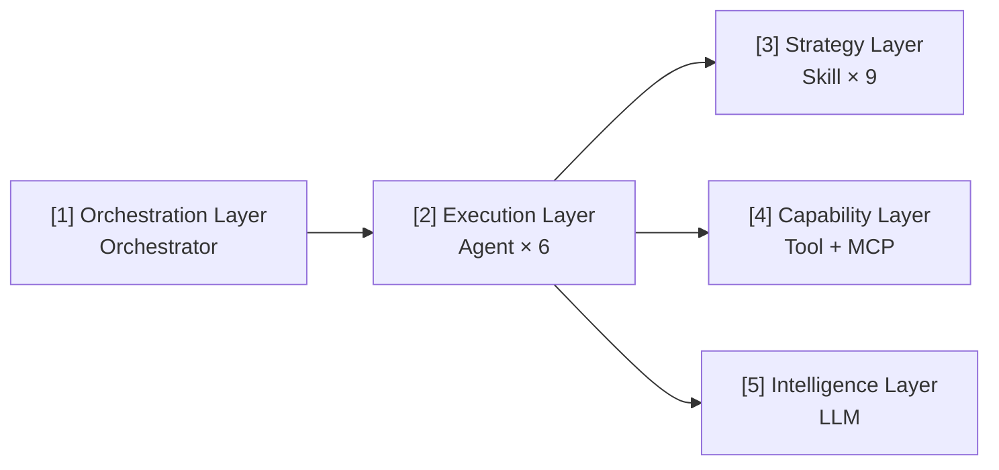
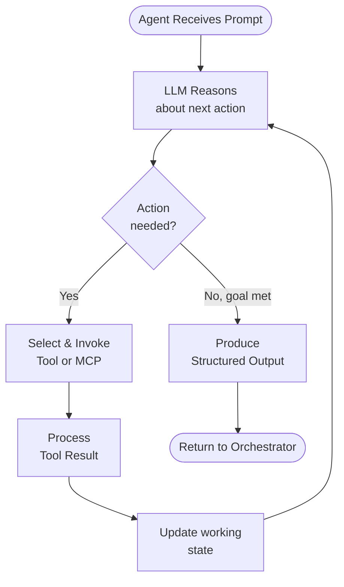
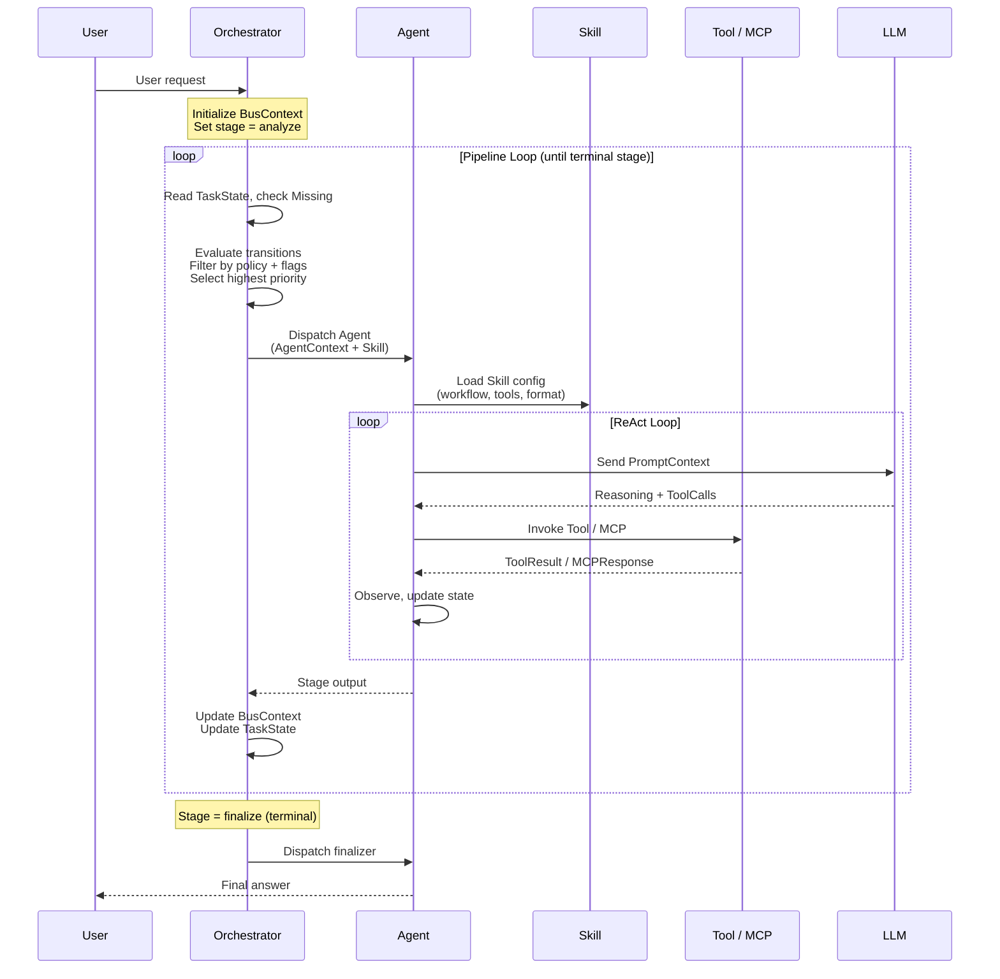
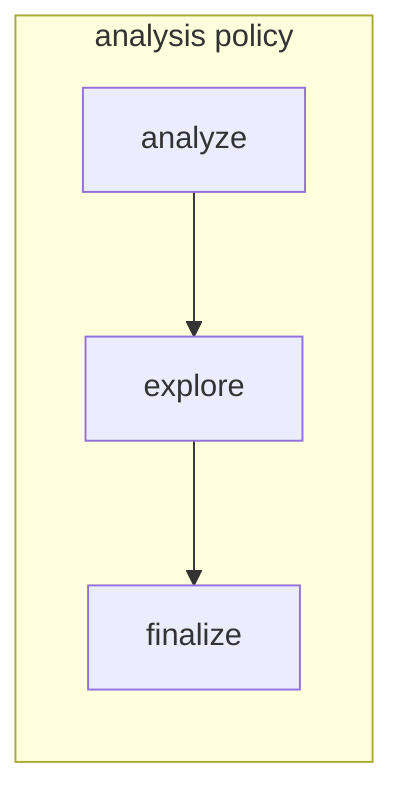
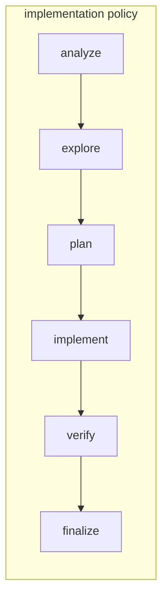
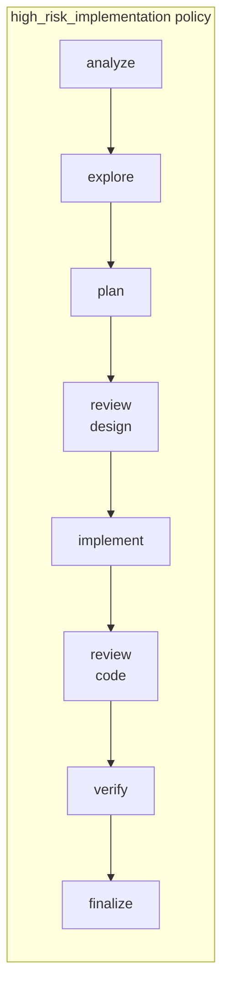

# Architecture Design Document

## Table of Contents

- [1. Overview](#1-overview)
- [2. Layer Architecture](#2-layer-architecture)
- [3. Component Details](#3-component-details)
  - [3.1 Orchestrator (Layer 1)](#31-orchestrator-layer-1--orchestration)
  - [3.2 Agent (Layer 2)](#32-agent-layer-2--execution)
  - [3.3 Skill (Layer 3)](#33-skill-layer-3--strategy)
  - [3.4 Tool (Layer 4a)](#34-tool-layer-4a--capability)
  - [3.5 MCP (Layer 4b)](#35-mcp-layer-4b--capability)
  - [3.6 LLM (Layer 5)](#36-llm-layer-5--intelligence)
- [4. Stage Specification](#4-stage-specification)
- [5. Data Structures](#5-data-structures)
- [6. Request Lifecycle](#6-request-lifecycle)
- [7. Orchestrator State Machine](#7-orchestrator-state-machine)
- [8. Key Design Patterns](#8-key-design-patterns)
- [9. Error Handling & Resilience](#9-error-handling--resilience)
- [10. Extensibility](#10-extensibility)

---

## 1. Overview

### System Goal & Design Philosophy

This system is a multi-layer AI Agent architecture designed to decompose complex software engineering tasks into structured, reviewable, and verifiable stages. Rather than relying on a single monolithic LLM call, the system separates concerns across five layers:

- **Orchestration** — *what* to do next and *who* does it
- **Execution** — *doing* the work via specialized agents
- **Strategy** — *how* to approach the work (workflow, constraints, output format)
- **Capability** — *what tools* are available (local and remote)
- **Intelligence** — *reasoning* and *generation* via LLMs

**One-line summary:** The Orchestrator decides "who does what", the Agent "executes", the Skill defines "how to do it", Tool/MCP provides "what to use", and the LLM is the "brain".

### System Overview Diagram



---

## 2. Layer Architecture

### 5-Layer Hierarchy



### Inter-Layer Communication Rules

| From → To | Allowed | Mechanism |
|-----------|---------|-----------|
| Layer 1 → Layer 2 | Yes | Orchestrator dispatches Agent with AgentContext |
| Layer 2 → Layer 1 | Yes | Agent returns result; Orchestrator reads updated BusContext |
| Layer 2 → Layer 3 | Yes | Agent loads Skill config to guide its behavior |
| Layer 2 → Layer 4 | Yes | Agent invokes Tools and MCP servers during execution |
| Layer 2 → Layer 5 | Yes | Agent calls LLM for reasoning and generation |
| Layer 3 → Layer 4 | No | Skills only *suggest* tools; Agents invoke them |
| Layer 4 → Layer 5 | No | Tools do not call LLM directly |
| Layer 1 → Layer 3/4/5 | No | Orchestrator does not bypass Agents |

**Key rule:** All tool invocation and LLM calls pass through **Layer 2 (Agent)**. The Orchestrator (Layer 1) never directly calls Tools, MCP, or LLM. Skills (Layer 3) are configuration, not executors.

---

## 3. Component Details

### 3.1 Orchestrator (Layer 1 — Orchestration)

#### Responsibilities

- **Agent selection** — choose which Agent to dispatch based on the current pipeline stage
- **Pipeline stage control** — manage progression through the state machine
- **Skill selection** — assign the appropriate Skill to the Agent (default from YAML, overridable at runtime)
- **Sub-Agent spawning** — fork concurrent sub-Agents when parallelism is beneficial
- **Execution state management** — maintain BusContext and TaskList as the shared state
- **Termination decision** — detect when the `finalize` stage (the only terminal stage) is reached

#### YAML-Driven State Machine

The Orchestrator is configured entirely via [`config/orchestrator.yaml`](../config/orchestrator.yaml). The configuration defines:

- **7 stages** with default Agent and Skill bindings
- **Priority-weighted transitions** between stages
- **3 task policies** that constrain which stages are active
- **Feature flags** for runtime behavior toggles

#### Stage Definitions

| Stage | Default Agent | Default Skill | Terminal | Requires Write |
|-------|---------------|---------------|----------|----------------|
| `analyze` | planner | task-analysis-skill | No | No |
| `explore` | explorer | repo-explore-skill | No | No |
| `plan` | planner | implementation-plan-skill | No | No |
| `review` | reviewer | design-review-skill / code-review-skill | No | No |
| `implement` | implementer | code-implement-skill | No | Yes |
| `verify` | verifier | verification-skill | No | No |
| `finalize` | finalizer | final-answer-skill | **Yes** | No |

> **Note:** The `review` stage serves dual roles — after `plan` it uses `design-review-skill` (plan review), after `implement` it uses `code-review-skill` (code review). The Orchestrator selects the Skill based on the preceding stage.

#### Transition Engine

The transition engine follows a deterministic evaluation process:

1. **Enumerate** all outgoing transitions from the current stage
2. **Filter** by task policy — remove transitions to stages not allowed by the active policy
3. **Filter** by feature flags — remove transitions to disabled stages (e.g., `verify` when `enable_verify: false`)
4. **Evaluate** runtime conditions — check `TaskState.Missing`, `ExecutionSignals`, and stage results
5. **Select** the highest-priority valid transition

#### Task Policy System

Task policies define stage subsets for different task types:

| Policy | Allowed Stages |
|--------|----------------|
| `analysis` | analyze → explore → finalize |
| `implementation` | analyze → explore → plan → implement → verify → finalize |
| `high_risk_implementation` | analyze → explore → plan → **design_review** → implement → **code_review** → verify → finalize |

#### Feature Flags

| Flag | Default | Effect |
|------|---------|--------|
| `enable_verify` | `true` | Enable/disable the verify stage globally |
| `require_review` | `true` | When true, use high_risk_implementation policy with review stages |
| `allow_skip_plan_for_small_change` | `false` | Allow small changes to jump from explore → implement |

#### Termination Detection

The pipeline terminates **only** when reaching the `finalize` stage (`terminal: true`). All other stages loop back through the Orchestrator for re-evaluation.

#### Decision Function (Pseudocode)

```
function decide_next_stage(bus_context):
    current = bus_context.TaskState.Stage
    missing = bus_context.TaskState.Missing
    policy  = get_active_policy(bus_context.TaskList)
    flags   = load_feature_flags()

    transitions = get_transitions(current)                  // from YAML
    transitions = filter_by_policy(transitions, policy)     // remove disallowed stages
    transitions = filter_by_flags(transitions, flags)       // remove disabled stages
    transitions = filter_by_signals(transitions, bus_context.Signals)  // runtime conditions
    transitions = sort_by_priority(transitions, descending)

    if transitions is empty:
        return "finalize"   // fallback: no valid transition → end

    return transitions[0].to
```

---

### 3.2 Agent (Layer 2 — Execution)

#### Responsibilities

- Receive a prompt (assembled from AgentContext + PromptContext)
- Call LLM for reasoning and generation
- Use Tools and MCP servers to interact with the environment
- Maintain a ReAct loop (Reason → Act → Observe) until the stage goal is met
- Produce structured output that updates BusContext

#### Lifecycle

```
init → receive_prompt → execute_loop → complete
```

1. **init** — Agent is instantiated with its AgentContext
2. **receive_prompt** — PromptContext is assembled from AgentContext + Skill config
3. **execute_loop** — ReAct cycle: LLM reasons → selects tool → executes → observes result → repeats
4. **complete** — Agent produces final output, Orchestrator updates BusContext

#### Agent Types

| Agent | Stages | Capabilities | Description |
|-------|--------|-------------|-------------|
| `planner` | analyze, plan | Read-only | Structures tasks and designs implementation plans |
| `explorer` | explore | Read-only | Browses codebase, collects facts, builds module maps |
| `implementer` | implement | **Read + Write** | Writes code, modifies files, generates patches |
| `reviewer` | review | Read-only | Reviews plans (design) and code (correctness) |
| `verifier` | verify | Read-only | Runs tests, lint, build checks |
| `finalizer` | finalize | Read-only | Summarizes results, produces final output |

#### Agent Execution Loop (ReAct)



#### Sub-Agent Concurrency

The Orchestrator may spawn multiple sub-Agents in parallel when tasks are independent. Each sub-Agent operates on its own AgentContext slice. Results are merged back into BusContext upon completion. The parent Agent (or Orchestrator) waits for all sub-Agents before proceeding.

---

### 3.3 Skill (Layer 3 — Strategy)

#### Responsibilities

- Define **workflow steps** for a specific type of work
- Suggest **which tools** to use (but not invoke them)
- Specify **output format** and schema
- State the **stage goal** clearly
- Declare **prohibitions** (what the Agent must NOT do)

#### Skill Inventory

| Skill | Stage | Purpose |
|-------|-------|---------|
| `task-analysis-skill` | analyze | Structurize and classify the user task |
| `repo-explore-skill` | explore | Browse codebase, collect facts, build module map |
| `cli-analysis-skill` | explore | Alternative: CLI-based analysis |
| `implementation-plan-skill` | plan | Design step-by-step implementation plan |
| `code-implement-skill` | implement | Write/modify code, generate patches |
| `design-review-skill` | review (post-plan) | Review plan feasibility, architecture impact, risks |
| `code-review-skill` | review (post-implement) | Review code correctness, bugs, style, side effects |
| `verification-skill` | verify | Run tests, lint, build, verify correctness |
| `final-answer-skill` | finalize | Produce final user-facing output |

#### Skill Definition Schema

```go
type SkillConfig struct {
    Name            string   // unique identifier, e.g. "repo-explore-skill"
    Goal            string   // what this skill aims to achieve
    Workflow        []string // ordered steps the Agent should follow
    ToolSuggestions []string // recommended tools (Agent decides whether to use)
    OutputFormat    string   // expected output structure (JSON schema or description)
    Prohibitions    []string // things the Agent must NOT do under this skill
}
```

#### Skill Selection Logic

1. **Default**: each stage has a `default_skill` in the YAML config
2. **Context override**: the `review` stage switches between `design-review-skill` and `code-review-skill` based on the preceding stage
3. **Runtime override**: the Orchestrator can override the Skill based on task-specific signals

---

### 3.4 Tool (Layer 4a — Capability)

#### Responsibilities

Execute local, deterministic operations on the host environment.

#### Tool Interface

```go
type Tool interface {
    Name()        string
    Description() string
    Parameters()  json.RawMessage  // JSON Schema
    Execute(params json.RawMessage) (ToolResult, error)
}
```

#### Built-in Tools

| Tool | Description |
|------|-------------|
| `exec_command` | Execute a shell command |
| `grep` | Search file contents by pattern |
| `read_file` | Read file contents |
| `write_file` | Write content to a file |
| `repo_map` | Generate repository structure map |
| `run_tests` | Execute test suite |
| `list_files` | List files in a directory |
| `git_diff` | Show git diff output |
| `git_log` | Show git commit history |

#### ToolResult Format

```go
type ToolResult struct {
    ToolName  string
    Summary   string    // human-readable summary
    RawRef    string    // reference to raw output (e.g., file path or key)
    Success   bool
    Timestamp time.Time
}
```

---

### 3.5 MCP (Layer 4b — Capability)

#### What is MCP?

**MCP (Model Context Protocol)** is a standardized protocol for connecting external systems to LLMs. MCP servers expose capabilities (tools, resources, prompts) that Agents can discover and invoke at runtime.

#### Responsibilities

- Bridge external services into the Agent's tool set
- Provide runtime discovery of available capabilities
- Handle authentication, transport, and serialization

#### MCP Server Interface

```go
type MCPServer interface {
    Name()        string
    Transport()   TransportType   // stdio | sse | http
    ListTools()   []ToolSchema
    CallTool(name string, params json.RawMessage) (MCPResponse, error)
}
```

#### Typical MCP Servers

| Server | Purpose | Example Operations |
|--------|---------|--------------------|
| GitHub | Repository operations | Create PR, read issues, review comments |
| Database | Data access | Query tables, inspect schemas |
| Notion | Documentation | Read/write pages, search workspace |
| Slack | Communication | Send messages, read channels |
| Browser | Web interaction | Fetch pages, screenshot, interact |
| API | Generic HTTP | Call any REST/GraphQL endpoint |

#### Transport Layer

| Transport | Use Case | Protocol |
|-----------|----------|----------|
| `stdio` | Local processes | stdin/stdout JSON-RPC |
| `sse` | Remote servers (streaming) | Server-Sent Events over HTTP |
| `http` | Remote servers (request/response) | HTTP POST JSON-RPC |

#### MCP vs Local Tools

| Aspect | Tool (Local) | MCP (External) |
|--------|-------------|----------------|
| Execution | In-process or local subprocess | Remote server |
| Discovery | Hardcoded at build time | Runtime discovery via `ListTools()` |
| Latency | Low | Variable (network-dependent) |
| State | Stateless | May be stateful (server-side) |
| Auth | None (local) | Token/OAuth/API key |

#### MCPResponse Format

```go
type MCPResponse struct {
    ServerName string
    Method     string
    Summary    string
    RawRef     string
    Success    bool
    Timestamp  time.Time
}
```

---

### 3.6 LLM (Layer 5 — Intelligence)

#### Responsibilities

- **Reasoning** — analyze context, plan actions, evaluate trade-offs
- **Decision-making** — choose which tool to call, when to stop, what to produce
- **Text generation** — produce code, plans, reviews, summaries, and final answers

#### LLM Adapter Interface

```go
type LLMAdapter interface {
    // Chat sends a prompt and returns the model's response.
    // messages: conversation history (system + developer + user messages)
    // tools: available tool schemas for function calling
    Chat(messages []Message, tools []ToolSchema) (LLMResponse, error)

    // ModelID returns the current model identifier.
    ModelID() string

    // MaxContextTokens returns the model's context window size.
    MaxContextTokens() int
}

type Message struct {
    Role    string // "system" | "developer" | "user" | "assistant" | "tool"
    Content string
}

type LLMResponse struct {
    Content    string
    ToolCalls  []ToolCall
    StopReason string
    Usage      TokenUsage
}
```

#### Model Selection & Fallback

The system supports multiple LLM backends with a fallback chain:

1. **Primary model** — high-capability model for complex reasoning (e.g., Claude Opus)
2. **Fast model** — lower-latency model for simple tasks (e.g., Claude Haiku)
3. **Fallback** — if the primary model is unavailable, fall back to the next tier

Model selection is determined by the Agent type and task complexity. The Orchestrator can override the model per stage via configuration.

#### Context Window Management

The PromptContext is assembled with token budget awareness:

1. **System sections** — always included (highest priority)
2. **Developer sections** — Skill instructions, constraints
3. **User sections** — task details, facts, history
4. **Tool results** — summarized to fit within budget

When context exceeds the window, older tool results and facts are compressed or dropped by priority.

---

## 4. Stage Specification

### 4.1 analyze — Task Understanding

> **Core:** Transform "user input" into "actionable task definition"

| Aspect | Detail |
|--------|--------|
| **Agent** | planner |
| **Skill** | task-analysis-skill |
| **Input** | User raw input, current BusContext (may be empty), conversation history (optional) |
| **Work** | Intent recognition (analysis / implement / fix / review), task type classification, generate objective, preliminary task decomposition (produce TaskList), extract constraints (read-only? must-verify? high-risk?) |
| **Output** | `{ task_type, objective, task_list, constraints, missing_piece }` |

### 4.2 explore — Fact Collection

> **Core:** Build a "trusted factual foundation"

| Aspect | Detail |
|--------|--------|
| **Agent** | explorer |
| **Skill** | repo-explore-skill or cli-analysis-skill |
| **Input** | Current TaskList / active task, repo path / branch, known facts (may be empty) |
| **Work** | Find code entry points (main / cmd / router), grep functions and configs, build module map, analyze call chains, query docs / MCP (GitHub / Docs / DB) |
| **Output** | `{ repo_facts, entrypoints, call_chains, relevant_files }` |

### 4.3 plan — Solution Design

> **Core:** Transform "what to do" into "how to do it"

| Aspect | Detail |
|--------|--------|
| **Agent** | planner |
| **Skill** | implementation-plan-skill |
| **Input** | Repo facts, current TaskList, constraints |
| **Work** | Design modification plan, identify files to change, define patch structure, assess impact scope, define verification approach |
| **Output** | `{ plan: { files_to_modify, steps, risks, validation } }` |

### 4.4 review (post-plan) — Design Review

> **Core:** Determine if the plan "is feasible and reasonable"

| Aspect | Detail |
|--------|--------|
| **Agent** | reviewer |
| **Skill** | design-review-skill |
| **Input** | Plan, repo facts, constraints |
| **Work** | Check requirement alignment, check architecture integrity, check edge cases, check security/performance risks, check for missing steps |
| **Output** | `{ review_result: pass/fail, issues, must_fix, suggestions }` |

### 4.5 implement — Implementation

> **Core:** Transform the plan into actual code/config changes

| Aspect | Detail |
|--------|--------|
| **Agent** | implementer |
| **Skill** | code-implement-skill |
| **Input** | Plan, repo facts, constraints |
| **Work** | Write code, modify configs, generate patch/diff, invoke tools (exec / file write / MCP) |
| **Output** | `{ patch, modified_files, implementation_notes }` |

### 4.6 review (post-implement) — Code Review

> **Core:** Determine if the code "is correct and has no pitfalls"

| Aspect | Detail |
|--------|--------|
| **Agent** | reviewer |
| **Skill** | code-review-skill |
| **Input** | Patch, original plan, repo facts |
| **Work** | Check plan conformance, check bugs / edge cases, check code style, check side effects, check compatibility |
| **Output** | `{ review_result: pass/fail, code_issues, must_fix }` |

### 4.7 verify — Verification

> **Core:** Prove "this thing actually works"

| Aspect | Detail |
|--------|--------|
| **Agent** | verifier |
| **Skill** | verification-skill |
| **Input** | Patch, verification plan (from plan stage) |
| **Work** | Compile (go build), unit tests, lint, smoke tests, runtime verification |
| **Output** | `{ verification_result: pass/fail, logs, errors, next_action: fix/explore }` |

### 4.8 finalize — Output Convergence

> **Core:** Compile all results into "usable final output for the user"

| Aspect | Detail |
|--------|--------|
| **Agent** | finalizer |
| **Skill** | final-answer-skill |
| **Input** | All stage artifacts, TaskList, verification result |
| **Work** | Summarize changes, generate final description, output patch / usage instructions, update BusContext, mark tasks complete |
| **Output** | Final answer (code + description + action steps) |

---

## 5. Data Structures

### Design Principle

> **BusContext is not the model context itself.** It is the runtime fact source used to construct Agent-specific model contexts. The flow is:
>
> `BusContext` (full shared state) → trim → `AgentContext` (Agent-scoped view) → assemble → `PromptContext` (model prompt payload) → send to LLM

### Enum Types

Defined in the Go `runtime` package:

```go
type PipelineStage string
const (
    StageAnalyze      PipelineStage = "analyze"
    StageExplore      PipelineStage = "explore"
    StagePlan         PipelineStage = "plan"
    StageDesignReview PipelineStage = "design_review"
    StageImplement    PipelineStage = "implement"
    StageCodeReview   PipelineStage = "code_review"
    StageVerify       PipelineStage = "verify"
    StageFinalize     PipelineStage = "finalize"
)

type AgentName string
const (
    AgentPlanner        AgentName = "planner"
    AgentExplorer       AgentName = "explorer"
    AgentDesignReviewer AgentName = "design_reviewer"
    AgentCodeReviewer   AgentName = "code_reviewer"
    AgentImplementer    AgentName = "implementer"
    AgentVerifier       AgentName = "verifier"
    AgentFinalizer      AgentName = "finalizer"
)

type TaskStatus string
const (
    TaskPending    TaskStatus = "pending"
    TaskInProgress TaskStatus = "in_progress"
    TaskDone       TaskStatus = "done"
    TaskBlocked    TaskStatus = "blocked"
    TaskFailed     TaskStatus = "failed"
)

type TaskType string
const (
    TaskTypeUnknown        TaskType = "unknown"
    TaskTypeAnalysis       TaskType = "analysis"
    TaskTypePlanning       TaskType = "planning"
    TaskTypeImplementation TaskType = "implementation"
    TaskTypeReview         TaskType = "review"
    TaskTypeVerification   TaskType = "verification"
)
```

### Three-Layer Context Model

```
BusContext (full shared state)
    ↓ trim
AgentContext (Agent-scoped view)
    ↓ assemble
PromptContext (model prompt payload)
    ↓ send
LLM
```

#### Layer 1: BusContext — Full Shared State

```go
type BusContext struct {
    // Top-level task progression
    TaskList  TaskList
    TaskState TaskState

    // Current runtime state
    PipelineStage PipelineStage
    ActiveAgent   AgentName

    // Repository / environment info
    RepoRoot  string
    Branch    string
    Commit    string
    ModuleMap []string

    // Shared facts
    RepoFacts    []RepoFact
    ToolResults  []ToolResult
    MCPResponses []MCPResponse

    // Signals & policy
    Signals ExecutionSignals
    Policy  PolicyContext

    // General constraints
    Constraints []string
    Preferences []string

    // Failure / recovery info
    LastTransitionReason string
    TraceID              string
}
```

#### Layer 2: AgentContext — Agent-Scoped View

```go
type AgentContext struct {
    AgentName AgentName
    Stage     PipelineStage

    // Task view
    Objective       string
    CurrentTaskID   string
    CurrentTask     string
    CurrentTaskType TaskType

    // Trimmed results relevant to this Agent
    RelevantFacts         []string
    RelevantFiles         []string
    RelevantToolSummaries []string
    RelevantMCPNotes      []string

    // Summaries from prior stages
    PlanSummary         string
    PatchSummary        string
    ReviewSummary       string
    VerificationSummary string

    // Control info
    Constraints []string
    Preferences []string

    // Current gap
    MissingPiece MissingPiece

    // Source info
    RepoRoot string
    Branch   string
    Commit   string
}
```

#### Layer 3: PromptContext — Model Prompt Payload

```go
type PromptSection struct {
    Title   string
    Content string
}

type PromptContext struct {
    SystemSections    []PromptSection
    DeveloperSections []PromptSection
    UserSections      []PromptSection

    // Tool schemas available to the model
    EnabledTools []string

    // Metadata for debugging
    AgentName AgentName
    Stage     PipelineStage
    SkillName string
}
```

### Supporting Data Structures

#### TaskItem / TaskList

```go
type TaskItem struct {
    ID          string
    Title       string
    Description string
    Type        TaskType
    Status      TaskStatus
    DependsOn   []string
    Result      string
}

type TaskList struct {
    Objective     string
    Tasks         []TaskItem
    CurrentTaskID string
}
```

`TaskList.CurrentTask()` returns the `TaskItem` currently being executed.

#### MissingPiece / TaskState

The Orchestrator's core decision input — "where are we + what's missing".

```go
type MissingPiece string
const (
    MissingNone          MissingPiece = "none"
    MissingUnderstanding MissingPiece = "understanding"
    MissingFacts         MissingPiece = "facts"
    MissingPlan          MissingPiece = "plan"
    MissingCode          MissingPiece = "code"
    MissingReview        MissingPiece = "review"
    MissingVerification  MissingPiece = "verification"
)

type TaskState struct {
    Stage        PipelineStage
    Missing      MissingPiece
    Completed    []string
    Remaining    []string
    LastDecision string
    LastError    string
    IsTerminal   bool
}
```

The `Missing` field drives the Orchestrator's transition decision: choose the next stage based on what is missing.

#### RepoFact

```go
type RepoFact struct {
    Key        string
    Value      string
    Source     string
    Confidence float64
}
```

#### ToolResult / MCPResponse

```go
type ToolResult struct {
    ToolName  string
    Summary   string
    RawRef    string
    Success   bool
    Timestamp time.Time
}

type MCPResponse struct {
    ServerName string
    Method     string
    Summary    string
    RawRef     string
    Success    bool
    Timestamp  time.Time
}
```

#### ExecutionSignals

Boolean flags in BusContext that drive Orchestrator decisions.

```go
type ExecutionSignals struct {
    HasEnoughFacts     bool
    HasPlan            bool
    HasPatch           bool
    ReviewPassed       bool
    VerificationPassed bool
    LastStageFailed    bool
    LastFailureReason  string
    RetryCount         int
}
```

#### PolicyContext

```go
type PolicyContext struct {
    AllowWrite          bool
    RequireReview       bool
    RequireVerification bool
    MaxRetriesPerStage  int
}
```

#### StageConfig

Loaded from YAML at startup.

```go
type StageConfig struct {
    Name          PipelineStage
    DefaultAgent  AgentName
    DefaultSkill  string
    Terminal      bool
    RequiresWrite bool
}
```

#### Transition / TaskPolicy

```go
// Transition is a directed edge between stages with priority.
// Filtered by task policy and evaluated against runtime conditions.
type Transition struct {
    From     PipelineStage
    To       PipelineStage
    Priority int
}

// TaskPolicy defines the allowed stages for a given task type.
type TaskPolicy struct {
    Name          string
    AllowedStages []PipelineStage
    Constraints   []string
}
```

---

## 6. Request Lifecycle

### End-to-End Sequence Diagram



### Step-by-Step State Machine Walkthrough

1. **User request arrives** → Orchestrator creates initial BusContext
2. **`analyze`** — Planner Agent + task-analysis-skill: parse intent, classify task type, generate TaskList, identify constraints and missing pieces
3. **Orchestrator re-evaluates** — reads `TaskState.Missing`:
   - `MissingFacts` → route to `explore` (priority 100)
   - `MissingPlan` → route to `plan` (priority 80)
   - `MissingNone` → route to `finalize` (priority 20)
4. **`explore`** — Explorer Agent + repo-explore-skill: browse code, build fact base
5. **Orchestrator re-evaluates** — facts collected:
   - Route to `plan` (priority 100)
   - Or self-loop `explore` if more facts needed (priority 30)
6. **`plan`** — Planner Agent + implementation-plan-skill: design the implementation plan
7. **Orchestrator re-evaluates** — plan exists:
   - Route to `implement` (priority 100)
   - Or route to `review` if high-risk (priority 70)
   - Or backtrack to `explore` if facts insufficient (priority 60)
8. **`review` (design)** — Reviewer Agent + design-review-skill: review plan feasibility *(only for high_risk_implementation policy)*
9. **`implement`** — Implementer Agent + code-implement-skill: write code, generate patches
10. **Orchestrator re-evaluates** — patch exists:
    - Route to `verify` (priority 100)
    - Or route to `review` for code review (priority 70)
11. **`review` (code)** — Reviewer Agent + code-review-skill: review code correctness *(only for high_risk_implementation policy)*
12. **`verify`** — Verifier Agent + verification-skill: run tests, lint, build
13. **Orchestrator re-evaluates** — verification result:
    - Pass → route to `finalize` (priority 100)
    - Fail → route back to `implement` (priority 80)
14. **`finalize`** — Finalizer Agent + final-answer-skill: compile final output → return to user

---

## 7. Orchestrator State Machine

### Complete State Machine Diagram

```mermaid
stateDiagram-v2
    [*] --> analyze

    analyze --> explore : priority 100
    analyze --> plan : priority 80
    analyze --> finalize : priority 20

    explore --> plan : priority 100
    explore --> finalize : priority 40
    explore --> explore : priority 30 (self-loop)

    plan --> implement : priority 100
    plan --> review : priority 70
    plan --> explore : priority 60 (backtrack)

    implement --> verify : priority 100
    implement --> review : priority 70
    implement --> plan : priority 50 (backtrack)

    verify --> finalize : priority 100
    verify --> implement : priority 80 (fix & retry)

    finalize --> [*]

    note right of review : Dual role:<br/>post-plan = design-review-skill<br/>post-implement = code-review-skill
```

### Task Policy Overlay







### YAML Configuration Reference

The complete Orchestrator configuration is maintained in [`config/orchestrator.yaml`](../config/orchestrator.yaml). That file is the authoritative source for stage definitions, transitions, task policies, and feature flags.

---

## 8. Key Design Patterns

### State Machine Pattern (Orchestrator)

The Orchestrator implements a **finite state machine** where:
- **States** = pipeline stages (analyze, explore, plan, review, implement, verify, finalize)
- **Transitions** = priority-weighted directed edges between stages
- **Guards** = task policies, feature flags, and runtime conditions filter transitions
- **Actions** = dispatch the appropriate Agent with the correct Skill

This pattern ensures deterministic, auditable pipeline progression while supporting backtracking and conditional paths.

### ReAct Loop (Agent)

Each Agent follows the **ReAct (Reason + Act)** pattern:
1. **Reason** — LLM analyzes the current state and decides the next action
2. **Act** — Agent invokes the chosen Tool or MCP
3. **Observe** — Agent processes the result and updates its working state
4. Repeat until the stage goal is met

This pattern allows Agents to handle dynamic, multi-step tasks without hardcoded logic.

### Strategy Pattern (Skill)

Skills implement the **Strategy pattern** — the same Agent can exhibit different behavior by swapping its Skill configuration. For example, the `reviewer` Agent uses `design-review-skill` or `code-review-skill` depending on context, without any code change.

### Adapter Pattern (Tool / MCP)

Both Tools and MCP servers implement a uniform interface (`Execute` / `CallTool`), allowing Agents to invoke them interchangeably. The Adapter pattern hides the differences between local execution and remote MCP calls behind a common abstraction.

### Pipeline with Backtracking

Unlike a linear pipeline, this system supports **non-linear flow**:
- **Forward progression** — the default path through stages
- **Backtracking** — return to an earlier stage when new information invalidates prior work (e.g., `implement → plan` when the plan needs revision)
- **Self-loops** — repeat a stage when more work is needed (e.g., `explore → explore`)
- **Skip paths** — jump over stages when they're unnecessary (e.g., `analyze → finalize` for simple questions)

---

## 9. Error Handling & Resilience

### Inter-Layer Error Propagation

| Error Source | Handling |
|-------------|----------|
| Tool failure | ToolResult.Success = false; Agent observes and retries or uses alternative tool |
| MCP failure | MCPResponse.Success = false; Agent falls back to local tools if available |
| LLM failure | LLMAdapter retries with exponential backoff; falls back to secondary model |
| Agent failure | Orchestrator receives error; sets `LastStageFailed = true`, evaluates backtrack transition |
| Stage failure | Orchestrator increments `RetryCount`; re-enters stage or backtracks |

### Agent Retry & Fallback

- Agents have a configurable retry budget per stage (`PolicyContext.MaxRetriesPerStage`)
- On failure, the Agent can:
  1. Retry the same tool with modified parameters
  2. Try an alternative tool
  3. Report failure to the Orchestrator (which may backtrack)

### Tool / MCP Timeout Handling

- Each tool invocation has a configurable timeout
- On timeout: ToolResult is marked as failed with a timeout reason
- The Agent observes the timeout and decides whether to retry or proceed without the result

### Graceful Degradation

- If MCP servers are unavailable, Agents fall back to local Tools
- If the primary LLM is unavailable, the system falls back to a secondary model
- If a non-critical stage fails repeatedly, the Orchestrator may skip it (e.g., skip `verify` after max retries and proceed to `finalize` with a warning)

### Stage-Level Retry (Orchestrator)

The Orchestrator can re-enter a failed stage by routing back to it via backtrack transitions:
- `implement → plan` — if implementation reveals a flawed plan
- `verify → implement` — if verification fails and code needs fixing
- `explore → explore` — self-loop to gather additional facts

The `RetryCount` in `ExecutionSignals` prevents infinite loops.

---

## 10. Extensibility

### Adding a New Tool

1. Implement the `Tool` interface:
   ```go
   type MyTool struct{}
   func (t *MyTool) Name() string        { return "my_tool" }
   func (t *MyTool) Description() string  { return "Does something useful" }
   func (t *MyTool) Parameters() json.RawMessage { return schema }
   func (t *MyTool) Execute(params json.RawMessage) (ToolResult, error) { ... }
   ```
2. Register it in the tool registry
3. Reference it in relevant Skill `ToolSuggestions`

### Adding a New MCP Server

1. Implement the `MCPServer` interface or use an existing MCP-compliant server
2. Configure the transport (stdio / SSE / HTTP) and connection details
3. The system discovers available tools at runtime via `ListTools()`

### Creating a New Skill

1. Define a `SkillConfig` with goal, workflow steps, tool suggestions, output format, and prohibitions
2. Register it in the skill registry
3. Bind it to a stage in `orchestrator.yaml` (either as default or as an override)

### Custom Agent Type

1. Define the new Agent with its stage bindings and capabilities (read-only vs. read-write)
2. Register it in the agent registry
3. Add it to the `agents` section in `orchestrator.yaml`
4. Bind it to a stage as `default_agent`

### Adding a New Pipeline Stage

1. Add the stage constant to `PipelineStage`
2. Define the stage in `orchestrator.yaml` with default Agent, Skill, and terminal flag
3. Add transitions (with priorities) from/to the new stage
4. Update task policies to include the new stage where appropriate
5. Create or assign a Skill for the new stage
