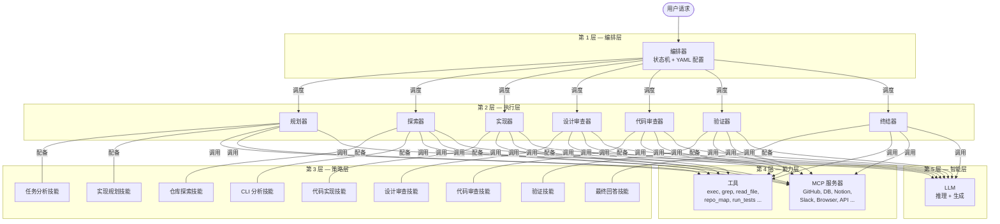
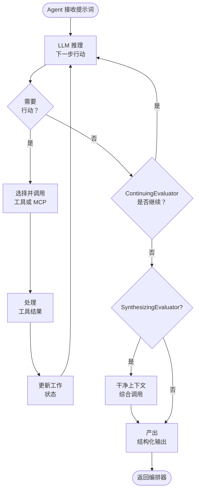
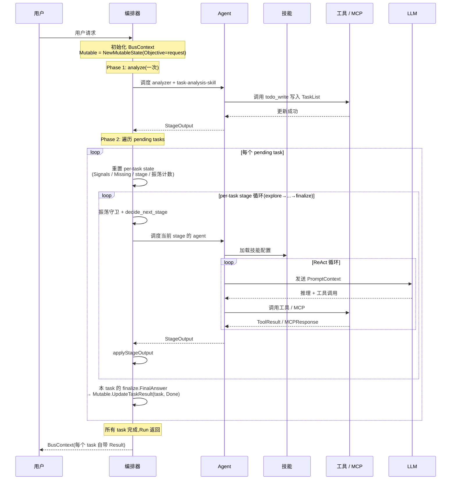
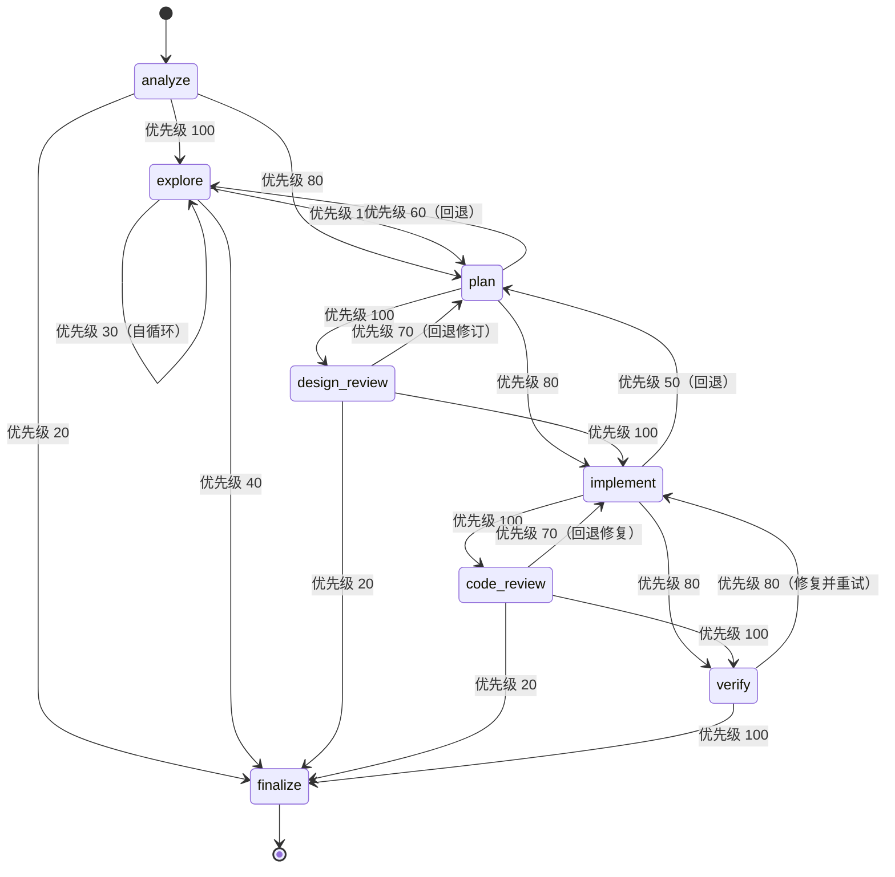
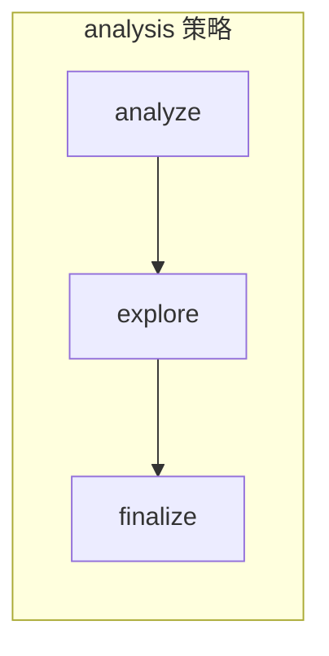
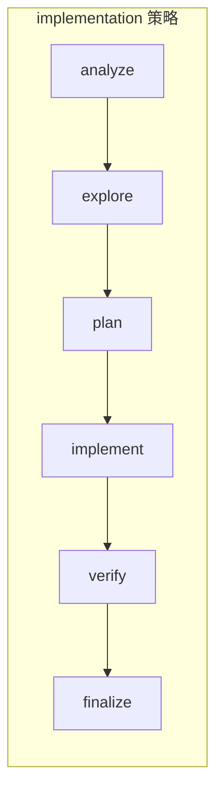
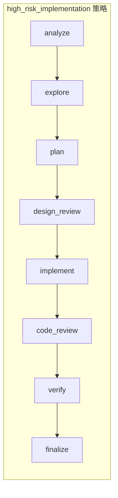

# 架构设计文档

## 目录

- [1. 概述](#1-概述)
- [2. 层级架构](#2-层级架构)
- [3. 组件详情](#3-组件详情)
  - [3.1 编排器（第 1 层）](#31-编排器第-1-层--编排层)
  - [3.2 Agent（第 2 层）](#32-agent第-2-层--执行层)
  - [3.3 技能（第 3 层）](#33-技能第-3-层--策略层)
  - [3.4 工具（第 4a 层）](#34-工具第-4a-层--能力层)
  - [3.5 MCP（第 4b 层）](#35-mcp第-4b-层--能力层)
  - [3.6 LLM（第 5 层）](#36-llm第-5-层--智能层)
- [4. 阶段规范](#4-阶段规范)
- [5. 数据结构](#5-数据结构)
- [6. 请求生命周期](#6-请求生命周期)
- [7. 编排器状态机](#7-编排器状态机)
- [8. 关键设计模式](#8-关键设计模式)
  - [调查与结构化分离（Turn A / Turn B 双 Agent）](#调查与结构化分离turn-a--turn-b-双-agent)
  - [runtime file coverage](#runtime-file-coverage)
  - [反过拟合设计原则](#反过拟合设计原则)
- [9. 错误处理与容错](#9-错误处理与容错)
- [10. 可扩展性](#10-可扩展性)

---

## 1. 概述

### 系统目标与设计哲学

本系统是一个多层 AI Agent 架构，旨在将复杂的软件工程任务分解为结构化、可审查、可验证的阶段。系统不依赖单次 LLM 调用，而是将关注点分离到五个层级：

- **编排层** — *做什么*以及*谁来做*
- **执行层** — 通过专业 Agent *执行*工作
- **策略层** — *如何*完成工作（工作流、约束、输出格式）
- **能力层** — *有哪些工具*可用（本地和远程）
- **智能层** — 通过 LLM 进行*推理*和*生成*

**一句话总结：** 编排器决定"谁做什么"，Agent"执行"，技能定义"怎么做"，工具/MCP 提供"用什么"，LLM 是"大脑"。

### 系统概览图



---

## 2. 层级架构

### 5 层层级结构


### 层间通信规则

| 从 → 到 | 是否允许 | 机制 |
|----------|----------|------|
| 第 1 层 → 第 2 层 | 是 | 编排器通过 AgentContext 调度 Agent |
| 第 2 层 → 第 1 层 | 是 | Agent 返回结果；编排器读取更新后的 BusContext |
| 第 2 层 → 第 3 层 | 是 | Agent 加载技能配置来指导其行为 |
| 第 2 层 → 第 4 层 | 是 | Agent 在执行过程中调用工具和 MCP 服务器 |
| 第 2 层 → 第 5 层 | 是 | Agent 调用 LLM 进行推理和生成 |
| 第 3 层 → 第 4 层 | 否 | 技能只*建议*工具；Agent 负责调用 |
| 第 4 层 → 第 5 层 | 否 | 工具不直接调用 LLM |
| 第 1 层 → 第 3/4/5 层 | 否 | 编排器不绕过 Agent |

**关键规则：** 所有工具调用和 LLM 调用都通过**第 2 层（Agent）**进行。编排器（第 1 层）永远不直接调用工具、MCP 或 LLM。技能（第 3 层）是配置，不是执行者。

---

## 3. 组件详情

### 3.1 编排器（第 1 层 — 编排层）

#### 职责

- **Agent 选择** — 根据当前流水线阶段选择要调度的 Agent
- **流水线阶段控制** — 管理状态机中的阶段推进
- **技能选择** — 为 Agent 分配适当的技能（YAML 默认值，可在运行时覆盖)
- **子 Agent 派生** — 在并行有益时派生并发子 Agent
- **执行状态管理** — 维护 BusContext 和 TaskList 作为共享状态
- **终止决策** — 任务循环穷尽 + 全局 `pipeline_max_steps` 守护

#### 两阶段执行模型

`Run()` 分两个阶段:

1. **Phase 1 — analyze 阶段**: 调度 `analyze` 一次。analyzer 通过 `emit_analysis` 工具输出 v3 `RequestModel`（intent / scenario / complexity / writing / keywords / entities / question_kind / answer_shape），`ParseOutput` 随后确定性地跑 `normalizer → compiler → risk → hdp → counterfactual → gate` 管线组装完整 `AnalysisIR`（含 TaskGraph / EvidencePlan / AnswerContract / Hypotheses / RunPolicy）并写入 `BusContext.AnalysisIR`
2. **Phase 2 — 任务循环**: 遍历所有 pending 的 task。每个 task 走 DAG 驱动的 `runTaskGraph`（基于 `AnalysisIR.TaskGraph` 调度 probe/evidence/validate/reconcile/finalize 节点,finalize 节点后跑 `contract.Check` 对答案做结构验证,违规则 requeue 探索窗口）。analyze 阶段失败未能产出 IR 时回退到 `runTaskPipelineLegacy` 的线性状态机

每个 task 进入循环时**重置 per-task state**:
- `Signals` 清空
- `MissingPiece` 重置为 `MissingFacts`
- `PipelineStage` 重置为 `StageExplore`
- `stageVisits` 计数器清零

每个 task **共享的状态**(跨 task 累积):
- `RepoFacts / ToolResults / MCPResponses` — 探索成果可被后续 task 利用
- `Mutable.TaskList` — 工作面板,工具更新对所有 task 可见

每个 task 的 `finalize` stage 把它的答案写入该 task 的 `Result` 字段(通过 `Mutable.UpdateTaskResult`),并标记 `Status = TaskDone`。`main.go` 渲染时遍历 `Tasks` 展示每个任务的独立结果。

`pipeline_max_steps` 是**全 Run 的总预算**,跨 phase 1 和 phase 2;`pipeline_max_stage_visits` 振荡守卫是 **per-task 计数**——每进入一个新 task 就清零。两者都在 `config/codrax.yaml` 配置。

#### YAML 驱动的状态机

编排器**拓扑**完全通过 [`config/orchestrator.yaml`](../config/orchestrator.yaml) 配置——stages、transitions、policies、agent/skill 绑定。**运行时行为**（步数预算、振荡守卫、verify/review 开关）则在 [`config/codrax.yaml`](../config/codrax.yaml.example) 的 `pipeline_*` 键里配置。

orchestrator.yaml 定义了：

- **8 个阶段**，带有默认 Agent 和技能绑定
- **优先级加权的转换规则**
- **3 种任务策略**，约束哪些阶段处于活动状态

#### 阶段定义

| 阶段 | 默认 Agent | 默认技能 | 是否终止 | 需要写权限 |
|------|-----------|----------|----------|-----------|
| `analyze` | 分析器 | task-analysis-skill | 否 | 否 |
| `explore` | 探索器 | repo-explore-skill | 否 | 否 |
| `plan` | 规划器 | implementation-plan-skill | 否 | 否 |
| `design_review` | 设计审查器 | design-review-skill | 否 | 否 |
| `implement` | 实现器 | code-implement-skill | 否 | 是 |
| `code_review` | 代码审查器 | code-review-skill | 否 | 否 |
| `verify` | 验证器 | verification-skill | 否 | 否 |
| `finalize` | 终结器 | final-answer-skill | **是** | 否 |

> **注意：** `design_review` 和 `code_review` 是两个独立的阶段，分别由独立的 Agent 负责。`design_review` 在 `plan` 之后审查方案可行性，`code_review` 在 `implement` 之后审查代码正确性。每个阶段产出独立的通过/失败信号（`DesignReviewPassed` / `CodeReviewPassed`）。

#### 转换引擎

转换引擎遵循确定性评估流程：

1. **枚举**当前阶段的所有出口转换
2. **按任务策略过滤** — 移除策略不允许的阶段转换
3. **按功能开关过滤** — 移除已禁用阶段的转换（如 `enable_verify: false` 时的 `verify`）
4. **评估**运行时条件 — 检查 `TaskState.Missing`、`ExecutionSignals` 和阶段结果
5. **选择**最高优先级的有效转换

#### 任务策略系统

任务策略为不同任务类型定义阶段子集：

| 策略 | 允许的阶段 |
|------|-----------|
| `analysis` | analyze → explore → finalize |
| `implementation` | analyze → explore → plan → implement → verify → finalize |
| `high_risk_implementation` | analyze → explore → plan → **design_review** → implement → **code_review** → verify → finalize |

#### 功能开关

这些开关都在 `config/codrax.yaml` 中以 `pipeline_*` 前缀配置：

| 开关 | 默认值 | 效果 |
|------|--------|------|
| `pipeline_enable_verify` | `true` | 全局启用/禁用验证阶段 |
| `pipeline_require_review` | `true` | 为 true 时使用包含 design_review 和 code_review 阶段的 high_risk_implementation 策略 |
| `pipeline_allow_skip_plan_for_small_change` | `false` | 允许小改动从 explore 直接跳到 implement |
| `pipeline_max_retries_per_stage` | `3` | 单个阶段连续失败多少次后强制跳到 finalize |
| `pipeline_max_stage_visits` | `4` | 振荡守卫：单 task 内单一阶段最多被进入几次 |
| `pipeline_max_steps` | `50` | 全局 Run() 步数预算，超过则强制 finalize 兜底 |

#### 终止检测

整个 `Run()` 在任务队列被清空(所有 task 进入 `Done` / `Failed`)或全局 `pipeline_max_steps` 预算用尽时终止。**单个 task 的 mini-pipeline** 在到达 `finalize` 阶段(`terminal: true`)时自然结束——finalize 只是 per-task terminal,不是整个 Run 的 terminal。如果 per-task 循环在到达 finalize 之前就耗尽了预算或被振荡守卫(`pipeline_max_stage_visits`)打断,orchestrator 会强制跑一次 finalize 兜底,把 LastError 写到 `task.Result` 里,然后继续处理下一个 task。

#### 决策函数(伪代码)

以下是 per-task mini-pipeline 内部的 stage 转移逻辑,`runTaskPipeline` 在每一步调用:

```
function decide_next_stage(bus_context):
    current = bus_context.TaskState.Stage
    missing = bus_context.TaskState.Missing
    policy  = get_active_policy(bus_context.TaskList)
    flags   = load_feature_flags()

    transitions = get_transitions(current)                  // 从 YAML 获取
    transitions = filter_by_policy(transitions, policy)     // 移除不允许的阶段
    transitions = filter_by_flags(transitions, flags)       // 移除已禁用的阶段
    transitions = filter_by_signals(transitions, bus_context.Signals)  // 运行时条件
    transitions = sort_by_priority(transitions, descending)

    if transitions is empty:
        return "finalize"   // 兜底：无有效转换 → 结束

    return transitions[0].to
```

---

### 3.2 Agent（第 2 层 — 执行层）

#### 职责

- 接收提示词（由 AgentContext + PromptContext 组装）
- 调用 LLM 进行推理和生成
- 使用工具和 MCP 服务器与环境交互
- 维护 ReAct 循环（推理 → 行动 → 观察）直到阶段目标达成
- 产出结构化输出，更新 BusContext

#### 生命周期

```
init → receive_prompt → execute_loop → complete
```

1. **init** — Agent 使用其 AgentContext 实例化
2. **receive_prompt** — 从 AgentContext + 技能配置组装 PromptContext
3. **execute_loop** — ReAct 循环：LLM 推理 → 选择工具 → 执行 → 观察结果 → 重复
4. **complete** — Agent 产出最终输出，编排器更新 BusContext

#### Agent 类型

| Agent | 阶段 | 能力 | 描述 |
|-------|------|------|------|
| `analyzer`（分析器） | analyze | 只读 | 通过 emit_analysis 输出 v3 RequestModel，ParseOutput 跑 normalizer/compiler/risk/hdp/gate 产出 AnalysisIR |
| `planner`（规划器） | plan | 只读 | 设计实现方案 |
| `explorer`（探索器，Turn A） | explore | 只读 | 调查 + 证据收集。内部两阶段（Phase 0 broad scan → Phase 1 depth read）+ emit_evidence。独占 EvidenceItems/AnswerChains/FlowFindings 的写入，并把投影快照写入 TurnAArtifacts 供 Turn B 读 |
| `extractor`（提取器，Turn B） | extract | 只读 | One-shot LLM 调用，读 TurnAArtifacts digest，独占 emit_answer_symbol（带完备性 claim + Phase 9 cardinality validator）+ emit_hypothesis_verdict（带 citation）。禁止文件 IO，禁止 emit_evidence |
| `implementer`（实现器） | implement | **读 + 写** | 编写代码，修改文件，生成补丁 |
| `design_reviewer`（设计审查器） | design_review | 只读 | 审查方案可行性、架构影响、风险 |
| `code_reviewer`（代码审查器） | code_review | 只读 | 审查代码正确性、缺陷、风格、副作用 |
| `verifier`（验证器） | verify | 只读 | 运行测试、lint、构建检查 |
| `finalizer`（终结器） | finalize | 只读 | 汇总结果，跑 contract check，产出最终输出（legacy prose 或 AnswerDocument） |

#### Agent 执行循环（ReAct）



#### 可选接口

BaseAgent 提供三个可选接口，Evaluator 可选择性实现以定制 ReAct 循环行为：

| 接口 | 用途 | 实现者 |
|------|------|--------|
| `ContinuingEvaluator` | 当 LLM 产出纯文本（无工具调用）时拦截 soft-stop，注入 continuation prompt 推动继续调查 | 探索器 |
| `SynthesizingEvaluator` | ReAct 循环结束后，用干净上下文做一次专门的综合调用，将所有 tool results 综合为最终回答 | 探索器 |

**调查与综合分离**（SynthesizingEvaluator 的设计动机）：ReAct 循环混合了调查（工具调用）和综合（文本输出）。continuation push 后，最后一条 assistant 消息往往是关于最后一次检查的碎片笔记，而不是综合性回答。SynthesizingEvaluator 将两者彻底分离——ReAct 循环只负责调查和收集证据，综合步骤在循环结束后用全部 evidence digest 做一次干净的 LLM 调用，产出最终 StageReport。

#### 子 Agent 并发

编排器可以在任务相互独立时并行派生多个子 Agent。每个子 Agent 在自己的 AgentContext 切片上操作。结果在完成时合并回 BusContext。父 Agent（或编排器）等待所有子 Agent 完成后再继续。

---

### 3.3 技能（第 3 层 — 策略层）

#### 职责

- 定义特定类型工作的**工作流步骤**
- 建议**使用哪些工具**（但不调用它们）
- 指定**输出格式**和模式
- 明确声明**阶段目标**
- 声明**禁止事项**（Agent 不得做的事情）

#### 技能清单

| 技能 | 阶段 | 用途 |
|------|------|------|
| `task-analysis-skill` | analyze | 结构化和分类用户任务 |
| `repo-explore-skill` | explore | 浏览代码库，收集事实，构建模块映射 |
| `implementation-plan-skill` | plan | 设计分步实现方案 |
| `code-implement-skill` | implement | 编写/修改代码，生成补丁 |
| `design-review-skill` | design_review | 审查方案可行性、架构影响、风险 |
| `code-review-skill` | code_review | 审查代码正确性、缺陷、风格、副作用 |
| `verification-skill` | verify | 运行测试、lint、构建、验证正确性 |
| `final-answer-skill` | finalize | 产出面向用户的最终输出 |

#### 技能定义模式

```go
type SkillConfig struct {
    Name            string   // 唯一标识符，如 "repo-explore-skill"
    Goal            string   // 此技能的目标
    Workflow        []string // Agent 应遵循的有序步骤
    ToolSuggestions []string // 推荐的工具（Agent 决定是否使用）
    OutputFormat    string   // 期望的输出结构（JSON Schema 或描述）
    Prohibitions    []string // Agent 在此技能下不得做的事情
}
```

#### 技能选择逻辑

1. **默认**：每个阶段在 YAML 配置中有一个 `default_skill`（如 `design_review` 阶段默认使用 `design-review-skill`，`code_review` 阶段默认使用 `code-review-skill`）
2. **运行时覆盖**：编排器可以根据任务特定信号覆盖技能

---

### 3.4 工具（第 4a 层 — 能力层）

#### 职责

在宿主环境上执行本地、确定性的操作。

#### 工具接口

```go
type Tool interface {
    Name()        string
    Description() string
    Parameters()  json.RawMessage  // JSON Schema
    Execute(ctx *types.BusContext, params json.RawMessage) (ToolResult, error)
    IsWrite()     bool  // 是否需要文件系统写权限(对齐 requires_write 边界)
}
```

工具通过嵌入 `tool.ReadOnly` 或 `tool.WriteCapable` mixin 来满足 `IsWrite()`。Execute 收到的 `*BusContext` 是窄视图:只有 `RepoRoot`/`Branch`/`Commit` 和 `Mutable` 区域被填充,其他字段为零值,从而物理上隔离工具只能改可变域。

#### 内置工具

| 工具 | 读/写 | 描述 |
|------|------|------|
| `exec_command` | 读 | 执行 shell 命令(dual-use,当前按 read-only 处理,shell 级的写限制靠外部沙箱) |
| `grep` | 读 | 按模式搜索文件内容 |
| `read_file` | 读 | 读取文件内容 |
| `list_files` | 读 | 列出目录中的文件 |
| `repo_map` | 读 | 生成仓库结构映射 |
| `run_tests` | 读 | 执行测试套件(按意图分类,verifier 依赖) |
| `git_diff` | 读 | 显示 git diff 输出 |
| `git_log` | 读 | 显示 git 提交历史 |
| `apply_patch` | **写** | 对文件做目标化改动(write/edit/insert_before/insert_after 四种模式),保留行尾,限定在 workspace 根内,返回 diff 预览 |
| `todo_write` | 读(逻辑上写 `Mutable`) | 在 `BusContext.Mutable.TaskList` 上做**全量替换**式更新,explorer / implementer / planner 的 skill 推荐它用于进度追踪。sub-agent 不共享 `Mutable`,调用会被拒。v3 之后 analyzer 不再用此工具 — analyzer 走 emit_analysis |
| `emit_analysis` | 读(逻辑上写 `Mutable`) | **Analyzer 独占**。一次性写 v3 `RequestModel`（intent / scenario / complexity / writing / keywords / entities / question_kind / answer_shape）到 `BusContext.Mutable`，`analyzer.ParseOutput` 随后跑 normalizer/compiler/risk/hdp/counterfactual/gate 管线组装完整 `AnalysisIR` |
| `emit_evidence` | 读(逻辑上写 `Mutable`) | **Explorer 独占**（Turn A Phase 1 per-file 调用）。批量写结构化 `EvidenceItem`（kind / subject / object / source / line / condition / summary）到 `BusContext.Mutable.emittedEvidence`，`explorer.ensureStructuredEvidence` 合并 markdown fallback 后写 `StageOutput.EvidenceItems` |
| `emit_answer_symbol` | 读(逻辑上写 `Mutable`) | **Extractor 独占**。一次性写答案符号 slate + `completeness` claim（complete/lower_bound/unknown）。`extractor.ParseOutput` 跑 Phase 9 cardinality validator 自动降级不诚实的 `complete` claim |
| `emit_hypothesis_verdict` | 读(逻辑上写 `Mutable`) | **Extractor 独占**。为 AnalysisIR 里每条 hypothesis 写 status (confirmed/rejected/inconclusive) + rationale + file:line citation。orchestrator 的 post-extract hook 通过 `MarkHypothesis` 写回 IR |
| `emit_answer_document` | 读(逻辑上写 `Mutable`) | **Finalizer 独占**（`answer_document_mode=on` 时）。批量写结构化 `AnswerDocument`（按 AnswerShape 分支的 typed payload），替代 legacy prose 合成。renderer 层产生用户可见的最终答案 |
| `propose_sub_agents` | 读 | **自动注入**给名字匹配已注册 sub-agent 的主 agent,用于在 ReAct 循环里申请派生并行 sub-agent,schema 的 `sub_agent` enum 会被收窄到该主 agent 对应的唯一名字 |

#### ToolResult 格式

```go
type ToolResult struct {
    ToolName  string
    Summary   string    // 人类可读的摘要
    RawRef    string    // 原始输出的引用（如文件路径或键）
    Success   bool
    Timestamp time.Time
}
```

---

### 3.5 MCP（第 4b 层 — 能力层）

#### 什么是 MCP？

**MCP（模型上下文协议）** 是一种将外部系统连接到 LLM 的标准化协议。MCP 服务器暴露能力（工具、资源、提示词），Agent 可以在运行时发现和调用它们。

#### 职责

- 将外部服务桥接到 Agent 的工具集中
- 提供可用能力的运行时发现
- 处理认证、传输和序列化

#### MCP 服务器接口

```go
type MCPServer interface {
    Name()        string
    Transport()   TransportType   // stdio | sse | http
    ListTools()   []ToolSchema
    CallTool(name string, params json.RawMessage) (MCPResponse, error)
}
```

#### 典型 MCP 服务器

| 服务器 | 用途 | 示例操作 |
|--------|------|----------|
| GitHub | 仓库操作 | 创建 PR、读取 issue、审查评论 |
| Database | 数据访问 | 查询表、检查模式 |
| Notion | 文档管理 | 读写页面、搜索工作区 |
| Slack | 通信 | 发送消息、读取频道 |
| Browser | Web 交互 | 获取页面、截图、交互 |
| API | 通用 HTTP | 调用任意 REST/GraphQL 端点 |

#### 传输层

| 传输方式 | 使用场景 | 协议 |
|----------|----------|------|
| `stdio` | 本地进程 | stdin/stdout JSON-RPC |
| `sse` | 远程服务器（流式） | HTTP Server-Sent Events |
| `http` | 远程服务器（请求/响应） | HTTP POST JSON-RPC |

#### MCP 与本地工具对比

| 方面 | 工具（本地） | MCP（外部） |
|------|-------------|-------------|
| 执行 | 进程内或本地子进程 | 远程服务器 |
| 发现 | 构建时硬编码 | 通过 `ListTools()` 运行时发现 |
| 延迟 | 低 | 可变（取决于网络） |
| 状态 | 无状态 | 可能有状态（服务端） |
| 认证 | 无（本地） | Token/OAuth/API key |

#### MCPResponse 格式

```go
type MCPResponse struct {
    ServerName string
    Method     string
    Summary    string
    RawRef     string
    Success    bool
    Timestamp  time.Time
}
```

---

### 3.6 LLM（第 5 层 — 智能层）

#### 职责

- **推理** — 分析上下文，规划行动，评估权衡
- **决策** — 选择调用哪个工具，何时停止，产出什么
- **文本生成** — 生成代码、方案、审查意见、摘要和最终回答

#### LLM 适配器接口

```go
type LLMAdapter interface {
    // Chat 发送提示词并返回模型的响应。
    // messages: 对话历史（system + developer + user 消息）
    // tools: 可用于函数调用的工具模式
    Chat(messages []Message, tools []ToolSchema) (LLMResponse, error)

    // ModelID 返回当前模型标识符。
    ModelID() string

    // MaxContextTokens 返回模型的上下文窗口大小。
    MaxContextTokens() int
}

type Message struct {
    Role    string // "system" | "developer" | "user" | "assistant" | "tool"
    Content string
}

type LLMResponse struct {
    Content    string
    ToolCalls  []ToolCall
    StopReason string
    Usage      TokenUsage
}
```

#### 模型选择与降级

系统支持多个 LLM 后端，具有降级链：

1. **主模型** — 高能力模型，用于复杂推理（如 Claude Opus）
2. **快速模型** — 低延迟模型，用于简单任务（如 Claude Haiku）
3. **降级** — 如果主模型不可用，降级到下一级

模型选择由 Agent 类型和任务复杂度决定。编排器可以通过配置按阶段覆盖模型。

#### 上下文窗口管理

PromptContext 的组装具有 token 预算意识：

1. **系统段** — 始终包含（最高优先级）
2. **开发者段** — 技能指令、约束条件
3. **用户段** — 任务详情、事实、历史
4. **工具结果** — 压缩以适应预算

当上下文超过窗口时，较旧的工具结果和事实按优先级压缩或丢弃。

---

## 4. 阶段规范

### 4.1 analyze — 任务理解

> **核心：** 将"用户输入"转化为"可执行的任务定义"

| 方面 | 详情 |
|------|------|
| **Agent** | analyzer |
| **技能** | task-analysis-skill |
| **输入** | 用户原始输入、当前 BusContext（可能为空）、对话历史（可选） |
| **工作** | 意图识别、任务分解、通过 `todo_write` 工具产出任务列表(每个任务携带 Writing / HighRisk / Complexity 三个属性),提取约束 |
| **输出** | 调用 `todo_write` 写入 `BusContext.Mutable.TaskList`;并返回自然语言分类说明 |

#### 任务属性

每个 TaskItem 通过三个属性驱动策略选择：

| 属性 | 类型 | 说明 |
|------|------|------|
| `Writing` | bool | 任务是否可能修改文件。false → analysis policy；true → implementation policy |
| `HighRisk` | bool | 是否需要 design/code review。true + Writing → high_risk_implementation policy |
| `Complexity` | string | 调查深度提示：`simple`（查找类）/ `moderate`（单组件）/ `complex`（跨组件架构） |

#### 防过度拆分

技能的 workflow 和 prohibitions 约束 analyzer 不要将单一问题拆成多个重叠任务。例如"解释 X 并画流程图"应保持为一个任务——流程图是回答的一部分，不是独立工作。拆分仅在请求包含真正独立的工作项时进行（如"修复 bug A 并添加功能 B"）。

### 4.2 explore — 事实收集

> **核心：** 构建"可信的事实基础"

探索阶段由**两个独立 agent 串行接力**完成：Turn A（explorer）做调查 + 证据收集，Turn B（extractor）做答案结构化 + 假设判定。两者职责**严格不重叠**，共享的只是 Turn A 写入 `MutableState.TurnAArtifacts` 的只读快照。

```
┌─ Turn A: Explorer (StageExplore) ───────────────────────────────┐
│                                                                 │
│  内部两阶段 (explorerEvaluator.phase):                            │
│    Phase 0 (Breadth Scan)   →  Phase 1 (Depth Read)             │
│       grep / repo_map /         read_file 全文                    │
│       list_files                emit_evidence per file           │
│                                                                 │
│  质量门: grep + repo_map + list_files 全跑过 + ≥3 个文件          │
│                                                                 │
│  输出:                                                           │
│    StageOutput.EvidenceItems   (ensureStructuredEvidence 合并)   │
│    StageOutput.AnswerChains    (identifyAnswerChains 确定性)     │
│    StageOutput.FlowFindings    (dataflow pipeline 确定性)        │
│    StageOutput.StageReport     (renderExplorerStageReport 渲染)  │
│    MutableState.TurnAArtifacts (投影快照供 Turn B 读)             │
│                                                                 │
│  允许工具: grep / read_file / repo_map / list_files /            │
│           emit_evidence                                         │
└─────────────────────────────┬───────────────────────────────────┘
                              │
                  runTaskGraph dispatch StageExtract
                  (two_turn_explorer_mode=on 默认)
                              │
                              ▼
┌─ Turn B: Extractor (StageExtract) ──────────────────────────────┐
│                                                                 │
│  One-shot LLM call (ShouldStop iteration >= 1)                  │
│                                                                 │
│  输入: TurnAArtifacts digest (user section)                     │
│    - Investigation notes                                        │
│    - Files Turn A read (citation source)                        │
│    - Top 24 deterministic EvidenceItems                         │
│    - Top 10 FlowFindings                                        │
│    - Cardinality baseline (β, γ, floor=max(β,γ))                │
│    - Hypothesis set                                             │
│                                                                 │
│  输出:                                                           │
│    StageOutput.AnswerSymbols   (LLM emit_answer_symbol)         │
│    StageOutput.AnswerSymbolCompleteness (Phase 9 validator 校验) │
│    HypothesisSet[i].Status  (post-dispatch drain hook 写回 IR)  │
│                                                                 │
│  允许工具: emit_answer_symbol / emit_hypothesis_verdict 仅此 2 个 │
│  禁止工具: read_file / grep / repo_map / list_files / exec /    │
│           emit_evidence  (evidence 是 Turn A 独占通道)           │
└─────────────────────────────────────────────────────────────────┘
```

#### Turn A: Explorer — 调查 + 证据收集

| 方面 | 详情 |
|------|------|
| **Agent** | `AgentExplorer` (`internal/agent/explorer.go`) |
| **Skill** | `repo-explore-skill` |
| **Stage** | `StageExplore` |
| **输入** | 当前 AnalysisIR、仓库路径 / 分支、已知事实（可能为空） |
| **允许工具** | `grep` / `read_file` / `repo_map` / `list_files` / `emit_evidence` |
| **内部状态** | `explorerEvaluator.phase` (0=breadth, 1=depth) |
| **工作** | Phase 0 广读 → 质量门 → Phase 1 深读 + 证据收集 → 确定性 ParseOutput |
| **输出** | `StageOutput.{EvidenceItems, AnswerChains, FlowFindings, StageReport}` + `MutableState.TurnAArtifacts` |

**Phase 0（Breadth Scan）**：使用 `repo_map`（task_map 视图）、`grep files_only=true`、`list_files` 快速定位所有相关文件，不读文件全文。LLM 按角色对发现的文件分类，产出 3-6 个文件的优先读取清单。

**Phase 0 → Phase 1 质量门**（`ContinuationPrompt`）：必须同时满足 (1) 用过 grep，(2) 用过 repo_map 或 list_files，(3) 发现 ≥ 3 个文件。任一未满足则返回一次补救 prompt（`phase0ExtraRound` 防死循环）。

**Phase 1（Depth Read + Evidence Collection）**：LLM 按清单逐个 `read_file`，每读一个文件调用一次 `emit_evidence(items=[...])`，每个 item 带 `kind/subject/object/source/line_start/condition/summary`。五种结构化 tag（`[DIRECT] [CONDITIONAL] [REGISTRATION] [MECHANISM] [RELATIONSHIP] [ABSENT]`）覆盖不同证据类型。大文件（>500 行）强制先 grep 再 slice read。行号必须来自 `read_file` 的 gutter，禁止估算或复用 grep 输出。

**ParseOutput（确定性 pipeline）**：`ensureStructuredEvidence` 合并 emit_evidence buffer + markdown 回退 parser → `groundEvidenceItems` → `mergeEvidenceItems` → `rankEvidenceByRelevance` → `scrubSiblingEvidenceBlocks` → `identifyAnswerChains` → 最后 `SetTurnAArtifacts` 把投影快照写给 Turn B。

#### Turn B: Extractor — 答案结构化 + 假设判定

| 方面 | 详情 |
|------|------|
| **Agent** | `AgentExtractor` (`internal/agent/extractor.go`) |
| **Skill** | `extract-skill` |
| **Stage** | `StageExtract` |
| **输入** | `MutableState.TurnAArtifacts` digest + `AnalysisIR.HypothesisSet` + `AnalysisIR.AnswerContract.MustInclude` |
| **允许工具** | **仅** `emit_answer_symbol` + `emit_hypothesis_verdict` |
| **禁止工具** | `read_file` / `grep` / `repo_map` / `list_files` / `exec_command` / `emit_evidence` |
| **ShouldStop** | `iteration >= 1`（one-shot，无 ReAct 循环，无 retry） |
| **工作** | 读 Turn A digest → LLM 一次性 emit → Phase 9 cardinality validator → post-dispatch hook 写回 IR |
| **输出** | `StageOutput.{AnswerSymbols, AnswerSymbolCompleteness}` + `HypothesisSet[i].Status` 回写 |

Turn B 有且只有两项 Turn A 做不到的独特职责：

1. **LLM-driven answer_symbol slate + 完备性 claim**：代替确定性 `extractAnswerSymbols`（bug #13 的根源，在 Go receiver-method chain 上会抽 method 名而非 receiver 类型）。LLM 读 Turn A 的证据决定 slate 并附加 `complete` / `lower_bound` / `unknown` 声明。
2. **LLM-driven hypothesis verdict + citation**：为 AnalysisIR 里每条 hypothesis 给 `confirmed` / `rejected` / `inconclusive` 判定，`confirmed`/`rejected` 强制带 `file:line` citation，`inconclusive` 是无证据时的诚实回答。

**Phase 9 cardinality validator**（`validateCompletenessClaim`）：当 LLM claim `complete` 但 `len(items) < max(TerminalEvidenceCount, len(MustInclude))` 时，claim 被自动降级为 `lower_bound` 并 log warning。这是 `UNRESOLVED #1 extractAnswerSymbols` 在 flag=on 路径的**结构性关闭**。

**drainHypothesisVerdicts hook**（`runTaskGraph` post-extract）：orchestrator 从 `MutableState.EmittedHypothesisVerdicts` 读出 verdict 批次，对每条调用 `AnalysisIR.MarkHypothesis(id, status)` 写回 IR。buffer 保留给 finalizer prompt 渲染 rationale/citation。

#### 职责边界（严格不重叠）

| 产物 | 归属 | 生成路径 |
|---|---|---|
| `EvidenceItems` | **Explorer 独占** | `emit_evidence` tool + markdown parser + merge |
| `AnswerChains` | **Explorer 独占** | 确定性 `identifyAnswerChains` |
| `FlowFindings` | **Explorer 独占** | 确定性 dataflow pipeline |
| `StageReport` prose digest | **Explorer 独占** | `renderExplorerStageReport` 确定性渲染 |
| `TurnAArtifacts` 快照 | **Explorer 写，Extractor 读** | `SetTurnAArtifacts` / `TurnAArtifacts()` |
| `AnswerSymbols` + completeness claim | **Extractor 独占** | `emit_answer_symbol` + Phase 9 validator |
| `HypothesisSet[i].Status` | **Extractor 写 buffer** | `emit_hypothesis_verdict` + `drainHypothesisVerdicts` hook |

之前版本 extract-skill 也 instruct 了 `emit_evidence`，两个 agent 同时往同一个 `MutableState.emittedEvidence` buffer 写。审计发现这是架构上的重复（浪费 LLM token + 角色模糊），已在 2026-04-14 session 整改：extract-skill 的 ToolSuggestions / Workflow / Prohibitions 明确禁止 `emit_evidence`，extractor.ParseOutput 不再 drain evidence。Explorer 是 EvidenceItems 的**唯一**写者。

#### Turn B 为什么是 one-shot

Turn B 看不到新文件——所有信息在 Turn A transcript 快照里冻结。retry 没法带来新信息，只能在同一批证据上再犹豫一次。设计决定：错了就降级为 `lower_bound` 而不是 retry，这是诚实的终态。finalizer 可以在 softened floor prompt 上添加证据支撑的 symbol。

#### grep files_only 模式

探索器 Phase 0 使用 grep 工具的 `files_only` 参数（对应 `grep -rl`），只返回匹配文件的路径列表而非每一行匹配。避免大量匹配行被 blob 截断（原始 grep 结果可达数十 KB，截断后只显示第一个文件的匹配），确保 LLM 能看到所有相关文件。

#### runtime file coverage

Phase 1 的 continuation 决策基于 runtime 数据而非固定阈值：

1. 从 tool history 中提取 grep files_only 的结果 → **discovered files**
2. 从 tool history 中提取 read_file 的路径 → **read files**
3. 过滤噪音路径（VCS、依赖目录、测试文件、日志文件等）
4. 向 LLM 展示 coverage 状态和未读文件清单，由 LLM 判断哪些值得继续读

这替代了之前基于固定 call count 的 evidence gate，使调查深度自适应于问题的实际复杂度。

#### grep files_only 模式

探索器的 Phase 1 使用 grep 工具的 `files_only` 参数（对应 `grep -rl`），只返回匹配文件的路径列表而非每一行匹配。这避免了大量匹配行被 blob 截断（原始 grep 结果可达数十 KB，截断后只显示第一个文件的匹配），确保 LLM 能看到所有相关文件。

#### runtime file coverage

深读阶段的 continuation 决策基于 runtime 数据而非固定阈值：

1. 从 tool history 中提取 grep files_only 的结果 → **discovered files**
2. 从 tool history 中提取 read_file 的路径 → **read files**
3. 过滤噪音路径（VCS、依赖目录、测试文件、日志文件等）
4. 向 LLM 展示 coverage 状态和未读文件清单，由 LLM 判断哪些值得继续读

这替代了之前基于固定 call count 的 evidence gate，使调查深度自适应于问题的实际复杂度。

### 4.3 plan — 方案设计

> **核心：** 将"做什么"转化为"怎么做"

| 方面 | 详情 |
|------|------|
| **Agent** | 规划器 |
| **技能** | implementation-plan-skill |
| **输入** | 仓库事实、当前 TaskList、约束条件 |
| **工作** | 设计修改方案、确定需要更改的文件、定义补丁结构、评估影响范围、定义验证方法 |
| **输出** | `{ plan: { files_to_modify, steps, risks, validation } }` |

### 4.4 design_review — 设计审查

> **核心：** 判定方案"是否可行且合理"

| 方面 | 详情 |
|------|------|
| **Agent** | 设计审查器（design_reviewer） |
| **技能** | design-review-skill |
| **输入** | 方案、仓库事实、约束条件 |
| **工作** | 检查需求对齐、检查架构完整性、检查边界情况、检查安全/性能风险、检查遗漏步骤 |
| **输出** | `{ review_result: pass/fail, issues, must_fix, suggestions }`；设置信号 `DesignReviewPassed` |

### 4.5 implement — 实现

> **核心：** 将方案转化为实际的代码/配置更改

| 方面 | 详情 |
|------|------|
| **Agent** | 实现器 |
| **技能** | code-implement-skill |
| **输入** | 方案、仓库事实、约束条件 |
| **工作** | 编写代码、修改配置、生成补丁/diff、调用工具（exec / file write / MCP） |
| **输出** | `{ patch, modified_files, implementation_notes }` |

### 4.6 code_review — 代码审查

> **核心：** 判定代码"是否正确且无隐患"

| 方面 | 详情 |
|------|------|
| **Agent** | 代码审查器（code_reviewer） |
| **技能** | code-review-skill |
| **输入** | 补丁、原始方案、仓库事实 |
| **工作** | 检查方案符合度、检查缺陷/边界情况、检查代码风格、检查副作用、检查兼容性 |
| **输出** | `{ review_result: pass/fail, code_issues, must_fix }`；设置信号 `CodeReviewPassed` |

### 4.7 verify — 验证

> **核心：** 证明"这个东西确实能用"

| 方面 | 详情 |
|------|------|
| **Agent** | 验证器 |
| **技能** | verification-skill |
| **输入** | 补丁、验证计划（来自 plan 阶段） |
| **工作** | 编译（go build）、单元测试、lint、冒烟测试、运行时验证 |
| **输出** | `{ verification_result: pass/fail, logs, errors, next_action: fix/explore }` |

### 4.8 finalize — 输出收敛

> **核心：** 将所有结果汇编为"用户可用的最终输出"

| 方面 | 详情 |
|------|------|
| **Agent** | 终结器 |
| **技能** | final-answer-skill（implementation）/ analysis-final-answer-skill（analysis） |
| **输入** | 所有阶段产物（特别是 explorer 的 StageReport）、TaskList、验证结果 |
| **工作** | 总结变更、生成最终描述、输出补丁/使用说明、更新 BusContext、标记任务完成 |
| **输出** | 最终回答（代码 + 描述 + 操作步骤） |

#### 双技能路由

Finalizer 根据任务策略自动选择技能：

- **`final-answer-skill`**（implementation 策略）：面向代码变更任务，workflow 包含"总结变更、编译补丁信息、编写使用说明"
- **`analysis-final-answer-skill`**（analysis 策略）：面向问答任务，workflow 要求直接采用 explorer 的 StageReport（如已完整），仅做格式对齐（Answer/Evidence 格式），不重写内容

---

## 5. 数据结构

### 设计原则

> **BusContext 不是模型上下文本身。** 它是用于构建 Agent 专属模型上下文的运行时事实源。流程如下：
>
> `BusContext`（完整共享状态） → 裁剪 → `AgentContext`（Agent 范围视图） → 组装 → `PromptContext`（模型提示词载荷） → 发送至 LLM

### 枚举类型

定义在 Go `runtime` 包中：

```go
type PipelineStage string
const (
    StageAnalyze      PipelineStage = "analyze"
    StageExplore      PipelineStage = "explore"
    StagePlan         PipelineStage = "plan"
    StageDesignReview PipelineStage = "design_review"
    StageImplement    PipelineStage = "implement"
    StageCodeReview   PipelineStage = "code_review"
    StageVerify       PipelineStage = "verify"
    StageFinalize     PipelineStage = "finalize"
)

type AgentName string
const (
    AgentAnalyzer       AgentName = "analyzer"
    AgentPlanner        AgentName = "planner"
    AgentExplorer       AgentName = "explorer"      // Turn A: investigate + emit_evidence
    AgentExtractor      AgentName = "extractor"     // Turn B: emit_answer_symbol + emit_hypothesis_verdict
    AgentDesignReviewer AgentName = "design_reviewer"
    AgentCodeReviewer   AgentName = "code_reviewer"
    AgentImplementer    AgentName = "implementer"
    AgentVerifier       AgentName = "verifier"
    AgentFinalizer      AgentName = "finalizer"
)

type TaskStatus string
const (
    TaskPending    TaskStatus = "pending"
    TaskInProgress TaskStatus = "in_progress"
    TaskDone       TaskStatus = "done"
    TaskBlocked    TaskStatus = "blocked"
    TaskFailed     TaskStatus = "failed"
)

// TaskItem 的属性驱动策略选择:
// - Writing=false: 只读任务,走 analysis policy
// - Writing=true:  可写任务,走 implementation policy
// - HighRisk=true: Writing 任务进一步升级到 high_risk_implementation
//                  policy(要求 design_review + code_review)
// - Complexity: simple/moderate/complex,提示探索器调查深度
```

### 三层上下文模型

```
BusContext（完整共享状态）
    ↓ 裁剪
AgentContext（Agent 范围视图）
    ↓ 组装
PromptContext（模型提示词载荷）
    ↓ 发送
LLM
```

#### 第 1 层：BusContext — 完整共享状态

```go
type BusContext struct {
    // 工具可写域 — 唯一可被工具直接 mutate 的区域
    // 通过指针共享，包含工作中的 task list
    Mutable *MutableState

    // 顶层任务状态
    TaskState TaskState

    // 当前运行时状态
    PipelineStage PipelineStage
    ActiveAgent   AgentName

    // 仓库/环境信息
    RepoRoot  string
    Branch    string
    Commit    string
    ModuleMap []string

    // 共享事实
    RepoFacts    []RepoFact
    ToolResults  []ToolResult
    MCPResponses []MCPResponse

    // 信号与策略
    Signals ExecutionSignals
    Policy  PolicyContext

    // 通用约束
    Constraints []string
    Preferences []string

    // 故障/恢复信息
    LastTransitionReason string
    TraceID              string
}

// MutableState 是 BusContext 中唯一允许工具(如 todo_write)直接
// mutate 的子区域。Sub-agent 不共享这个区域 —— BuildSubAgentContext
// 故意把 ac.Mutable 留成 nil,todo_write 在 sub-agent 环境下会拒绝调用。
// 内置 RWMutex 保护并发访问;调用方必须通过下面这组公开方法而非
// 直接访问私有字段。
type MutableState struct {
    // 受 mu 保护
    taskList TaskList
}

// 公开 API(都是 goroutine-safe):
//   TaskList() TaskList                              // 读取快照
//   SetTaskList(TaskList)                            // 整体替换
//   UpdateTaskStatus(id, status)                     // 单个任务状态
//   UpdateTaskResult(id, result, status)             // 单个任务的 Result + Status
//   SetCurrentTask(id)                               // 切换 current 指针
```

#### 第 2 层：AgentContext — Agent 范围视图

```go
type AgentContext struct {
    AgentName AgentName
    Stage     PipelineStage

    // 任务视图
    Objective           string
    CurrentTaskID       string
    CurrentTask         string
    CurrentTaskWriting  bool
    CurrentTaskHighRisk bool

    // 与此 Agent 相关的裁剪结果
    RelevantFacts         []string
    RelevantFiles         []string
    RelevantToolSummaries []string
    RelevantMCPNotes      []string

    // 前序阶段的摘要
    PlanSummary         string
    PatchSummary        string
    ReviewSummary       string
    VerificationSummary string

    // 控制信息
    Constraints []string
    Preferences []string

    // 当前缺口
    MissingPiece MissingPiece

    // 源信息
    RepoRoot string
    Branch   string
    Commit   string
}
```

#### 第 3 层：PromptContext — 模型提示词载荷

```go
type PromptSection struct {
    Title   string
    Content string
}

type PromptContext struct {
    SystemSections    []PromptSection
    DeveloperSections []PromptSection
    UserSections      []PromptSection

    // 模型可用的工具模式
    EnabledTools []string

    // 调试用元数据
    AgentName AgentName
    Stage     PipelineStage
    SkillName string
}
```

### 辅助数据结构

#### TaskItem / TaskList

```go
type TaskItem struct {
    ID          string
    Title       string
    Description string

    // 能力/风险 — 两个正交布尔
    Writing  bool  // 是否可能修改文件(对应 requires_write 层级)
    HighRisk bool  // 是否需要 design/code review

    Status TaskStatus
    Result string  // 每个 task 由其 finalize 阶段填充
}

type TaskList struct {
    Objective     string
    Tasks         []TaskItem
    CurrentTaskID string
}
```

`TaskList.CurrentTask()` 返回当前正在执行的 `TaskItem`。

#### MissingPiece / TaskState

编排器的核心决策输入 — "我们在哪 + 缺什么"。

```go
type MissingPiece string
const (
    MissingNone          MissingPiece = "none"
    MissingUnderstanding MissingPiece = "understanding"
    MissingFacts         MissingPiece = "facts"
    MissingPlan          MissingPiece = "plan"
    MissingCode          MissingPiece = "code"
    MissingReview        MissingPiece = "review"
    MissingVerification  MissingPiece = "verification"
)

type TaskState struct {
    Stage        PipelineStage
    Missing      MissingPiece
    Completed    []string
    Remaining    []string
    LastDecision string
    LastError    string
    IsTerminal   bool
}
```

`Missing` 字段驱动编排器的转换决策：根据缺失的内容选择下一个阶段。

#### RepoFact

```go
type RepoFact struct {
    Key        string
    Value      string
    Source     string
    Confidence float64
}
```

#### ToolResult / MCPResponse

```go
type ToolResult struct {
    ToolName  string
    Summary   string
    RawRef    string
    Success   bool
    Timestamp time.Time
}

type MCPResponse struct {
    ServerName string
    Method     string
    Summary    string
    RawRef     string
    Success    bool
    Timestamp  time.Time
}
```

#### ExecutionSignals

BusContext 中的布尔标志，驱动编排器决策。

```go
type ExecutionSignals struct {
    HasEnoughFacts       bool
    HasPlan              bool
    HasPatch             bool
    DesignReviewPassed   bool   // 由 design_reviewer Agent 设置
    CodeReviewPassed     bool   // 由 code_reviewer Agent 设置
    VerificationPassed   bool
    LastStageFailed      bool
    LastFailureReason    string
    RetryCount           int
}
```

#### PolicyContext

```go
type PolicyContext struct {
    AllowWrite          bool
    RequireReview       bool
    RequireVerification bool
    MaxRetriesPerStage  int
}
```

#### StageConfig

启动时从 YAML 加载。

```go
type StageConfig struct {
    Name          PipelineStage
    DefaultAgent  AgentName
    DefaultSkill  string
    Terminal      bool
    RequiresWrite bool
}
```

#### Transition / TaskPolicy

```go
// Transition 是阶段间带优先级的有向边。
// 按任务策略过滤，并根据运行时条件评估。
type Transition struct {
    From     PipelineStage
    To       PipelineStage
    Priority int
}

// TaskPolicy 定义给定任务类型允许的阶段。
type TaskPolicy struct {
    Name          string
    AllowedStages []PipelineStage
    Constraints   []string
}
```

---

## 6. 请求生命周期

### 端到端序列图



### 逐步状态机演练

下面的演练针对**单个 task**(即 Phase 2 里的一次 per-task 循环)。多任务 Run 把 step 2 执行一次,然后重复 step 3–14 每个 task 一次,最后每个 task 各自落一份 Result 到 `Mutable.TaskList.Tasks[i].Result`。

1. **用户请求到达** → 编排器创建初始 BusContext,`Mutable = NewMutableState(Objective=request)`
2. **`analyze`**(Phase 1,只跑一次) — analyzer + task-analysis-skill:通过 `emit_analysis` 工具输出 v3 RequestModel,ParseOutput 跑 normalizer/compiler/risk/hdp/gate 管线组装完整 `AnalysisIR`,RunPolicy 自此被冻结
3. **编排器重新评估**(进入 Phase 2 per-task 循环) — 读取当前 task 的 `MissingFacts`:
   - `MissingFacts` → 路由到 `explore`（优先级 100）
   - `MissingPlan` → 路由到 `plan`（优先级 80）
   - `MissingNone` → 路由到 `finalize`（优先级 20）
4. **`explore`** — 探索器 Agent + repo-explore-skill：浏览代码，构建事实库
5. **编排器重新评估** — 事实已收集：
   - 路由到 `plan`（优先级 100）
   - 或自循环 `explore`（如需更多事实，优先级 30）
6. **`plan`** — 规划器 Agent + implementation-plan-skill：设计实现方案
7. **编排器重新评估** — 方案已存在：
   - 路由到 `design_review`（优先级 100）
   - 或路由到 `implement`（优先级 80，跳过设计审查）
   - 或回退到 `explore`（事实不足时，优先级 60）
8. **`design_review`** — 设计审查器 Agent + design-review-skill：审查方案可行性 *（仅限 high_risk_implementation 策略）*
   - 通过 → 设置 `DesignReviewPassed = true`，路由到 `implement`
   - 不通过 → 回退到 `plan` 修订方案
9. **`implement`** — 实现器 Agent + code-implement-skill：编写代码，生成补丁
10. **编排器重新评估** — 补丁已存在：
    - 路由到 `code_review`（优先级 100）
    - 或路由到 `verify`（优先级 80，跳过代码审查）
11. **`code_review`** — 代码审查器 Agent + code-review-skill：审查代码正确性 *（仅限 high_risk_implementation 策略）*
    - 通过 → 设置 `CodeReviewPassed = true`，路由到 `verify`
    - 不通过 → 回退到 `implement` 修复问题
12. **`verify`** — 验证器 Agent + verification-skill：运行测试、lint、构建
13. **编排器重新评估** — 验证结果：
    - 通过 → 路由到 `finalize`（优先级 100）
    - 失败 → 回退到 `implement`（优先级 80）
14. **`finalize`** — 终结器 Agent + final-answer-skill：汇编最终输出 → 返回给用户

---

## 7. 编排器状态机

### 完整状态机图



### 任务策略叠加







### YAML 配置参考

完整的编排器**拓扑**配置维护在 [`config/orchestrator.yaml`](../config/orchestrator.yaml) 中——阶段定义、转换规则、任务策略、agent/skill 绑定。**运行时行为**（功能开关、步数预算、振荡守卫、blob 大小、log/memory 路径等）则在 [`config/codrax.yaml`](../config/codrax.yaml.example) 中按 `pipeline_*` / `blob_*` / 裸键三组前缀配置。

---

## 8. 关键设计模式

### 状态机模式（编排器）

编排器实现了一个**有限状态机**，其中：
- **状态** = 流水线阶段（analyze, explore, plan, design_review, implement, code_review, verify, finalize）
- **转换** = 阶段间优先级加权的有向边
- **守卫** = 任务策略、功能开关和运行时条件过滤转换
- **动作** = 调度适当的 Agent 及正确的技能

此模式确保确定性、可审计的流水线推进，同时支持回退和条件路径。

### ReAct 循环（Agent）

每个 Agent 遵循 **ReAct（推理 + 行动）** 模式：
1. **推理** — LLM 分析当前状态并决定下一步行动
2. **行动** — Agent 调用选定的工具或 MCP
3. **观察** — Agent 处理结果并更新其工作状态
4. 重复直到阶段目标达成

此模式允许 Agent 处理动态、多步骤的任务，无需硬编码逻辑。

### 策略模式（技能）

技能实现了**策略模式** — Agent 的行为完全由它绑定的技能配置决定，更换技能即可改变工作流、提示词和工具偏好，无需修改 Agent 代码。例如 `analyzer` 通过 `task-analysis-skill` 完成任务分类，而 `planner` 通过 `implementation-plan-skill` 设计实现方案——两者都是 BaseAgent 的薄包装，差异完全来自技能配置。

### 适配器模式（工具 / MCP）

工具和 MCP 服务器都实现了统一接口（`Execute` / `CallTool`），允许 Agent 互换调用它们。适配器模式将本地执行和远程 MCP 调用的差异隐藏在通用抽象之后。

### 调查与结构化分离（Turn A / Turn B 双 Agent）

探索阶段混合了两种本质不同的活动——**调查**（读文件、收集事实）和**结构化**（把事实组织成机器可消费的答案 slate / hypothesis verdict / 完备性 claim）。这两种活动对 LLM 的上下文预算、工具访问权限和 prompt 压力完全不同：

- 调查需要文件 IO、ReAct 循环、迭代探索、大的上下文窗口
- 结构化需要完整的证据视图、零文件 IO、一次性 commit、严格的 schema

**解法：**把两种活动分配给**两个独立 agent**，串行接力：

1. **Turn A (`explorer`)** — 承担调查。内部还有一个 **Phase 0 → Phase 1** 两阶段（`explorerEvaluator.phase` 字段）：
   - Phase 0（Breadth Scan）：只用轻量工具（grep files_only / repo_map / list_files）扫描全局，产出按角色分类的文件清单
   - Phase 1（Depth Read）：全文 `read_file` 关键文件，每读一个调用 `emit_evidence` 写结构化证据

2. **Turn B (`extractor`)** — 承担结构化。一次性 LLM 调用（`ShouldStop iteration >= 1`），读 Turn A 的 `TurnAArtifacts` 快照 digest，调用 `emit_answer_symbol`（带完备性 claim + Phase 9 cardinality validator）和 `emit_hypothesis_verdict`（带 citation）。**没有文件 IO，没有 ReAct 循环，没有 retry**。

两层分离防止了多个系统性失败：
- continuation push 推动更深调查后，最后一条 assistant 消息往往是碎片笔记而非综合回答（Turn A 的 ParseOutput 用确定性 `renderExplorerStageReport` 产出 StageReport，不看 LLM 最后一条消息）
- LLM 读了一个源文件后去读测试文件或无关文件（因为"还没读过"），而不是深入已有的关键文件（Phase 0 → Phase 1 质量门强制先完成 breadth scan 才允许 depth read）
- 确定性 `extractAnswerSymbols` 在 Go receiver-method chain 上抽 method 名而非 receiver 类型（UNRESOLVED #1 bug #13 的根因）→ Turn B LLM 看着 Turn A 的完整证据做 slate 判断，规避这个根因
- LLM 在调查中间声称 `completeness=complete` 撒谎 → Phase 9 cardinality validator 用 `max(β, γ)` 基线自动降级为 `lower_bound`

**职责严格不重叠**：evidence / answer chains / flow findings 是 Turn A 独占写入，answer symbols / hypothesis verdicts 是 Turn B 独占写入。2026-04-14 的一次架构审计发现 extract-skill 原本也 instruct `emit_evidence`（duplication），已整改：extract-skill 的 Workflow / ToolSuggestions / Prohibitions 明确禁止 Turn B 调用 `emit_evidence`。

### runtime file coverage

深读阶段的 continuation 决策基于从 tool history 中提取的实际文件覆盖率（已读/已发现），而非固定的 tool call 计数阈值。这使调查深度自适应于问题的实际范围——简单问题发现 3 个文件、全部读完后自然停止；复杂问题发现 15 个文件、读完关键的 5-7 个后由 LLM 判断是否继续。

### 带回退的流水线

与线性流水线不同，本系统支持**非线性流程**：
- **正向推进** — 阶段间的默认路径
- **回退** — 当新信息使先前工作失效时返回较早的阶段（如 `implement → plan`，方案需要修订时）
- **自循环** — 需要更多工作时重复某个阶段（如 `explore → explore`）
- **跳过路径** — 不需要时跳过某些阶段（如 `analyze → finalize`，用于简单问题）

### 反过拟合设计原则

所有 LLM-facing 的提示文本遵循**角色优先、格式无关**的原则：

- 用**角色**描述文件（类型定义、核心逻辑、配置/规则声明、入口点），不用文件格式（*.yaml、*.go）
- 用**通用模式**过滤噪音（VCS 目录、依赖目录、测试文件），不用项目特定路径
- OutputFormat 示例使用**混合语言**（Python/Ruby/TypeScript）的文件路径，强化"只学格式，不学语言"
- 不在提示中硬编码任何特定项目的目录结构、工具名或配置格式

---

## 9. 错误处理与容错

### 层间错误传播

| 错误来源 | 处理方式 |
|----------|----------|
| 工具失败 | ToolResult.Success = false；Agent 观察后重试或使用替代工具 |
| MCP 失败 | MCPResponse.Success = false；如有可用的本地工具则降级 |
| LLM 失败 | LLMAdapter 以指数退避重试；降级到备用模型 |
| Agent 失败 | 编排器接收错误；设置 `LastStageFailed = true`，评估回退转换 |
| 阶段失败 | 编排器递增 `RetryCount`；重新进入阶段或回退 |

### Agent 重试与降级

- Agent 在每个阶段有可配置的重试预算（`PolicyContext.MaxRetriesPerStage`）
- 失败时，Agent 可以：
  1. 使用修改后的参数重试相同工具
  2. 尝试替代工具
  3. 向编排器报告失败（编排器可能会回退）

### 工具 / MCP 超时处理

- 每次工具调用有可配置的超时时间
- 超时时：ToolResult 标记为失败，附带超时原因
- Agent 观察超时后决定是重试还是不使用该结果继续执行

### 优雅降级

- 如果 MCP 服务器不可用，Agent 降级到本地工具
- 如果主 LLM 不可用，系统降级到备用模型
- 如果非关键阶段反复失败，编排器可能跳过它（如在最大重试次数后跳过 `verify`，带警告进入 `finalize`）

### 阶段级重试（编排器）

编排器可以通过回退转换重新进入失败的阶段：
- `implement → plan` — 如果实现过程揭示了方案缺陷
- `verify → implement` — 如果验证失败，代码需要修复
- `explore → explore` — 自循环以收集更多事实

`ExecutionSignals` 中的 `RetryCount` 防止无限循环。

---

## 10. 可扩展性

### 添加新工具

1. 实现 `Tool` 接口：
   ```go
   type MyTool struct{}
   func (t *MyTool) Name() string        { return "my_tool" }
   func (t *MyTool) Description() string  { return "做一些有用的事情" }
   func (t *MyTool) Parameters() json.RawMessage { return schema }
   func (t *MyTool) Execute(params json.RawMessage) (ToolResult, error) { ... }
   ```
2. 在工具注册表中注册
3. 在相关技能的 `ToolSuggestions` 中引用

### 添加新 MCP 服务器

1. 实现 `MCPServer` 接口或使用现有的 MCP 兼容服务器
2. 配置传输方式（stdio / SSE / HTTP）和连接详情
3. 系统通过 `ListTools()` 在运行时发现可用工具

### 创建新技能

1. 定义 `SkillConfig`，包含目标、工作流步骤、工具建议、输出格式和禁止事项
2. 在技能注册表中注册
3. 在 `orchestrator.yaml` 中绑定到某个阶段（作为默认或覆盖）

### 自定义 Agent 类型

1. 定义新 Agent 的阶段绑定和能力（只读 vs. 读写）
2. 在 Agent 注册表中注册
3. 添加到 `orchestrator.yaml` 的 `agents` 部分
4. 作为 `default_agent` 绑定到某个阶段

### 添加新流水线阶段

1. 在 `PipelineStage` 中添加阶段常量
2. 在 `orchestrator.yaml` 中定义阶段，包含默认 Agent、技能和终止标志
3. 添加到/从新阶段的转换规则（带优先级）
4. 更新任务策略以在适当位置包含新阶段
5. 为新阶段创建或分配技能
