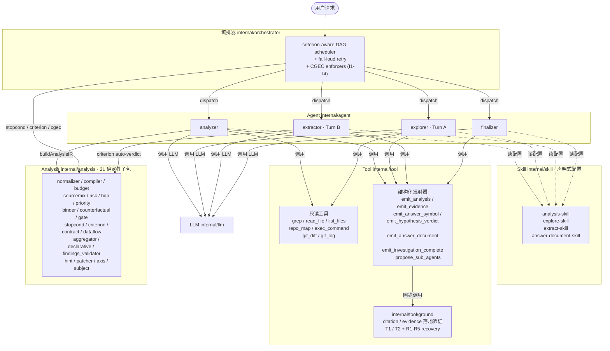
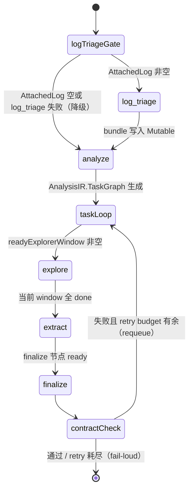
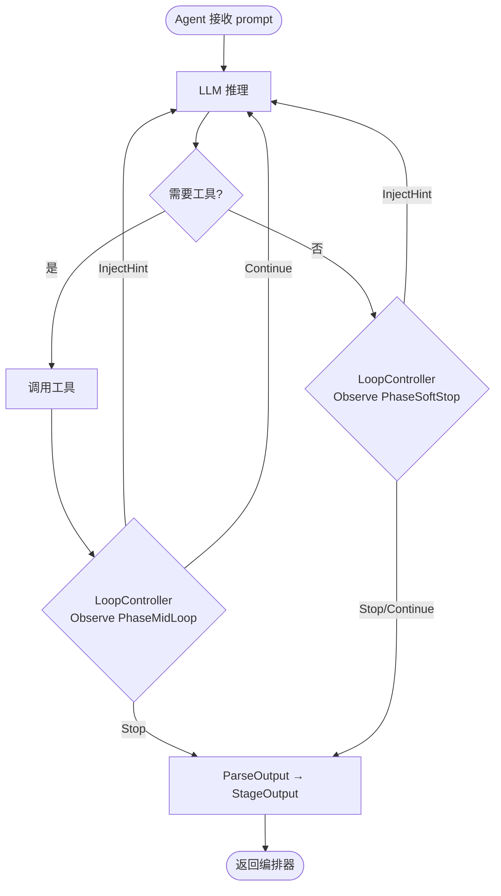
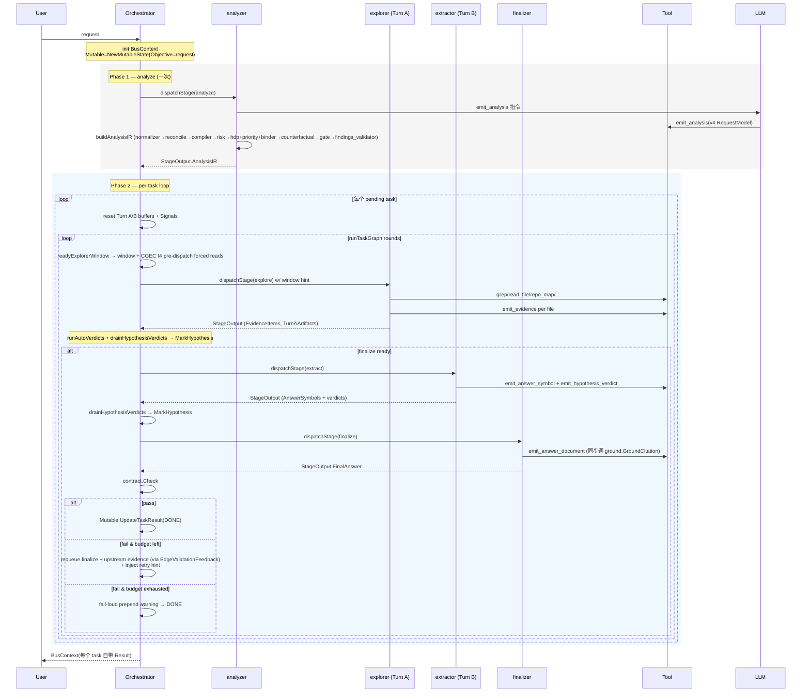

# 架构设计文档

codrax 是一个**只读的代码分析工具**：接收关于代码仓库的自然语言问题，经一条确定性的主流水线（`analyze → explore → extract → finalize`，4 阶段 × 4 Agent）产出结构化答案。当用户附加运行时日志时，主流水线前会先跑一个条件触发的 `log_triage` 阶段做结构化抽取。拓扑硬编码在 `internal/orchestrator/topology.go`，不存在运行时覆盖。

## 目录

- [1. 概述](#1-概述)
- [2. 四阶段流水线](#2-四阶段流水线)
- [3. 组件详情](#3-组件详情)
- [4. 阶段规范](#4-阶段规范)
- [5. 数据结构](#5-数据结构)
- [6. 请求生命周期](#6-请求生命周期)
- [7. 分析器后处理管线](#7-分析器后处理管线)
- [8. 关键设计模式](#8-关键设计模式)
- [9. 运行时子系统](#9-运行时子系统)
- [10. 配置](#10-配置)
- [11. 可扩展性](#11-可扩展性)

---

## 1. 概述

### 系统目标

codrax 接受用户的自然语言问题，通过一条**确定性的主流水线（4 阶段 × 4 Agent）**分析目标仓库，产出结构化的答案文档。附加运行时日志时会额外跑一个条件触发的 `log_triage` 前置阶段做结构化抽取。系统不修改代码，不调用有副作用的外部服务，只做：读文件、跑 grep、构建 repo map、执行 shell 查询。

### 核心设计原则

- **LLM 只做两件事**：(1) analyzer 里一次 `emit_analysis` 调用完成请求分类；(2) 各 stage 的 ReAct 循环里调用工具并产出 tool call。所有下游推导（TaskGraph、EvidencePlan、假设集、质量门、答案契约、citation 验证）都在 `internal/analysis/` 的 21 个确定性子包里完成。
- **Fail-loud**：LLM 没调 `emit_analysis` → 阶段直接报错 + 重试，不静默合成零值 IR。
- **Structured data, prose only at LLM boundary**：所有跨 stage / 跨 Agent 的数据通道都是 Go struct；string 仅允许出现在 LLM prompt（struct → markdown）和 LLM 回答（tool call → struct）两个边界。
- **Read-only**：所有 tool 嵌入 `tool.ReadOnly`；工具拿到的 `BusContext` 是窄视图，只有 `Mutable` 字段可写。

### 分层

| 组件 | 包路径 | 职责 | 调用谁 | 被谁调用 |
|------|--------|------|--------|----------|
| **编排器** | `internal/orchestrator` | 走 criterion-aware DAG、分派阶段、fail-loud 重试、CGEC enforcer | Agent、Analysis（criterion/stopcond） | `cmd/root.go` |
| **Agent** | `internal/agent` | 4 个专业 Agent（analyzer / explorer / extractor / finalizer），各跑一轮 ReAct 循环 | LLM、Tool、Analysis（仅 analyzer 调全套）、Skill（读配置） | 编排器 |
| **Skill** | `internal/skill` | 声明式配置：4 个 skill 定义 workflow / 工具 allowlist / 输出格式 / 禁令 | 无（纯数据） | Agent（读取后注入 prompt） |
| **Tool** | `internal/tool` | 只读工具（grep / read_file / repo_map 等）+ 6 个 emit_* 结构化发射器 + `ground/` citation 验证 | 文件系统、MutableState | Agent（`executeTool`） |
| **LLM** | `internal/llm` | 可插拔 adapter，per-agent 模型路由 | 外部 API | Agent（ReAct 循环） |
| **Analysis** | `internal/analysis/*` | 21 个确定性子包，组装 IR + 运行时求值 criterion | 无（纯函数） | analyzer agent（`buildAnalysisIR`）、编排器（criterion/stopcond）、emit_* 工具（ground/contract） |
| **Render** | `internal/render` | 事件流（`event.go`）+ CLI 渲染（`renderer.go`）+ AnswerDocument → markdown（`answerdoc.go`） | 无 | `cmd/root.go` |
| **Context builder** | `internal/context/builder.go` | struct → markdown prompt 的唯一装配点，canonical section 顺序锁死 | `skill.Config`、`AgentContext` | `BaseAgent.buildInitialMessages` |

**关键规则：**
- 所有 tool 调用和 LLM 调用都必须通过 Agent。编排器不直接调工具或 LLM。
- Analysis 层是纯确定性函数 —— 不调 LLM、不调工具、不读文件系统。
- Skill 是声明式配置，被 Agent 读取后渲染进 prompt，自己不调任何东西。

### 系统概览



---

## 2. 四阶段流水线

拓扑是**硬编码**的（`internal/orchestrator/topology.go`）：主流水线 4 阶段 × 4 agent 永远按序执行；log_triage 是条件前置阶段，`BusContext.AttachedLog` 非空时才触发（Guard 定义在同文件的 `preStages` 列表中），失败不阻塞主流水线。

```go
// 主流水线（无条件）
var pipelineTopology = map[types.PipelineStage]struct {
    Agent    types.AgentName
    Skill    string
    Terminal bool
}{
    types.StageLogTriage: {Agent: types.AgentLogTriager, Skill: "log-triage-skill"},
    types.StageAnalyze:   {Agent: types.AgentAnalyzer,   Skill: "analysis-skill"},
    types.StageExplore:   {Agent: types.AgentExplorer,   Skill: "explore-skill"},
    types.StageExtract:   {Agent: types.AgentExtractor,  Skill: "extract-skill"},
    types.StageFinalize:  {Agent: types.AgentFinalizer,  Skill: "answer-document-skill", Terminal: true},
}

// 条件前置阶段列表（按声明顺序依次尝试）
var preStages = []preStageEntry{
    {Stage: types.StageLogTriage, Guard: /* AttachedLog != "" */},
}
```

| 阶段 | 默认 Agent | 默认 Skill | 触发条件 | Terminal |
|------|-----------|-----------|---------|:-:|
| `log_triage` | `log_triager` | `log-triage-skill` | `AttachedLog` 非空 | |
| `analyze` | `analyzer` | `analysis-skill` | 无条件 | |
| `explore` | `explorer` | `explore-skill` | 无条件 | |
| `extract` | `extractor` | `extract-skill` | 无条件 | |
| `finalize` | `finalizer` | `answer-document-skill` | 无条件 | ✅ |

### 运行时流程



0. **Phase 0 — `log_triage`**（条件前置）：`BusContext.AttachedLog` 非空时触发。`log_triager` agent 读取日志原文，LLM 通过 `emit_log_triage` 发出四层结构化 bundle（`Meta` / `Errors` 含递归 `Cause` / `Residue`），系统调用 `logtriage.ValidateBundle` 做路径校验 + 仓内存在性过滤 + Layer 4 派生（`ResolvedFiles` / `Entities` / `IntentHint` / `Coverage`），写进 `Mutable.LogTriage()`。coverage 过低或日志体积超阈值（默认 32 KB）自动走两步升级（`emit_log_segmentation` → 逐段 `emit_log_triage` → `MergeBundles`）。阶段失败**不阻塞**主流水线——bundle 停留为 nil，每个下游消费者（analyzer 的 entity merge / intent override / RequiredFiles seed）都 nil-check 优雅降级。详见 §4.5。
1. **Phase 1 — `analyze`** 跑一次。analyzer 先用 1-2 轮 evidence-lite 预扫（`repo_map` / `grep files_only=true` / `list_files`）验证用户提到的实体和术语是否在仓库里出现，然后一次 `emit_analysis` 调用写出 v4 `RequestModel`。`analyzer.ParseOutput` 随后确定性地跑后处理管线（见 §7）组装完整的 `AnalysisIR` 并写进 `BusContext.AnalysisIR`。analyzer **禁止**读文件内容（`read_file` / `exec_command` 不在它的 tool allowlist）。
2. **Phase 2 — per-task DAG 执行**。`runTaskPhase` 调用 `runTaskGraph` 遍历 `AnalysisIR.TaskGraph.Nodes`：
   - **criterion-aware window schedule**：`readyExplorerWindow` 返回两个列表：`ready`（所有 `EntryConditions` 满足的 pending/requeued 非 finalize 非 counterfactual 节点）和 `blocked`（entry condition 未满足的节点——在 retry hint 中暴露阻塞的 criterion 诊断）。Ready 节点合并成**一次** `explore` dispatch。每轮开始前 `stopcond.ShouldStop` 评估 `EvidencePlan.StopConditions`（OR 语义），命中则跳到 finalize。编排器在入口从 `EvidencePlan.NodeBudgetHints` 安装 `ExploreBudget` 到 `MutableState`；explorer 的 `BaseAgent.executeTool` 在每次工具调用前检查剩余预算，超额返回失败 `ToolResult`。
   - **Shape-guard 保护 pure-read 分支**：`stopcond.ShouldStop` 和 validate 节点的 SuccessCriteria 评估都是 pure functions over `criterion.Env`——相同 env 永远返回相同 verdict。调度器用 `envShape`（`Evidence` / `AnswerSymbols` / `AnswerChains` / `ToolResults` / `ReadSet` / `PendingReads` / `DecidedHypotheses` / `PrescanBytes` 八维 int 指纹，O(1) 计算与比较）对每一次 pure-read 检查做 gate：记录上次评估时的 shape，下次 shape 未变就跳过或升级处理。该机制在 `runTaskGraph` 里解决整类"predicate 输入是 pure-read + 分支 body 不推进输入 → 热循环"结构脆弱性，不依赖每个 predicate 自己加 latch。
   - **StageExtract** 在 explore window 完成后作为 Turn B 分派。dispatch 后 `markSuccessCriteriaFailed` 评估每个 window 节点的 `SuccessCriteria`——通过的节点标 done，未通过的标 requeued。若失败的是 **validate** 节点，额外触发 `requeueValidationTargets`：沿 `EdgeValidationFeedback` 边只 requeue 其上游 evidence 节点（细粒度回溯，非整个 window）。**Shape-stuck 逃生**：`lastSCFailShape[validateID]` 记录每个 validate 节点上一次 SC 失败时的 shape；如果这次失败时 shape 相同（re-investigation 没带来新证据），调度器判定"此路不通"——调用 `injectInconclusiveForStuckHypotheses(validateID)` 对仍 HypUnknown 的假设注入诚实 `HypInconclusive` verdict + stuck-signal rationale，`markDone(validateID)`，不再 requeue。典型触发场景：Java trace 配 Go repo，假设引用的类在仓里根本不存在，explorer 再读 N 轮都读不出来。extractor 的 `ParseOutput` 对每条 hypothesis 调用 `criterion.Eval`：`RequiredEvidence` 全满足但无 LLM verdict → 注入 `HypInconclusive`；`FalsificationCondition` 满足 → 注入 `HypRejected`（覆盖 LLM verdict）。
   - **StageFinalize** 仅在 `firstFinalizeReadyMerged` 返回非 nil（所有非 finalize、非 counterfactual 节点都 `done`）时分派。
   - **investigation_complete 策略**（`agent_investigation_complete_policy`，默认 `soft`）：当 LLM 调用了 `emit_investigation_complete` 但 DAG 节点的 `SuccessCriteria` 数量不满足时，`soft` 把 `InvestigationComplete=true` 注入 `criterion.Env` 让阈值降到 ≥ 1；`override` 跳过所有 SuccessCriteria；`strict` 忽略完成信号按模板阈值硬跑。
   - **多话题 DAG**：`RequestModel.SubTopics` 非空时，`compiler.expandEvidenceNodes` 为每个子话题生成独立 evidence DAG 节点；prescan / explorer iterations / pipeline steps / retry budget 按 `agent_subtopic_*` 自适应扩充。
   - **Contract check**：finalize 返回后跑 `contract.Check`。不通过且 retry budget 未耗尽 → requeue finalize + 所有 done 的 explorer 节点，记一次 cross-window retry，把违规诊断塞进下一轮 `RetryHint`；retry 耗尽 → 在原答案上 prepend 一条 fail-loud 警告后返回。
3. Finalize 把答案写进 `Mutable.Result()`（`recordTaskFinalize`）。`Run()` 返回 `BusContext`，`cmd/root.go` 渲染结果。

**全局预算** `pipeline_max_steps` 是整 Run 的硬上限，跨 Phase 1/2 共用；`EvidencePlan.Budget.MaxReactIters` 是**每个 task** 的额外上限。

---

## 3. 组件详情

### 3.1 编排器（`internal/orchestrator`）

| 文件 | 职责 |
|------|------|
| `orchestrator.go` | `Run()` 入口、Phase 1 / Phase 2 主循环、contract.Check retry budget |
| `scheduler.go` | `runTaskGraph`、`readyExplorerWindow`、`markSuccessCriteriaFailed`、`requeueValidationTargets`、`runAutoVerdicts`、`drainHypothesisVerdicts`、`forceCloseExploreWindow` |
| `topology.go` | 4 stage × 4 agent × 4 skill 硬编码 map |
| `cgec_enforcers.go` | CGEC I1-I4 执行入口：`applyChainPromotion`、`preCompleteContractCheck`、`detectStallAndAct`、`runForcedReads`、`renderWindowHint`、`emitCGECSummary` |
| `contract_check.go` | AnswerContract 的 finalize 后置检查 + retry budget |
| `prior_conv_policy.go` | 4 值 `PriorConvPolicy` 在 per-stage 的可见性解析 |
| `tier1_floor.go` | evidence Tier-1 floor 检查（`evidence_tier1_floor`） |
| `user_messages.go` | 向用户渲染的 fail-loud / stall 文案 |

编排器的核心数据类型 `graphState` 记录每个 DAG 节点的状态（`pending` / `running` / `done` / `failed` / `requeued`）和跨 window retry 计数。

### 3.2 Agent（`internal/agent`）

所有 Agent 嵌 `BaseAgent`，后者提供 ReAct 循环，通过 `Evaluator` 接口接入每个 Agent 的四个钩子：`BuildInitialInstruction` / `ShouldStop` / `ParseOutput` / `DetermineMissingPiece`。可选 `LoopController` 接口接入循环控制。

| Agent | Stage | 工具权限 | 职责 |
|-------|-------|----------|------|
| `analyzer` | `analyze` | `emit_analysis` + evidence-lite 预扫（`repo_map` / `grep files_only=true` / `list_files`） | 1-2 轮预扫验证实体，然后一次 `emit_analysis` LLM 调用产出 v4 `RequestModel`；`ParseOutput` 跑确定性管线组装 `AnalysisIR` |
| `explorer`（Turn A） | `explore` | `grep` / `read_file` / `repo_map` / `list_files` / `exec_command` / `emit_evidence` / `emit_investigation_complete` / `propose_sub_agents` | 两阶段调查（Phase 0 Breadth → Phase 1 Depth），独占写 `EvidenceItems` / `AnswerChains` / `FlowFindings`，把投影快照写入 `TurnAArtifacts` |
| `extractor`（Turn B） | `extract` | **仅** `emit_answer_symbol` + `emit_hypothesis_verdict` | 一次性 LLM 调用产出答案 slate + completeness claim + hypothesis verdict。**禁止文件 IO、禁止 `emit_evidence`**。工具参数校验失败有一次 retry 窗口（`ShouldStop: iteration >= 2`） |
| `finalizer` | `finalize` | `emit_answer_document` | 按 `AnswerShape` 渲染结构化答案文档，触发 contract check |

#### ReAct 循环



- **`LoopController`**（`agent.go`）统一的循环控制钩子。`BaseAgent.Execute` 在两个时机调用它：
  - `PhaseMidLoop` — 每一轮 tool 调用后；
  - `PhaseSoftStop` — LLM 返回纯文本且没 tool 调用时。

  评估器的 `Observe(ctx, obs) LoopSignal` 只做**检测**，返回 `Progress` / `StopRequested` / `HintRequested`+`Hint`+`HintKey`。节流（`MinInjectInterval`）、去重（按 `HintKey`）、预算（`MaxContinuations` / `MaxMidLoopInjects`）、idle-streak 强停（`IdleStopThreshold`）统一由 **`LoopPolicy`**（`loop_policy.go`）的 `loopPolicyState.Apply` 执行。

- **Terminal-tool-call stop**：4 个 agent 的 `Observe` 在 `PhaseMidLoop` 检测到各自的终态工具调用**成功**后立即返回 `StopRequested: true`。失败（参数校验错误等）**不触发** stop，允许 LLM 下一轮看到错误并重试。

  | Agent | 终态工具 | Stop 条件 |
  |-------|---------|-----------|
  | analyzer | `emit_analysis` | `LastToolResult.Success == true` |
  | explorer | `emit_investigation_complete` | `LastToolResult.Success == true` |
  | extractor | 任何 emit_* | `AllToolResults` 中存在 `Success == true` |
  | finalizer | `emit_answer_document` | `MutableState.AnswerDocument()` 非空 |

- **ExploreHeuristics**（`types.DefaultExploreHeuristics()`）：explorer 的 mid-loop / soft-stop 检测用的 16 个阈值（mid-loop / soft-stop / Phase 0 / enumeration / parallelize 等）全部通过 `codrax.yaml` 的 `explore_*` 键覆盖，零值用代码默认。

#### Skill vs Evaluator 职责边界

| 层级 | 归属 | 承载内容 | 物理位置 |
|------|------|----------|----------|
| **Static（静态契约）** | Skill | 角色身份、Workflow、OutputFormat、Prohibitions、字段枚举、ToolSuggestions | `internal/skill/*.go` 的 `Config` 字面量 |
| **Dynamic（通用动态段）** | Builder | per-dispatch 段：User Request / Retry Directive / Prior Findings / Known Facts / Structured Evidence / Dataflow Findings / Answer Symbols / Hypothesis Verdicts / Relevant Files / Missing Piece | `internal/context/builder.go::BuildPromptContext`，`canonicalSystemSectionOrder` / `canonicalUserSectionOrder` 锁死顺序 |
| **Stage-specific supplement（本轮专属）** | Evaluator | 只有 builder 无法泛化产出的段：extractor 的 Turn A digest、answer-document 的 resolved shape + cardinality baseline + prior slate | `Evaluator.BuildInitialInstruction`，`BaseAgent.buildInitialMessages` 作为**额外**的 user 消息追加在 builder 输出之后 |

Evaluator 的 `BuildInitialInstruction` 绝对不能重述 skill 的任何字段，也不能再发射 builder 已经写过的标题——会让 LLM 看到两份同名段并产生矛盾指令。`TestAnalyzer_BuildInitialInstruction_IsEmpty` 把 analyzer 的"空补充"契约固化（它的动态段 builder 全能产出）。Extractor 和 Finalizer 是"非空补充"的参照。

#### Canonical section 顺序

`internal/context/builder.go`：

```
canonicalSystemSectionOrder:
  Agent Identity, Reasoning Hygiene, Think Aloud, Constraints,
  User Preferences, Pipeline State, Skill Goal, Workflow,
  Output Format, Prohibitions

canonicalUserSectionOrder:
  Retry Directive (READ FIRST), User Request,
  Prior Conversation (reference only), Prior Stage Findings,
  Known Facts, Extracted Answer Symbols (deterministic, authoritative),
  Answer Symbols (deterministic floor, may extend with cited evidence),
  Structured Evidence, Unverified Leads (not for citation),
  Dataflow Findings, Hypothesis Verdicts, Relevant Files
```

#### 子 Agent

explorer 可以通过 `propose_sub_agents` 工具向编排器申请派生并行 `sub_explorer` 实例分摊独立调查子问题。`sub_explorer` 不共享 `Mutable`（`BuildSubAgentContext` 故意把 `ac.Mutable` 留成 nil），`todo_write` / `emit_*` 在 sub-agent 上下文会被拒绝。实现：`sub_explorer.go` + `subagent.go` + `subagent_runtime.go`。

### 3.3 Skill（`internal/skill`）

```go
type Config struct {
    Name            string
    Goal            string
    Workflow        []string
    ToolSuggestions []string
    OutputFormat    string
    Prohibitions    []string
}
```

技能是**声明式配置**。Agent 加载 skill，按它的 `Workflow` 决定 prompt、按 `ToolSuggestions` 决定允许的工具、按 `Prohibitions` 决定禁令。

| Skill | 所属 Agent | 核心约束 |
|-------|-----------|----------|
| `analysis-skill` | analyzer | 由 `internal/skill/analysis_contract.go::BuildAnalysisSkill` 构造，字段枚举来自同文件 SSOT 表（`emit_analysis` schema 从这里读枚举）。Tool allowlist：仅 `emit_analysis` + 3 个 evidence-lite 预扫工具 |
| `explore-skill` | explorer | 两阶段 workflow；Tool allowlist：6 个只读工具 + 3 个 emit_*。Prohibitions：无假设、无 "next steps"、无纯 prose headings |
| `extract-skill` | extractor | Prohibition 显式禁 `emit_evidence`（Turn B 不能侵犯 Turn A 的 evidence 通道）；Tool allowlist：**仅** `emit_answer_symbol` + `emit_hypothesis_verdict` |
| `answer-document-skill` | finalizer | Tool allowlist：仅 `emit_answer_document`；OutputFormat 按 `AnswerShape` 分 shape |

`buildToolSchemas` 物理裁剪 LLM 看到的工具 schema：skill 没声明的工具 LLM 根本看不到。

### 3.4 Tool（`internal/tool`）

工具通过嵌入 `tool.ReadOnly` 满足 `IsWrite() bool`——所有现存工具都是 read-only。`Execute` 收到的 `*BusContext` 是窄视图：只有 `RepoRoot` / `Branch` / `Commit` / `WorkDir` / `Mutable` 被填充，物理上限制工具只能修改 `Mutable`。

#### 内置工具

| 工具 | 描述 |
|------|------|
| `grep` | 按模式搜索；支持 `files_only=true`（对应 `rg -l`）返回匹配文件列表而非每行 |
| `read_file` | 读整文件；大文件用 `offset+limit` slice 读。`readfile_small_limit_threshold` 对小文件的懒惰 limit 做保护性展开 |
| `list_files` | 列目录 |
| `repo_map` | 生成仓库符号/关系索引的结构化视图。`task_map` 视图给 breadth scan 快速定位角色 |
| `exec_command` | 执行 shell 命令（按 read-only 处理，写限制靠外部沙箱） |
| `git_diff` / `git_log` | git 状态查询 |

工具分类（`toolConfidence` 接口）：`EvidenceTool` 0.8（grep/read_file/list_files/git_*/exec_command）/ `NavigationTool` 0.3（repo_map）/ `NonEvidenceTool` 0（其余）。

#### 结构化发射器（emit_* 系列）

| 工具 | 独占 Agent | 作用 |
|------|-----------|------|
| `emit_analysis` | analyzer | 一次性写 `RequestModel`（intent / scenario / complexity / keywords / entities / question_kind / answer_shape / sub_topics / answer_subject / predicates / predicate_axis）；`ParseOutput` 随后跑确定性管线组装完整 `AnalysisIR` |
| `emit_evidence` | explorer | 批量写 `EvidenceItem`（kind / subject / object / source / line_start / line_end / anchor_kind / anchor_symbol / condition / summary）。`kind` 为 6 种 `IsLLMEmittable` 值之一。Execute 内同步调 `ground.GroundItem` 做 tier 验证 |
| `emit_investigation_complete` | explorer | 显式完成信号。需要 `reason` + `confidence`（high/medium），`low` 被拒。Execute 内跑 **CGEC I3** `preCompleteContractCheck`（6 条预检）并在失败时 downgrade + emit Repair |
| `emit_answer_symbol` | extractor | 写答案符号 slate + `CompletenessClaim`（`complete` / `lower_bound` / `unknown`）。`extractor.ParseOutput` 跑 cardinality validator 自动降级不诚实的 `complete` claim（基线 `max(β=TerminalEvidenceCount, γ=len(MustInclude))`） |
| `emit_hypothesis_verdict` | extractor | 为 `AnalysisIR.HypothesisSet` 的每条 hypothesis 写 status（`confirmed` / `rejected` / `inconclusive`）+ rationale + `file:line` citation。编排器 post-extract hook 通过 `AnalysisIR.MarkHypothesis` 写回 IR |
| `emit_answer_document` | finalizer | 按 shape 写 typed `AnswerDocument`。Execute 内同步调 `ground.GroundCitation` 验证 citations（**CGEC I2**），失败时 `AddRepair(RepairReadFile)` |
| `propose_sub_agents` | explorer | 向编排器申请派生并行 sub-agent |

#### ToolResult 与 blob 机制

```go
type ToolResult struct {
    ToolName  string
    Summary   string
    RawRef    string    // 大输出落到 WorkDir 时写的文件路径
    Success   bool
    Timestamp time.Time
}
```

工具结果超过 `blob_max_inline_bytes`（默认 32 KB）时会 offload 到 WorkDir，只把 head/tail preview 塞进 LLM 上下文。Agent 想看全文就 `read_file` 指向 `RawRef`。WorkDir 默认 `<CWD>/.codrax/blob/<timestamp>-<pid>/`（per-process 共享，启动时按 `blob_max_sessions=7` 保留，存活 PID 永不删）；设 `blob_max_sessions: 0` 回退到 per-trace `os.MkdirTemp`+`RemoveAll`。

#### Turn A → Turn B Summary banner 约定

`ToolResult` 不带 `Params` 字段。Turn B 的 prompt 只通过 `ToolName` + `Summary` 两个渠道看到 Turn A 的调用。约束：**任何 Turn B 需要看到的 Turn A 调用参数（命令、pattern、path、flags），必须由工具自己写进 `Summary` 文本**。每个工具 `Execute` 里把 Summary 第一行做成自述 banner：

| 工具 | Summary 首行 banner |
|------|----------------------|
| `read_file` | `[path: showing lines X-Y of Z total]` 或 `[path: showing all N lines (B bytes); limit=L expanded ...]` |
| `exec_command` | `[exec_command: $ <command>]`（成功 / 失败 / 超时三条路径都挂） |
| `grep` | 两行：`[grep: N matching {lines,files}]` + `[grep params: pattern=... path=... file_type=... include=... context_lines=... case_insensitive=... files_only=...]` |
| `list_files` | `[list_files: path=... recursive=...]` |
| `git_diff` | `[git_diff: path=... ref=... staged=...]` |
| `git_log` | `[git_log: path=... count=... format=...]` |

辅助函数 `internal/tool/builtin.go::kvBanner(name, kv...)` 处理去空值 + `sanitizeForBanner` 消控制字符 + 200 字节截断。

下游消费者（`contract_check.go::strings.HasPrefix("[grep:")`、explorer 的 `extractFileCoverage` 解析 `[path: showing lines X-Y of Z]`、`runForcedReads` 的 `[forced_read]` 标记）都是字符串模式匹配 banner —— 改 banner 格式时必须同步查 parser。

#### Citation / evidence 路径规范化

`emit_answer_document` 的 citation 白名单和 `ground.GroundCitation` / `ground.GroundItem` 的 `LineIndex[file]` + `FileIndex[file]` lookup 都做字符串相等比较。为避免 LLM 用不一致路径形式（相对 vs 绝对、不同工具产出的 path）造成整批 citation 被 drop，所有 key 产地和查询端都穿过 `internal/tool/ground/path.go::CanonicalRepoRelative(path, repoRoot)`：

- empty → empty
- 绝对且在 `repoRoot` 内 → `filepath.Rel` 剥前缀
- 绝对但在 `repoRoot` 外（或 `Rel` 经 `..` 逃逸） → 保留 `filepath.Clean` 后的绝对形式
- 相对 → `filepath.Clean` 之后原样

落地点：`ground.BuildContext` / `buildLineIndex` / `GroundCitation` / `GroundItem`（原地 mutate `it.Source`）/ `emit_answer_document.turnAReadFileSet` / `buildEmitAnswerDocumentCitations`。

#### Evidence grounding tier 结构

`internal/tool/ground/ground.go`：

```go
type GroundingStatus string
const (
    GroundingGrounded   GroundingStatus = "grounded"
    GroundingRecovered  GroundingStatus = "recovered"
    GroundingUngrounded GroundingStatus = "ungrounded"
)

type GroundingTier string
const (
    TierLineText         GroundingTier = "line_text"          // T1
    TierSymbolTable      GroundingTier = "symbol_table"       // T2
    TierFQNameSameFile   GroundingTier = "fqname_same_file"   // R1
    TierSnippetFuzzy     GroundingTier = "snippet_fuzzy"      // R2
    TierPackageSymbol    GroundingTier = "package_symbol"     // R3
    TierNearestCall      GroundingTier = "nearest_call"       // R4
    TierNearestCondition GroundingTier = "nearest_condition"  // R5
)

type AnchorKind string
const (
    AnchorDefinition AnchorKind = "definition"
    AnchorCall       AnchorKind = "call"
    AnchorCondition  AnchorKind = "condition"
    AnchorReturn     AnchorKind = "return"
    AnchorAssignment AnchorKind = "assignment"
    AnchorImport     AnchorKind = "import"
)
```

- **T1** (`line_text`): LLM cited line 的原文包含 AnchorSymbol 作为整 token（支持 ±1 行邻居）
- **T2** (`symbol_table`): repomap.Graph 结构匹配 AnchorKind（`graphMatchDefinition` / `graphMatchCall` / `graphMatchImport`），还要求 line 落在某 symbol 的 `[Line - docRadius, EndLine]` 或 prologue `[1, firstSymbolLine - docRadius]`
- **R1-R5** Recovery tiers 在 T1/T2 失败时按顺序试：同文件 FQN、片段 fuzzy、包内 symbol、最近的 call、最近的 condition —— 命中后返回 `GroundingRecovered` + `AnchorAdjusted` 并记 `GroundingTier`
- 全部失败 → `GroundingUngrounded`，item 进独立 "Unverified Leads" 段，不进 citation pool

### 3.5 LLM（`internal/llm`）

可插拔 adapter 接口：

```go
type Adapter interface {
    Chat(messages []Message, tools []ToolSchema) (Response, error)
    ModelID() string
    MaxContextTokens() int
}
```

Per-agent 模型路由在 `providers.yaml` 配（不同 Agent 可指向不同模型 / 不同 provider）。provider 级降级链（主模型 → fast 模型）也在 provider config 声明。

---

## 4. 阶段规范

### 4.1 `analyze` — 请求理解

| 方面 | 详情 |
|------|------|
| **Agent** | analyzer |
| **Skill** | `analysis-skill` |
| **工具** | `emit_analysis` + evidence-lite 预扫（`repo_map` / `grep`（强制 `files_only=true`） / `list_files`） |
| **输入** | 用户原始请求 |
| **工作** | **Phase A**：1-2 轮 evidence-lite 预扫，验证用户提到的实体/术语是否在仓库出现（**不读内容**）→ **Phase B**：一次 `emit_analysis` LLM 调用写 v4 RequestModel → `ParseOutput` 跑后处理管线（§7） |
| **输出** | `BusContext.AnalysisIR`（`TaskGraph` / `EvidencePlan` / `AnswerContract` / `HypothesisSet` / `QualityGate`） |

#### Evidence-lite 预扫边界规则

由 `internal/skill/analysis_contract.go::AnalysisHardRules` 的 `EVIDENCE-LITE BOUNDARY:` 规则 + `BaseAgent.executeTool::validateAnalyzerPrescanToolCall` 运行时 gate 共同强制：

- 只允许 `repo_map`、`grep`（必须 `files_only=true`）、`list_files` 三个只读导航工具——`BaseAgent.buildToolSchemas` 通过 `analysis-skill.ToolSuggestions` allowlist 物理裁剪 LLM schema。grep 没带 `files_only=true` 时 `validateAnalyzerPrescanToolCall` 合成失败 `ToolResult`，LLM 下一轮看到错误可重试。
- 预扫硬上限 2 轮，由 `analyzerEvaluator.Observe` 在 PhaseMidLoop 强制：每轮预扫工具调用让 `prescanRounds` +1；超过 `tool.AnalysisLimits.MaxPrescanRounds`（默认 2，`analysis_max_prescan_rounds` 可覆写；设 0 禁用）下一次预扫返回 `LoopSignal{StopRequested: true}`。
- **pre-scan → validator 数据通道**：同一次 `Observe` 把 `LastToolResult.Summary` 通过 `Mutable.AppendPrescanSummary` 追加到 per-dispatch 缓冲。`emit_analysis.Execute` 读取此缓冲作两个独立机制的输入：
  - **verified-entity 白名单**（`filterGenericEntitiesWithWhitelist`）：实体命中 generic blocklist 但小写形式出现在 seen-blob 里时保留并触发 `kept_generic_verified_entities` 告警。
  - **runtime quality probe**（`ComputeAnalysisQualityProbe`）：计算 `keyword_hit_ratio` 和 `entity_hit_ratio`，软阈值 `analysis_warn_below_keyword_hit_ratio` / `analysis_warn_below_entity_hit_ratio`（默认 0 = 不触发告警）控制 Summary `[warn: …]` 提示。完整 probe 结构以 `analysis_quality_probe` 写入 `StageOutput.Data`。

#### emit_analysis call-count gate

`analyzer.ParseOutput` 在走 `buildAnalysisIR` 前扫本次 dispatch 的 tool-result 流统计 `emit_analysis` 调用次数，结构化透出到 `StageOutput.Data` 的 `analysis_emit_calls` 字段：

- **0 次**：强告警 + hard `StageOutput.Error`，`runAnalyzePhase` 重试至 `MaxRetriesPerStage`；预算耗尽后 Run 终止。
- **1 次**：happy path。
- **>1 次**：由 `tool.AnalysisLimits.RejectMultipleEmit`（`analysis_reject_multiple_emit`）决定。默认 `false` → warning + 保留最后一次 + 继续；`true` → 额外把消息写进 `StageOutput.Error`。IR 始终按最后一次写入填充。

#### Quality Gate

`internal/analysis/gate.Run` 7 检查：

- **Hard**：`nil_ir` / `dag_closure` / `contract_complete` / `coverage` / `budget_sanity` / `hypothesis_coverage` / `criterion_resolvable`。Coverage 加权（Symbol=1.0, Config=0.7, Concept=0.4），阈值通过 `gate.GlobalThresholds()`（`gate_coverage_*`、`gate_hypothesis_min_priority`）。
- **Soft**：`pending_fields_wellformed`（pending artifact-exchange 字段检查）→ warning，继续跑。

### 4.2 `explore` — Turn A：调查 + 证据收集

| 方面 | 详情 |
|------|------|
| **Agent** | `AgentExplorer` (`internal/agent/explorer.go`) |
| **Skill** | `explore-skill` |
| **允许工具** | `grep` / `read_file` / `repo_map` / `list_files` / `exec_command` / `emit_evidence` / `emit_investigation_complete` / `propose_sub_agents` |
| **内部状态** | `explorerEvaluator.phase`（0=breadth, 1=depth），`complexity` / `answerSubject` / `predicateAxis` / `requiredFiles`（从 IR 缓存），`fileSymbols` / `searchResult` / `exactAnchorFiles` / `declarativeAnchorFiles` / `ermRequirements` / `cachedConcreteValues` |
| **输出** | `StageOutput.{EvidenceItems, AnswerChains, FlowFindings, StageReport}` + `MutableState.TurnAArtifacts` |

#### 两阶段工作流

- **Phase 0 — Breadth Scan**：`repo_map`（task_map 视图）+ `grep files_only=true` + `list_files` 快速定位相关文件，不读全文。LLM 产出 3-6 个文件的优先读取清单。
- **Phase 0 → Phase 1 质量门**（仅 `ContinuationsUsed >= 1` 时生效）：必须同时满足 (1) 用过 grep，(2) 用过 repo_map 或 list_files，(3) 发现 ≥ 3 个文件。任一未满足返回一次补救 prompt（`phase0ExtraRound` 确保最多触发一次）。
- **Phase 0 早期证据退出**：`firstSoftStop`（`ContinuationsUsed == 0`）且 `hasHighConfidenceEvidence` 为 true（history 中任何 `confidence > 0.5` 的成功 tool 结果）时跳过质量门直接接受停止（`e.phase = 1` + 空信号）。覆盖 exec_command / grep-only / read_file-only / list_files-only 等单工具即可回答的场景。
- **Phase 1 — Depth Read + Evidence Collection**：LLM 按清单 `read_file`，每读一个文件调 `emit_evidence(items=[...])`。大文件（>500 行）强制先 grep 再 slice read。行号必须来自 `read_file` 的 gutter。
- **ParseOutput（确定性管线）**：`ensureStructuredEvidence` 合并 emit_evidence buffer + markdown fallback → `groundEvidenceItems`（调 `ground.GroundItem`）→ `mergeEvidenceItems` → `rankEvidenceByRelevance` → `scrubSiblingEvidenceBlocks` → `identifyAnswerChains` → `SetTurnAArtifacts` 把投影快照交给 Turn B。

#### 证据排名

`rankEvidenceByRelevance`：`entity overlap × kindWeight × sourceWeight × bridgeBonus × producerBoost`。LLM 通过 `emit_evidence` 提交的证据（`IsLLMEmittable` + 非 ungrounded）获得 1.5x `producerBoost`；`EvidenceConcrete`（确定性自动提取）`kindWeight=0.50`；axis alignment 通过 `internal/analysis/axis::Affinity(PredicateAxis, AnchorKind)` 调节。

#### HasEnoughFacts 多维质量门

`ParseOutput` 计算 `HasEnoughFacts` 信号，决定 DAG 中带 `has_enough_facts` 入口条件的节点是否 ready。三子检查 AND：

- **toolDiversity**：`len(sources) >= 2`（sources 只计 `confidence > 0.5` 的工具）
- **fileCoverage**：`coverage >= 0.5 || len(readSet) >= 3`
- **evidenceQuality**：`directCount >= 2`（investigation notes 中的 `[DIRECT]`/`[REGISTRATION]` 标签）

枚举查询（`isEnumerationQuery`）阈值更严（覆盖率 ≥ 80%）。**单来源调查旁路**：`len(sources) == 1` 时三个 floor 全部 true，覆盖单工具调查场景。`emit_investigation_complete` 显式调用**无条件 override** 所有 heuristic。

### 4.3 `extract` — Turn B：答案结构化 + 假设判定

| 方面 | 详情 |
|------|------|
| **Agent** | `AgentExtractor` (`internal/agent/extractor.go`) |
| **Skill** | `extract-skill` |
| **允许工具** | **仅** `emit_answer_symbol` + `emit_hypothesis_verdict` |
| **禁止工具** | `read_file` / `grep` / `repo_map` / `list_files` / `exec_command` / `emit_evidence` |
| **ShouldStop** | `iteration >= 2`（one-shot + 一次 retry 窗口） |
| **输入** | `MutableState.TurnAArtifacts` digest + `AnalysisIR.HypothesisSet` + `AnswerContract.MustInclude` + (measurement-scalar only) Raw Tool Outputs 段 |
| **输出** | `StageOutput.{AnswerSymbols, AnswerSymbolCompleteness}` + 回写 `HypothesisSet[i].Status` |

Turn B 的两项**独特职责**：

1. **LLM-driven answer_symbol slate + completeness claim**。Phase 9 cardinality validator（`validateCompletenessClaim`）：LLM claim `complete` 但 `len(items) < max(TerminalEvidenceCount, len(MustInclude))` 时，claim 自动降级为 `lower_bound` + log warning。
2. **LLM-driven hypothesis verdict + citation**。`confirmed`/`rejected` 强制带 `file:line` citation。编排器 post-extract hook 调 `AnalysisIR.MarkHypothesis` 写回。注意：`rejected` 和 `inconclusive` 有确定性路径——`ParseOutput` 的 auto-verdict 用 `criterion.Eval` 评估 `FalsificationCondition` → rejected、`RequiredEvidence` all-pass → inconclusive。编排器还在每次 explore window 后调 `runAutoVerdicts`（同样逻辑，不调 LLM）+ `drainHypothesisVerdicts` 更新 IR。

#### Anchor skeleton for `shape=explanation + sub_topics ≥ 1`

`isMultiTopicExplanation(ctx)` 谓词：`AnswerContract.RequiredAnswerShape == ShapeExplanation` AND `RequestModel.SubTopics > 0` 时，`Observe.needSymbols = true`，把 `emit_answer_symbol` 提升为 expected emit。LLM 为每个 sub-topic 产一条 anchor symbol（load-bearing identifier + `file:line` + `rationale=子话题描述`），作为 finalizer 多段 prose 的骨架。

配套：`emit_answer_document` 对 `shape=explanation` 允许 optional `symbols[]` skeleton（仍禁 `steps[] / value / boolean`），completeness 在 skeleton 路径不要求；`render/answerdoc.go::renderAnswerDocExplanationSkeleton` 在 summary 和 citation pool 之间渲染 "Key anchors" / "关键锚点" 块；`answer_document_evaluator.go` 的 finalizer prompt 把 extractor 产的 per-topic slate 原样传下去附 "re-emit verbatim in symbols[]" 指令。单话题 explanation（`SubTopics == 0`）保持原路径——summary 就是答案。

#### Turn B 的诚实契约

Turn B 看不到新文件——所有信息在 Turn A transcript 快照里冻结。retry 带不来新信息。错了就降级为 `lower_bound` 而不是 retry。`ShouldStop` 设 `iteration >= 2`（而非 `>= 1`）给工具参数校验失败留一次 retry 窗口（LLM 下一轮看到 tool error 并修正参数）。`Observe` 在 `PhaseMidLoop` 检测至少一个**成功**的 emit_* 后立即 `StopRequested`。`PhaseSoftStop` 对 `list_of_symbols` 问题在 LLM 停下但未调 `emit_answer_symbol` 时注入一次 correction hint（`maxExtractorCorrectionRetries = 1`）。

### 4.4 `finalize` — 输出收敛

| 方面 | 详情 |
|------|------|
| **Agent** | finalizer |
| **Skill** | `answer-document-skill`（硬编码于 `topology.go`） |
| **工具** | `emit_answer_document`（独占） |
| **输入** | `BusContext.AnalysisIR.AnswerContract` + `AnswerSymbols` + completeness + `HypothesisSet` + Turn A 的 `StageReport` + (measurement-scalar only) Raw Tool Outputs 段 |
| **工作** | 按 `RequiredAnswerShape` 分支构造 typed payload → 调 `emit_answer_document` → renderer 渲染 |
| **输出** | `StageOutput.FinalAnswer`（写进 task.Result）|

#### 职责边界（严格不重叠）

| 产物 | 归属 | 路径 |
|------|------|------|
| `EvidenceItems` | **Explorer 独占** | `emit_evidence` + markdown fallback + merge |
| `AnswerChains` | **Explorer 独占** | 确定性 `identifyAnswerChains` |
| `FlowFindings` | **Explorer 独占** | 确定性 dataflow pipeline |
| `StageReport` prose digest | **Explorer 独占** | `renderExplorerStageReport` |
| `TurnAArtifacts` 快照 | **Explorer 写，Extractor 读** | `SetTurnAArtifacts` / `TurnAArtifacts()` |
| `AnswerSymbols` + completeness claim | **Extractor 独占** | `emit_answer_symbol` + Phase 9 validator |
| `HypothesisSet[i].Status` | **Extractor 写 buffer** | `emit_hypothesis_verdict` + `drainHypothesisVerdicts` |
| `AnswerDocument` | **Finalizer 独占** | `emit_answer_document` + renderer |

#### Summary 长度：shape-tiered cap

`emit_answer_document` 的 `summary` 长度由 `types.SummaryCapConfig` + `types.SummaryCapFor(shape, itemCount)` 决定。**默认 disabled**（`SummaryCapConfig.Enabled=false` → `SummaryCapUnlimited`）。`codrax.yaml` 的 `summary_cap_enabled: true` 激活：

| shape | 上限 | 用途 |
|---|---|---|
| `explanation` | `Explanation` (default 2500) | Summary **IS** 答案正文 —— 多段 prose + 可选 Mermaid |
| `boolean` | `Boolean` (default 800) | 1-3 句 lead-in + rationale |
| `value` / `config_value` | `Value` / `ConfigValue` (default 500) | 单句 lead-in + scalar literal |
| `step_list` | `min(StepListMax, StepListBase + n·StepListPerItem)` (default 1000 + 120·n, max 2500) | lead-in；随步数扩张 |
| `list_of_symbols` | `min(SymbolsMax, SymbolsBase + n·SymbolsPerItem)` (default 1000 + 100·n, max 2500) | lead-in；随 symbol 数扩张 |

全部字段通过 `codrax.yaml` 的 `summary_cap_*` 覆盖。`cmd/root.go` 加载 YAML 后调 `types.SetSummaryCapConfig` 一次性替换 package-level config，下游 `emit_answer_document` + shrinkage-salvage trimmer 共用。

#### Forbidden 字段：reject 不 scrub

`rejectForbiddenFields`（`emit_answer_document.go`）**失败**整个 call 而不是静默清洗 —— shape=explanation 带着非零 `boolean{decision:"否", ...}` 会收到 `"shape=explanation forbids boolean{}; remove the field and retry"`，LLM 下一轮必清。零值字段（`value.Literal==""` / `boolean.Decision==""`）仍然静默 nil。`FinalizerMaxCorrectionRetries` default 3。

#### Shrinkage-salvage

`answer_document_evaluator` 对所有 shape 检测 "iter 0 rich prose → iter 1 压缩 summary" 模式：当 summary 明显少于前次 draft 的 `shrinkageRatio`（按 shape 缩放 floor：explanation 1.0×／list/step 0.5×／boolean 3/8×／value 0.25×），把 `findLastPreToolCallDraft(messages)` 选中的上一轮 draft verbatim 复制进 `summary[]`，UTF-8 rune-boundary trim 到 `SummaryCapFor(shape)`，追加双语 caveat，log `[finalizer/shrinkage]`。由 `agent_finalizer_*`（`preserve_prior_prose` / `shrinkage_min_prose_len` / `shrinkage_ratio`）控制。

### 4.5 Log Triage — 用户附加日志 → 结构化锚点注入下游

当用户通过 `--log <file|->` / `--log-text <inline>` / REPL `/log` 附加一条运行时日志时，在 analyze 之前会先跑一个独立的 `log_triage` 阶段。这个阶段是**条件触发**的（`BusContext.AttachedLog` 非空才激活），运行的是一个独立 agent（`log_triager`）而不是 analyzer 的 bolt-on；失败不阻塞主流水线。

**责任边界**（硬契约）：

| 侧 | 职责 | 不做的事 |
|---|------|---------|
| LLM（`log_triager` agent + `log-triage-skill`） | 读取 `AttachedLog` 正文，emit 结构化 `LogBundle` | 不做路径解析、不做仓内存在性验证、不填派生字段 |
| 系统（`internal/analysis/logtriage.ValidateBundle`） | 路径归一化、`os.Stat` 校验、Java basename 仓内 glob、运行时内部文件过滤、派生 `ResolvedFiles`/`Entities`/`IntentHint`/`Coverage` | 不改 LLM 发出的 `Meta` / `Errors` / `Residue` 三层 |

由 LLM 做抽取而不是写死的正则 parser，使得支持的日志格式不再是一个固定列表——Go panic、Java exception（含 `Caused by` 链 → 递归 `Cause` 指针）、C/C++ ASAN / UBSAN / gdb、Python traceback（含 `During handling` → 递归 `Cause`）、Node.js V8 stack、Rust `#[source]` 链、Ruby backtrace、结构化 JSON 应用日志、编译器错误报告都走同一套代码路径。

**LogBundle 数据结构**（`internal/types/log_bundle.go`）分四层：

| 层 | 来源 | 字段 | 说明 |
|---|------|------|------|
| 1. Meta | LLM | `Lang` / `Signals[]` / `Summary` | 日志整体分类。`Signals` 是 10 值 enum：`panic` / `crash` / `oom` / `timeout` / `permission` / `db` / `network` / `validation` / `logic` / `other` |
| 2. Errors | LLM | `[]LogError{Type, Message, Frames[], Cause *LogError}` | 错误树。顶层 slice 是**平行快照**（Go goroutine dump 里多个同时 panic 的 goroutine），`Cause` 指针是**时序因果链**（Java `Caused by` / Rust `#[source]` / Python `__cause__`）。递归深度由系统兜底截到 5 层 |
| 3. Residue | LLM | `UnknownChunks[]` | LLM 抽不进 `Errors` 的段（最多 8 段，每段 ≤ 500 字符） |
| 4. Derived | 系统 | `ResolvedFiles[]` / `Entities[]` / `IntentHint` / `Coverage` | 系统侧派生：`ResolvedFiles` 是 `os.Stat` 校验过的仓内路径（按 `Confidence` 降序，上限 10）；`Entities` 是从 `Func` / `Pkg` / `Error.Type` / `Signals` 派生的关键词（上限 32）；`IntentHint` 在有真实栈帧或信号含 `panic`/`crash`/`oom` 时置为 `IntentRootCause`；`Coverage` = `1 - bytes(Residue)/bytes(raw)`，驱动两步升级决策 |

每个 `LogFrame` 带 `File` / `Line` / `Func` / `Pkg` / `Raw`（原始日志行）/ `Confidence`（0.0-1.0）。系统侧把 `Confidence < 0.6` 或 `File == ""` / `Line == 0` 的帧保留在 bundle 中（贡献到 `Entities`）但不晋升到 `ResolvedFiles`——这是零信息丢失的恢复策略。

**数据流**：

```
--log / /log                             ┌──▶ Meta (Lang, Signals, Summary)
     │                                   │
     ▼                                   ├──▶ Errors[] (递归 Cause)
BusContext.AttachedLog     emit_log_triage├
     │                         │         └──▶ Residue (UnknownChunks)
     │              ┌──────────┘                         │
     │              ▼                                    ▼
     └──▶ log_triager agent ──▶ logtriage.ValidateBundle (os.Stat + 过滤 + 派生)
                                            │
                                            ▼
                                    Mutable.LogTriage() (LogBundle)
                                            │
              ┌─────────────────────────────┼──────────────────────────────┐
              ▼                             ▼                              ▼
   analyzer 读 bundle.Entities       reconcileIntent                 analyzerRequiredFiles
   union 进 AnalyzerHints.Entities   (IntentHint=RootCause →          读 bundle.ResolvedFiles
                                      强制切 root_cause)               prepend 到
                                                                       EvidencePlan.RequiredFiles
```

**下游 prompt 渲染**：`Mutable.LogTriage()` 镜像到 `AgentContext.LogTriage`，`context/builder.go::formatLogTriageStructured` 对非 `log_triager` agent 渲染一个"Log Triage — Validated Extraction" prompt section,内容按审计友好结构:

- **Meta 块**:`Language` / `Signals` / `Summary` / `Coverage` / `IntentHint` 逐行
- **Errors 树**:顶层按平行快照编号,递归 `Cause` 链以 `↳ caused by` 缩进渲染。每帧带 `★ resolved` 标记(当 File+Line 都验证通过时)/`(unresolved)` 标记(当 File 被清空或 Confidence < 0.6 时),末尾附 `confidence 0.XX` + `raw:` 原日志行
- **Unstructured residue**:`Residue.UnknownChunks` 显式标注"NOT citeable"
- **Provenance legend**:明确告诉 LLM ★ 的含义、不带 ★ 的帧不得 cite、每条 `raw:` 用于 auditor 交叉比对

该 section 放在 "Attached Runtime Log"(原始日志)**之前**,结构化视图优先,原文作为备查。修复了 Java / Python / Rust 多层 `Caused by` 链在 finalizer 重新 parse 原文时偶尔漏层的质量回退——LLM 直接读已验证的树而不是 re-derive。`log_triager` agent 自身跳过该 section(产品消费自环)。

**两步自适应抽取**：默认单次 `emit_log_triage` 调用。当 `len(AttachedLog) >= log_triage_two_step_bytes`（默认 32 KB）或单次抽取结果 `Coverage < log_triage_two_step_coverage`（默认 0.3）时自动升级：先调 `emit_log_segmentation` 让 LLM 按 `stack` / `caused_by` / `header` / `context` / `trace` / `noise` 切片打字节坐标，再对每个 `stack` / `caused_by` / `trace` 段分别调 `emit_log_triage`，最后 `logtriage.MergeBundles` 合并——`Meta.Signals` 并集、`Errors[]` 平行拼接、Layer 4 基于合并后的 Layer 1-3 重新派生。全过程 LLM 调用次数受 `log_triage_max_llm_calls`（默认 8）硬上限。

**路径解析与过滤**（`internal/analysis/logtriage/resolver.go`）：
- `StripBuildPathPrefix` 按优先级剥 `/build/src/` / `/rpmbuild/BUILD/` / `/home/<user>/src/` 等 CI / build 前缀 + repo basename + `log_triage_source_prefix` / `--log-source-prefix` 覆盖。
- `ResolveJavaFile(pkg, basename, candidates)` 处理 Java frame 只带 basename（`Bar.java`）不带目录的情况：用 package 后缀（`com.foo` → `**/com/foo/Bar.java`）消歧，tier 1（精确后缀）> tier 2（`src/main/java/` 布局后匹配）> tier 3（仅 basename）。
- `IsRuntimeInternalFile` 过滤 Go runtime（`asm_amd64.s` / `/go/src/runtime/`）、Node `node:` URI、`java.base/*`——这些不是 user repo 文件，不进 `ResolvedFiles`。
- `ResolveFrameFile` 做 `filepath.Rel` + `..` 逃逸检查 + `os.Stat` 硬校验，所有存在性都在仓内验证。

**Intent 覆盖**：`reconcileIntent(intent, predicates, *LogBundle)` 在 `bundle.IntentHint == IntentRootCause` 且 LLM declared 不是 `root_cause` 时强制切换。因为分析 agent 看得到 `AttachedLog` 原文（在 prompt section 里）但不是每次都会正确分类为调试查询，这里做 defence-in-depth。

**可调项**：全部在 `codrax.yaml` 的 `log_triage_*` 前缀下（`log_triage_enabled` / `log_triage_source_prefix` / `log_triage_min_bytes` / `log_triage_max_retries` / `log_triage_two_step_enabled` / `log_triage_two_step_bytes` / `log_triage_two_step_coverage` / `log_triage_max_llm_calls`）。见 `codrax.yaml.example` 的逐项注释。

**暂不支持**：
- C/C++ glibc 裸 backtrace（只有返回地址，没 `file:line`，缺少足够锚点）
- 日志文件 tail / live stream / 远端源（Loki / ES / CloudWatch）

---

## 5. 数据结构

> **BusContext 不是 model context 本身。** 它是构建 Agent 专属 model context 的运行时事实源：
>
> `BusContext`（完整共享状态） → 裁剪 → `AgentContext`（Agent 范围视图） → 组装 → `PromptContext`（模型 prompt 载荷） → 发送 LLM

### 枚举

```go
// internal/types/enums.go
type PipelineStage string
const (
    StageLogTriage PipelineStage = "log_triage" // 条件前置；AttachedLog 非空才触发
    StageAnalyze   PipelineStage = "analyze"
    StageExplore   PipelineStage = "explore"
    StageExtract   PipelineStage = "extract"
    StageFinalize  PipelineStage = "finalize"
)

type AgentName string
const (
    AgentLogTriager AgentName = "log_triager" // 仅 log_triage 阶段使用
    AgentAnalyzer   AgentName = "analyzer"
    AgentExplorer   AgentName = "explorer"   // Turn A
    AgentExtractor  AgentName = "extractor"  // Turn B
    AgentFinalizer  AgentName = "finalizer"
)

type Intent string      // IntentExplain / IntentRootCause / IntentTrace /
                        // IntentEnumerate / IntentConfigQuery /
                        // IntentReturnValue / IntentUnknown

type Scenario string    // ScenarioArchitectureExplain / ScenarioRootCause /
                        // ScenarioConfigTrace /
                        // ScenarioPerformanceBottleneck / ScenarioGeneric

type Complexity string  // ComplexitySimple / ComplexityModerate / ComplexityComplex

type MissingPiece string
const (
    MissingNone          MissingPiece = "none"
    MissingUnderstanding MissingPiece = "understanding"
    MissingFacts         MissingPiece = "facts"
)

type TaskStatus string
const (
    TaskPending    TaskStatus = "pending"
    TaskInProgress TaskStatus = "in_progress"
    TaskDone       TaskStatus = "done"
    TaskBlocked    TaskStatus = "blocked"
    TaskFailed     TaskStatus = "failed"
)

type AnswerShape string
const (
    ShapeListOfSymbols AnswerShape = "list_of_symbols"
    ShapeStepList      AnswerShape = "step_list"
    ShapeValue         AnswerShape = "value"
    ShapeBoolean       AnswerShape = "boolean"
    ShapeConfigValue   AnswerShape = "config_value"
    ShapeExplanation   AnswerShape = "explanation"
    ShapeNone          AnswerShape = "none"  // 不能落进 AnswerDocument
)

// internal/types/analysis_ir.go — AnswerSubjectKind
// SubjectUnknown / SubjectFunctionName / SubjectTypeName / SubjectHandlerRoute /
// SubjectConfigKey / SubjectReturnValue / SubjectFilePath / SubjectStringLiteral /
// SubjectNumeric / SubjectEnumValue / SubjectStructField / SubjectInterface /
// SubjectGeneric（E1 hard-fallback 保证下游永不拿到 SubjectUnknown）

// internal/types/evidence.go — CompletenessClaim
// "complete" / "lower_bound" / "unknown"

// internal/types/violation.go — ViolationKind
// ShapeViolation / CitationViolation / LiteralFormFailed /
// GhostAnchor / SelfRefLiteral / Other

// internal/types/repair.go — RepairKind
// RepairReadFile / RepairExpandSearch / RepairSwapShape /
// RepairRebindSubject / RepairForceCompleteDowngrade
```

### BusContext

```go
type BusContext struct {
    Mutable *MutableState  // 工具可写域

    TaskState     TaskState
    PipelineStage PipelineStage
    ActiveAgent   AgentName

    RepoRoot  string
    Branch    string
    Commit    string
    WorkDir   string
    ModuleMap []string

    RepoFacts                []RepoFact
    EvidenceItems            []EvidenceItem
    FlowFindings             []FlowFindingDigest
    AnswerChains             []AnswerChain
    AnswerSymbols            []AnswerSymbol
    AnswerSymbolCompleteness CompletenessClaim
    ToolResults              []ToolResult
    StageReports             []StageReport

    Signals ExecutionSignals   // 只剩 HasEnoughFacts

    Constraints []string
    Preferences []string

    LastTransitionReason string
    TraceID              string

    AnalysisIR *AnalysisIR
}

type ExecutionSignals struct {
    HasEnoughFacts bool
}
```

### AnalysisIR

Analyzer 是**唯一** writer；下游 stage 只能通过 dedicated API（`MarkHypothesis`、per-node 执行状态）做受控修改。

```go
type AnalysisIR struct {
    Version        string          // "v4"
    TraceID        string
    RequestModel   RequestModel    // Intent / Scenario / Complexity / Predicates /
                                   // PredicateAxis / SubTopics / TermGraph /
                                   // RiskMatrix / AnalyzerHints / AnswerSubject /
                                   // ShapeConfidence / ComplexityConfidence /
                                   // IntentConfidence
    TaskGraph      TaskGraph       // Nodes / Edges / ExecutionPolicy
    EvidencePlan   EvidencePlan    // Budget / SourceMix / StopConditions /
                                   // NodeBudgetHints / RequiredFiles
    AnswerContract AnswerContract  // RequiredAnswerShape / MustInclude /
                                   // CitationReq / Language / AcceptanceTests ([]Criterion)
    HypothesisSet  []Hypothesis
    QualityGate    GateReport
}
```

#### TaskNode 类型

```go
type TaskNodeType string
const (
    NodeProbe     TaskNodeType = "probe"
    NodeEvidence  TaskNodeType = "evidence"
    NodeValidate  TaskNodeType = "validate"
    NodeReconcile TaskNodeType = "reconcile"
    NodeFinalize  TaskNodeType = "finalize"
)
```

Scheduler 的 `stageMapping` 把前四种节点全部映射到 `StageExplore`，只有 `NodeFinalize` 映射到 `StageFinalize`。`TaskNode.EntryConditions` / `SuccessCriteria` 是 `[]Criterion`（typed，由 `criterion.Eval` 运行时求值，19 种 registered Kinds）。

#### RiskMatrix

六维 0-5 打分（`Security` / `DataIntegrity` / `Compatibility` / `Performance` / `Ops` / `Compliance`），`risk.Evaluate` 从 term graph 推导。`hdp.Plan` 根据 risk level 决定是否额外 plan hypothesis，`priority.Score` 对每条 hypothesis 做 4 维打分，`binder.BindByRelevance` 基于相关性绑定到 TaskNode。

### MutableState

BusContext 中唯一允许工具直接 mutate 的区域，通过指针共享。内置 RWMutex。Sub-agent 不共享这个区域（`BuildSubAgentContext` 故意把 `ac.Mutable` 留成 nil）。公开 API goroutine-safe：`TaskList()` / `SetTaskList()` / `UpdateTaskStatus()` / `UpdateTaskResult()` / `SetCurrentTask()`，以及 emit_* tool 用的 buffer getter/setter + `Reset*` 家族（跨 task 清零）。

重要字段：`requestModel`、`emittedEvidence`、`emittedAnswerSymbols` + `emittedAnswerSymbolCompleteness`、`emittedHypothesisVerdicts`、`turnAArtifacts`、`searchGraph`（repomap.Graph handle）、`phase1Ranking`、`dispatchToolResults`（per-dispatch 内 grounding 用）、`evidenceClosure` (CGEC 状态总线)。

### AgentContext

```go
type AgentContext struct {
    AgentName AgentName
    Stage     PipelineStage

    Objective              string
    CurrentTaskID          string
    CurrentTask            string
    CurrentTaskDescription string

    AnalysisIR *AnalysisIR  // 别名 BusContext.AnalysisIR

    RelevantFacts            []string
    RelevantFiles            []string
    EvidenceItems            []EvidenceItem
    FlowFindings             []FlowFindingDigest
    AnswerChains             []AnswerChain
    AnswerSymbols            []AnswerSymbol
    AnswerSymbolCompleteness CompletenessClaim
    RelevantToolSummaries    []string
    PriorReports             []StageReport

    Constraints []string
    Preferences []string

    MissingPiece MissingPiece
    RetryHint    string           // contract-check backtrack 时带进来的违规诊断
    PriorConvHidden bool          // PriorConvPolicy 门控

    UnverifiedAnalyzerFindings  []UnverifiedFinding  // CGEC C1 渲染
    SubjectMatches              []SubjectMatch       // CGEC E4/E5 渲染
    ExpectedAnswerSubject       *AnswerSubject

    RepoRoot string
    Branch   string
    Commit   string
    WorkDir  string

    Mutable *MutableState  // 别名 BusContext.Mutable 让工具可写
}
```

### EvidenceClosure（CGEC 状态总线）

`internal/types/evidence_closure.go`。跨 stage 共享的证据闭环总线，每字段都有 ≥1 production consumer（`TestEvidenceClosureAllFieldsHaveConsumer` 锁死）。

| 字段 | Producer | Consumer |
|---|---|---|
| `readSet` | explorer.SetReadSet | I1/I2/I3/I4 全读 |
| `scannedSet` | explorer Phase 0 `SetScannedSet(allScoredFiles)` | chain_promotion PendingRead 过滤 + preComplete 分段渲染 + runForcedReads advisory warning |
| `citedRefs` | `emit_answer_document.RecordCitation` | I4 `CitedRefsHash` 第 4 维 fingerprint |
| `pendingReads` | chain_promotion + A1 bridge（grounder → PendingReads 镜像） | I3 check + runForcedReads |
| `unverifiedFinds` | analyzer `findings_validator.Validate` | context/builder "## Unverified Analyzer Findings" + preComplete check + `AddRepair(RepairExpandSearch)` |
| `subjectMatches` | `rankChainsBySubject.SetSubjectMatch` | preComplete SubjectMatch<0.4 check + Subject Match Summary prompt 段 |
| `fingerprints` | `detectStallAndAct.Append` | detectStallAndAct 4 维比较 |
| `repairs` | 5 种 Producer（见 §8 CGEC） | `ConsumeRepairs → renderWindowHint` |
| `stats` | 各 enforcer `Bump` | `emitCGECSummary` 任务末尾一行摘要 |

---

## 6. 请求生命周期



---

## 7. 分析器后处理管线

`analyzer.buildAnalysisIR`（`internal/agent/analyzer.go`）在 ReAct 循环结束后**确定性**地跑以下步骤：

| 步骤 | 包 / 文件 | 作用 |
|------|----|------|
| 1. Sub-topic post-processing | `analyzer.go` 内联 | `SubTopics > 1` → 强制 `ShapeExplanation` + complexity simple → moderate 升级 |
| 2a. Complexity sanity | `analyzer_complexity.go::reconcileComplexity` | 5 条 deterministic rule（sub-topic ≥3 floor / cross-component cue / lookup-shape downgrade / multi-entity upgrade / sparse-prompt floor），强信号反对才覆写 |
| 2b. Intent sanity | `analyzer_intent.go::reconcileIntent` | 首句 count-verb prefix + `IntentEnumerate + ComplexitySimple` → 降级 `IntentReturnValue` |
| 2c. AnswerSubject inference | `analyzer_intent.go::inferAnswerSubject` | LLM 未填时用双语 cue 表 + question_kind fallback + **E1 hard-fallback** 永不 SubjectUnknown（weakest SubjectGeneric, confidence=0.1） |
| 2d. PredicateAxis reconcile | `analyzer_predicate.go::reconcilePredicateAxis` | verb-cue 表填空 `PredicateAxis`；零值 `AxisUnknown` 是 no-op；只填空不覆盖 |
| 2e. Sub-topic entity merge | `analyzer.go` | 把每个 sub-topic 的 entities 合并到主 `AnalyzerHints.Entities` |
| 3. Normalize | `internal/analysis/normalizer::Normalize` | 产 `TermGraph`（canonical terms + aliases），用 repomap-backed `SymbolResolver` + LLM Entities；`kindEnWord` 双门升级 `TermSymbol`：`NormalizeCodeKey(surface) ∈ Entities` ∧ resolver ≥1 hit |
| 4. Observation reconcile | `analyzer_observability.go::reconcileFromObservations` | round 2 grep 观察重新定型 classification，refined `answer_subject.kind` + `AnalyzerHints.Shape` 进后续管线 |
| 5. Auto-keywords | `analyzer.go::appendDeclarativeKeywords` | registration / config_mapping / call_chain / source-literal subject 问题追加 declarative filename stems（topology/defaults/registry/routes/wire/init/manifest/schema/enum） |
| 6. Infer scenario | `internal/analysis/compiler::InferScenario` | LLM 未指定时填 Scenario 默认 |
| 7. Compile | `internal/analysis/compiler::Compile` | 产 `TaskGraph` + `EvidencePlan` + 默认 `AnswerContract`；`sourcemix.FromTemplateMix` → `NodeBudgetHints` |
| 8. Risk evaluate + HDP | `internal/analysis/risk` + `hdp` + `priority` | `RiskMatrix`（六维 0-5 打分）+ `[]Hypothesis`（IntentMatch 0.35 / RiskElevation 0.30 / TermCardinality 0.20 / AmbiguityResolution 0.15） |
| 9. Recompute budget | `compiler.RecomputeBudget` | 用真实 hypothesis count 重算 |
| 10. Bind hypotheses | `internal/analysis/binder::BindByRelevance` | hypothesis ↔ node 相关性绑定 |
| 11. Counterfactual | `internal/analysis/counterfactual::Expand` | complex + ambiguous explain/root_cause 触发；新分支再 `BindByRelevance` 一遍 |
| 12. Measurement-scalar carve-out | `analyzer.go` 内联 | `isMeasurementScalarRequest` flag 驱动：shape→`ShapeValue` + 剥 3 层 citation gate（`CitationReq` / `AcceptanceTests` / 每个 `TaskNode.SuccessCriteria`） |
| 13. Shape reconcile | `analyzer_intent.go::reconcileShape` | subject 是源码 literal（skill_name / agent_name / function_name / type_name / handler_route / return_value）时 `ShapeConfigValue → ShapeValue`；runs after measurement-scalar 所以两规则互不干扰 |
| 14. RequiredFiles | `analyzer.go::analyzerRequiredFiles` | 用 repomap graph 查 `AnalyzerHints.Entities` 的定义文件写进 `EvidencePlan.RequiredFiles`，explorer keyword-search 会 merge 这份列表 |
| 15. Quality gate | `internal/analysis/gate::Run` | 7 check hard/soft 分级（见 §4.1） |

**不变量**：每步都可在零输入下退化到安全默认值。LLM 完全没调 `emit_analysis` 时，analyzer 返回 hard `StageOutput.Error`；`runAnalyzePhase` 重试至 `MaxRetriesPerStage` 次，预算耗尽后 Run 终止。

### Measurement-scalar carve-out — 三层 citation gate 剥离

系统共有 **3 个独立的 citation gate 表面**，都共用 `types.CritCitationCountGE` Kind 但从三条不同代码路径读。测量 scalar 类问题（"how many X" → `find | wc -l`）答案天然无 file:line 可 cite，任何一条 gate 还在 enabled 都会循环 retry。

| # | 数据位置 | 读它的代码 | 错误消息 |
|---|---|---|---|
| 1 | `AnswerContract.CitationReq.Required + MinCitations` | `internal/analysis/contract/checker.go::checkCitations` | `"0 citations provided, N required"` |
| 2 | `AnswerContract.AcceptanceTests` | `contract/checker.go::checkAcceptance` | `"only 0 citations, need ≥N"` |
| 3 | `TaskNode.SuccessCriteria`（finalize 节点） | `scheduler.go::markSuccessCriteriaFailed` → `criterion.Eval` | `"finalize success_criterion citation_count_ge N"` |

`isMeasurementScalar` 信号（由 `isMeasurementScalarRequest` 在 `analyzer_intent.go` 计算）：`complexity == simple + intent ∈ {enumerate, return_value} + 首句命中 count-verb`。flag 为 true 时步骤 12 在一个 block 里应用 5 个后果：

1. `out.AnswerContract.RequiredAnswerShape = ShapeValue`（覆盖 compile 结果和 hint override）
2. `rm.AnalyzerHints.Shape → ShapeValue`（保持 `irAnswerShape` 下游读取一致）
3. `CitationReq.Required = false` + `MinCitations = 0`（gate #1）
4. `AcceptanceTests = dropCitationCountGE(...)`（gate #2）
5. 每个 TaskNode `SuccessCriteria = dropCitationCountGE(...)`（gate #3）

"one signal, one response" 契约让 `grep isMeasurementScalar` 一次能看到所有因果链。全仓 `CitationReq.Required = false` 唯一生产点是 `analyzer.go` 的这个 block。

### Turn A → Turn B 的第 4 道 gate —— Raw Tool Outputs 渲染

`emit_evidence` schema 物理无法承载命令级 scalar（必须带 `source + line_start + anchor_kind`），一个 `find ... | wc -l` 的输出 `73396 total` 无 source file / line / anchor kind 可填。`internal/context/builder.go` 在 Turn B user prompt 里加 "Raw Tool Outputs from Turn A" 段直接渲染 `TurnAArtifacts.ToolResults` 里成功的 tool 输出。`shouldRenderRawToolOutputs` gate：

| # | 条件 |
|---|------|
| 1 | `Stage ∈ {extract, finalize}` |
| 2-3 | `Mutable != nil && AnalysisIR != nil` |
| 4 | `AnswerContract.RequiredAnswerShape == ShapeValue` |
| 5 | `AnswerContract.CitationReq.Required == false`（与 measurement-scalar carve-out 共用设点） |

渲染：`head + (trim marker) + tail` —— **tail 永远保留**（shell 工具把 summarising scalar 放在输出末尾）。per-call head/tail 800/400 字节、total cap 4000 字节。skip list：所有 `emit_*` + `propose_sub_agents` + `repo_map`。开头 preamble 明确告诉 LLM："这些 tool output **不是** citations[] 的入口 —— 对 measurement scalar 用 `value{literal, citation_ref:-1}`"。

---

## 8. 关键设计模式

### 调查与结构化分离（Turn A / Turn B 双 Agent）

探索阶段混合两种本质不同的活动：**调查**（读文件、收集事实）和**结构化**（组织成机器可消费的答案 slate / hypothesis verdict）。两种活动对 LLM 的上下文预算、工具访问权限和 prompt 压力完全不同。

#### ERM vs Extractor — 职责边界

ERM（Evidence Requirement Model）和 extractor 是**同一条流水线上两个不重叠阶段**：

|  | **ERM**（Turn A 内） | **Extractor**（Turn B） |
|---|---|---|
| **文件** | `internal/agent/explorer_erm.go` | `internal/agent/extractor.go` |
| **关心的问题** | "LLM 还需读哪些文件才能回答？什么时候可以停？" | "Turn A 收集的证据里，哪些是真正的答案？列完了吗？" |
| **输入** | AnalysisIR + 运行中累积的 notes/evidence | Turn A 冻结后的完整 `TurnAArtifacts` 快照 |
| **产出** | 下一步读文件建议（`ermSuggestFiles`）+ 停止信号（`ermAllSatisfied`）+ β 基线（`terminalEvidenceCount`） | `AnswerSymbols[]` + `CompletenessClaim` + `HypothesisVerdicts[]` |
| **工具权限** | 完整：`read_file` / `grep` / `repo_map` / `emit_evidence` | 严格受限：只 `emit_answer_symbol` / `emit_hypothesis_verdict` |
| **LLM 调用次数** | 每轮一次（ReAct loop，可能 3~10 次） | **一次**（`ShouldStop: iteration >= 2`） |
| **运行模式** | 确定性规则（纯 Go，LLM 不参与） | LLM 主导 + 确定性验证兜底（`validateCompletenessClaim`） |

#### 强约束（Invariants）

1. **Turn B 禁止文件 IO。** `extract-skill.ToolSuggestions` 只开放 `emit_answer_symbol` / `emit_hypothesis_verdict`，`buildToolSchemas` 依赖此 allowlist 物理裁剪 LLM schema。
2. **Turn A 禁止答案面板。** `StageOutput.AnswerSymbols` 和 `AnswerSymbolCompleteness` 在 Turn A 的 ParseOutput 显式置零。
3. **Analyzer 是 AnalysisIR 的唯一 writer。** 其他 stage 只能通过 `MarkHypothesis` 修改 `HypothesisSet[*].Status`。`applyStageOutput` 只在首次非 nil 时赋值，后续 analyze re-dispatch 不会覆盖 IR。
4. **Turn A 的 StageReport 必须是确定性渲染。** `renderExplorerStageReport` 从 typed `[]EvidenceItem` / `[]FlowFindingDigest` / `[]AnswerChain` 产 canonical markdown，不读 LLM 最后一条消息。
5. **Completeness claim 必须经过 cardinality validator。** `validateCompletenessClaim` 用 `max(β=TerminalEvidenceCount, γ=len(MustInclude))` 交叉验证；slate 不足就降级为 `lower_bound`。
6. **`extract-skill.Prohibitions` 禁止 Turn B 调用 `emit_evidence`。**

### 结构化数据贯穿全架构，prose 仅在 LLM 边界

代码层所有层间数据流都是 Go struct，字符串只在两处合法出现 —— LLM 的 prompt 渲染（struct → markdown）和 LLM 回答的重新结构化（tool call → struct）。

| boundary | 数据类型 |
|---|---|
| Orchestrator → Agent | `*AgentContext` + `*skill.Config`（struct） |
| Agent → Tool（请求） | `json.RawMessage` params，受每工具 JSON schema 约束 |
| Agent → LLM（schema） | `[]llm.ToolSchema{Name, Description, Parameters}` |
| LLM → Agent（tool call） | `llm.ToolCall{ID, Name, Arguments json.RawMessage}` → schema decode |
| StageOutput → BusContext | struct 直拷（`applyStageOutput`） |
| Analyzer → 流水线 | `*AnalysisIR`（深度 typed tree） |
| Turn A → Turn B | `*TurnAArtifacts`（struct 快照 + `[]EvidenceItem` 严格子集） |
| 确定性 chain 排序 | `[]AnswerChain{Item EvidenceItem, Score, StrictOK}` 从 `identifyAnswerChains` 产 |
| Extractor → Finalizer | `[]AnswerSymbol` + `CompletenessClaim` + `[]HypothesisVerdict`（`MutableState` 缓冲区） |
| Finalizer → Renderer | `*AnswerDocument`（typed Summary/Steps/Symbols/Value/Boolean/Citations） |
| Tool → MutableState（emit_* 侧信道） | 每工具有专属 typed setter |

**LLM 边界 — 唯一合法的 flatten 点**：

```
                 <flatten>                              <re-structure>
typed data ───────────────> Markdown prompt ───> LLM ──────────────────> typed tool call → typed fields
          context/builder                            emit_* schema decoder
```

#### 强约束

1. **LLM 的 assistant content 不得 drive 下游代码分支。** 任何 `if strings.Contains(lastAssistantMsg, "...")` 都是反模式。
2. **跨 stage 数据必须走 StageOutput 的 typed 字段。** 不允许 "Agent A 在 assistant content 里埋约定文本，Agent B 解析" 这种 out-of-band channel。
3. **新增数据流必须先加 struct 字段，不许走 `map[string]any` / `json.RawMessage` 逃生舱。**
4. **Tool schema 是强制的。** 新 tool 必须定义 JSON schema，`params` 必须能 unmarshal 到 struct，失败即拒。
5. **确定性渲染优先于 LLM prose。**

### CGEC — Citation-Grounded Evidence Closure

跨 stage 的**证据闭环契约**。Codrax 有两套并行证据系统，作用域不一致：

| 系统 | 数据 | 作用域 | 谁强制 |
|---|---|---|---|
| LLM-driven | `EvidenceItem` (emit_evidence) | `ReadSet` = LLM 真正 `read_file` 过的文件 | grounder **强制** citation ⊆ ReadSet |
| Deterministic | Resolution Chain / Concrete Value / type hierarchy | `ScannedSet` = keyword-scored + LLM-read 的并集（≫ ReadSet）| prompt **命令** "primary basis, do NOT contradict" |

致命矛盾区 = `ScannedSet \ ReadSet`。chain 落进这里时 prompt 强制使用 + grounder 强制拒绝 = 死结。CGEC 用 **4 条不变量 + 5 种 RepairKind + 9 个 enforcer 入口**堵死：

| # | 不变量 | Enforcer 位置 | 违反后做什么 |
|---|---|---|---|
| **I1** | 所有 prompt 中 surface 的 `file:line` ⊆ ReadSet | explorer `applyChainPromotion`、Type Hierarchy filter、`findings_validator` | chain 锚点 ∉ ReadSet → 不渲染 prompt + 锚点 file 进 PendingReads；analyzer 幻觉 path/symbol → UnverifiedFindings + prompt "## Unverified Analyzer Findings" 段渲染 `~~text~~ ⚠️[未验证]` |
| **I2** | 所有 emit_*-接受的 citation ⊆ ReadSet | `emit_answer_document.go` 的 whitelist check + **pre-finalize dry-run**（`simulateCitationGrounding`）| dry-run 在调真 grounder 前先预检，全 miss 时直接 reject tool call；grounder 本身 drop citation + `RepairDirective{Kind: RepairReadFile, ...}` 进 Repairs 队列 + **A1 bridge** 同步镜像到 PendingReads |
| **I3** | `emit_investigation_complete` ⇒ 模拟 `contract.Check` 能过 | `emit_investigation_complete.go::preCompleteContractCheck`（6 条 check a-f） | (a) PendingReads 非空 downgrade + 按 ScannedSet 分段渲染 Forced Read List vs Suspicious Anchors；(b) citation 预检；(c) MinCit 短缺 → emit `RepairExpandSearch`；(d) subject×shape mismatch → `RepairSwapShape`；(e) evidence.Source 落在 unverifiedFinds.Path → downgrade + `RepairExpandSearch`；(f) 所有 chain SubjectMatch<0.4 → `RepairRebindSubject` |
| **I4** | retry 间至少 (ReadSet, Evidence, ChainTerm, CitedRefs) 四维之一单调进步 | `cgec_enforcers.go::detectStallAndAct + runForcedReads`；调用点在 `orchestrator.runTaskGraph` 的 pre-dispatch + post-dispatch 两处 | soft stall（默认 2）→ `runForcedReads`（Lazy Auto-Read，框架代读 ≤N 个 PendingReads，单轮上限 `cgec_forced_reads_per_round=3`）+ emit `RepairExpandSearch`；hard stall（默认 3）→ `SetInvestigationComplete` + `RepairForceCompleteDowngrade` |

#### 5 种 RepairKind

每种都有 ≥1 producer + 1 consumer（`TestAllRepairKindsHaveProducer` 锁死）：

| Kind | Producer | Consumer |
|---|---|---|
| `RepairReadFile` | grounder (I2) + chain_promotion (I1) + pre-finalize dry-run | `renderWindowHint` "## Forced Read List" + runForcedReads Lazy Auto-Read |
| `RepairExpandSearch` | explorer Phase 0 broaden 耗尽 + stall 时 ReadSet 饱和 + preComplete 低 MinCit + findings_validator unverified 符号 | `renderWindowHint` "## Search Coverage Gap" |
| `RepairSwapShape` | `emit_answer_document` shape mismatch + preComplete subject/shape mismatch | `renderWindowHint` "## Shape Reconcile"（retry hint 跨 explore→extract→finalize 持久） |
| `RepairRebindSubject` | `rankChainsBySubject.bestMatch<0.4` + preComplete SubjectMatch<0.4 | `renderWindowHint` "## Subject Constraint" |
| `RepairForceCompleteDowngrade` | `detectStallAndAct` hard stall | `renderWindowHint` "## Force-Complete Downgrade" + `SetInvestigationComplete` |

#### 辅助层

- **AnswerSubject taxonomy**（`internal/types/analysis_ir.go::AnswerSubjectKind` + `internal/analysis/subject/taxonomy.go` 的 per-kind judge）
- **`inferAnswerSubject`**：双语 cue 表 + question_kind fallback + E1 hard-fallback 永不 SubjectUnknown（weakest: SubjectGeneric, confidence=0.1），保证下游 `reconcileShape` / `rankChainsBySubject` / preComplete 的 subject 检查不因 Unknown 退化为死代码
- **`reconcileShape`**：subject 是源码 literal 时 `ShapeConfigValue → ShapeValue` 自动交换
- **`rankChainsBySubject`**：chain 终端 token 按 `subject.Score` 重排 + Subject Match Summary 渲染在 extractor/finalizer prompt

#### RetryHint 跨 stage 持久

`orchestrator.applyStageOutput` 只在 `output.RetryHint != ""` 时覆盖 `TaskState.RetryHint`，让 explorer 写入的 Shape Reconcile / Forced Read List / Subject Constraint 段贯穿 explore → extract → finalize 一个 retry 回合，下一轮 `applyWindowHint` 再重置。

所有 enforcer fire log 统一前缀 `[CGEC] <I|E|A|B|C|D|E|F|G> <event>`（9 处入口），一次 grep 看全。

#### 配置

`codrax.yaml` 的 `cgec_*` 系列：`cgec_forced_reads_per_round`（默认 3）/ `cgec_stall_threshold_soft`（2）/ `cgec_stall_threshold_hard`（3）/ `cgec_phase1_unread_top_k`（5）/ `cgec_phase1_unread_min_unread`（2）。I1-I3 永远 on，I4 可调。三个核心旋钮接受 `0` = 禁用，负值忽略。`agent_investigation_complete_policy: override` 让 `preCompleteContractCheck` 整体跳过。

### Merged-window DAG schedule

Analyzer 产出的 TaskGraph 理论上允许 node 级并发调度，但 `runTaskGraph` 把每一轮所有 ready 的非 finalize 节点合并成**一次** explorer dispatch。`readyExplorerWindow` 用 `criterion.Eval` 求值 `EntryConditions` 决定节点就绪；contract check fail 时 `requeueValidationTargets` 沿 `EdgeValidationFeedback` 边只 requeue 特定上游 evidence 节点（非整个 window）。

### 诚实失败（fail-loud）

contract check 反复失败、retry budget 耗尽时，编排器不会**丢弃**最后一次 finalizer 的原始答案 —— 而是在它前面 prepend 一条警告告诉用户答案未通过契约。用户至少能看到模型实际想说什么，再自行判断。

### Prior Conversation intent-aware 可见性

REPL `Store.BuildContext` 从 memory 拉上下文，把最近几轮 Q/A 拼进 `Objective` 前缀（`## Prior conversation\n...\n\n## Current request\n...`）。`AgentSettings.PriorConvPolicy` 四值决定 per-stage 可见性：

| 值 | stage 可见性 | 场景 |
|---|---|---|
| `always` | 全部可见 | 历史行为 opt-out |
| `analyzer` **(默认)** | 仅 analyzer 可见 | analyzer 做实体消歧需要 Prior；下游 stage 靠 `AnalysisIR.entities` 拿已消歧的 identifier |
| `continue` | analyzer 始终 + 下游看 `IsContinuation(current, prior)` | 连续追问体验：首字符命中 `再/继续/那/more on/elaborate/...` 或首 40 字符是裸代词且不含 CamelCase/snake_case identifier 判定为追问 |
| `never` | 全部不可见 | 极端隔离，stress test |

**数据流不变量**：
- `Objective` 始终携带完整 "Prior + Current" payload —— `StripConversationPrefix` / `SplitConversation` 继续工作。policy 只门控渲染，不门控存在。
- `AgentContext.PriorConvHidden` 反义 bool：零值 = 可见（保证单次 dispatch 的 zero-value 路径沿用老行为）。
- `context/builder.go` 用 `!ac.PriorConvHidden` 门控 "Prior Conversation (reference only)" 段渲染；"User Request" 永远渲染。
- `orchestrator.priorConvVisibleForStage` 一处 resolve；debug-level trace `[orchestrator] prior_conv: stage=X policy=Y visible=bool`。

**关键配套**：`skill/analysis_contract.go` 的 analyzer prompt 要求当 Prior 消歧了某个代词时，analyzer **必须**把消歧后的具体 identifier verbatim 写进 `emit_analysis.entities`——这是 `policy=analyzer` 可行的前提。REPL memory store 不受影响（policy 只改可见性，不触碰持久化）。

### Citation fabrication 三层防御

防止 LLM 伪造 cite 过关的 pool-level 不变量：

| # | 位置 | 代码入口 | 行为 |
|---|---|---|---|
| 1 | `emit_investigation_complete.Execute` | `hasGroundedOrRecovered(evidence)` | Mutable 缓冲区已有 ≥1 条 `GroundingGrounded` / `GroundingRecovered` 时，`absence_justification` 参数**直接 reject**，关掉 finalize citation floor 豁免 |
| 2 | `ground.GroundCitation` Tier 2 | `tier2LineInStructuralRegion(fi, line)` | 要求 line 落在某 symbol 的 `[Line - docRadius, EndLine]`（docRadius=10）或 prologue `[1, firstSymbolLine - docRadius]`。两 symbol 之间的 dead zone 被 reject |
| 3 | `emit_answer_document.buildEmitAnswerDocumentCitations` | Tier 1 peer 规则 | pool 中所有保留的 citation 都是 Tier 2-only（无 `TierLineText`）且至少一条 quote 被清理（fabricated）→ 全部 quote-cleared citation 整批 drop |

**数据流**：`CitationReport.Tier` 字段沿 `GroundCitation` → `buildEmitAnswerDocumentCitations` 传递。empty Tier（单测路径）表示跳过 pool-level rule。

### emit_evidence per-item reject + auto-swap

三条 graceful-degrade 规则：

1. **`line_end < line_start` 自动 swap**：转置笔误，swap 后保留，Summary 附 "AUTO-SWAPPED; double-check the range"。
2. **Sparse per-item reject**（< 50% 失败率）：单条 validation error 跳过该 item 保留多数，reject 的 index + 原因写进 Summary。
3. **Majority reject**（≥ 50% 失败率）：整批失败，所有原因列在错误信息里。

实现在 `buildEmitEvidenceItemWithSwap` 包装 + 主循环的 "collect into `rejectedItems`, continue" 模式。

### 反过拟合设计原则

- LLM-facing prompt 文本遵循**角色优先、格式无关**原则：用**角色**描述文件（类型定义、核心逻辑、配置/规则声明、入口点），不用文件格式（`*.yaml` / `*.go`）
- 用**通用模式**过滤噪音（VCS 目录、依赖目录、测试文件），不用项目特定路径
- OutputFormat 示例使用**混合语言**（Python / Ruby / TypeScript）的文件路径，强化"只学格式，不学语言"
- 不在 prompt 里硬编码任何特定项目的目录结构、工具名或配置格式

---

## 9. 运行时子系统

### `internal/logging`

leveled logger（`error` / `warning` / `info` / `debug`），写到 `logs/codrax-YYYYMMDD-HHMMSS-mmm-<pid>.log`，4 MB rotation + `log_max_files` 文件 retention（默认 7）。每次进程启动开**新的** PID-stamped 文件；retention sweeper 解析文件名里的 PID，owning process 仍存活时跳过删除。PID liveness 检查在 Unix 上用 `syscall.Kill(pid, 0)`，Windows 上用 `OpenProcess` + `GetExitCodeProcess`（`pid_{unix,windows}.go`，`//go:build` 分发）。

Debug-gated `[diag ...]` trace 在 `BaseAgent.Execute` 里 dump 完整的 ReAct 循环（initial prompt、assistant turns、tool results、stop reason），`-log-level debug` 打开。

### `internal/memory`

多 turn REPL store。Recent turns 存内存 + 磁盘上 verbatim 的 `memory/turns/<id>.md`，其中 `<id> = turn-<unix-nano>-<pid>`。Recent buffer 超过 `memory_max_recent_turns`（6）或 `memory_max_recent_bytes`（20KB）时，最老的 turn 被 LLM summarize 成 `{topic, keywords, summary, full_ref}` 条目 append 到 `memory/MEMORY.md`。

**跨进程安全**：
- `MEMORY.md.lock` 是 per-operation flock，shared lock 用于 `loadIndex` / `BuildContext`，exclusive lock 用于 `appendIndexEntry` / `Clear` / `compactOldest`。每次操作 acquire lock 后重新 load `s.index` 保证 peer 写入立即可见。
- `.instance.lock` 是 lifetime shared lock，做 presence detection：`NewStore` 试一次 non-blocking exclusive —— 成功说明唯一 Store，可安全跑 `loadOrphanRecent` 恢复崩溃 session 的 tail；失败说明有 peer，跳过 orphan recovery。
- Turn ID 带 PID 保证两个进程不会在 turn filename 上碰撞。
- Windows 的 `LockFileEx` / `UnlockFileEx` stdlib `syscall` 不导出，`lock_windows.go` 通过 `syscall.NewLazyDLL("kernel32.dll")` 手动调用。

### `internal/repl`

交互式 REPL。逐行读取，用 `Store.BuildContext` 把历史对话 prepend 成 `## Prior conversation\n...\n\n## Current request\n...` 注入请求字符串——零修改 BusContext 或 Agent。Slash command：`/exit` `/quit` `/clear` `/history` `/compact` `/log` `/help`。

**`/log` 子命令**：`/log <path>` 从文件载入 / `/log`（无参）进入粘贴模式以 `/end` 结束 / `/log clear` 丢弃 / `/log show` 预览前 20 行。attached log **跨 turn sticky**（用户通常同一条 panic 分多个问题问），只有显式 `/log clear` 或覆盖式 `/log <path>` 替换。`/clear`（清 conversation 历史）不动 attached log。

### `internal/tool/blob`

per-process blob 存储。Session dir `<CWD>/.codrax/blob/<timestamp>-<pid>/`，assigned 到 `BusContext.WorkDir`。`PruneBlobSessions` 在启动时按 `blob_max_sessions` 保留最近 N 个，存活 PID 的 peer session 永不删。设 `blob_max_sessions: 0` 回退到 per-trace `os.MkdirTemp` + `RemoveAll`。

### `internal/render`

| 文件 | 职责 |
|------|------|
| `event.go` | Event struct（Kind, Timestamp, TraceID, Agent, ...) + 事件类型（PipelineStart/End, StageDispatch, AgentReasoning, ToolCall, ToolResult, AnalysisReady, TaskNodeStart/End, ...） |
| `renderer.go` | CLI 渲染器（pterm.Area + 实时事件消费） |
| `answerdoc.go` | `AnswerDocument → markdown` 渲染器，shape-aware，多语言（zh/en），code block 语法标记，citation pool 渲染 |

### 响应语言

`-lang`（默认 `zh`）→ `orchestrator.SetLanguage` → append 到 `BusContext.Preferences` → 作 "User Preferences" system 段渲染。始终带 fallback 分句——另一语言提问能用那语言回答。`-lang=off` / `none` 回退。

---

## 10. 配置

两个 YAML 文件平铺在二进制同目录（`<exeDir>/`），严格不重叠：

| 文件 | 内容 | 加载器 |
|------|------|--------|
| `providers.yaml` | LLM provider credentials + per-agent model routing。Secrets，不提交 | `internal/config/providers.go` |
| `codrax.yaml` | per-process 运行时 knob：log/memory 路径、语言、repo/branch、blob 尺寸 + session 保留、pipeline 预算等 | `internal/config/runtime.go` |

**路径锚点分两层**：
- 配置锚点 `<exeDir>` —— `providers_config` 在这里解析
- 运行产物锚点 `<CWD>/.codrax/` —— `log_dir` / `memory_dir` / `cache_dir` / blob 会话根在这里解析

### `codrax.yaml` 分组

所有字段指针类型以让 merge 区分 "absent" vs "explicit zero value"：

| 前缀 | 用途 |
|------|------|
| 裸 key | `log_dir` / `log_level` / `log_stdout` / `memory_dir` / `cache_dir` / `lang` / `repo` / `branch` / `providers_config` — 进程级 UX |
| `log_*` | `log_max_files` — 日志保留条数 |
| `blob_*` | `blob_max_inline_bytes` / `blob_preview_head_bytes` / `blob_preview_tail_bytes` / `blob_max_sessions` — Tool 输出 offload 阈值 + 会话目录保留数 |
| `readfile_*` | `readfile_small_limit_threshold` — read_file 懒惰 limit 保护 |
| `analysis_*` | `analysis_warn_below_keywords` / `analysis_reject_below_keywords` / `analysis_generic_entity_blocklist` / `analysis_reject_multiple_emit` / `analysis_max_prescan_rounds` / `analysis_warn_below_keyword_hit_ratio` / `analysis_warn_below_entity_hit_ratio` — emit_analysis 运行时验证 |
| `evidence_*` | `evidence_grounding_floor` / `evidence_tier1_floor` — explorer completion gate |
| `pipeline_*` | `pipeline_max_steps` / `pipeline_max_retries_per_stage` / `pipeline_max_stage_visits` — 流水线预算 |
| `gate_*` | `gate_coverage_min` / `gate_coverage_weight_{symbol,config,concept}` / `gate_hypothesis_min_priority` — analyzer 质量门阈值 |
| `explore_*` | `explore_per_tool_default_cap` + 15 个 `ExploreHeuristics` 阈值（mid-loop / soft-stop / Phase 0 / enumeration / parallelize） |
| `agent_*` | `agent_max_iterations` / `agent_max_tool_history_bytes` / 4 个 `agent_loop_*` / 3 个 `agent_finalizer_shrinkage_*` + `agent_finalizer_max_correction_retries` + `agent_finalizer_preserve_prior_prose` / `agent_extractor_max_correction_retries` / 4 个 `agent_subtopic_*` / `agent_investigation_complete_policy` / `agent_prior_conversation_policy` |
| `memory_*` | 6 key — REPL 多轮记忆存储限制 |
| `summary_cap_*` | `summary_cap_enabled`（master switch，默认 false）+ 11 个 per-shape cap — Summary 长度上限 |
| `cgec_*` | `cgec_forced_reads_per_round` / `cgec_stall_threshold_soft` / `cgec_stall_threshold_hard` / `cgec_phase1_unread_top_k` / `cgec_phase1_unread_min_unread` — Citation-Grounded Evidence Closure 调节 |

### 优先级（precedence）

| key 组 | 优先级（低 → 高） |
|--------|------------------|
| 裸 key | code default → `codrax.yaml` → CLI flag |
| `pipeline_*` | code default → `codrax.yaml` → CLI flag（`-pipeline-max-steps` / `-pipeline-max-retries` / `-pipeline-max-stage-visits`）|
| 其他所有 `*_` 组 | code default → `codrax.yaml`。**无 CLI override** |

### Path anchoring

`cmd/root.go` 两套 anchor：

- **`configAnchor = <exeDir>`**：`providers_config` 的相对路径在此解析。安装 = 一份配置树，跟工作目录无关。
- **`runtimeAnchor = <CWD>/.codrax/`**：`log_dir` / `memory_dir` / `cache_dir` / blob session 根在此解析。运行产物跟随用户工作区。

`codrax.yaml` 查找顺序（flat-first，exe 优先）：`$CODRAX_SETTINGS` → `<exeDir>/codrax.yaml` → `<exeDir>/codrax/codrax.yaml` → `<exeDir>/config/codrax.yaml`（*legacy，warn*）→ `<exeDir>/../config/codrax.yaml`（*legacy，warn*）→ `<CWD>/config/codrax.yaml`（*legacy，warn*）。两个 anchor 都在 flag 注册之前解析成绝对路径。`-repo` 不参与 anchoring —— 默认 `.` 永远代表 CWD。

### Per-target-repo namespacing

默认 `log_dir` / `memory_dir` 带一个 `<basename>-<fnv32>` 后缀，derive 自 absolute + symlink-resolved `-repo` 路径，这样多个 target repo 共享一份 codrax 安装时，各自的 log / memory 落在互不相交的子树（`<CWD>/.codrax/logs/foo-a3f9c2b1/` / `<CWD>/.codrax/memory/foo-a3f9c2b1/`）。Slug 在 flag default 里 baked，`-h` 打印最终路径；用户显式覆盖 `-repo` 同时保留 `-log-dir`/`-memory-dir` 默认时，`cmd/root.go` 在 `flag.Parse` 后 re-slug。显式 `-log-dir` / `-memory-dir` 总是胜出。

Blob session 根**不**做 per-repo 分区——一个进程所有 Run 共用 `<CWD>/.codrax/blob/<timestamp>-<pid>/`，因为 blob 文件是 content-addressed（`<tool>-<sha8>.txt`），跨仓库相同输出天然去重。

### Multi-instance safety

- 日志：文件名带 PID，retention 跳过 live-PID
- Memory：`MEMORY.md.lock` 每操作 flock + `.instance.lock` lifetime shared probe
- Turn IDs 带 PID
- Windows 文件锁：`syscall.NewLazyDLL("kernel32.dll")`

### Evidence-lite runtime gate

`BaseAgent.executeTool` → `validateAnalyzerPrescanToolCall` 在 `StageAnalyze` 拒绝 `grep` 没带 `files_only=true` 的调用。硬约束：line-level 匹配会溢出 analyze 的 context 预算。其他 stage 不受影响。

### 依赖

Go 1.24.0。主要依赖：

- `gopkg.in/yaml.v3` — 配置解析
- `github.com/spf13/cobra` — CLI
- `github.com/charmbracelet/glamour` / `huh` / `lipgloss` — TUI / markdown 渲染
- `github.com/pterm/pterm` — 进度显示
- `github.com/smacker/go-tree-sitter` — 代码解析（多语言）
- `golang.org/x/term` — 终端控制

无外部 LLM SDK：codrax 自己实现 `llm.Adapter` 接口以保持 provider 独立。

---

## 11. 可扩展性

### 添加新工具

1. 实现 `Tool` 接口，嵌入 `tool.ReadOnly` 提供 `IsWrite() bool`
2. 在 `cmd/root.go` 的 tool registry 注册
3. 在相关 skill 的 `ToolSuggestions` 里引用

### 添加新 Agent

1. 新增 `AgentName` 枚举常量
2. 实现 `Evaluator` 接口（`BuildInitialInstruction` / `ShouldStop` / `ParseOutput` / `DetermineMissingPiece`），可选实现 `LoopController`
3. 在 agent registry 用 `NewBaseAgent(name, deps, eval)` 包装注册
4. 绑到新阶段时同步更新 `topology.go` 的 `pipelineTopology` map 和 `PipelineStage` 枚举

### 添加新 Skill

1. 定义 `skill.Config`（goal / workflow / toolSuggestions / outputFormat / prohibitions）
2. 在 skill registry 注册
3. bind 到 `pipelineTopology` 某阶段作 default skill

### 添加新 AnalysisIR 节点类型 / Intent / Scenario

1. 新增枚举常量
2. TaskNodeType → `scheduler.stageMapping` 加映射
3. Scenario → `internal/analysis/compiler/templates.go` 补模板
4. Intent → `internal/analysis/compiler/scenario.go::InferScenario` 可能加分支

### 添加新 AnswerShape

1. 新增 `AnswerShape` 常量并加进 `IsEmittable()`
2. `internal/render/answerdoc.go` 的 renderer 加分支
3. `emit_answer_document` tool schema 的 typed payload union 加分支
4. Finalizer `answer_document_evaluator` 根据 shape 决定 prompt 模板

### 添加新 AnswerSubjectKind

1. 新增 `AnswerSubjectKind` 常量
2. `internal/analysis/subject/taxonomy.go` 加 per-kind judge
3. `analyzer_intent.go::inferAnswerSubject` 的 cue 表加 trigger
4. `reconcileShape` 的 shape 映射可能需更新

### 添加新 CGEC RepairKind

1. 新增 `RepairKind` 常量（`internal/types/repair.go`）
2. 加 producer：某 enforcer 构造 `RepairDirective{Kind: ..., ...}` 调 `AddRepair`
3. 加 consumer：`renderWindowHint` 加对应渲染段
4. 更新 `TestAllRepairKindsHaveProducer` + `TestAllRepairKindsHaveConsumer` 断言
