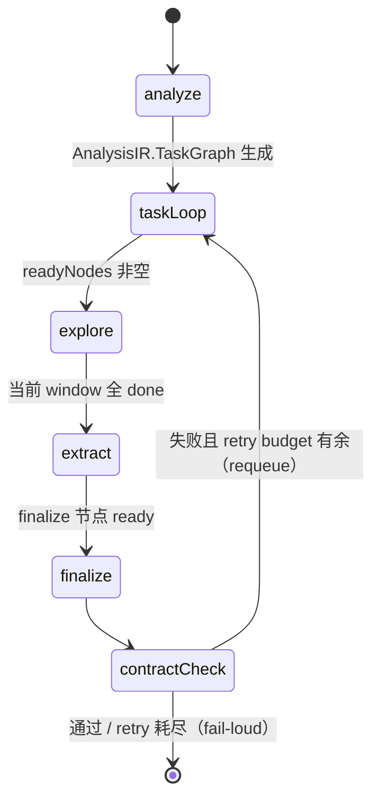
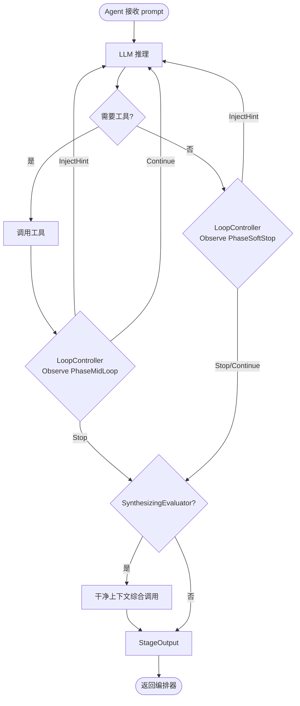
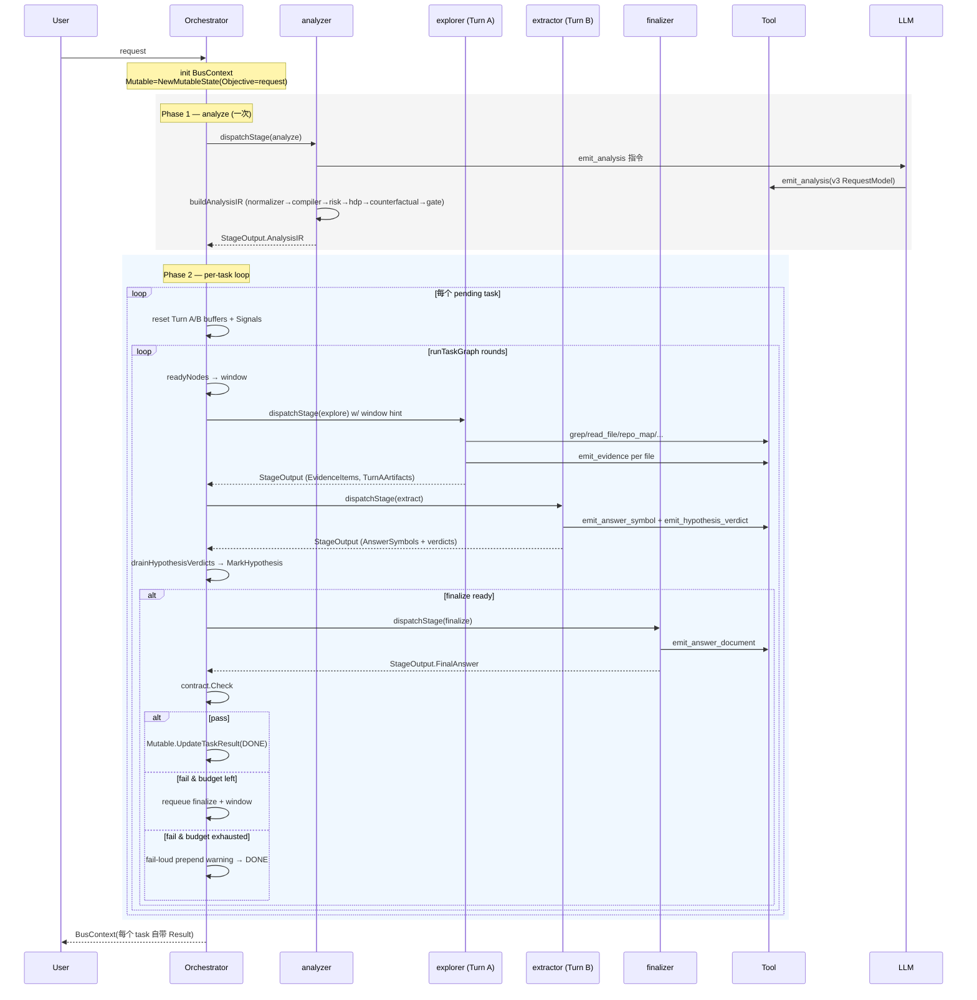

# 架构设计文档

> **当前状态：** codrax 是一个**只读的代码分析工具**。定位是**回答关于代码的问题**，而不是修改代码。4 阶段 × 4 agent 流水线硬编码在 `internal/orchestrator/topology.go`。

## 目录

- [1. 概述](#1-概述)
- [2. 四阶段流水线](#2-四阶段流水线)
- [3. 组件详情](#3-组件详情)
  - [3.1 编排器（Layer 1）](#31-编排器layer-1)
  - [3.2 Agent（Layer 2）](#32-agentlayer-2)
  - [3.3 技能（Layer 3）](#33-技能layer-3)
  - [3.4 工具（Layer 4）](#34-工具layer-4)
  - [3.5 LLM（Layer 5）](#35-llmlayer-5)
- [4. 阶段规范](#4-阶段规范)
- [5. 数据结构](#5-数据结构)
- [6. 请求生命周期](#6-请求生命周期)
- [7. 分析器后处理管线](#7-分析器后处理管线)
- [8. 关键设计模式](#8-关键设计模式)
  - [调查与结构化分离（Turn A / Turn B）](#调查与结构化分离turn-a--turn-b-双-agent)
    - [ERM vs Extractor — 职责边界](#erm-vs-extractor--职责边界)
    - [强约束（Invariants）](#强约束invariants)
  - [结构化数据贯穿全架构](#结构化数据贯穿全架构prose-仅在-llm-边界)
  - [Merged-window DAG schedule](#merged-window-dag-schedule)
  - [诚实失败（fail-loud）](#诚实失败fail-loud)
  - [反过拟合设计原则](#反过拟合设计原则)
- [9. 运行时子系统](#9-运行时子系统)
- [10. 配置](#10-配置)
- [11. 可扩展性](#11-可扩展性)

---

## 1. 概述

### 系统目标

codrax 接收用户的自然语言问题，通过一个**确定性的四阶段流水线**分析目标仓库，最终产出一份结构化的答案文档。系统不做代码修改，不调用外部副作用服务，只读文件、跑 grep、做 repo map。

### 分层

五个逻辑层，只是概念划分 —— 实现上压在四个阶段里：

- **Layer 1 编排层** — 走 DAG、分派阶段
- **Layer 2 执行层** — 4 个专业 Agent 承担一阶段一 ReAct 循环
- **Layer 3 策略层** — 每个 Agent 绑定一个 Skill 配置，决定工作流和输出契约
- **Layer 4 能力层** — 本地只读工具（grep / read_file / repo_map 等）+ emit_* 结构化发射器
- **Layer 5 智能层** — 可插拔的 LLM 适配器

**关键规则：** 所有工具调用和 LLM 调用都必须通过 Layer 2（Agent）。编排器永远不直接调用工具或 LLM。

### 系统概览

```mermaid
graph TB
    User([用户请求])

    subgraph "Layer 1 编排层"
        Orch[编排器<br/>hardcoded topology<br/>+ DAG scheduler]
    end

    subgraph "Layer 2 执行层 (4 Agent)"
        A1[analyzer]
        A2[explorer<br/>Turn A]
        A3[extractor<br/>Turn B]
        A4[finalizer]
    end

    subgraph "Layer 3 策略层 (4 Skill)"
        S1[analysis-skill]
        S2[repo-explore-skill]
        S3[extract-skill]
        S4[answer-document-skill<br/>(fallback: final-answer-skill)]
    end

    subgraph "Layer 4 能力层"
        T[只读工具<br/>grep / read_file / list_files /<br/>repo_map / git_* / exec_command]
        E[结构化发射器<br/>emit_analysis / emit_evidence /<br/>emit_answer_symbol /<br/>emit_hypothesis_verdict /<br/>emit_answer_document]
    end

    subgraph "Layer 5 智能层"
        LLM[LLM 适配器]
    end

    User --> Orch
    Orch -->|dispatch| A1 & A2 & A3 & A4
    A1 --- S1
    A2 --- S2
    A3 --- S3
    A4 --- S4
    A1 & A2 -->|调用| T
    A1 & A2 & A3 & A4 -->|调用| E
    A1 & A2 & A3 & A4 -->|调用| LLM
```

---

## 2. 四阶段流水线

拓扑是**硬编码**的（`internal/orchestrator/topology.go`），没有 `orchestrator.yaml`，也没有优先级加权的转移表或任务策略。编排器只是确定性地走一个 analyzer 产出的 DAG。

| 阶段 | 默认 Agent | 默认 Skill | Terminal |
|------|-----------|-----------|:-:|
| `analyze` | `analyzer` | `analysis-skill` | |
| `explore` | `explorer` | `repo-explore-skill` | |
| `extract` | `extractor` | `extract-skill` | |
| `finalize` | `finalizer` | `final-answer-skill` *（注册时覆盖为 `answer-document-skill`）* | ✅ |

**finalize skill 覆盖**（`orchestrator.go::dispatchStage`）：每次进入 finalize 阶段前，编排器调用 `skills.Get("answer-document-skill")`；命中则把默认的 `final-answer-skill` 替换成 `answer-document-skill`。正常运行时这个 skill 始终注册，单元测试里可以用一个缩小的 skill registry 走 fallback 路径。

### 运行时流程



1. **Phase 1 — `analyze`** 跑一次。analyzer 先用 1-2 轮 evidence-lite 预扫（`repo_map` / `grep files_only=true` / `list_files`）验证用户提到的实体和术语是否在仓库里出现，然后通过 `emit_analysis` 工具写回 v3 `RequestModel`。随后 `analyzer.ParseOutput` 确定性地跑后处理管线（见 §7）组装完整的 `AnalysisIR` 并写进 `BusContext.AnalysisIR`。Analyzer **禁止** 读文件内容（`read_file` / `exec_command` 不在它的 tool allowlist 里），内容阅读是下一阶段 `explore` 的责任。
2. **Phase 2 — per-task 循环**。对 `Mutable.TaskList.Tasks` 里每个 pending 的任务依次跑 `runTaskGraph`，它遍历 `AnalysisIR.TaskGraph.Nodes`：
   - **merged-window schedule**：每一轮把所有 ready 的非 finalize 节点合并成**一次** `explore` dispatch。Node 级别的串行化让 explorer 的 ReAct 循环在内部处理，以换取紧凑的 LLM 调用数。
   - **StageExtract** 在 explore window 完成后作为 Turn B 分派。extractor 看不到新文件，只消费 Turn A 的 `TurnAArtifacts` 快照。
   - **StageFinalize** 仅在 `NodeFinalize` 的所有非 finalize 前驱都 `done` 后分派。
   - **Contract check + backtrack**：finalize 返回后跑 `contract.Check`。不通过且 retry budget 未耗尽 → requeue finalize 节点 + 整个 explorer window，把违规诊断塞进下一轮的 `RetryHint`；retry 耗尽 → 在原答案上 prepend 一条 fail-loud 警告后返回（P0.2 模式）。
3. 每个 task 的 finalize 把答案写进它自己的 `task.Result`（通过 `Mutable.UpdateTaskResult`）。所有 task 跑完后 `Run()` 返回 `BusContext`，`main.go` 遍历 `Tasks` 渲染每个任务的独立结果。

**全局预算** `pipeline_max_steps` 是整 Run 的硬上限，跨 Phase 1 和 Phase 2 共用，在 `config/codrax.yaml` 配置。`EvidencePlan.Budget.MaxReactIters` 是**每个 task** 的额外上限。

---

## 3. 组件详情

### 3.1 编排器（Layer 1）

**职责：**
- 维护全局 `BusContext`
- 分派阶段给对应 Agent（`dispatchStage`）
- 驱动 `graphState` 遍历 DAG
- 跑 contract check + backtrack
- 全局 step budget 守护

**没有的职责（和历史版本对比）：**
- 没有 YAML 拓扑配置
- 没有优先级加权的阶段转移
- 没有 task policy（`analysis` / `implementation` / `high_risk_implementation` 三选一）
- 没有功能开关（`pipeline_enable_verify` / `pipeline_require_review` 等全部删除）
- 不直接调用工具、MCP 或 LLM

编排器的核心数据类型 `graphState`（`internal/orchestrator/scheduler.go`）只记录每个 DAG 节点的状态（`pending` / `running` / `done` / `failed` / `requeued`）和一个跨 window retry 计数。

### 3.2 Agent（Layer 2）

**4 个 Agent**，全部只读。每个 Agent 嵌 `BaseAgent`，后者提供 ReAct 循环，并把 `Evaluator` 接口里的四个钩子连起来：`BuildInitialInstruction` / `ShouldStop` / `ParseOutput` / `DetermineMissingPiece`。

| Agent | Stage | 工具权限 | 职责 |
|-------|-------|----------|------|
| `analyzer` | `analyze` | `emit_analysis` + evidence-lite 预扫（`repo_map` / `grep files_only=true` / `list_files`） | 1-2 轮轻证据预扫验证实体/关键词是否在仓库出现，然后一次 `emit_analysis` 调用产出 v3 `RequestModel`，`ParseOutput` 确定性组装 `AnalysisIR` |
| `explorer`（Turn A） | `explore` | `grep` / `read_file` / `repo_map` / `list_files` / `emit_evidence` / `exec_command` | 两阶段调查（Phase 0 Breadth Scan → Phase 1 Depth Read），独占写 `EvidenceItems` / `AnswerChains` / `FlowFindings`，并把投影快照写入 `TurnAArtifacts` |
| `extractor`（Turn B） | `extract` | **仅** `emit_answer_symbol` + `emit_hypothesis_verdict` | One-shot LLM 调用，读 Turn A digest，产出答案 slate + completeness claim + hypothesis verdict。**禁止文件 IO**，禁止 `emit_evidence` |
| `finalizer` | `finalize` | `emit_answer_document` | 按 `AnswerShape` 渲染结构化答案文档，跑 contract check |

#### ReAct 循环



- **`LoopController`** (`internal/agent/agent.go`)：统一的循环控制钩子，取代了历史上的 `ContinuingEvaluator` + `MidLoopEvaluator` 双接口。`BaseAgent.Execute` 在两个固定时机调用它：
    - `PhaseMidLoop` — 每一轮 tool 调用执行完后调用一次，评估器检测"方向偏了"并请求纠偏提示；
    - `PhaseSoftStop` — 当 LLM 返回纯文本且没有 tool 调用时调用，评估器投票"要不要把 soft-stop 变成强制继续"。

  评估器的 `Observe(ctx, obs) LoopSignal` 只做**检测**：返回 `Progress` / `StopRequested` / `HintRequested`+`Hint`+`HintKey`。节流（`MinInjectInterval`）、去重（按 `HintKey` 匹配上一次已接受的 hint）、预算（`MaxContinuations` / `MaxMidLoopInjects`）、idle-streak 强制停（`IdleStopThreshold`）都由 **`LoopPolicy`**（`internal/agent/loop_policy.go`）在 `loopPolicyState.Apply` 里统一执行，不再由每个评估器各自重复实现 `idleStreak` / `lastToolCount` / `midLoopLastInjectIter`。这条分层规则被 `internal/agent/loop_policy_test.go` 的 12 条场景测试锁定（dedup、throttle、mid-loop 预算 drop、soft-stop 预算 force-stop、tool-result 增长自动重置 idle、显式 stop 立即生效等）。

  **首次软停差异化（2026-04-15）**：`explorerEvaluator.observeSoftStop` 原本有 10 条 return 路径，全部无条件 `HintRequested: true`，导致 LLM 的第一次自愿停下（ReAct 前几轮都在调 tool，第 N 轮首次返回纯文本）被检测器 100% 拦截 —— 初始状态下 LoopPolicy 的 dedup/throttle/budget 三道闸门都是 no-op，拦不住新 key 的硬注入。修复后 `observeSoftStop` 按证据强度把分支分成两类：**硬证据分支**（`phase1.partial-read` 基于符号 range 算术，`phase1.enumeration` 基于 80% 覆盖率硬约束，`phase1.grep-redirect` 基于 truncated 文件几何，加上 Phase 0→1 的三个转场 gate）在任何软停都能触发；**软启发式分支**（`phase1.erm-gap` 的字符串匹配，`phase1.prescanned` 的 top-N 召回，`phase1.unanalyzed` 的 3-字符符号名匹配）和结构性 `phase1.coverage` 兜底在 `obs.ContinuationsUsed == 0` 的首次软停上返回空信号，让 LoopPolicy 接受 LLM 的完成信号；`ContinuationsUsed >= 1` 时全部分支照旧运行。这是"只在 LLM 有硬证据没做完时覆盖它的自愿停下"契约 —— 新的检测分支必须明确落到硬证据或软启发式桶里，测试在 `explorer_test.go::TestExplorerSoftStop_*` 里把这条契约固化。`BaseAgent.Execute` 的 SOFT-STOP 和 MIDLOOP 调试日志都带上了 `key=%q` 字段透传 `sig.HintKey`，配合 `result.Reason` 一起出现在 trace 里，方便事后定位是哪条检测分支投的票。
- **`SynthesizingEvaluator`**：ReAct 循环结束后用干净上下文跑一次综合调用，防止最后一条 assistant 消息是碎片笔记。目前只有 `explorer` 实现。

#### 子 Agent

编排器可以让 explorer 派生并行的 `sub_explorer` 实例分摊独立的调查子问题，通过 `propose_sub_agents` 工具向编排器申请。`sub_explorer` 不共享 `Mutable`，`todo_write` / `emit_*` 在 sub-agent 上下文会被拒绝。

### 3.3 技能（Layer 3）

```go
type Config struct {
    Name          string
    Goal          string
    Workflow      []string
    ToolSuggestions []string
    OutputFormat  string
    Prohibitions  []string
}
```

技能是**声明式配置**，不是执行者 —— Agent 加载 skill，按它的 workflow 决定 prompt、按它的 `ToolSuggestions` 决定允许的工具、按它的 `Prohibitions` 决定禁止事项。Extract-skill 显式在 `Prohibitions` 里禁止 `emit_evidence`（Turn B 不能侵犯 Turn A 的 evidence 通道）。

#### Skill vs Evaluator 职责边界

Skill 和 Evaluator 在职责上严格二分，任何一端越界都会导致 prompt 漂移：

**一句话契约**：**`PromptContext` 负责 prompt 主体（静态 skill 合同 + 通用动态段），Evaluator instruction 只负责本轮独有的动态补充，禁止重复 skill 静态合同。** 这条规则在三个层面被强制：接口层 `Evaluator.BuildInitialInstruction` 的 doc comment、builder 层 `canonicalSystemSectionOrder` / `canonicalUserSectionOrder` 的去重断言，以及测试层 `TestAnalyzer_BuildInitialInstruction_IsEmpty` + `TestAnalyzerPrompt_NoStaticContractText` 的回归围栏。

| 层级 | 归属 | 承载内容 | 物理位置 |
|------|------|----------|----------|
| **Static（静态契约）** | Skill | 角色身份、Workflow、OutputFormat、Prohibitions、字段枚举、ToolSuggestions —— 与"本次请求"无关的所有内容 | `internal/skill/` 下的 `Config` 字面量（或构造器，如 `BuildAnalysisSkill`）。`context.BuildPromptContext` 每次 dispatch 把这些字段渲染进 system 段 |
| **Dynamic（动态上下文）** | Builder | 通用的 per-dispatch 段：User Request / Retry Directive / Prior Findings / Known Facts / Structured Evidence / Dataflow Findings / Answer Symbols / Hypothesis Verdicts / Relevant Files / Missing Piece | `internal/context/builder.go::BuildPromptContext`。`canonicalSystemSectionOrder` + `canonicalUserSectionOrder` 两个数组把标题顺序固化下来 |
| **Stage-specific supplement（本轮专属补充）** | Evaluator | 只有 builder 无法泛化产出的、本 stage 本轮独有的段：extractor 的 Turn A digest、answer-document 的 resolved shape + cardinality baseline + prior slate | `Evaluator.BuildInitialInstruction`。`BaseAgent.buildInitialMessages` 通过 `AppendDynamicInstruction` 把它作为 **额外** 的 user 消息追加到 builder 输出之后 |

**约束**：

1. Evaluator 的 `BuildInitialInstruction` 必须**只**输出 stage-specific supplement。它绝对不能重述 skill 的任何字段，也不能再发射 builder 已经写过的标题（`canonicalSystemSectionOrder` / `canonicalUserSectionOrder`）—— 标题冲突会让 LLM 看到两份同名段并在两者漂移时收到互相矛盾的指令。
2. Skill 是唯一承载"做什么"的声明式入口。任何对 workflow、字段枚举、输出格式、禁止项的改动都只发生在 skill 文件里。一处改完两处联动（比如 emit_* 工具的 JSON schema 从 skill 的 SSOT 读枚举）是目前强制这条规则的主要防线。
3. Evaluator 的另一半职责是 `ParseOutput`——从 LLM 输出提取结构化结果并跑 stage-specific 的后处理管线。对 analyzer 来说这就是 normalizer → compiler → risk → hdp → counterfactual → gate。Skill 里永远不写这类代码逻辑。

**Analyzer 是这条边界的极小参照实现**：

- 静态契约全部落在 `analysis-skill`（由 `internal/skill/analysis_contract.go::BuildAnalysisSkill` 构造，字段枚举来自同文件的 SSOT 表）；
- `analyzerEvaluator.BuildInitialInstruction` 恒返回空字符串——analyzer 没有任何 builder 未覆盖的动态补充；
- 唯一的输出通道是 `emit_analysis` 工具（一次性调用），IR 的拼装全部由 `ParseOutput` 里的确定性管线完成；
- `TestAnalyzer_BuildInitialInstruction_IsEmpty` 把"空补充"这条契约固化，任何回写静态文本的改动会在这里失败。

Extractor 和 Finalizer 是"非空补充"的参照实现：extractor 的 `BuildInitialInstruction` 只输出 Turn A transcript digest（新段，builder 不知道怎么产出），finalizer 的 `answer_document_evaluator.BuildInitialInstruction` 只输出 resolved target shape + cardinality baseline + prior slate。两者都**不**重述 User Request / Workflow / Output Format 等 builder 已经写过的段。

### 3.4 工具（Layer 4）

工具通过嵌入 `tool.ReadOnly` 满足 `IsWrite() bool` —— 所有现存工具都是 read-only。`Execute` 收到的 `*BusContext` 是窄视图：只有 `RepoRoot` / `Branch` / `Commit` / `WorkDir` / `Mutable` 被填充，其他字段置零，物理上限制工具只能修改 `Mutable`。

#### 内置工具

| 工具 | 描述 |
|------|------|
| `grep` | 按模式搜索；支持 `files_only=true`（对应 `rg -l`）返回匹配文件列表而非每行。Phase 0 依赖此模式避免大量匹配行被 blob 截断 |
| `read_file` | 读整文件；大文件用 `offset+limit` slice 读 |
| `list_files` | 列目录 |
| `repo_map` | 生成仓库符号/关系索引的结构化视图。`task_map` 视图给 Phase 0 快速定位角色 |
| `exec_command` | 执行 shell 命令（按 read-only 处理，写限制靠外部沙箱） |
| `git_diff` / `git_log` | git 状态查询 |
| `todo_write` | 在 `Mutable.TaskList` 上做全量替换。sub-agent 不共享 `Mutable`，调用会被拒 |

#### 结构化发射器（emit_* 系列）

以下工具本质上是把 LLM 的结构化输出**落到 `Mutable`** 的持久化通道。各 Agent 严格独占自己的通道：

| 工具 | 独占 Agent | 作用 |
|------|-----------|------|
| `emit_analysis` | analyzer | 一次性写 `RequestModel`（intent / scenario / complexity / keywords / entities / question_kind / answer_shape）；ParseOutput 随后跑确定性管线组装完整 `AnalysisIR` |
| `emit_evidence` | explorer | 批量写 `EvidenceItem`（kind / subject / object / source / line / condition / summary）；五种结构化 tag：`[DIRECT]` `[CONDITIONAL]` `[REGISTRATION]` `[MECHANISM]` `[RELATIONSHIP]` `[ABSENT]` |
| `emit_answer_symbol` | extractor | 写答案符号 slate + `completeness` claim（`complete` / `lower_bound` / `unknown`）；`extractor.ParseOutput` 跑 Phase 9 cardinality validator 自动降级不诚实的 `complete` claim |
| `emit_hypothesis_verdict` | extractor | 为 `AnalysisIR.HypothesisSet` 的每条 hypothesis 写 status (`confirmed` / `rejected` / `inconclusive`) + rationale + `file:line` citation。编排器的 post-extract hook 通过 `AnalysisIR.MarkHypothesis` 写回 IR |
| `emit_answer_document` | finalizer | 写结构化 `AnswerDocument`（按 `AnswerShape` 分支的 typed payload）；renderer 层产生用户可见的最终答案 |
| `propose_sub_agents` | 主 agent 用 | 向编排器申请派生并行 sub-agent |

#### ToolResult 与 blob 机制

```go
type ToolResult struct {
    ToolName  string
    Summary   string
    RawRef    string    // 大输出落到 WorkDir 时写的文件路径
    Success   bool
    Timestamp time.Time
}
```

工具结果超过 `blob_max_inline_bytes`（默认 32 KB）时会 offload 到 per-trace 的 WorkDir 临时目录，只把 head/tail preview 塞进 LLM 上下文；Agent 想看全文就调用 `read_file` 指向 `RawRef`。Blob 大小参数在 `config/codrax.yaml` 的 `blob_*` 键下配。

### 3.5 LLM（Layer 5）

LLM adapter 是可插拔的最小接口：

```go
type Adapter interface {
    Chat(messages []Message, tools []ToolSchema) (Response, error)
    ModelID() string
    MaxContextTokens() int
}
```

Per-agent 模型路由在 `config/providers.yaml` 里配（不同 Agent 可以指向不同模型 / 不同 provider）。provider 级别的降级链（主模型 → fast 模型）也在 provider config 里声明。

---

## 4. 阶段规范

### 4.1 `analyze` — 请求理解

| 方面 | 详情 |
|------|------|
| **Agent** | analyzer |
| **Skill** | `analysis-skill` |
| **工具** | `emit_analysis` + evidence-lite 预扫（`repo_map` / `grep`（必须 `files_only=true`） / `list_files`） |
| **输入** | 用户原始请求 |
| **工作** | **Phase A**：1-2 轮 evidence-lite 预扫，验证用户提到的实体/术语是否在仓库出现（存在 + 位置，**不读内容**）→ **Phase B**：一次 `emit_analysis` LLM 调用写 v3 RequestModel → `ParseOutput` 跑 `normalizer → compiler → risk → hdp → counterfactual → gate`（见 §7） |
| **输出** | `BusContext.AnalysisIR`（`TaskGraph` / `EvidencePlan` / `AnswerContract` / `HypothesisSet` / `QualityGate`） |

**Evidence-lite 预扫边界规则**（由 `internal/skill/analysis_contract.go::AnalysisHardRules` 里的 `EVIDENCE-LITE BOUNDARY:` 前缀规则 enforce，测试在 `internal/agent/analyzer_prompt_test.go::TestAnalysisSkill_*`）：

- 只允许 `repo_map`、`grep`（强制 `files_only=true`）、`list_files` 三个只读导航工具 —— `BaseAgent.buildToolSchemas` 通过 `analysis-skill.ToolSuggestions` allowlist 物理裁剪 LLM 看到的 schema，`read_file` / `exec_command` / 其他阶段的 `emit_*` 通道根本不在候选集中；**并且 `grep` 必须带 `files_only=true`**：`BaseAgent.executeTool` 在分派给工具之前跑 `validateAnalyzerPrescanToolCall` 预检，发现 `ctx.Stage == StageAnalyze && tc.Name == "grep"` 且参数里没有 `files_only=true` 就直接合成一个失败的 `ToolResult`（Summary 里写明 evidence-lite boundary 规则），LLM 在下一轮看到错误可以就地重试。这条硬约束把原本的 prompt 提示升级成运行时 gate，即使 LLM 忘记提示也没法绕过；
- 预扫硬上限 2 轮，**由 `analyzerEvaluator.Observe` 在 ReAct 层运行时强制**：每一轮 PhaseMidLoop 观测里，如果 `obs.LastToolResult` 是三个预扫工具之一就给 `prescanRounds` 计数 +1；一旦计数严格超过 `tool.AnalysisLimits.MaxPrescanRounds`（默认 2，可通过 `codrax.yaml` 里 `analysis_max_prescan_rounds` 覆写；设为 0 可禁用 gate），下一次预扫会返回 `LoopSignal{StopRequested: true}`，`BaseAgent` 立即终止 dispatch，`ParseOutput` 的 failsafe 走 0-call 分支合成零值 `RequestModel`。这条 runtime gate 把原本只是 skill prompt 文案的 "1-2 rounds" 上限变成真正的约束，即使 LLM 不看 prompt 也会被限制；诊断字段 `analysis_prescan_rounds` 和 `analysis_prescan_budget_exhausted` 在 `StageOutput.Data` 里告诉 operator gate 是否触发过。混合批次（同一轮里 `emit_analysis` 跟在预扫工具之后）不计入 round，因为 `LastToolResult` 指向最后一个执行的 tool —— `emit_analysis` 作为 "last" 正好是期望的终止状态；
- **pre-scan → validator 数据通道**：同一次 `Observe` 在计数的同时，会把 `obs.LastToolResult.Summary` 通过 `Mutable.AppendPrescanSummary` 追加到一个**按小写保存**的 per-dispatch 缓冲区 `prescanSummaryBlob`（`internal/types/context.go`）。`emit_analysis.Execute` 在跑 `validateAnalysisInput` 时读取这个缓冲作为两个独立机制的输入：
  - **verified-entity 白名单**（`filterGenericEntitiesWithWhitelist` in `internal/tool/analysis_limits.go`）：LLM 提交的实体命中 generic blocklist（如 `Agent`、`Handler`），但该实体的小写形式也出现在 seen-blob 里时，视作"预扫验证过的真实仓库符号"，KEEP 掉它并触发 `kept_generic_verified_entities` 告警。缓冲为空时回退到历史严格删除行为，向后兼容。
  - **runtime quality probe**（`tool.ComputeAnalysisQualityProbe`）：每次 `emit_analysis` 执行都计算 `keyword_hit_ratio` 和 `entity_hit_ratio`（= 命中数 / 总数），两个软阈值 `analysis_warn_below_keyword_hit_ratio` / `analysis_warn_below_entity_hit_ratio`（默认 0 = 不触发告警）把它们从纯诊断变成"低于就在 Summary 里带 `[warn: …]`"的软墙。完整的 probe 结构 `{keyword_hits, keyword_total, keyword_hit_ratio, entity_hits, entity_total, entity_hit_ratio, prescan_rounds}` 不管阈值是否触发都会以 `analysis_quality_probe` 的形式写到 `StageOutput.Data`，explorer 阶段和 eval harness 可以直接读这一个字段拿到 pre-scan → classification 的所有质量指标；
- 预扫完成（不论结果如何）后，analyzer 必须调用 `emit_analysis` 一次。即使某个实体在预扫中没找到，也依然放进 `entities` 数组（downstream 的 ERM ranking 层会处理 non-existent 的 term）；
- `call-count gate` 仍然只统计 `emit_analysis` 的调用次数（见下文），预扫工具调用不计入，和 `prescan gate` + `quality probe` 一起是三条正交的诊断通道：前者管"是否被调用"，第二个管"调了几次预扫"，第三个管"预扫找到的东西和 LLM 说的是否一致"。

Quality Gate 的 `Rejected` 区分 **hard failure**（`nil_ir` / `dag_closure` / `contract_complete` → 直接失败 Run）和 **soft failure**（`coverage` / `budget_sanity` / `hypothesis_coverage` / `risk_consistency` → log warning，继续跑）。

**emit_analysis call-count gate.** Skill 文案里写的是 "call emit_analysis EXACTLY ONCE"，但 ReAct 循环和工具本身都允许 0 或 N 次。`analyzer.ParseOutput` 在走 `buildAnalysisIR` 之前扫一遍本次 dispatch 的 tool-result 流，把 emit_analysis 的实际调用次数和 fallback 决策以结构化字段透出到 `StageOutput.Data`：

| 字段 | 含义 |
|------|------|
| `analysis_emit_calls` | 本次 dispatch 里 emit_analysis 的总调用次数（成功 + 失败都计，因为 LLM 的"意图"才是 gate 要测的） |
| `analysis_fallback_used` | 进入 `ParseOutput` 时 `Mutable.RequestModel()` 是否为 nil —— 等价于 `readOrSynthesizeRequestModel` 走了零值合成路径 |

三条分支行为：

- **0 次**：触发强告警（`logging.Warning` + 目标问题的前 120 字节），走 failsafe 合成零值 `RequestModel`，`analysis_fallback_used=true`，**不**写 `StageOutput.Error`。0 次是 warn-only，永远不因为单次 LLM 抖动把整条 pipeline 拉断——但结构化字段会把"真的发生了 fallback"这件事透出来，eval 能直接 diff。
- **1 次**：happy path。不打任何日志，`analysis_fallback_used=false`，`analysis_emit_calls=1`。
- **>1 次**：行为由 `tool.AnalysisLimits.RejectMultipleEmit` 决定。默认 `false` → 打 warning、保留最后一次写入、继续跑；`true` → 额外把描述性消息写进 `StageOutput.Error`，IR 还是按最后一次写入填充（让下游 stage 在 operator 选择忽略 error 信号时也能继续）。该 knob 由 `analysis_reject_multiple_emit` 配置。

`analysis_emit_calls` 的计数和 Quality Gate 正交：两条错误通道可以同时 fire，Quality Gate 的 hard failure 优先（它先写 `out.Error`），call-count gate 只在 gate error 为空时才会覆盖 `out.Error`。

### 4.2 `explore` — Turn A：调查 + 证据收集

| 方面 | 详情 |
|------|------|
| **Agent** | `AgentExplorer` (`internal/agent/explorer.go`) |
| **Skill** | `repo-explore-skill` |
| **允许工具** | `grep` / `read_file` / `repo_map` / `list_files` / `exec_command` / `emit_evidence` |
| **内部状态** | `explorerEvaluator.phase`（0=breadth, 1=depth） |
| **输出** | `StageOutput.{EvidenceItems, AnswerChains, FlowFindings, StageReport}` + `MutableState.TurnAArtifacts` |

- **Phase 0 — Breadth Scan**：`repo_map` (task_map 视图) + `grep files_only=true` + `list_files` 快速定位相关文件，不读全文。LLM 产出 3-6 个文件的优先读取清单。
- **Phase 0 → Phase 1 质量门**：必须同时满足 (1) 用过 grep，(2) 用过 repo_map 或 list_files，(3) 发现 ≥ 3 个文件。任一未满足返回一次补救 prompt。
- **Phase 1 — Depth Read + Evidence Collection**：LLM 按清单 `read_file`，每读一个文件调用一次 `emit_evidence(items=[...])`。大文件（>500 行）强制先 grep 再 slice read。行号必须来自 `read_file` 的 gutter。
- **ParseOutput（确定性管线）**：`ensureStructuredEvidence` 合并 emit_evidence buffer + markdown fallback parser → `groundEvidenceItems` → `mergeEvidenceItems` → `rankEvidenceByRelevance` → `scrubSiblingEvidenceBlocks` → `identifyAnswerChains` → `SetTurnAArtifacts` 把投影快照交给 Turn B。

#### runtime file coverage

Phase 1 的 continuation 决策基于 runtime 数据而不是固定阈值：从 tool history 提取 grep 发现的文件 + 已读文件 → 过滤噪音路径（VCS / 依赖目录 / 日志）→ 向 LLM 展示覆盖状态，由 LLM 判断哪些还值得读。

### 4.3 `extract` — Turn B：答案结构化 + 假设判定

| 方面 | 详情 |
|------|------|
| **Agent** | `AgentExtractor` (`internal/agent/extractor.go`) |
| **Skill** | `extract-skill` |
| **允许工具** | **仅** `emit_answer_symbol` + `emit_hypothesis_verdict` |
| **禁止工具** | `read_file` / `grep` / `repo_map` / `list_files` / `exec_command` / `emit_evidence` |
| **ShouldStop** | `iteration >= 1`（one-shot，无 ReAct 循环，无 retry） |
| **输入** | `MutableState.TurnAArtifacts` digest + `AnalysisIR.HypothesisSet` + `AnswerContract.MustInclude` |
| **输出** | `StageOutput.{AnswerSymbols, AnswerSymbolCompleteness}` + 回写 `HypothesisSet[i].Status` |

Turn B 有且只有**两项** Turn A 做不到的独特职责：

1. **LLM-driven answer_symbol slate + completeness claim**。LLM 读 Turn A 的证据决定 slate，附 `complete` / `lower_bound` / `unknown` 声明。Phase 9 cardinality validator（`validateCompletenessClaim`）：当 LLM claim `complete` 但 `len(items) < max(TerminalEvidenceCount, len(MustInclude))` 时，claim 自动降级为 `lower_bound` 并 log warning。
2. **LLM-driven hypothesis verdict + citation**。为 IR 里每条 hypothesis 给 confirmed/rejected/inconclusive 判定；confirmed/rejected 强制带 `file:line` citation。编排器 post-extract hook 调 `AnalysisIR.MarkHypothesis` 写回 IR，buffer 保留给 finalizer prompt 渲染 rationale。

#### Turn B 为什么是 one-shot

Turn B 看不到新文件 —— 所有信息在 Turn A transcript 快照里冻结。retry 带不来新信息。设计决定：错了就降级为 `lower_bound` 而不是 retry，这是诚实的终态。

### 4.4 `finalize` — 输出收敛

| 方面 | 详情 |
|------|------|
| **Agent** | finalizer |
| **Skill** | `answer-document-skill`（运行时 override）/ `final-answer-skill`（仅单元测试 fallback） |
| **工具** | `emit_answer_document`（独占） |
| **输入** | `BusContext.AnalysisIR.AnswerContract` + `AnswerSymbols` + completeness + `HypothesisSet` + Turn A 的 `StageReport` |
| **工作** | 按 `RequiredAnswerShape` 分支构造 typed payload → 调 `emit_answer_document` → renderer 渲染 |
| **输出** | `StageOutput.FinalAnswer`（写进 task.Result）|

#### 职责边界（严格不重叠）

| 产物 | 归属 | 路径 |
|------|------|------|
| `EvidenceItems` | **Explorer 独占** | `emit_evidence` + markdown fallback + merge |
| `AnswerChains` | **Explorer 独占** | 确定性 `identifyAnswerChains` |
| `FlowFindings` | **Explorer 独占** | 确定性 dataflow pipeline |
| `StageReport` prose digest | **Explorer 独占** | `renderExplorerStageReport` |
| `TurnAArtifacts` 快照 | **Explorer 写，Extractor 读** | `SetTurnAArtifacts` / `TurnAArtifacts()` |
| `AnswerSymbols` + completeness claim | **Extractor 独占** | `emit_answer_symbol` + Phase 9 validator |
| `HypothesisSet[i].Status` | **Extractor 写 buffer** | `emit_hypothesis_verdict` + `drainHypothesisVerdicts` hook |
| `AnswerDocument` | **Finalizer 独占** | `emit_answer_document` + renderer |

---

## 5. 数据结构

> **BusContext 不是 model context 本身。** 它是构建 Agent 专属 model context 的运行时事实源：
>
> `BusContext`（完整共享状态） → 裁剪 → `AgentContext`（Agent 范围视图） → 组装 → `PromptContext`（模型 prompt 载荷） → 发送 LLM

### 枚举

```go
type PipelineStage string
const (
    StageAnalyze  PipelineStage = "analyze"
    StageExplore  PipelineStage = "explore"
    StageExtract  PipelineStage = "extract"
    StageFinalize PipelineStage = "finalize"
)

type AgentName string
const (
    AgentAnalyzer  AgentName = "analyzer"
    AgentExplorer  AgentName = "explorer"   // Turn A
    AgentExtractor AgentName = "extractor"  // Turn B
    AgentFinalizer AgentName = "finalizer"
)

type Intent string // IntentExplain / IntentRootCause / IntentTrace /
                   // IntentEnumerate / IntentConfigQuery /
                   // IntentReturnValue / IntentUnknown

type Scenario string // ScenarioArchitectureExplain / ScenarioRootCause /
                     // ScenarioConfigTrace /
                     // ScenarioPerformanceBottleneck / ScenarioGeneric

type Complexity string // ComplexitySimple / ComplexityModerate / ComplexityComplex

type MissingPiece string
const (
    MissingNone          MissingPiece = "none"
    MissingUnderstanding MissingPiece = "understanding"
    MissingFacts         MissingPiece = "facts"
)

type TaskStatus string
const (
    TaskPending    TaskStatus = "pending"
    TaskInProgress TaskStatus = "in_progress"
    TaskDone       TaskStatus = "done"
    TaskBlocked    TaskStatus = "blocked"
    TaskFailed     TaskStatus = "failed"
)
```

### BusContext

```go
type BusContext struct {
    Mutable *MutableState  // 工具可写域

    TaskState TaskState
    PipelineStage PipelineStage
    ActiveAgent   AgentName

    RepoRoot  string
    Branch    string
    Commit    string
    WorkDir   string       // per-trace 临时目录（blob offload）
    ModuleMap []string

    // 共享事实
    RepoFacts     []RepoFact
    EvidenceItems []EvidenceItem
    FlowFindings  []FlowFindingDigest
    AnswerChains  []AnswerChain        // 结构化：每条携带 Item+Score+StrictOK
    AnswerSymbols []AnswerSymbol
    AnswerSymbolCompleteness CompletenessClaim
    ToolResults   []ToolResult
    StageReports  []StageReport

    Signals ExecutionSignals   // 只剩 HasEnoughFacts

    Constraints []string
    Preferences []string

    LastTransitionReason string
    TraceID              string

    AnalysisIR *AnalysisIR  // 由 analyze 阶段一次性写入
}

// ExecutionSignals 在简化后只剩一个字段 —— 写入流水线相关的
// HasPlan / HasPatch / DesignReviewPassed / CodeReviewPassed /
// VerificationPassed / LastStageFailed / LastFailureReason /
// RetryCount 全部随着 plan / review / verify 阶段删除一起删掉。
type ExecutionSignals struct {
    HasEnoughFacts bool
}
```

### AnalysisIR

单一的结构化输出来源，analyzer 是**唯一** writer；下游阶段只能通过 dedicated API（`MarkHypothesis`、per-node 执行状态）做受控修改。

```go
type AnalysisIR struct {
    Version        string          // "v3"
    TraceID        string
    RequestModel   RequestModel    // Intent / Scenario / Complexity /
                                   // TermGraph / RiskMatrix / AnalyzerHints
    TaskGraph      TaskGraph       // Nodes / Edges / ExecutionPolicy
    EvidencePlan   EvidencePlan    // Budget / SourceMix / StopConditions
    AnswerContract AnswerContract  // RequiredAnswerShape / MustInclude /
                                   // CitationReq / Language
    HypothesisSet  []Hypothesis
    QualityGate    GateReport
}
```

**`RunPolicy` 字段已删除**。历史版本这里放的是写入流水线的开关（`AllowWrite` / `RequireReview` / `RequireVerification` / `MaxRetriesPerStage` 等），全部随着那些阶段一起删。

#### TaskNode 类型

```go
type TaskNodeType string
const (
    NodeProbe     TaskNodeType = "probe"
    NodeEvidence  TaskNodeType = "evidence"
    NodeValidate  TaskNodeType = "validate"
    NodeReconcile TaskNodeType = "reconcile"
    NodeFinalize  TaskNodeType = "finalize"
)
```

Scheduler 的 `stageMapping` 把前四种节点（probe / evidence / validate / reconcile）全部映射到 `StageExplore`（merged window），只有 `NodeFinalize` 映射到 `StageFinalize`。写入相关的节点类型（design / implement / review / verify）已删除。

#### AnswerShape

```go
type AnswerShape string
const (
    ShapeListOfSymbols AnswerShape = "list_of_symbols"
    ShapeStepList      AnswerShape = "step_list"
    ShapeValue         AnswerShape = "value"
    ShapeBoolean       AnswerShape = "boolean"
    ShapeConfigValue   AnswerShape = "config_value"
    ShapeExplanation   AnswerShape = "explanation"
    ShapeNone          AnswerShape = "none"  // 不能落进 AnswerDocument
)
```

`ShapeNone` 是类型系统里的占位 —— 真正的 `emit_answer_document` 会拒绝它，防止 zero-value 漂到 renderer。

#### RiskMatrix

六维 0-5 打分（`Security` / `DataIntegrity` / `Compatibility` / `Performance` / `Ops` / `Compliance`），`risk.Evaluate` 从 term graph 推导 evidence。hdp 根据 risk level 决定是否 plan 额外的 hypothesis。

### TaskItem / TaskList

```go
type TaskItem struct {
    ID          string
    Title       string
    Description string
    Status      TaskStatus
    Result      string   // 每个 task 由自己的 finalize 阶段填充
}

type TaskList struct {
    Objective     string
    Tasks         []TaskItem
    CurrentTaskID string
}
```

`TaskItem` 已经**不再**携带 `Writing` / `HighRisk` / `Complexity` 字段 —— 这些是原先驱动 task policy 三选一的属性，policy 机制删除后一起删了。

### MutableState

BusContext 中唯一允许工具直接 mutate 的区域，通过指针共享。内置 RWMutex。Sub-agent 不共享这个区域（`BuildSubAgentContext` 故意把 `ac.Mutable` 留成 nil）。公开 API 都是 goroutine-safe：`TaskList()` / `SetTaskList()` / `UpdateTaskStatus()` / `UpdateTaskResult()` / `SetCurrentTask()`，以及 emit_* tool 用的 buffer getter/setter + `Reset*` 家族（跨 task 清零用）。

### AgentContext

```go
type AgentContext struct {
    AgentName AgentName
    Stage     PipelineStage

    Objective              string
    CurrentTaskID          string
    CurrentTask            string
    CurrentTaskDescription string

    AnalysisIR *AnalysisIR  // 别名 BusContext.AnalysisIR

    // 窄化后的事实视图
    RelevantFacts         []string
    RelevantFiles         []string
    EvidenceItems         []EvidenceItem
    FlowFindings          []FlowFindingDigest
    AnswerChains          []AnswerChain
    AnswerSymbols         []AnswerSymbol
    AnswerSymbolCompleteness CompletenessClaim
    RelevantToolSummaries []string
    PriorReports          []StageReport

    Constraints []string
    Preferences []string

    MissingPiece MissingPiece
    RetryHint    string   // contract-check backtrack 时带进来的违规诊断

    RepoRoot string
    Branch   string
    Commit   string
    WorkDir  string

    Mutable *MutableState  // 别名 BusContext.Mutable 让工具可写
}
```

历史字段 `PlanSummary` / `PatchSummary` / `ReviewSummary` / `VerificationSummary` / `CurrentTaskWriting` / `CurrentTaskHighRisk` 全部删除（对应的写入阶段已不存在）。

---

## 6. 请求生命周期



---

## 7. 分析器后处理管线

`analyzer.buildAnalysisIR`（`internal/agent/analyzer.go`）在 ReAct 循环结束后**确定性**地跑以下子包：

| 阶段 | 包 | 输入 | 输出 |
|------|----|------|------|
| 1. Normalize | `internal/analysis/normalizer` | `RawRequest` | `TermGraph`（canonical terms + aliases） |
| 2. Infer scenario | `internal/analysis/compiler` | `RequestModel` | `Scenario` 默认值（LLM 未指定时） |
| 3. Compile | `internal/analysis/compiler` | `RequestModel` | `TaskGraph` + `EvidencePlan` + 默认 `AnswerContract` |
| 4. Risk evaluate | `internal/analysis/risk` | `RequestModel` | `RiskMatrix`（六维 0-5 打分） |
| 5. Hypothesis plan + bind | `internal/analysis/hdp` | `RequestModel` + `TaskGraph` | `[]Hypothesis` + 绑到 TaskNode |
| 6. Counterfactual expand | `internal/analysis/counterfactual` | `TaskGraph` + `RequestModel` | 可选的 counterfactual branch（默认关闭，仅 complex + ambiguous 触发） |
| 7. Quality gate | `internal/analysis/gate` | 完整 IR | `GateReport` + `Rejected` flag |

**不变量**：每一步都可在零输入下退化到安全默认值。LLM 完全没调用 `emit_analysis` 时，`readOrSynthesizeRequestModel` 用 raw objective 组装一个零值 `RequestModel`，compiler 的 generic template 和零 RiskMatrix 仍能产出结构上完整的 IR。

**Quality Gate 分层**：
- **Hard failures**（`nil_ir` / `dag_closure` / `contract_complete`）→ `StageOutput.Error` 抛出 → Run 硬失败。
- **Soft failures**（`coverage` / `budget_sanity` / `hypothesis_coverage` / `risk_consistency`）→ 记 warning，继续跑，让评测能 diff 软失败而不是整批 abort。

---

## 8. 关键设计模式

### 调查与结构化分离（Turn A / Turn B 双 Agent）

探索阶段混合了两种本质不同的活动 —— **调查**（读文件、收集事实）和**结构化**（组织成机器可消费的答案 slate / hypothesis verdict）。两种活动对 LLM 的上下文预算、工具访问权限和 prompt 压力完全不同：

- 调查需要文件 IO、ReAct 循环、迭代探索、大上下文窗口
- 结构化需要完整证据视图、零文件 IO、一次性 commit、严格 schema

**解法：**两个独立 Agent 串行接力。Turn A explorer 承担调查，Turn B extractor 承担结构化。

#### ERM vs Extractor — 职责边界

ERM（Evidence Requirement Model）和 extractor 常被混为一谈，但它们是**同一条流水线上的两个不重叠阶段**：

|  | **ERM**（Turn A 内） | **Extractor**（Turn B） |
|---|---|---|
| **文件** | `internal/agent/explorer_erm.go` | `internal/agent/extractor.go` |
| **关心的问题** | "LLM 还需要读哪些文件才能回答？什么时候可以停？" | "Turn A 收集的证据里，哪些是真正的答案？答案列完了吗？" |
| **输入** | AnalysisIR + 运行中累积的 notes/evidence | Turn A 冻结后的完整 `TurnAArtifacts` 快照 |
| **产出** | 下一步读文件建议（`ermSuggestFiles`）+ 停止信号（`ermAllSatisfied`）+ β 基线（`terminalEvidenceCount`） | `AnswerSymbols[]` + `CompletenessClaim` + `HypothesisVerdicts[]` |
| **工具权限** | 完整：`read_file` / `grep` / `repo_map` / `emit_evidence` | 严格受限：只能 `emit_answer_symbol` / `emit_hypothesis_verdict` |
| **LLM 调用次数** | 每轮一次（ReAct loop，可能 3~10 次） | **一次**（`ShouldStop: iteration >= 1`） |
| **运行模式** | 确定性规则（纯 Go，LLM 不参与） | LLM 主导 + 确定性验证兜底（`validateCompletenessClaim`） |
| **诚实契约** | "我已经尽力收集所有相关证据" | "我不会谎称列全了" |

一句话总结：
- **ERM 是 Turn A 的"投入阶段"** — 决定 LLM 去读什么、什么时候够了
- **Extractor 是 Turn B 的"收尾阶段"** — 从已读的东西里挑出真正的答案，并确保 LLM 不瞎说它列全了

两者共享"证据"这个对象，但一个是"生产者的监工"，一个是"消费者的校对员"。

#### 强约束（Invariants）

任何 PR 改动这两层的代码都必须保持以下不变式：

1. **Turn B 禁止文件 IO。** `extract-skill.ToolSuggestions` 只开放 `emit_answer_symbol` / `emit_hypothesis_verdict`，`buildToolSchemas` 依赖这个 allowlist 物理裁剪 LLM schema。任何给 extractor 加 `read_file` 权限的 PR 都会破坏"Turn B 的事实只能来自 Turn A 快照"这条线。
2. **Turn A 禁止答案面板。** `StageOutput.AnswerSymbols` 和 `StageOutput.AnswerSymbolCompleteness` 在 Turn A 的 ParseOutput 里被显式置零；Turn B 是 AnswerSymbols 的唯一生产者。`explorer.go:ParseOutput` 的结构体字面量留白并附注释锁定这一点。
3. **Analyzer 是 AnalysisIR 的唯一 writer。** 其他 stage 只能通过专属 API（当前只有 `MarkHypothesis` 一个）修改 `HypothesisSet[*].Status`，不得重写结构字段。`applyStageOutput` 只在首次非 nil 时赋值，后续 analyze re-dispatch 不会覆盖现有 IR。
4. **Turn A 的 StageReport 必须是确定性渲染。** explorer 的 ParseOutput 不读 LLM 最后一条消息，而是调用 `renderExplorerStageReport` 从 typed `[]EvidenceItem` / `[]FlowFindingDigest` / `[]AnswerChain` 渲染出 canonical markdown。任何"把 LLM assistant content 拿来当 StageReport"的 PR 都会把 Turn A 重新打开成 prose-dependent 路径。
5. **Completeness claim 必须经过 cardinality validator。** Turn B 的 LLM 声明 `complete` 时，`validateCompletenessClaim` 用 `max(β=TerminalEvidenceCount, γ=len(MustInclude))` 交叉验证；slate 不足就降级为 `lower_bound` 并 log warning。任何绕过 validator 直接把 LLM claim 传给 finalizer 的 PR 都会重新打开 fake-green 通道。
6. **`extract-skill.Prohibitions` 禁止 Turn B 调用 `emit_evidence`。** 这是第二层 schema-外的 prompt-level 约束，防止 LLM 自作主张跨界。

这些约束是**层级分离**的物理实现，删掉任何一条都会把 Turn A/B 的职责边界抹平，重新暴露当年 extractAnswerSymbols 产出错 receiver、LLM 谎称 complete 的根因。

两层分离还防止了几个系统性失败：
- Continuation push 推动更深调查后，最后一条 assistant 消息是碎片笔记而非综合答案 → Turn A 的 ParseOutput 用确定性 `renderExplorerStageReport` 产出 StageReport，不看 LLM 最后一条消息。
- 启发式 `extractAnswerSymbols`（已删除）在 Go receiver-method chain 上抽 method 名而非 receiver 类型 → Turn B LLM 看完整证据做 slate 判断，规避根因。
- LLM 在调查中间谎称 `completeness=complete` → cardinality validator 用 `max(β, γ)` 基线自动降级为 `lower_bound`。

### 结构化数据贯穿全架构，prose 仅在 LLM 边界

这是架构的**核心设计原则**：代码层面的所有层间数据流都是 Go struct，字符串只在两处合法出现 —— LLM 的 prompt 渲染（struct → markdown）和 LLM 的回答重新结构化（tool call → struct）。任何其他"agent A 吐 prose，agent B 解析 prose"的数据通道都是反模式。

#### 结构化 boundary 一览

| boundary | 数据类型 |
|---|---|
| Orchestrator → Agent | `*AgentContext` + `*skill.Config`（struct） |
| Agent → Tool（请求） | `json.RawMessage` params，受每个工具的 JSON schema 约束 |
| Agent → LLM（schema） | `[]llm.ToolSchema{Name, Description, Parameters}` |
| LLM → Agent（tool call） | `llm.ToolCall{ID, Name, Arguments json.RawMessage}` → schema decode |
| StageOutput → BusContext | struct 直拷（`applyStageOutput`） |
| Analyzer → 流水线 | `*AnalysisIR`（深度 typed tree） |
| Turn A → Turn B | `*TurnAArtifacts`（struct 快照，包含 `[]EvidenceItem` 严格子集） |
| 确定性 chain 排序 | `[]AnswerChain{Item EvidenceItem, Score float64, StrictOK bool}` 从 `identifyAnswerChains` 产出，沿 StageOutput → BusContext → AgentContext 流到 finalizer prompt |
| Extractor → Finalizer | `[]AnswerSymbol` + `CompletenessClaim` + `[]HypothesisVerdict`（存在 `MutableState` 缓冲区） |
| Finalizer → Renderer | `*AnswerDocument`（typed Summary/Steps/Symbols/Value/Boolean/Citations） |
| Tool → MutableState（emit_\* 侧信道） | 每个工具有专属 typed setter（`SetEvidence` / `SetEmittedAnswerSymbols` / `SetAnswerDocument` / `AppendEmittedHypothesisVerdict`） |

#### LLM 边界 — 唯一合法的 flatten 点

```
                 <flatten>                              <re-structure>
typed data ───────────────> Markdown prompt ───> LLM ──────────────────> typed tool call → typed fields
          context/builder                            emit_* schema decoder
```

- **往下**：`context/builder.go:BuildPromptContext` 把所有 typed 字段渲染成 `PromptSection{Title, Content}` 列表，再拼成 markdown 喂给 LLM。这是物理约束 —— LLM 吃字符串。
- **往上**：LLM 通过 **tool call** 路径返回 —— 强制 schema 校验，任何字段违反 schema 就拒绝。`emit_analysis` / `emit_evidence` / `emit_answer_symbol` / `emit_hypothesis_verdict` / `emit_answer_document` 全都走 JSON schema → struct decode。
- **关键**：LLM 产出的 **assistant content**（自由文本）**不允许 drive 下游决策**。它只流到两处：
  1. trace log（`StageOutput.Data` 里的 `result` 字段，纯展示）
  2. 被确定性渲染**覆盖** 的 `StageReport`（explorer 已经这么做了，finalizer 产出 `AnswerDocument` 而不是 prose）

#### 允许存在的 string 字段

以下 string 字段是**语义上就该是字符串**，不是结构化不彻底：

| 字段 | 为什么是 string |
|---|---|
| `StageOutput.FinalAnswer` | 最终用户可见输出，天然是字符串 |
| `StageOutput.StageReport` + `BusContext.StageReports[].Findings` | **半结构化** — explorer 已经是确定性 markdown 渲染（`renderExplorerStageReport` 从 typed 字段生成），下游消费端是 LLM prompt，不需要结构化访问 |
| `StageOutput.RetryHint` + `TaskState.RetryHint` | agent 自己给下一轮 LLM 写的 prose hint |
| `StageOutput.Error` | 错误信息 |
| `ToolResult.Summary` | 工具给 LLM 看的摘要，具体内容由每个工具决定 |
| `ToolResult.RawRef` | 大输出的 blob 文件引用 |
| `AgentContext.RelevantFacts/Files/ToolSummaries/MCPNotes []string` | 已结构化数据 flatten 后的 prompt-layer 缓冲区，产生点在 `context/builder.go`（LLM 边界之前一步），语义正确 |

代码库里没有任何"运行时 Go 代码中途做 flatten、把结构化数据压成 string 往下传"的数据通道。上表列出的是唯一合法的 string 字段集合。

#### 强约束（Invariants）

1. **LLM 的 assistant content 不得 drive 下游代码分支。** 任何 `if strings.Contains(lastAssistantMsg, "...")` 模式都是反模式 —— 改成 tool call 或确定性规则。
2. **跨 stage 数据必须走 StageOutput 的 typed 字段。** 不允许 "Agent A 在 assistant content 里埋约定文本，Agent B 解析" 这种 out-of-band channel。
3. **新增数据流必须先加 struct 字段，不许走 `map[string]any` / `json.RawMessage` 逃生舱。** 临时用未 typed map 的 PR 必须在同一 PR 内补 struct。
4. **Tool schema 是强制的。** 新 tool 必须定义 JSON schema，`params` 必须能 unmarshal 到 struct，失败即拒。
5. **确定性渲染优先于 LLM prose。** StageReport 能用 typed 字段渲染就不用 LLM assistant content；finalizer 能产 `AnswerDocument` 就不产自由 markdown。

### Merged-window DAG schedule

Analyzer 产出的 TaskGraph 理论上允许 node 级别并发调度，但现阶段 `runTaskGraph` 把每一轮所有 ready 的非 finalize 节点合并成 **一次** explorer dispatch。这是 pragmatic 折中：

- 节点级 dispatch 会把 LLM 调用数乘 4-5 倍
- explorer 的 monolithic ReAct 循环本来就能在内部处理 window 内的排序
- DAG 的 hard_dependency / validation_feedback 结构仍然被尊重（window 只在前驱全部 `done` 时推进，contract check fail 时整个 window 被 requeue）

### 诚实失败（fail-loud）

当 contract check 反复失败、retry budget 耗尽时，编排器不会**丢弃**最后一次 finalizer 的原始答案 —— 而是在它前面 prepend 一条警告告诉用户答案没通过契约（P0.2 模式）。这比把 bad answer 静默改写成 error message 更有用 —— 用户至少能看到模型实际想说什么，再自行判断。

### 反过拟合设计原则

所有 LLM-facing 的 prompt 文本遵循**角色优先、格式无关**原则：

- 用**角色**描述文件（类型定义、核心逻辑、配置/规则声明、入口点），不用文件格式（`*.yaml` / `*.go`）
- 用**通用模式**过滤噪音（VCS 目录、依赖目录、测试文件），不用项目特定路径
- OutputFormat 示例使用**混合语言**（Python / Ruby / TypeScript）的文件路径，强化"只学格式，不学语言"
- 不在 prompt 里硬编码任何特定项目的目录结构、工具名或配置格式

---

## 9. 运行时子系统

### `internal/logging`

leveled logger（`error` / `warning` / `info` / `debug`），写到 `logs/codrax-YYYYMMDD-HHMMSS-mmm-<pid>.log`，4 MB rotation + 7 文件 retention cap。每次进程启动都开一个**新的** PID-stamped 文件（旧的 "resume 最新文件" 路径因为 PID suffix 已经够隔离而删除）。retention sweeper 解析文件名里的 PID，owning process 仍存活时跳过删除 —— 实例 A 的 rotation 永远不会撕掉实例 B 的 active log。PID liveness 检查在 Unix 上用 `syscall.Kill(pid, 0)`，Windows 上用 `OpenProcess` + `GetExitCodeProcess`（`internal/logging/pid_{unix,windows}.go`，`//go:build` 分发）。

Debug-gated `[diag ...]` trace 在 `BaseAgent.Execute` 里 dump 完整的 ReAct 循环（initial prompt、assistant turns、tool results、stop reason），`-log-level debug` 打开。

### `internal/memory`

多 turn REPL store。Recent turns 存内存 + 磁盘上 verbatim 的 `memory/turns/<id>.md`，其中 `<id> = turn-<unix-nano>-<pid>`。Recent buffer 超过 6 turns 或 20 KB 时，最老的 turn 被 LLM summarize 成 `{topic, keywords, summary, full_ref}` 条目 append 到 `memory/MEMORY.md`。

**跨进程安全：**
- `MEMORY.md.lock` 是 per-operation flock，shared lock 用于 `loadIndex` / `BuildContext`，exclusive lock 用于 `appendIndexEntry` / `Clear` / `compactOldest`。每次操作 acquire lock 后重新 load `s.index`，保证 peer 的写入立即可见。
- `.instance.lock` 是 lifetime shared lock，做 presence detection：`NewStore` 时试一次 non-blocking exclusive —— 成功说明我们是目录上唯一的 Store，可以安全跑 `loadOrphanRecent` 恢复崩溃 session 的 tail；失败说明有 peer，跳过 orphan recovery 避免 double compaction。成功后 atomically downgrade 到 shared（Linux: `flock(LOCK_SH)` 原地；Windows: unlock+re-lock）。
- Turn ID 带 PID（`turn-<unix-nano>-<pid>`）保证两个进程永远不会在 turn filename 上碰撞。
- Windows 的 `LockFileEx` / `UnlockFileEx` stdlib `syscall` 在 Go 1.22 没有导出，`internal/memory/lock_windows.go` 通过 `syscall.NewLazyDLL("kernel32.dll")` 手动调用，保持零额外依赖。

### `internal/repl`

交互式 REPL。逐行读取，用 `Store.BuildContext` 把历史对话 prepend 成 `## Prior conversation\n...\n\n## Current request\n...` 注入到请求字符串 —— 零修改 BusContext 或任何 Agent。Slash command：`/exit` `/quit` `/clear` `/history` `/compact` `/help`。

---

## 10. 配置

两个 YAML 文件，严格不重叠：

| 文件 | 内容 | 加载器 |
|------|------|--------|
| `config/providers.yaml` | LLM provider credentials + per-agent model routing。Secrets，从不提交 | `internal/config/providers.go` |
| `config/codrax.yaml` | per-process 运行时 knob：log/memory 路径、语言、repo/branch、blob 尺寸、pipeline 预算 | `internal/config/runtime.go` |

**历史上曾存在的 `config/orchestrator.yaml` 已经删除** —— 拓扑（4 阶段 × 4 Agent）在 `internal/orchestrator/topology.go` 硬编码，没有 YAML counterpart。task policy / priority-weighted transitions / feature flag 都不再存在。

### `codrax.yaml` 分组

三组 key，按前缀区分：

- **裸 key**：`log_dir` / `log_level` / `log_stdout` / `memory_dir` / `cache_dir` / `lang` / `repo` / `branch` / `providers_config`
- **`blob_*` key**：`blob_max_inline_bytes` / `blob_preview_head_bytes` / `blob_preview_tail_bytes`（Tool 输出 offload 到 WorkDir 的阈值）
- **`pipeline_*` key**：`pipeline_max_steps` / `pipeline_max_retries_per_stage` / `pipeline_max_stage_visits`

所有字段都是指针类型，让 `main.go` 的 merge 区分 "absent" 与 "explicit zero value"。

### 精度（precedence）

| key 组 | 优先级（低 → 高） |
|--------|------------------|
| 裸 key | code default → `codrax.yaml` → CLI flag |
| `pipeline_*` | code default → `codrax.yaml` → CLI flag（仅 `-pipeline-max-steps` / `-pipeline-max-retries` / `-pipeline-max-stage-visits`）|
| `blob_*` | code default（`internal/tool/blob.go`）→ `codrax.yaml`。**无 CLI override** |

### Path anchoring

`main.go` 在三个位置查找 `codrax.yaml`：`$CODRAX_SETTINGS` → `<CWD>/config/codrax.yaml` → `<exeDir>/config/codrax.yaml` → `<exeDir>/../config/codrax.yaml`（`bin/` 布局）。找到文件后，其父目录成为 **anchor**，任何相对的默认路径（`log_dir` / `memory_dir` / `providers_config`）在 flag 注册**之前**被重写成 `anchor/<value>`，这样 `-h` 打印的是 resolved path。用户 CLI flag 值原样透传，仍然是 CWD-relative。`-repo` 不参与 anchoring —— 它的默认 `.` 永远代表当前工作目录。

### Per-target-repo namespacing

默认 `log_dir` / `memory_dir` 带一个 `<basename>-<fnv32>` 后缀，derive 自 absolute + symlink-resolved `-repo` 路径，这样多个 target repo 共享一份 codrax 安装时，各自的 log 和 memory 落在互不相交的子树（`<anchor>/logs/foo-a3f9c2b1/` / `<anchor>/memory/foo-a3f9c2b1/`）。Slug 在 flag default 里 baked，`-h` 打印的是最终路径；用户显式覆盖 `-repo` 同时保留 `-log-dir`/`-memory-dir` 默认时，`main.go` 在 `flag.Parse` 后 re-slug。显式 `-log-dir` / `-memory-dir` 总是胜出。

---

## 11. 可扩展性

### 添加新工具

1. 实现 `Tool` 接口，嵌入 `tool.ReadOnly` 提供 `IsWrite() bool`
2. 在 `cmd/root.go` 的 tool registry 注册
3. 在相关 skill 的 `ToolSuggestions` 里引用

### 添加新 Agent

1. 新增 `AgentName` 枚举常量
2. 实现 `Evaluator` 接口（`BuildInitialInstruction` / `ShouldStop` / `ParseOutput` / `DetermineMissingPiece`），可选实现 `LoopController` / `SynthesizingEvaluator`
3. 在 agent registry 里用 `NewBaseAgent(name, deps, eval)` 包装注册
4. 如果绑到一个新阶段，需要同步更新 `topology.go` 的 `pipelineTopology` map 和 `PipelineStage` 枚举

### 添加新 Skill

1. 定义 `skill.Config`（goal / workflow / toolSuggestions / outputFormat / prohibitions）
2. 在 skill registry 注册
3. 把它 bind 到 `pipelineTopology` 的某个阶段作为 default skill，或者在 `dispatchStage` 加一个运行时 override 分支（finalize 的 `answer-document-skill` 覆盖就是例子）

### 添加新 AnalysisIR 节点类型 / Intent / Scenario

1. 新增枚举常量
2. 如果是 TaskNodeType，需要在 `scheduler.stageMapping` 里加映射（通常还是到 `StageExplore`）
3. 如果是 Scenario，需要在 `internal/analysis/compiler/templates.go` 补对应的模板
4. 如果是 Intent，`internal/analysis/compiler/scenario.go` 的 `InferScenario` 可能需要加分支

### 添加新 AnswerShape

1. 新增 `AnswerShape` 常量并加进 `IsEmittable()`
2. 在 `internal/render` 的 AnswerDocument renderer 里加分支
3. 在 `emit_answer_document` 的 tool schema 的 typed payload union 里加分支
4. Finalizer 的 `answer_document_evaluator` 根据 shape 决定 prompt 模板
