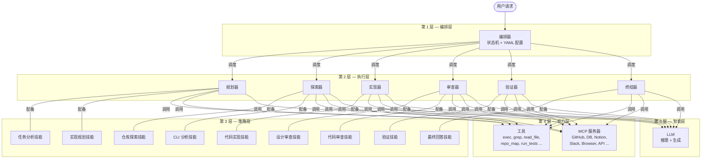
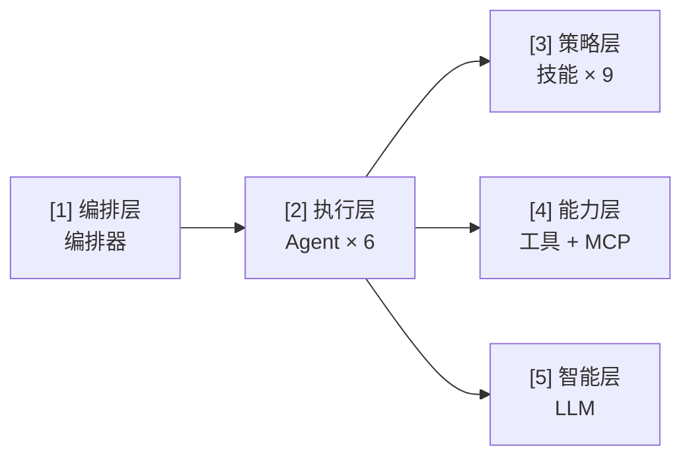
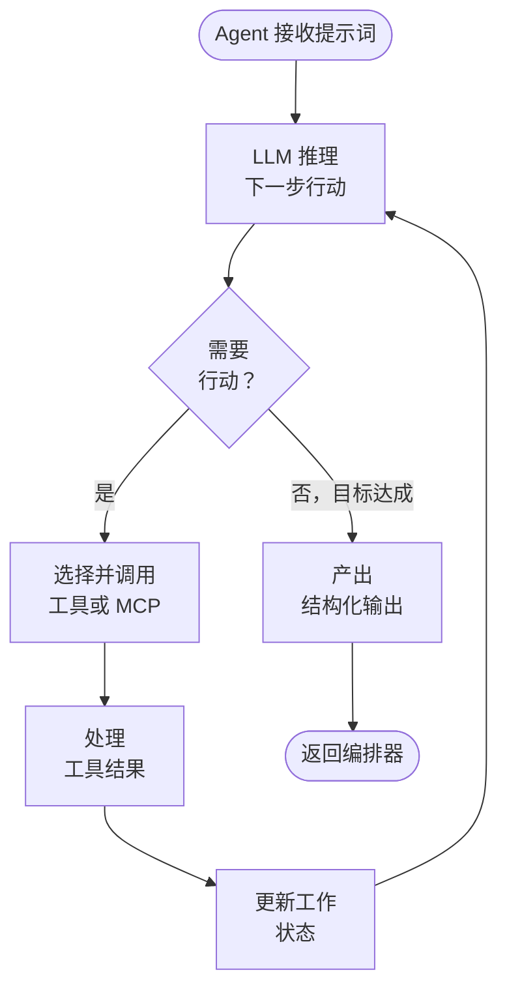
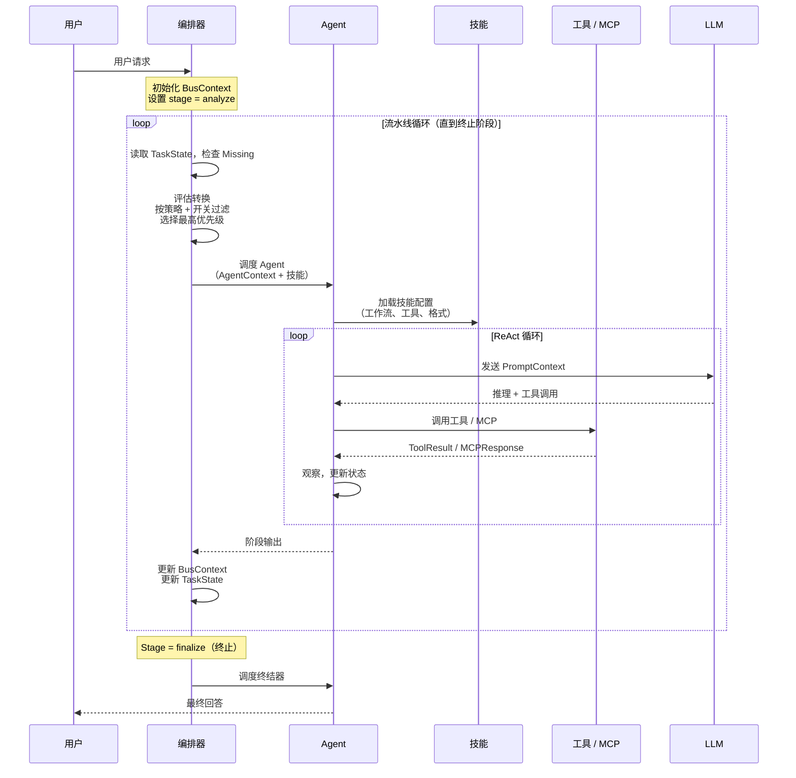
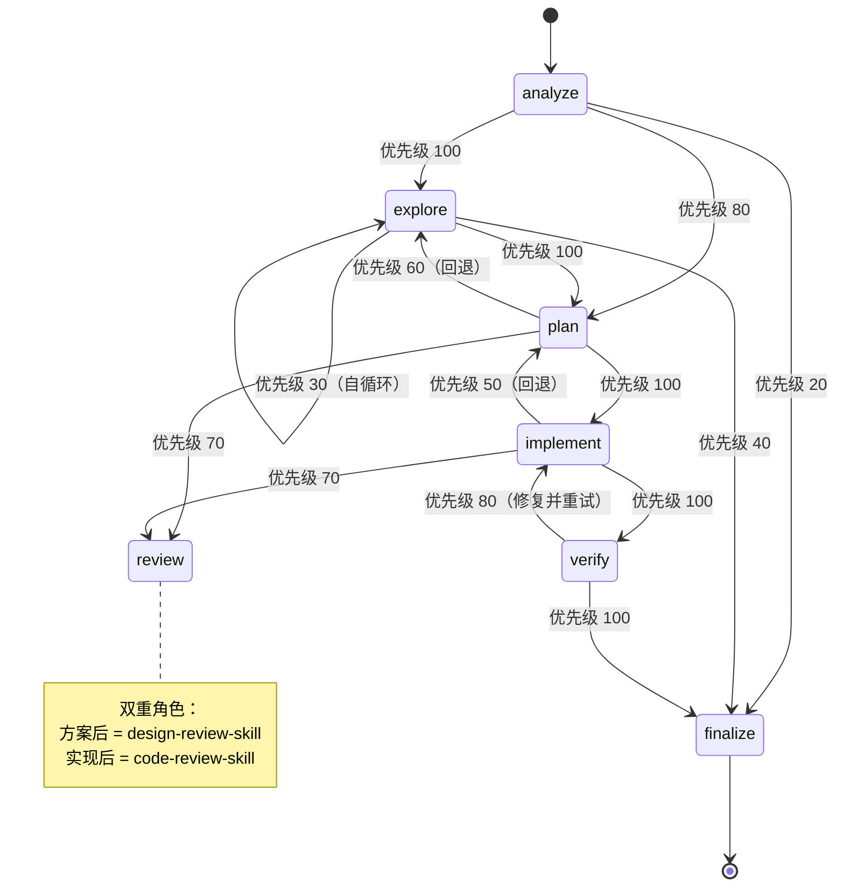
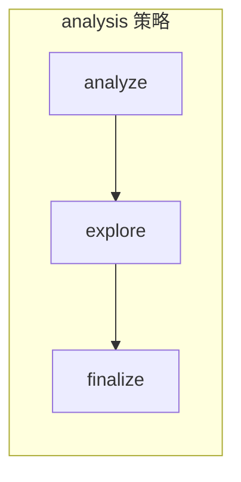
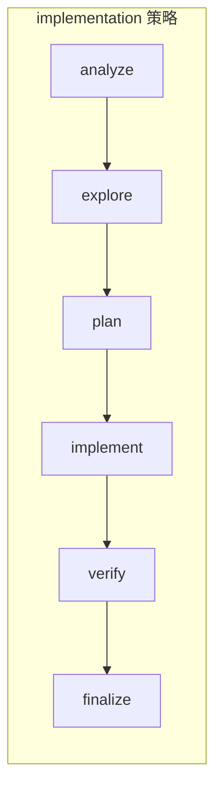
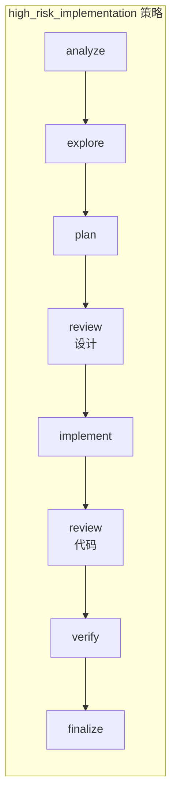

# 架构设计文档

## 目录

- [1. 概述](#1-概述)
- [2. 层级架构](#2-层级架构)
- [3. 组件详情](#3-组件详情)
  - [3.1 编排器（第 1 层）](#31-编排器第-1-层--编排层)
  - [3.2 Agent（第 2 层）](#32-agent第-2-层--执行层)
  - [3.3 技能（第 3 层）](#33-技能第-3-层--策略层)
  - [3.4 工具（第 4a 层）](#34-工具第-4a-层--能力层)
  - [3.5 MCP（第 4b 层）](#35-mcp第-4b-层--能力层)
  - [3.6 LLM（第 5 层）](#36-llm第-5-层--智能层)
- [4. 阶段规范](#4-阶段规范)
- [5. 数据结构](#5-数据结构)
- [6. 请求生命周期](#6-请求生命周期)
- [7. 编排器状态机](#7-编排器状态机)
- [8. 关键设计模式](#8-关键设计模式)
- [9. 错误处理与容错](#9-错误处理与容错)
- [10. 可扩展性](#10-可扩展性)

---

## 1. 概述

### 系统目标与设计哲学

本系统是一个多层 AI Agent 架构，旨在将复杂的软件工程任务分解为结构化、可审查、可验证的阶段。系统不依赖单次 LLM 调用，而是将关注点分离到五个层级：

- **编排层** — *做什么*以及*谁来做*
- **执行层** — 通过专业 Agent *执行*工作
- **策略层** — *如何*完成工作（工作流、约束、输出格式）
- **能力层** — *有哪些工具*可用（本地和远程）
- **智能层** — 通过 LLM 进行*推理*和*生成*

**一句话总结：** 编排器决定"谁做什么"，Agent"执行"，技能定义"怎么做"，工具/MCP 提供"用什么"，LLM 是"大脑"。

### 系统概览图



---

## 2. 层级架构

### 5 层层级结构



### 层间通信规则

| 从 → 到 | 是否允许 | 机制 |
|----------|----------|------|
| 第 1 层 → 第 2 层 | 是 | 编排器通过 AgentContext 调度 Agent |
| 第 2 层 → 第 1 层 | 是 | Agent 返回结果；编排器读取更新后的 BusContext |
| 第 2 层 → 第 3 层 | 是 | Agent 加载技能配置来指导其行为 |
| 第 2 层 → 第 4 层 | 是 | Agent 在执行过程中调用工具和 MCP 服务器 |
| 第 2 层 → 第 5 层 | 是 | Agent 调用 LLM 进行推理和生成 |
| 第 3 层 → 第 4 层 | 否 | 技能只*建议*工具；Agent 负责调用 |
| 第 4 层 → 第 5 层 | 否 | 工具不直接调用 LLM |
| 第 1 层 → 第 3/4/5 层 | 否 | 编排器不绕过 Agent |

**关键规则：** 所有工具调用和 LLM 调用都通过**第 2 层（Agent）**进行。编排器（第 1 层）永远不直接调用工具、MCP 或 LLM。技能（第 3 层）是配置，不是执行者。

---

## 3. 组件详情

### 3.1 编排器（第 1 层 — 编排层）

#### 职责

- **Agent 选择** — 根据当前流水线阶段选择要调度的 Agent
- **流水线阶段控制** — 管理状态机中的阶段推进
- **技能选择** — 为 Agent 分配适当的技能（YAML 默认值，可在运行时覆盖）
- **子 Agent 派生** — 在并行有益时派生并发子 Agent
- **执行状态管理** — 维护 BusContext 和 TaskList 作为共享状态
- **终止决策** — 检测何时到达 `finalize` 阶段（唯一的终止阶段）

#### YAML 驱动的状态机

编排器完全通过 [`config/orchestrator.yaml`](../config/orchestrator.yaml) 配置。配置定义了：

- **7 个阶段**，带有默认 Agent 和技能绑定
- **优先级加权的转换规则**
- **3 种任务策略**，约束哪些阶段处于活动状态
- **功能开关**，用于运行时行为切换

#### 阶段定义

| 阶段 | 默认 Agent | 默认技能 | 是否终止 | 需要写权限 |
|------|-----------|----------|----------|-----------|
| `analyze` | 规划器 | task-analysis-skill | 否 | 否 |
| `explore` | 探索器 | repo-explore-skill | 否 | 否 |
| `plan` | 规划器 | implementation-plan-skill | 否 | 否 |
| `review` | 审查器 | design-review-skill / code-review-skill | 否 | 否 |
| `implement` | 实现器 | code-implement-skill | 否 | 是 |
| `verify` | 验证器 | verification-skill | 否 | 否 |
| `finalize` | 终结器 | final-answer-skill | **是** | 否 |

> **注意：** `review` 阶段有双重角色 — 在 `plan` 之后使用 `design-review-skill`（方案审查），在 `implement` 之后使用 `code-review-skill`（代码审查）。编排器根据前一个阶段选择技能。

#### 转换引擎

转换引擎遵循确定性评估流程：

1. **枚举**当前阶段的所有出口转换
2. **按任务策略过滤** — 移除策略不允许的阶段转换
3. **按功能开关过滤** — 移除已禁用阶段的转换（如 `enable_verify: false` 时的 `verify`）
4. **评估**运行时条件 — 检查 `TaskState.Missing`、`ExecutionSignals` 和阶段结果
5. **选择**最高优先级的有效转换

#### 任务策略系统

任务策略为不同任务类型定义阶段子集：

| 策略 | 允许的阶段 |
|------|-----------|
| `analysis` | analyze → explore → finalize |
| `implementation` | analyze → explore → plan → implement → verify → finalize |
| `high_risk_implementation` | analyze → explore → plan → **design_review** → implement → **code_review** → verify → finalize |

#### 功能开关

| 开关 | 默认值 | 效果 |
|------|--------|------|
| `enable_verify` | `true` | 全局启用/禁用验证阶段 |
| `require_review` | `true` | 为 true 时使用包含审查阶段的 high_risk_implementation 策略 |
| `allow_skip_plan_for_small_change` | `false` | 允许小改动从 explore 直接跳到 implement |

#### 终止检测

流水线**仅**在到达 `finalize` 阶段（`terminal: true`）时终止。所有其他阶段都会循环回编排器进行重新评估。

#### 决策函数（伪代码）

```
function decide_next_stage(bus_context):
    current = bus_context.TaskState.Stage
    missing = bus_context.TaskState.Missing
    policy  = get_active_policy(bus_context.TaskList)
    flags   = load_feature_flags()

    transitions = get_transitions(current)                  // 从 YAML 获取
    transitions = filter_by_policy(transitions, policy)     // 移除不允许的阶段
    transitions = filter_by_flags(transitions, flags)       // 移除已禁用的阶段
    transitions = filter_by_signals(transitions, bus_context.Signals)  // 运行时条件
    transitions = sort_by_priority(transitions, descending)

    if transitions is empty:
        return "finalize"   // 兜底：无有效转换 → 结束

    return transitions[0].to
```

---

### 3.2 Agent（第 2 层 — 执行层）

#### 职责

- 接收提示词（由 AgentContext + PromptContext 组装）
- 调用 LLM 进行推理和生成
- 使用工具和 MCP 服务器与环境交互
- 维护 ReAct 循环（推理 → 行动 → 观察）直到阶段目标达成
- 产出结构化输出，更新 BusContext

#### 生命周期

```
init → receive_prompt → execute_loop → complete
```

1. **init** — Agent 使用其 AgentContext 实例化
2. **receive_prompt** — 从 AgentContext + 技能配置组装 PromptContext
3. **execute_loop** — ReAct 循环：LLM 推理 → 选择工具 → 执行 → 观察结果 → 重复
4. **complete** — Agent 产出最终输出，编排器更新 BusContext

#### Agent 类型

| Agent | 阶段 | 能力 | 描述 |
|-------|------|------|------|
| `planner`（规划器） | analyze, plan | 只读 | 结构化任务和设计实现方案 |
| `explorer`（探索器） | explore | 只读 | 浏览代码库，收集事实，构建模块映射 |
| `implementer`（实现器） | implement | **读 + 写** | 编写代码，修改文件，生成补丁 |
| `reviewer`（审查器） | review | 只读 | 审查方案（设计）和代码（正确性） |
| `verifier`（验证器） | verify | 只读 | 运行测试、lint、构建检查 |
| `finalizer`（终结器） | finalize | 只读 | 汇总结果，产出最终输出 |

#### Agent 执行循环（ReAct）



#### 子 Agent 并发

编排器可以在任务相互独立时并行派生多个子 Agent。每个子 Agent 在自己的 AgentContext 切片上操作。结果在完成时合并回 BusContext。父 Agent（或编排器）等待所有子 Agent 完成后再继续。

---

### 3.3 技能（第 3 层 — 策略层）

#### 职责

- 定义特定类型工作的**工作流步骤**
- 建议**使用哪些工具**（但不调用它们）
- 指定**输出格式**和模式
- 明确声明**阶段目标**
- 声明**禁止事项**（Agent 不得做的事情）

#### 技能清单

| 技能 | 阶段 | 用途 |
|------|------|------|
| `task-analysis-skill` | analyze | 结构化和分类用户任务 |
| `repo-explore-skill` | explore | 浏览代码库，收集事实，构建模块映射 |
| `cli-analysis-skill` | explore | 替代方案：基于 CLI 的分析 |
| `implementation-plan-skill` | plan | 设计分步实现方案 |
| `code-implement-skill` | implement | 编写/修改代码，生成补丁 |
| `design-review-skill` | review（方案后） | 审查方案可行性、架构影响、风险 |
| `code-review-skill` | review（实现后） | 审查代码正确性、缺陷、风格、副作用 |
| `verification-skill` | verify | 运行测试、lint、构建、验证正确性 |
| `final-answer-skill` | finalize | 产出面向用户的最终输出 |

#### 技能定义模式

```go
type SkillConfig struct {
    Name            string   // 唯一标识符，如 "repo-explore-skill"
    Goal            string   // 此技能的目标
    Workflow        []string // Agent 应遵循的有序步骤
    ToolSuggestions []string // 推荐的工具（Agent 决定是否使用）
    OutputFormat    string   // 期望的输出结构（JSON Schema 或描述）
    Prohibitions    []string // Agent 在此技能下不得做的事情
}
```

#### 技能选择逻辑

1. **默认**：每个阶段在 YAML 配置中有一个 `default_skill`
2. **上下文覆盖**：`review` 阶段根据前一个阶段在 `design-review-skill` 和 `code-review-skill` 之间切换
3. **运行时覆盖**：编排器可以根据任务特定信号覆盖技能

---

### 3.4 工具（第 4a 层 — 能力层）

#### 职责

在宿主环境上执行本地、确定性的操作。

#### 工具接口

```go
type Tool interface {
    Name()        string
    Description() string
    Parameters()  json.RawMessage  // JSON Schema
    Execute(params json.RawMessage) (ToolResult, error)
}
```

#### 内置工具

| 工具 | 描述 |
|------|------|
| `exec_command` | 执行 shell 命令 |
| `grep` | 按模式搜索文件内容 |
| `read_file` | 读取文件内容 |
| `write_file` | 将内容写入文件 |
| `repo_map` | 生成仓库结构映射 |
| `run_tests` | 执行测试套件 |
| `list_files` | 列出目录中的文件 |
| `git_diff` | 显示 git diff 输出 |
| `git_log` | 显示 git 提交历史 |

#### ToolResult 格式

```go
type ToolResult struct {
    ToolName  string
    Summary   string    // 人类可读的摘要
    RawRef    string    // 原始输出的引用（如文件路径或键）
    Success   bool
    Timestamp time.Time
}
```

---

### 3.5 MCP（第 4b 层 — 能力层）

#### 什么是 MCP？

**MCP（模型上下文协议）** 是一种将外部系统连接到 LLM 的标准化协议。MCP 服务器暴露能力（工具、资源、提示词），Agent 可以在运行时发现和调用它们。

#### 职责

- 将外部服务桥接到 Agent 的工具集中
- 提供可用能力的运行时发现
- 处理认证、传输和序列化

#### MCP 服务器接口

```go
type MCPServer interface {
    Name()        string
    Transport()   TransportType   // stdio | sse | http
    ListTools()   []ToolSchema
    CallTool(name string, params json.RawMessage) (MCPResponse, error)
}
```

#### 典型 MCP 服务器

| 服务器 | 用途 | 示例操作 |
|--------|------|----------|
| GitHub | 仓库操作 | 创建 PR、读取 issue、审查评论 |
| Database | 数据访问 | 查询表、检查模式 |
| Notion | 文档管理 | 读写页面、搜索工作区 |
| Slack | 通信 | 发送消息、读取频道 |
| Browser | Web 交互 | 获取页面、截图、交互 |
| API | 通用 HTTP | 调用任意 REST/GraphQL 端点 |

#### 传输层

| 传输方式 | 使用场景 | 协议 |
|----------|----------|------|
| `stdio` | 本地进程 | stdin/stdout JSON-RPC |
| `sse` | 远程服务器（流式） | HTTP Server-Sent Events |
| `http` | 远程服务器（请求/响应） | HTTP POST JSON-RPC |

#### MCP 与本地工具对比

| 方面 | 工具（本地） | MCP（外部） |
|------|-------------|-------------|
| 执行 | 进程内或本地子进程 | 远程服务器 |
| 发现 | 构建时硬编码 | 通过 `ListTools()` 运行时发现 |
| 延迟 | 低 | 可变（取决于网络） |
| 状态 | 无状态 | 可能有状态（服务端） |
| 认证 | 无（本地） | Token/OAuth/API key |

#### MCPResponse 格式

```go
type MCPResponse struct {
    ServerName string
    Method     string
    Summary    string
    RawRef     string
    Success    bool
    Timestamp  time.Time
}
```

---

### 3.6 LLM（第 5 层 — 智能层）

#### 职责

- **推理** — 分析上下文，规划行动，评估权衡
- **决策** — 选择调用哪个工具，何时停止，产出什么
- **文本生成** — 生成代码、方案、审查意见、摘要和最终回答

#### LLM 适配器接口

```go
type LLMAdapter interface {
    // Chat 发送提示词并返回模型的响应。
    // messages: 对话历史（system + developer + user 消息）
    // tools: 可用于函数调用的工具模式
    Chat(messages []Message, tools []ToolSchema) (LLMResponse, error)

    // ModelID 返回当前模型标识符。
    ModelID() string

    // MaxContextTokens 返回模型的上下文窗口大小。
    MaxContextTokens() int
}

type Message struct {
    Role    string // "system" | "developer" | "user" | "assistant" | "tool"
    Content string
}

type LLMResponse struct {
    Content    string
    ToolCalls  []ToolCall
    StopReason string
    Usage      TokenUsage
}
```

#### 模型选择与降级

系统支持多个 LLM 后端，具有降级链：

1. **主模型** — 高能力模型，用于复杂推理（如 Claude Opus）
2. **快速模型** — 低延迟模型，用于简单任务（如 Claude Haiku）
3. **降级** — 如果主模型不可用，降级到下一级

模型选择由 Agent 类型和任务复杂度决定。编排器可以通过配置按阶段覆盖模型。

#### 上下文窗口管理

PromptContext 的组装具有 token 预算意识：

1. **系统段** — 始终包含（最高优先级）
2. **开发者段** — 技能指令、约束条件
3. **用户段** — 任务详情、事实、历史
4. **工具结果** — 压缩以适应预算

当上下文超过窗口时，较旧的工具结果和事实按优先级压缩或丢弃。

---

## 4. 阶段规范

### 4.1 analyze — 任务理解

> **核心：** 将"用户输入"转化为"可执行的任务定义"

| 方面 | 详情 |
|------|------|
| **Agent** | 规划器 |
| **技能** | task-analysis-skill |
| **输入** | 用户原始输入、当前 BusContext（可能为空）、对话历史（可选） |
| **工作** | 意图识别（分析/实现/修复/审查）、任务类型分类、生成目标、初步任务分解（产出 TaskList）、提取约束（只读？必须验证？高风险？） |
| **输出** | `{ task_type, objective, task_list, constraints, missing_piece }` |

### 4.2 explore — 事实收集

> **核心：** 构建"可信的事实基础"

| 方面 | 详情 |
|------|------|
| **Agent** | 探索器 |
| **技能** | repo-explore-skill 或 cli-analysis-skill |
| **输入** | 当前 TaskList / 活动任务、仓库路径 / 分支、已知事实（可能为空） |
| **工作** | 查找代码入口点（main / cmd / router）、搜索函数和配置、构建模块映射、分析调用链、查询文档 / MCP（GitHub / Docs / DB） |
| **输出** | `{ repo_facts, entrypoints, call_chains, relevant_files }` |

### 4.3 plan — 方案设计

> **核心：** 将"做什么"转化为"怎么做"

| 方面 | 详情 |
|------|------|
| **Agent** | 规划器 |
| **技能** | implementation-plan-skill |
| **输入** | 仓库事实、当前 TaskList、约束条件 |
| **工作** | 设计修改方案、确定需要更改的文件、定义补丁结构、评估影响范围、定义验证方法 |
| **输出** | `{ plan: { files_to_modify, steps, risks, validation } }` |

### 4.4 review（方案后） — 设计审查

> **核心：** 判定方案"是否可行且合理"

| 方面 | 详情 |
|------|------|
| **Agent** | 审查器 |
| **技能** | design-review-skill |
| **输入** | 方案、仓库事实、约束条件 |
| **工作** | 检查需求对齐、检查架构完整性、检查边界情况、检查安全/性能风险、检查遗漏步骤 |
| **输出** | `{ review_result: pass/fail, issues, must_fix, suggestions }` |

### 4.5 implement — 实现

> **核心：** 将方案转化为实际的代码/配置更改

| 方面 | 详情 |
|------|------|
| **Agent** | 实现器 |
| **技能** | code-implement-skill |
| **输入** | 方案、仓库事实、约束条件 |
| **工作** | 编写代码、修改配置、生成补丁/diff、调用工具（exec / file write / MCP） |
| **输出** | `{ patch, modified_files, implementation_notes }` |

### 4.6 review（实现后） — 代码审查

> **核心：** 判定代码"是否正确且无隐患"

| 方面 | 详情 |
|------|------|
| **Agent** | 审查器 |
| **技能** | code-review-skill |
| **输入** | 补丁、原始方案、仓库事实 |
| **工作** | 检查方案符合度、检查缺陷/边界情况、检查代码风格、检查副作用、检查兼容性 |
| **输出** | `{ review_result: pass/fail, code_issues, must_fix }` |

### 4.7 verify — 验证

> **核心：** 证明"这个东西确实能用"

| 方面 | 详情 |
|------|------|
| **Agent** | 验证器 |
| **技能** | verification-skill |
| **输入** | 补丁、验证计划（来自 plan 阶段） |
| **工作** | 编译（go build）、单元测试、lint、冒烟测试、运行时验证 |
| **输出** | `{ verification_result: pass/fail, logs, errors, next_action: fix/explore }` |

### 4.8 finalize — 输出收敛

> **核心：** 将所有结果汇编为"用户可用的最终输出"

| 方面 | 详情 |
|------|------|
| **Agent** | 终结器 |
| **技能** | final-answer-skill |
| **输入** | 所有阶段产物、TaskList、验证结果 |
| **工作** | 总结变更、生成最终描述、输出补丁/使用说明、更新 BusContext、标记任务完成 |
| **输出** | 最终回答（代码 + 描述 + 操作步骤） |

---

## 5. 数据结构

### 设计原则

> **BusContext 不是模型上下文本身。** 它是用于构建 Agent 专属模型上下文的运行时事实源。流程如下：
>
> `BusContext`（完整共享状态） → 裁剪 → `AgentContext`（Agent 范围视图） → 组装 → `PromptContext`（模型提示词载荷） → 发送至 LLM

### 枚举类型

定义在 Go `runtime` 包中：

```go
type PipelineStage string
const (
    StageAnalyze      PipelineStage = "analyze"
    StageExplore      PipelineStage = "explore"
    StagePlan         PipelineStage = "plan"
    StageDesignReview PipelineStage = "design_review"
    StageImplement    PipelineStage = "implement"
    StageCodeReview   PipelineStage = "code_review"
    StageVerify       PipelineStage = "verify"
    StageFinalize     PipelineStage = "finalize"
)

type AgentName string
const (
    AgentPlanner        AgentName = "planner"
    AgentExplorer       AgentName = "explorer"
    AgentDesignReviewer AgentName = "design_reviewer"
    AgentCodeReviewer   AgentName = "code_reviewer"
    AgentImplementer    AgentName = "implementer"
    AgentVerifier       AgentName = "verifier"
    AgentFinalizer      AgentName = "finalizer"
)

type TaskStatus string
const (
    TaskPending    TaskStatus = "pending"
    TaskInProgress TaskStatus = "in_progress"
    TaskDone       TaskStatus = "done"
    TaskBlocked    TaskStatus = "blocked"
    TaskFailed     TaskStatus = "failed"
)

type TaskType string
const (
    TaskTypeUnknown        TaskType = "unknown"
    TaskTypeAnalysis       TaskType = "analysis"
    TaskTypePlanning       TaskType = "planning"
    TaskTypeImplementation TaskType = "implementation"
    TaskTypeReview         TaskType = "review"
    TaskTypeVerification   TaskType = "verification"
)
```

### 三层上下文模型

```
BusContext（完整共享状态）
    ↓ 裁剪
AgentContext（Agent 范围视图）
    ↓ 组装
PromptContext（模型提示词载荷）
    ↓ 发送
LLM
```

#### 第 1 层：BusContext — 完整共享状态

```go
type BusContext struct {
    // 顶层任务进度
    TaskList  TaskList
    TaskState TaskState

    // 当前运行时状态
    PipelineStage PipelineStage
    ActiveAgent   AgentName

    // 仓库/环境信息
    RepoRoot  string
    Branch    string
    Commit    string
    ModuleMap []string

    // 共享事实
    RepoFacts    []RepoFact
    ToolResults  []ToolResult
    MCPResponses []MCPResponse

    // 信号与策略
    Signals ExecutionSignals
    Policy  PolicyContext

    // 通用约束
    Constraints []string
    Preferences []string

    // 故障/恢复信息
    LastTransitionReason string
    TraceID              string
}
```

#### 第 2 层：AgentContext — Agent 范围视图

```go
type AgentContext struct {
    AgentName AgentName
    Stage     PipelineStage

    // 任务视图
    Objective       string
    CurrentTaskID   string
    CurrentTask     string
    CurrentTaskType TaskType

    // 与此 Agent 相关的裁剪结果
    RelevantFacts         []string
    RelevantFiles         []string
    RelevantToolSummaries []string
    RelevantMCPNotes      []string

    // 前序阶段的摘要
    PlanSummary         string
    PatchSummary        string
    ReviewSummary       string
    VerificationSummary string

    // 控制信息
    Constraints []string
    Preferences []string

    // 当前缺口
    MissingPiece MissingPiece

    // 源信息
    RepoRoot string
    Branch   string
    Commit   string
}
```

#### 第 3 层：PromptContext — 模型提示词载荷

```go
type PromptSection struct {
    Title   string
    Content string
}

type PromptContext struct {
    SystemSections    []PromptSection
    DeveloperSections []PromptSection
    UserSections      []PromptSection

    // 模型可用的工具模式
    EnabledTools []string

    // 调试用元数据
    AgentName AgentName
    Stage     PipelineStage
    SkillName string
}
```

### 辅助数据结构

#### TaskItem / TaskList

```go
type TaskItem struct {
    ID          string
    Title       string
    Description string
    Type        TaskType
    Status      TaskStatus
    DependsOn   []string
    Result      string
}

type TaskList struct {
    Objective     string
    Tasks         []TaskItem
    CurrentTaskID string
}
```

`TaskList.CurrentTask()` 返回当前正在执行的 `TaskItem`。

#### MissingPiece / TaskState

编排器的核心决策输入 — "我们在哪 + 缺什么"。

```go
type MissingPiece string
const (
    MissingNone          MissingPiece = "none"
    MissingUnderstanding MissingPiece = "understanding"
    MissingFacts         MissingPiece = "facts"
    MissingPlan          MissingPiece = "plan"
    MissingCode          MissingPiece = "code"
    MissingReview        MissingPiece = "review"
    MissingVerification  MissingPiece = "verification"
)

type TaskState struct {
    Stage        PipelineStage
    Missing      MissingPiece
    Completed    []string
    Remaining    []string
    LastDecision string
    LastError    string
    IsTerminal   bool
}
```

`Missing` 字段驱动编排器的转换决策：根据缺失的内容选择下一个阶段。

#### RepoFact

```go
type RepoFact struct {
    Key        string
    Value      string
    Source     string
    Confidence float64
}
```

#### ToolResult / MCPResponse

```go
type ToolResult struct {
    ToolName  string
    Summary   string
    RawRef    string
    Success   bool
    Timestamp time.Time
}

type MCPResponse struct {
    ServerName string
    Method     string
    Summary    string
    RawRef     string
    Success    bool
    Timestamp  time.Time
}
```

#### ExecutionSignals

BusContext 中的布尔标志，驱动编排器决策。

```go
type ExecutionSignals struct {
    HasEnoughFacts     bool
    HasPlan            bool
    HasPatch           bool
    ReviewPassed       bool
    VerificationPassed bool
    LastStageFailed    bool
    LastFailureReason  string
    RetryCount         int
}
```

#### PolicyContext

```go
type PolicyContext struct {
    AllowWrite          bool
    RequireReview       bool
    RequireVerification bool
    MaxRetriesPerStage  int
}
```

#### StageConfig

启动时从 YAML 加载。

```go
type StageConfig struct {
    Name          PipelineStage
    DefaultAgent  AgentName
    DefaultSkill  string
    Terminal      bool
    RequiresWrite bool
}
```

#### Transition / TaskPolicy

```go
// Transition 是阶段间带优先级的有向边。
// 按任务策略过滤，并根据运行时条件评估。
type Transition struct {
    From     PipelineStage
    To       PipelineStage
    Priority int
}

// TaskPolicy 定义给定任务类型允许的阶段。
type TaskPolicy struct {
    Name          string
    AllowedStages []PipelineStage
    Constraints   []string
}
```

---

## 6. 请求生命周期

### 端到端序列图



### 逐步状态机演练

1. **用户请求到达** → 编排器创建初始 BusContext
2. **`analyze`** — 规划器 Agent + task-analysis-skill：解析意图，分类任务类型，生成 TaskList，识别约束和缺失部分
3. **编排器重新评估** — 读取 `TaskState.Missing`：
   - `MissingFacts` → 路由到 `explore`（优先级 100）
   - `MissingPlan` → 路由到 `plan`（优先级 80）
   - `MissingNone` → 路由到 `finalize`（优先级 20）
4. **`explore`** — 探索器 Agent + repo-explore-skill：浏览代码，构建事实库
5. **编排器重新评估** — 事实已收集：
   - 路由到 `plan`（优先级 100）
   - 或自循环 `explore`（如需更多事实，优先级 30）
6. **`plan`** — 规划器 Agent + implementation-plan-skill：设计实现方案
7. **编排器重新评估** — 方案已存在：
   - 路由到 `implement`（优先级 100）
   - 或路由到 `review`（高风险时，优先级 70）
   - 或回退到 `explore`（事实不足时，优先级 60）
8. **`review`（设计）** — 审查器 Agent + design-review-skill：审查方案可行性 *（仅限 high_risk_implementation 策略）*
9. **`implement`** — 实现器 Agent + code-implement-skill：编写代码，生成补丁
10. **编排器重新评估** — 补丁已存在：
    - 路由到 `verify`（优先级 100）
    - 或路由到 `review` 进行代码审查（优先级 70）
11. **`review`（代码）** — 审查器 Agent + code-review-skill：审查代码正确性 *（仅限 high_risk_implementation 策略）*
12. **`verify`** — 验证器 Agent + verification-skill：运行测试、lint、构建
13. **编排器重新评估** — 验证结果：
    - 通过 → 路由到 `finalize`（优先级 100）
    - 失败 → 回退到 `implement`（优先级 80）
14. **`finalize`** — 终结器 Agent + final-answer-skill：汇编最终输出 → 返回给用户

---

## 7. 编排器状态机

### 完整状态机图



### 任务策略叠加







### YAML 配置参考

完整的编排器配置维护在 [`config/orchestrator.yaml`](../config/orchestrator.yaml) 中。该文件是阶段定义、转换规则、任务策略和功能开关的权威来源。

---

## 8. 关键设计模式

### 状态机模式（编排器）

编排器实现了一个**有限状态机**，其中：
- **状态** = 流水线阶段（analyze, explore, plan, review, implement, verify, finalize）
- **转换** = 阶段间优先级加权的有向边
- **守卫** = 任务策略、功能开关和运行时条件过滤转换
- **动作** = 调度适当的 Agent 及正确的技能

此模式确保确定性、可审计的流水线推进，同时支持回退和条件路径。

### ReAct 循环（Agent）

每个 Agent 遵循 **ReAct（推理 + 行动）** 模式：
1. **推理** — LLM 分析当前状态并决定下一步行动
2. **行动** — Agent 调用选定的工具或 MCP
3. **观察** — Agent 处理结果并更新其工作状态
4. 重复直到阶段目标达成

此模式允许 Agent 处理动态、多步骤的任务，无需硬编码逻辑。

### 策略模式（技能）

技能实现了**策略模式** — 同一个 Agent 可以通过更换技能配置表现出不同的行为。例如，`reviewer` Agent 根据上下文使用 `design-review-skill` 或 `code-review-skill`，无需任何代码更改。

### 适配器模式（工具 / MCP）

工具和 MCP 服务器都实现了统一接口（`Execute` / `CallTool`），允许 Agent 互换调用它们。适配器模式将本地执行和远程 MCP 调用的差异隐藏在通用抽象之后。

### 带回退的流水线

与线性流水线不同，本系统支持**非线性流程**：
- **正向推进** — 阶段间的默认路径
- **回退** — 当新信息使先前工作失效时返回较早的阶段（如 `implement → plan`，方案需要修订时）
- **自循环** — 需要更多工作时重复某个阶段（如 `explore → explore`）
- **跳过路径** — 不需要时跳过某些阶段（如 `analyze → finalize`，用于简单问题）

---

## 9. 错误处理与容错

### 层间错误传播

| 错误来源 | 处理方式 |
|----------|----------|
| 工具失败 | ToolResult.Success = false；Agent 观察后重试或使用替代工具 |
| MCP 失败 | MCPResponse.Success = false；如有可用的本地工具则降级 |
| LLM 失败 | LLMAdapter 以指数退避重试；降级到备用模型 |
| Agent 失败 | 编排器接收错误；设置 `LastStageFailed = true`，评估回退转换 |
| 阶段失败 | 编排器递增 `RetryCount`；重新进入阶段或回退 |

### Agent 重试与降级

- Agent 在每个阶段有可配置的重试预算（`PolicyContext.MaxRetriesPerStage`）
- 失败时，Agent 可以：
  1. 使用修改后的参数重试相同工具
  2. 尝试替代工具
  3. 向编排器报告失败（编排器可能会回退）

### 工具 / MCP 超时处理

- 每次工具调用有可配置的超时时间
- 超时时：ToolResult 标记为失败，附带超时原因
- Agent 观察超时后决定是重试还是不使用该结果继续执行

### 优雅降级

- 如果 MCP 服务器不可用，Agent 降级到本地工具
- 如果主 LLM 不可用，系统降级到备用模型
- 如果非关键阶段反复失败，编排器可能跳过它（如在最大重试次数后跳过 `verify`，带警告进入 `finalize`）

### 阶段级重试（编排器）

编排器可以通过回退转换重新进入失败的阶段：
- `implement → plan` — 如果实现过程揭示了方案缺陷
- `verify → implement` — 如果验证失败，代码需要修复
- `explore → explore` — 自循环以收集更多事实

`ExecutionSignals` 中的 `RetryCount` 防止无限循环。

---

## 10. 可扩展性

### 添加新工具

1. 实现 `Tool` 接口：
   ```go
   type MyTool struct{}
   func (t *MyTool) Name() string        { return "my_tool" }
   func (t *MyTool) Description() string  { return "做一些有用的事情" }
   func (t *MyTool) Parameters() json.RawMessage { return schema }
   func (t *MyTool) Execute(params json.RawMessage) (ToolResult, error) { ... }
   ```
2. 在工具注册表中注册
3. 在相关技能的 `ToolSuggestions` 中引用

### 添加新 MCP 服务器

1. 实现 `MCPServer` 接口或使用现有的 MCP 兼容服务器
2. 配置传输方式（stdio / SSE / HTTP）和连接详情
3. 系统通过 `ListTools()` 在运行时发现可用工具

### 创建新技能

1. 定义 `SkillConfig`，包含目标、工作流步骤、工具建议、输出格式和禁止事项
2. 在技能注册表中注册
3. 在 `orchestrator.yaml` 中绑定到某个阶段（作为默认或覆盖）

### 自定义 Agent 类型

1. 定义新 Agent 的阶段绑定和能力（只读 vs. 读写）
2. 在 Agent 注册表中注册
3. 添加到 `orchestrator.yaml` 的 `agents` 部分
4. 作为 `default_agent` 绑定到某个阶段

### 添加新流水线阶段

1. 在 `PipelineStage` 中添加阶段常量
2. 在 `orchestrator.yaml` 中定义阶段，包含默认 Agent、技能和终止标志
3. 添加到/从新阶段的转换规则（带优先级）
4. 更新任务策略以在适当位置包含新阶段
5. 为新阶段创建或分配技能
