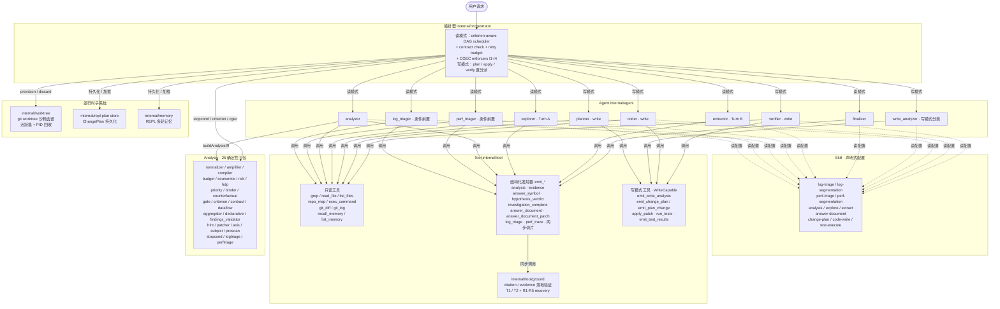
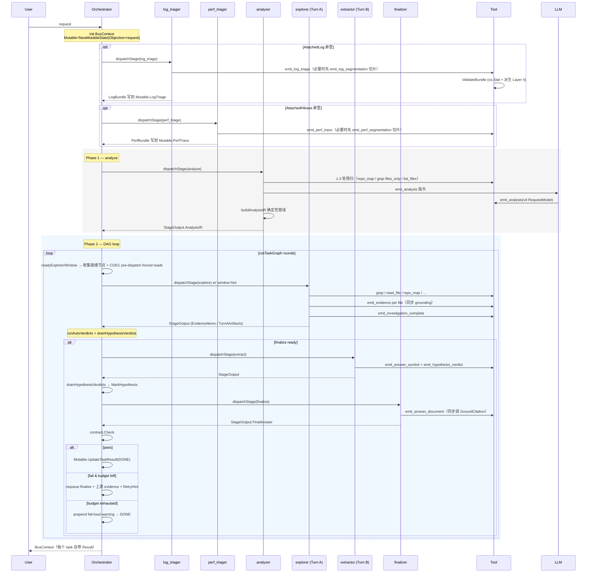
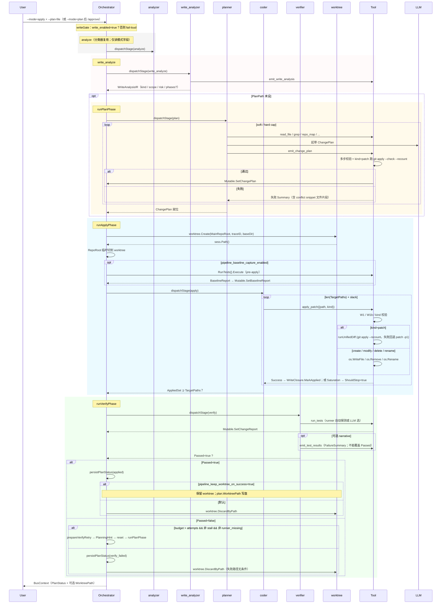

# 架构设计文档

codrax 是一个**代码分析 + 变更提议**工具：

- **读模式**（默认）：用户用自然语言提问，系统经过一条确定性的主流水线 `analyze → explore → extract → finalize`（4 个阶段，每个阶段一个专用 Agent），产出带 citation 的结构化答案；当用户附加运行时日志时再前置 `log_triage`，附加性能 trace（HiTrace / atrace / systrace / perfetto）时再前置 `perf_triage`。**不触碰源文件**。
- **写模式**（opt-in，需要 `codrax.yaml :: write_enabled: true`）：复用读模式的 analyzer 做请求分类，分流到 `plan → apply → verify` 阶段链（3 个专用 agent：`planner` / `coder` / `verifier`）；所有写动作发生在沙箱 git worktree 里，主仓库 HEAD 字节永不自动变更。

流水线拓扑硬编码在 `internal/orchestrator/topology.go`，运行时不可覆盖。

## 目录

- [1. 概述与设计哲学](#1-概述与设计哲学)
- [2. 整体流水线](#2-整体流水线)
- [3. 核心组件分层](#3-核心组件分层)
- [4. 用户意图识别](#4-用户意图识别)
- [5. 证据采集与投影](#5-证据采集与投影)
- [6. AnswerDocument 结构化答案](#6-answerdocument-结构化答案)
- [7. 阶段细则](#7-阶段细则)
- [8. 写模式 plan / apply / verify](#8-写模式-plan--apply--verify)
- [9. 数据结构](#9-数据结构)
- [10. 请求生命周期](#10-请求生命周期)
- [11. 关键设计模式](#11-关键设计模式)
- [12. 为什么不走 RAG](#12-为什么不走-rag)
- [13. 运行时子系统](#13-运行时子系统)
- [14. 配置](#14-配置)
- [15. 可扩展性](#15-可扩展性)

---

## 1. 概述与设计哲学

### 1.1 系统目标

codrax 的目标是让一个 LLM 在不出错的前提下回答一个真实代码仓库里的问题，或者按用户描述安全地修改代码。"不出错" 在这里是核心约束：模型说的每一条 file:line 都必须是真实存在的、模型读过的代码，模型给的每一份 plan 都必须能干净地 apply、能跑过测试。

### 1.2 一个核心理念：LLM 只在边界出现，中间数据全是 typed struct

> *打个比方：把 LLM 当作一个会画画的实习生，但只让它在两张工位之间画——一张是"老板交代任务的记事卡"，一张是"实习生回答问题的答题卡"。两张卡之间，所有信息都用打孔的塑料卡片在传送带上传递；不让实习生在塑料卡片上自己写字，因为它一写下游就要靠"猜字"做决定。*

整条流水线只有两个地方让 LLM 自由生成文字：

1. 模型在 prompt 里看到的文字（typed struct → markdown）
2. 模型回写的 tool call 参数（schema 解码 → typed struct）

这两点之外，从一阶段交给下一阶段的所有信息都走 Go struct 通道。**没有"上一个 agent 在最后一行写了 'COMPLETE'，下一个 agent 用 strings.Contains 解析"** 这种隐式协议。新增一份跨阶段数据 = 加一个 typed 字段，加 schema 描述。

这个理念让系统具备两个非常重要的性质：

- **可审计**：调试一个问题时，沿着字段所有 producer / consumer 一路 grep 到底就能看完整路径。
- **可重构**：要换 LLM provider、换 prompt 风格、换 tool 实现，typed 边界是稳定的；任何 prose-heavy 的胶水都集中在 boundary 一处。

### 1.3 Fail-loud 而不是静默兜底

> *像装修验收：水电没过、墙没干就直接停工通知客户，绝不"反正差不多看不见就先贴瓷砖了"。第一次出错就让人看见，比起后面发现一面墙是空的代价低得多。*

如果 LLM 没按约定调 `emit_analysis`，analyzer 就让阶段返回 error，编排器负责按 `pipeline_max_retries_per_stage` 重试，重试耗尽则终止 Run；不会"静默生成一个零值 IR 让下游凑合跑"。整个系统的所有结构化发射器（`emit_*` 系列）都遵守同一个原则：调用失败，就让本阶段失败。

### 1.4 读取与写入严格分离

读模式工具全部嵌入 `tool.ReadOnly`，写模式工具嵌入 `tool.WriteCapable`。`IsWrite()` 是单一真源，决定一个 tool 在哪种 Mode 下才会出现在 LLM 的 schema 里。读模式 agent 物理上看不到 `apply_patch` / `emit_change_plan`，写模式 agent 物理上看不到读模式专属的 emit 工具。`internal/context/builder.go` 在写阶段（`PipelineStage.IsWrite() == true`）跳过所有读模式 stage artifact 的传播——planner / coder / verifier 永不会看到 explorer 留下的 EvidenceItems 或 analyzer 的 StageReport prose。

### 1.5 精确信号才能用作硬约束

> *像安检：金属探测器（typed enum、精确比较）才能用来"开门 / 不开门"决策；瞳孔识别打分（heuristic）只能用来"给前面安检员一个提醒"。把"瞳孔不像本人 = 不开门"作为硬规则，会让 100 个普通乘客有 1 个被卡。*

系统里有大量"信号"——LLM 自评的 predicate、grep 命中数、相似度打分、子话题数量等。架构里有一条明确的红线：**精确信号（typed enum、数值比较、子串完全匹配、schema 校验过的字段）才能驱动硬性 gate**；嘈声信号（ranker 打分、heuristic 分类）只能驱动软提示（skill prompt 提醒、advisory log）。把硬 gate 架在嘈声信号上，必然导致结构正常的请求偶发被拒。

### 1.6 模型 confidence 是 first-class 信号 — 系统侧硬 gate 必须给 typed escape

> *客户的 trace：模型 `<think>` 明确写"the log is external and cannot be grounded"——系统仍硬卡 forced-read，模型被迫读 codrax 自家文件，最终从无关 type 名 confabulate 出错误故事。**模型已经表态、系统理应尊重；硬卡只会换来 hallucination**。*

每一个**系统侧硬 gate**（forced-read / citation-floor / coverage 等）都必须有一条**模型可声明的 typed escape lane**——通过 emit-工具的 typed 字段表态，不靠 `<think>` 自由文本。系统按精确 typed 比较决定是否尊重模型的判断，并对每次 fire 做 audit telemetry 记录，便于事后审计是否被滥用。

**当前已实现的 typed escape**:

| Gate | Escape lane | 典型 reason | 实现 |
|---|---|---|---|
| `emit_investigation_complete` forced-read pending list | `evidence_floor_waiver`（model-declared）或 runtime external disposition（system-derived） | `external_only_log` / `external_only_trace` / `no_repo_intersection` / `informational_runtime_only` | `internal/types/evidence_floor_waiver.go` + `internal/tool/emit_investigation_complete.go` |
| `emit_investigation_complete` citation-floor pre-flight | `evidence_floor_waiver`（model-declared）**或** `LogBundle.IsExternalSource()` / `PerfBundle.IsExternalSource()`（system-derived） | 同上 | 同上 |
| call-chain source→sink span gap | `principal_span_waiver`（model-declared） | `endpoints_directly_adjacent` / `no_intermediate_user_code` / `platform_bridge_intermediates` / `inlined_call` / `runtime_dispatched_call` / `external_module_continuation` | `internal/types/principal_span_waiver.go` + `internal/tool/emit_investigation_complete.go` |
| finalizer runtime citation policy | `RuntimeGroundingDisposition`（stable answer-surface projection） | 同上 | `internal/types/answer_surface_plan.go` + `internal/agent/answer_document_evaluator.go` |
| `emit_investigation_complete` absence-floor | `absence_justification`（model-declared） | 答案就是 zero / not-found | 已有 |
| log / trace frame 自指陷阱 | 不是 gate，是 **typed signal**：`FrameDriftStatus` 渲染到 prompt section（"Frame ↔ current-code drift warning"） | LineDrift / TailRename / FileMoved / Unmappable | `internal/context/builder.go::renderLogTriageFrameDrift` / `renderPerfTriageFrameDrift` |

**红线对未来 gate 的约束**:
- 新增 gate 时，**必须**同步设计 typed escape lane。**不允许**架"系统永远正确"的硬 gate
- escape 通过 typed 字段表达，**不允许**靠 prompt 文本 / `<think>` 启发式触发（违反 R3）
- 每个 escape 必须 audit log，字段为 `reason` enum + `rationale` 一句话
- 系统检测到精确的 typed 反向信号（比如 `LogBundle.IsExternalSource()`）时也可自动 bypass — 但 **model-declared 优先**：模型表态后系统不应再二次审查"我同意不同意"
- model-declared escape 只有在 `emit_investigation_complete` 全部 gate 通过后才 promote 到 stable answer surface；finalizer 只读 stable projection，避免"语法接受但 completion 失败"的 waiver 泄漏到最终答案
- 模型可以通过 `clear_evidence_floor_waiver=true` 显式撤销前一次 waiver；撤销必须是 typed 字段，不能靠 rationale 自由文本推断

**未引入 escape 的 gate（已审计、justified）**:
- 工具参数 schema 校验（`confidence ∈ {high, medium}` / `result_kind ∈ {resolved, absence}`）— 这是 wire-format 边界，LLM 没有可表态空间，nothing to escape
- L0/L0-B/L0-C analyzer pre-emit shape gate（`is_category_enumeration=true` + 单 entity 互斥）— 这些是**模型自己声明的两个字段互相矛盾**的检测，模型自相矛盾不该用 escape 跳过
- write-mode L1 byte-identity（`runReadSchedulerLoop` byte-preserved）— 写模式 0 字节副作用红线，无 escape 余地

**总结架构原则**:
1. 系统的 override 权只能基于精确 typed 信号（R3 红线，1.5 节）
2. 系统的 override 权**必须**给模型 typed escape 渠道（R6 红线，本节）
3. 二者合起来：**精确 vs 精确** — 系统说"这条规则成立" + 模型说"我的情况是例外"。两边都用 typed 信号，heuristic 永远只做软引导

---

## 2. 整体流水线

### 2.1 阶段一览

读模式 4 个核心阶段加 2 条条件前置，写模式 3 个核心阶段：

| 阶段 | 默认 Agent | 默认 Skill | 触发条件 | Terminal |
|------|-----------|-----------|---------|:-:|
| `log_triage` | `log_triager` | `log-triage-skill` | `BusContext.AttachedLog` 非空 | |
| `perf_triage` | `perf_triager` | `perf-triage-skill` | `BusContext.AttachedHitrace` 非空 | |
| `analyze` | `analyzer` | `analysis-skill` | 无条件 | |
| `explore` | `explorer` | `explore-skill` | 读模式无条件 | |
| `extract` | `extractor` | `extract-skill` | 读模式无条件 | |
| `finalize` | `finalizer` | `answer-document-skill` | 读模式无条件 | ✅ |
| `plan` | `planner` | `change-plan-skill` | 写模式 | |
| `apply` | `coder` | `code-write-skill` | 写模式 | |
| `verify` | `verifier` | `test-execute-skill` | 写模式 | ✅ |

`log_triage` 和 `perf_triage` 互相独立——同一个 Run 可以同时挂 panic 日志和性能 trace，两个前置阶段并行写 `Mutable.LogTriage()` / `Mutable.PerfTrace()`，下游 analyzer 同时消费。任一前置阶段失败都不会阻塞主流水线，bundle 留为 nil，每个下游消费者都会 nil-check 优雅降级。

### 2.2 读模式：DAG-aware 调度

> *像一个总指挥拿着工程图纸（TaskGraph）调度工地：每天早上看哪些工序的前置条件都满足了（"水电过验收了"），就把今天能干的活合并成一份派工单交给现场（explorer）。完工后逐项检查（SuccessCriteria），不合格的让相关人员返工（requeue 上游 evidence 节点），但不重启整个工地。原地打转的工序专门有兜底机制（shape-guard）。*

analyzer 一次性产出整张 `TaskGraph`（DAG），编排器（`internal/orchestrator/scheduler.go::runTaskGraph`）按 DAG 边沿迭代调度。每一轮：

1. **就绪窗口收集**：扫描所有 pending / requeued 节点，对每个节点的 `EntryConditions`（`[]Criterion`）调用 `criterion.Eval` 判断是否满足；满足的非 finalize 节点合并成**一次** explorer dispatch。
2. **窗口分派**：explorer 在一次 ReAct 循环里同时为窗口内所有节点收集证据，结束后系统把节点状态推进。
3. **Shape-guard 短路**：编排器记录每次 pure-read 检查的 `envShape`（八维 int 指纹：Evidence / AnswerSymbols / AnswerChains / ToolResults / ReadSet / PendingReads / DecidedHypotheses / PrescanBytes 计数）。新一轮检查时若 shape 未变，直接跳过——避免"同一组输入反复触发同一个 predicate" 的死循环。
4. **success criterion 评估**：分派完成后，每个窗口节点的 `SuccessCriteria` 用 `criterion.Eval` 判定。通过 → done；不通过 → requeued，沿 `EdgeValidationFeedback` 边只 requeue 必要的上游 evidence 节点（精细回溯，不重启整个窗口）。
5. **Stuck 逃生**：validate 节点的 SC 失败时，系统记录 envShape；如果下次失败时 shape 与上次相同（重新调查没带来新证据），系统判定"此路不通"，给所有还是 HypUnknown 的假设注入诚实的 `HypInconclusive` verdict + stuck rationale，标 done 不再 requeue。
6. **finalize 派发**：所有非 finalize 节点都 done 时分派 finalizer。
7. **contract check**：finalizer 写出 AnswerDocument 后，系统跑一遍合同检查（typed validators），通过则结束；不通过且预算未耗尽则把违规诊断写进 retry hint，requeue finalize + 所有 done 的 explorer 节点跑一轮 cross-window retry；预算耗尽则在原答案前面 prepend 一条 fail-loud 警告后返回（让用户看见模型最后想说什么）。

### 2.3 写模式：线性 3 节点图

写模式不走 DAG scheduler。`Run()` 入口先验证 `write_enabled`，跑一次 analyzer 作请求分类器（产出标准 `AnalysisIR`，但下游 plan/apply/verify 消费的是另一份）。然后跑 `write_analyzer`（独立 agent + tool `emit_write_analysis`）产出 `WriteAnalysisIR`——任务的 kind / scope / risk / 期望结果，可选的多阶段拆分提议。`BuildWriteTaskGraph` 把这份 IR 翻译成线性 3 节点 plan→apply→verify graph，由 `runWriteSchedulerLoop` 顺序走完。

写模式的三个阶段各自有典型 success criterion：

| 节点 | 通过条件（criterion.Kind） | 输入 |
|---|---|---|
| plan | `CritPlanReady` — `Mutable.ChangePlan` 非空、`WriteClosure.PendingApplies > 0` | Mutable.ChangePlan |
| apply | `CritPatchApplies` — `WriteClosure.AppliedSet ⊇ ChangePlan.TargetPaths` | Mutable.WriteClosure |
| verify | `CritTestsPass` AND `CritNoRegression` | Mutable.ChangeReport ± BaselineReport |

读模式 Run 里这 4 个 typed env slot 全是 nil，对应的 evaluator 直接返回 Satisfied=true（保持读模式字节级行为不变的红线）。

### 2.4 系统概览图



---

## 3. 核心组件分层

| 组件 | 包路径 | 职责 |
|------|--------|------|
| **Orchestrator** | `internal/orchestrator` | DAG 调度、阶段分派、retry / contract check、CGEC enforcer、写模式三阶段直分派 |
| **Agent** | `internal/agent` | 9 个专业 Agent；每个嵌入 `BaseAgent` 跑 ReAct 循环 |
| **Skill** | `internal/skill` | 声明式配置：每个 skill 写明 workflow / 工具 allowlist / 输出格式 / 禁令 |
| **Tool** | `internal/tool` | 只读工具 + 结构化发射器 + 写模式工具 + grounding 验证 |
| **Analysis** | `internal/analysis/*` | 25 个确定性子包，组装 IR + 运行时求值 criterion |
| **Context builder** | `internal/context` | typed struct → markdown prompt 唯一装配点；canonical section 顺序锁死 |
| **LLM** | `internal/llm` | 可插拔 adapter 接口；per-agent 模型路由；流式回调；fallback 链 |
| **Render** | `internal/render` | 事件流 + CLI 渲染器 + AnswerDocument → markdown |

四条铁律：

1. **所有 tool 调用和 LLM 调用必须经 Agent**——orchestrator 不直接调工具或 LLM。
2. **Analysis 层是纯函数**——不调 LLM、不调工具、不读文件系统。
3. **Skill 是声明式数据**——加载后被 Agent 渲染进 prompt，自己不主动调任何东西。
4. **Tool 收到的 BusContext 是窄视图**——只有 `Mutable` 字段允许写入，其他字段都是 read-only handle。

### 3.1 Agent 与 ReAct 循环

`BaseAgent` 提供统一的 ReAct 循环。每个 agent 通过实现 4 个钩子接入循环：

- `BuildInitialInstruction` — 给本次 dispatch 注入 stage-specific 的动态补充（不重述 skill 已写的内容）
- `ShouldStop` — 决定何时退出循环
- `ParseOutput` — LLM 停下后跑确定性后处理
- `DetermineMissingPiece` — 失败时分类失败原因，驱动 retry hint

可选实现 `LoopController` 接入循环控制：每轮 tool call 后（`PhaseMidLoop`）和 LLM 返回纯文本无 tool call 时（`PhaseSoftStop`）调用 `Observe(ctx, obs)`，返回 `Progress` / `StopRequested` / `HintRequested+Hint+HintKey`。节流（`MinInjectInterval`）、去重（按 `HintKey`）、预算（`MaxContinuations` / `MaxMidLoopInjects`）、idle-streak 强停统一交给 `loopPolicyState.Apply` 执行。

**Terminal-tool-call stop**：每个 agent 的 `Observe` 检测到自己的"终态工具"成功返回后立即 `StopRequested: true`：

| Agent | 终态工具 |
|-------|---------|
| log_triager | `emit_log_triage`（两步升级时为第二轮 emit） |
| perf_triager | `emit_perf_trace`（两步升级时为第二轮 emit） |
| analyzer | `emit_analysis` |
| explorer | `emit_investigation_complete` |
| extractor | 任何成功的 `emit_*` |
| finalizer | `emit_answer_document` 或 `emit_answer_document_patch` |
| write_analyzer | `emit_write_analysis` |
| planner | `emit_change_plan` 或 `emit_plan_change`（多轮流式） |
| coder | `WriteClosure.AppliedSet ⊇ ChangePlan.TargetPaths` |
| verifier | `run_tests` 成功安装 ChangeReport（`emit_test_results` 可选） |

**Context-pressure 监控**：每轮裁剪 tool history 之后，`BaseAgent.Execute` 估算 wire-level prompt 字节数和 `context_window × BytesPerToken` 比值。`agent_context_pressure_soft_ratio`（默认 0.7）超过则记 `WARN [SOFT]`；`agent_context_pressure_hard_ratio`（默认 0.9）超过则 append 一条 user-role hint（用 6 段格式：What failed / Why / What I already did / How to fix / Allowed / Do NOT），下一轮强制退出。每个 agent 自带的 AllowedSet / ForbiddenPatterns 跟它真正能调的工具集合对齐——verifier 看到的 hint 只列 `run_tests`，coder 只列 `apply_patch`，避免跨 stage 工具名误导。

### 3.2 Skill 的角色

> *像给每个工种发一本"岗位作业手册"：木工的手册写"先量后切，禁用电锯近水"，水电工的手册写"先标线后开槽，必须装漏电保护"。手册里写好目标、流程、能用什么工具、不能做什么。Agent 上岗就读自己那本手册——同一个工人换岗到木工就读木工手册，行为完全跟着手册走。*

```go
type Config struct {
    Name            string
    Goal            string
    Workflow        []string
    ToolSuggestions []string
    OutputFormat    string
    Prohibitions    []string
}
```

Skill 是**纯配置**。Agent 加载它后，按 `Workflow` 决定 prompt、按 `ToolSuggestions` 决定允许的工具（`buildToolSchemas` 物理裁剪 LLM 看到的工具 schema）、按 `Prohibitions` 决定禁令。analyzer 的 `analysis-skill` 是个例外：它由 `BuildAnalysisSkill()` 程序化构建，字段枚举来自 `analysis_contract.go` 的单一真源表（`emit_analysis` schema 也从这里读枚举）。

### 3.3 Tool 的两类签名

| 类别 | 接口标记 | 读取 BusContext 字段 | 在哪些 Mode 下注册到 LLM |
|---|---|---|---|
| `tool.ReadOnly` | `IsWrite()=false` | RepoRoot / Branch / Commit / WorkDir / Mutable | 全部 Mode |
| `tool.WriteCapable` | `IsWrite()=true` | 上述 + MainRepoRoot / WorktreePath / Mode / PlanPath | 仅 ModePlan / ModeApply / ModeVerify |

工具结果超过 `blob_max_inline_bytes`（默认 32 KB）时会落到 WorkDir，只把 head/tail preview 塞进 LLM 上下文；想看全文 LLM 自己 `read_file RawRef`。

### 3.4 Analysis 层 — 25 个确定性子包

> *像公司里 25 个专业小职能科室：词典科、风险评估科、预算科、合同科、假设规划科……每个科室都是纯函数（接到表格、填好表格、不打电话给外面）。analyzer 把请求拆成多份表格，串行交给各科室填，最后汇总成完整的工作单。*
>
> *TermGraph 的"canonical + alias"像汉译书的术语对照表：把"探员 / 探查器 / explorer"统一对到一个 canonical 名 explorer，下游再讲到这三个词都知道指的是同一个东西。*

| 子包 | 职责 |
|---|---|
| `normalizer` | 把请求文本和 LLM 给的实体收编为 TermGraph（canonical 名 + alias 边），用 repomap-backed `SymbolResolver` 验证哪些 surface 真的是 repo 里的 symbol |
| `amplifier` | 用 typed 信号（TermGraph kind / confidence / Intent / AnswerSubject / Entities / question_kind / obligation）填补 LLM 漏掉的 optional predicate，并复用 `IsSingleTopicMechanismExplanation` / `IsArchitectureNarrativeExplanation` / 链路 guard 防止把上下文实体误升成 principal members；纯结构化规则不读 prose |
| `axis` | PredicateAxis × AnchorKind affinity 矩阵（call × call=1.6, call × definition=0.9 等），驱动 evidence ranker 重排 |
| `binder` | 把 hypothesis 按相关性绑定到 TaskNode（Jaccard(hyp terms, node hints) + surface 提及 + kind-family 亲和） |
| `budget` | 计算 EvidencePlan budget：`base × termFactor × hypFactor × probeFactor`，复杂度 / 假设数 / prescan 命中率倍乘 |
| `compiler` | RequestModel → TaskGraph + EvidencePlan + 默认 AnswerContract；按 Scenario 模板分支 |
| `contract` | AnswerContract 的 finalize 后置检查（citation 数、MustInclude、AcceptanceTests） |
| `counterfactual` | 复杂 + 模糊的 explain / root_cause 触发推测分支扩展 |
| `criterion` | 19+ 种 typed Criterion Kind 的运行时 evaluator（CritCitationCountGE、CritEvidenceKindCovered、CritChainTermResolved、写模式 4 种等） |
| `dataflow` | 结构化数据流引擎：source → sink 路径分析 |
| `declarative` | 声明式文件 keyword stem 表（topology/defaults/registry/routes/wire/init/manifest/schema/enum） |
| `findings_validator` | 验证 analyzer 自报的 entity / file 是否在仓库内真存在；不存在的写进 `EvidenceClosure.UnverifiedFindings` 在下游 prompt 里渲染为"未验证"警告 |
| `gate` | 9 项 hard / 1 项 soft 质量门 + 5 条跨信号 coherence 闸（R1.1 / R1.2 / R1.3 / R2.1 / R2.2） |
| `hdp` | 假设规划：从 RequestModel + Risk 派生 falsifiable hypothesis 集 |
| `hint` | 6 段 retry hint composer（What failed / Why / What I did / How to fix / Allowed / Do NOT） |
| `logtriage` | LogBundle 的派生层（路径校验、Java basename 仓内 glob、运行时内部文件过滤、Layer 4 派生）；MergeBundles 合并两步抽取结果 |
| `normalizer` | 上文已述 |
| `patcher` | 写模式补丁的预 / 后处理辅助 |
| `perftriage` | PerfBundle 的派生 + MergePerfBundles |
| `prescan` | exact_target token 在 graph + seen blob 中的分类（primary hit / aux hit / no hit），驱动 UnverifiedFinding 录入 |
| `priority` | hypothesis 4 维优先级打分（IntentMatch 0.35 / RiskElevation 0.30 / TermCardinality 0.20 / AmbiguityResolution 0.15） |
| `risk` | RiskMatrix 六维 0-5 打分（security / data_integrity / compatibility / performance / ops / compliance），从 term graph 推导 |
| `sourcemix` | 把 ratio map 转成 `NodeBudgetHints`（per-tool caps） |
| `stopcond` | OR 语义的停止条件评估（StopConditions、Tier1Floor、ChainResolved 等） |
| `subject` | AnswerSubjectKind taxonomy + per-kind judge（chain terminal token 是否匹配预期 subject） |

整层是**纯函数**：不调 LLM，不调工具，不读文件系统（除了 logtriage / perftriage 的 `os.Stat` 路径校验）。

### 3.5 Context Builder — 唯一的 prompt 装配点

`internal/context/builder.go` 把 typed `BusContext` 裁剪为 agent 视图（`AgentContext`），再装配为 LLM prompt（`PromptContext`）。两个 canonical 顺序常量锁死段落布局：

```
canonicalSystemSectionOrder:
  Agent Identity, Reasoning Hygiene, Think Aloud, Constraints,
  User Preferences, Pipeline State, Skill Goal, Workflow,
  Output Format, Prohibitions

canonicalUserSectionOrder:
  Retry Directive (READ FIRST), User Request,
  Prior Conversation (reference only),
  Log Triage — Validated Extraction, Attached Runtime Log,
  Perf Triage — Validated Extraction, Attached Runtime Trace,
  Prior Stage Findings, Known Facts,
  Extracted Answer Symbols (deterministic, authoritative),
  Answer Symbols (deterministic floor, may extend with cited evidence),
  Structured Evidence, Unverified Leads (not for citation),
  Dataflow Findings, Hypothesis Verdicts, Relevant Files,
  Required Answer Blocks, Diagram Contract, ...
```

**读 → 写隔离**：`PipelineStage.IsWrite()` 为真时，`BuildAgentContext` 跳过所有读模式 stage artifact 的传播（RelevantFacts / EvidenceItems / AnswerChains / AnswerSymbols / PriorReports / UnverifiedAnalyzerFindings 等）；`BuildPromptContext` 在 StageApply / StageVerify 抑制 "User Request" 段（用户原始 plan-shaped 描述会干扰 apply / verify 的机械执行角色，plan 意图已在 `Mutable.ChangePlan` 上）。`StageAnalyze` 即使在写管线下也按读模式处理（分类器需要其读模式输入）。

`formatStageReports` 额外剥 `<think>…</think>` 段作为防御纵深——读模式下游 agent 不会看到 analyzer 的内部推理。

### 3.6 LLM Adapter

```go
type Adapter interface {
    Chat(ctx context.Context, messages []Message, tools []ToolSchema, opts ChatOptions) (Response, error)
    ModelID() string
    MaxContextTokens() int
    MaxOutputTokens() int
    RequestTimeout() time.Duration
    RetryMaxAttempts() int
}
```

Per-agent 模型路由在 `providers.yaml` 配，不同 agent 可指向不同模型 / 不同 provider。Provider 级降级链（主模型 → fast 模型）也在 provider config 声明，由 `FallbackAdapter` 串起。

**工具兼容边界**：兼容层分成两段，避免把本地小模型的问题污染 prompt，同时让所有模型受益于安全的结构归一化。Adapter 层默认启用一个严格安全档：当 assistant content 本身就是完整 JSON，且 JSON 是显式工具调用 envelope（`name`/`arguments`、`function_call`、`tool_calls`）时，恢复成协议级 `tool_calls`；它不解析散文/代码块、不做裸参数推断、不修缺失大括号，也不按工具名 keyed map 猜调用。`recover_text_tool_calls` 是更宽的兼容档，默认关闭；打开后还可恢复 fenced / embedded envelope、没有工具名的裸参数 JSON 等本地模型常见形态。`auto` 工具选择下只额外恢复“整段内容完全由一个或多个 `<tool_call>...</tool_call>` 块组成、块外只有空白、且每块都能解析为本轮真实 ToolSchema 已知工具”的形态；带散文包装的 embedded 块仍只在 required/forced-tool 场景恢复。所有恢复都必须由本轮真实 `ToolSchema` 在 required / properties / nested items.required 上唯一匹配，不能唯一匹配就保留为文本。`tool_param_compat` 在 `BaseAgent` 的 agent/tool 边界运行，用本轮真实 `ToolSchema` 对协议级 tool-call 参数做确定性类型归一化（如 string integer → integer、JSON-stringified array → array），默认 `repair` 但关闭 delimited string array split。`tool_param_compat` 还支持 `audit` 只打日志不改 payload，或显式 `off`。代码落点见 `docs/design/local_model_tool_param_compat.md`。

**ChatOptions 的回调家族**：
- `OnContentDelta(delta)` — 流式 content chunk
- `OnToolCallDelta(index, name, argsChunk)` — 流式 tool call 参数 chunk（**被动**观察，不影响 adapter 内部累积，让 finalizer 预览这条流不破坏最终 parse）
- `OnRetry(attempt, delay, reason)` — adapter 内 transient retry 触发（429 / 5xx / 首字节超时）
- `OnFallback(from, to, reason)` — provider 级 fallback 触发

**`MaxContextTokens()` 传播链**：`providers.yaml :: context_window` → `LLMProviderConfig.ContextWindow`（非零覆盖 merge）→ `NewOpenAIAdapter` 构造存储 → `MaxContextTokens()` 返回（0 时回落 128000 作为保守默认，下游除数安全）。`config.ResolveByteBudget(fraction, absolute, codeDefault, contextWindow)` 是 fraction-form 旋钮的单一真源：`fraction > 0 && contextWindow > 0` 时返回 `int(contextWindow * fraction * BytesPerToken)`，否则 absolute → codeDefault。

**`BytesPerToken = 4`**：项目级字节-token 换算常数，用于 fraction-form 预算解析和 watchdog 估算。英文文本约 4 B/tok，CJK 约 2 B/tok（估算偏大更安全）。

---

## 4. 用户意图识别

> **这一章解决一个 LLM 系统里最容易出问题的环节：把自然语言问题翻译成下游可消费的 typed 结构。**

### 4.1 为什么要把"意图识别"做成一整层

> *像医院挂号 + 分诊：病人随口说"我不舒服"，前台不直接把人送进手术室。先填一份完整的"病历 + 主诉"——主诉是什么、有没有过敏史、要做哪些检查、什么指标算正常——交给后面的医生。后面的医生看着这份病历干活，不用反复回头问病人。*

代码仓库的问题千变万化——"这个 bug 怎么发生的"、"这个 config key 在哪生效"、"列出所有 X 的实现"、"对比 A 与 B 的差异"。如果把这些问题直接交给探索阶段，LLM 的探索方式会被问题的字面措辞牵着走："那么共有几个" 可能让模型只 grep 一遍数完了事，"为什么会 panic" 可能让模型一头扎进 stack trace 不看周边。

codrax 的解决思路是：**把问题先翻译成一份完整的 typed 结构（`AnalysisIR`）**，把它当作下游所有阶段的"接到的工作单"。问题归类、需要查什么文件、要列哪些 facet、答案的形状、如何判定完成、citation 要满足什么——全部由这一份 IR 决定。下游就不用再"看着字面意思猜该怎么做"。

> *IR（Intermediate Representation）这个词本身就是"中间表示"——不是用户能读的自然语言、也不是机器能直接执行的代码，而是夹在两者中间的一份 typed 结构，方便程序对它做检查、转换、验证。*

### 4.2 两步法：少量 LLM 决策 + 大量确定性后处理

analyzer 阶段分两个 phase：

- **Phase A — Evidence-lite 预扫**：1-2 轮（`analysis_max_prescan_rounds` 默认 2）。允许的工具只有三个：`repo_map`、`grep`（强制 `files_only=true`）、`list_files`。这一步是为了让 LLM 在做最终分类**之前**先验证用户提到的实体和术语是否在仓库里出现——`SubExplorer` 是个真符号还是用户记错的名字？`internal/agent` 这个目录真的存在吗？`grep` 必须 `files_only=true` 是因为分类阶段不能让 line-level 输出溢出 context 预算（运行时由 `BaseAgent.executeTool::validateAnalyzerPrescanToolCall` 强制；不带这个参数会合成失败 ToolResult，让 LLM 下一轮看到错误自修正）。
- **Phase B — 一次 emit_analysis 调用**：LLM 把整份 typed `RequestModel` 一次性写出。

预扫的 tool result 文本通过 `Mutable.AppendPrescanSummary` 喂给 emit_analysis 工具的运行时校验。校验会做两件事：(1) verified-entity 白名单——实体命中通用词黑名单（"count" / "function" 等）但小写形式出现在预扫文本里时保留并打 `kept_generic_verified_entities` 告警；(2) runtime quality probe——计算 `keyword_hit_ratio` 和 `entity_hit_ratio`，软阈值不命中时写 `[warn:...]` 提示。

### 4.3 RequestModel — 一份完整的"工作单"

LLM 通过 `emit_analysis` 一次性写出的 `RequestModel`（`internal/types/analysis_ir.go`）包含以下核心 typed lanes：

| 类别 | 字段 | 含义 |
|---|---|---|
| 分类 enum | `Intent` | explain / root_cause / trace / enumerate / config_query / return_value / unknown |
| | `Scenario` | architecture_explain / root_cause / config_trace / performance_bottleneck / generic |
| | `Complexity` | simple / moderate / complex |
| | `QuestionFamily` | 8 种问答家族（根因追踪、配置优先级、角色查找、调用链、枚举、架构、对比、通用） |
| Predicate | `SemanticPredicates` | 7 个跨语言布尔 predicate：`is_scalar_answer`、`is_role_locate_lookup`、`is_count_question`、`is_cross_component`、`is_relational_lookup`、`is_category_enumeration`、`is_history_lookup` |
| | `PredicateAxis` | 行动动词轴：call / register / define / return / configure / condition / implement / unknown |
| 实体 | `Keywords[]` | 关键词集 |
| | `Entities[]` | 全部实体 |
| | `PrimaryEntities[]` | 用户问题字面提到的实体 |
| | `MentionedEntities[]` | 字面提到子集（明确出现在 RawRequest 文本里） |
| | `DerivedEntities[]` | 推导出的实体（互补于 Mentioned） |
| 答案形状 | `AnswerSubject{Kind, Confidence}` | 答案字面值类型：function_name / type_name / config_key / handler_route / return_value / file_path / struct_field / interface_name / enum_value / numeric / string_literal / generic / unknown |
| | `DiagramHint` | LLM 建议的图形家族：flow / sequence / call_dag / architecture |
| 多话题 | `SubTopics[]` | 每个含 `summary` + `entities[]`，由编译器展开成独立 evidence DAG 节点 |
| 精确目标 | `ExactTargets[]` | 用户字面问的 config key / file path / symbol（验证过出现在 RawRequest） |
| | `ExactContextTerms[]` | 同 scope 上下文窄词（用于优先级类问答） |
| | `ExactContextRoles[]` | 抽象层：default / config / runtime / override（用于 config-trace） |
| 边界声明 | `EnumerationBoundary` | 用户声明的有界集合大小（"the 7 checks"）+ verbatim quote |
| | `CompletenessObligation` | 用户要求穷举（"all the X"） |
| | `Buckets[]` | 用户分组（"X for A, Y for B"） |
| 诊断 / 上下文 | `DiagnosticProfile` | analyzer 的诊断意图安全 lane：current-risk / historical-regression / current-version-check |
| | `ArtifactObservationProfile` | log / trace / 无附件观察问题的 typed 症状 lane，承载 retry loop、line mismatch、completion rewrite 等非异常信号 |
| | `ConversationReferenceProfile` | REPL / follow-up 中由 Prior Conversation 解析出的 subject，不伪装成当前请求字面 mention |
| | `SourceScopeProfile` | 路径 scope 意图：production 默认；test / documentation / auxiliary / all 只有用户显式要求时成为 principal |
| | `ChangeImpactProfile` | migration / affected-site 问题的 typed lane：target、requested output、scope、site roles |
| 附加层 | `LogTriage` / `PerfTrace` | 前置阶段产出的 typed bundle（如适用） |
| 提示 | `AnalyzerHints` | verbatim 给下游的 LLM 原文字段（entities / keywords / 杂项） |

**所有 SemanticPredicates 都是必填**——LLM 必须显式 emit `true` 或 `false`，不允许省略。这是用 schema 强制的"跨语言信号"——把"这个问题是不是要数个数"从中文/英文 prose 提取，变成模型自评 typed 字段。系统据此做硬决策时不再依赖 prose-cue 关键词表。

> *Predicate 像勾选项：与其用关键词表去检查问题里有没有"几个"、"多少"、"how many"、"count"等等不同语言的表达（永远列不全），不如直接让 LLM 自己判断"这个问题要不要数数"，✓ 或 ✗ 二选一。AnswerSubject 像"答案的形状"：用户问"哪个函数处理 X"答案就该是 function_name；问"X 的默认值"答案就该是 string_literal 或 numeric——下游照"形状"渲染答案就不会跑偏。*

### 4.4 buildAnalysisIR — 核心确定性后处理

`emit_analysis` 调用一返回，analyzer 就跑一条确定性管线把 RequestModel 装配成完整 `AnalysisIR`。每一步要么是 reconcile（修正 LLM 的不一致），要么是补全（infer 漏掉的字段），要么是产出（基于已有信号生成下游所需结构）。下表保留当前代码的关键 checkpoints；源码注释是行级真源，新增 typed lane 时必须在这里补 producer / consumer 路径说明。

| 阶段 | 步骤 | 包/函数 | 作用 |
|---|---|---|---|
| RawRequest / language | 1 | analyzer.go inline | 缺 RawRequest 时 strip prior conversation prefix；缺 Language 时按请求和偏好 detect |
| Entity provenance | 2 | MentionedEntitiesFromRawRequest | 在确定性增强前冻结 PrimaryEntities / MentionedEntities，区分当前请求 verbatim 与后续派生 subject |
| Enumeration boundary scope | 3 | reconcileEnumerationBoundaryScope | 用户声明有界且单 owner 时把 breadth 收窄到 owner；不再走 regex 恢复 EnumerationBoundary |
| 附挂 | 4 | analyzer.go inline | 挂上 LogTriage / PerfTrace bundle，merge entity（`logtriage.MergeEntities` 经 SymbolResolver 验证） |
| 子话题归一 | 5 | inline | `SubTopics > 5` 截到 5；`SubTopics > 1` 把 simple → moderate |
| Predicate reconcile | 6 | analyzer_predicate.reconcileSemanticPredicates | 单 exact target 没多话题没多轴信号 → `is_cross_component=true` 降 false |
| Complexity 7 规则 | 7 | analyzer_complexity.reconcileComplexity | sub-topics≥3 锁 complex / cross-component 锁 complex / 单实体单话题 → simple / 多实体多关键词 → complex / sparse-prompt 强制 simple / mechanism 多实体 → complex / enumeration+relational → moderate |
| Intent reconcile | 8 | analyzer_intent.reconcileIntent | count + enumerate 罕见组合 → return_value（防御纵深） |
| AnswerSubject 推断 | 9 | inferAnswerSubject | LLM 给 unknown 时按双语 cue + question_kind fallback；最弱 fallback 是 SubjectGeneric (confidence=0.1)，永不让下游拿到 SubjectUnknown |
| PredicateAxis pass-through | 10 | reconcilePredicateAxis | 当前 no-op，留作未来 axis suppression 钩子 |
| Diagnostic profile reconcile | 11 | reconcileDiagnosticQuestionProfile | `DiagnosticProfile` 是 broad predicate 的第二道 typed safety net；诊断 / current-risk / 历史回归会把 intent/scenario 修正到 root-cause 族。`current_version_check` 只有和诊断信号成对出现时才进入 current-status scaffold，避免普通 config/exact/value lookup 被诊断模板劫持；不扫 RawRequest 关键词 |
| Scenario reconcile | 12 | reconcileScenario | 单话题结构 trace 的 architecture 问题 → generic（避开模板开销） |
| Capability surface | 13 | inline | stage / tool / skill capability 类问题产出 `CapabilitySurfaceHint` |
| Measurement-scalar / history-lookup 检测 | 14 | analyzer_intent | 捕获 isMeasurementScalarRequest（count 动词 + simple + enumerate/return_value）和 isHistoryLookupRequest |
| Sub-topic 实体合并 | 15 | inline | 把 sub-topic 的 entities 并进主 entity 集，保留 PrimaryEntities / MentionedEntities 的来源标 |
| Derived entities | 16 | types.DerivedEntitiesFromMentioned | 从 MentionedEntities 派生稳定别名，供 no-attachment / prior-context 搜索提示使用 |
| Normalize | 17 | normalizer.Normalize | 抽 RawRequest 里的 surface，用 repomap-backed SymbolResolver canonicalize，建 alias 边；产出 TermGraph.Canonical + Aliases |
| Amplifier pre-compile | 18 | amplifier.Amplify | 用 TermGraph 形 + 已有 typed 字段填补 LLM 漏掉的 optional predicate（R1 多 subject、R2 typed-name parity 等） |
| Implementer 展开 | 19 | inline + Graph.ImplementersOf / FileIndex / SymbolDefs | enumeration intent 的 entity 集合里只要包含 graph 中的 interface/trait/protocol，就把完整实现者并入 Entities；LLM 预先猜出的部分候选不会阻止 typed graph 补齐。单 handle 的 file imports / package exports / child packages 仍要求唯一 entity，避免多轴问题误扩 |
| Multi-repo scope projection | 20 | projectPrimaryScopes / projectSubTopicScopes | 把已匹配子仓投到 PrimaryScopes / SubTopic.Scopes，legacy PrimaryEntities 保持 copy 语义 |
| Cardinality sanity | 21 | inline | `IsCategoryEnumeration=true` 且非 relational lookup、distinct named entities ≤ 1 → 硬失败 retry |
| Auto-keyword boost | 22 | appendDeclarativeKeywords | registration / config_mapping / call_chain / source-literal subject 问题追加 declarative filename stems |
| Derived entities refresh | 23 | types.DerivedEntitiesFromMentioned | 在 entity expansion / keyword boost 后重算，保证下游看到最终 entity 形态 |
| ArtifactObservationProfile | 24 | types.BuildArtifactObservationProfileForRequest | 在所有 reconcile / entity expansion 后构建 typed 观察 profile；log / trace / no-attachment diagnostic 共用，不读 raw prose 做硬判断 |
| Scenario infer | 25 | compiler.InferScenario | 没填 Scenario 时填默认；source-literal lookup / capability surface 有 carve-out |
| Compile pass 1 | 26 | compiler.Compile | RequestModel + BudgetSignals → TaskGraph + AnswerContract |
| Risk evaluate | 27 | risk.Evaluate | 六维 0-5 |
| HDP plan | 28 | hdp.Plan | 派生 hypothesis 集 |
| Budget recompute | 29 | compiler.RecomputeBudget | 用真实 hypothesis 数重算 EvidencePlan |
| Amplifier post-compile | 30 | amplifier.AmplifyPostCompile | enumeration over named entity 时把 typed identifier pin 进 `AnswerContract.MustInclude` |
| Hypothesis 绑定 | 31 | binder.BindByRelevance | hypothesis ↔ TaskNode 相关性绑定 |
| Counterfactual | 32 | counterfactual.Expand | complex + ambiguous explain/root_cause 触发，新分支再 BindByRelevance |
| Measurement-scalar carve-out | 33 | inline | isMeasurementScalar / isHistoryLookup / external-only runtime artifact 时剥 3 层 citation gate（CitationReq.Required / AcceptanceTests / SuccessCriteria 中的 CritCitationCountGE） |
| Diagram contract | 34 | analyzer_intent.reconcileDiagramContract | 综合 intent + predicates + axis + log evidence + scenario，产 DiagramContract.Required + PreferredKinds + ScopeHint |
| Exact resolution contract | 35 | types.BuildExactResolutionContract | 有 exact_targets 或高置信 prior-context exact subject 时建 TargetKind + TargetLabel + provenance + RequireTargetMention + AliasRequiresProof + RelatedContextPolicy |
| IR 装配 / required files | 36 | inline + analyzerRequiredFiles | 组装 final AnalysisIR，并用 repomap graph 查实体定义文件写进 EvidencePlan.RequiredFiles |
| Quality / writeback / observability | 37 | gate.RunWith + Mutable.SetRequestModel + EmitReconcileSummary | 运行质量门、把 reconciled RequestModel 写回 Mutable、输出 `[reconcile-shadow]` 聚合事件 |

**ConversationReferenceProfile** 是 `emit_analysis` 的通用 prior-context lane：普通无附件 follow-up（"刚才那个配置项默认值是什么？"）把上文解析出的 subject 写成 `{surface, kind, source, role, use_as_exact_target, confidence}`。compiler 的搜索 hint 合并它的 `SubjectCandidates()`，`BuildExactResolutionContract` 允许 `source=prior_context|mixed` 且 `use_as_exact_target=true` 的 subject 进入 exact-resolution，但 provenance 保持 prior_context，不伪装成当前请求 verbatim mention。

**SourceScopeProfile + SourcePathRole** 分离"用户意图"和"路径分类"：`types.ClassifySourcePathRole` 只根据 repo-relative path 结构把文件标为 production / test / fixture / example / documentation / prompt_support，复用 repomap 支持语言矩阵识别 Go、Python、JS/TS/ArkTS、Java/Kotlin、Rust、C/C++/CUDA/ObjC、Ruby、Swift、Lua、Proto、Cangjie 等测试文件；`source_scope_profile` 则由 analyzer 表达这些角色是否可作为 principal scope。未明确要求测试/文档/fixture 时，keyword search 和 grep 输出按 production-first 分层，辅助路径保留为 context 但不制造生产闭包义务；当用户显式问测试或 docs，typed scope 允许它们成为主候选。

**ArtifactObservationProfile** 是 log / trace / no-attachment diagnostic 共用的观察 lane：字段包括 `observation_kind`、`symptom_summary`、`evidence_snippets`、`subject_candidates`、`has_retry_loop`、`has_line_mismatch`、`has_completion_rewrite`、`diagnostic_confidence`。构建顺序刻意放在 diagnostic reconcile 与 entity expansion 之后，避免无附件问题只记录代词化 RawRequest 而丢掉后处理补齐的诊断类型和 subject。`current_version_check` 不单独创建这个 profile；只有 `is_diagnostic` / `current_risk` / `historical_regression`（或 reconciled `is_diagnostic_question`）确认用户要的是 still-present / fixed / not-enough-evidence 当前状态诊断时，才走观察 lane 和 current-status contract。

### 4.5 跨信号 coherence 闸门

> *像填表自检：表格里既有"我懂英语？✓"又有"英语水平：完全不懂"——这两个字段的内部矛盾不是看字面意思能发现的，必须做字段级比对。coherence 闸门就是把 LLM 自己填的多份字段拿出来交叉验证，发现矛盾就让它重填。*

`internal/analysis/gate/coherence.go` 5 条规则。在 LLM 的 SubTopics / AnswerSubject 与上游 Intent 不一致时硬失败 + 触发 retry —— **全部基于 IR 内部 typed field 比对，绝不引入关键词表**：

| ID | 规则 | 信号来源 |
|----|------|---------|
| R1.1 域分歧 | TermGraph 跨 ≥2 个 repomap-verified 域（c.Kind=TermSymbol ∧ c.Confidence ≥ 0.7）但 SubTopics ≤ 1 | normalizer + repomap.Package |
| R1.2 自相矛盾 | `IsCrossComponent ∧ len(SubTopics) ≤ 1` | LLM 自评 |
| R1.3 子话题 entity orphan | 子话题 entity 与 PrimaryEntities 交集为空 | LLM 两组 entity |
| R2.1 标量 vs 多话题 | `IsScalarAnswer ∧ len(SubTopics) ≥ 2` | LLM 自评 |
| R2.2 explain vs scalar subject | `Intent ∈ {explain, root_cause, trace}` 且 `AnswerSubject.Kind ∈ {Numeric, StringLiteral, ReturnValue}` 且 confidence ≥ 0.6 | LLM 自评 + reconcile 链 |

失败的 detail 写到 `Mutable.AnalyzerRetryHint`（consume-once 通道）；下次 `prependEmitRetryDirective` 取出渲染到 `## Structural contradiction` 段落注入 LLM prompt——让模型看到具体的 IR field-level 矛盾（"R1.1 domain_divergence: TermGraph 跨 3 个 repomap-verified 域 [agent, finalizer, orchestrator] 但只有 1 个 sub-topic"）而不是泛化的"gate rejected"。

### 4.6 Confidence 阈值是 correctness boundary，不是 budget 旋钮

coherence 用到的 `coherenceTermSymbolMinConfidence = 0.7` / `coherenceSubjectConfidenceFloor = 0.6` / `coherenceMinPrimaryEntitiesForOrphan = 2` **不暴露 yaml**。降低这些值会削弱闸门而不解决 LLM 上游的误分类。

### 4.7 Quality Gate

`gate.Run(ir, thresholds, mode)`：

- **Hard**：`nil_ir` / `dag_closure` / `contract_complete` / `coverage` / `budget_sanity` / `hypothesis_coverage` / `subtopic_coherence` 的精确信号分支 / `shape_subject_coherence` / `criterion_resolvable`。`subtopic_coherence` 中依赖多仓分面形态判断的 R1.3/R1.8 只能 advisory，不得因为 sub_topic 未重复仓名而硬拒。Coverage 加权（Symbol=1.0, Config=0.7, Concept=0.4），阈值由 `gate_coverage_*` / `gate_hypothesis_min_priority` 调节。
- **Soft**：`pending_fields_wellformed` → warning，继续跑。
- **Mode-aware**：写模式跳 hypothesis_coverage / contract_complete / subtopic_coherence / shape_subject_coherence——写流水线有自己的 criterion 套件（CritPlanReady / CritPatchApplies / CritTestsPass / CritNoRegression）替代读模式的多 sub-topic / shape 假设。否则"用 python 写一个猜数字游戏"这种从零起步的 plan 请求会因为没有可调查的代码实体导致所有 hypothesis priority 不够 → check fail → retry budget 烧光在凭空捏造假设上。

### 4.8 三份产物 — TaskGraph / EvidencePlan / AnswerContract

> *打个比方：用户问"装修这间房"。analyzer 不直接动手，它产出三份纸——一份**施工流程图**（先拆墙、再走水电、再贴砖、最后验收），一份**预算清单**（材料钱多少、工期多长、什么情况算"够了"），一份**验收单**（哪些项必须做完、要多少张照片为证）。下游 explorer / extractor / finalizer 拿着这三份纸干活，不用再问用户一句话。*

`internal/analysis/compiler` 包负责把 reconcile 后的 `RequestModel` 翻译成三份 typed artifact，再加上 `internal/analysis/hdp` 产的假设集，构成完整 `AnalysisIR`：

| 产物 | 是什么 | 用来做什么 | 通俗类比 |
|---|---|---|---|
| **TaskGraph** | DAG，节点是任务，边是依赖 | scheduler 决定每轮派发哪些 evidence 节点；节点的 EntryConditions / SuccessCriteria 是 typed `[]Criterion` | 施工流程图：先 A 再 B 再 C，每步有"完成标志" |
| **EvidencePlan** | 一份"如何调查"的预算 + 计划 | explorer 据此决定每个工具能用多少次、什么时候停、什么文件必须读 | 预算清单：grep 用 N 次、read_file 用 M 次、必须先打开这几间房 |
| **AnswerContract** | 一份"答案要满足什么"的验收单 | finalizer 据此构造答案，validator 据此判 pass/fail；写模式的 acceptance test 也走这里 | 验收单：每个房间要 3 张照片、必填项 X / Y / Z |
| **HypothesisSet** | falsifiable 假设集 | extractor 给每条假设写 verdict（confirmed / rejected / inconclusive） | 故障假设清单：水管漏 / 防水失败 / 楼上滴水，逐条排查 |

**为什么是三份不是一份**：调度（图遍历）、预算（资源）、验收（合同）是三个正交的 concern，分开后新加 scenario 只需要写一份模板（templates.go 的 `templateXxx` 函数），三份产物自动同时刷新。

#### Compiler 的两阶段流程

`compiler.Compile(rm, sig)` 入口分两阶段：

```
RequestModel + budget.BudgetSignals
        │
        ▼
   pickTemplate(rm)              // 按 Scenario 选模板
        │
        ▼
   templateXxx(rm)               // 模板函数构造 TaskGraph + EvidencePlan + AnswerContract 骨架
        │
        ▼
   applyAdaptiveCitationThresholds  // 按 complexity + 子话题数自适应 citation 上下限
        │
        ▼
   budget.Compute(rm, sig)       // 算 EvidenceBudget（公式见下文）
        │
        ▼
   sourcemix.FromTemplateMix     // 把 ratio map 转 NodeBudgetHints（per-tool caps）
        │
        ▼
        Output{TaskGraph, EvidencePlan, AnswerContract}
```

`Compile` 跑完后 analyzer 调 `hdp.Plan` 算最终 hypothesis 集，然后 `compiler.RecomputeBudget` 用真实 hypothesis count 再算一次预算。两阶段是为了打破"budget 依赖 hypothesis count，hypothesis count 依赖 budget"的循环。

#### 6 个 Scenario 模板

每个模板是 `templateXxx(rm) Output` 函数，按场景手工调过：

| Scenario | 节点骨架（3-5 节点） | 典型 evidence_count / citation_count | RetryBudget |
|---|---|---|---|
| `architecture_explain` | probe → evidence(架构) → reconcile → finalize | 3 / 3（高） | 3 |
| `root_cause` | probe → evidence(原因) → validate(假设) → reconcile → finalize | 3 / 3（高） | 4（最高） |
| `config_trace` | probe → evidence(默认 + config + runtime) → reconcile → finalize | 3 / 2（中） | 3 |
| `performance_bottleneck` | probe → evidence(perf) → validate → finalize | 3 / 2（中） | 3 |
| `trace_walkthrough` | probe → evidence(call chain) → finalize | 2 / 2（中） | 2 |
| `generic` | probe → evidence → finalize | 1 / 1（低） | 2 |

模板内联常量集中在 `templates.go` 顶部（`TmplEvidenceCountHigh = 3` 等）——一次 grep 看全所有节点预算阈值。**没有外部 yaml 模板**——加 scenario 等于加一个 Go 函数。

#### 子话题展开 — `expandEvidenceNodes`

每个非 generic 模板都通过 `expandEvidenceNodes(rm, spec)` 把 evidence 节点 fan out。`len(SubTopics) <= 1` 时产单个节点；多于 1 个时每子话题一个独立 evidence 节点，节点 ID 加 `_tN` 后缀，Objective 取子话题 Summary，SearchHints 取子话题 Entities。原本 3 节点的架构问答，问 4 个独立架构层就变成 6 节点（probe + 4 个 evidence + reconcile + finalize），每层独立调查、独立判完。

#### Budget 公式

`internal/analysis/budget.Compute(rm, sig)`：

```
base       := baseFor(rm, Complexity)                  // {files, iters, tool_calls}
termFactor := clamp(0.6 + 0.05 × TermCount, 0.6, 2.0)
hypFactor  := clamp(0.7 + 0.10 × HypothesisCount, 0.7, 2.0)
probeFactor:= clamp(1.0 + (1 − PrescanHitRatio) × 0.5, 1.0, 1.5)

Final = base × termFactor × hypFactor × probeFactor
```

> *像装修预算：基础按户型档位定（complexity → 基线），但材料越多（TermCount 高）多 60-100% 边际、改造点越多（HypothesisCount 高）再加 70-100%、施工方对环境越生（PrescanHitRatio 低）再加 50%。每个维度都有上限不让乘出天文数字。*

输出字段：`MaxFiles` / `MaxReactIters` / `MaxToolCalls`，分别钳到对应模板的 caps。

#### 自适应 citation 阈值

`applyAdaptiveCitationThresholds` 看 complexity + 子话题数把模板默认的 `MinCitations` 上下浮动：simple + 单话题的 lookup 不会被强制要求 3 个 citation；complex + 多话题的 architecture survey 自动抬到 5+。

#### Source Mix → Per-tool 预算

每个模板还声明一份 `SourceMix`——比如 root_cause 偏向 `read_file: 0.4 / grep: 0.3 / repo_map: 0.2 / exec_command: 0.1`。`sourcemix.FromTemplateMix(mix, totalBudget)` 把比例转每工具硬 cap，挂到 `EvidencePlan.NodeBudgetHints`。explorer 在 `BaseAgent.executeTool` 看这份预算决定还能不能再调某工具。

> *像家装预算细分：总价定了之后再分配——主材占 40%、人工 30%、辅材 20%、其他 10%。每项都有上限，刷漆超 30% 就停，转去贴砖。*

#### 编译失败怎么办

模板不会失败（所有路径都走过手工调）；budget.Compute 永不返回零（所有 factor 都有 floor）。Quality gate 跑在 Compile 之后，gate fail → analyzer ParseOutput 返 hard error → orchestrator 重试或终止。"零节点 TaskGraph" 这种结构性病态被 gate 的 `dag_closure` 检查抓住。

### 4.9 HDP — 假设规划（hypothesis-driven planning）

> *像医生看病：症状报告（用户的问题）+ 病人体征（RequestModel）→ 列出几条可能的病因假设（"A 处理路径短路？"、"B 配置层覆盖了？"），每条配一个"如果体温 < 36 度就排除这条"的可证伪条件。然后调查阶段就按假设去找证据，extractor 阶段对每条假设打"确诊 / 排除 / 不确定"。*

`internal/analysis/hdp.Plan(rm)` 输入 `RequestModel`，输出 `[]Hypothesis`。每条 Hypothesis 含：

- `ID` / `Statement`：要证或证伪的命题
- `RequiredEvidence []Criterion`：构成"成立"必须收集到的证据条件
- `FalsificationCondition Criterion`：满足即直接判 reject（不用等正向证据）
- `Priority`：4 维加权打分（IntentMatch 0.35 / RiskElevation 0.30 / TermCardinality 0.20 / AmbiguityResolution 0.15）

**为什么要假设而不是直接搜证据**：用户问"为什么 panic 了"如果不分假设，模型会一头扎进 stack trace 看完所有帧产出大段 prose。划成"是否传错参数？"、"是否并发修改？"、"是否 nil deref？"几个具体假设后，每个假设可以独立判定，答案 prose 就能写成"假设 1 排除（line 42 已 nil check），假设 2 确诊（在 line 88 看见无锁写）"——精准、可审计。

`binder.BindByRelevance` 把 hypothesis 按 Jaccard(hyp terms, node hints) + surface 提及 + kind-family 亲和绑定到对应 TaskNode，让调度器知道某个证据节点是为哪些假设而做。`counterfactual.Expand` 在 complex + 模糊场景再加推测分支（"如果 X 不是这样，会怎样？"），新分支自动再走一遍 binding。

extractor 阶段 LLM 给每条假设写 `confirmed` / `rejected` / `inconclusive` + citation。系统额外有确定性兜底——`runAutoVerdicts` 跑 `criterion.Eval`：`FalsificationCondition` 满足 → 直接 rejected（不管 LLM 怎么写）；`RequiredEvidence` 全 pass 但 LLM 没给 verdict → inconclusive。

### 4.10 子话题展开如何驱动 DAG / 预算扩张

子话题数（`len(SubTopics)`）是几乎所有预算的乘子：

- **TaskGraph**：每个 sub-topic 一个独立 evidence DAG 节点
- **Prescan rounds**：`agent_subtopic_prescan_extra` × N（默认 1，硬顶 `agent_prescan_rounds_ceil` 默认 4）
- **Explorer iterations**：`agent_subtopic_explorer_extra` × N（默认 3，硬顶 `agent_explorer_scaled_iter_max` 默认 35）
- **Pipeline 总步数**：`agent_subtopic_pipeline_extra` × N（默认 5，硬顶 `pipeline_max_steps_ceil` 默认 100）
- **Retry budget**：每 2 个 sub-topic 加 1（`agent_subtopic_retry_extra`，硬顶 `agent_max_retry_budget_ceil` 默认 5）
- **Extractor / verifier soft cap**：分别由 `agent_subtopic_extractor_extra` / `agent_target_paths_verifier_extra` 控制
- **Planner soft cap**：`agent_subtopic_planner_extra` × N + `agent_planner_complexity_extra` × complexity 等级

每条都是软上限到硬顶之间的渐进扩张。设计假设是：用户问 5 件事就该比问 1 件事多花 5 倍的资源。

---

## 5. 证据采集与投影

> **这一章解决"模型说的每一句话都必须有真实代码作支撑"——也就是 codrax 不出错的核心保证。**

### 5.1 整体思路

> *把整条证据流想象成法庭审判：探员（explorer）满世界跑收集物证，每件物证要附上"什么时间从哪间房间拿的"（grounding）；不能自证的物证（ungrounded）扔进"未确认线索"档案盒，永不出庭。所有合格物证封存进证物柜（TurnAArtifacts），到了陪审阶段（extractor）只看证物柜不再外出取证。最后法官（finalizer）写判决书，每条引用的物证编号要能从证物柜真查到——任何编号不对都判书无效（contract check）。*

读模式从 explorer 出发，证据要走的路径是：

```
1. explorer 调 read_file / grep / repo_map 等工具读真实代码
2. explorer 调 emit_evidence 提交 typed EvidenceItem（同步走 grounder 落地）
3. 每条 EvidenceItem 标 grounded / recovered / ungrounded
4. ungrounded 的进 "Unverified Leads"，永远不入 citation pool
5. explorer 跑确定性后处理：merge / rank / chain identification
6. 把 typed 快照（TurnAArtifacts）冻结，交给 extractor
7. extractor 不再读文件，只从快照里挑 AnswerSymbols + 写 hypothesis verdict
8. finalizer 按 AnswerSemanticView 的 RequiredBlocks 渲染 V2 答案
9. 答案里的 citation 经 ground.GroundCitation 二次落地校验
10. citation 全程跟 ReadSet / ScannedSet 闭包对齐，不一致就触发 CGEC repair
```

### 5.2 EvidenceItem 数据形状

每条 EvidenceItem（`internal/types/evidence.go`）至少携带 6 类信息：

**Kind 11 值**：6 个 LLM-emittable（`direct` / `conditional` / `registration` / `mechanism` / `relationship` / `absent`），5 个 deterministic-only（`concrete_value` / `dataflow_path` / `conflict` / `unresolved` / `analysis_truncated`）。LLM 物理上不能 emit deterministic kind——这些需要 Go 代码实际跑过分析才能签发。

**Anchor 字段**：
- `AnchorKind`：6 值 enum——`definition` / `call` / `condition` / `return` / `assignment` / `import`。告诉 grounder 该行是"什么"。少了 anchor kind，"line 42 是 foo() 的定义还是 foo() 的调用点"就要靠猜。
- `AnchorSymbol`：LLM 声称该行出现的代码标识符
- `LineStart` / `LineEnd`：1-based 行号
- `Snippet`：grounder 验证后填的实际源码行

**Scope 6 值**：
- `ScopeLine`：单行锚点（最常见）
- `ScopeLineRange`：多行块（struct body / function body / 注释块）
- `ScopeSection`：命名结构段（YAML 顶层组、Go const block）；要 `SectionPath`
- `ScopeFile`：file 自身作为某个 layer（codrax.yaml 是 canonical config layer）；要 `FileRoleLabel`，line=0
- `ScopeCrossfile`：跨文件契约（"X 在 file A 注册 + file B 实现"，"任何文件都没有 CLI flag for X"）；要 `CrossfileQuery` + `CrossfileAssertion`
- `ScopeNegative`：确认缺失（"X 不在 codrax.yaml"）；要 `NegativeQuery` + `NegativeScope`，配 `Kind=absent`

**语义字段**：Subject / Predicate / Object / Summary —— 主体 / 关系 / 客体 / prose summary。

**Grounding 输出**（`emit_evidence.Execute` 同步填）：
- `GroundingStatus`：grounded / recovered / ungrounded
- `GroundingTier`：T1 line_text / T2 symbol_table / R1-R5 recovery
- `GroundingNote`：人类可读说明

**Authority 轴**：
- `Origin`：current_repo / log / perf / cross_source（来源出处）
- `Authority`：factual / conditional / historical / illustrative（强度）
- `AuthorityReason`：operator-readable 短提示

**多语言覆盖（15 个 canonical read languages + CUDA/Obj-C remap）**：AnchorKind 6 值 + EvidenceKind 11 值都是 syntactic / semantic 抽象,与具体语言解耦。tree-sitter grammar 由 `internal/tool/repomap` 维护(每语言独立 extractor 投出统一的 Graph 结构),grounder 只读 Graph,不直接处理 source token。权威矩阵是 `internal/tool/repomap/types/lang.go::SupportedReadLanguages()`：Go、Python、JavaScript、TypeScript、Java、Kotlin、Rust、C、C++、Ruby、Swift、Lua、Proto、ArkTS、Cangjie。`extToLang` 还把 CUDA (`.cu` / `.cuh`) 映射到 C++、Obj-C (`.m`) 映射到 C、Obj-C++ (`.mm`) 映射到 C++；ArkTS `.ts` 只在 `oh-package.json5` 项目内 promotion，`.cjo` 编译产物被 scanner 拒绝。

| AnchorKind | Go | Java | Kotlin | Cangjie | ArkTS / TS | Python | JS | Rust | C | C++ | Swift | Ruby | Lua | Proto | Obj-C | CUDA |
|---|---|---|---|---|---|---|---|---|---|---|---|---|---|---|---|---|
| definition | `func`/`type` | `class` | `fun`/`when` | `func`/`class`/`match` | `function`/`class`/`interface` | `def`/`class` | `function`/`class` | `fn`/`struct`/`impl`/`trait`/`enum` | `typedef`/`function` | `class`/`namespace` | `func`/`class`/`protocol` | `class`/`def` | `function` | `message`/`service`/`rpc` | `@interface` | `__global__` |
| call | `f()` | `f()` | `f()` | `f()` | `f()` | `f()` | `f()` | `f()` | `f()` | `f()` | `f()` | `f()` | `f()` | — | `f()` / `[obj msg]` | `f()` / `<<<>>>` |
| condition | `if`/`switch`/`select {` | `if`/`switch` | `if`/`when` | `if`/`match` | `if`/`switch` | `if`/`match` | `if`/`switch` | `if`/`match` | `if`/`switch` | `if`/`switch` | `if`/`switch`/`guard` | `if`/`case`/`unless` | `if` | — | `if`/`switch` | `if`/`switch` |
| return | `return` | `return` | `return` | `return` | `return` | `return`/`yield` | `return`/`yield` | `return` | `return` | `return` | `return` | `return` | `return` | — | `return` | `return` |
| assignment | `=` / `:=` | `=` | `=` | `=` | `=` | `=` | `=` | `=` | `=` | `=` | `=` | `=` | `=` | `=` | `=` | `=` |
| import | `import` | `import` | `import` | `import` | `import` | `import` | `import`/`require` | `use` | `#include` | `#include`/`using` | `import` | `require` | `require` | `import` | `#import` | `#include` |

EvidenceKind 11 值是 semantic(direct / conditional / registration / mechanism / relationship / absent + 5 deterministic-only),与具体语言无关,所有支持语言通用。

**member carrier matrix**：字段 / 属性 / 常量 / 表成员不是 Go 专属能力。repomap 的 member extraction 通过 `Symbol{Name, Kind, Parent}` 统一表达，`extract_member_matrix_test.go` 直接遍历 `SupportedReadLanguages()`，保证每个 canonical language 至少有一条 parent-qualified member carrier。Go struct field、Python class attr、JS/TS class/interface property、Java/Kotlin field、Rust struct field、C struct field、C++ class field、Ruby class const、Swift property、Lua module method、Proto message field、ArkTS state field、Cangjie class field 都走同一 downstream surface；新增语言若没有测试 case 会直接失败。

### 5.3 Grounding 七层 — 怎么验证一条 citation 真在仓库里

> *像查论文引用：作者写"《XX 大学学报》第 42 期 page 88 提到"，编辑要逐层验证——(1) 拿真实期刊翻到 page 88 看那行有没有这个出处（T1 line_text，最强）；(2) 期刊不在馆但符号表里能查到这条（T2 symbol_table，中等强）；(3) 翻不到那行但同一期刊里能查到（R1 fqname_same_file，恢复）；(4) 文字片段近似匹配（R2 snippet_fuzzy）……七层全失败 → 这条引用列入"未核实"，正文不允许引用。*

落地由 `internal/tool/ground` 包负责，`emit_evidence.Execute` 同步调用。每条 item 按从严到宽的顺序试七层：

- **T1 line_text**：LLM cited 的 source 文件 LineStart ±1 行的原文里整 token 出现 `AnchorSymbol`。强信号——证明 LLM 真读过那一行看到了那个 identifier。注释行特例：纯注释里出现 anchor 不算数，配置文件类例外。
- **T2 symbol_table**：repomap.Graph 结构匹配 `AnchorKind`：
  - definition → `sym.Line == LineStart`
  - call → FileIndex.Relations 找 `ToEP.Name == AnchorSymbol && Line == LineStart`
  - import → imports 找 `imp.Path == AnchorSymbol || imp.Alias == AnchorSymbol`
  - condition / return / assignment 没有 repomap 原语 → 退化为关键词扫(语言中性):
    - condition:`if`/`if(` `when`/`when(` `unless` `switch`/`switch(` `case` `guard` `match`/`match(` `select {`/`select{` `try {`/`try:`/`try{` `catch `/`catch(`/`catch {` `except `/`except:` `rescue ` `finally {`/`finally:`/`finally{` `ensure ` `throw ` `raise ` — 覆盖 17 支持语言所有主要 conditional 形态(分支 + Rust/Python 3.10+/Cangjie 的 `match`,Go channel `select {`,Java/JS/TS/Kotlin/Cangjie/Swift/C++/Obj-C/Python/Ruby 的异常分发 try/catch/except/rescue/finally/ensure/throw/raise)
    - return:`return ` `return\t` `return(` `return;` `yield `
    - assignment:`:=`(Go) 或单独 `=`(排除 `==`/`!=`/`<=`/`>=`)— 所有语言 `=` 形式通用
- **R1 fqname_same_file**：同文件内 graph 查 AnchorSymbol 的第一个结构匹配
- **R2 snippet_fuzzy**：需要 Snippet 字段；±15 行内最佳 token 重合（≥60%）；fallback 字节子串匹配支持 Unicode
- **R3 package_symbol**：仅 definition / import；同包同目录内找 AnchorSymbol，返回那个文件的 file:line
- **R4 nearest_call**：仅 call；FileInfo.Relations 找最近的 AnchorSymbol call site，距离封顶 40 行
- **R5 nearest_condition**：仅 condition；±10 行内找以 condition 关键词起头的行

七层全 miss → `GroundingUngrounded`，item 进 "Unverified Leads" 段，永不入 citation pool。

**Path 规范化**：所有 Source / file / citation 路径在落地前都过 `internal/tool/ground/path.go::CanonicalRepoRelative(path, repoRoot)`：empty → empty；绝对且在 repoRoot 内 → `filepath.Rel`；绝对且逃逸 → `filepath.Clean` 后保留绝对形式；相对 → `filepath.Clean`。修一条经典 bug：用 `/abs/repo/README.md:7` 引用，但 LineIndex 是 `read_file path=README.md` 建的,相等比较失败导致整批 citation 被 drop。

### 5.3.1 证据投影 — 4 个 typed 轴的覆盖

Grounding 落地后,`internal/authority::BackfillEvidenceProjector` 把每条 EvidenceItem 投影到 4 个 typed 轴上,补齐 LLM 直接 emit 时填不出的来源 / 强度 / 漂移 / 子类信息。LLM-emit 路径走 `emit_evidence` 内嵌钩子;deterministic 路径(concrete_value extractor / mechanism_scan / bridge_literal merge)走 BackfillEvidenceProjector 的 idempotent fallback。

**Origin** (`internal/types/authority.go::ClaimOrigin`,5 值):
- `unknown`(未投影)
- `current_repo`(frame 文件存在于 SearchGraph)
- `log`(frame 来自 attached LogBundle)
- `perf`(frame 来自 attached PerfBundle)
- `cross_source`(frame 同时出现在 current_repo 和 log)

**Authority** (`AuthorityCeiling`,5 值,claim 强度上限):
- `unknown` / `factual`(current_repo 无 drift) / `conditional`(cross-source 或 log+repo) / `historical`(检测到 drift) / `illustrative`(comment / doc / test only)

**DriftReason** (3 值 + 空,`internal/types/answer_surface_plan.go`):
- `""`(无 drift) / `line_drift`(行号偏移但符号在) / `tail_rename`(symbol 文件内移动) / `file_moved`(文件不在原 path)

**LogPerfSubKind** (`internal/types/log_perf_subkind.go`,9 值,故意 coarse — 细粒度由 `BugClass` 19 类平行通道承担):
- log 6 桶:`panic_frame` / `oom_frame` / `timeout_frame` / `performance_frame`(慢 API / GC pause / 锁竞争 / 帧丢失)/ `error_frame`(generic 结构化错误)/ `noise_frame`(frame 命中但非错误)
- perf 3 桶:`perf_jank` / `perf_stall` / `perf_startup`
- 严重度阶梯:panic > crash > oom > timeout > performance > generic-error > noise

**多语言覆盖**:4 轴均与具体编程语言解耦。Origin / Authority / DriftReason 基于 SearchGraph + LogBundle + PerfBundle 的结构匹配,3 种 bundle 跨 17 支持语言通用;LogPerfSubKind 基于 `LogSignal` enum(11 值,定义于 `internal/types/log_bundle.go`),log_triage stage 跨语言统一抽取到这套 signal 集合后再投影。

### 5.3.2 ClaimForm — 9 种证据语义形态

> *像新闻消息的"句式分类":同一个故事可以是事实直陈("张三是村长" — 定义)、动作链路("张三给李四打电话" — 调用)、条件触发("下雨了才会开伞" — 守卫)、赋值变化("把账户余额设成 100" — 赋值)、结论返回("结案陈词:无罪" — 返回)、否定观察("翻遍档案没找到这个人" — 缺失)、层级标注("用户配置覆盖了默认值" — 优先级角色)、外部观测("监控日志里 14:00 看到崩溃" — 外部观测)、依赖声明("包 A 依赖包 B" — 导入)。落不进这 9 种里的就标 unknown,写答案时不允许作主载荷——靠不住的形态不上头版。*

`internal/types/claim_form.go::ClaimFormOf` 是确定性投影,输入是 evidence 的 4 个 typed 字段(Origin × Scope × DiagramRole × AnchorKind),输出 9 种 ClaimForm 之一。LLM 不直接命名 form——它 emit 4 输入字段,系统投影出 form,再用作 RequiredBlocks(§6.4)的 facet × form gate。

| ClaimForm | 触发条件(优先级递减)| 通俗例子 | 跨 17 语言覆盖 |
|---|---|---|---|
| `external_observation` | Origin∈{log, perf} | "日志显示 14:32:15 panic" / "perf 报告 P99 = 2.3s" | log_triage / perf_triage 抽出后跨语言统一 |
| `absence_fact` | Scope=negative | "在整个仓库 grep 'foobar' 没找到" | 跨语言通用否定信号 |
| `precedence_role` | DiagramRole∈{config,runtime,override} 等非 default | "yaml 是 default 层、env var 是 override 层" | yaml/toml/json/ini/properties + 各语言 default-struct |
| `call_edge` | AnchorKind=call | "Foo() 在第 42 行调用 Bar()" | 所有语言函数/方法调用(Go `f()` / Obj-C `[obj msg]` / CUDA `<<<>>>`)|
| `guard_condition` | AnchorKind=condition | "if err != nil 在第 17 行" / "match arm 在第 30 行" / "catch (NPE) 在第 88 行" | if / when / unless / switch / case / guard / match / select / try / catch / except / rescue / finally / ensure / throw / raise — 跨 17 语言 |
| `return_fact` | AnchorKind=return | "Func 在第 55 行 return ErrNotFound" | return / yield 跨语言 |
| `assignment_fact` | AnchorKind=assignment | "x = 100 在第 12 行" / "x := load() 在第 99 行" | `=` / `:=` 跨语言 |
| `import_edge` | AnchorKind=import | "main.go 第 5 行 import 'fmt'" | import / use / require / #include / @import 跨语言 |
| `definition_fact` | AnchorKind=definition | "func Run() 定义在第 33 行" / "class Foo 定义在第 7 行" | def / class / type / interface / struct / trait / impl / enum / protocol / message / service / rpc 跨语言 |
| `unknown` | 以上都不命中(retroactive 或半成品 evidence)| 没有 anchor 的散文片段 | fallback,不进 STRICT gate |

**为什么是 9 个而不是更多**:细粒度 bug 分类由平行通道 `BugClass`(19 类 × 60+ pattern)承担,ClaimForm 只管"答案里这条 evidence 在语义上担当什么角色"。两通道独立——一个 panic frame 可以是 ClaimForm=external_observation 同时 BugClass=null_dereference。

**为什么这 9 种就够**:用户问题模式(8 个 question family,§4.3)穷举下来,主要句式回路就是上面 9 种。"X 是什么?"问 definition_fact;"什么时候会触发 Y?"问 guard_condition;"是哪几个东西?"问 absence_fact 反演出全集 + definition_fact 列名;"为什么崩了?"问 external_observation + 链回 call_edge + guard_condition;"哪个值生效?"问 precedence_role + assignment_fact;"它依赖谁?"问 import_edge + call_edge;"返回啥?"问 return_fact。decorator / annotation / 宏 / generic constraint / channel send-recv / type-param 都自然归入 definition_fact 或 call_edge——不需要新形态。

**多语言中立**:ClaimFormOf 不读源码字符串、不查语言、不调 LLM。Origin / Scope / DiagramRole / AnchorKind 4 个输入都是 typed enum,17 语言走完前面 7-tier grounding 后留下的 typed 信号是统一的,所以 ClaimForm 投影也跨语言统一。

### 5.4 Explorer 两阶段循环

- **Phase 0 Breadth Scan**：`repo_map`（task_map view）+ `grep files_only=true` + `list_files` 快速定位相关文件，不读全文。LLM 产出 3-6 个文件的优先读取清单。
- **Phase 0 → Phase 1 质量门**：必须同时满足 (1) 用过 grep，(2) 用过 repo_map 或 list_files，(3) 发现 ≥3 个文件。任一未满足返回一次补救 prompt（最多触发一次）。早期证据退出：`ContinuationsUsed == 0` 且 history 中任何 `confidence > 0.5` 的成功 tool 结果存在 → 跳过质量门直接接受停止（覆盖 exec_command / grep-only / read_file-only / list_files-only 等单工具即可回答的场景）。
- **Phase 1 Depth Read + Evidence Collection**：LLM 按清单 `read_file`，每读一个文件调 `emit_evidence(items=[...])`。大文件（>500 行）强制先 grep 后 slice read；行号必须来自 read_file gutter。

### 5.5 ERM — Evidence Requirement Model

> *像家里办喜事的备菜清单：清单上列着"凉菜 4 份、热菜 6 份、汤 2 份、主食够 10 人"。每备好一道菜就打勾，全部打勾 = 可以开席（停止采买）。少一道菜就接着去买。ERM 就是把"够不够答案 = 够不够证据"翻译成 typed 清单，让停的时机不靠 LLM 自我感觉良好。*

`internal/agent/explorer_erm.go` 是"还要读什么 / 什么时候可以停"的规则引擎。它跟踪一组 `EvidenceRequirement{Kind, Entities, Status}`：每条 requirement 绑定一种 evidence kind 到一组实体（用户问的 symbol），每轮检查"我们至少有一条 grounded-or-recovered 的目标 kind 证据 mention 这些实体吗"。全部 satisfied → 信号 STOP；否则继续。

### 5.6 HasEnoughFacts 多维质量门

`ParseOutput` 计算 `HasEnoughFacts` 信号，决定 DAG 中带 `has_enough_facts` 入口条件的节点是否 ready。三子检查 AND：

- **toolDiversity**：`len(sources) >= 2`（仅计 confidence > 0.5 的工具）
- **fileCoverage**：`coverage >= 0.5 || len(readSet) >= 3`
- **evidenceQuality**：`directCount >= 2`（投资笔记里的 `[DIRECT]` / `[REGISTRATION]` 标签）

枚举查询的阈值更严（覆盖率 ≥80%）。**单来源调查旁路**：`len(sources) == 1` 时三个 floor 全 true，覆盖单工具调查场景。`emit_investigation_complete` 显式调用**无条件 override** 所有 heuristic。

### 5.7 Answer Chains — 确定性排序

> *像高考作文阅卷的复评：所有作文（evidence）按一套打分公式（实体重叠 × 类别权重 × 来源加权 × 主题对齐）排队；同分时按一套 tiebreaker（confidence、链长、源行号、字典序）继续比，直到唯一名次。整个过程不靠人感觉好坏——同一份作文 100 次跑出 100 次完全相同的排序。*

`identifyAnswerChains` 是纯 Go 函数（不调 LLM）。从 evidence pool 出发产 `[]AnswerChain{Item, Score, StrictOK, ...}`：

1. **Base set**：resolution chain（`EvidenceDataflowPath` + Predicate=resolution_chain）、registration（`Registration` kind 或 `Concrete` + Predicate=returns/decorates/maps）、concrete return
2. **ERM-opened slot**：conditional / relationship call / mechanism 项——仅当 ERM 当前 requirement 需要时
3. **实体重叠**：剥掉 file path locator，统计问题实体在 Summary+Subject+Object 中的出现数
4. **加成**：base 1.0 / multi-hop chain 2.0；short-literal bonus ×1.5（chain 终止于 returns "x"）；binds-first bonus ×1.3（chain 起头是 binds 动词）；self-ref demote ×0.2（chain terminal 就是问题主实体）
5. **L0-1 predicate**：terminal predicate（registration / call_chain 要求 terminal 是具体 symbol ref，非 Go 关键词）+ origin predicate（registration 要求 chain 左端是 binding 动词）；失败的 ×0.2 / ×0.1 demote 但保留
6. **打分**：`(overlap / len(entities)) * bonus`
7. **稳定多键排序**：score desc → strictOK → confidence desc → chain length asc → SourceLine asc → Summary 字典序
8. **Subject 匹配**：通过 `subject.Score` 给 Object（或 Summary 尾）匹配预期 AnswerSubjectKind 的 chain ×2.0
9. **Axis affinity**：`AxisCall × AnchorCall = 1.6` boost ×2.0；`AxisCall × AnchorDefinition = 0.9` 直接乘
10. **多样性约束**：(source_file, subject, anchor_symbol) 三元组上限 2 条——枚举答案像 "Run calls {checkA, checkB, checkC}" 不会塌成 top-2

### 5.8 TurnAArtifacts — 冻结快照

> *像法庭"封存证物"：证据链一旦封存，公诉方（extractor）只能用证物柜里的东西做指控，不能再回外面取证。这样"作出判决之后才发现还有其他证据"的情形被结构性消除——extractor 看到的就是 explorer 在那个时刻认定的全部事实，retry 也不会带新信息进来。*

Turn A 末尾，explorer 把整份调查结果冻结成 `TurnAArtifacts`：

| 字段 | 内容 |
|---|---|
| `UserQuestion` | 原始任务问题（Turn B 不用从 normalize 后的 IR 反推） |
| `InvestigationNotes` | 每轮 ReAct 的 LLM narrative 块 |
| `ReadFiles` | Turn A 拉过的 repo-relative file paths（去重）。Turn B 用这个防御 LLM 引用没看过的文件 |
| `ToolResults` | Turn A 的 tool result history（按时序，受 pruneToolHistory 约束）。Turn B 不再调工具——这是它能看到原始数据的唯一窗口 |
| `EvidenceItems` | Turn A 的 ParseOutput 已产出的确定性 evidence（concrete_value / flow finding / mechanism scan / grounded markdown）。Turn B 可以再 emit_evidence 加新的，drain 时合并 |
| `FlowFindings` | dataflow analysis 输出 |
| `TerminalEvidenceCount` | Turn A 标的"terminal evidence"数 β——结构上单 symbol 的 answer 候选数。Turn B 的 emit_answer_symbol cardinality validator 用它做 floor |

`SetTurnAArtifacts` 防御性拷贝 slice header；`TurnAArtifacts()` 每次返回新 copy。Turn A 反复 set 不会污染历史。

### 5.9 Extractor — 看快照写答案 slate

> *像论文作者写"结论"那一节：本节不能再做新实验、不能再引入新数据，只能从前面已经收集好的数据里挑出"实验结论是 A、B、C，每条对应表 3 第 5 行"。挑错或挑漏直接判 lower_bound（"以上至少这些，可能还有更多"）—— 这是诚实的退路，比"不知道但说了 14 个"安全。*

Turn B 没有文件读取工具——它的 skill `extract-skill` 的 `ToolSuggestions` 只开放 `emit_answer_symbol` + `emit_hypothesis_verdict`，`buildToolSchemas` 物理裁剪 schema。Turn B 干两件事：

**1. emit_answer_symbol**：写答案 symbol slate + completeness claim（complete / lower_bound / unknown）。Cardinality validator 防过度声明：
- 自报 count → 验证 `len(items) == count`（防"找到 47 个调用者"但 emit 12 项）
- analyzer 检测到 EnumerationBoundary.DeclaredCount=K → LLM 必须 emit ≥K（floor）
- CompletenessObligation.Required=true → 拒收 `lower_bound`（用户要穷举答 lower_bound 是欺骗）
- Floor grounding：每条 item，cited file 已 read_file 过时，验证 claimed 行 ±2 含 symbol；行幻觉（cite 调用点声称是定义）在这里被抓
- 以 `max(β=TerminalEvidenceCount, γ=len(MustInclude))` 为 baseline——slate 不足就把 complete 自动降级 lower_bound

**2. emit_hypothesis_verdict**：每条 hypothesis 写 status（confirmed / rejected / inconclusive）+ rationale + current-repo file:line。current-repo confirmed / rejected 强制带 citation；external-only log / trace 场景下，精确命中 attached runtime frame 的 file:line 会被工具接收为 artifact context，并从 repo citation 字段移走，避免外部栈帧污染当前仓源码引用。系统额外有确定性兜底——`runAutoVerdicts` 用 `criterion.Eval` 评估 `FalsificationCondition` → rejected、`RequiredEvidence` all-pass → inconclusive，结果通过 `drainHypothesisVerdicts` 写回 IR。

**ShouldStop 设 `iteration >= 2`**——给工具参数校验失败留一次 retry 窗口（LLM 下一轮看到 tool error 修正参数）。`Observe` 在 PhaseMidLoop 检测至少一个成功 emit 后立即 StopRequested。

**Anchor skeleton**：`isMultiTopicExplanation` 判定（SubTopics > 0 且 V2 view 落 explanation 簇）时，把 `emit_answer_symbol` 提为 expected emit。LLM 为每个 sub-topic 产一条 anchor symbol（load-bearing identifier + file:line + rationale），作为 finalizer 多段 prose 的骨架。

### 5.10 AnswerSupportPlan / AnswerSurfacePlan — 渲染前的 typed lane

`internal/types/answer_surface_plan.go` / `answer_support_plan.go` 是连接 compile 与 render 的 typed bridge：

**AnswerSurfacePlan**：
- `DriftBoundedSurfaceItems`：drift-bounded 渲染后的 principal item（root-cause-trace 绑定 runtime artifact 用）
- `LogObservedAnchors` / `LogSourceDriftAnchors`：观察到的 stack frame vs 当前 code anchor 映射
- `ExternalObservationSeeds`：runtime error type / signal / observed frame 种子
- `StepBackbone`：step_list 答案的有序 step anchor
- `TerminalAnchorCount`：达到 answer-grade proof 的 item 数
- `SummarySurfaceMode`：渲染派发提示（如 `AnswerSummarySurfaceDriftBoundedRootCause`）
- `StableAggregateFacts`：explorer 通过 `emit_investigation_complete.aggregate_facts` 成功提交并通过结构校验的聚合事实，finalizer 只读取这份 stable projection

**AnswerSupportPlan**（按 question family 编译的 support lane 合同）：
- `SupportLaneObservedArtifact`：log/perf 观察到的事实（**不是**当前代码 mechanism）
- `SupportLanePrincipalEvidence`：config / role lookup / enumeration / architecture / comparison / generic 等普通题型的主线证据；由 facet source candidates 筛选，不从 raw evidence pool 随机捞上下文
- `SupportLaneCurrentCodePath`：当前 grounded code 的主调用 / 路径链
- `SupportLaneNearestMechanism`：最近的 guard / assignment / return（解释失败路径）
- `SupportLaneUncertaintyBound`：drift / proof-boundary caveat
- `SupportLaneCurrentVerdict`：仅供 `decision` verdict block 跨 historical observation / current verification / boundary evidence 做综合判定；不会放宽 observation/path lane 对普通 `ordered_list` / `diagram` 的边界

每 lane 是 `[]AnswerSupportEntry{Text, Detail, Location, ClaimForm, MemberSurface}`，并带 `AllowedBlocks[]`。finalizer 的 prompt builder 渲染时带显式指引——"这条 lane 只能描述 X / 只能进入这些 block kind"——强制把"日志观察到的事"、"当前代码 mechanism"、"主线枚举/配置/比较证据"严格分开。`MemberSurface` 是主答案成员的 typed 可见形态：`symbol_like` 继续走符号/定义校验，`display_label` 允许 import path、config role、route/macro/table label 这类非符号标签，`source_location` 明确表示 file/path/line 本身就是主项。它由 `ClaimForm` + peer set 的 source/endpoint 分布推导（例如多个 source 指向同一个 import endpoint → source path 是主项；一个 source 指向多个 endpoint → endpoint label 是主项），不读问题原文关键词。否则会发生"observed frame F 是当前代码里 X 的调用点"这种漂移到当前 code 的假断言（log 是旧 build，源码已经 drift），或把 search hint / helper name 强塞成主答案。

`validateLaneBlockKindCompliance` 把 `AllowedBlocks[]` 从 prompt 提示升级为 hard validator：principal block 如果引用的 citation 全部来自某条 lane，而 block.kind 不在该 lane 的 AllowedBlocks 中，`emit_answer_document` 会被拒收。这样 root-cause / call-chain / config-precedence / role-lookup / enumeration / architecture / comparison / generic 都复用同一套 principal-vs-context 边界，不靠每个 case 在 prompt 里补丁。`architecture` 的 principal lane 同时允许 `section` 与 `ordered_list`：静态层/组件用 section，探索期已经结构化出的 pipeline / dispatch / handoff 步骤可以继续用 ordered_list 下传，不会被 hard gate 压成 prose。

**architecture narrative boundary**：`IsArchitectureNarrativeExplanation` 是架构/逻辑视图/图示题的 typed safety net。当 `Intent=explain`、`Scenario=architecture_explain`，并且有 `DiagramHint` / 多 `SubTopics` / cross-component / complex 等结构信号时，组件名只作为关系叙事的 search hint，不自动变成 enumeration principal members。只有 `EnumerationBoundary` / `CompletenessObligation` / buckets 等显式结构义务存在时，架构题才切回枚举/比较 member slate。这条边界同时被 R1 amplifier、R3 MustInclude pinning、`ResolveQuestionFamily` 复用，避免 "逻辑视图 + 时序图" 这类题被误编译成 bounded enumeration 后反复要求 typed handoff。

**typed comparison bucket safety net**：当 analyzer 漏发 `buckets[]`，但它自己已经结构化出 `IsCrossComponent=true`、≥2 个 sub-topic、以及 ≥2 个高置信 `RequiredFileHints`，并且这些文件标签逐字出现在当前 `RawRequest`，`QuestionStructure()` 会把这些文件标签编译成 comparison buckets。这个 safety net 不扫描“compare/对比”等原文关键词，RawRequest 只用于和 `NormalizeBuckets` 一样的精确 provenance 校验。目的不是补答案，而是保住用户的两侧/多侧分区，避免 comparison 问题退化成 enumeration 后把 return/assignment 等支撑证据误当成 principal member。

**principal handoff preflight**：`emit_investigation_complete` 在 `resolved` 收尾前会重新编译 `AnswerSemanticView → AnswerSurfacePlan → AnswerSupportPlan`。对于 config-precedence / role-lookup / enumeration / architecture 这类主答案必须落在 typed principal lane 的 family，如果 facet binding 后 `PrincipalSupportEvidenceItemsForFamily` 仍为 0，就软降级本次 completion，并要求 explorer 留在已读主线锚点上补 `emit_evidence`。这条门只读 typed family、facet source candidate、ClaimForm、MemberSurface、aggregate_facts 等精确信号；不会从 raw `read_file` / `repo_map` / closure prose 自动合成答案。若答案本身是模型通过 `aggregate_facts` 提交的 verified count / scalar / `member_set`，则 aggregate lane 是合法 handoff，不触发 principal lane 门。

**exhaustive member-set preflight**：`RequiresExhaustiveEnumerationMemberSetHandoff` 是闭集主项枚举的 typed predicate。它消费 `Intent`、`Predicates`、`QuestionStructure`、`AnalyzerHints.Kind` 等结构信号，识别 completeness / declared-count / bounded category enumeration，不扫描 raw request 关键词。当该 predicate 为真且 family 是 enumeration，explorer 的 Turn A readiness、S1 soft-stop fallback、`emit_investigation_complete` preflight 都不能绕过模型结构化 handoff：`resolved` completion 必须在 `aggregate_facts` 里提交 `kind=member_set`、`value=len(members)`、`members=[...]` 的完整主项集合。finalizer 的 `emit_answer_document` pre-check 还会确认已接受的 member_set 每个成员都进入可见答案。系统只校验模型 emit 的结构自洽和可见性，不从 raw 工具输出 / thinking / closure prose 补答案。

**relation member-set contract**：`RequiresRelationMemberSetHandoff` 是关系型 set/count/enumerate 问题的 typed contract。它只消费 `Predicates.IsRelationalLookup` 以及 set/count/enumerate 结构信号，显式跳过 scalar role lookup 和机制型 architecture explanation，不扫描 raw request 关键词。当它触发时，explorer 不能用"机制解释已经清楚"直接 `resolved`，必须在 `aggregate_facts.member_set` 中提交 qualifying members；finalizer 再从同一 principal member_set 开始回答，随后解释 relation evidence。若 relation member_set 有多个成员，`emit_answer_document` pre-check 要求 list/table rows 先显式展示成员，避免又退回一段泛泛架构说明。

**enumeration single-member backbone**：普通机制/调用链的 evidence fallback 仍要求 3 个同文件锚点，避免孤立 helper 膨胀成主链；但枚举题的合法集合可以只有 1 个成员。因此 `BuildAnswerSurfacePlan` 会在 `FacetCoverage` 之后，从 facet-bound `FacetEnumerationItem` principal evidence 生成 `StepBackbone`，即使只有一个 model-authored member。这样下游 prompt / finalizer 能复用探索期已经 emit 的主项，而不是退回 raw 工具输出或被 helper 名称填充。

#### Structured Aggregate Facts — 探索期聚合结构的 typed handoff

`AnswerAggregateFact` 是 explorer → finalizer 的结构化聚合通道。它解决的是"探索阶段已经算清楚了唯一文件集合、跨维度分组、bucket 统计，但信息在 closure prose / retry 中被压扁或写错"的问题。

| 字段 | 含义 |
|---|---|
| `kind` | 闭枚举：`total_count` / `unique_count` / `grouped_count` / `bucket_count` / `excluded_count` / `scalar_value` / `member_set` |
| `label` / `value` / `unit` | 用户可读名称、精确保留值、单位；count kind 的 `value` 必须是非负整数字符串，单位放 `unit` |
| `dimensions[]` | typed 轴，如 `scope=production`、`syntax=struct_literal`、`bucket=runtime`、`language=ArkTS` |
| `members[]` | 精确成员集合，例如 enum/type names、`file:line` 位点或 distinct file paths；给了 members 就表示完整集合，不是 sample；`member_set` 必须带完整 members |
| `excluded[]` | 被排除候选集合，供 `excluded_count` 或边界说明使用 |
| `support_refs[]` | 模型声明的支撑来源标签，如 `tool:exec_command:grep_wc_l:4` |

`emit_investigation_complete` 对 `aggregate_facts` 做纯结构校验：kind 闭枚举、role 闭枚举、长度上限、去重、count / member-set value 数字化、`len(members)==value` / `len(excluded)==value` 的自洽校验；当 `total_count` / `grouped_count` / `bucket_count` 的 members 是跨文件 `file:line` 集合时，必须同时提交匹配的 `unique_count` 文件集合 fact。系统不从 raw evidence 合成答案值，只验证模型自己 emit 的 typed facts 自洽，然后把通过的 facts 存进 Mutable stable projection。

finalizer 看到 `## Structured Aggregate Facts` 后只做保真消费：保留 principal `value`，用 role=`principal_answer` 的 `members` 生成用户要求的文件/行号/成员列表；`supporting_coverage` / `audit_ledger` 行只辅助选择证据和诊断，不强迫进入用户可见主答案。如果 principal member 是 `file.ext:line` 并渲染成 list/table item，必须创建或复用匹配 citation 并设置 `citation_ref`。`emit_answer_document` 的 pre-emit hard gate 会检查 model-authored principal `scalar_value` 是否出现在可见答案块 / item 表面，也会把有效 principal `member_set` 视为答案主项：所有成员必须可见，绑定到该 member_set 的显式 count claim 必须等于 `len(members)`。这条 cardinality gate 只在 block title/text 与 fact label/member surface 精确绑定，或唯一 principal set 的 scalar block 上比较整数；源码行号、路径数字、引用编号不会变成集合数量。缺失或冲突会在同一 tool turn 要求 finalizer 重发，而不是由系统从 thinking 或 closure prose 补答案。这条规则把"scalar 数字/字面值"和"源位置列表"分开：count 本身可以来自命令级测量，源位置成员仍必须按普通 repo citation 落地。

### 5.11 EvidenceClosure — 跨阶段状态总线

> *像项目部门的共享白板：白板上写"今天读过哪些文件 / 扫过哪些文件 / 引用的有哪些 / 待读的有哪些 / 哪些 finding 没核实"——每个字段都有谁负责写、谁负责读，写完不读 / 读了没人写都会被结构性测试抓出来。*

`internal/types/evidence_closure.go` 是跨 stage 共享的证据闭环。每字段都至少有一个 production consumer（结构性测试 `TestEvidenceClosureAllFieldsHaveConsumer` 锁死）：

| 字段 | Producer | Consumer |
|---|---|---|
| `readSet` | explorer.SetReadSet | I1/I2/I3/I4 全读 |
| `scannedSet` | explorer Phase 0 SetScannedSet | chain_promotion PendingRead 过滤 + preComplete 分段渲染 + runForcedReads advisory |
| `citedRefs` | `emit_answer_document.RecordCitation` | I4 CitedRefsHash 第 4 维 fingerprint |
| `pendingReads` | chain_promotion + A1 bridge（grounder → PendingReads 镜像） | I3 check + runForcedReads |
| `unverifiedFinds` | analyzer findings_validator.Validate | builder "## Unverified Analyzer Findings" + preComplete check + AddRepair(RepairExpandSearch) |
| `subjectMatches` | rankChainsBySubject.SetSubjectMatch | preComplete SubjectMatch<0.4 check + Subject Match Summary prompt 段 |
| `fingerprints` | detectStallAndAct.Append | detectStallAndAct 4 维比较 |
| `repairs` | 5 种 producer | ConsumeRepairs → renderWindowHint |
| `stats` | 各 enforcer Bump | emitCGECSummary 任务末尾摘要 |

### 5.12 CGEC — 4 条不变量

> *像图书馆的"借书必还"规则：(I1) 任何被引用的页码都必须真在馆藏目录里；(I2) 写论文时引用的页码必须是借过的书的页码（不能引用没借过的）；(I3) 声称"调查完成"前要确保引用集自洽；(I4) 重试若什么都没新读、没新引、没改过，就是死循环——强制读 N 个待读页或者降级"我已尽力但确实不全"。这四条规则配 5 种"修复指令"卡片，每张卡告诉系统下一步该做什么。*

CGEC（Citation-Grounded Evidence Closure）跨阶段的证据闭环契约。4 条不变量配 5 种 RepairKind：

| # | 不变量 | Enforcer | 违反后做什么 |
|---|---|---|---|
| **I1** | 所有 prompt 中 surface 的 `file:line` ⊆ ReadSet | explorer applyChainPromotion / Type Hierarchy filter / findings_validator | chain anchor ∉ ReadSet → 不渲染 prompt + anchor file 进 PendingReads；analyzer 幻觉 path/symbol → UnverifiedFindings 段渲染 `~~text~~ ⚠️[未验证]` |
| **I2** | 所有 emit_*-接受的 citation ⊆ ReadSet | emit_answer_document 白名单 + pre-finalize dry-run（simulateCitationGrounding） | dry-run 在调真 grounder 前预检；全 miss 直接 reject tool call；grounder 本身 drop citation + RepairDirective{RepairReadFile} 进 Repairs + A1 bridge 镜像到 PendingReads |
| **I3** | `emit_investigation_complete` ⇒ 模拟 contract.Check 能过 | preCompleteContractCheck 6 条 a-f | (a) PendingReads 非空 downgrade + 按 ScannedSet 分段渲染 Forced Read List vs Suspicious Anchors；(b) citation 预检；(c) MinCit 短缺 → emit RepairExpandSearch；(d) subject×view mismatch → RepairSwapView；(e) evidence.Source 落 unverifiedFinds.Path → downgrade + RepairExpandSearch；(f) 所有 chain SubjectMatch<0.4 → RepairRebindSubject |
| **I4** | retry 间至少 (ReadSet, Evidence, ChainTerm, CitedRefs) 四维之一单调进步 | detectStallAndAct + runForcedReads（pre/post-dispatch 两处） | soft stall（默认 2）→ runForcedReads 框架代读 ≤N 个 PendingReads（单轮上限 `cgec_forced_reads_per_round=3`）+ emit RepairExpandSearch；hard stall（默认 3）→ SetInvestigationComplete + RepairForceCompleteDowngrade |

5 种 RepairKind 每种都有 ≥1 producer 和 1 consumer（结构性测试锁死）：

| Kind | 触发 | 渲染段 |
|---|---|---|
| `RepairReadFile` | grounder I2 + chain_promotion I1 + pre-finalize dry-run | "## Forced Read List" + Lazy Auto-Read |
| `RepairExpandSearch` | Phase 0 broaden 耗尽 + stall 时 ReadSet 饱和 + preComplete 低 MinCit + findings_validator 未验证 | "## Search Coverage Gap" |
| `RepairSwapView` | emit_answer_document view mismatch + preComplete subject/view mismatch | "## View Reconcile"（跨 explore→extract→finalize 持久） |
| `RepairRebindSubject` | rankChainsBySubject bestMatch<0.4 + preComplete SubjectMatch<0.4 | "## Subject Constraint" |
| `RepairForceCompleteDowngrade` | detectStallAndAct hard stall | "## Force-Complete Downgrade" + SetInvestigationComplete |

所有 enforcer fire log 统一前缀 `[CGEC] ...`，一次 grep 看全。

### 5.13 Citation 反伪三层防御

防止 LLM 伪造 cite 过关：

| # | 位置 | 行为 |
|---|---|---|
| 1 | `emit_investigation_complete.Execute` | Mutable 缓冲已有 ≥1 条 grounded/recovered 证据时，`absence_justification` 参数直接 reject——关掉 finalize citation floor 豁免 |
| 2 | `ground.GroundCitation` Tier 2 | 要求 line 落在某 symbol 的 [Line - docRadius, EndLine] 或 prologue [1, firstSymbolLine - docRadius]。两 symbol 间的 dead zone 被 reject |
| 3 | `emit_answer_document.buildEmitAnswerDocumentCitations` Tier 1 peer 规则 | pool 里全是 Tier 2-only 且至少一条 quote 被清（fabricated）→ 全部 quote-cleared citation 整批 drop |

`Citation.Quote` 是 optional 预览，超过 `citation_quote_max_chars`（默认 500）静默截到 UTF-8 边界，file/line 始终保留。Prose-smuggling 防御由 `ground.GroundCitation` 的 `QuoteMatched` token 匹配兜底（quote token 与源码行 ±2 邻域无重合 → quote 清空，走 quoteCleared）。这条 cap 因此是纯渲染预览宽度，不是正确性门。

### 5.14 emit_evidence 的 graceful-degrade

三条规则降低单条参数错误的整批 reject：

1. **`line_end < line_start` 自动 swap**：保留并附 "AUTO-SWAPPED; double-check" 提示
2. **Sparse per-item reject**（<50% 失败率）：单条 validation error 跳过该 item 保留多数，reject 的 index + 原因写进 Summary
3. **Majority reject**（≥50% 失败率）：整批失败，所有原因列在错误信息里


---

## 6. AnswerDocument 结构化答案

> **这一章解决"答案怎么从 LLM 自由文本变成机器可校验、可渲染、可重试的结构"。**

### 6.1 设计动机

> *像申请专利：发明人不能用一段抒情散文描述发明，必须按"权利要求 1 / 2 / 3"、"附图 1 / 2"、"实施例"这种结构化模板填表。审查员看模板字段就能机械判定"权利要求 1 范围太宽不予授权"，不用解读散文。AnswerDocumentV2 就是答案的"专利申请书"——LLM 必须把内容填进 typed block 槽里，每个槽什么 kind、必填项是什么都被 schema 锁定。*

如果让 LLM 直接产 markdown 答案，contract check 只能读 prose——回退到关键词匹配、prose 解析、heuristic 分类。每次 retry LLM 微改字面就可能让 validator 误判通过或误拒。codrax 的解法是：**LLM 的最终输出是一份 typed `AnswerDocumentV2`**——一组 typed `Block` + 一份 typed `Citation` 池 + 几个文档级元数据字段。validator / renderer 只读 typed enum 和精确字符串匹配，不读 prose 不做 fuzzy 匹配。

### 6.2 三种载体语义：carrier / mutation / patch

> *像编辑长文章：carrier 是"当前定稿"；mutation 是"改动指令"——可以是"整篇推倒重写"（replace_all）也可以是"第 3 段保留、第 5 段替换、末尾加一段、删第 7 段"（partial）。partial 是为了避免 retry 时 LLM 把第 3 段那些精心标注的字段（claim_uses / facet_ids 等）顺手丢了——系统结构性 byte-identical 复制保留段。*

| 角色 | 类型 | 责任 |
|---|---|---|
| 唯一载体 | `AnswerDocumentV2{DocumentModel, Blocks[], Citations[], ExactResolution, MissingRequestedRoles, Caveats, Snippets}` | 答案的内存表示 |
| 唯一写入协议 | `AnswerDocumentMutation{Kind, Replace, Patch}`（Kind=replace_all 或 partial） | 唯一改动语义 |
| 唯一写入闭环 | `tool.ApplyAndPersistMutation` | 唯一写入入口 |
| 唯一 setter | `MutableState.SetAnswerDocumentV2WithMutation` | 唯一 mutation 在 Mutable 上的回响 |

**全量发射（emit_answer_document）**：LLM 一次性写完整文档 → 包成 `NewReplaceAllMutation(doc)` → ApplyAndPersistMutation。

**增量补丁（emit_answer_document_patch）**：LLM 在 retry 时声明：哪些 block 保留 byte-identical、哪些替换、哪些追加、哪些删除 → 包成 `NewPartialMutation(patch)` → 通过 `ApplyAnswerDocumentV2Patch(prev, patch)` 合并。**保留语义是 typed 的**——LLM 用 `UnchangedBlockIDs[]` 列出要保留的 id，系统结构性 byte-identical 复制（包括 claim_uses / facet_ids / surface_role / edge_anchors / diagram payload 等所有 typed 注解）。这样修一次"diagram 节点漏了一条边" retry 不会顺手把其他 block 上费力构造好的 facet 标注弄丢。

`emit_answer_document.Execute` 内：

1. **V1 字段检测**：扫 raw JSON 里的 retired top-level 字段（shape / steps / symbols / value / boolean / summary）；混合 V1+V2 payload 直接 reject
2. **Flat-mode 容错**：嵌套 array 被 LLM 误编码为 JSON string（`"[{...}]"`）时，`repairBlocksAsString` / `repairNestedArraysAsString` 透明再编码并 WARN
3. **Typed 归一**：每个 raw block 过 `NormalizeEmitAnswerBlock`，校验 kind / diagram payload / citations / claim_uses / edge_anchors / facet_ids
4. 包成 mutation，调 `ApplyAndPersistMutation`：
   - `mutation.Apply(prev)` 得到 merged doc
   - `runContractCheck(ctx, mutation)` 跑 validator 套件
   - 写到 `Mutable.SetAnswerDocumentV2FromMutation`
   - ToolResult 返回 telemetry（block 数 / violation 数）

### 6.3 Block kinds — 9 种典型答案块

> *像写文章用不同段落工具：summary 是开头综述、section 是带小标题的子节、ordered_list 是步骤列表、scalar 是单值（"答案：42"）、decision 是是非判定（"是 / 否 + 理由"）、diagram 是配图、table 是对比表、caveat 是文末"注意事项"。每种都有自己专门的内容格式，下游渲染器看到 kind 就知道怎么排版。*

每个 block 至少有 `id`（LLM 指定的稳定标识，retry hint 引用它）+ `kind`，外加 kind-specific payload。可选字段：`title` / `facet_ids[]` / `surface_role`（principal 标记主线答案块）/ `claim_uses[]` / `edge_anchors[]`（diagram 边的 typed 锚点）。

| kind | payload | 用途 |
|---|---|---|
| `summary` | `text`（prose） | 开场段或解释体。多为整答的引子 |
| `section` | `title` + `text` + 可选 `items[]` | 子标题分块（per-bucket / per-layer / per-topic） |
| `ordered_list` | `items[]`（每项 `id` + `label` + `text` + 顶层 `citation_ref`） | 序敏感枚举（hop chain / 步骤 / 优先级层 / 有序成员） |
| `bullet_list` | 同上 | 序无关枚举（选项 / 同级成员） |
| `scalar` | `text`（字面值）+ 一元 `items[]`（`citation_ref`） | 单字面答案（count / 路径 / config 值） |
| `decision` | `text`（开头 yes/no/是/否 + rationale）+ 一元 `items[]` | 判决答案 |
| `table` | markdown 表 inside `text`，或 `columns[]` + `items[].cells[]`，或两列 `items[].label/text` 兜底 | 多列对比 |
| `diagram` | `diagram{kind, language, body}` | 结构图（`diagram.kind` 是语义家族 flow/sequence/architecture/call_dag，`body` 是 mermaid 源码） |
| `caveat` | `title` + `text` | 范围声明 / 出口外提醒 / 不确定性 |

**核心原则**：scalar / decision 的字面值放在 `text` 里，citation 通过一元 `items=[{id, citation_ref:N}]` 锚——top-level 不存在 `value{}` / `boolean{}`（V2 不接受这些 V1 字段）。

### 6.4 AnswerSemanticView — 把问题家族编译成"答案合同"

> *像考研政治的答题模板：问"分析 X 现象"→ 模板规定"必须有：(1) 现象描述 (2) 原因分析 (3) 对策 (4) 总结"，问"列出 X 的特征"→ 模板规定"必须有：(1) 引言 (2) 5 条特征列表 + 每条引用资料"。view 就是按问题家族（QuestionFamily）匹配出的"该题的答题骨架"，规定哪些 block 必填、各自配多少 facet。*

`AnswerSemanticView`（`internal/types/answer_semantic_view.go`）是连接 analyzer 与下游 prompt / validator / renderer 的 typed bridge。它显式声明**这次 dispatch 的答案必须包含什么、blocks 怎么排**。

字段（节选）：
- `Family`：8 种 `QuestionFamily` enum——`QFRootCauseTrace` / `QFConfigPrecedence` / `QFRoleLookup` / `QFCallChain` / `QFEnumeration` / `QFArchitecture` / `QFComparison` / `QFGeneric`。由 `ResolveQuestionFamily` 从 typed 信号推导（Intent / Scenario / SemanticPredicates / SubTopics / Buckets），不读关键词。
- `RequiredBlocks[] BlockRequirement`：Kind / MinCount / MaxCount(0=不限) / Required / FacetIDs / ClaimForms / Rationale（LLM-natural prose）
- `OptionalBlocks[]`：可选块（增加丰富度）
- `DiagramPlan`：family 期望 diagram 时载明（Required / Kind / NodeFacets / EdgeFacets / EdgeRelations 数组）
- `ExactResolution`：精确解析 status=resolved/absent/unknown 合同
- `MissingRequestedRoles`：config-precedence absent 答案的用户请求层（CLI / config / env / runtime）零 grounded coverage 列表，渲染时显式打"该层未找到"
- `SummaryMode`：风格提示（普通 vs drift-bounded root-cause）
- `UncertaintyRules[]`：(trigger facet) → (expected block kind) → (repair prose) 三元组
- `RichnessCandidates`：optional facet 列表（提升完整度的扩展项）

**编译入口**：`BuildAnswerSemanticView(ir, plan)` 按 Family 分派到 8 个 family-specific compile_<family>.go：

| Family | RequiredBlocks | OptionalBlocks | Diagram |
|---|---|---|---|
| QFRootCauseTrace | 1 summary（结论 + 失败位置）+ ≥1 ordered_list（cause chain，从内层 frame 向外） | sequence diagram（chain ≥3 跳）/ caveat（drift） | optional |
| QFRoleLookup | 1 summary（subject + 角色）+ 1 scalar（字面 + file:line） | section / caveat | — |
| QFConfigPrecedence | 1 summary + ≥1 scalar 或 table（终值或层级网格） | ordered_list / caveat | — |
| QFCallChain | 1 summary + ≥1 ordered_list（hops）+ **1 diagram（sequence，必填）** | caveat（drift） | required |
| QFEnumeration | 1 summary + ≥1 ordered_list / table / bullet_list（枚举，MaxCount=0） | section（buckets）/ caveat | — |
| QFArchitecture | 1 summary + ≥1 section（每组件层） | bullet_list / ordered_list（pipeline / handoff）/ diagram（用户要求或证据强支撑）/ caveat | optional |
| QFComparison | 1 summary（命名所有 bucket）+ 恰 N 个 section（N=user buckets） | table / caveat | — |
| QFGeneric | 1 summary（解释直接放这里） | section / list / diagram / caveat | optional |

每个 family compiler 还会标"glaring facet"——确实存在的 facet 但当前答案没覆盖时触发 ViolRichnessGlaringGap（soft，遥测用）。

### 6.5 Diagram relation 与 edge anchor

Diagram 的 node / edge 不只是视觉。`DiagramRelationKind` 把 edge 的语义关系闭枚举：call / guard / import / precedence / contain / observe。系统按优先级扫 mermaid 边标签匹配关键词（guard/if/when > precedence/override/layer > import/depends > observe > contain > call）。未知标签返回 `DiagramRelUnknown`（合法——只要端点 grounded 即可）。

**DiagramEdgeAnchor**（`AnswerBlock.EdgeAnchors[]`）是 `(FromNode, ToNode, ClaimForm, RelationKind)` 四元组，绑定一条带标签的 edge 到显式的 claim form。FromNode / ToNode 必须是 diagram body 里 verbatim 的 node id；RelationKind 是优先信号（authoritative），缺省时 validator 从 label 推断；ClaimForm 按 claim_use 协议（call_edge / guard_condition / import_edge / precedence_role / external_observation 等）。这样让 LLM 显式声明语义，又把 edge label 留给读者读 prose 用。

`DiagramFacetGraph` 进一步声明哪些 facet 必须作为 node、哪些作为 edge：call_dag/sequence 的 node 是 `FacetCurrentCodePath`，edge 是 `FacetPrincipalPathEdge`；architecture 的 edge 是 `FacetComponentRelation`。`EdgeRelations[]` 数组写入 typed 合同——"diagram 必须至少有 1 条 call relation（label 推断或 relation_kind 显式声明），由 ClaimCallEdge 支撑"。

### 6.6 Validator 链 — 三层校验

`internal/orchestrator/contract_check_block.go` 在 mutation 写入 Mutable 之前跑校验，HARD / Layer 2 / Layer 3 三层：

**HARD correctness**（永远 strict）：
- block id 唯一非空（NormalizeEmitAnswerBlock + executeAnswerDocumentV2）
- block.kind 在 `AllAnswerBlockKinds()` 中
- BlockDiagram 时 `block.diagram` 非 nil 且 body 非空
- DiagramPlan.Required=true 时 diagram 块必存在；NodeFacets/EdgeFacets 设了时解析 mermaid body 校验 nodes/edges 出现

**Layer 2 completeness**（默认 soft，按 `pipeline_contract_strict_kinds` 提到 strict）：
- `validateRequiredBlockCoverage`：每个 Required=true 的 BlockRequirement 都按 MinCount ≤ actual ≤ MaxCount（MaxCount>0 时）出现，否则 `ViolBlockCoverageMissing`
- `validateCurrentStatusVerdict`：`AnswerContract.CurrentStatusDiagnostic.Required=true` 时必须有 `decision` block，且 text 以 `still_present` / `fixed` / `not_enough_evidence` 之一开头，否则 `ViolCurrentStatusVerdictMissing`
- `validatePrincipalClaimUse`：surface_role=principal 且 view 的 AcceptableClaimForms 非空时，block 必须挂 claim_uses[] 且至少一条 entry 覆盖每个声明的 claim form，否则 `ViolClaimCoverageMissing`
- `validateUncertaintyBlockPresence`：UncertaintyRule 的 trigger facet 在文档里被覆盖时，ExpectedBlockKind（通常 BlockCaveat）必须出现，否则 `ViolUncertaintyBlockMissing` 并把 rule 的 MissingMessage 作 repair text
- `validateFacetCoverage`：FacetHardRequired 的 facet 必有至少 1 个 block 在 `block.facet_ids[]` 声明它或带 grounded citation，否则 `ViolFacetUncovered`
- `validateLaneBlockKindCompliance`：principal block 的 citation 若全部来自某条 support lane，则 block.kind 必须在该 lane 的 `AllowedBlocks[]` 中，否则 `ViolLaneBlockKindMismatch`

**Layer 3 richness**（telemetry，不阻塞）：
- `validateRichnessRegression`：optional facet 覆盖率比基线低 → 软违规
- `validateRichnessGlaringGap`：标 glaring 的 facet 完全缺席 → 软违规
- `validateDiagramEdgeSupport`：DiagramEdgeRelationContract 的最少边数 / 对应 ClaimForm 锚检查
- `validatePrincipalProseUnderfilled`：principal block text 太短（默认 50 字符）→ 软违规

violation 集中在 `internal/types/violation.go::ViolationKind` enum 里注册。每个 ViolationKind 还能挂 `ViolKindSpec.SchemaDescriptionFragment`——LLM-facing prose——auto-injected 到 answer-document tool prompt，让 LLM 在第一次 emit 之前就看到约束，而不是 emit 完才知道哪里不合规。

### 6.6.1 Tier 2 答案完整性 hard gate（post-finalize, answer-aware）

> *像出版社的"终审"：编辑（finalize）写完稿子后，主编看的不是用了多少素材（breadth），而是稿子本身有没有把承诺过的维度都讲清楚——许诺给一个数字的稿子里得有数字、许诺一条调用链的稿子得讲到首末两端、许诺三层配置的稿子得三层都到。每条维度的检查只读稿子和素材库的 typed 字段（block.kind / Items / Citations），不去文字里"猜意思"——读得着才说话，读不着就不说话。终审过则发稿；终审不过且预算还有剩，退给编辑改一轮；预算用完则在稿尾贴一段"系统注记"告诉读者哪一维度可能不全。*

`internal/agent/erm_completeness.go` 的 4 个 `CompletenessValidator` 在 finalize 完成 + contract violations 完成 root-cause closure 之后跑（`internal/orchestrator/orchestrator.go:3837` 上面的 post-finalize 钩子）。每个 validator 读 `ValidatorInput`（含 IR / EvidenceItems / AnswerSymbols / ToolResults / **AnswerDocumentV2**），按 3-tier 输入精度选最高可用信号判定，命中失败则向 `contract.Result.Violations` 追加一条 typed Violation，剩余流程（FallbackTarget / RetryBudget / AppendUserCaveatsToAnswer）按既有合约违规一致处理。

**4 个维度 + ViolKind**：

| Dimension | 适用问题 | Tier 1 typed 信号（最高精度）| Tier 2 prose fallback | Tier 3 evidence-pool fallback | ViolKind |
|---|---|---|---|---|---|
| `scalar_count` | `IsCountQuestion=true`(任意 family)| `BlockScalar` block 含整数 + ToolResults 有成功 `exec_command` 整数输出 | 任意 block.Text 含整数 + 同上 | 仅 ToolResults 有 `exec_command` 整数 | `ViolScalarCountUnsourced` |
| `path_depth` | `QFCallChain`(>=2 命名实体) | `BlockOrderedList` Items + `EdgeAnchors.FromNode/ToNode` 函数符号去重 ≥ entities+3 | 全 block 文本扫 identifier-shaped tokens | EvidenceItem.AnchorSymbol 函数符号去重 | `ViolPathDepthInsufficient` |
| `cardinality` | `QFEnumeration` 且 `EnumerationBoundary.DeclaredCount > 0` | `BlockBulletList`/`BlockOrderedList` Items 总数 ≥ DeclaredCount | block 文本 markdown list-item regex 计数 | len(AnswerSymbols) | `ViolCardinalityShort` |
| `entity_parity` | `QFComparison`(≥2 buckets)| 各 bucket Anchor 在 block 文本 substring 计数 min ≥ max/2 | (内置于 Tier 1 prose 扫描)| EvidenceItem.AnchorSymbol per-bucket 计数 | `ViolEntityParityImbalanced` |

**为什么 answer-aware（不是 evidence-only 的 pre-finalize advisory）**:pre-finalize 只能看 evidence 池而看不到答案——LLM 可能在 mid-explore 跑过 `exec_command` 但 ToolResults 投影丢了它，或 LLM 的答案本身已经把缺失的维度自然覆盖（例如把 `MissingRequestedRoles` 信息 inline 进 Summary）。post-finalize answer-aware 直接读 *已组装的答案*：答案里数字真有 + 来源真是工具 → Tier 1 命中 → 不 fire；答案缺失 → fire。**false-positive 安全**——只在答案*确实*缺维度时触发。

**LayerDepth 维度被刻意丢弃**(2026-05-09 可移植性审计):原设计的"必须 3 层(default / config-file / CLI override)"是 codrax 自己的 config-precedence 模型,但其它项目场景层数不一(Spring Boot 多 profile + env + cmdline / Kubernetes ConfigMap+Secret+env+volume / 远程配置中心 / 静态前端零配置...)。LLM 已通过 `AnswerDocumentV2.MissingRequestedRoles` typed 槽自然披露缺失层,加 explorer skill 的 `CONFIG PRECEDENCE` 规则给出抽象指引(prompt P2.9),无需 system-side 硬卡。

**双层 ERM 关系**:Tier 1（`internal/agent/explorer_erm.go` 的 breadth heuristic）让 explorer 知道何时停止采证（≥2/3 evidence items per family）；Tier 2（本节）让 finalize 知道答案是否真覆盖了维度。两层正交——explorer 可能 Tier 1 满足后停下而 Tier 2 fail（s7b/s8a 经典形态），retry 把 LLM 拉回 explore/extract 重新采证或重新组答。

**Caveat 模板**:每个 ViolKind 在 `internal/types/violation_registry.go` 挂一个 `CaveatFamilyTier2*` 模板(EN+ZH),Retry 预算耗尽时由 `AppendUserCaveatsToAnswer`(`internal/orchestrator/repair_caveat_materializer.go:110`)写到答案末尾"补充说明"段告知用户系统检测到的覆盖 gap。模板项目可移植——不引用 Unix 工具名(`grep -c` / `wc -l` 这类只在 explorer skill 提示里给 LLM 用作具体例子,user-facing caveat 是抽象的"可靠的计数命令")、不假设固定层数。

**R3 红线合规**:hard gate 全部读 typed 信号（IsCountQuestion bool / DeclaredCount int / Family enum / BlockKind enum / DiagramRole enum / DiagramEdgeAnchor.FromNode/ToNode 字符串字段），不靠关键词匹配；soft 引导（skill prompt 的 `COUNT QUESTIONS` / `CALL-CHAIN COVERAGE` / `CONFIG PRECEDENCE`）走 LLM-natural 散文，二者不混。

### 6.7 ClaimForm / SurfaceRole / AnswerBlockItem

> *ClaimForm 像论文里的"引用类型"：直接引文（definition_fact）、调用关系（call_edge）、条件断言（guard_condition）、外部观察（external_observation）等。每条引用必须声明自己属于哪类，验证时按对应规则核对——直接引文要求引文行真含目标字符串，调用关系要求两端是真实函数。SurfaceRole 像论文段落"主体段 / 引言 / 注脚"标签：principal 是主体段，验证最严；其他是辅助。*

**ClaimForm**：EvidenceItem 的 typed 字段（Origin / Scope / DiagramRole / AnchorKind）确定性投影到基础句形：

```
Log/Perf origin → ClaimExternalObservation
Negative scope → ClaimAbsenceFact
Config/Runtime/Override DiagramRole → ClaimPrecedenceRole
AnchorKind=call → ClaimCallEdge
AnchorKind=condition → ClaimGuardCondition
AnchorKind=return → ClaimReturnFact
AnchorKind=assignment → ClaimAssignmentFact
import 锚 → ClaimImportEdge
否则 → ClaimDefinitionFact
fallback → ClaimUnknown
```

LLM 在 RenderedClaimUse 上声明 claim_form，validator 从 evidence 重派生再对比——不一致 reject。这是纯函数，不读 LLM 也不做 heuristic。

**SurfaceRole**：当前一个值 `SurfacePrincipal`，flag 主线答案块。空（默认）= 支持上下文。validator 只对 principal 块跑 claim_use coverage 和 count 约束，其余按"不是 principal"统一处理。

**AnswerBlockItem**：list/table 的单项——`id` / `label`（主文本/行头）/ `text`（详情/行内容）/ `citation_ref`（zero-based 索引到 Citations[]，-1 = 无 cite）。

### 6.8 Renderer

`internal/render/answerdoc.go` 把 AnswerDocumentV2 渲染成 markdown，`render.RenderAnswerDocument(doc, lang)` 顺序遍历 `doc.Blocks` 派发到 per-kind helper：

- `renderV2BlockSummary`：title 是 `## `；text 作 prose 段
- `renderV2BlockSection`：title 是 `### `；items 转为 `- label: text`
- `renderV2BlockOrderedList`：items 编号 1./2./3.；CitationRef 渲染时解析
- `renderV2BlockBulletList`：items 用 dash
- `renderV2BlockScalar`：`**Value:** \`literal\``，可选 title 作 italic
- `renderV2BlockDecision`：`**Decision:** verdict + rationale`
- `renderV2BlockTable`：用 text 的 markdown table，否则从 items 重建
- `renderV2BlockDiagram`：fenced mermaid 块（用 diagram.language 决定围栏）
- `renderV2BlockCaveat`：title 作 `## `，text 作 prose

CitationRef 在 render 时解析；-1 = 无 cite。`MissingRequestedRoles` 渲染为显式 typed 句（"The `CLI` layer has no grounded binding for this key."）而不是模糊 N/A。文档级 `Caveats` 单独段渲染。`Snippets` 在末尾作 fenced code。

renderer **永不 mutate 文档**也永不修复 block id / 缺失字段——按"系统只读"红线，输出是字符串 markdown。语言敏感（中英 preamble + section title）。

---

## 7. 阶段细则

### 7.1 log_triage — 用户附加日志 → 结构化锚点注入下游

> *像医院急诊分诊：病人推进来时先有一个分诊护士看一眼伤情、量个体温、登记基本情况（panic 类型、栈帧、出错文件），把这份"分诊单"贴在病历上。后面医生（analyzer）拿到病历看到分诊单，第一眼就知道"这是个外伤多发病人，先看 X 光"，不用从急救描述里再去猜。LogBundle 就是日志的分诊单。*

当用户通过 `--log <file|->` / `--log-text <inline>` / REPL `/log` 附加运行时日志时，在 analyze 之前先跑独立的 `log_triage` 阶段。条件触发（`BusContext.AttachedLog` 非空）；失败不阻塞主流水线。

**责任分离**：
- LLM（log_triager + log-triage-skill）：读取 AttachedLog，emit 结构化 LogBundle 的 Layer 1-3。**不做路径解析、不做仓内存在性验证、不填派生字段**
- 系统（`internal/analysis/logtriage.ValidateBundle`）：路径归一、`os.Stat` 校验、Java basename 仓内 glob、运行时内部文件过滤、派生 Layer 4

把抽取交给 LLM 而不是写死正则，使支持的日志格式不再是固定列表——Go panic / Java exception（含 `Caused by` 链）/ C/C++ ASAN/UBSAN/gdb / Python traceback（含 `During handling`）/ Node.js V8 / Rust `#[source]` 链 / Ruby backtrace / 结构化 JSON / 编译器错误 全部走同一代码路径。

**LogBundle 四层**：

| 层 | 来源 | 字段 |
|---|------|------|
| 1. Meta | LLM | `Lang` / `Signals[]`（10 值 enum：panic/crash/oom/timeout/permission/db/network/validation/logic/other） / `Summary` |
| 2. Errors | LLM | `[]LogError{Type, Message, Frames[], Cause *LogError}`。顶层 slice 是平行快照（goroutine dump 多个同时 panic）；`Cause` 指针是时序因果链（Java `Caused by` / Rust `#[source]` / Python `__cause__`）。系统截深度 5 |
| 3. Residue | LLM | `UnknownChunks[]`（最多 8 段，每段 ≤ 500 字符） |
| 4. Derived | 系统 | `ResolvedFiles[]`（仓内验证过，按 Confidence desc，≤10）/ `Entities[]`（≤32）/ `IntentHint`（有真实栈帧或信号 panic/crash/oom 时 `IntentRootCause`）/ `Coverage`（1 - bytes(Residue)/bytes(raw)） |

每个 `LogFrame` 带 `File` / `Line` / `Func` / `Pkg` / `Raw` / `Confidence`（0-1）。`Confidence < 0.6` 或 file/line 缺的帧保留在 bundle（贡献 Entities）但不晋升 ResolvedFiles。

**两步自适应**：默认单次 emit_log_triage；当 `len(AttachedLog) >= log_triage_two_step_bytes`（默认 32 KB）或 Coverage < `log_triage_two_step_coverage`（默认 0.3）自动升级——先调 emit_log_segmentation 让 LLM 按字节坐标切 stack/caused_by/header/context/trace/noise，再对每个 stack/caused_by/trace 段分别调 emit_log_triage，最后 `MergeBundles` 合并。LLM 调用上限 `log_triage_max_llm_calls`（默认 12）。

**多文件附加**：`--log a.log --log b.log` 或 REPL `/log append` 在多份日志间插入 `# codrax-source: <path>` 边界头；prompt 已教 LLM 把每段视为独立 capture。stdin (`-`) 跨 `--log` / `--htrace` / `--atrace` 整体只允许一次。

**路径解析与过滤**（`internal/analysis/logtriage/resolver.go`）：
- `StripBuildPathPrefix` 按优先级剥 `/build/src/` / `/rpmbuild/BUILD/` / `/home/<user>/src/` 等 CI/build 前缀
- `ResolveJavaFile(pkg, basename, candidates)` 处理 Java frame 只带 basename：用 package 后缀消歧（tier 1 精确后缀 > tier 2 src/main/java/ 布局后匹配 > tier 3 仅 basename）
- `IsRuntimeInternalFile` 过滤 Go runtime / Node `node:` URI / `java.base/*`
- `ResolveFrameFile` 做 `filepath.Rel` + `..` 逃逸检查 + `os.Stat` 硬校验

**Intent 覆盖**：`reconcileIntent(intent, predicates, *LogBundle)` 在 `bundle.IntentHint == IntentRootCause` 且 LLM declared 不是 root_cause 时强制切换。analyzer 看得到 AttachedLog 原文但不一定每次都正确分类——这里做防御纵深。

**下游 prompt 渲染**：`Mutable.LogTriage()` 镜像到 `AgentContext.LogTriage`，`context/builder.go::formatLogTriageStructured` 对非 log_triager agent 渲染 "Log Triage — Validated Extraction" prompt section，结构：
- Meta：Language / Signals / Summary / Coverage / IntentHint
- Errors 树：顶层平行快照编号，递归 Cause 链以 `↳ caused by` 缩进；每帧带 `★ resolved` 或 `(unresolved)`，末附 `confidence 0.XX` + `raw:` 原日志行
- Residue：显式标 "NOT citeable"
- Provenance legend：明确 ★ 含义、不带 ★ 的帧不得 cite

放在 "Attached Runtime Log"（原始日志）**之前**，结构化视图优先，原文备查。

### 7.2 perf_triage — HiTrace / atrace / systrace / perfetto

并行通道，`AttachedHitrace` 非空触发。perf_triager + emit_perf_trace 写 PerfBundle：

- Layer 1 Meta：`source` (hitrace/atrace/systrace/perfetto/unknown) / `duration_ms` / `app_pid` / `signals[]` (jank/cold-start-slow/main-thread-stall/io-block/gc-pause/render-miss) / `summary`
- Layer 2 Events：`Frames[]`（FrameNo / TsMs / DurationMs / Phase / Janky）/ `Janks[]`（start_ts_ms / duration_ms / trigger_span / reason / tags[]）/ `Stalls[]`（symbol / file / line）/ `Startup`（mode=cold/warm/hot / app_launch_ms / ability_init_ms / first_frame_ms）
- Layer 3 Residue：`residue[]`
- Layer 4 派生（`derivePerfLayer4`）：任一 jank/stall/慢冷启动 → `IntentHint=performance`；Entities (cap 32) 来自 trigger spans + tags + stall symbols + startup mode；ResolvedFiles (cap 10) 来自 stall files；signals 按阈值（PerfFrameBudget60HzMs 16.67ms / PerfStartupSlowColdMs 1.2s / PerfMainThreadStallMs 100ms）自动追加

两步切片同 log（emit_perf_segmentation 切 frame_window/jank_region/startup/thread_run/context/noise；MergePerfBundles 合并：frame/jank/stall 按签名去重，startup 取最大 app_launch_ms）。

CLI flag `--htrace` / `--atrace` 是别名（同存储）。REPL `/htrace <path>` / `/htrace append <path>` / `/atrace` 同形态。

**下游消费**：analyzer 同时读 LogTriage 和 PerfTrace —— `MergeEntities` 把 perf entities (trigger spans / stall symbols) union 进 AnalyzerHints.Entities；`analyzerRequiredFiles` 把 perf 的 ResolvedFiles 与 log 的 ResolvedFiles 取并集（cap 10）。

**支持来源**：HarmonyOS hdc shell hitrace、Android adb shell atrace、Android systrace（旧名）、perfetto 文本 dump。
**暂不支持**：C/C++ glibc 裸 backtrace（只有返回地址）、tail/stream/远端源（Loki / ES / CloudWatch）。

### 7.3 analyze — 请求理解

|||
|---|---|
| Agent | analyzer |
| Skill | analysis-skill（由 BuildAnalysisSkill 程序化构建，字段 SST 来自 analysis_contract.go） |
| 工具 | emit_analysis + 三个 evidence-lite 预扫工具（repo_map / grep `files_only=true` / list_files） |
| 输入 | 用户原始请求 + 已挂的 LogBundle / PerfBundle |
| 工作 | Phase A 1-2 轮预扫（运行时 gate）→ Phase B 一次 emit_analysis → ParseOutput 跑确定性 IR 构建管线 |
| 输出 | `BusContext.AnalysisIR`（TaskGraph / EvidencePlan / AnswerContract / HypothesisSet / QualityGate） |

**Evidence-lite 边界**：由 `AnalysisHardRules` 的 `EVIDENCE-LITE BOUNDARY:` 规则 + `BaseAgent.executeTool::validateAnalyzerPrescanToolCall` 共同强制——只允 repo_map / grep(files_only=true) / list_files 三个工具；grep 没带 files_only=true 合成失败 ToolResult；预扫硬上限 `analysis_max_prescan_rounds`（默认 2）由 `analyzerEvaluator.Observe` 在 PhaseMidLoop 强制；超限下一次预扫返回 StopRequested。

**emit_analysis 调用次数 gate**：扫本次 dispatch 的 tool-result 流统计 emit_analysis 次数：0 次 → 强告警 + hard error + 重试；1 次 = happy path；>1 次按 `analysis_reject_multiple_emit` 决定 warning/error，IR 以最后一次为准。

详细的 RequestModel 和 buildAnalysisIR 确定性管线见 §4。

### 7.4 explore — Turn A：调查 + 证据收集

|||
|---|---|
| Agent | explorer |
| Skill | explore-skill |
| 工具 | grep / read_file / repo_map / list_files / exec_command / emit_evidence / emit_investigation_complete / propose_sub_agents / recall_memory / list_memory |
| 输出 | StageOutput.{EvidenceItems, AnswerChains, FlowFindings, StageReport} + MutableState.TurnAArtifacts |

工作模式见 §5.4 / §5.5 / §5.6。`ParseOutput` 的确定性管线：`ensureStructuredEvidence` 合并 emit_evidence buffer + markdown fallback → `groundEvidenceItems` → `mergeEvidenceItems` → `rankEvidenceByRelevance` → `scrubSiblingEvidenceBlocks` → `identifyAnswerChains` → `SetTurnAArtifacts`。

**证据排名**：`rankEvidenceByRelevance = entity overlap × kindWeight × sourceWeight × bridgeBonus × producerBoost`。LLM 通过 emit_evidence 提交且非 ungrounded 的获 1.5x producerBoost；EvidenceConcrete kindWeight=0.50；axis affinity 通过 `axis::Affinity(PredicateAxis, AnchorKind)` 调节。

**结构化 completion handoff**：`emit_investigation_complete` 除了 `reason` / `result_kind` / waiver / absence 外，还能提交 `aggregate_facts` 和 `principal_span_waiver`。`aggregate_facts` 是模型已验证出的聚合/成员表（总数、唯一集合、分组、bucket、完整 member_set、排除集合、其他 scalar），系统只做结构自洽校验并稳定保存；每条 aggregate fact 可带 typed `role`（`principal_answer` / `supporting_coverage` / `audit_ledger`）和 `provenance`，hard gate 只消费有效角色为 `principal_answer` 的事实，coverage/audit 事实只作为上下文与诊断账本。legacy payload 没有 role 时按 `RequestModel` 结构信号兼容推断，不扫描用户问题或模型散文。`principal_span_waiver` 是 call-chain span gap gate 的 typed escape，必须给合法 reason enum + rationale，可用 `clear_principal_span_waiver=true` 显式撤销。历史 count lookup 是特殊的测量类：即使已有成功 shell/git 计数输出，closing 前仍必须把 verified filtered result 放进 `aggregate_facts`，防止 broad candidate count、commit-message match count 和语义过滤后的答案数在 finalizer 里混淆。`member_set` 里的关系成员走统一的 compact-relation 解析：`left → right` / `left:right` / `left/right` / `left::right` / 安全的单段 `left.right` 都归一到同一个 typed relation，但多段 package/module qualified name、源码路径、配置路径保持 literal。`Member @ path/file.ext:line` / `Member | path/file.ext:line` / `Member (path/file.ext:line)` 这类 support-ref 成员被视为复合主项：答案可见 surface 是 `Member`，citation 必须指向同一个 `path:file`，不要求把整串 support-ref 复述进 prose。Support lane 绑定 relation member 时必须同时验证 left scope（证据端点或 source path segment）和 right endpoint，避免跨语言同名函数/方法只因尾名相同就抢走 citation。

**子 Agent**：explorer 可通过 `propose_sub_agents` 工具向编排器申请派生并行 sub_explorer 实例分摊独立调查子问题。sub_explorer **不共享 Mutable**（`BuildSubAgentContext` 故意把 `ac.Mutable` 留 nil）；`todo_write` / `emit_*` 在 sub-agent 上下文会被拒。

### 7.5 extract — Turn B：答案结构化 + 假设判定

|||
|---|---|
| Agent | extractor |
| Skill | extract-skill |
| 允许工具 | **仅** `emit_answer_symbol` + `emit_hypothesis_verdict` |
| 禁止工具 | 所有读取工具 + emit_evidence |
| ShouldStop | `iteration >= 2` |
| 输入 | TurnAArtifacts digest + AnalysisIR.HypothesisSet + AnswerContract.MustInclude + accepted closure / aggregate facts + (measurement-scalar only) Raw Tool Outputs 段 |
| 输出 | StageOutput.{AnswerSymbols, AnswerSymbolCompleteness} + 回写 HypothesisSet[i].Status |

详见 §5.9。Turn B 看不到新文件——所有信息在 Turn A 快照里冻结，retry 带不来新信息。错了就降级 lower_bound，不是 retry。

### 7.6 finalize — 输出收敛

|||
|---|---|
| Agent | finalizer |
| Skill | answer-document-skill |
| 工具 | `emit_answer_document` 或 `emit_answer_document_patch` |
| 输入 | AnalysisIR.AnswerContract + AnswerSymbols + completeness + HypothesisSet + Turn A 的 StageReport + AnswerSemanticView + AnswerSurfacePlan / AnswerSupportPlan + Structured Aggregate Facts |
| 工作 | 按 view 的 RequiredBlocks 构造 typed AnswerDocumentV2 → emit → renderer 渲染 |
| 输出 | StageOutput.FinalAnswer 写进 task.Result |

详见 §6。

**Forbidden 字段是 reject 不 scrub**：shape 不允许的字段（V1 残留、不该有的 boolean/value）会让整个 call 失败而不是静默清洗。`agent_finalizer_max_correction_retries` 默认 3 次。

**Shrinkage-salvage**：检测到 "iter 0 rich prose → iter 1 压缩 summary" 时，把 `findLastPreToolCallDraft(messages)` 选中的上一轮 draft verbatim 复制进 summary，UTF-8 边界 trim 到 cap，追加双语 caveat，log `[finalizer/shrinkage]`。由 `agent_finalizer_*` 控制（preserve_prior_prose / shrinkage_min_prose_len / shrinkage_ratio）。

**Citation Quote 截断**：`citation_quote_max_chars`（默认 500）UTF-8 边界静默截，file/line 始终保留。

**Current-status diagnostic verdict**：当前版本验证类诊断（历史观察 + 当前代码是否仍存在）必须输出 principal `decision` block，text 以 `still_present` / `fixed` / `not_enough_evidence` 开头。prompt 会给三车道指引，contract check 再用 typed enum 做硬校验；模型不能用"看起来可能已修复"这种非枚举结论绕过。

### 7.7 Summary 长度：block-kind-tiered cap

`emit_answer_document` 的 summary 长度由 `types.SummaryCapConfig` + `types.SummaryCapFor(blockKind, itemCount)` 决定。**默认 disabled**（`SummaryCapConfig.Enabled=false`）。`codrax.yaml :: summary_cap_enabled: true` 激活：

| principal block kind | 上限默认 | 用途 |
|---|---|---|
| summary (explanation) | 2500 | 多段 prose + 可选 Mermaid |
| decision | 800 | 1-3 句 lead-in + rationale |
| scalar | 500 | 单句 lead-in + 字面 |
| ordered_list (hop chain) | 1000 + 120·n（max 2500） | lead-in；随步数扩张 |
| ordered_list (enumeration) | 1000 + 100·n（max 2500） | lead-in；随 symbol 数扩张 |

字段全部 yaml 可调（`summary_cap_*`）。


---

## 8. 写模式 plan / apply / verify

### 8.1 触发条件与 mode 粘滞

> *写模式像家用电锯：(1) 厂家在出厂时把"启用电锯"开关焊在主板上（write_enabled yaml）—— 没启用，不管怎么按按钮都不通电；(2) 启用后，每次用还要按"打开"按钮（--mode flag 或 REPL /mode）。两道门一起守，避免单一手滑就开锯。Mode 粘滞像档位——挂上去之后所有提问都按那档跑，不用每条命令都重选。*

写模式的入口由两个独立 gate 控制，缺一不可：

1. `codrax.yaml :: write_enabled: true`
2. `BusContext.Mode ∈ {ModePlan, ModeApply, ModeVerify}`（CLI `--mode=plan|apply|verify` 或 REPL `/mode plan|apply|verify` 设置）

`Run()` 入口检查；缺任一 → fail-loud。这是为了避免误改：部署时设 `write_enabled: true` 是个慎重决策，不是 per-invocation flag。

`PipelineMode` 是粘滞的：REPL `/mode plan` 之后所有提问都走 ModePlan，直到显式切回。CLI 单次调用每次 `--mode` 决定该次。

```go
// internal/types/pipeline_mode.go
const (
    ModeRead   PipelineMode = "read"   // 默认
    ModePlan   PipelineMode = "plan"
    ModeApply  PipelineMode = "apply"
    ModeVerify PipelineMode = "verify"
)
```

`IsWrite()` 区分读 vs 写（空和 ModeRead 都算读）。ModePlan 虽不改主仓字节，但产出 ChangePlan 副作用，仍算写。

### 8.2 Per-mode 调度链

| Mode | 阶段链 | 退出条件 |
|---|---|---|
| ModePlan | analyze → write_analyze → runPlanPhase | Plan 写到 Mutable.ChangePlan；cmd/root.go 写 `--plan-out` 或 `.codrax/plans/<id>.json`；REPL 走 PlanStore 自动保存 |
| ModeApply | analyze → write_analyze → runPlanPhase（PlanPath 已设则跳过）→ runApplyPhase → runVerifyPhase | 任一失败 fail-loud；全成功 PlanStatus=applied；worktree 默认销毁，开 `pipeline_keep_worktree_on_success` 则保留 |
| ModeVerify | analyze → write_analyze → runVerifyPhase | 独立 re-verify：对已有 plan 的 worktree 重跑测试；不会重新 apply |

读模式（ModeRead）继续走 runTaskGraph，字节级行为不变。写模式 3 个阶段不经 DAG scheduler；analyzer 仍跑一次作分类器（保持 read mode L1 byte-identity）；随后 `Run()` 分支到 mode-specific phase 函数。

### 8.3 write_analyzer — 写模式专属请求分类

读模式 analyzer 跑完后，写模式额外跑一次独立 `write_analyzer` 阶段，用 `emit_write_analysis` 写 `WriteAnalysisIR`：

- `Kind`：feature / fix / chore（任务类型）
- `Scope`：用户请求里命名的目录/包/文件
- `RiskFlags`：（可选）涉及高敏感区域的标记
- `ExpectedOutcomes`：自然语言期望
- `PhaseProposal`（可选）：多阶段拆分提议（split=`single` 或 `sequential` + 阶段列表）

`BuildWriteTaskGraph` 把这份 IR 翻译成线性 3 节点 plan→apply→verify graph，由 `runWriteSchedulerLoop` 顺序走完。`WriteAnalysisIR` 被 pin 到第一份 ChangePlan，retry 或 multi-phase 后续 Run 复用同一份 IR——避免下次 dispatch 重新分类时与原版不一致。

### 8.4 Planner Agent

|||
|---|---|
| 工具 | read_file / grep / list_files / repo_map / exec_command / emit_change_plan / emit_plan_skeleton / emit_plan_change |
| Soft cap | per-dispatch 自适应——`agent_subtopic_planner_extra` × N + `agent_planner_complexity_extra` × complexity，硬顶 `agent_planner_scaled_iter_max=20` |
| Hard cap | soft + recovery slack（默认 3） |
| 冷启动 | 没分析器 IR 时回落 `agent_planner_soft_iter_cap=6` / hard 9 |

planner 在 `BuildInitialInstruction` 消费一次 `Mutable.PlanningHint()`（verify→plan retry loop 注入），并接 6 个可选 prompt section：task framing（IR shape）/ 相关文件清单（top 12 by structural+keyword rank）/ 测试面（manifest / test dir / runner）/ plan-stage probe 结果 / 迭代历史（prior attempts + failures verbatim）/ active pitfalls（来自 failure-taxonomy store）。

planner 是单 emit ReAct loop——目标调一次 emit_change_plan / emit_plan_skeleton / emit_plan_change 完成。`emit_plan_change` 是流式多轮路径——大 plan 分多次 patch 进 Mutable.ChangePlan 直到完整。

### 8.5 emit_change_plan 校验链

emit_change_plan 跑多步 pre-flight gate（任一失败 reject 全部并 re-prime schema reminder）：

1. 路径归一（`./` strip，必须 relative）
2. Kind sanity（create / modify / delete / patch / rename）
3. 一文件一变更（同 path 不能有两个 entry）
4. TargetPaths 去重（保序，第一次出现胜出）
5. DependsOn 校验（每个引用必须命名兄弟 path；DFS 拒环）
6. 文件存在性（create 必须不存在；modify 必须存在；delete 缺失幂等）
7. Rename 目标（new_path 不能与现有冲突）
8. **Deps-closure**（Go imports vs go.mod；同 plan go.mod modify 也算）
9. **Wiring-closure**（`internal/{mcp,skill,tool,agent}/*.go` 创建必须搭配 wiring 文件 modify）
10. **Summary-fidelity**（summary 提到的路径 / 包名必须实际出现在 changes[] / imports）
11. **Dry-build**（多语言 fan-out：Go `go vet` / Python `py_compile` / Node `node --check` / Ruby `ruby -c`，hardlink overlay 后跑）
12. **单文件静态检查**（kind=create 限定，注册表覆盖 10 语言：Go gofmt / C gcc -Werror / C++ g++ -Werror / Python ruff / JS node --check / TS tsc --noEmit / Ruby ruby -wc / Rust rustc --emit=metadata / Java javac -Xlint / Swift swift -frontend）
13. **项目级静态检查**（kind=create + 项目根 manifest 命中：ArkTS hvigor lint when oh-package.json5 / Cangjie cjpm check when cjpm.toml）
14. **Unified-diff 预检**（kind=patch，跑 `git apply --check --recount`，失败回退 `patch -p1 --dry-run`）
15. **AcceptanceTests** 列举（自然语言准则，verifier prompt 可见）
16. **流式截断检测**（PartialChangePlan 在 loop boundary 还有 missing body → 反馈再 emit）
17. **Fingerprint 稳定**（plan ID 格式 `plan-<unix-nano>-<pid>`）

dry-build / 静态检查在工具链缺失时优雅降级（log + skip），其他验证硬性。静态检查总开关 `pipeline_lint_enabled`（默认 true）。启动期一行 banner 打印单文件 + 项目级覆盖。

### 8.6 Coder Agent

|||
|---|---|
| 工具 | read_file / apply_patch / exec_command |
| ShouldStop | `WriteClosure.AppliedSet ⊇ ChangePlan.TargetPaths` |
| iteration cap | `len(TargetPaths) + agent_coder_soft_iter_slack`（默认 3）+ `agent_coder_hard_iter_recovery`（默认 3） |

coder 是 "dumb marshaller"：每次 apply_patch 工具的 schema 仅 `{path, kind}`，`DisallowUnknownFields` 拒绝任何内容字段。`Execute` 从 `Mutable.ChangePlan().Changes[i]` 直接取 `NewContent` / `Patch`，**LLM 物理上无法转抄错内容**。

四种 kind：
- `create` — `os.Stat` 必须不存在 → `os.WriteFile(unit.NewContent)`
- `modify` — 必须存在 → `os.WriteFile(unit.NewContent)`
- `delete` — 缺失幂等 + warning
- `patch` — pipe `unit.Patch` 到 `runUnifiedDiff`
- `rename` — 移动文件并把新旧两路径都标 applied

每次 Execute 前强 W1 / W1b 检查（详见 §8.8）。

### 8.7 Verifier Agent

|||
|---|---|
| 工具 | read_file / run_tests / emit_test_results（可选） / exec_command |
| 输出 | `Mutable.ChangeReport` |

`BuildInitialInstruction` 总是发射 `## Verify phase` 阶段定向指令（即使 plan 无 AcceptanceTests 也不返回空串，避免 LLM 落到 system prompt 之外的次级信号）。`run_tests` 同步 install ChangeReport；`emit_test_results` 是可选 LLM narrative。**权威 pass/fail verdict 来自 parser**，LLM narrative 不能覆盖 `Passed` 字段。

`emit_test_results` 携带可选的三组 assertion 分类——`regression_assertions` / `preexisting_assertions` / `fixed_assertions`——区分"本 plan 引入的回归"vs"plan 之前就有的失败"，让 `CritNoRegression` 的判定能区分新旧问题。

**LLM-driven runner 选择**（首选）：verifier agent 看 worktree 后调 `run_tests` 时带 `runner=<choice>` + 可选 `working_dir`，系统验证 runner ∈ allowedRunners 白名单 + working_dir 在 worktree 内（`resolveLLMRunnerChoice`）。不传 runner 时回退 manifest 自动探测（`detectRunnerPlans`）；裸目录会失败。

### 8.8 Write Closure — W1 / W1b 不变量

> *像装修白名单：(W1) 工人只能改业主签字"允许动"的房间（TargetPaths），动其他房间立刻拦下；(W1b) 一道工序有前置依赖（"贴砖前必须先做防水"），前置没过验收就开工的话立刻拦下。LLM 连撞 3 次拦截还要改同一个不在白名单的房间——不是工人手抖，是设计图（plan）漏了那个房间，需要回去重画图。*

读模式有 CGEC，写模式对应有 **WriteClosure**（`internal/types/evidence_closure.go`）。两条不变量由 `apply_patch.Execute` 在文件 I/O 之前强制：

- **W1**：`params.Path` 必须在 `ChangePlan.TargetPaths` 里。违规 → 失败 ToolResult，Summary **枚举当前 valid TargetPaths 全集** + 指令"pick one of the listed paths or abandon this target"
- **W1b**：当前 ChangeUnit 的每个 DependsOn 路径都必须已在 `WriteClosure.AppliedSet` 里。违规 → 失败 ToolResult，Summary **枚举当前 AppliedSet 全集** + 指令"apply X first, then retry Y"

成功 apply 后 `WriteClosure.MarkApplied(path)`。**幂等**：二次 apply 同一路径是 no-op success。

**W1 / W1b 同路径连续拒 → plan-defect 升级**：`WriteClosure.RecordRejection(path)` 在拒收时累计；`MarkApplied(any)` 清零所有计数（任意路径前进就视为有进展）。`SaturatedRejectionPath()` 阈值固定 3——LLM 已经在 ToolResult 看过 valid TargetPaths + 改正建议，仍连续 3 次拒同一路径 → 不是 LLM 笔误，**是 planner 的 TargetPaths 没正确包含 LLM 想改的路径**。coderEvaluator.ShouldStop 探测 saturation 即返 true；ParseOutput 把这条信号写进 StageOutput.Error。scheduler 当 SuccessCriteria fail 处理 → 进入 verify→plan retry 分支：planner 下次 dispatch 在 PlanningHint 里看到 plan-defect narrative，要么改写 plan，要么把 stuck 路径加进 TargetPaths。

结构性测试 `internal/tool/write_mode_red_lines_test.go` 用 `go/ast` 扫描断言 `apply_patch` / `emit_change_plan` / `run_tests` **从不** import `internal/tool/ground`——写路径不是 citation 路径，grounding 语义无意义。

### 8.9 统一 diff 应用链

`apply_patch.go::runUnifiedDiff`（落盘） / `CheckUnifiedDiff`（预检）共用：

1. **Pre-processor**：非 `\n` 结尾的 patch 文本补一个 `\n`
2. **Primary**：`git apply --recount [--check]`。`--recount` 让 git 从 body 重算 `@@ -X,Y +X,Y @@` 计数，容忍 LLM 的 off-by-one
3. **Fallback**：失败后试 `patch -p1 --force --no-backup-if-mismatch --silent [--dry-run]`。GNU patch(1) 的 fuzz 匹配挽救 git 严格模式拒绝但语义等价的 LLM-slop（缺尾部 context、context 漂移空格等）
4. **错误透传**：两条都失败时返回 git 的 stderr（更严格 validator，诊断量大）

**Rejection 增强**（`internal/tool/feedback.go`）：把 git stderr 解析成带文件真实内容的诊断：

- `parseGitConflictLocator(gitErr)` 抽 `patch failed: <file>:<N>` 的 `(file, line)`
- `conflictContextSnippet(repoRoot, gitErr)` 读文件 ±5 行，用 `▶` 标记 claim line 产 markdown 片段
- `composePatchRejection` — emit_change_plan 预检失败用
- `composeApplyRejection` — apply_patch 运行时失败用

无 `patch failed: <file>:<N>` 可解析时 fallback 到通用 hint。W1 / W1b 失败 Summary 同样枚举参考集（W1 → valid TargetPaths；W1b → current AppliedSet）。

### 8.10 ChangePlan 数据结构

```go
type ChangePlan struct {
    ID                string         // plan-<unix-nano>-<pid>
    Request           string         // 用户原始请求
    Summary           string         // planner 写的 3-10 句总结
    Changes           []FileChange   // 顺序敏感的文件级变更
    AcceptanceTests   []string       // verifier prompt 可见
    TargetPaths       []string       // W1 门
    Status            string         // pending_approval | applied | applied_failed | verify_failed | unverified | partially_applied | rejected | merged
    AppliedPaths      []string       // 实际成功 apply 的子集（partial 状态用）
    AppliedCommitSHA  string         // worktree commit SHA
    WorktreePath      string         // 保留的 worktree 路径
    WriteAnalysisIR   *WriteAnalysisIR // pin 在 plan 上，retry / multi-phase 复用
    CreatedAt         time.Time
    AppliedAt         *time.Time
}

type FileChange struct {
    Path       string   // 仓库相对路径
    Kind       string   // create | modify | delete | patch | rename
    NewContent string   // create / modify 完整 body
    Patch      string   // kind=patch 的 unified diff
    NewPath    string   // kind=rename 的目标
    Rationale  string   // 为什么改
    DependsOn  []string // 同 plan 内必须先 apply 的其他路径
}
```

`LoadChangePlanFromFile` 读盘时重算 TargetPaths 为 `Changes[].Path` 去重列表，并拒绝 `len(Changes)==0` / 重复 path 的 plan（兜底手改坏的 JSON）。`UpdatePlanStatusOnDisk(path, status, appliedAt, worktreePath)` 做局部更新；空 worktreePath 语义"不动 WorktreePath"，让生命周期更新（apply→verify_failed）不会抹掉之前 applied 时写入的 worktree 路径。

### 8.11 Worktree 沙箱生命周期

> *像装修拍效果图：不在毛坯房直接砸墙，而是先在电脑里 (worktree) 复制一份户型，所有改动都在副本上做、跑测试也在副本上。客户验收满意了才决定要不要把改动 fast-forward 合并到真房子（merge），不满意就直接整间作废（discard）—— 真房子的墙一砖未动。*

`internal/worktree/session.go`：

1. `runApplyPhase` 入口 `worktree.Create(mainRoot, traceID, baseDir)` → `git worktree add` 生成 `<baseDir>/<trace-id>-<pid>/`，注册进 `activeSessions`
2. `BusContext.RepoRoot` 临时换到 worktree 路径，coder 的所有 apply_patch 都相对这个路径写
3. `runVerifyPhase` 复用 worktree（RepoRoot 仍指向 worktree），run_tests 在 worktree 跑
4. `Run()` 顶层 defer 决定清理：
   - 失败路径 → **无条件** `worktree.DiscardByPath`
   - 成功 + `pipeline_keep_worktree_on_success: true` + ModeApply + `TaskState.LastError == ""` → 跳过清理，busCtx.WorktreePath 暴露给 caller，`persistPlanStatus` 把路径写入 plan.WorktreePath
   - 其他 → 清理（读模式 short-circuit）
5. SIGINT / SIGTERM **不触发 defer**（Go 默认 `os.Exit`），由 `internal/worktree/signal_exit_*.go` 装的进程级 handler 遍历 activeSessions 统一 Discard 再 re-raise
6. SIGKILL / 电源丢失无法在进程内清理 → 下次启动的 `worktree.PruneDeadSessions` 按嵌入 PID 的存活性扫 baseDir 回收孤儿
7. **TTL + quota 回收**：startup 时 `PruneByAgeAndQuota` 按 `worktree_keep_ttl_hours`（默认 168 = 7 天）TTL + `worktree_keep_max_count`（默认 20）quota LRU 删除保留下来的 worktree

REPL `/worktree list` 扫 PlanStore 过滤 `Status=applied && WorktreePath != ""`；`/worktree discard <plan-id>` 调 DiscardByPath + 清 plan.WorktreePath。

### 8.12 合并回主仓

`/merge` 命令和 `/approve --merge-to=<branch>` 共用 `worktree.MergeIntoBranch`（worktree 已 discard 时退化为 `MergeFromRef`，从 `refs/codrax/applied/<plan-id>` 读）。语义：

- **MergeAuto**（默认）：
  - TargetBranch == BaseBranch 且 base 是 worktree HEAD 的 ancestor → fast-forward base
  - 否则 → 在 base 上拉新分支 TargetBranch，cherry-pick base..worktreeHEAD 的 commits
- **MergeFastForwardOnly**：强制 ff，非 ff 状态返 ErrNonFastForward
- **MergeNewBranch**：强制走 cherry-pick 新分支路径；分支已存在返 ErrTargetBranchExists

预检：主仓 `git status --porcelain` 非空 → 拒（避免 ff 越过用户未提交改动；只有 .codrax/ 运行时文件 dirty 时自动 untrack）；worktree HEAD == base tip → ErrNothingToMerge。

冲突回滚（cherry-pick branch 路径）：单步 cherry-pick 失败 → `git cherry-pick --abort` → `git checkout <priorBranch>` → `git branch -D <newBranch>` → 返 wrapped error。fast-forward 路径不会冲突。

REPL 流程：
- `handleApproveCmd` 解析 `--merge-to=<branch>` → 仅在 cleanSuccess（apply + verify 都过、TaskState.LastError 空）后调 runMerge
- `handleMergeCmd` 扫 PlanStore 找最近一条 `Status=applied && WorktreePath != ""` 的 plan
- runMerge 成功后 DiscardByPath 清 worktree + clearWorktreePathOnAppliedPlan 把 plan JSON 的 WorktreePath 字段写空（Status=applied 不变，历史可追）

红线：**永不 push**（远程动作由用户手动）；**永不动主仓 HEAD**（除显式 ff 路径）；**失败 = 完整回滚**（中途 conflict / dirty-tree / 分支冲突 → 主仓状态字节回到调用前）。

### 8.13 裸目录三档授权

`git worktree add --detach HEAD` 在两种状态失败：(1) `.git` 不存在；(2) `.git` 存在但 HEAD 不解析（无 commit）。三档授权让"裸目录脚手架"成为合法用例：

- 档 1：REPL `/approve` 检测 `RepoState.NeedsInit() == true` → 弹 `huh.NewConfirm` 的 y/N
- 档 2：`codrax.yaml :: write_auto_init_repo: true` → 启动期 `cmd/root.go` 写 `app.writeAutoInitRepo` → `orch.SetAutoInitRepo`
- 档 3：CLI `--auto-init-repo` → 同档 2

汇聚到 `applyPreHook`：`worktree.DetectRepoState` 分类 `RepoReady` / `RepoNotInitialized` / `RepoNoCommits` → `NeedsInit()` 时检查授权 → 授权后 `EnsureInitialCommit`（缺 `.git` 跑 `git init`；缺 `user.email` / `user.name` 时本地设 `codrax@local` / `codrax`，不覆盖已存在的；最后 `git commit --allow-empty -m <msg>`）。Idempotent：`RepoReady` 状态下 EnsureInitialCommit 立即 return nil。

### 8.14 verify→plan 重试循环

`pipeline_write_retry_budget`（默认 3，硬上限 5 通过 `pipeline_write_retry_budget_ceil`）控制 ModeApply 里 plan→apply→verify 的最大迭代次数。第一次失败后 `prepareVerifyRetry(attempt)`：

1. 调 `buildRetryHint(ChangeReport, ChangePlan, prevAttempt)` 合成 PlanningHint：失败 summary（≤300 字符）+ top-3 失败测试（AssertionID + Suite + FailureDetail 首行 ≤140 字符）+ plan.TargetPaths（cap 10）作"嫌疑文件清单"。上限 1500 字符
2. `worktree.DiscardByPath` 清掉上一 worktree，busCtx.RepoRoot 回 MainRepoRoot
3. `Mutable.ResetChangePlan` / `ResetChangeReport` / `WriteClosure.Reset` / 清 `o.planPath`（强制重新规划，即使 user 原本供了 plan-file）
4. BaselineReport 保留（规范化的 pre-apply 快照，跨 retry 稳定）
5. `Mutable.SetPlanningHint(hint)`

planner 下次 dispatch 在 BuildInitialInstruction 消费一次 PlanningHint——reset 完取就是空（避免下个 sub-dispatch 重复注入）。

**重试停滞早停**——retry budget 不是无脑用满：

1. **`shouldSuppressVerifyRetry(report)`** — `ChangeReport.FailureKind == runner_missing` 时直接 fall-through（env 类失败 LLM 解决不了）
2. **`verifyStallReason(closure)`** — 比较 WriteClosure.fingerprints 最末两条 ApplyVerifyFingerprint：`AppliedCount` / `VerifyPassed` / `VerifyFailed` / `FailureSummaryHash` 全相等 → 视为"无进展" → 跳本轮 retry

`ApplyVerifyFingerprint.FailureSummaryHash` 是 FailureSummary 的 FNV-32 hex。完全 byte-equal 才算"同信号"——任一维度变（多 apply 一个文件、多过/少过一个测试、failure 文本变样）都算有进展继续 retry。守门**通用**：不分 failure 类型，所有"原地重打"场景都生效。

失败到顶：`verifyErr > applyErr > planErr` 优先级把最深的塞 `TaskState.LastError`。

### 8.15 Baseline 捕获（可选）

`pipeline_baseline_capture_enabled`（默认 false）打开后，runApplyPhase 在 coder dispatch 之前主动跑一次 `tool.RunTests{}.Execute` 作 baseline：

1. run_tests 正常 install 到 Mutable.ChangeReport
2. 立即 `Mutable.SetBaselineReport(report)` + `ResetChangeReport`（腾位置给后续 verify）
3. 可选持久化到 `.codrax/plans/<id>.baseline.json`（磁盘失败只 warning）
4. Baseline **失败非致命**：`evalNoRegression` 见 nil baseline 短路 Satisfied=true

Verifier 的 `BuildInitialInstruction` 在 baseline 非 nil 且有失败测试时渲染 `## Pre-existing baseline failures` 段（cap 15 条），教 LLM 用 REGRESSION / PRE-EXISTING / FIXED 分类写 FailureSummary narrative。

`pipeline_baseline_cache_max`（默认 16）按 HEAD SHA 缓存 baseline——同一 commit 不同 plan 复用同一 baseline，节省一次完整测试跑。

### 8.16 测试 runner 矩阵 — 12 种

| Runner | Manifest | 命令 | 输出协议 |
|---|---|---|---|
| Go | `go.mod` | `go test -json ./...` | JSONL stream，goTestEvent 事件流 |
| Node | `package.json` | `npm test -- --json --silent` | Jest/Vitest 共通的单 JSON 对象 |
| Python | `pyproject.toml` / `pytest.ini` / `setup.py` | `pytest --json-report --json-report-file=<tmp>` | pytest-json-report 写 extraFile |
| Rust | `Cargo.toml` | `cargo test` | 文本：`test ... ok`/`FAILED` |
| Java Maven | `pom.xml` | `mvn -B -q test` | `target/surefire-reports/*.xml` |
| Java Gradle | `build.gradle` / `build.gradle.kts` | `./gradlew --no-daemon --console=plain test` | `build/test-results/test/*.xml` |
| Ruby | `Gemfile` | `bundle exec rspec --format json` | 单 JSON 对象 |
| CMake | `CMakeLists.txt` + 已配置 build dir | `ctest --test-dir <build> --output-junit <tmp>` | 单 JUnit XML |
| Meson | `meson.build` + 已配置 build dir | `meson test -C <build> --xunit-file <tmp>` | 单 JUnit XML |
| Make | `Makefile`/`makefile`/`GNUmakefile` | `make check` / `make test` | 无结构化；exit code + stdout |
| HarmonyOS hvigor | `oh-package.json5` / `build-profile.json5` / `hvigorfile.ts` | `hvigorw --no-daemon test` | JUnit XML（复用 Java parser） |
| HarmonyOS cjpm | `cjpm.toml` | `cjpm test` | 文本（Cargo 风格） |
| Swift | `Package.swift` | `swift test` | 文本 |

CMake / Meson 要求 build dir 已配置（codrax 不跑 configure）；探测目录名：build / Build / builddir / out / cmake-build-debug / cmake-build-release，每个候选必须含 sentinel（CMakeCache.txt / meson-info/）。

manifest 探测优先级排序在 `runnerManifest` 表：HarmonyOS / Cangjie 排在通用语言之前确保混合工程优先走 hvigor / cjpm。verifier 也可绕过自动探测直接传 `runner=<choice>` + 可选 `working_dir`（白名单 12 + worktree 内即接受）。

**共用 build-failure 合成**：Java / CMake / Meson / hvigor 任何 runner 的 XML artifact 没产出（build 阶段就挂）时，`synthesizeBuildFailureReport` 合成一条 `{Passed:false, AssertionID:"<lang>-build", Suite:"build", FailureDetail:extractBuildErrorExcerpt(output)}`，写入 ChangeReport 并在 ToolResult Summary 带上截取的第一条错误行——retry loop 的 PlanningHint 因此总能拿到具体错误文本。

**零测试发现作为一等信号**：pytest exit 5 / jest "no tests found" / `go test ./...` 在没 `_test.go` 的项目上 exit 0 但 passed=0——这些场景**不**进 FailureSummary（`Passed=true`），单独记录到 `ChangeReport.NoTestsRunners []string`，避免 verifier 误判触发 fabricate-tests 重新规划。

### 8.17 进程组隔离 + 资源墙

`run_tests` / `emit_change_plan` 的 dry-build / 静态检查 / patch pre-check 全走 `internal/tool/exec_supervisor.go::SupervisedRun`：

- **Linux**：`cmd.SysProcAttr.Setpgid = true` 创建独立进程组（失控测试 fork 出来的子孙进程能被一并 kill）；启动后挂 prlimit 设内存 (`verify_mem_limit_mb` 默认 2048) + CPU time (`verify_cpu_limit_seconds` 默认 600)
- **Windows**：`golang.org/x/sys/windows` 创建 JobObject + `JOB_OBJECT_LIMIT_KILL_ON_JOB_CLOSE` + `JobMemoryLimit`，等价语义
- **退出归类**：`SupervisedExitKind ∈ {Normal, Timeout, OOM, CPULimit}`；run_tests parser 把 OOM / CPULimit / Timeout 直接映射到 `ChangeReport.FailureKind`（7 值 enum：tests_failed / build_failure / timeout / oom / cpu_limit / crash / runner_missing）。retry-hint composer 据此分类——OOM 不会被当"测试逻辑挂了"重写一份巨大 plan，而是触发"显存/内存上限"专属 hint
- **runner_missing 跳 retry**：`detectRunnerMissing` 在 parser 之前先看：shell exit 127 / `errors.Is(runErr, exec.ErrNotFound)` / 输出含 `<binary>: not found` 等。命中即合成 `makeRunnerMissingReport`，FailureKind=runner_missing + BuildFailed=true + FailureSummary 带 per-runner 安装 hint。`shouldSuppressVerifyRetry` 见此 FailureKind 直接 fall-through——重新规划解决不了"工具没装"。每个 runner 的安装 hint 由 `runnerInstallHint(runner)` 提供（drift-guard 测试锁定 12 个 runner 全覆盖）

### 8.18 失败学习 — Failure Taxonomy 跨 Run 持久化

> *像项目部的"经验教训本"：每次失败的事故都登记进本子——什么场景触发的、后果是什么。下个项目开工前，项目经理（planner）翻一遍"这个工地之前砸过水管、用 X 钉子拆 Y 面墙时"，意识到风险但不强制怎么改，把判断留给经理。*

`pipeline_failure_taxonomy_enabled`（默认 true）打开后，每次写模式 Run 失败时，系统记录 plan + report 对到 `.codrax/.../taxonomy/<repo-slug>.json`。下次 Run 在 planner 的 `BuildInitialInstruction` 渲染 active pitfall 段：name / description / trigger / consequence。planner LLM 看到"this repo has seen X failure before when Y condition triggered — avoid it"——不强制改写 plan，只展示模式。

参数 `pipeline_failure_taxonomy_max_items`（默认 50）/ `pipeline_failure_taxonomy_decay_days`（默认 90）。读模式有对应 `pipeline_answer_taxonomy_*`（默认 true / 50 / 90）做答案模式累积。

### 8.19 写模式 Criterion

读模式 19 种 Criterion Kind 之外，写模式新增 4 种被 `AnswerContract.AcceptanceTests` / `TaskNode.SuccessCriteria` 消费：

| Kind | 语义 | 输入 |
|---|---|---|
| `CritPlanReady` | ChangePlan 已发射且非空、`WriteClosure.PendingApplies > 0` | Mutable.ChangePlan |
| `CritPatchApplies` | `AppliedSet ∩ TargetPaths == TargetPaths` | Mutable.WriteClosure |
| `CritTestsPass` | `ChangeReport != nil && ChangeReport.Passed` | Mutable.ChangeReport |
| `CritNoRegression` | BaselineReport nil → Satisfied=true；否则比较 baseline 与 current 的 MetricDeltas | Mutable.BaselineReport + Mutable.ChangeReport |

读模式 Run 这 4 个 env slot 都 nil，对应 evaluator 直接 Satisfied=true（保持 read mode 字节级行为）。

### 8.20 多阶段方案组（可选）

`WriteAnalysisIR.PhaseProposal.Split == "sequential"` 且 ≥2 个阶段且 ModeApply 且 `PlanGroupStore` wired 时，`runPhaseGroup` 启动多阶段循环：

每个阶段一份独立 3 节点 plan→apply→verify graph + 独立 retry budget；同一 worktree 跨阶段累积；每阶段 verify 后跑可选 LLM-driven acceptance check（`acceptance_checker.go`）分类 verdict：`PhaseAccepted` / `PhaseRolledBack` / `PhaseAcceptanceUnverified`。Accept → 进下个阶段；Reject → group 立即失败。

参数 `pipeline_max_phases_per_run`（默认 5，硬顶 12）。

### 8.21 红线总结

- **L1**：读模式 Run 字节级行为不变；写模式 opt-in 从不影响读模式
- **L2**：`write_enabled: false`（默认）下写模式阶段拒启动
- **L3**：写工具（emit_change_plan / apply_patch / run_tests / emit_test_results）**不得** import `internal/tool/ground`；由 `write_mode_red_lines_test.go` 结构性扫描固化
- **L5**：worktree 清理 defer 位于 Run() 顶层，失败路径**无条件**触发；keep-on-success 仅是成功路径的 opt-out
- **L6**：写模式 skill（change-plan-skill / code-write-skill / test-execute-skill）`ToolSuggestions` 保留 exec_command——worktree 沙箱已限住 blast radius
- **L7**：合并/退出全程**不 push** 远程；任何 cherry-pick conflict 完整回滚

### 8.22 env_recommend — 测试失败 / 裸目录拒绝时的诊断 + 推荐

`internal/env/`（probe / diag / recommend / cache）+ `internal/env/render.go` + `internal/repl/handle_env.go` 实现 3 层管线：

```
                 (一次性，Run 入口)
   orchestrator.Run ──► env.Probe ──► EnvFacts ──► BusContext.EnvFacts
                                                          │
   ┌──────────────────────────────────────────────────────┤
   │                                                      │
run_tests 失败                                  apply_pre_hook 拒裸仓
   │                                                      │
   ▼                                                      ▼
env.Diagnose(stderr, runner, EnvFacts)        env.Diagnose(state)
   │                                                      │
   ▼                                                      ▼
env.Recommend(d, EnvFacts, settings)           env.Recommend(...)
   │                                                      │
   ▼                                                      ▼
env.RenderRecommendations(d, recs, lang)       env.RenderRecommendations(...)
```

- **L1 Probe**：OS / shell / Python（多解释器）/ Node / Rust / Java / Ruby / 40+ 包管理器 / 项目 manifest / 容器 / 网络 reachability（可选）/ git state（复用 `worktree.DetectRepoState`）
- **L2 Diagnose**：6 检测器顺序 `system_lib > git_state > runner_missing > deps_missing > toolchain_missing > config_missing`，全 miss → DiagUnknown
- **L3 Recommend**：4 段决策——稳定表（git_state / system_lib_missing）→ 磁盘缓存 → LLM 推荐（`agents.env_recommender`）→ DocsLink 兜底

`Diagnosis.Kind` 8 值：runner_missing / deps_missing / toolchain_missing / system_lib_missing / config_missing / git_not_installed / git_not_initialized / git_no_commits。每条 `Recommendation` 带 Strategy / NeedsSudo / NeedsNetwork / EstimatedSec / Why / Caveats[]。命令 `Command` 一律 `!` 前缀（用户复制即用）。策略优先级 `Venv > Project > User > ToolchainBootstrap > Global > Docs`，`recommend_global_install: false` 时 Global 整段过滤。

**红线**：codrax 永不自己执行推荐命令（`!` 前缀只是粘贴提示）；`recommend_global_install: false` 默认下 registry 不产 sudo / `apt install`；`env_recommend_enabled: false` 把整条管线短路；关掉时 `FailureSummary` / `apply_pre_hook` 字节级回到硬编码字符串（结构性测试守护）。


---

## 9. 数据结构

> **BusContext 不是 model context 本身。** 它是构建 Agent 专属 model context 的运行时事实源：
>
> `BusContext`（完整共享状态） → 裁剪 → `AgentContext`（Agent 范围视图） → 组装 → `PromptContext`（模型 prompt 载荷） → 发送 LLM

### 9.1 枚举

```go
// internal/types/enums.go
type PipelineStage string
const (
    StageLogTriage  PipelineStage = "log_triage"  // 条件前置
    StagePerfTriage PipelineStage = "perf_triage" // 条件前置
    StageAnalyze    PipelineStage = "analyze"
    StageExplore    PipelineStage = "explore"
    StageExtract    PipelineStage = "extract"
    StageFinalize   PipelineStage = "finalize"
    // 写模式
    StagePlan   PipelineStage = "plan"
    StageApply  PipelineStage = "apply"
    StageVerify PipelineStage = "verify"
)

// IsWrite 是读→写 context 隔离的单一真源
func (s PipelineStage) IsWrite() bool {
    return s == StagePlan || s == StageApply || s == StageVerify
}

type AgentName string
const (
    AgentLogTriager     AgentName = "log_triager"
    AgentPerfTriager    AgentName = "perf_triager"
    AgentAnalyzer       AgentName = "analyzer"
    AgentExplorer       AgentName = "explorer"   // Turn A
    AgentExtractor      AgentName = "extractor"  // Turn B
    AgentFinalizer      AgentName = "finalizer"
    AgentWriteAnalyzer  AgentName = "write_analyzer"
    AgentPlanner        AgentName = "planner"
    AgentCoder          AgentName = "coder"
    AgentVerifier       AgentName = "verifier"
)

// internal/types/pipeline_mode.go
type PipelineMode string
const (
    ModeRead   PipelineMode = "read"
    ModePlan   PipelineMode = "plan"
    ModeApply  PipelineMode = "apply"
    ModeVerify PipelineMode = "verify"
)

// internal/types/change_plan.go — ChangePlan 生命周期
const (
    PlanStatusPending          = "pending_approval"
    PlanStatusApplied          = "applied"
    PlanStatusApplyFailed      = "applied_failed"
    PlanStatusVerifyFailed     = "verify_failed"
    PlanStatusUnverified       = "unverified"
    PlanStatusPartiallyApplied = "partially_applied"
    PlanStatusRejected         = "rejected"
    PlanStatusMerged           = "merged"
)

type Intent string      // explain / root_cause / trace / enumerate / config_query / return_value / unknown
type Scenario string    // architecture_explain / root_cause / config_trace / performance_bottleneck / generic
type Complexity string  // simple / moderate / complex

type MissingPiece string
const (
    MissingNone          MissingPiece = "none"
    MissingUnderstanding MissingPiece = "understanding"
    MissingFacts         MissingPiece = "facts"
)

type TaskStatus string
const (
    TaskPending    TaskStatus = "pending"
    TaskInProgress TaskStatus = "in_progress"
    TaskDone       TaskStatus = "done"
    TaskBlocked    TaskStatus = "blocked"
    TaskFailed     TaskStatus = "failed"
)

// internal/types/analysis_ir.go — AnswerSubjectKind
// SubjectUnknown / SubjectFunctionName / SubjectTypeName / SubjectHandlerRoute /
// SubjectConfigKey / SubjectReturnValue / SubjectFilePath / SubjectStringLiteral /
// SubjectNumeric / SubjectEnumValue / SubjectStructField / SubjectInterface /
// SubjectGeneric（E1 hard-fallback 保证下游永不拿到 SubjectUnknown）
```

### 9.2 BusContext

> *像项目共享白板：所有 agent / tool 都能看见上面的事实（RepoRoot、attached log、IR、Mutable 区域里的 evidence、ChangePlan 等），但只有 Mutable 区域允许工具拿粉笔写——其他位置都是 read-only。每个 agent 看到的视图（AgentContext）是从这块白板"拍照剪裁"的子集，避免某 agent 看见不该看的字段。*

```go
type BusContext struct {
    Mutable *MutableState  // 工具可写域

    TaskState     TaskState
    PipelineStage PipelineStage
    ActiveAgent   AgentName

    Mode PipelineMode  // read / plan / apply / verify

    RepoRoot     string
    MainRepoRoot string  // 写模式下指向真实主仓；读模式留空
    Branch       string
    Commit       string
    WorkDir      string
    WorktreePath string  // 写模式下 worktree 路径
    PlanPath     string  // 写模式下 --plan-file 路径
    ModuleMap    []string

    // 附加运行时材料
    AttachedLog     string
    AttachedHitrace string

    RepoFacts                []RepoFact
    EvidenceItems            []EvidenceItem
    FlowFindings             []FlowFindingDigest
    AnswerChains             []AnswerChain
    AnswerSymbols            []AnswerSymbol
    AnswerSymbolCompleteness CompletenessClaim
    ToolResults              []ToolResult
    StageReports             []StageReport
    MCPResponses             []MCPResponse

    Signals ExecutionSignals  // 当前只有 HasEnoughFacts

    Constraints []string
    Preferences []string
    Language    string

    LastTransitionReason string
    TraceID              string

    AnalysisIR *AnalysisIR  // analyzer 唯一 writer

    Memory               MemoryReader  // recall_memory tool 用
    EnvFacts             *EnvFacts      // Run 入口探测一次
    EnvRecommendSettings EnvSettings

    Ctx context.Context  // 取消控制
}

type ExecutionSignals struct {
    HasEnoughFacts bool
}
```

### 9.3 AnalysisIR

Analyzer 是**唯一** writer；下游 stage 只能通过 dedicated API（`MarkHypothesis`、per-node 执行状态）做受控修改。

```go
type AnalysisIR struct {
    Version        string          // "v4"
    TraceID        string
    RequestModel   RequestModel    // Intent / Scenario / Complexity / SemanticPredicates /
                                   // PredicateAxis / SubTopics / TermGraph / RiskMatrix /
                                   // AnalyzerHints / AnswerSubject / EnumerationBoundary /
                                   // CompletenessObligation / Buckets / ExactTargets /
                                   // DiagnosticProfile / ArtifactObservationProfile /
                                   // ConversationReferenceProfile / SourceScopeProfile /
                                   // ChangeImpactProfile / ...
    TaskGraph      TaskGraph       // Nodes / Edges / ExecutionPolicy
    EvidencePlan   EvidencePlan    // Budget / SourceMix / StopConditions /
                                   // NodeBudgetHints / RequiredFiles
    AnswerContract AnswerContract  // MustInclude / MustExclude / CitationReq /
                                   // Language / AcceptanceTests ([]Criterion) /
                                   // ExactResolutionContract / DiagramContract
    HypothesisSet  []Hypothesis
    QualityGate    GateReport
}
```

#### TaskNode 类型

```go
type TaskNodeType string
const (
    NodeProbe     TaskNodeType = "probe"
    NodeEvidence  TaskNodeType = "evidence"
    NodeValidate  TaskNodeType = "validate"
    NodeReconcile TaskNodeType = "reconcile"
    NodeFinalize  TaskNodeType = "finalize"
)
```

Scheduler 的 `stageMapping` 把前四种全映射到 `StageExplore`，只有 `NodeFinalize` 映射到 `StageFinalize`。`TaskNode.EntryConditions` / `SuccessCriteria` 是 `[]Criterion`（typed，运行时 `criterion.Eval` 求值，19+ 种 Kind）。

#### RiskMatrix

> *像保险体检表：从安全、数据完整、兼容、性能、运维、合规六个维度各打 0-5 分。问"为什么 panic"涉及"系统稳定性"会在 ops 维高分；问"对比 A vs B 的 API 兼容"会在 compatibility 高分。分数高的维度让 HDP 多准备假设、让 priority 更早调度。*

六维 0-5 打分（`Security` / `DataIntegrity` / `Compatibility` / `Performance` / `Ops` / `Compliance`），`risk.Evaluate` 从 term graph 推导。`hdp.Plan` 据 risk level 决定是否额外 plan hypothesis；`priority.Score` 对每条 hypothesis 做 4 维打分；`binder.BindByRelevance` 基于相关性绑定到 TaskNode。

### 9.4 MutableState

> *像项目部里那块"今天活儿干到哪了"的白板：所有 stage / tool 都能写——但写之前要拿"专属粉笔"（dedicated setter）按格式写，不能乱涂。读的人随时能看最新进度，不用每次去问别人。RWMutex 保证多人同时改不会写花。*

BusContext 中**唯一**允许工具直接 mutate 的区域，通过指针共享。内置 RWMutex。Sub-agent 不共享这个区域（`BuildSubAgentContext` 故意把 `ac.Mutable` 留 nil）。公开 API goroutine-safe：`TaskList()` / `SetTaskList()` / `UpdateTaskStatus()` / `UpdateTaskResult()` / `SetCurrentTask()`，以及 emit_* tool 用的 buffer getter/setter + `Reset*` 家族（跨 task 清零）。

重要字段：

| 字段 | 用途 |
|---|---|
| `requestModel` | analyzer 写回的 reconciled RequestModel；下游工具读这个而非 BusContext.AnalysisIR.RequestModel |
| `emittedEvidence` | explorer / extractor 产出的 EvidenceItem buffer |
| `emittedAnswerSymbols` + `emittedAnswerSymbolCompleteness` | extractor 产 |
| `emittedHypothesisVerdicts` | extractor 产，drainHypothesisVerdicts 写回 IR |
| `turnAArtifacts` | Turn A 冻结快照 |
| `investigationAggregateFacts` / retained aggregate facts | explorer completion 成功后保存 `aggregate_facts`；finalizer 通过 AnswerSurfacePlan.StableAggregateFacts 消费 |
| `principalSpanWaiver` | explorer completion 声明的 call-chain span gap typed escape，可显式 clear |
| `searchGraph` | repomap.Graph handle |
| `phase1Ranking` | explorer Phase 1 排名 |
| `dispatchToolResults` | per-dispatch 内 grounding 用 |
| `evidenceClosure` | CGEC 状态总线 |
| `answerDocumentV2` | finalizer 产的 typed doc |
| `changePlan` | planner 产；coder 读取内容；W1 / W1b 检查输入 |
| `writeClosure` | AppliedSet / PendingApplies / fingerprints / RecordRejection |
| `changeReport` / `baselineReport` | verifier 产；CritTestsPass / CritNoRegression 读 |
| `planningHint` | verify→plan retry 注入；planner 读完即清 |
| `analyzerRetryHint` | coherence gate / amplifier 注入；analyzer 下次 dispatch 读完即清 |
| `logTriage` / `perfTrace` | 前置阶段产；下游所有 agent 通过 AgentContext.LogTriage / PerfTrace 镜像读 |
| `unverifiedFindings` | 通过 EvidenceClosure 暴露 |

### 9.5 AgentContext

```go
type AgentContext struct {
    AgentName AgentName
    Stage     PipelineStage
    Mode      PipelineMode

    Objective              string
    CurrentTaskID          string
    CurrentTask            string
    CurrentTaskDescription string

    AnalysisIR *AnalysisIR  // BusContext.AnalysisIR 别名

    // 读模式 stage artifact（写模式跳过）
    RelevantFacts            []string
    RelevantFiles            []string
    EvidenceItems            []EvidenceItem
    FlowFindings             []FlowFindingDigest
    AnswerChains             []AnswerChain
    AnswerSymbols            []AnswerSymbol
    AnswerSymbolCompleteness CompletenessClaim
    RelevantToolSummaries    []string
    RelevantMCPNotes         []string
    PriorReports             []StageReport
    TypedRelationHints       []TypedRelationHint
    UnverifiedAnalyzerFindings []UnverifiedFinding
    SubjectMatches           []SubjectMatch
    ExpectedAnswerSubject    *AnswerSubject

    Constraints []string
    Preferences []string
    Language    string

    MissingPiece    MissingPiece
    RetryHint       string  // 跨 stage 持久化的 retry 诊断
    PriorConvHidden bool    // PriorConvPolicy 门控

    // Per-evaluator soft cap override（per-dispatch scaling 写）
    PlannerSoftIterCapOverride   int
    ExtractorSoftIterCapOverride int
    VerifierSoftIterCapOverride  int
    MaxIterOverride              int  // explorer 用

    // 附加 / 派生
    LogTriage        *LogBundle
    PerfTrace        *PerfBundle
    AttachedLog      string
    AttachedHitrace  string

    RepoRoot     string
    MainRepoRoot string
    Branch       string
    Commit       string
    WorkDir      string

    Mutable *MutableState  // 别名

    Memory               MemoryReader
    EnvFacts             *EnvFacts
    EnvRecommendSettings EnvSettings

    Ctx context.Context
}
```

### 9.6 EvidenceClosure（CGEC 状态总线）

`internal/types/evidence_closure.go`。详见 §5.11。

---

## 10. 请求生命周期

**读模式（Mode == ModeRead）**：



**写模式（Mode == ModeApply，单次完整 plan → apply → verify 生命周期）**：



---

## 11. 关键设计模式

### 11.1 Turn A / Turn B 双 Agent 分离

> *像调查记者写专题：A 阶段是出去采访（开放工具、消耗预算、累积大量笔记），B 阶段是回办公室关门写稿（不再外出，只能从笔记里挑事实）。两阶段用同一个 LLM 但工具权限差别巨大——记者已经回了办公室就不该再"我去补一个采访"，否则把"今天到此为止的事实"边界模糊掉，不利于审稿。*

调查 explore 阶段混合两种本质不同的活动：**调查**（读文件、收集事实）和**结构化**（组织成机器可消费的答案 slate / hypothesis verdict）。两种活动对 LLM 的上下文预算、工具访问权限和 prompt 压力完全不同。

#### ERM vs Extractor 的职责边界

|  | **ERM**（Turn A 内） | **Extractor**（Turn B） |
|---|---|---|
| **位置** | `internal/agent/explorer_erm.go` | `internal/agent/extractor.go` |
| **关心的问题** | "LLM 还需读哪些文件才能回答？什么时候可以停？" | "Turn A 收集的证据里，哪些是真正的答案？列完了吗？" |
| **输入** | AnalysisIR + 运行中累积的 notes/evidence | Turn A 冻结后的完整 `TurnAArtifacts` 快照 |
| **产出** | 下一步读文件建议 + 停止信号 + β 基线（terminalEvidenceCount） | AnswerSymbols[] + CompletenessClaim + HypothesisVerdicts[] |
| **工具权限** | 完整：read_file / grep / repo_map / emit_evidence | 严格受限：仅 emit_answer_symbol / emit_hypothesis_verdict |
| **LLM 调用次数** | 每轮一次（ReAct loop，可能 3-10 次） | **一次**（ShouldStop iteration >= 2） |
| **运行模式** | 确定性规则（纯 Go，LLM 不参与） | LLM 主导 + 确定性验证兜底（cardinality validator） |

#### 强约束（Invariants）

1. **Turn B 禁止文件 IO**——`extract-skill.ToolSuggestions` 只开放 emit_*，buildToolSchemas 物理裁剪
2. **Turn A 禁止答案面板**——StageOutput.AnswerSymbols 在 Turn A ParseOutput 显式置零
3. **Analyzer 是 AnalysisIR 唯一 writer**——其他 stage 只能 MarkHypothesis；applyStageOutput 只在首次非 nil 时赋值
4. **Turn A 的 StageReport 必须确定性渲染**——renderExplorerStageReport 从 typed slice 产 canonical markdown，不读 LLM 最后一条消息
5. **Completeness claim 必须经 cardinality validator**——基线 max(β=TerminalEvidenceCount, γ=len(MustInclude))，slate 不足降 lower_bound
6. **extract-skill.Prohibitions 禁 emit_evidence**——Turn B 不能侵犯 Turn A 的 evidence 通道

### 11.2 结构化数据贯穿全架构，prose 仅在 LLM 边界

代码层所有层间数据流都是 Go struct，字符串只在两处合法出现 —— LLM 的 prompt 渲染（struct → markdown）和 LLM 回答的重新结构化（tool call → struct）。

| boundary | 数据类型 |
|---|---|
| Orchestrator → Agent | `*AgentContext` + `*skill.Config`（struct） |
| Agent → Tool（请求） | `json.RawMessage` params，受每工具 JSON schema 约束 |
| Agent → LLM（schema） | `[]llm.ToolSchema{Name, Description, Parameters}` |
| LLM → Agent（tool call） | `llm.ToolCall{ID, Name, Arguments json.RawMessage}` → schema decode |
| StageOutput → BusContext | struct 直拷（applyStageOutput） |
| Analyzer → 流水线 | `*AnalysisIR`（深度 typed tree） |
| Turn A → Turn B | `*TurnAArtifacts` + `[]EvidenceItem`（typed） |
| 确定性 chain 排序 | `[]AnswerChain{Item EvidenceItem, Score, StrictOK}` |
| Extractor → Finalizer | `[]AnswerSymbol` + `CompletenessClaim` + `[]HypothesisVerdict` |
| Finalizer → Renderer | `*AnswerDocumentV2` + `Citations[]`（typed Block） |
| Tool → MutableState（emit_* 侧信道） | 每工具有专属 typed setter |

#### 强约束

1. **LLM 的 assistant content 不得 drive 下游代码分支**——任何 `if strings.Contains(lastAssistantMsg, "...")` 都是反模式
2. **跨 stage 数据必须走 StageOutput 的 typed 字段**——不允许 "Agent A 在 assistant content 里埋约定文本，Agent B 解析" 这种 out-of-band channel
3. **新增数据流必须先加 struct 字段**，不许走 `map[string]any` / `json.RawMessage` 逃生舱
4. **Tool schema 是强制的**——新 tool 必须定义 JSON schema，params 必须能 unmarshal 到 struct，失败即拒
5. **确定性渲染优先于 LLM prose**

### 11.3 Merged-window DAG schedule

Analyzer 产出的 TaskGraph 理论上允许 node 级并发调度，但 `runTaskGraph` 把每一轮所有 ready 的非 finalize 节点合并成**一次** explorer dispatch。`readyExplorerWindow` 用 criterion.Eval 求值 EntryConditions 决定节点就绪；contract check fail 时 `requeueValidationTargets` 沿 EdgeValidationFeedback 边只 requeue 特定上游 evidence 节点（非整个 window）。

### 11.4 Shape-guard 保护 pure-read 分支

> *像办公室的水龙头自动停：检测到"上次开了 5 秒没人接水"就自动关——避免空转浪费水。系统这里检测"两次评估输入完全一样、什么都没变"就跳出循环——避免空转浪费 LLM 调用。判断"什么都没变"用一个 8 维指纹（八个数）一秒比对完，不必逐字段细看。*

stopcond.ShouldStop 和 validate 节点的 SuccessCriteria 评估都是 pure functions over `criterion.Env`——相同 env 永远返回相同 verdict。调度器用 `envShape`（八维 int 指纹，O(1) 计算与比较）对每一次 pure-read 检查做 gate：记录上次评估时的 shape，下次 shape 未变就跳过或升级处理。该机制在 runTaskGraph 里解决整类 "predicate 输入是 pure-read + 分支 body 不推进输入 → 热循环" 结构脆弱性，不依赖每个 predicate 自己加 latch。

### 11.5 诚实失败（fail-loud）

> *像考试不及格判卷：阅卷老师不会偷偷给你 60 分让你顺利毕业，而是诚实写"未通过，扣分原因 A、B、C"，把试卷连同评语一起还给你。把决定权留给学生（用户）：要么补考、要么找别的路子、要么承认成绩。*

contract check 反复失败、retry budget 耗尽时，编排器**不会丢弃**最后一次 finalizer 的原始答案 —— 而是在它前面 prepend 一条警告告诉用户答案未通过契约。用户至少能看到模型实际想说什么，再自行判断。

### 11.6 Prior Conversation intent-aware 可见性

> *像医院科室协作：前台分诊看到完整既往病史（包括今天用户问的"那个 panic"指的是上一轮的什么）；但具体科室医生（下游 stage）通常只看分诊单上消歧后的具体名字（"主诉左肩痛"），不必看完整聊天记录——既保护"分诊护士消歧后的事实"作为唯一真源，也避免下游被原始措辞影响。*

REPL `Store.BuildContext` 从 memory 拉上下文，把最近几轮 Q/A 拼进 `Objective` 前缀（`## Prior conversation\n...\n\n## Current request\n...`）。`AgentSettings.PriorConvPolicy` 四值决定 per-stage 可见性：

| 值 | stage 可见性 | 场景 |
|---|---|---|
| `always` | 全部可见 | 历史行为 opt-out |
| `analyzer`（默认） | 仅 analyzer 可见 | analyzer 做实体消歧需 Prior；下游靠 AnalysisIR.entities 拿已消歧的 identifier |
| `continue` | analyzer 始终 + 下游看 IsContinuation 判定 | 连续追问体验：首字符命中 `再/继续/那/more on/elaborate/...` 或首 40 字符是裸代词且不含 CamelCase/snake_case identifier |
| `never` | 全部不可见 | 极端隔离，stress test |

**数据流不变量**：
- Objective 始终携带完整 "Prior + Current" payload —— StripConversationPrefix / SplitConversation 继续工作。policy 只门控渲染，不门控存在
- AgentContext.PriorConvHidden 反义 bool：零值 = 可见
- builder 用 `!ac.PriorConvHidden` 门控 "Prior Conversation (reference only)" 段渲染；"User Request" 永远渲染
- orchestrator.priorConvVisibleForStage 一处 resolve；debug-level trace `[orchestrator] prior_conv: stage=X policy=Y visible=bool`

**关键配套**：analyzer prompt 要求当 Prior 消歧了某个代词时，analyzer 必须把消歧后的具体 identifier verbatim 写进 emit_analysis.entities——这是 `policy=analyzer` 可行的前提。REPL memory store 不受影响（policy 只改可见性，不触碰持久化）。

### 11.7 反过拟合设计原则

- LLM-facing prompt 文本遵循**角色优先、格式无关**原则：用**角色**描述文件（类型定义、核心逻辑、配置/规则声明、入口点），不用文件格式（`*.yaml` / `*.go`）
- 用**通用模式**过滤噪音（VCS 目录、依赖目录、测试文件），不用项目特定路径
- OutputFormat 示例使用**混合语言**（Python / Ruby / TypeScript）的文件路径，强化"只学格式，不学语言"
- 不在 prompt 里硬编码任何特定项目的目录结构、工具名或配置格式


---

## 12. 为什么不走 RAG

> *本章把"RAG 在代码问答场景下到底差在哪"摊开讲。不是说 RAG 没价值，而是要说明：当目标是"答案锚到字节、可被复核、对错可问责"，RAG 的几个底层假设都不成立。*

### 12.1 先把 RAG 是什么讲清楚

RAG（Retrieval-Augmented Generation）的标准做法有两步：

1. **离线索引**：把代码切块（按文件 / 函数 / 固定 token 数）→ 调 embedding 模型把每块映射成向量 → 存进向量库（pgvector / Chroma / FAISS / Pinecone 等）
2. **在线问答**：把用户问题也 embedding → 在向量库里找余弦相似度 top-K 个块 → 把这些块作为 context 拼进 prompt → LLM 写答案

听起来很自然——召回相关代码 + LLM 写答案。GitHub Copilot Chat / Cursor 的早期版本、几乎所有"chat with your codebase" SaaS 都是这个套路。**但用在"必须可审计的代码问答"场景上，RAG 有一组结构性问题。**

### 12.2 RAG 的 10 条结构性弊端

#### 弊端 1：相似度检索 ≠ 真实关系

> *像图书馆按"封面颜色"找书。两本封面相似的书内容可能完全无关；两本封面差很大的书可能是同一作者的上下卷。embedding 把"看起来像"等同于"语义相关"，但代码里"看起来像"经常误导。*

`class A implements Runnable` 和 `class B uses Runnable` 在 embedding 空间里很近——前者是接口实现关系，后者是依赖关系。问"Runnable 的实现都有哪些"，RAG 召回会混进 B；要把 B 剔出去，要么靠 LLM 二次过滤（耗 token + 不可靠），要么放弃精确性。

代码里这种"字面接近、语义不同"的情况遍地都是：
- `func Foo()` 的**定义** vs `Foo()` 的**调用** vs `// see Foo` 的**注释提及**——三者 embedding 距离接近，关系本质不同
- `Config{Timeout: 5*time.Second}` 的**值** vs `Timeout = c.Timeout` 的**读取** vs `c.Timeout = ...` 的**赋值**——三者文本几乎一样
- 同名 struct 在不同 package（`pkg/a.User` vs `pkg/b.User`）——embedding 不区分 package scope

embedding 训练时是按"自然语言相似性"训的，没把"调用 / 定义 / 实现 / 提及"这种代码 typed 关系作为信号。**做"找最像"它擅长，做"按 typed 关系找"它先天不擅长。**

#### 弊端 2：Top-K 不能表达"完整集合"

> *用户问"项目里所有 HTTP handler 是哪些"，期望答案是 12 个全列。RAG 默认 top-5 给前 5 个像的；K=20 给前 20 个但混进 8 个不是 handler 的；K=∞ 不现实。*

枚举类问题（"列出所有 X" / "几个 Y"）对 RAG 是结构性难题。三个出路都不好：

- **K 太小**：少召回，答案漏掉真实 handler——用户根本不知道少了
- **K 太大**：多召回，混进无关代码——LLM 要么按"prompt 里出现"全报（错），要么按它自己的判断过滤（不可靠）
- **结构化二次过滤**：把召回结果再交给图谱 / AST 验证——但这等于承认 embedding 召回不够用、要换路径

codrax 走的是图遍历：`Graph.ImplementersOf(interface)` 直接确定性返回所有实现者，`FileIndex` 找出所有 HTTP handler 注册——结果带完整性保证，不被 K 截断。

#### 弊端 3：Absence 表达不出来

> *RAG 的本质是"返回 top-K 最像的"——它**永远会返回什么**。这意味着对"不存在"的问题，它会编造存在感。*

用户问 "X 这个 config key 在哪生效？" 如果代码里根本没有 X：
- RAG 召回 top-5 个**最像 X 的** chunk（可能是 X' / Y / Z 等）
- LLM 看到 5 个相似 chunk，倾向于回答"X 在 X' 的 path 生效……"——把"找不到"变成"找到了类似的"

这种"silently fabricated existence"是 RAG 在代码场景下最危险的失败模式之一：**RAG 给不出 'no result' 信号**，永远召回 top-K，LLM 永远会有素材可写。

codrax 的 evidence 系统有 `ScopeNegative` 和 `ScopeCrossfile`（forbidden assertion）专门表达 absence——一个 evidence item 可以 verbatim 记录"我跑了 grep 这个模式，repo 里 0 命中"，answer document 的 `MissingRequestedRoles` 字段把这种 absence 渲染成显式句子。

#### 弊端 4：跨文件多跳推理走不通

> *像问"为什么 Foo() 返回 nil？" —— 答案是"A.go:42 调用 X → B.go:88 X 检查 cache 失败返回 default → C.go:120 default 是 nil"。这是三跳，每跳一个文件，跨文件的关系才是答案本身。*

RAG 召回单 chunk。跨文件推理要么靠：
- **召回 N 个相关 chunk 同时塞 prompt**：LLM 自己拼关系图，概率性正确，长链尤其差
- **多轮 retrieve-then-reason 循环**：每跳召回一次——但召回器没有"我已经走到链的哪个位置" 的状态，每轮都从头算相似度

codrax 的 Answer Chain 是显式 typed 多跳数据结构（`identifyAnswerChains`）：从 evidence pool 出发，按"调用链 / 注册→使用 / 配置层级 / 返回值传递"几种典型模式构造 multi-hop chain，按确定性多键排序后呈现。第几跳、跳之间的关系、每跳的 file:line——全部有 typed 字段，validator 能逐项检查。

#### 弊端 5：embedding 索引必然会 stale

> *仓库每次 push 都得重建一遍索引，否则查的是旧代码。**索引重建成本高 + 时间窗口里答案都是错的**。*

embedding 索引的 staleness 不是小问题：
- **重建成本**：百万行代码切块 + embedding（按 OpenAI text-embedding-3-small $0.02/M tokens 算，几百到几千美元一次）；本地模型要 GPU
- **增量更新难**：embed 整个 repo 容易，找出"哪些文件变了 + 重 embed 哪些块" 需要 diff 跟踪 + 块边界对齐——chunking 策略变了或文件 rename 时，增量更新就失效了
- **多分支**：每个 feature branch 都要独立索引 vs 共享 main 的索引但答 feature 分支的问题——两难

codrax 的 repomap 用 tree-sitter 现解，per-Run 现建（首次几秒到几十秒，后续走 cache_dir），HEAD 是什么状态看到的就是什么状态——零 staleness 窗口。代价是首次启动慢一点，但**所有结果都是当下代码的事实**。

#### 弊端 6：黑盒相似度没法审计

> *RAG 召回了一个 chunk，相似度 0.87。这个 0.87 是哪来的？为什么是 0.87 不是 0.91？被它召回意味着什么？—— 没法解释。*

embedding 相似度是单一标量，不告诉你"为什么这个 chunk 比那个相关 0.05"。代码场景下这是真问题：

- 用户答案错了，运维要追责——chunk B 被召回是 LLM 错读了，还是召回错了？说不清
- 同一个问题不同时间答案不同——是 embedding 模型升级了？K 改了？块边界变了？没法定位
- 想"这个 chunk 不该被召回，加 negative example" —— embedding 是 frozen model，加不进去

codrax 的每条 evidence 有结构化标签：`GroundingTier`（T1 line_text / T2 symbol_table / R1-R5 recovery / ungrounded）+ `GroundingNote`（人类可读的"我是怎么落地的"）。运维 / 调试时按 tag 一查就知道哪条是 LLM 自己读的、哪条是 grounder 修复的、哪条根本进不了 citation 池。**每一步可解释 = 出错时可追溯 = 系统可改进**。

#### 弊端 7：Citation 锚不到字节

> *RAG 给 LLM 几页"主题相关的内容"，让 LLM 写答案。LLM 写"参见 Foo.go:42"——这一句话里的 `Foo.go:42` **不一定是召回的内容里真存在的位置**。LLM 是从相关 chunk 里"提炼"出来的，可能 hallucinate。*

RAG 的 chunk 携带 file path 和大致行范围（chunk 的起始行）；LLM 在 chunk 文本里"看到" `func Foo() {`，然后在答案里写"Foo 定义在 Foo.go:42"——但 chunk 是从 line 30-80 切的，"42" 是 LLM 自己 + 估计的。引用错位是常态。

codrax 的 `ground.GroundCitation` 强制每条 citation 走 7 层校验：T1 要求 LLM 真在 read_file 时看过那一行 ±2 邻域（同步从 read_file gutter 数据库查）；T2 要求 repomap 结构匹配；R1-R5 是 fallback 恢复路径。任意一条 citation 在 7 层全 miss → 丢出 citation pool 进 "Unverified Leads" 段——**永远不会出现"模型说在 line 42 但 line 42 实际是别的内容"**。

#### 弊端 8：Chunking 策略两难

> *按行数切？跨函数边界。按函数切？大函数撑爆 chunk size。按文件切？大文件超 token。每种切法都有 pathological case。*

RAG 必须 chunk，因为 embedding model 有 max length，prompt 也有 budget。但代码的语义边界不规则：

- **按行数切**（最常见）：一个 200 行的函数被切成 10 块——同一函数的 import 在第 1 块，定义在第 3 块，关键判断在第 7 块。问"Foo 函数为什么会 nil deref" 时召回了第 7 块，但 import 和签名信息不在召回结果里
- **按函数切**：100 行的函数是一块——超 embedding model 长度，要么截断（丢信息），要么用更大模型（贵）。函数嵌套（lambda / 闭包）边界模糊
- **按文件切**：大文件超长。每个 chunk 一个文件，召回粒度太粗，问"timeout 在哪定义" 把整个 1000 行 config.go 都返回回来，全是噪音
- **重叠切片**：每块和邻块共享 N% 内容，避免切到中段——存储 / embedding 成本翻倍，召回还可能多次返回同段

codrax 不切代码——repomap 是按 typed 实体（symbol / file / package）建的索引，explorer 调 read_file 时按用户行号读真实文件，不需要"块"这个抽象。

#### 弊端 9：问题家族异质性吃亏

> *"为什么 panic"和 "列出所有 handler"和 "默认 timeout 是多少"是三种本质不同的问题。RAG 用同一组 top-K + 同一个 prompt 模板套全部，注定有些类目效果差。*

RAG pipeline 是同构的——任何问题都走"embed → retrieve top-K → stuff prompt → ask LLM"。但代码问题异质性极大：

- **根因类**："Foo panic 怎么发生的" → 答案需要按时序的 cause chain
- **枚举类**："列出所有 X" → 答案需要完整集合 + 每条 file:line
- **配置追溯**："X 这个 key 默认 / 配置 / 运行时各值是多少" → 答案需要 layer-aware 表
- **架构理解**："这个模块是怎么组织的" → 答案需要 component diagram + 各组件的 role
- **路径查找**："消息从 X 怎么到 Y" → 答案需要多跳 call chain

每种问题对答案的 shape、citation 数量、必填 facet 都不一样。codrax 的 8 种 QuestionFamily + 对应的 RequiredBlocks 合同 + family-specific scenario template——每种问题走自己的模板，答案 shape 强制规范。RAG 没有这层 routing，要求 LLM 自己适配——结果是某些类目效果好（像简单查找），某些类目效果差（像枚举 / 多跳 / absence）。

#### 弊端 10：写模式根本用不上

> *embedding 相似度对"该改 line 42 而不是 line 56"这种精确决策完全无能为力。RAG 是给"读问题写答案"设计的，"修改代码"是另一套。*

写模式（plan / apply / verify）需要的是 typed 工程理解：哪个函数定义在哪、签名是什么、调用者是谁、import 关系。RAG 召回若干"内容相似" chunk 给 LLM 让它"自己想清楚怎么改"——结果是：

- LLM 在 chunk 文本里看到的行号可能是 chunk 起始行 + 偏移，不是文件真实行号
- 跨文件改动（A 里改函数签名 + B / C / D 里改调用点）需要图遍历，RAG 只召单点
- patch 怎么 apply、apply 完测试怎么跑——RAG 不管这些

codrax 的写模式有 typed `WriteAnalysisIR` + planner 看 `repomap.Graph` + apply_patch 物理只接受 `{path, kind}` 字段防 LLM 转抄 + worktree 沙箱 + 12 种 runner 自动 verify——这一整套是专为写场景设计，跟 RAG 的"召回相似上下文" 是不同维度的工作。

### 12.3 codrax 借用了 RAG 哪些思路

不是把 RAG 全砍掉。**部分思路 codrax 仍在用，只是定位不同**：

| RAG 做法 | codrax 怎么用 | 区别 |
|---|---|---|
| 离线索引便于在线快查 | repomap 用 tree-sitter 建 typed Graph index（`internal/tool/repomap/`） | typed 索引而不是向量；按 symbol/file 名查比 embedding 准 |
| 召回相关候选 | explorer Phase 0 broadly scan：repo_map + grep + list_files | 召回结果只是"该看哪"，不是"答案在这"——LLM 必须真去 read_file |
| TF-IDF 风格关键词权重 | Required Files 排序、entity ranker | 参与排序但不决定 citation；citation 必须经 grounding |
| chunking 长上下文 | tool-history pruning（`pruneToolHistory`） | 修剪历史只为控 context 预算，不影响下一轮召回逻辑 |

**核心差别**：RAG 把召回结果**直接当 ground truth 喂 LLM**；codrax 把召回结果当 **导航辅助**——LLM 看完导航还要真去读文件，事实必须再读再核才进 citation 池。

### 12.4 RAG 在哪些场景仍然合适

不是说 RAG 一无是处。它在另一类场景下是**最优解**：

| RAG 适合 | 原因 |
|---|---|
| 大语料、用户问句的关键词覆盖差（如客服问答 / 文档问答） | 自然语言相似度恰好是首要信号，"找最像" 等于"找答案" |
| 答案不需要 file:line 锚点（如政策摘要 / 概念解释） | 召回 + summarize 即可，不要求字节级可审计 |
| 知识更新慢（每周 / 每月 reindex 可接受） | 索引 staleness 不构成核心风险 |
| 答案是 prose 不是 facts（如风格建议 / 设计感想） | LLM 的 generative 能力本身就是产出主体 |

代码问答恰好不在上面任一格。对"代码 + 必须可审计 + 必须锚到字节" 这条赛道，RAG 的弊端会逐条暴露。codrax 选 typed pipeline + grounding-first，是直接奔着这条赛道去的。

---

## 13. 运行时子系统

### 13.1 internal/logging — 分级 + 多进程安全的日志

leveled logger（error / warning / info / debug），写到 `logs/codrax-YYYYMMDD-HHMMSS-mmm-<pid>.log`，4 MB rotation + `log_max_files` 文件 retention（默认 7）。每次进程启动开**新的** PID-stamped 文件；retention sweeper 解析文件名里的 PID，owning process 仍存活时跳过删除。PID liveness 检查在 Unix 上用 `syscall.Kill(pid, 0)`，Windows 上用 `OpenProcess` + `GetExitCodeProcess`（`pid_{unix,windows}.go`，`//go:build` 分发）。

Debug-gated `[diag ...]` trace 在 `BaseAgent.Execute` 里 dump 完整的 ReAct 循环（initial prompt、assistant turns、tool results、stop reason），`-log-level debug` 打开。

### 13.2 internal/memory — 多轮 REPL 记忆

> *像随手记笔记本：最近几张活页（recent turns）原话存档；写满了就把最老那张交给秘书（LLM）压成"3 月 5 日讨论了 X 项目，关键词：A/B"这种摘要塞进总目录（MEMORY.md），原话仍存档案室能反查（full_ref）。下次提问时按摘要 + 关键词检索相关历史。*

Recent turns 存内存 + 磁盘上 verbatim 的 `memory/turns/<id>.md`，其中 `<id> = turn-<unix-nano>-<pid>`。Recent buffer 超过 `memory_max_recent_turns`（6）或 `memory_max_recent_bytes`（20KB）时，最老的 turn 被 LLM summarize 成 `{topic, keywords, summary, full_ref}` 条目 append 到 `memory/MEMORY.md`。

**跨进程安全**：

- `MEMORY.md.lock` 是 per-operation flock，shared lock 用于 loadIndex / BuildContext，exclusive lock 用于 appendIndexEntry / Clear / compactOldest。每次操作 acquire lock 后重新 load `s.index` 保证 peer 写入立即可见
- `.instance.lock` 是 lifetime shared lock，做 presence detection：`NewStore` 试一次 non-blocking exclusive —— 成功说明唯一 Store，可安全跑 `loadOrphanRecent` 恢复崩溃 session 的 tail；失败说明有 peer，跳过 orphan recovery
- Turn ID 带 PID 保证两个进程不会在 turn filename 上碰撞
- Windows 的 LockFileEx / UnlockFileEx stdlib `syscall` 不导出，`lock_windows.go` 通过 `syscall.NewLazyDLL("kernel32.dll")` 手动调用

**Per-Kind 检索策略**：5 个 Kind（chitchat / shell / pipeline / plan / default）每个含 5 字段（`session_pin_count` / `recent_body_chars` / `compacted_match_cap` / `entity_score_mul` / `refs_chain_depth`）。`types.DefaultMemoryKindPolicies` 是真值源，`internal/memory.policyFor` 在其上叠 yaml override。共 17 个原 hardcode 数全部暴露成 `memory_policy_*` 嵌套字段。

### 13.3 internal/repl — 交互式 REPL

逐行读取，用 `Store.BuildContext` 把历史对话 prepend 成 `## Prior conversation\n...\n\n## Current request\n...` 注入请求字符串——零修改 BusContext 或 Agent。Slash command 分两组（每条都支持 `\` 前缀别名，如 `\exit` ≡ `/exit`）：

- **通用**：`/exit` `/quit` `/help` `/version` `/history` `/clear` `/compact` `/log` `/htrace` `/atrace` `/paste` `/chat` `/env`
- **写模式**（需 `write_enabled: true`）：`/mode` `/plan` `/approve` `/reject` `/verify` `/worktree` `/merge` `/baseline` `/phase` `/pitfalls`

`slashCommands`（`internal/repl/input.go`）驱动 Tab 补齐面板；`replCommandAliases`（`internal/types/conversation.go`）是 `NormalizeREPLCommandAlias` 唯一来源，`Loop` 先归一再派发给 `handleSlash`。两个列表的漂移由结构性测试 `TestSlashCommandsMatchCanonicalRegistry` + `TestHandleSlashDispatchMatchesRegistry` 固化——任一新 `/xxx` 的 case 没同步到 `replCommandAliases` 都会在 `go test` 时 fail-loud。

**`/chat <message>`**：绕过 analyze→explore→extract→finalize 流水线。memory 已接入时走**有界 2 轮 ReAct 循环**——第 1 轮 LLM 拿到 `recall_memory` / `list_memory` 工具描述，可选调一次查"我们之前聊过 X 吗"；第 2 轮（无工具）综合答复。LLM 不调工具就退化为单次 `adapter.Chat`。两个数值旋钮 `chitchat_recall_default_limit` / `chitchat_recall_max_limit` 夹在用户传给 recall_memory 的 limit 上。配合 `chitchat_classifier_enabled`（默认 true）每轮 REPL 前跑一次廉价 LLM 分类器，判为 chitchat 的轮次自动走此路径。想省成本就把 `chitchat_classifier` 在 `providers.yaml` 路由到小模型；想关就设 false 或启动时加 `--chitchat-classifier=false`。失败路径：responder 错 → print warning + 不写 memory；classifier 错 → 回落流水线（fail-safe）。

**`/log` 子命令**：`/log <path>` 从文件载入 / `/log`（无参）进入粘贴模式以 `/end` 结束 / `/log clear` 丢弃 / `/log show` 预览前 20 行。attached log **跨 turn sticky**（用户通常同一条 panic 分多个问题问），只有显式 `/log clear` 或覆盖式 `/log <path>` 替换。`/clear`（清 conversation 历史）不动 attached log。`/htrace` `/atrace` 是平行通道。

**写模式命令**：详见 §8。`/mode` 切换粘滞 mode；`/plan show` 渲染 unified-diff 预览（per-change 4 KB、总 16 KB 上限）；`/approve` 只接受 `Status == pending_approval` 的 plan，触发第二次 Run 带 `Mode = ModeApply` + SetPlanPath；`/reject [reason]` 把 plan 从 PlanStore 清掉并记入 memory（`memory.KindPlan`）；`/verify [plan-id]` 对 `Status ∈ {applied, verify_failed}` 且有保留 worktree 的 plan 重跑 ModeVerify；`/worktree list / discard <plan-id>` 管理保留下来的 worktree；`/merge` 触发 worktree.MergeIntoBranch；`/baseline` 显示当前 baseline；`/phase` 多阶段方案进度；`/pitfalls` 列出 active pitfall。

### 13.4 internal/tool/blob — Tool 输出落盘

per-process blob 存储。Session dir `<CWD>/.codrax/blob/<timestamp>-<pid>/`，assigned 到 `BusContext.WorkDir`。`PruneBlobSessions` 在启动时按 `blob_max_sessions` 保留最近 N 个，存活 PID 的 peer session 永不删。设 `blob_max_sessions: 0` 回退到 per-trace `os.MkdirTemp` + `RemoveAll`。

工具结果超过 `blob_max_inline_bytes`（默认 32 KB）落到 WorkDir，只把 head/tail preview 塞进 LLM 上下文。Agent 想看全文就 `read_file` 指向 `RawRef`。

### 13.5 internal/render — 事件流 + CLI 渲染

| 文件 | 职责 |
|------|------|
| `event.go` | Event struct（Kind, Timestamp, TraceID, Agent, ...) + 事件类型（PipelineStart/End, StageDispatch, AgentReasoning, ToolCall, ToolResult, AnalysisReady, TaskNodeStart/End, ...） |
| `renderer.go` / `renderer_dock.go` | CLI 渲染器（pterm.Area + 实时事件消费）+ docking station（双行状态栏） |
| `answerdoc.go` | AnswerDocumentV2 → markdown 渲染器，block-kind-aware，多语言（zh/en），code block 语法标记，citation pool 渲染 |
| `mermaid_render.go` | Mermaid 内嵌预览 + library-subset 的失败兜底（fence 改为 ```text` + 注入 `# ⚠ <reason>` leader） |
| `apply_authority_hedging.go` | drift-bounded 答案的权威标注渲染（`[hedged]` / `[historical]` / `[illustrative]` 带状） |
| `cjk_adapter.go` / `wrap_by_display_width_test.go` | CJK 字符等宽显示 / 换行宽度计算 |
| `dock.go` / `dock_state.go` / `tty_preview_area.go` | 终端实时预览（finalizer 流式 summary 提取） |
| `status_blocks.go` / `status_classify.go` / `status_messages.go` | 状态消息分类 + 多语言文本 |
| `diff_color.go` | unified diff 着色 |

**响应语言**：`-lang`（默认 `zh`）→ `orchestrator.SetLanguage` → append 到 `BusContext.Preferences` → 作 "User Preferences" system 段渲染。始终带 fallback 分句——另一语言提问能用那语言回答。`-lang=off` / `none` 回退。

**Thinking 输出截断**：CLI 单次运行和 REPL 都通过 `EventAgentReasoning` 渲染模型 thinking。`thinking_truncate` 默认 `false`， durable thinking 行完整打印；设为 `true` 时恢复 legacy 的 1-2 句 / 200 字符摘要。这个开关只影响终端持久输出，不影响 live dock 的固定宽度一行预览。

### 13.6 internal/mcp — MCP（Model Context Protocol）外置工具桥

可选 MCP server 接入：在 `providers.yaml` 配置后，对应工具会作为常规 tool 暴露给 explorer / planner（按 skill allowlist）。`MCPResponses` 记录 tool 调用结果作 prompt section。

---

## 14. 配置

### 14.1 两个文件平铺在二进制同目录

| 文件 | 内容 | 加载器 |
|------|------|--------|
| `providers.yaml` | LLM provider credentials + per-agent model routing。Secrets，不提交 | `internal/config/providers.go` |
| `codrax.yaml` | per-process 运行时 knob：log/memory 路径、语言、repo/branch、blob 尺寸 + session 保留、pipeline 预算等 | `internal/config/runtime.go` |

**路径锚点分两层**：
- 配置锚点 `<exeDir>` —— `providers_config` 在这里解析（安装 = 一份配置树，跟工作目录无关）
- 运行产物锚点 `<CWD>/.codrax/` —— `log_dir` / `memory_dir` / `cache_dir` / blob 会话根 / worktree base / plan dir 在这里解析（运行产物跟随用户工作区）

### 14.2 providers.yaml schema

`llm.default` block + `llm.agents.<name>` overrides。Merge order：agent-level → default-level → 环境变量。**Non-zero merge 规则**：agent-level 字段为零值时继承 default-level；非零总是胜出。允许一份 providers.yaml 跨异构模型按字段独立 scale。

`llm.default` 字段：`provider` / `api_key` / `model` / `base_url` / `think_aloud` / `recover_text_tool_calls` / `tool_param_compat` / `stream` / `context_window` / `max_output_tokens` / `max_output_fraction` / `tls_ca_file` / `tls_insecure_skip_verify` / `request_timeout_seconds` / `retry_max_attempts` / `stream_stall_timeout_seconds` / `stream_first_byte_timeout_seconds`。

**Per-agent override**：任一字段都能 per-agent 覆盖。Boolean 字段用 nil-sentinel：nil = 继承，true/false = override。严格显式 envelope 恢复不受 `recover_text_tool_calls` 控制，始终作为 adapter 安全档运行；`recover_text_tool_calls` 只控制更宽的本地模型文本恢复。`tool_param_compat.mode` 接受 `off` / `audit` / `repair`：未配置时 runtime 默认注入 `repair` 且 `split_string_arrays=false`；`off` 不进入 runtime policy map；`audit` 只记录可修复项；`repair` 才会在 tool 执行前改写 schema 可证明的机械类型错误。逗号/换行字符串拆 `[]string` 不是完全等价修复，必须显式 `split_string_arrays: true`。

**Fallback slot**：可选 `<name>_fallback` 给任一 agent。

**支持的 agent 名**（10+）：

读模式：`analyzer` / `explorer` / `extractor` / `finalizer`；
写模式：`write_analyzer` / `planner` / `coder` / `verifier`；
前置：`log_triager` / `perf_triager`；
特殊：`memory_summarizer` / `chitchat_responder` / `chitchat_classifier` / `plan_critic` / `env_recommender`。

未配置的 agent 继承 `llm.default`。

### 14.3 codrax.yaml — 按前缀分组

所有字段指针类型以让 merge 区分 "absent" vs "explicit zero value"：

| 前缀 | 用途 | 关键字段 |
|------|------|---------|
| 裸 key | 进程级 UX | `log_dir` / `log_level` / `log_stdout` / `thinking_truncate`（false，CLI/REPL thinking 默认完整打印）/ `memory_dir` / `cache_dir` / `lang` / `repo` / `branch` / `providers_config` |
| `log_*` | 日志保留 | `log_max_files`（7） |
| `blob_*` | Tool 输出 offload | `blob_max_inline_bytes`（32 KB）/ `blob_preview_head_bytes` / `blob_preview_tail_bytes` / `blob_max_sessions`（7）/ `blob_max_inline_fraction`（占比形式，优先于 bytes） |
| `readfile_*` | read_file 懒惰 limit 保护 | `readfile_small_limit_threshold`（100） |
| `analysis_*` | emit_analysis 运行时验证 | `analysis_warn_below_keywords`（8）/ `analysis_reject_below_keywords` / `analysis_generic_entity_blocklist` / `analysis_reject_multiple_emit` / `analysis_max_prescan_rounds`（2）/ `analysis_warn_below_keyword_hit_ratio` / `analysis_warn_below_entity_hit_ratio` / `analysis_evidence_profile`（permissive/balanced/strict/custom）/ `analysis_grounding_floor` / `analysis_evidence_tier1_floor` |
| `evidence_*` | explorer completion gate | `evidence_grounding_floor` / `evidence_tier1_floor`（legacy numeric overrides; omitted values inherit the active evidence profile） |
| `pipeline_*` | 流水线预算 + 行为开关 | `pipeline_max_steps`（50）/ `pipeline_max_steps_ceil`（100）/ `pipeline_max_retries_per_stage`（3）/ `pipeline_max_stage_visits`（4）/ `pipeline_write_retry_budget`（3）/ `pipeline_write_retry_budget_ceil`（5）/ `pipeline_max_phases_per_run`（5）/ `pipeline_baseline_capture_enabled` / `pipeline_baseline_cache_max`（16）/ `pipeline_keep_worktree_on_success` / `pipeline_lint_enabled`（true）/ `pipeline_richness_softening_warn`（true）/ `pipeline_demotion_storm_threshold`（10）/ `pipeline_forced_read_storm_threshold`（8）/ `pipeline_finalizer_local_retries_before_escalate`（2）/ `pipeline_cluster_stable_budget`（2）/ `pipeline_finalizer_retry_no_think`（true）/ `pipeline_failure_taxonomy_enabled` 系列 / `pipeline_answer_taxonomy_enabled` 系列 / `pipeline_contract_soft_kinds` / `pipeline_contract_strict_kinds` / `pipeline_fallback_policy_overrides` / `pipeline_max_upstream_fallbacks_per_run`（2）/ `pipeline_facet_validators_enabled`（true）/ `pipeline_strict_answer_review_enabled`（true）/ `pipeline_self_consistency_review_enabled` 系列 / `pipeline_semantic_quality_review_enabled`（true）/ `pipeline_transient_retry_budget`（3）/ `pipeline_force_finalize_attempts`（3）/ `pipeline_write_max_seconds`（600）/ `pipeline_plan_critic_enabled` / `pipeline_mermaid_renderability_gate`（"soft"） |
| `write_*` | 写模式 gate | `write_enabled`（false）/ `write_default_mode`（"read"，仅接受 read/plan）/ `write_auto_approval` / `write_plan_dir` / `write_auto_init_repo` / `write_scaffold_enabled` |
| `gate_*` | analyzer 质量门 | `gate_coverage_min`（0.6）/ `gate_coverage_weight_{symbol,config,concept}`（1.0/0.7/0.4）/ `gate_hypothesis_min_priority` |
| `explore_*` | explorer heuristics | `explore_per_tool_default_cap` + 15 个 ExploreHeuristics 阈值 |
| `agent_*` | Agent 限额 | `agent_max_iterations`（20）/ `agent_max_tool_history_bytes`（150 KB）/ `agent_max_tool_history_fraction`（fraction × ctxwin × 4）/ 4 个 `agent_loop_*` / `agent_finalizer_*`（max_correction_retries / preserve_prior_prose / shrinkage_min_prose_len / shrinkage_ratio）/ `agent_extractor_max_correction_retries` / per-evaluator 双段 iter cap（planner 6/9 / extractor 3/5 / verifier 5/8 / coder slack=3 recovery=3）/ per-dispatch scaling（subtopic_{prescan,explorer,planner,pipeline,retry,extractor}_extra + planner_complexity_extra / extractor_complexity_extra / target_paths_verifier_extra）/ scaled_iter_max ceiling 系列 / `agent_max_retry_budget_ceil`（5）/ `agent_log_triager_iter_cap`（20）/ `agent_perf_triager_iter_cap`（20）/ `agent_investigation_complete_policy`（"soft"）/ `agent_prior_conversation_policy`（"analyzer"）/ `agent_context_pressure_soft_ratio`（0.7）/ `agent_context_pressure_hard_ratio`（0.9） |
| `memory_*` | REPL 多轮记忆 | 容量 5 字段（recent_turns 6 / recent_bytes 20K / turn_body_bytes 16K / build_context_matches 3 / search_max_limit 20 / list_max_limit 30）+ 检索打分 2 字段（entity_min_runes 3 / session_tie_breaker_bonus 1）+ 5 个嵌套 per-kind policy（chitchat / shell / pipeline / plan / default） |
| `summary_cap_*` | Summary 长度上限 | `summary_cap_enabled`（false 默认禁用）+ 11 个 per-block-kind cap |
| `citation_*` | citation quote 预览 | `citation_quote_max_chars`（500） |
| `cgec_*` | CGEC 调节 | `cgec_forced_reads_per_round`（3）/ `cgec_stall_threshold_soft`（2）/ `cgec_stall_threshold_hard`（3）/ `cgec_phase1_unread_top_k`（5）/ `cgec_phase1_unread_min_unread`（2）/ `cgec_multi_path_*` 系列 / `cgec_external_artifact_decoded_floor`（0.4） |
| `chitchat_*` | /chat 通道 | `chitchat_enabled`（true）/ `chitchat_classifier_enabled`（true）/ recall/list 默认 + max limit |
| `env_*` / `recommend_*` | 环境诊断 | `env_recommend_enabled`（true）/ `env_recommend_llm_enabled`（true）/ `env_recommend_llm_timeout_sec` / `recommend_global_install`（false）/ `env_probe_network` / `env_cache_ttl_days`（90） |
| `memory_soft_limit_*` / `repomap_resume_*` | 大仓内存韧性 | `memory_soft_limit_enabled`（true，启动设 GOMEMLIMIT 软上限）/ `memory_soft_limit_fraction`（0.8，宿主 RAM 占比）/ `memory_soft_limit_bytes`（0=自动，>0 直接用，512 MiB 下限）/ `repomap_resume_interrupted_scan`（true，full scan 复用上次被中断扫描已落盘的 chunk，hash 校验）。环境变量 `GOMEMLIMIT` 优先于以上。见 `docs/design/large_repo_memory_resilience.md` |
| `log_triage_*` | 日志分诊 | enabled / source_prefix / min_bytes（50）/ max_retries（1）/ two_step_enabled / two_step_bytes（32K）/ two_step_coverage（0.3）/ max_llm_calls（12） |
| `perf_triage_*` | 性能分诊 | 同 log_triage 结构（默认 64K threshold） |
| `log_attach_*` / `trace_attach_*` | 接入侧字节上限 | `log_attach_max_bytes`（50 MiB，硬顶 1 GiB）/ `trace_attach_max_bytes`（未设时继承 log_attach） |
| `analyzer_*` / `repomap_*` / `concrete_values_*` / `diagram_identifier_whitelist` | 结构化分析微调 | mention sibling suffixes / mention count floor / max grep / reconcile strict mode / repomap min_parse_tier / tier warn/alert ratio / config layer extensions / runtime/default method prefixes / diagram identifier whitelist |
| `verify_*` / `worktree_*` | 写模式资源墙 | `verify_mem_limit_mb`（2048）/ `verify_cpu_limit_seconds`（600）/ `worktree_keep_ttl_hours`（168 = 7 天）/ `worktree_keep_max_count`（20） |
| `repl_*` | REPL UX | `repl_paste_fold_min_chars`（120） |

### 14.4 优先级（precedence）

| key 组 | 优先级（低 → 高） |
|--------|------------------|
| 裸 key | code default → codrax.yaml → CLI flag |
| `pipeline_*`（部分） | code default → codrax.yaml → CLI flag（`--pipeline-max-steps` / `--pipeline-max-retries` / `--pipeline-max-stage-visits`） |
| `write_enabled` | 仅 yaml（部署时决策）。`--mode` CLI flag 在 `write_enabled: false` 时拒绝；REPL `/mode` 同 gate |
| 其他所有组 | code default → codrax.yaml。**无 CLI override** |

带 CLI override 的 flag：`--repo` / `--branch` / `--request` / `--max-steps` / `--max-retries` / `--max-stage-visits` / `--log-dir` / `--log-level` / `--log-stdout` / `--memory-dir` / `--cache-dir` / `--lang` / `--log <file>` / `--log -` / `--log-text` / `--htrace` / `--atrace` / `--htrace-text` / `--atrace-text` / `--log-source-prefix` / `--chitchat-classifier` / `--mode` / `--auto-apply` / `--auto-init-repo` / `--allow-scaffold`。

### 14.5 codrax.yaml 查找顺序

`$CODRAX_SETTINGS` → `<exeDir>/codrax.yaml` → `<exeDir>/codrax/codrax.yaml` → `<exeDir>/config/codrax.yaml`（legacy，warn）→ `<exeDir>/../config/codrax.yaml`（legacy，warn）→ `<CWD>/config/codrax.yaml`（legacy，warn）。两个 anchor 都在 flag 注册前解析成绝对路径。`-repo` 不参与 anchoring——默认 `.` 永远代表 CWD。

### 14.6 Per-target-repo namespacing

> *像合租屋每人一个上锁的储物柜：同一台 codrax 跟着用户跑多个不同的代码仓库，各自的日志、记忆、缓存自动分到独立子目录里（按仓库名 + 哈希）——分析仓 A 时不会误读仓 B 的旧记忆，删掉一个仓的痕迹也不影响别的。*

默认 `log_dir` / `memory_dir` 带 `<basename>-<fnv32>` 后缀，derive 自 absolute + symlink-resolved `-repo` 路径。多个 target repo 共享一份 codrax 安装时各自的 log / memory 落在互不相交的子树（`<CWD>/.codrax/logs/foo-a3f9c2b1/` / `<CWD>/.codrax/memory/foo-a3f9c2b1/`）。Slug 在 flag default 里 baked，`-h` 打印最终路径；用户显式覆盖 `-repo` 同时保留 `-log-dir` / `-memory-dir` 默认时，`cmd/root.go` 在 `flag.Parse` 后 re-slug。显式 `-log-dir` / `-memory-dir` 总是胜出。

Blob session 根**不**做 per-repo 分区——一个进程所有 Run 共用 `<CWD>/.codrax/blob/<timestamp>-<pid>/`，因为 blob 文件 content-addressed（`<tool>-<sha8>.txt`），跨仓库相同输出天然去重。

### 14.7 Multi-instance safety

- 日志文件名带 PID，retention 跳过 live-PID
- Memory：MEMORY.md.lock 每操作 flock + .instance.lock lifetime shared probe
- Turn ID 带 PID
- Blob session 按 PID 存活性回收
- Worktree 按嵌入 PID 存活性 + TTL/quota 回收
- Windows 文件锁：`syscall.NewLazyDLL("kernel32.dll")`

### 14.8 BytesPerToken = 4

整个项目的字节-token 换算常数，既用于 fraction-form 预算解析，也用于 watchdog 估算。保守（英文文本实际约 4 B/tok；CJK 约 2 B/tok，估算会过大所以更安全）。配置层 `config.BytesPerToken` 是类型别名，保证单一数值真源。

`config.ResolveByteBudget(fraction, absolute, codeDefault, contextWindow)` 是 fraction-form 旋钮的单一真源：`fraction > 0 && contextWindow > 0` 时返回 `int(contextWindow * fraction * BytesPerToken)`，否则 absolute → codeDefault。

### 14.9 依赖

Go 1.25.0（`go.mod` 真值源）。主要依赖：

- `gopkg.in/yaml.v3` — 配置解析
- `github.com/spf13/cobra` — CLI
- `github.com/charmbracelet/bubbletea` / `bubbles` / `glamour` / `huh` / `lipgloss` — TUI / markdown 渲染
- `github.com/pterm/pterm` — 进度显示
- `github.com/aymanbagabas/go-udiff` — unified diff 解析 / 渲染辅助
- `github.com/pgavlin/mermaid-ascii` — Mermaid 文本预览
- `github.com/mattn/go-runewidth` — CJK 宽度计算
- `github.com/smacker/go-tree-sitter` — 代码解析（多语言）
- `golang.org/x/term` / `golang.org/x/sys` — 终端控制 + 信号

无外部 LLM SDK：codrax 自己实现 `llm.Adapter` 接口以保持 provider 独立。

---

## 15. 可扩展性

### 15.1 添加新工具

1. 实现 `Tool` 接口，嵌入 `tool.ReadOnly`（或 `tool.WriteCapable` 用于写模式）提供 `IsWrite() bool`
2. 在 `cmd/root.go` 的 tool registry 注册
3. 在相关 skill 的 `ToolSuggestions` 里引用
4. 写 JSON schema（`Parameters`），保证 params 能 unmarshal 到 typed struct
5. 在 `Execute` 里调 schema 解码 + 执行 + 返回 `ToolResult`

### 15.2 添加新 Agent

1. 新增 `AgentName` 枚举常量
2. 实现 `Evaluator` 接口（BuildInitialInstruction / ShouldStop / ParseOutput / DetermineMissingPiece），可选实现 `LoopController`
3. 在 agent registry 用 `NewBaseAgent(name, deps, eval)` 包装注册
4. 绑到新阶段时同步更新 `topology.go` 的 `pipelineTopology` map 和 `PipelineStage` 枚举
5. 在 `IsWrite()` 里决定该阶段是读还是写——会影响 context builder 的字段裁剪

### 15.3 添加新 Skill

1. 定义 `skill.Config`（goal / workflow / toolSuggestions / outputFormat / prohibitions）
2. 在 `skill.RegisterDefaults` 注册
3. bind 到 `pipelineTopology` 某阶段作 default skill

### 15.4 添加新 AnalysisIR 节点类型 / Intent / Scenario

1. 新增枚举常量（`internal/types/analysis_ir.go` 等）
2. TaskNodeType → `scheduler.stageMapping` 加映射
3. Scenario → `internal/analysis/compiler/templates.go` 补模板
4. Intent → `internal/analysis/compiler/scenario.go::InferScenario` 可能加分支
5. 同步 `analysis-skill` 的字段枚举（`analysis_contract.go`）

### 15.5 添加新 typed signal — 6 处同步

新增的 typed 字段（如新 Predicate / 新 AnswerSubjectKind / 新 AnchorKind）必须 6 处同步：

1. **Struct 字段定义**（`internal/types/`）
2. **JSON schema 描述**（`emit_*` 工具的 schema）
3. **Skill prompt 文字**（向 LLM 解释字段含义）
4. **Retry hint 文字**（`internal/analysis/hint`，让 LLM 看到新字段相关的失败诊断）
5. **JSON decoder error remap**（兼容 LLM 误填的字段名）
6. **Cooccurrence rule / RepairLocus 映射**（contract check / repair plan 知道新字段对应哪个 owner）

漏一处都会让结构 hint 与 LLM 表现脱节。

### 15.6 添加新 AnswerBlock kind / SurfaceRole

1. 新增 `AnswerBlockKind` 或 `SurfaceRole` 常量并加进 `AllAnswerBlockKinds()` / `IsValidAnswerBlockKind` / `NormalizeSurfaceRole`
2. `internal/tool/emit_answer_document_v2.go` 的 schema 描述补充新 kind 含义 + worked example
3. `internal/render/answerdoc.go` 的 V2 renderer 加分支（block kind switch）
4. `internal/orchestrator/contract_check_block.go` 加 oracle 验证规则（family ↔ block kind 必填关系）
5. `internal/types/answer_semantic_view_compile_<family>.go` 选择性把新 kind 加入对应 family 的 RequiredBlocks / OptionalBlocks

### 15.7 添加新 AnswerSubjectKind

1. 新增 `AnswerSubjectKind` 常量
2. `internal/analysis/subject/taxonomy.go` 加 per-kind judge
3. `analyzer_intent.go::inferAnswerSubject` 的 cue 表加 trigger
4. 新 kind 必须有非 SubjectGeneric 的有效路径——E1 hard-fallback 永不让下游拿到 SubjectUnknown

### 15.8 添加新 CGEC RepairKind

1. 新增 `RepairKind` 常量（`internal/types/repair.go`）
2. 加 producer：某 enforcer 构造 `RepairDirective{Kind: ..., ...}` 调 `AddRepair`
3. 加 consumer：`renderWindowHint` 加对应渲染段
4. 更新 `TestAllRepairKindsHaveProducer` + `TestAllRepairKindsHaveConsumer` 断言

### 15.9 添加新 Criterion Kind

1. 新增 `CriterionKind` 常量
2. 在 `internal/analysis/criterion/eval.go` 加 evaluator
3. 在 typed env（`criterion.Env`）按需新增 slot
4. 写模式新增的 Crit 在读模式 Run 时该 slot 为 nil，evaluator 直接返回 Satisfied=true（保持读模式字节级行为）

### 15.10 添加新 ViolationKind

1. 在 `internal/types/violation.go::RegisterViolKind` 注册（单源真理，5 张派生表自动覆盖）
2. 可选挂 `ViolKindSpec.SchemaDescriptionFragment`——LLM-facing prose——auto-injected 到对应 emit 工具的 prompt
3. 可选挂 `ClusterKey`——告诉 repair plan 这条 violation 归属哪个 cluster（同 cluster 的 violation 共一个 owner）
4. 可选挂 fallback policy（`pipeline_fallback_policy_overrides` yaml 可调）

## 16. Multi-Repo 运行时（discovery + lazy load）

设计源文件：[`docs/design/multi_repo_discovery_and_lazy_load.md`](design/multi_repo_discovery_and_lazy_load.md)（v2,baseline `b558c66`)。

### 16.1 用户面板

用户从父目录运行 `codrax --repo .`,父目录下可能有 N 个独立 git 仓(异构语言)。codrax 自动探测拓扑、按需加载、隔离 typed lane,**单仓用户行为字节级不变**。

`codrax.yaml` 5 个开关(全部 pointer-typed、缺省 → code default,clamp helpers 在 internal/config/runtime.go):

```yaml
multi_repo_enabled: true                # 默认 true,false 走 legacy 单图
multi_repo_max_active: 2                # 默认 2,硬上限 3 (yaml > 3 自动 clamp)
multi_repo_inactive_preview_count: 2    # L0 advisory 给 LLM 列几个 out-of-active 仓 (默认 2,硬上限 3)
multi_repo_discovery_depth: 4           # 父目录 BFS 深度
multi_repo_min_files: 1                 # 子仓 file count 下限,过滤空目录
```

启动性能约束(2026-05-18):拓扑缓存只用“父目录存在 + 子仓 root 存在 + 子仓 manifest 指纹未变”判新鲜,**不再使用父目录 mtime**。原因是默认 `<cwd>/.codrax` 会写 logs/blob/cache,父目录 mtime 会被运行时文件频繁 bump,不能作为 hard stale 信号。冷启动发现多个子仓时,子仓 Tier-1 metadata probe (`git ls-files`) 以有界并行执行(默认 4 路);若 REPL 启动前发现耗时超过 2s,CLI 会先输出“正在发现工作区子仓拓扑(仅元数据,不构建 repo_map 索引)”和完成行,避免 banner 前长时间无反馈。

**CLI flag**(2026-05-08 add):
- `--focus <slug-or-path>`(repeatable / 逗号分隔)— 启动时预 pin 子仓,等价 REPL 启动后立即 `/repos focus`,但适用 scripted / non-REPL 调用。每 token 经 `topology.Resolve` 解 slug-or-RootRel,匹配不到的 token 一行 Warning + 丢弃,不阻断 Run。**单仓 / 无 git workspace 静默忽略**(无 sub-repo 可匹配)。

REPL `/repos` 命令族(3 处注册:`replCommandAliases` / `slashCommands` / `handleSlash`):
- `/repos`(默认子命令)— 列出已发现子仓 + active state + cap + focus pin
- `/repos focus <slug>` — 会话级固定子仓到 active set
- `/repos unfocus [slug]` — 释放 (无参数 = 全释放)
- `/repos refresh` — 强制重新探测 + 重建 MultiGraph
- `/repos cap <N>` — 会话级覆盖 yaml `multi_repo_max_active`

### 16.2 包结构

```
internal/tool/repomap/
  topology/      # discover.go / topology.go — RepoTopology + SubRepo + LoadOrDiscover
  multigraph/    # multigraph.go / lru.go / oracle.go / locator.go / telemetry.go
  multigraph_facade.go  # repomap.BuildOrLoadMultiGraph 入口 + GraphFromBus/AgentContextOrLoad
```

`SubRepo.Slug` 与 `index.CacheDirSlug(rootAbs)` 字节同源(`<basename>-<8hex>`)— 单一 slug 命名空间,避免双映射(设计 §9 #7)。

### 16.3 Z+Y 混合 carrier

`*MultiGraph` 同时实现两类访问:
- **Z(接口层 fan-out)**:`Oracle()`、`Locator()` 返回 `types.SymbolOracle/SymbolLocator` 实现,内部对每个 active 子仓调用 `repomap.NewSymbolOracle/Locator(g)` 并聚合(`SymbolExists` ANY 命中即 found,`minTier` 取最小)— 共 23 处消费点经 oracle/locator 经此自动多仓聚合
- **Y(raw 字段 flatten / owner-aware)**:`AllGraphs() map[slug]*Graph`、`GraphFor(rel)`、`Files() []FlattenedFile`、`FileInfoFor(rel)`、`ImportEdges()`、`ScoreFor(rel)`、`QueryScoreFor(rel)`、`Metadata()` 聚合 — 共 58 处 raw 消费点的迁移目标

**单仓退化保障**:`IsSingle()==true` 时 LRU 容量强制 1,所有方法行为字节级等价于直接操作底层 `*Graph`。

**加载并行保障**:`BuildOrLoadMultiGraph` 只构造 lazy carrier,不构建 graph。真正的子仓 graph 加载发生在 `EnsureLoaded/EnsureMany`;`EnsureMany` 在 active-set cap 内并行加载不同子仓,同一 slug 的并发加载通过 in-flight table 合并,避免重复 full scan。

### 16.4 关键不变量(红线)

- **R3 partial_typed_lane**:某 active 子仓集 ⊊ topology 时 `MultiGraph.PartialTypedLane()==true`,LLM-facing 摘要必须 disclose `PendingSubRepoNames()`(只暴露 RootRel,**永不暴露 slug** — R6)
- **EnsureMany 超 cap fail-loud**:`ErrTooManyActive` 是 R3 兜底,正常路径 routing fold 已 pre-trim;cap 内加载可并行,但绝不越过 cap 做后台预热
- **Thrashing 检测 fail-loud**:60s 滑动窗口 > 5 evict 触发 trip,Phase 6 telemetry 在 Run 退出时打 `multigraph: thrashing detected` Warning,提示用户调高 cap
- **跨仓 import edge 不解析**:子仓间 namespace 独立(Go module / Java pom / Cargo crate),`ImportEdges()` flatten 时各子仓内部 path 加 RootRel 前缀避免假阳性
- **写模式跨仓 ChangePlan 禁止**(设计 §4.5.5):`task.scope=micro` 强制 `kind=patch` 锁定单一 sub-repo;`ViolKind=WriteCrossSubRepoForbidden` 在 write_analyzer 收敛失败时 fail-loud

### 16.5 跨语言全覆盖(15 + 2 别名)

| 语言 | 跨仓风险 | 处理 |
|---|---|---|
| Go / Java / Kotlin / Cangjie | LOW | 现有 resolver 单仓内自洽 |
| **ArkTS** | **HIGH** | Phase 0 `IsArkTSProject` 内联 `.git` boundary 检测修通 leak |
| Python / JS/TS / Rust / C/C++ / Swift / Ruby / Lua / Proto | LOW | 单仓内 resolver 行为不变 |
| CUDA(`.cu`/`.cuh`) → Cpp,Obj-C(`.m`/`.mm`) → C/Cpp | LOW | extToLang 别名,继承宿主语言 |

### 16.6 telemetry

每个 Run 退出时(orchestrator.Run 的 deferred snapshot)输出:

```
multigraph: mode=multi discovered=3 active=2 cap=3 evicted_in_60s=0 pending=[repo-c] thrashing=false
```

异常路径加 Warning:
- `multigraph: thrashing detected (>5 evictions/60s) — raise multi_repo_max_active...`
- `multigraph: typed-lane partial — sub-repos NOT consulted: [repo-c]...`

### 16.7 与现有架构的关系

- **L1 read-mode byte-preserved**:单仓 `IsSingle()` 路径下 `BuildOrLoadGraph(parent_root, query)` 是底层调用,`runReadSchedulerLoop` 完全不变
- **L2 write_enabled gate**:multi_repo 不引入新写路径,**write 模式跨仓 ChangePlan fail-loud** 在 `planPostHook → ValidateChangePlanScope`(`ViolWriteCrossSubRepoForbidden`,R2' 6 处同步)
- **L5 worktree cleanup**:`worktree.DiscardByPath` 不变 — write-mode 的 worktree 始终来自 `ActiveSubRepo.RootAbs` 而非 parent
- **R4 generalization**:discovery / LRU / routing 都通用化,不绑定 codrax 自身路径假设
- **No backward-compat shim**:`multi_repo_enabled=false` 不引入新 code path 维护成本(MultiGraph 内部退化即可)

### 16.8 路由折叠(channels A/B/C/D/E)

每 Run 入口在 `orchestrator.Run` 里调用 `MultiGraph.RouteActiveSet(inputs)`。`RoutingInputs`:

| 通道 | 来源 | 类型 | 备注 |
|---|---|---|---|
| **A** | `mg.FocusSlugs()` REPL `/repos focus` 推送 | precise(必须 active) | 用户显式 pin,UX 兜底 |
| **B** | `MutableState.exactContextRequiredFiles` analyzer 后 emit | precise | log/perf-triage 走这里推 sub-repo |
| **C** | `validateFrame` log frame.File | precise | 栈帧自动 lookup owning sub-repo |
| **D** | `inferQueryLanguages(request)` 启发式扫扩展名 | noisy(rank-only) | "rust panic" → bias rust 子仓 |
| **E** | `SubRepo.FileCount` desc 兜底 | noisy(rank-only) | 没有任何上述信号时按大小选 |

`RouteActiveSet` 优先级 A > B > C > D > E,cap 裁切前 A 强制保留,其余按 cap 顺序 emit。`OverflowDrop`(B/C 想要但 cap 排除)+ `Inactive`(完全没选中)输入 `BusContext.PendingSubRepos`(R6:RootRel,不暴露 slug),LLM-facing 摘要由它 disclose `partial_typed_lane`。

### 16.9 Raw consumer 迁移现状

设计 §11 audit 列出 ~80 raw 消费点(`g.SymbolDefs / g.FileIndex / g.ImportGraph / ...`)。P4.F 路由折叠到位后,这些消费点的语义重新审视:

- **5 个 BuildOrLoadGraph caller**(`analyzer.go:342/1672/1771`、`keyword_search.go:667`、`sub_explorer.go:366`)经 `GraphFromBus/AgentContextOrLoad` 走 routing fold,返回的 `*Graph` 是**当前 query 最相关 sub-repo** 的视图(不是"最大子仓")
- 下游 raw 消费点(rank、subgraph、taxonomy、ground、explorer 内 47 处 FileIndex/SymbolDefs 等)在该 `*Graph` 上操作,语义对**已路由的子仓**正确
- **跨子仓 fan-out**(同一 Run 同时查多个 sub-repo)需通过 `mg.Oracle() / mg.Locator() / mg.LookupSymbol() / mg.IterateSymbolDefs() / mg.AllGraphs()` API,这些 API 已 wired 但消费方按需消费(opt-in)

**何时考虑迁移某 raw 消费点到 fan-out**:
1. 用户问题确实跨子仓(如"哪个子仓 implement Run 接口?")
2. 自动 disclosure(`partial_typed_lane=true`)不足以让用户满意
3. 单子仓 routing 的命中率不高(可由 telemetry 观察 `multigraph: pending=...` 出现频率)

**当前不迁移的合理性**:rank.go 的 `RankGraph(g)` 是"对该 sub-repo 评分",跨仓评分尺度不可比;subgraph 的 `ComputeChains/Hubs/Bridges(g)` 是"该 sub-repo 内部结构",跨仓 chain 语义未定义。这些 helper 保持 `*Graph` 签名是**架构正确**而非缺失。

### 16.10 实施分阶段速查

| Phase | 内容 | 状态 |
|---|---|---|
| 0 | ArkTS leak `.git` boundary 修 | ✅ ship |
| 1 | topology pkg + cmd/root wire-in | ✅ ship |
| 2 | yaml schema + REPL `/repos` | ✅ ship |
| 3 | MultiGraph carrier + LRU + Oracle/Locator fan-out | ✅ ship |
| 4.1 | BusContext fields + facade | ✅ ship |
| 4.2 | Orch providers + REPL state propagation | ✅ ship |
| 4.3 | 5 BuildOrLoadGraph caller migration | ✅ ship |
| 4.A | MultiGraph helpers (LookupSymbol / IterateSymbolDefs / IterateFileIndex) | ✅ ship |
| 4.F | Routing fold (channels A/B/C/D/E) | ✅ ship |
| 4.G | Write-mode cross-sub-repo fail-loud + R2' 6-spot sync | ✅ ship |
| 5 | `detectRunnerPlans` walkRoot per-sub-repo isolation | ✅ ship |
| 6 | telemetry + docs | ✅ ship |

**剩余 raw consumer migration**(P4.B/C/D/E 设计原始任务)→ 重新分类为 **cross-sub-repo opt-in 增强**,非半成品。LRU + routing 架构使每个 Run 见到正确路由的子仓,跨仓 fan-out API 全部 wired,消费方按需消费。

### 16.12 e2e eval 覆盖(2026-05-08 ship)

**Fixture**:`eval/fixtures/multirepo-basic/` — 三子仓种子(repo-greet-go Go interface+impl、repo-tools-py Python `process_request`、repo-stub-rust Rust 哨兵)。**不含** `.git/` —`eval/run.sh::setup_multirepo_scratch` 在每次 run 时 `git init` 每个 immediate child 子目录。父目录(scratch)留作普通 dir(不是 git repo),正是 topology BFS layer 期望的形状。

**Cases**(均为读模式,`MULTIREPO=multirepo-basic`):

| Case | 验证场景 | 关键 EMR |
|---|---|---|
| `mr_implementers` | Sc 4 cross-sub-repo Implementers fan-out | `GreetServiceImpl` + `repo-greet-go` 路径线索 |
| `mr_keyword` | Sc 5 cross-sub-repo keyword search | `process_request` + `repo-tools-py` 子仓定位 + 函数功能词(upper/strip/normalise/规范化) |
| `mr_focus_single` | 反向纪律 — 单子仓焦点不踩跨仓噪音 | `unrelated_constant` + Rust 子仓定位 + **NOT** mention 其他两子仓的核心标识符 |

**Runner 改动**(`eval/run.sh`):新 `MULTIREPO=<seed-name>` env(与 `MODE`/`FIXTURE` 互斥) → `setup_multirepo_scratch` → `run_read_step` 第 4 个位置参数传 scratch 路径,`--repo $repo_arg`。零既存单仓 case 字节级影响(repo_arg default `.`)。

**与单元测试的分工**:`internal/tool/repomap/topology/topology_test.go` 已覆盖 BFS / prune-nested / skip-excluded / cache-fresh 等 deterministic 单元行为;e2e eval cases 覆盖 LLM-面 fan-out:Implementers oracle 跨仓分派、keyword search 跨仓 grep、负向纪律(单焦点不串音)。两层互补,不重复。

## 17. 跨输入源 negative knowledge — TypedDenials + BugClass(2026-05-08)

R3 红线第二维度落地:**precise typed signals 必须在每个 LLM 接触面都被 hard-enforce**,而不是 prose 引导。否则 LLM 可以从某个面绕过另一个面的 typed gate(例如 log_triage 清空 `frame.File` 但 `frame.Raw` 里的路径字符串保留 → LLM 抠出来 `read_file` 绕过)。

### 17.1 两个互补原语

| 原语 | 类型 | 用途 |
|---|---|---|
| **`TypedDenials`** (`types/typed_denials.go`) | 负向 typed channel | 防止 LLM 顺着不可信的 token 探索 / 引用 |
| **`BugClass` + `DetectBugClasses`** (`types/bug_class.go` + `analysis/logtriage/bug_class_registry.go`) | 正向 typed channel | 给 LLM 跨语言 canonical 术语 anchor,避免 over-explore |

### 17.2 三层 enforcement(同一 `TypedDenialSet` 数据)

```
[输入源] log / trace / 未来 MCP / 用户粘贴
   │
   ▼
[Typed gate]  log_triage frameFileCorroboratesFunc / perftriage CorroborateStallFiles /
              oracle.SymbolExists fail / drift detector / evidence ground miss
   │ (清结构字段 + stamp ctx.TypedDenials.Add)
   ▼
[Three-surface enforcement,数据源 single]
   ├── L1 tool-call: read_file / grep / repo_map IsPathDenied / IsSymbolDenied → 拒绝 + typed error 给 LLM
   ├── L2 prompt builder: ctx.TypedDenials.Sanitise(rawText) → 替换 verbatim 为 <unverified-...> marker
   └── L3 answer validator: prose 仍 verbatim 提到 denied token 且无 caveat → ViolDeniedTokenUndeclared (SOFT,ledger)
```

### 17.3 BugClass 跨语言数据驱动(19 类 × 60+ pattern × 15 语言)

`internal/analysis/logtriage/bug_class_registry.go`:

| Class | 主要语言/工具签名 |
|---|---|
| `race` | Go runtime / Go -race / TSan / Helgrind / JVM ConcurrentModificationException + generic |
| `deadlock` | Go all-goroutines-asleep / JVM Java-level deadlock / TSan lock-order-inversion / Rust poisoned mutex + generic |
| `nil_deref` | Go nil ptr / JVM NPE / Kotlin / Swift force-unwrap / Rust Option::unwrap / Python AttributeError NoneType / Ruby NilClass / JS undefined property + generic |
| `bounds` | Go index OOR / JVM ArrayIndexOOB / Rust panic OOB / Python IndexError / Ruby + generic |
| `type_assertion` | Go interface conversion / JVM ClassCastException / Python TypeError / Rust downcast |
| `stack_overflow` | Go goroutine stack exceeded / JVM StackOverflowError / Rust / Python RecursionError / Node RangeError + generic |
| `div_by_zero` | Go integer divide / JVM ArithmeticException / Python / Ruby ZeroDivisionError + generic |
| `resource_exhaustion` | Go too-many-open-files / JVM OOM / Linux EMFILE/ENFILE/ENOMEM / Python MemoryError + generic |
| `unhandled_async` | Node UnhandledPromiseRejection / Python coroutine never awaited / Rust task panicked |
| `serialization` | Go proto/JSON / JVM JsonMappingException / Python json.JSONDecodeError + generic |
| `integrity` | Git bad object / generic checksum/hash/signature |
| `auth` | OAuth / LDAP / JWT + generic |
| `tls_cert` | Go x509 / Python SSL / JVM PKIX + generic |
| **`use_after_free`** | ASan / MSan / Valgrind / glibc / Rust unsafe + generic |
| **`buffer_overflow`** | ASan / UBSan / Valgrind / glibc stack-smashing + generic |
| **`uncaught_exception`** | Node Uncaught / Python Traceback / Ruby / Swift Fatal error / Lua / **ArkTS .ets** / **Cangjie .cj** |
| **`filesystem`** | errno (ENOENT/EACCES/...) / Go / Python / JVM + generic |
| **`encoding`** | Go invalid UTF-8 / Python UnicodeDecodeError / JVM CharacterCodingException / Rust Utf8Error + generic |
| **`config`** | env var missing / yaml / json + generic |

**全 15 语言覆盖** + **6 工具(TSan/MSan/ASan/UBSan/Valgrind/Helgrind)**。每 class 至少 1 generic 兜底 → 未列语言也能识别。

### 17.4 未知 / 业务侧 bug 兜底(`renderBugClassesSection` 双轨)

`context/builder.go::renderBugClassesSection(detected, modality)`:

- **detected 非空** → "### Detected Patterns" + canonical 双语 label list + matched signature + **VOCABULARY AID 不约束 user intent**(允许 LLM 答 user 的任何角度,canonical 术语只是用词建议)
- **detected 空** → "### Pattern Classification" + 通用引导 "address user's question using terminology drawn from the input's own content; do NOT invent a generic category, do NOT speculate from unrelated repository symbols just because names look similar; treat unknown identifiers as opaque external names"

modality `"log"` / `"trace"` 各自调整术语(frames vs spans / exception type vs span operation)。**log + trace 完全对称,empty 也渲染兜底。**

不预设用户问 "failure":性能 / 业务审计 / debug breadcrumb 同等支持。

### 17.5 R6 / R4 守则全程

- **R6 内部术语零泄漏**:`BugClass` / `TypedDenials` / class enum string / phase 名 — 永不进 LLM prompt
- **R4 不 over-fit**:无 fixture-specific 例子("race condition / NPE" 等 canonical 术语来自检测结果本身,不在模板里硬编码)
- **多场景泛化**:任意 input modality + 任意 user intent + 任意已知/未知 bug 类
- **跨 OS 路径**:`IsPathDenied` / `Sanitise` 内部 `/` ↔ `\` 双向匹配 + 替换

### 17.6 实施 commits(Phase A → G,11 commits / ~2200 LOC)

| Phase | 内容 |
|---|---|
| A.1-A.3 | TypedDenials 类型 + BusContext 字段 + log_triage 入 stamp |
| B | perf_triage corroborate gate(原本无!)+ stamp |
| C | tool registry L1 hard gate + 跨 OS 路径 + R6 generic refusal prose |
| D | LLM prompt L2 sanitisation(post-format)|
| E.1-E.3 | BugClass 19 类 enum + 跨语言 60+ pattern registry + log/perf 入口接 + skill prompt 渲染(known/unknown 双轨) |
| F | L3 answer validator ViolDeniedTokenUndeclared + R2' 6 处同步 |
| G | 文档 + e2e fixture(本节)|

### 17.7 与现有架构关系

- **R3 红线**:本特性是 R3 的 **second-axis 完整收口** —— 第一维度("precise signals 用作硬约束")已存在,第二维度("typed signals 在每个 LLM 接触面同步生效")由 TypedDenials 三层 enforcement 闭环
- **L1-L8 红线**:无影响,read 模式字节级未变(zero-stamping 路径走 fast no-op)
- **未来扩展**:加新 input 源(MCP / 用户粘贴 / 未来 attached config)只需在 typed gate 命中时 stamp,不动 enforcement 三层;加新 bug class 只需 1 行 enum + N 行 pattern,不动检测引擎

---

### 16.11 Cross-sub-repo fan-out — 6 类场景全启用(2026-05-08 收尾)

为多仓 workflow 核心用户,所有 cross-sub-repo 自动 fan-out 全部启用(不再 opt-in 状态):

| 场景 | 修复点 | Migration |
|---|---|---|
| **Sc 1+2** Hallucination gate false-positive / drift detector miss | `orch.runContractCheck` oracle 构造单点改 `mg.Oracle()` + `authority.LocatorFromBusContext` 优先 mg.Locator() | `ef34a08` |
| **Sc 1** Implementers 跨仓 | `expandImplementersFromGraph` type-switch + 3 调用点优先 mg | `5884f24` |
| **Sc 3** 跨仓 call chain | **架构 inert**(§16.4 已声明跨仓 import edge 不解析) | N/A |
| **Sc 4** Config precedence | `analyzer.buildAnalyzerRepoOverview` 多仓 prepend `renderMultiRepoOverviewHeader` | `a956550` |
| **Sc 5** Keyword search ranking | `repoMapRank` iterate `mg.AllGraphs()` aggregate + sub-repo prefix | `90a96c5` |
| **Sc 6** Token identifier 分类 | ground package `crossRepoOracle` + 3 emit tool 入口 `SetCrossRepoOracle` | `152eb7c` |

**zero 单仓回归** — 每个 fan-out 路径都有 `mg!=nil && !mg.IsSingle()` 守卫;单仓 mg.Oracle()/Locator() 在内部对单 graph forward,与 legacy 单图 oracle/locator 行为字节级一致。

**用户可见症状全部修复**(对照 §16.9 受影响场景):
- 多仓 entity 跨仓存在性查询(false-negative / false-positive)→ ✅ 经 oracle/locator fan-out 修复
- Implementers 跨仓收集 → ✅ analyzer/explorer 自动跨仓
- Config precedence(跨仓 manifest 列表) → ✅ analyzer prompt prepend
- Keyword search ranking 跨仓覆盖 → ✅ repoMapRank aggregate
- Code identifier 分类正确性 → ✅ ground.crossRepoOracle fallback

---

**架构概览速记**：

- **Pipeline**: `[log_triage?] [perf_triage?] → analyze → explore → extract → finalize`（read）；写模式加 `write_analyze → plan → apply → verify`
- **Agents**: read = log_triager / perf_triager / analyzer / explorer / extractor / finalizer；write = write_analyzer / planner / coder / verifier
- **12 test runners**: Go / Node / Python / Rust / Swift / Java / Ruby / CMake / Meson / Make / hvigor / cjpm
- **Carrier**: V2 block-only AnswerDocumentV2，9 种 block kind + 8 种 QuestionFamily 对应的 RequiredBlocks 合同
- **CGEC**: EvidenceClosure 4 不变量 I1-I4 + 5 种 RepairKind + 9 个 enforcer 入口
- **Write 模式**: 4 modes（read 默认 / plan / apply / verify）；write_enabled yaml gate；REPL `/approve` `/reject` `/plan` `/merge`；baseline cache + Failure Taxonomy 跨 Run 学习
- **Fail-loud**: analyzer 0-emit → StageOutput.Error → 重试 → 终止；citation 全 fail → 在原答案前 prepend warning 不丢答案
