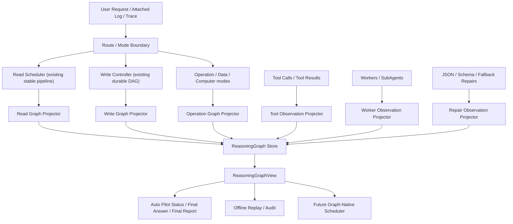

# Codrax URGR 统一语义推理图系统设计与交付计划

更新时间：2026-06-20

## 1. 结论

`URGR`（Unified Reasoning Graph Runtime，统一语义推理图运行时）的最终目标是可行的，但原始草案里的“直接替换 read pipeline / write DAG / trace-log-tool-subagent 分支”为一次性大重构，不适合当前 Codrax。

当前 Codrax 已经具备 URGR 的一部分核心底座：

- `internal/loopkernel` 已有 `LoopRun` / `LoopEvent` / `LoopStateView` / reducer / authority projection。
- 写模式已有 durable `WriteWorkflowRun` 和 `EventsFromWriteWorkflowRun`，能把 workflow 投影为 loop events。
- 读模式已有强 typed pipeline、`AnswerDocumentV2`、TurnA artifacts、repo_map navigation coverage、localization/proof/truth sidecar。
- `internal/worker` 已有 Localizer / ImpactAnalyzer / PatchCritic / ProofAuditor / FailureAnalyzer 这类 typed evidence producer。
- 工具参数兼容、JSON repair、fallback/repair locus、prompt hygiene 测试已经存在，但分散在 `internal/agent`、`internal/tool`、`internal/orchestrator`。

因此合理目标不是另起炉灶写一个“大而全 GraphExecutor”，而是：

> 以现有 `loopkernel` 为核心事件运行时，新增 `ReasoningGraph` 作为跨 read/write/tool/subagent/log/trace 的 typed semantic projection。先 shadow 投影和 replay，再逐步让 controller/scheduler 消费图视图，最后收敛重复状态机。

## 2. 不可直接照搬原草案的原因

| 原草案目标 | 当前可行性 | 风险 | 调整后的方向 |
| --- | --- | --- | --- |
| 所有执行必须发生在 ReasoningGraph 内 | 不适合一次完成 | 会破坏 read mode L1 byte-preserved、取消/恢复/worktree 清理等红线 | 先做 graph projection 和 replay，稳定后局部消费 |
| 替换固定 4-stage read pipeline | 中长期可行 | read scheduler 是稳定核心，直接替换会影响读模式和 trace/log 前置阶段 | read pipeline 先投影为 graph events，不改 `runReadSchedulerLoop` |
| 替换 write DAG | 部分已完成 | 写 controller 已是动态 DAG，重写会重复造轮子 | 把 `WriteWorkflowRun` 作为 URGR write projection 的事实源 |
| 全部 tool/log/trace/subagent 统一成 Evidence | 可行 | 若把所有输出都塞 `any Content`，会退回弱类型 | 使用 typed `ArtifactRef` + schema-specific payload，不用通用散文 evidence |
| 同一输入必然同一结果 | 只能保证 deterministic replay，不保证 LLM 非确定性执行 | LLM、环境、时间、依赖下载不可完全 deterministic | 区分 execution nondeterminism 与 replay determinism |
| 移除旧 pipeline | 只能作为最后阶段 | 过早移除会破坏稳定场景 | 只有当 graph consumer 覆盖 read/write/trace/log 后再删冗余投影 |

## 3. 当前架构事实

### 3.1 Read Mode

当前 read mode 是：

```text
log/perf triage? -> analyze -> explore -> extract -> finalize -> contract check/retry
```

关键约束：

- `runReadSchedulerLoop` 受 L1 byte-preserved 红线保护。
- analyzer 产出 `AnalysisIR`，后续 14 个 analysis 子包确定性构建 TaskGraph / EvidencePlan / hypotheses / quality gate。
- 上下游交接以 Go struct 为准，不靠模型散文。
- repo_map、localization、navigation、final answer sidecar 已有 typed artifact。

URGR 对 read mode 的正确切入点不是替换 scheduler，而是增加只读投影：

```text
StageReport / ToolResult / TurnAArtifacts / AnswerDocumentV2
    -> ReasoningGraphEvent
    -> ReasoningGraphView
    -> finalizer / reviewer / audit / replay 消费
```

### 3.2 Write Mode

当前 write mode 已经接近在线图执行：

```text
write_analyzer -> write_controller
    -> explore_code
    -> plan_batch
    -> apply_plan
    -> verify_batch
    -> replan/split/append/finish/block
```

关键事实：

- `WriteWorkflowRun` 是 durable DAG。
- `loopkernel.EventsFromWriteWorkflowRun` 已能投影 run/batch/slice/effect/permission/checkpoint/apply/observe/proof/truth。
- `LoopStateView` 已作为 Auto Pilot 状态卡、final report、SWE eval telemetry 的 typed source。

URGR 对 write mode 的正确方向是复用该事实源：

```text
WriteWorkflowRun -> LoopEvent -> ReasoningGraphEvent -> ReasoningGraphView
```

不要再发明第二套 write graph。

### 3.3 Tool / JSON / Prompt Repair

当前已有分散能力：

- `internal/agent/tool_params_repair.go`
- `internal/tool/structured_payload_compat.go`
- `internal/tool/answer_document_json_repair.go`
- `internal/tool/strict_decode_repair.go`
- `internal/orchestrator/fallback_policy.go`
- `internal/orchestrator/repair_execution_plan.go`
- `internal/types/repair.go`
- `internal/types/plan_repair_pack.go`

差距是缺少统一 projection：

- 工具参数被修复了，但 repair 事件没有统一进入 graph。
- JSON schema 失败有 repair hint，但没有统一 replay/audit 视图。
- prompt/hint 仍然由多个 owner 生成，缺少同一份 typed violation spec 的多出口渲染。

URGR 应把这些都变成 typed observation event，而不是把 prompt 文本当逻辑入口。

### 3.4 SubAgent / Worker

当前 `SubAgentRuntime` 和 `internal/worker` 已经提供隔离证据生产者能力。URGR 不需要把 subagent 改成自由执行节点，而是把 worker/subagent 输出投影为：

- `worker_request`
- `worker_result`
- `artifact_ref`
- `evidence_ref`
- `scope`
- `budget`
- `permission/effect`

mutation 仍由 write controller / effect kernel 统一持有。

## 4. 修正后的最终目标

### 4.1 URGR 的定义

URGR 是 Codrax 的跨模式 typed semantic event graph，不是一个替代所有业务逻辑的万能 executor。

```go
type ReasoningGraph struct {
    GraphID      string
    Mode         string
    Goal         string
    Nodes        []ReasoningNode
    Edges        []ReasoningEdge
    EvidenceRefs []ReasoningEvidenceRef
    EventRefs    []loopkernel.ArtifactRef
    CreatedAt    time.Time
    UpdatedAt    time.Time
}
```

### 4.2 Node 类型

```go
type ReasoningNodeKind string

const (
    ReasoningNodeAnalyze       ReasoningNodeKind = "analyze"
    ReasoningNodeExplore       ReasoningNodeKind = "explore"
    ReasoningNodeExtract       ReasoningNodeKind = "extract"
    ReasoningNodeFinalize      ReasoningNodeKind = "finalize"
    ReasoningNodeController    ReasoningNodeKind = "controller"
    ReasoningNodePlan          ReasoningNodeKind = "plan"
    ReasoningNodeApply         ReasoningNodeKind = "apply"
    ReasoningNodeVerify        ReasoningNodeKind = "verify"
    ReasoningNodeTool          ReasoningNodeKind = "tool"
    ReasoningNodeWorker        ReasoningNodeKind = "worker"
    ReasoningNodeSubAgent      ReasoningNodeKind = "subagent"
    ReasoningNodeLogTriage     ReasoningNodeKind = "log_triage"
    ReasoningNodePerfTriage    ReasoningNodeKind = "perf_triage"
    ReasoningNodeRepair        ReasoningNodeKind = "repair"
    ReasoningNodeEvidence      ReasoningNodeKind = "evidence"
)
```

### 4.3 Edge 类型

```go
type ReasoningEdgeKind string

const (
    ReasoningEdgeDependsOn      ReasoningEdgeKind = "depends_on"
    ReasoningEdgeProduces       ReasoningEdgeKind = "produces"
    ReasoningEdgeConsumes       ReasoningEdgeKind = "consumes"
    ReasoningEdgeValidates      ReasoningEdgeKind = "validates"
    ReasoningEdgeRepairs        ReasoningEdgeKind = "repairs"
    ReasoningEdgeBranchesTo     ReasoningEdgeKind = "branches_to"
    ReasoningEdgeMergesInto     ReasoningEdgeKind = "merges_into"
    ReasoningEdgeCausalRef      ReasoningEdgeKind = "causal_ref"
)
```

### 4.4 Evidence 模型

不要使用 `Content any` 作为主模型。URGR evidence 必须是 typed ref + schema-specific payload：

```go
type ReasoningEvidenceRef struct {
    ID          string
    Kind        string
    ArtifactRef loopkernel.ArtifactRef
    NodeID      string
    Priority    string // p0/p1/p2/p3
    Confidence  string // high/medium/low/unverified
    SourceStage string
    Consumer    string
}
```

当必须携带 payload 时，payload 只能来自 schema-validated typed struct：

```go
type ReasoningEvent struct {
    ID           string
    GraphID      string
    NodeID       string
    Sequence     int64
    Kind         string
    ReasonCode   string
    ArtifactRefs []loopkernel.ArtifactRef
    Payload      json.RawMessage
    At           time.Time
}
```

硬门只消费：

- typed enum
- bool/int 数值
- repo-relative path resolver
- schema-validated JSON/YAML/XML/parser result
- effect fingerprint / plan fingerprint
- verifier verdict
- loop/reasoning event kind

硬门禁止消费：

- 用户关键词匹配
- 模型 rationale / summary / prose
- prompt 文本
- 终端 narrative
- 可见 `<think>` 日志

## 5. 目标架构



### 5.1 分层职责

| 层 | 职责 | 是否立即改变行为 |
| --- | --- | --- |
| Projector | 从现有 typed artifacts 生成 graph events | 否 |
| Store | 原子写入 graph events / graph snapshots | 否 |
| Reducer | 从 events 得到 `ReasoningGraphView` | 否 |
| Consumer | 状态卡、final report、eval、reviewer、controller 消费 view | 分批开启 |
| Executor | 图原生调度器 | 最后阶段，只用于新 flow 或已验证迁移面 |

### 5.2 与现有 loopkernel 的关系

`loopkernel` 是 URGR 的低层事件内核，不应被替换。

URGR 新增的是更高层语义图：

```text
loopkernel.LoopEvent
    -> runtime unit / permission / proof / truth / observe

reasoninggraph.ReasoningEvent
    -> read/write/tool/worker/repair/log/trace semantic relation
```

两者关系：

- write runtime events 继续由 `loopkernel` 管。
- read/tool/worker/log/trace 的跨模式语义关系由 `reasoninggraph` 管。
- `ReasoningGraphView` 可以内嵌或引用 `LoopStateView`，但不复制 permission/proof/truth 逻辑。

## 6. 关键 Gap

### G1：Read mode 还没有完整 graph projection

读模式产出丰富 artifacts，但没有统一 append-only event view。最终答案、reviewer、repair 仍主要看各自局部结构。

目标：把 `AnalysisIR`、TaskGraph、ToolResult、TurnAArtifacts、AnswerDocumentV2、contract violations 投影成 read graph events。

### G2：Tool result / repair event 没有统一观察层

工具参数兼容、JSON repair、schema violation、fallback routing 已经存在，但没有统一 event ledger。

目标：新增 `repair_observed` / `tool_param_normalized` / `schema_rejected` / `fallback_routed` events，供 UX、eval、debug 和 future scheduler 消费。

### G3：SubAgent / Worker 输出还未进入跨模式图

worker 已 typed，但输出主要供当前调用方消费。

目标：worker request/result/artifact/evidence ref 都进入 graph，作为隔离证据生产者。

### G4：Trace / log / data / operation 仍是模式局部状态

这些模式已有 typed 输入和 artifact，但没有统一 graph relation。

目标：只做 projection，不改变原模式入口。

### G5：Replay 只能覆盖局部 workflow/final report

写模式 replay 和 final audit 已有雏形，但 read/tool/repair/subagent 还没有统一 replay。

目标：offline graph audit CLI 可以从 artifacts 重建跨模式 evidence closure。

### G6：Graph executor 不应过早上线

如果先写 `GraphExecutor.Run` 取代现有 scheduler，会重复造轮子并破坏稳定场景。

目标：先 projector/reducer/store/view，最后再引入小范围 graph-native executor。

## 7. 分批交付计划

### Batch U0：文档和边界确认

目标：把本文件作为 URGR 当前真源文档。

任务：

- [x] 对照当前代码重新定义 URGR。
- [x] 明确不可一次性替换 read pipeline/write DAG。
- [x] 明确 prompt 红线和 typed hard gate 边界。
- [x] 给出分批任务列表。

验收：

- 文档不要求用 prompt/关键词判断用户或模型意图。
- 文档不要求删除稳定 scheduler。
- 文档能指导后续实现，不是单个 case 补丁。

### Batch U1：ReasoningGraph schema + store

目标：新增 `internal/reasoninggraph`，作为跨模式 semantic graph 投影层。

任务：

- 定义 `ReasoningGraph`、`ReasoningNode`、`ReasoningEdge`、`ReasoningEvent`、`ReasoningEvidenceRef`。
- 定义 `ReasoningGraphView` reducer。
- 使用现有 `types.AtomicWriteFileSync` 做原子事件存储。
- 增加 event normalization / deterministic ordering。
- 增加 schema tests、store roundtrip tests、reducer tests。

验收：

- 不修改 read/write/operation 入口。
- 不新增外部依赖。
- `go test ./internal/reasoninggraph ./internal/loopkernel` 通过。

### Batch U2：Write projection 合并

目标：把现有 write workflow/loop events 作为 URGR 第一条生产 projection。

任务：

- 从 `loopkernel.EventsFromWriteWorkflowRun` 投影 `ReasoningEvent`。
- 保留 loopkernel 的 permission/proof/truth 权威，不复制逻辑。
- 将 final report 中的 loop event refs 扩展为 reasoning graph refs。
- SWE adapter `results.jsonl` 增加 graph audit refs，但不改变官方 predictions shape。

验收：

- 现有 write workflow tests 通过。
- `--write-audit` 能显示 graph refs。
- SWE smoke predictions 仍可被官方 harness 消费。

### Batch U3：Read projection shadow

目标：不修改 `runReadSchedulerLoop`，给 read mode 增加 shadow graph projection。

任务：

- 从 `AnalysisIR`、TaskGraph、ToolResult、TurnAArtifacts、AnswerDocumentV2、contract violations 生成 read graph events。
- 把 read graph refs 写入最终 answer artifact 的 audit 区。
- final answer 渲染不因 graph 缺失失败；projection 失败只 fail-loud 到 debug/eval，不影响用户稳定路径。
- 增加 read localization/navigation/proof graph projection tests。

验收：

- L1 read scheduler byte-preserved 测试保持通过。
- 读模式最终答案可以通过 graph refs 回溯主要 evidence。
- 不解析模型散文构造硬门。

### Batch U4：Tool / repair observation projection

目标：统一工具参数修复、JSON 修复、schema violation、fallback routing 的观察事件。

任务：

- 定义 `ToolObservationEvent`、`StructuredPayloadRepairEvent`、`SchemaViolationEvent`、`FallbackRoutingEvent`。
- 在 agent/tool/orchestrator 现有 repair 点追加 projection hook。
- projection hook 只读 typed tool schema、repair code、violation kind、repair locus。
- 增加 prompt hygiene test，确保硬逻辑不读取 prompt/prose。

验收：

- 工具参数修复历史可 replay。
- `emit_change_plan`、`emit_answer_document` 的失败/修复原因可按 typed event 汇总。
- 不改变工具执行语义。

### Batch U5：Worker / SubAgent projection

目标：把 worker/subagent 变成 graph 上的隔离证据生产者。

任务：

- 从 `internal/worker.Request/Result` 投影 node/edge/evidence refs。
- 从 `SubAgentRuntime.Run` 的输入输出投影 `ReasoningNodeSubAgent`。
- 保持 mutation 只能由 write controller/effect kernel 执行。
- 为 Localizer / ImpactAnalyzer / PatchCritic / ProofAuditor / FailureAnalyzer 增加 graph projection tests。

验收：

- worker 输出可从 graph audit 追踪到 producer、scope、budget、artifact ref。
- subagent 不能通过 graph 绕过 permission/effect policy。

### Batch U6：Trace / log / data / operation projection

目标：跨模式输入都成为 graph evidence，但不重写各模式。

任务：

- log triage / perf triage / htrace / atrace 输入投影为 evidence node。
- data/operation/computer 模式的 workflow state 投影为 graph node。
- MCP typed resource observations 投影为 external evidence node。
- 增加跨模式 graph view summary。

验收：

- trace/log 当前用户路径不变。
- external evidence 明确标注不可信来源，必须经工具返回的 typed result 才能成为 evidence。
- graph audit 可以说明 final answer/write decision 使用了哪些附加输入。

### Batch U7：Unified Graph Audit CLI

目标：提供低心智审计入口，不增加 routine 命令负担。

任务：

- 扩展 `--write-audit` 或新增高级 `--graph-audit <artifact>`。
- 支持从 final answer、final write report、workflow run、results.jsonl 反查 graph。
- 输出 compact JSON：nodes、edges、evidence refs、repair events、truth/proof/localization status。
- 支持 `--format json|md`。

验收：

- audit 不调用 LLM，不跑工具，不创建 worktree。
- 缺 artifact fail-loud。
- 输出只来自 typed artifacts。

### Batch U8：Graph view consumer

目标：让状态卡、final report、reviewer、eval 逐步消费 `ReasoningGraphView`。

任务：

- Auto Pilot status card 增加 graph-derived reason summary。
- final answer reviewer 增加 evidence closure graph consistency check。
- write final report 增加 graph evidence coverage summary。
- SWE/result summarizer 增加 graph coverage metrics。

验收：

- 用户 routine path 不新增命令。
- graph 缺失不会让稳定 answer/write 失败，除非对应 typed hard gate 已经明确要求。
- reviewer 不从 graph prose 里抽事实，只读 refs/kinds/verdicts。

### Batch U9：Graph-native executor MVP

目标：只在低风险新 flow 中引入 graph-native executor，不替换稳定 read/write 主路径。

任务：

- 实现 `GraphExecutor.Run(graph)` 的最小 MVP：只支持 deterministic replay 和 read-only worker scheduling。
- 不支持 mutation；write mutation 仍走 controller。
- 支持 local recompute：给定 node id 重放 projector/reducer，而不是重跑 LLM。
- 增加 cancellation、budget、reentry tests。

验收：

- 不影响 read/write/operation 主路径。
- replay/local recompute 不调用 LLM。
- executor 只消费 typed graph，不解析 prompt/prose。

### Batch U10：收敛和删除冗余投影

目标：当 graph projection 和 consumers 稳定后，删除重复状态投影。

任务：

- 找出与 `ReasoningGraphView` 重复的 debug/eval/report 字段。
- 保留外部格式兼容所需字段，内部统一从 graph view 生成。
- 更新 `docs/architecture.md`、`docs/user_guide.md`、测试矩阵。

验收：

- `go test ./...`、`make test` 通过。
- read/log/trace/data/operation/computer 稳定路径不回归。
- 写模式 worktree cleanup、permission、approval、fingerprint gate 不回归。

## 8. 最小可运行 prototype

第一版 prototype 不跑任何 LLM，也不调工具：

```go
func PrototypeFromWriteRun(run types.WriteWorkflowRun) reasoninggraph.ReasoningGraph {
    loopEvents := loopkernel.EventsFromWriteWorkflowRun(run)
    graphEvents := reasoninggraph.EventsFromLoopEvents(loopEvents)
    return reasoninggraph.Reduce(graphEvents)
}
```

第二版 prototype 覆盖 read artifact：

```go
func PrototypeFromAnswerDocument(doc types.AnswerDocumentV2, ir types.AnalysisIR) reasoninggraph.ReasoningGraph {
    events := reasoninggraph.EventsFromReadArtifacts(doc, ir)
    return reasoninggraph.Reduce(events)
}
```

这两版足够证明：

- graph schema 可承载 read/write 关键证据；
- replay 不依赖 LLM；
- final answer/final report 能反查 evidence refs；
- 不需要替换 scheduler 才能获得 URGR 价值。

## 9. 验收矩阵

| 能力 | 证明方式 |
| --- | --- |
| Read projection 不破坏稳定路径 | L1 byte-preserved tests、read e2e tests |
| Write projection 不重复造轮子 | `EventsFromWriteWorkflowRun` adapter tests、write controller tests |
| Tool/JSON repair 统一进入 graph | agent/tool/orchestrator repair event tests |
| Prompt 红线 | prompt hygiene tests：硬门不读用户关键词/模型 prose/prompt 文本 |
| Handoff 保真 | graph evidence refs 保留 P0/P1/P2/P3 priority、source stage、consumer |
| Replay | offline graph audit 不调用 LLM/tools |
| 低用户心智 | routine REPL/CLI 不新增必用命令，只增强状态卡/audit artifact |
| 商用稳定 | `go test ./...`、`make test`、SWE smoke/eval audit |

## 10. 设计红线

- 不用用户关键词匹配驱动 route、approval、repair、truth、proof、localization 硬门。
- 不解析模型 summary/rationale/prose 作为控制流。
- 不把 visible `<think>` 当错误；它是用户透明度信息，不能进入硬逻辑。
- 不新增 parallel graph engine 取代已有 write controller。
- 不修改 `runReadSchedulerLoop` 以实现早期 graph projection。
- 不把 `Evidence.Content any` 作为无 schema 数据湖。
- 不让 subagent/worker 通过 graph 绕过 effect/permission kernel。
- 不为了“统一”牺牲 read/log/trace/data/operation/computer 稳定入口。

## 11. 当前优先级

P0：

1. `internal/reasoninggraph` schema/store/reducer。
2. write workflow -> reasoning graph projection。
3. read artifact -> reasoning graph shadow projection。
4. tool/repair observation projection。

P1：

1. worker/subagent projection。
2. trace/log/data/operation projection。
3. graph audit CLI。
4. status card/final report/reviewer/eval graph consumers。

P2：

1. graph-native executor MVP。
2. 删除重复 projection 和旧审计字段。
3. 文档和用户指南收敛。

## 12. 最终成功标准

URGR 完成不是“代码里只有一个 GraphExecutor”，而是满足以下事实：

- read/write/log/trace/tool/subagent/repair 的关键事件都能投影成 typed graph。
- final answer 和 write final report 都能通过 graph refs 回溯证据。
- graph replay 不需要 LLM、工具或 worktree mutation。
- controller/scheduler 的硬门只读 typed graph/artifacts，不读 prompt/prose/关键词。
- routine 用户路径仍然是自然语言请求 + 自动状态卡，只有 high-risk/blocked 才打断。
- 当 graph consumers 覆盖稳定后，重复状态机可以被删除，而不是提前推倒重来。
