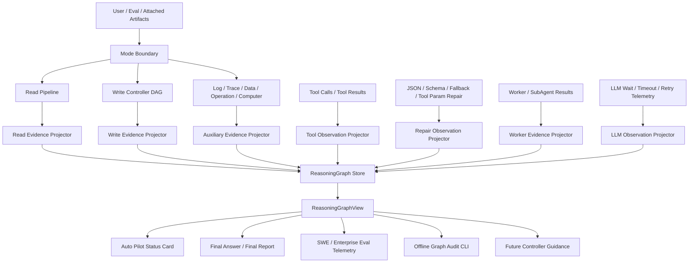

# Codrax URGR 商业价值版目标架构与任务规划

## 1. 定位

URGR（Unified Reasoning Graph Runtime）在 Codrax 中的商业定位是：

> 跨模式 typed reasoning evidence ledger，用于让读写任务的证据、修复、验证、handoff、失败原因和最终结论可追踪、可复盘、可审计，并逐步反哺调度决策。

URGR 不是为了把所有业务逻辑改写成一个万能 `GraphExecutor`。它的价值在于把 Codrax 已经存在的 read pipeline、write controller、tool repair、worker/subagent、log/trace/data/operation artifacts 统一投影为 typed reasoning graph，让系统能回答：

- 为什么这次写模式重新探索？
- 为什么 `emit_change_plan` 被重试？
- 哪个 schema repair 或 tool 参数修复发生过？
- 最终答案是否丢失了探索阶段的重要证据？
- 写模式补丁是否能追溯到 owner anchor、verification proof、truth ledger 和 handoff evidence？
- 本地 verify 不可用、probe-only、proof coverage weak 时，系统为什么仍然导出 patch 或选择继续？
- 企业 eval / SWE-bench / 用户工单复盘时，不翻散文日志能否还原关键路径？

## 2. 商业目标

### 2.1 直接商业收益

| 目标 | 客户价值 | 系统价值 |
| --- | --- | --- |
| 降低写模式误改率 | 少改错文件、少产生不可用 patch | owner/evidence/proof/truth 形成闭环 |
| 缩短失败定位时间 | 用户和研发能快速知道卡在哪里 | repair/tool/schema/LLM-wait 统一可观测 |
| 提升读模式答案可信度 | 最终答案不丢探索证据 | read evidence graph 保留 handoff 和 citation closure |
| 提升 eval 可复盘性 | SWE/企业评测能解释 pass/fail/unknown | predictions 之外有 typed audit telemetry |
| 降低用户心智 | routine path 自动继续，只在必要时打断 | 状态卡来自 typed graph reason code |
| 支撑商用支持 | 客户问题可用 artifact 复盘，不依赖日志散文 | offline audit CLI 不调用 LLM/tool |

### 2.2 非目标

以下内容不作为近期目标：

- 不替换稳定 read scheduler。
- 不用 graph-native executor 替代 write controller。
- 不把所有系统行为强行塞进一个执行器。
- 不把 evidence 做成 `Content any` 的弱类型数据湖。
- 不为了架构统一影响 read/log/trace/data/operation/computer 等稳定模式。
- 不新增必须用户手动输入的 routine 命令。

## 3. 目标架构



## 4. 架构原则

### 4.1 Typed Ledger First

URGR 的第一形态是 append-only typed ledger，而不是 executor。

所有 graph event 必须来自现有 typed artifacts：

- `AnalysisIR`
- TaskGraph / EvidencePlan / StageReport
- `ToolResult`
- TurnA artifacts
- `AnswerDocumentV2`
- `WriteWorkflowRun`
- `LoopEvent`
- `ChangePlan`
- `ChangeReport`
- `WriteFinalReport`
- `WorkerResult`
- repair/violation/fallback typed records

### 4.2 Hard Gate 只读精确信号

硬门允许读取：

- typed enum
- bool/int 数值
- repo-relative path resolver
- parser/schema validated JSON/YAML/XML/AST
- effect fingerprint / plan fingerprint
- verifier verdict
- loop/reasoning event kind
- repair code / violation kind / repair locus

硬门禁止读取：

- 用户关键词匹配
- 模型 summary/rationale/prose
- prompt 文本
- 终端 narrative
- 可见 `<think>` 日志

### 4.3 Projection 先于调度替换

先统一观测和复盘，再逐步让 controller/scheduler 消费 graph view。

```text
typed artifacts -> graph events -> graph view -> audit/status/report/eval -> controller guidance
```

不要跳到：

```text
typed artifacts -> delete current scheduler -> GraphExecutor owns everything
```

### 4.4 用户路径保持低心智

routine path 仍然是：

```text
用户自然语言目标 -> Codrax 自动探索/写入/验证/收敛 -> 状态卡说明结果
```

URGR 增加的是解释能力和复盘能力，不是让用户多学一套命令。

## 5. 核心数据模型

### 5.1 ReasoningGraph

```go
type ReasoningGraph struct {
    GraphID      string
    Mode         string
    Goal         string
    Nodes        []ReasoningNode
    Edges        []ReasoningEdge
    EvidenceRefs []ReasoningEvidenceRef
    EventRefs    []loopkernel.ArtifactRef
    CreatedAt    time.Time
    UpdatedAt    time.Time
}
```

### 5.2 ReasoningEvent

```go
type ReasoningEvent struct {
    ID           string
    GraphID      string
    NodeID       string
    NodeKind     ReasoningNodeKind
    Sequence     int64
    Kind         ReasoningEventKind
    ReasonCode   string
    ArtifactRefs []loopkernel.ArtifactRef
    EvidenceRefs []ReasoningEvidenceRef
    Payload      json.RawMessage
    At           time.Time
}
```

### 5.3 ReasoningNode

```go
type ReasoningNodeKind string

const (
    ReasoningNodeAnalyze    ReasoningNodeKind = "analyze"
    ReasoningNodeExplore    ReasoningNodeKind = "explore"
    ReasoningNodeExtract    ReasoningNodeKind = "extract"
    ReasoningNodeFinalize   ReasoningNodeKind = "finalize"
    ReasoningNodePlan       ReasoningNodeKind = "plan"
    ReasoningNodeApply      ReasoningNodeKind = "apply"
    ReasoningNodeVerify     ReasoningNodeKind = "verify"
    ReasoningNodeTool       ReasoningNodeKind = "tool"
    ReasoningNodeRepair     ReasoningNodeKind = "repair"
    ReasoningNodeWorker     ReasoningNodeKind = "worker"
    ReasoningNodeSubAgent   ReasoningNodeKind = "subagent"
    ReasoningNodeLogTrace   ReasoningNodeKind = "log_trace"
    ReasoningNodeData       ReasoningNodeKind = "data"
    ReasoningNodeOperation  ReasoningNodeKind = "operation"
    ReasoningNodeEvidence   ReasoningNodeKind = "evidence"
    ReasoningNodeLLM        ReasoningNodeKind = "llm"
)
```

### 5.4 ReasoningEvidenceRef

```go
type ReasoningEvidenceRef struct {
    ID           string
    Kind         string
    ArtifactRef  loopkernel.ArtifactRef
    NodeID       string
    Priority     string // p0/p1/p2/p3
    Confidence   string // high/medium/low/unverified
    SourceStage  string
    Consumer     string
    ReasonCode   string
}
```

### 5.5 ReasoningGraphView

`ReasoningGraphView` 是给状态卡、审计命令、final report、SWE/eval telemetry 消费的 read model。它只能从 typed events/references reduce 得到，不读取 prompt、模型散文、visible thinking 或终端叙事。

```go
type ReasoningGraphView struct {
    GraphID         string
    EventCount      int
    LastEventKind   ReasoningEventKind
    LastReasonCode  string
    Nodes           []ReasoningNodeView
    EvidenceRefs    []ReasoningEvidenceRef
    ToolEvents      []ReasoningEventSummary
    RepairEvents    []ReasoningEventSummary
    LLMEvents       []ReasoningEventSummary
    WorkflowEvents  []ReasoningEventSummary
    ReadEvents      []ReasoningEventSummary
    WorkerEvents    []ReasoningEventSummary
    SubAgentEvents  []ReasoningEventSummary
    AuxiliaryEvents []ReasoningEventSummary
    EventKindCounts []EventKindCount
}
```

### 5.6 ReasoningObserver

`ReasoningObserver` 是各模式共用的旁路投影接口。agent/tool/repair/LLM 边界只追加 typed event，不同步读取 graph state，不改变当前工具结果、prompt、approval、调度或模型输出。

```go
type Observer interface {
    ObserveReasoningEvent(event ReasoningEvent)
}
```

生产主流程可以选择 no-op、内存 collector、atomic artifact store 或后续 run-scoped store；控制流只允许消费 reducer 产出的 typed view，不能从 observer 的原始 payload、日志散文或 prompt 文本做硬路由。

### 5.7 ReasoningGraphAuditSummary

`ReasoningGraphAuditSummary` 是 graph view 给用户状态卡、support audit、eval report 的紧凑投影视图。它可以来自完整 graph events，也可以来自 final answer / final report 中的 compact graph summary；当只有 summary refs 没有完整 events 时必须标记为 partial，不能补写虚假的 repair / LLM / evidence 细节。

```go
type ReasoningGraphAuditSummary struct {
    Source           string
    Status           string // observed | partial | missing
    ReasonCode       string
    GraphID          string
    EventCount       int
    NodeCount        int
    EvidenceRefCount int
    LastEventKind    string
    LastReasonCode   string
    EventRefs        []string
    Lanes            []ReasoningGraphAuditLane
    RecentEvents     []ReasoningGraphAuditEvent
    RepairEvents     []ReasoningGraphAuditEvent
    LLMEvents        []ReasoningGraphAuditEvent
    WorkerEvents     []ReasoningGraphAuditEvent
    SubAgentEvents   []ReasoningGraphAuditEvent
    AuxiliaryEvents  []ReasoningGraphAuditEvent
    Missing          []ReasoningGraphAuditGap
}
```

硬约束：

- audit summary 只读 typed graph event、typed final summary 或 typed answer summary。
- 不从 prompt、用户意图关键词、模型散文、visible thinking、terminal narrative 恢复事件。
- routine 用户路径只消费状态卡摘要；完整 audit 是高级排障能力。

## 6. 高价值能力

### 6.1 Tool / JSON / Repair Observation Graph

优先级最高。

要记录：

- tool call accepted/rejected
- tool 参数被结构化修复
- JSON-string payload 被恢复
- schema validation failed
- `emit_change_plan` / `emit_answer_document` repair pack
- fallback routing decision
- LLM request still-running / timeout / retry
- unavailable tool attempt

商业价值：

- 解释 planner 卡顿。
- 解释 `emit_change_plan` 重试。
- 解释模型 JSON 输出为什么被修复或拒绝。
- 让 eval 看到失败是模型输出问题、schema 问题、工具权限问题，还是真实代码问题。

### 6.2 Write Final Report + SWE/Eval Graph Telemetry

要记录：

- reasoning graph summary refs
- workflow run / batch / slice refs
- loop event refs
- plan/apply/verify artifact refs
- proof/truth/localization/permission authority
- patch language families
- verification runner families
- final patch fingerprint
- local acceptance confidence downgrade reason
- unavailable environment reason

商业价值：

- SWE-bench predictions 保持官方 shape，同时 results 能复盘。
- 企业 eval 可以区分“没改”“改了但未验证”“验证环境不可用”“补丁弱证据”“补丁可能正确但 proof 不足”。

`WriteFinalReport` 只携带 compact `reasoning_graph` summary：

```go
type WriteFinalReasoningGraphSummary struct {
    GraphID            string
    EventCount         int
    LastEventKind      string
    LastReasonCode     string
    EventRefs          []string
    WorkflowEventCount int
    ToolEventCount     int
    RepairEventCount   int
    LLMEventCount      int
    NodeCount          int
}
```

完整 graph events 存在 run-scoped artifact store 中，final report / audit / eval 只消费 summary 与 refs，避免 final report 膨胀为弱类型日志容器。

### 6.3 Read Evidence Graph Shadow

要记录：

- accepted answer `read_reasoning_graph` summary refs
- analyzer IR
- TaskGraph / EvidencePlan
- repo_map navigation coverage
- localization authority
- ToolResult refs
- TurnA artifacts
- extract aggregate facts
- final answer blocks 与 evidence refs 的对应关系
- contract violation / retry event

商业价值：

- 解决读模式探索信息到最终答案丢失。
- 支持最终答案质量审计。
- 支持 reviewer 判断“答案缺证据”还是“证据存在但 finalizer 没消费”。

`AnswerDocumentV2` 的 accepted artifact 携带 compact `read_reasoning_graph` summary：

```go
type AnswerReasoningGraphSummary struct {
    GraphID          string
    EventCount       int
    LastEventKind    string
    LastReasonCode   string
    EventRefs        []string
    ReadEventCount   int
    ToolEventCount   int
    RepairEventCount int
    LLMEventCount    int
    NodeCount        int
    EvidenceRefCount int
    AnswerBlockCount int
    CitationCount    int
}
```

该字段只由 runtime 从 typed artifacts 投影，不进入 `emit_answer_document` 的模型输入 schema，不从最终答案散文、模型 rationale 或 visible thinking 中推断。

### 6.4 Graph Audit CLI / Status Card

要记录并展示：

- 当前处于哪个 reasoning node。
- 为什么继续探索。
- 为什么 replan。
- 为什么 verify 后仍追加 proof batch。
- 为什么 unverified 但仍导出 patch。
- 为什么等待审批。
- 哪些 P0/P1 evidence 被消费或遗漏。

商业价值：

- 降低 REPL/CLI 用户心智。
- 支持客户 support artifact 附件复盘。
- 减少“看日志猜状态”的成本。

### 6.5 Worker / SubAgent Projection

要记录：

- worker/subagent request scope
- budget
- input artifact refs
- output artifact refs
- compact evidence refs
- role/effect permission

商业价值：

- 让 Localizer / ImpactAnalyzer / PatchCritic / ProofAuditor / FailureAnalyzer 成为可审计证据生产者。
- 防止 worker 输出在后续 batch 中丢失。
- 不改变 mutation 权限边界。

### 6.6 Tool Runtime Efficiency And Preflight Observability

要跟踪并分批修复：

- 本地工具执行整体耗时没有统一 typed telemetry，`emit_evidence` / `emit_investigation_complete` 慢时难以区分是 LLM tool args 生成慢、schema normalize 慢、工具执行慢，还是 summary/render 慢。
- `emit_evidence` / `emit_investigation_complete` 的大 schema 在 tool surface 构建、response normalize、execute-time compat normalize 路径上重复取 `Parameters()`；其中 `emit_evidence` 还会动态构造 map 并 marshal。
- LLM response 已经按当前 tool schema normalize 后，`BaseAgent.executeTool` 仍可能再从 registry 取 schema 并重复 normalize 同一个 payload。
- `ground.BuildContext(ctx)` 每次从 TurnA / stage ToolResults / dispatch ToolResults 重建 read/grep line index；`emit_evidence`、completion precheck、change-impact、call-chain 等 gate 会在一次终局检查中重复建索引。
- `emit_investigation_complete` 的 pre-complete chain 仍是多个 gate 顺序扫描 evidence / aggregate facts / read history；缺少一次性 `CompletionPreflightView`，无法复用已计算的 citation floor、pending reads、grounding context、aggregate enrichment 和 proof obligations。

商业价值：

- 解释“工具调用慢”到底发生在 schema、JSON repair、grounding、precheck、summary 还是 LLM 等待。
- 降低 `emit_evidence` 高频小批量调用和 `emit_investigation_complete` 多次重试时的固定成本。
- 避免后续为了排查性能引入散文日志依赖；所有调度可见信息必须来自 typed timing event / reason code。
- 为 Graph-Guided Controller 提供可消费的低风险信号，例如 tool/runtime storm、precheck 重复、grounding cache miss，而不是从日志文本猜测。

## 7. 分批任务规划

### 7.0 当前交付状态

| 批次 | 状态 | 已形成的商用交付面 |
| --- | --- | --- |
| P0-B1 Tool / Repair / LLM Wait Observation Graph | delivered | `internal/reasoninggraph` core、typed observer、tool/repair/LLM wait events |
| P0-B2 Write Graph Telemetry | delivered | write workflow -> graph projection、final report graph refs、SWE results graph telemetry |
| P0-B3 Read Evidence Graph Shadow | delivered | accepted answer `read_reasoning_graph` summary、read typed evidence projection、不改 read scheduler |
| P0-B4 Graph Audit / Status Card | delivered | `ReasoningGraphAuditSummary`、`--write-audit.graph_audit`、`/workflow show` graph reason card |
| P1-B5 Worker / SubAgent Projection | delivered | worker Request/Result projection、subagent Request/Result projection、optional SubAgentRuntime observer、worker/subagent graph lanes |
| P1-B6 Log / Trace / Data / Operation Projection | delivered | ToolResult/MCP typed observations、operation workflow state、data workflow runtime/state/journal projection 已进入 auxiliary graph lane；computer/桌面操作当前复用 operation workflow action/surface/risk 投影 |
| P1-B7 Eval / Support Report | delivered | SWE results summary graph coverage metrics、historical audit graph reason grouping、per-instance support table graph columns |
| P1-Perf-1 Tool Runtime Telemetry | delivered | `BaseAgent.executeTool` 本地工具/MCP 执行边界产出 typed `tool_call_observed` elapsed/status/count/ref event；`ToolResult.RuntimeTimings` 投影 `tool_phase_observed`；`emit_evidence` / `emit_investigation_complete` 子阶段 timing 已覆盖 |
| P1-Perf-2 Static Schema Cache And Normalize De-dupe | planned | 静态 `Parameters()` cache、schema-aware normalize 单次化、execute-time duplicate normalize guard |
| P1-Perf-3 Grounding Context Cache | planned | dispatch/version scoped `ground.BuildContext` cache、line-index reuse、cache hit/miss typed telemetry |
| P1-Perf-4 CompletionPreflightView | planned | `emit_investigation_complete` precheck 一次性 view、gate 共享 typed view、避免重复扫 evidence/aggregate/read history |
| P2-B8 Graph-Guided Controller | planned | typed graph view 反哺 bounded controller action |
| P2-B9 Graph-Native Replay Executor | planned | read-only replay/local recompute |
| P2-B10 收敛重复状态字段 | planned | 内部投影去重、文档和用户指南同步 |

### P0-B1：Tool / Repair / LLM Wait Observation Graph

目标：优先解决真实痛点：planner 长时间等待、`emit_change_plan` 重试、工具不可用、schema repair 循环不可解释。

任务：

1. 新增 `internal/reasoninggraph` 基础包。
2. 定义 `ReasoningEvent`、`ReasoningGraphView`、event reducer、atomic store。
3. 定义 observation event kinds：
   - `tool_call_observed`
   - `tool_call_rejected`
   - `tool_param_normalized`
   - `structured_payload_recovered`
   - `schema_rejected`
   - `repair_pack_emitted`
   - `fallback_routed`
   - `llm_request_waiting`
   - `llm_request_retried`
   - `llm_request_timeout`
4. 在 agent/tool/orchestrator repair 点追加 projection hook。
5. projection hook 只接收 typed repair code、tool schema、violation kind、repair locus、LLM attempt metadata。
6. 增加 tests：
   - tool param repair event roundtrip
   - schema reject event roundtrip
   - fallback routed event roundtrip
   - LLM wait event reducer
   - prompt hygiene：硬门不读 prompt/prose/关键词

验收：

- 不改变工具执行结果。
- 不改变 read/write 调度。
- 能用 graph view 解释 `emit_change_plan` 重试和 planner waiting。
- `go test ./internal/reasoninggraph ./internal/agent ./internal/tool ./internal/orchestrator` 通过。

### P0-B2：Write Graph Telemetry

目标：把现有 write workflow、loopkernel、final report、SWE results 串成可复盘 graph。

任务：

1. 从 `loopkernel.EventsFromWriteWorkflowRun` 投影 reasoning events。
2. 为 `WriteFinalReport` 增加 reasoning graph refs。
3. 为 `--write-audit` 增加 graph summary。
4. SWE adapter `results.jsonl` 增加 graph coverage fields。
5. 保持官方 `predictions.jsonl` shape 不变。
6. 增加 tests：
   - write workflow -> graph projection
   - final report graph refs
   - write audit graph output
   - SWE result graph fields

验收：

- 写模式 worktree cleanup、permission、approval、fingerprint gate 不变。
- SWE smoke 能生成 predictions + results。
- graph telemetry 可解释 verify failed -> replan、proof follow-up、unverified export。

### P0-B3：Read Evidence Graph Shadow

目标：解决读模式 handoff 丢失、最终答案证据缩水。

任务：

1. 从 `AnalysisIR`、TaskGraph、EvidencePlan 投影 read graph seed events。
2. 从 ToolResult / TurnAArtifacts 投影 exploration evidence events。
3. 从 extract aggregate facts 投影 structured evidence events。
4. 从 `AnswerDocumentV2` 投影 final answer consumption events。
5. 从 contract check / retry 投影 violation repair events。
6. 在 final answer artifact 中写入 graph refs。
7. 增加 tests：
   - read projection does not modify `runReadSchedulerLoop`
   - final answer graph refs preserve localization/navigation evidence
   - contract violation projects repair event
   - no model prose hard routing

验收：

- L1 read scheduler byte-preserved。
- 读模式最终答案可回溯主要 evidence refs。
- projection 失败不影响用户稳定答案路径，但在 debug/eval 中 fail-loud。

### P0-B4：Graph Audit / Status Card

目标：把 graph 价值呈现给用户和 eval，不增加 routine 命令负担。

任务：

1. 定义 `ReasoningGraphAuditSummary`，作为状态卡、support audit、eval report 的统一消费视图。
2. 扩展现有高级 audit：`--write-audit` 输出 `graph_audit`，并标明 observed / partial / missing。
3. `/workflow show` 自动展示 graph-derived reason summary，不要求 routine 用户输入新命令。
4. 输出 compact JSON / markdown：
   - current node
   - last reason code
   - repair events
   - evidence refs by priority
   - proof/truth/localization/permission status
   - missing handoff evidence
5. 后续泛化高级入口可扩展为 `--graph-audit <artifact>`，读取 final answer、write final report、workflow run、results.jsonl；该入口必须复用同一个 audit summary，不新增第二套 schema。
6. 增加 tests：
   - audit 不调用 LLM/tool
   - missing artifact fail-loud
   - status card reason from typed graph event
   - summary-only artifact 标记为 partial，不伪造完整 repair/LLM event

验收：

- routine REPL/CLI 不新增必用命令。
- 用户能看到“为什么正在重试/探索/等待/未验证”。
- audit 输出只来自 typed artifacts。

### P1-B5：Worker / SubAgent Projection

目标：把隔离证据生产者纳入 graph，不改变 mutation 权限。

任务：

1. 从 `internal/worker.Request/Result` 投影 worker node。
2. 从 `SubAgentRuntime.Run` 输入输出投影 subagent node。
3. 记录 worker scope、budget、input/output artifact refs、evidence refs。
4. 记录 effect/permission decision。
5. 增加 Localizer / ImpactAnalyzer / PatchCritic / ProofAuditor / FailureAnalyzer projection tests。
6. `SubAgentRuntime` 仅在显式配置 observer 时追加 graph events；默认 nil 不改变稳定 read/write 路径。

验收：

- worker 输出不会在后续 batch 中丢失。
- subagent 不能通过 graph 绕过 permission/effect policy。
- mutation 仍只由 write controller 持有。
- graph payload 只包含 typed scope/status/reason/permission/counts/artifact refs/evidence refs，不携带 worker/subagent prose。

### P1-B6：Log / Trace / Data / Operation Projection

目标：跨模式输入都成为 graph evidence，但不重写各模式。

任务：

1. ToolResult typed observations 投影为 auxiliary evidence node，覆盖 trace_query / runtime artifact 等已产出 `ObservationRecord` 的工具。
2. MCP typed resource observations 投影为 auxiliary evidence node，标记 external resource boundary。
3. log triage / perf triage / htrace / atrace typed artifacts 投影为 graph evidence node。
4. operation workflow state 投影为 graph node。
5. data workflow runtime/state/journal 投影为 graph node，覆盖 action、evaluation、violation、process event、record/result counts。
6. computer / desktop operation 当前没有独立 workflow IR；通过 operation workflow action/surface/risk/status 投影承接，未来若出现专用 computer state，必须复用本 auxiliary projector contract，不新增散文解析路径。
7. 标记 external evidence trust boundary。
8. 增加 tests：
   - trace/log 用户路径不变
   - external evidence 不直接成为 semantic citation
   - operation graph projection 不改变 operation execution
   - typed ToolResult/MCP observation projection 不解析 Summary/RawExcerpt
   - operation workflow projection 不调用 provider / command / approval
   - data workflow projection 只消费 RuntimeSnapshot / WorkflowStateSnapshot / WorkflowJournal typed fields，线性遍历 actions/records/violations，不调用 provider / command / approval

验收：

- log/trace/data/operation/computer 稳定路径不回归。
- graph audit 可说明 final answer/write decision 使用了哪些附加输入。
- auxiliary graph payload 只包含 origin/source_ref/span/artifact refs/evidence refs/counts，不携带外部材料散文。

### P1-B7：Eval / Support Report

目标：让 graph 成为 SWE 和企业内测的复盘载体。

任务：

1. summarize scripts 增加 graph coverage metrics：
   - `graph_present_instances`
   - `graph_event_count_total`
   - `graph_repair_event_count_total`
   - `graph_llm_event_count_total`
   - `graph_missing_p0_evidence_total`
   - `graph_unverified_reason_code_counts`
2. historical audit 增加 graph reason grouping，并在 per-instance support table 展示 graph event count / last reason。
3. results 中记录：
   - `graph_present`
   - `graph_event_count`
   - `graph_repair_event_count`
   - `graph_missing_p0_evidence_count`
   - `graph_last_reason_code`
   - `graph_unverified_reason_codes`
4. 增加 eval tests，覆盖 summary JSON、historical audit row、markdown support report。

验收：

- 非空 patch 不再被误读为功能通过。
- local verify unavailable 与 source repair failure 可区分。
- manual audit 能直接定位到 graph refs。

### P1-Perf-1：Tool Runtime Telemetry

目标：先把“慢在哪里”变成 typed evidence，避免依赖日志散文或人工猜测。

当前进展：

- 已完成：`BaseAgent.executeTool` 真实执行边界记录 `tool_call_observed`，覆盖本地工具、MCP resource、MCP tool。
- 已完成：event 只消费 typed fields：tool name、agent/stage、elapsed、success/failure、ToolResult/MCPResponse count、typed observation count、raw/payload ref count。
- 已完成：schema/policy/budget 等未执行拒绝路径仍只记录 `tool_call_rejected` / schema repair event，不伪造成 observed。
- 已完成：新增 `ToolResult.RuntimeTimings` carrier，工具内部只写 typed phase timing，agent 统一投影到 reasoning graph。
- 已完成：`emit_evidence` 覆盖 schema/compat decode、ground context、per-item grounding/stabilize、duplicate/amendment merge、summary/repair render。
- 已完成：`emit_investigation_complete` 覆盖 strict decode、aggregate normalization、decorator/member validation、grounding/citation floors、pre-complete gate chain、completion state write。

任务：

1. 在 `BaseAgent` 本地工具和 MCP 工具边界追加 `tool_call_observed` event。
2. event payload 只记录 typed fields：
   - tool name
   - agent / stage
   - elapsed millis
   - success / failure status
   - tool result count / MCP response count
   - observation count
   - raw/payload ref count
3. 为 `emit_evidence` 增加子阶段 timing：
   - schema/compat decode
   - `ground.BuildContext`
   - per-item grounding/stabilize
   - duplicate/amendment merge
   - summary/repair render
4. 为 `emit_investigation_complete` 增加子阶段 timing：
   - strict decode / aggregate normalization
   - decorator/member support validation
   - grounding / citation floors
   - pre-complete gate chain
   - accepted completion state write
5. timing 进入 reasoning graph/audit summary 的 typed event，不读取 tool Summary、模型 rationale、prompt 或 visible thinking。
6. 增加 tests：
   - successful local tool emits `tool_call_observed`
   - failed local tool emits `tool_call_observed` with failure status
   - rejected tool 继续使用既有 `tool_call_rejected`，不伪造成 observed
   - `emit_evidence` 子阶段 timing 不改变 `ToolResult`
   - `emit_investigation_complete` 子阶段 timing 不改变 completion semantics

验收：

- UI/日志里“工具慢”的场景能在 graph audit 中看到 tool elapsed。
- `emit_evidence` / `emit_investigation_complete` 慢能定位到子阶段。
- 不改变 read/write 调度、工具执行结果、prompt schema、approval、worktree cleanup。

### P1-Perf-2：Static Schema Cache And Normalize De-dupe

目标：降低大 schema 固定成本，避免同一 tool call payload 被重复 schema normalize。

任务：

1. 给静态工具 schema 建只读 cache：
   - `emit_evidence.Parameters()`
   - `emit_investigation_complete.Parameters()`
   - 其它动态 map/marshal 型大 schema 工具按测量结果纳入。
2. 保留 per-dispatch projection schema 的现有行为：
   - `emit_answer_document.ParametersFor(ctx)`
   - `emit_write_workflow_decision.ParametersFor(ctx)`
   - `run_tests` planner/verifier projected schema
3. 在 LLM response normalize 后给当前 tool call 附带 typed normalized marker，或在 `executeTool` 中复用本轮 effective schema，避免 registry 再取 schema 重跑 normalize。
4. execute-time normalize 仅作为 fallback：
   - direct test / legacy caller / MCP resource path 未经过 response normalize 时仍启用。
   - 已经过同一 schema normalize 的调用不重复执行。
5. 增加 tests：
   - `emit_evidence.Parameters()` 多次调用返回等价 schema 且不重复构造动态 map。
   - response normalize 后 execute 不重复 schema normalize。
   - direct `executeTool` 仍能修复 malformed/compat payload。
   - projected dynamic schema 不被错误缓存成跨 ctx 全局 schema。

验收：

- 高频 `emit_evidence` 调用固定成本下降。
- 不牺牲 tool param compat 的安全修复能力。
- 不把模型 prose / 用户关键词纳入 normalize 判断。

### P1-Perf-3：Grounding Context Cache

目标：让一次 dispatch / precheck 内重复 grounding 消费同一份 typed line index，而不是多次重建。

任务：

1. 为 `ground.BuildContext(ctx)` 增加可选 cache key：
   - TurnA ToolResults version
   - ctx.ToolResults length/version
   - Mutable.DispatchToolResults length/version
   - repo root / active set identity
   - search graph pointer/version
2. cache scope 限定在 AgentContext / BusContext 当前 dispatch，不做跨 run 全局缓存。
3. cache value 只保存 parsed line index / observed line index / graph pointer / active set resolver，不保存模型 prose。
4. `emit_evidence`、completion precheck、change-impact、call-chain、answer pre-emit check 优先复用 cached grounding context。
5. 新增 cache hit/miss typed telemetry，作为 soft observability，不驱动硬门。
6. 增加 tests：
   - same dispatch repeated `BuildContext` 命中 cache。
   - new read_file result appended 后 cache version 变化。
   - TurnA artifact change 不复用 stale cache。
   - read mode L1 byte-preserved。

验收：

- 大型 read/write 会话中 completion precheck 重复建索引成本下降。
- cache miss 不影响正确性，只退化到现有 `BuildContext`。
- 不改变 grounding verdict。

### P1-Perf-4：CompletionPreflightView

目标：把 `emit_investigation_complete` 的终局检查从“多个 gate 各自扫描状态”收敛成“一次构建 typed preflight view，各 gate 只消费 view”。

任务：

1. 新增 `CompletionPreflightView`：
   - evidence snapshot
   - effective aggregate facts
   - structured relation authority facts
   - read set / pending reads
   - grounding policy verdicts
   - citation floor tally
   - principal member-set coverage
   - proof obligation summary
   - cached grounding context
2. `preCompleteContractCheckWithEvidence` 改为构建 view 后调 gate list。
3. 每个 gate 从 view 读取 typed fields，不再自行重扫 Mutable / TurnA / ToolResults，除非 view 明确缺字段。
4. 保持 gate reason code / repair directive 与现有行为等价。
5. 增加 tests：
   - citation floor verdict 与旧逻辑一致。
   - pending reads drain 行为一致。
   - aggregate member_set 支持引用一致。
   - exact absence / call-chain / change-impact gates 不回归。
   - view 构建失败 fail-loud，不从 prose 兜底。

验收：

- `emit_investigation_complete` 多次重试的 CPU 和内存开销下降。
- gate 逻辑更可测，后续 Graph-Guided Controller 能消费 view summary。
- 不改变用户可见答案语义和 read scheduler。

### P2-B8：Graph-Guided Controller

目标：让 graph view 反哺调度，但仅限 typed、低风险、可回滚决策。

任务：

1. controller 消费 graph view 中的 missing P0/P1 evidence。
2. tool/repair storm 触发 bounded cooldown 或 narrower prompt surface。
3. LLM wait/timeout 触发 provider retry telemetry 和 status card。
4. proof/localization weak 时复用现有 controller action，不新增自由路由。
5. 增加 tests：
   - graph missing evidence -> existing explore action
   - repair storm -> bounded retry stop
   - no user keyword/prose routing

验收：

- graph 只指导 existing typed action。
- 不新增 prompt keyword route。
- 不影响简单写代码 happy path。

### P2-B9：Graph-Native Replay Executor

目标：只做 replay/local recompute，不替换主流程。

任务：

1. 实现 read-only `GraphReplayExecutor`。
2. 支持从 graph events 重建 view。
3. 支持 node-local recompute：只重跑 projector/reducer，不重跑 LLM/tool。
4. 增加 cancellation、budget、idempotence tests。

验收：

- replay 不调用 LLM。
- replay 不创建 worktree。
- replay 不修改 repo。

### P2-B10：收敛重复状态字段

目标：当 graph consumers 稳定后，删除重复 projection，降低维护成本。

任务：

1. 审计 final report、SWE results、workflow view 中与 graph view 重复的字段。
2. 保留外部兼容字段，内部统一从 graph view 生成。
3. 更新 `docs/architecture.md`、`docs/user_guide.md`。
4. 全量回归。

验收：

- `go test ./...`、`make test` 通过。
- read/write/log/trace/data/operation/computer 不回归。
- 用户 routine path 不变。

## 8. 验收矩阵

| 能力 | 验收证据 |
| --- | --- |
| planner 卡顿可解释 | graph 中有 LLM wait/retry/timeout/tool repair events |
| `emit_change_plan` 重试可解释 | graph 中有 repair pack、schema reject、owner evidence gating refs |
| 写模式 eval 可复盘 | final report 和 SWE results 带 graph refs |
| 读模式 handoff 不丢 | final answer artifact 带 read graph evidence refs |
| 用户心智降低 | 状态卡解释下一步，不要求用户输入新命令 |
| 工具慢可定位 | graph tool event 有 elapsed；`emit_evidence` / `emit_investigation_complete` 有子阶段 timing |
| 工具固定成本下降 | 大 schema cache + normalize de-dupe 测试覆盖，dynamic projected schema 不被全局缓存 |
| grounding 重复扫描下降 | dispatch/version cache 命中，stale cache 测试覆盖 |
| completion precheck 可复用 | `CompletionPreflightView` gate tests 覆盖 citation/pending/aggregate/proof |
| prompt 红线 | hygiene tests 证明硬门不读用户关键词/模型 prose/prompt 文本 |
| replay 安全 | audit/replay 不调用 LLM/tool，不创建 worktree |
| 商用稳定 | `go test ./...`、`make test`、SWE smoke/eval audit |

## 9. 交付顺序

```text
P0-B1 Tool/Repair/LLM Observation
    -> P0-B2 Write Graph Telemetry
    -> P0-B3 Read Evidence Shadow
    -> P0-B4 Graph Audit / Status Card
    -> P1-B5 Worker/SubAgent Projection
    -> P1-B6 Log/Trace/Data/Operation Projection
    -> P1-B7 Eval/Support Report
    -> P1-Perf-1 Tool Runtime Telemetry
    -> P1-Perf-2 Static Schema Cache And Normalize De-dupe
    -> P1-Perf-3 Grounding Context Cache
    -> P1-Perf-4 CompletionPreflightView
    -> P2-B8 Graph-Guided Controller
    -> P2-B9 Graph-Native Replay Executor
    -> P2-B10 State Field Consolidation
```

## 10. 成功标准

URGR 达成商用目标时，应满足：

- 读写任务关键证据都可通过 graph refs 追踪。
- tool/schema/JSON/fallback/LLM wait 事件可复盘。
- tool execution / emit evidence / investigation completion 的耗时可通过 typed graph timing 复盘。
- final answer 和 write final report 不丢 P0/P1 evidence。
- SWE/企业 eval 可区分 patch exported、local verified、unverified、environment unavailable、proof weak、audit blocked。
- Auto Pilot 状态卡能解释系统为什么继续、暂停、重试或结束。
- routine 用户不需要学习新命令。
- graph replay/audit 不依赖 LLM、不跑工具、不修改 worktree。
- controller 只在 typed graph view 基础上做 bounded guidance，不解析 prompt/prose/关键词。

## 11. 设计红线

- 不用用户关键词匹配驱动 route、approval、repair、truth、proof、localization。
- 不解析模型 summary/rationale/prose 作为控制流。
- 不把 visible `<think>` 当错误；它只属于用户透明度信息，不能进入硬逻辑。
- 不新增平行 write graph engine 取代已有 controller。
- 不修改 `runReadSchedulerLoop` 来实现早期 projection。
- 不把 evidence 做成无 schema 的 `any` 数据湖。
- 不让 worker/subagent 通过 graph 绕过 effect/permission kernel。
- 不为了“统一”牺牲 read/log/trace/data/operation/computer 稳定入口。
