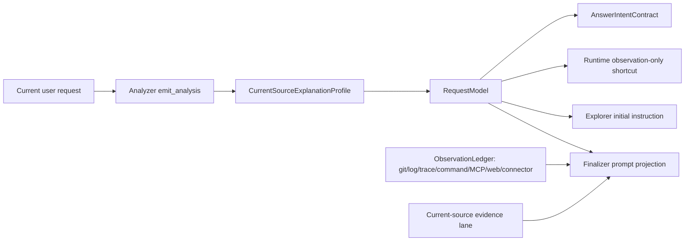

# Current Source Explanation Profile

Date: 2026-05-24

Status: design accepted, implementation in progress.

## Code Audit Before Design

This design was written after auditing the existing code so it does not create
another evidence or answer-shape stack.

| Existing primitive | Code | What it already solves | Why it is not enough for T9 |
| --- | --- | --- | --- |
| Runtime observation-only routing | `RequestModel.HasObservationOnlyRuntimeArtifact()` / `HasRuntimeArtifactCurrentVerificationAnchor()` | Keeps external log/trace answers from inventing current-repo citations. | Current-source lane opens only for resolved files, exact targets, required file hints, or the narrow `current_key_code` dimension. A user can ask for current-source explanation without naming a concrete file up front. |
| Diagnostic current-status profile | `DiagnosticIntentProfile.current_version_check` | Handles "is the observed issue still present / fixed in current checkout" diagnostics. | It is intentionally invalid for ordinary mechanism/explanation requests, so using it for "explain this log/trace/diff against current code" would overload the diagnostic contract. |
| History-backed current-code helper | `IsHistoryBackedCurrentCodeExplanation` | Preserves mixed VCS + current-source narrative for history/diff requests. | It is VCS-specific and consumes `is_history_lookup`; log/trace/command/MCP/web/connector mixed requests need the same lane without pretending to be history lookups. |
| Requested answer dimensions | `RequestedAnswerDimensionProfile` | Preserves visible labels/columns such as "diff clue", "current key code", "impact". | It is presentation guidance, not an evidence-origin contract. T10 used `current_key_code` as a safe stopgap, but T9 should not keep relying on a display dimension to open evidence lanes. |
| Change impact profile | `ChangeImpactProfile` | Handles affected-site / migration / downstream-impact questions. | Some mixed external-observation requests ask for current mechanism or verification, not affected-site enumeration. |
| Source scope profile | `SourceScopeProfile` | Decides production/test/docs/auxiliary principal scope. | It ranks eligible source paths after the current-source lane is open; it does not decide whether external evidence should be related to current source. |
| Observation ledger | `ObservationLedger` and prompt projection | Carries current-source, VCS, runtime, command, external document, web, MCP, connector origins with rich notes and spans. | This is the correct evidence carrier. T9 only needs to ensure the correct origins are requested and rendered together. |
| Answer intent contract | `CompileAnswerIntentContract` | Separates evidence origins from visible outputs. | It needs one additional typed signal so mixed external/current-source requests include `current_source` even without exact file targets. |

Therefore the implementation must reuse these surfaces:

- add a narrow typed request profile on `RequestModel`;
- route that profile through existing `AnswerIntentContract` and runtime
  observation-only helpers;
- reuse existing source-quote validation instead of creating another quote
  matcher;
- keep `ObservationLedger` as the only carrier for external and current-source
  evidence.

## Problem

External observations are now first-class evidence through the Observation
Ledger: VCS metadata/diff, runtime logs, traces, command output,
cross-repo index facts, external documents, web pages, MCP resources, and
connector resources all have origin-specific carriers. However, mixed requests
still have a routing gap:

> Use this external observation, then explain / verify / trace it against the
> current checkout.

Existing prompt-only guidance can tell the analyzer/explorer not to treat every
external artifact as "observation only", but prompt guidance is not a stable
contract. The system needs a typed, soft, language-neutral signal that opens the
current-source evidence lane when the user asks for current-code explanation,
without forcing deterministic answer rewriting or hard finalizer retries.

This is not the same as `requested_answer_dimensions`:

- `requested_answer_dimensions` preserves visible answer axes such as
  "diff clues", "current key code", "function", or "impact".
- `current_source_explanation_profile` decides whether current-source evidence
  is part of the requested reasoning for external observations.

The two profiles may both be present, but neither should replace the other.

## Existing Infrastructure To Reuse

Do not build a parallel evidence stack.

| Need | Existing surface to reuse |
| --- | --- |
| External evidence origin | `ObservationLedger`, `ObservationRecord`, `ObservationSourceRef` |
| Current-source origin | `AnswerIntentContract`, `AnswerEvidenceOriginCurrentSource` |
| Runtime observation-only shortcut | `RequestModel.HasObservationOnlyRuntimeArtifact()` |
| Runtime source-lane routing | `RequestModel.HasRuntimeArtifactCurrentVerificationAnchor()` |
| Analyzer schema and parser | `internal/tool/emit_analysis.go` |
| Analyzer prompt contract | `internal/skill/analysis_contract.go` |
| Finalizer prompt projection | `internal/agent/answer_document_evaluator.go` |
| Existing answer dimensions | `RequestedAnswerDimensionProfile` |

The new profile should feed those surfaces; it must not introduce a second
ledger, a renderer-side inference pass, or a raw-prose intent classifier.

## Typed Contract

Add an optional analyzer-emitted profile on `RequestModel`:

```go
type CurrentSourceExplanationProfile struct {
    IsCurrentSourceExplanationRequested bool
    Modes                               []CurrentSourceExplanationMode
    SourceQuotes                        []string
    TargetTerms                         []string
    Confidence                          float64
    Rationale                           string
}
```

Suggested mode enum:

| Mode | Meaning |
| --- | --- |
| `explain_current_mechanism` | Explain how the current implementation relates to the external observation. |
| `verify_current_status` | Check whether the current checkout still has / lacks the observed behavior. |
| `trace_current_flow` | Trace a flow from the observation into current source code. |
| `compare_with_current_source` | Compare external evidence against current source, usually VCS/log/trace versus code. |
| `locate_current_code` | Locate the key current-code surface related to the observation. |
| `assess_current_impact` | Explain current impact of an observed diff/change/event. |
| `other` | The user requested current-source reasoning but no narrower mode applies. |

`SourceQuotes` are current-request quotes that justify opening the current
source lane. `TargetTerms` are optional user-visible terms for ranking and
prompting; they are not evidence and cannot by themselves create a hard gate.

The external origin remains in existing ledgers and answer-intent origins.
This profile only says "current source is also requested".

## Validation Rules

The profile is optional and soft:

- Missing profile never blocks `emit_analysis`.
- If `is_current_source_explanation_requested=false`, ignore all other fields.
- If true, at least one `source_quotes[]` entry must be anchored in the current
  request, using the shared source-quote normalization helper. Unanchored
  quotes are dropped with warnings.
- If all quotes are unanchored, drop the profile with an analyzer warning
  instead of retrying.
- Unknown modes normalize to `other`; duplicates are removed preserving order.
- `confidence` is clamped/validated to `[0,1]` following existing optional
  profile conventions.

Hard decisions may consume only the normalized typed profile. They must not
parse raw user text, model free prose, or artifact text to decide whether a
current-source lane is required.

## End-to-End Data Flow



Effects:

1. `AnswerIntentContract` includes `current_source` when the normalized profile
   is active.
2. Runtime `observation_only` shortcut is disabled when the profile is active,
   even if the attached log/trace has no resolved file.
3. Explorer is allowed to read/search current source for the requested relation,
   but pure artifact-observation questions remain cheap and repo-free.
4. Finalizer receives a localized, advisory section saying current-source
   explanation was requested and should be combined with the external
   observation lanes.
5. The profile does not authorize deterministic table replacement, model
   content deletion, or finalizer hard retries.

## Origin Coverage

The contract is intentionally language-neutral and origin-neutral:

- Logs / traces: open current source when user asks "why in current code",
  "which code path", "is current version still affected", or "trace this".
- VCS: open current source when user asks to combine diff/commit history with
  current implementation, not for pure commit id/scalar questions.
- Command output: open current source when a count, grep result, build output,
  or runtime command result must be interpreted against current code.
- Cross-repo index: open current source when the relationship between indexed
  repos and active source must be explained.
- External docs / web / MCP / connector: open current source when the external
  content is being compared, verified, or mapped to the current checkout.

This profile does not depend on Go syntax. Actual current-source evidence still
flows through existing repo-map/read/search mechanisms that already support all
languages in the repository's repomap matrix.

## Non-Goals

- Do not use keywords from the user request or model prose for hard routing.
- Do not force system-generated tables.
- Do not rewrite or delete model-authored final answer content.
- Do not make runtime artifacts look like fake current-source `file:line`
  citations.
- Do not require current-source evidence for pure observation-only artifact
  questions.

## Task List

| Batch | Status | Task | Validation |
| --- | --- | --- | --- |
| T9-B0 | In Progress | Land this design and link it from the gap tracker. | doc review |
| T9-B1 | Done | Add `CurrentSourceExplanationProfile` types, mode normalization, source-quote validation reuse, and unit tests. | `go test ./internal/types -run 'TestNormalizeCurrentSourceExplanationProfile|TestAnalysisIR_JSONRoundtrip|TestRequestModel_DoesNotExposeLegacyTopLevelEntities'` |
| T9-B2 | Done | Extend `emit_analysis` params/schema/parser/summary and analyzer prompt guidance. Keep invalid optional profile as warning/drop, not hard retry. | `go test ./internal/tool -run 'TestEmitAnalysis_(CurrentSourceExplanationProfile|RequestedAnswerDimensions)|TestEmitAnalysisSchemaIncludesCurrentSourceExplanationProfile|TestEmitAnalysisSchemaMatchesContract'`; `go test ./internal/skill -run 'TestAnalysisSkill_CurrentQuestionPrimacy_NamesEveryIntentField'` |
| T9-B3 | Pending | Wire profile into `HasRuntimeArtifactCurrentVerificationAnchor`, `HasObservationOnlyRuntimeArtifact`, `AnswerIntentContract`, explorer runtime shortcut, and finalizer prompt projection. | `go test ./internal/types ./internal/agent` |
| T9-B4 | Pending | Add focused eval cases for log+code, trace+code, VCS+code, and command+code mixed requests; include placeholder coverage notes for MCP/web/connector producers. | focused eval batch |
| T9-B5 | Pending | Refresh gap tracker with results, classify any retries/rejects as model error vs system over-gate, then close T9. | docs + final push |

## Acceptance Criteria

- Pure attached-log/trace observation questions still stay observation-only.
- Mixed external-observation/current-source requests open both origins without
  requiring an exact file target up front.
- Finalizer sees rich external observation summaries and current-source evidence
  together.
- No deterministic supplement can replace model-authored answer content because
  this profile exists.
- Invalid profile fields produce warnings and telemetry, not user-visible retry
  loops.
- Unit tests protect the boundary so future developers cannot accidentally
  route current-source explanation through raw keyword checks.
