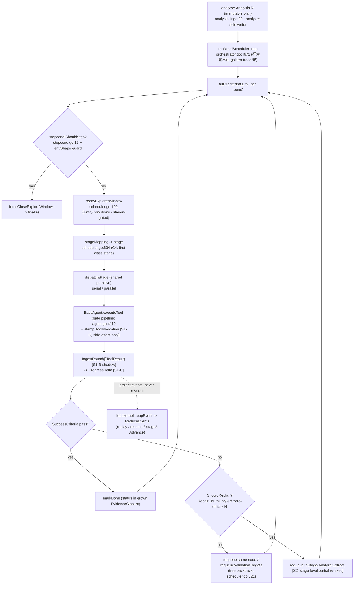
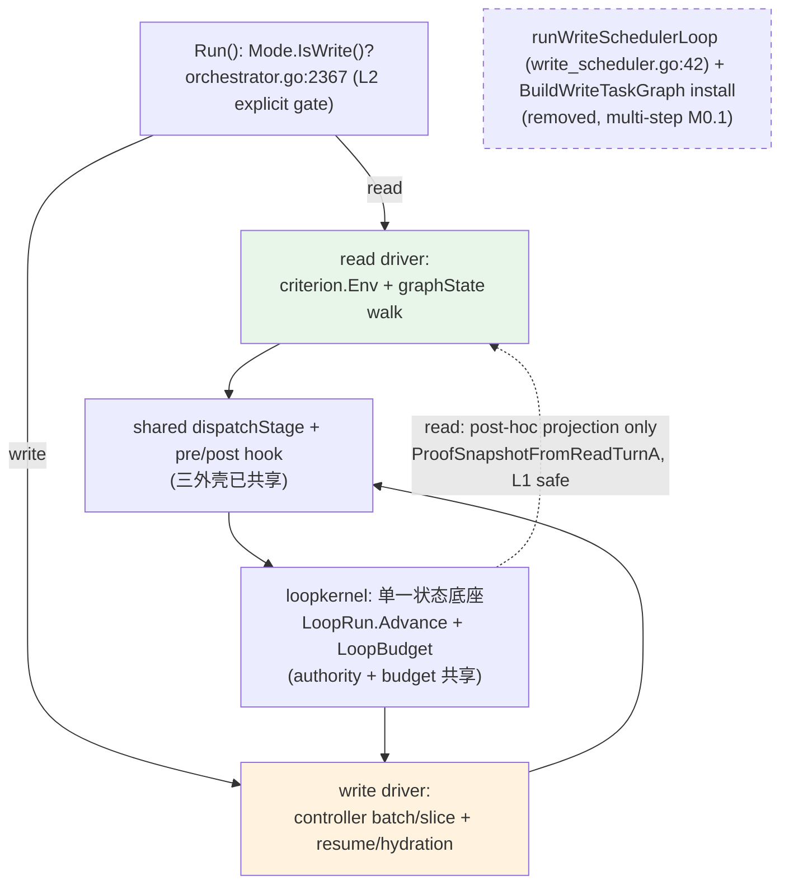

# 1. 系统现状分析

CODRAX 今天的执行模型不是"一个 pipeline + 一个 scheduler",而是**两层叠加的真实结构**,加上三个并行的执行外壳。准确分清这一点是整个 PRD 的地基。本节所有锚点均经当前 HEAD 复核。

## 1.1 Stage pipeline 层 —— 静态直线,不是决策引擎

所谓"pipeline topology"是一张**权威查表**,不是决策逻辑。`internal/orchestrator/topology.go:24-46` 把 `types.AllStageBindings()` 拷贝成 `map[PipelineStage]->{Agent,Skill,Terminal}`,这里没有任何 ordering / transition 逻辑——只有 per-stage 的 agent/skill 查找。规范的 stage 列表是 `internal/types/stage_binding.go:22-130` 里一个扁平的 `var builtinStageBindings []StageBinding`,只有 Finalize 带 `Terminal:true`(stage_binding.go:86)。

顶层时序是 `Run()` 里一条**字面直线**:pre-stages 循环(orchestrator.go:2195-2214)→ analyze → `runTaskPhase`→`runTaskGraph`(orchestrator.go:3205 → 4375)。topology.go:9-16 的注释明确记录:2026-04-14 之前的 YAML topology + "priority-weighted transition tables" 已被**删除**。

整条 pipeline 里**唯一真正有条件的 stage 选择**是 pre-stage Guard(topology.go:71-88):`StageLogTriage` 仅当 `bus.AttachedLog != ''` 触发,`StagePerfTriage` 仅当 `bus.AttachedHitrace != ''`。这两个是**精确布尔 Guard**(符合红线),声明顺序是钉死的契约(`TestPreStageOrder_LogBeforePerf`,topology_order_test.go:11-22)。这正是未来所有 stage 级条件分支的正确模板。

## 1.2 Read scheduler 层 —— 真实的 per-node 执行引擎

`runReadSchedulerLoop`(orchestrator.go:4671)是一个**真正的 per-node 执行决策引擎**,但它跑在 analyzer 产出的 TaskGraph **节点**上,不是跑在 4-stage pipeline 上。每一轮:构建纯函数 `criterion.Env` → shape-gated `ShouldStop` → 计算 `readyExplorerWindow`(scheduler.go:190-224,收集 EntryConditions 全过的 pending/requeued 非 finalize 节点)→ 串行或并行 dispatch → 评估 SuccessCriteria → 细粒度回溯。

已经存在的自适应原语:
- **node-level skip**(无 LLM dispatch):`autoCompleteReadyReconcileNodes`(orchestrator.go:6973)、`shouldAutoCompleteExploreWindowFromAcceptedClosure`(orchestrator.go:7194),accepted closure 覆盖时直接 markDone。
- **partial re-exec / backtrack**:`requeueValidationTargets`(scheduler.go:521-537)沿 `EdgeValidationFeedback` 只 requeue 命名的上游 evidence 节点;`requeueToStage`(scheduler.go:571-604)只 requeue `stageMapping==target` 的节点。
- **parallel**:`exploreWindowDispatchGroups`(dag_node_dispatch.go:238)+ `dispatchExploreWindowsParallel`(explore_parallel_dispatch.go:29),受 `pipeline_max_parallelism` 限。
- **纯函数 stop + hot-loop guard**:`stopcond.ShouldStop`(stopcond.go:17)对 `EvidencePlan.StopConditions` 做 OR;`envShape`(9-int 指纹,scheduler.go:819-866)/`hypProgress`(scheduler.go:899-945)挡 hot-loop。

**关键约束**:`stageMapping`(scheduler.go:634-650)把全部四种 read 节点类型(Probe/Evidence/Validate/Reconcile)统统折叠到 `StageExplore`。所以这个真实引擎被困在**一个 stage 的节点类型**里。

**关键校正(对 L1 的边界)**:`readyExplorerWindowContext`、`markDone`、`requeueValidationTargets`、`forceCloseExploreWindow` 的调用站点**全部位于 `runReadSchedulerLoop` 体内**(orchestrator.go 4671–~5300 区间,已逐一复核)。这意味着任何"折叠 status / 收口回写"的改动**必然触及该函数体文本**——不存在"在体外 drop-in"的可能。L1 的安全论证只能建立在**行为输出等价**上(见 §3-CQ3、§5、§11),不能建立在"不改函数体文本"上。

## 1.3 三个外壳与执行状态的四处分裂

`runTaskGraph`(orchestrator.go:4375-4390)是 1-of-2 静态路由:`IsWriteGraph` 为真走 `runWriteSchedulerLoop`,否则 `runReadSchedulerLoop`。但生产写路径**根本不经过这里**:`Run()` 在 orchestrator.go:2367 直接 `if Mode.IsWrite() → runWriteControllerWorkflow`(write_controller_scheduler.go:47),`runTaskPhase`/`runTaskGraph` 只在 read else-branch(orchestrator.go:2374)进入。于是 `runWriteSchedulerLoop`(write_scheduler.go:42)——T4 时代"统一 read+write 到一个 DAG walker"的产物——在生产路径上**是死代码**(`NormalizeWriteWorkflowEngine`,write_workflow_engine.go:11,硬返回 controller)。

执行状态分散在四处,没有单一真源:
1. **AnalysisIR**(analysis_ir.go:29)—— 不可变 plan,analyzer 唯一写者(analysis_ir.go:15-22, context.go:5627-5633)。
2. **graphState**(scheduler.go:47)—— 内存 per-node 状态机(pending/running/done/failed/requeued,scheduler.go:38-44)+ retry/transient 计数,**不序列化,每 Run 重建即丢**。
3. **EvidenceClosure**(evidence_closure.go:44)—— read loop 的真实工作内存:readSet/pendingReads/citedRefs/fingerprints/repairs/violations,自带 mutex,语义上的执行 IR。
4. **MutableState**(context.go:78)—— tool-mutable 杂物区。

失败标注**已经是 first-class typed**,但挂在 EvidenceClosure 上而非 IR:`RepairDirective`+`RepairKind` 枚举(repair.go:243/25-76)、`DowngradeFingerprint{Lane,BlockerKey}`(downgrade_convergence.go:37,`ComputeDowngradeBlockerKey` 只 hash typed identifier、永不碰 prose,downgrade_convergence.go:56)。

## 1.4 loopkernel —— 结构上干净的执行 IR,read 路径已有一处 live gate

`internal/loopkernel` 已经是一个**确定性、prose-blind 的事件溯源状态底座**:24 个 `LoopEventKind`(types.go:47-74)、`ReduceEvents([]LoopEvent)→LoopStateView`(reducer.go:9)、三个 authority projection(Localization / ProofCoverage / Permission,各产出 typed `LoopRecommendedAction` 枚举,authority.go:40-50)、`MergeProofCoverageAuthority` 仲裁器(authority.go:172-200)。

**重要校正**:loopkernel **已经**在一条真实 read 决策路径上 load-bearing——`exploreParallelResultSatisfiesLaneHandoff`(explore_parallel_dispatch.go:509-516)调 `ProofSnapshotFromReadTurnA` 并 gate 在 `snapshot.Authority.State == loopkernel.ProofCoverageCovered`。所以"read 侧只投影、不路由"不是"read 从不碰 loopkernel",而是"read 侧 loopkernel 参与只读 TurnA 投影、不反向驱动调度",这一处既有 live gate 正是该模式的先例。

但它**从不驱动 step loop**:`LoopRun`(types.go:26)、`LoopBudget`(types.go:38)这两个结构**全仓零构造**(`grep 'LoopRun{'` / `'LoopBudget{'` 实测为空),是死脚手架。`ReduceEvents` 只重放历史,没有 `Step()/Advance()/Drive()`。

## 1.5 sourceinventory.Budget —— 唯一活的有界执行 kernel

`internal/tool/sourceinventory/budget.go:46` 是真正 load-bearing 的有界执行权威:materialize/scan/query-scan 上限、3s wall-clock deadline(`MaxElapsed`,budget.go:22)、ctx 取消(`Interrupted`/`ScanExceeded`/`MaterializationExceeded`,budget.go:166-204)。它"决定何时必须停止扫描,caller 决定什么是 candidate"。这是仓内已验证的"typed、bounded、cancellable、cursor-recorded"执行预算的样板——但 scope 在单一 tool family。

## 1.6 跨语言 source-class census 已落盘(correctness 兜底前提)

`internal/types/source_inventory_language_census.go` 已有 `SourceInventoryLanguageCount`(:15)/ `SourceInventorySourceClassCount` + `mergeSourceInventoryLanguageCounts`(:76)/ `SourceInventoryAuxiliaryInclusionDirective`(:42),即 RNE-C53 修复中入仓的 repo-wide 语言普查权威。本 PRD 不重新推导它,只在 Stage 1 把它**投影**进 grown closure(见 §5、§11)。

---

# 2. 当前架构问题总结

| # | 问题 | grounded 证据 | 性质 |
|---|------|--------------|------|
| **P-1** | **Stage 轴静态,node 轴自适应** —— level mismatch | `stageMapping`(scheduler.go:634-650)把 4 类节点折叠成 `StageExplore`;skip-extract / analyze-refine 只能靠 `lastFallbackFinalizerOnly` 闩(orchestrator.go:4789)、`forceFinalizeTriggered`、`FallbackTarget` 枚举等**散落的命令式分支** | 结构发散 |
| **P-2** | **执行状态四处分裂,无单一真源** | AnalysisIR(plan)/ graphState(ephemeral status)/ EvidenceClosure(working memory)/ MutableState(杂物);graphState **不序列化 → read loop 无 resumability** | 结构发散 |
| **P-3** | **TaskNode 上有死的执行 IR 槽** | `Inputs/Outputs/ExitArtifacts`(analysis_ir.go:1033/1038/1046)文档自承"no runtime consumer reads this field today" | 半成品 dead 契约 |
| **P-4** | **反馈环弱:per-round 全量重算 + 散落 enforcer** | `extractFileCoverage` 每轮走全 history 重建 readSet(explorer.go 20+ 站点);`AddRepair` 46+ 站点手工推 repair;无单一 IR-update reducer | 反馈环不闭 |
| **P-5** | **read 只能 requeue 同一 TaskGraph,无 replan** | `clearForReplan`(stage_hooks.go:1176)是 **write-mode only**;read 侧无对应 | 能力缺口 |
| **P-6** | **loopkernel 是 shadow-beside-monolith(驱动维度)** | `LoopRun`/`LoopBudget` 零构造;reducer 只重放;read 侧仅 explore_parallel_dispatch.go:509 一处 live gate,无 step driver | 收敛种子未承重 |
| **P-7** | **三个外壳,一个是死的"已统一"假信号** | `runWriteSchedulerLoop`(write_scheduler.go:42)生产路径不可达;`BuildWriteTaskGraph`(orchestrator.go:2333-2334)仍 install 但永不被 walk | 死码 + 误导 |
| **P-8** | **ToolInvocation 无 first-class 身份** | `tool.Tool`(tool.go:18)无 per-call ID;`ToolResult`(context.go:5287)**不存 params**→ 单凭结果无法重建调用;`SetReasoningObserver`(subagent_runtime.go:220)**生产未接线**(仅 test) | 不可 replay |
| **P-9** | **跨 Run 学习仅 write** | Failure Taxonomy(failure_taxonomy.go:22)reflector 驱动,write-only;read 学习全 intra-run、task 末丢弃 | 记忆缺口 |
| **P-10** | **多个预算权威未统一** | `pipeline_max_retries_per_stage`/`transient_retry_budget`/`force_finalize_attempts` 各管一条命令式分支;`sourceinventory.Budget` / `loopkernel.LoopBudget`(死)/ explore budget 三套 | 散落 |
| **P-11** | **absence-close 跨语言 scope 盲(正确性)** | RNE-C53:census 已落盘(source_inventory_language_census.go)但未投影进 read 执行状态,引擎自适应也会自信答错"无此源" | 正确性 |

主题归并:**(A) 真源分裂**(P-2/P-3/P-6/P-7/P-10)、**(B) 反馈环不闭**(P-4/P-5/P-9)、**(C) 抽象层级错配**(P-1/P-8)、**(D) 正确性 scope 兜底**(P-11)。

---

# 3. IR驱动模型评估

逐条裁定 5 个 critical question。**所有"是否新建"的回答都遵守红线:reinvent-an-existing-authority 是收敛规范明文违规。**

## CQ1 — 保留 scheduler 吗?**YES,并把它扶正为承重引擎。**

read scheduler **不是**死的静态路由,而是**已工作的唯一自适应底座**:criterion-gated ready window(scheduler.go:190)、纯函数 stop + envShape hot-loop guard(scheduler.go:819)、细粒度 backtrack(scheduler.go:521-604)、node-level skip(orchestrator.go:7194)、runtime 并行(explore_parallel_dispatch.go)。丢掉它等于丢掉唯一可用的自适应基底。PRD 的方向是**向上生长这个 scheduler 去拥有 stage 级决策**,不是替换。

## CQ2 — stage pipeline 还必要吗?**作为硬编码直线 NO;作为 typed stage 词汇表 YES。**

4-stage 顺序不被任何决策逻辑强制——只是 `stage_binding.go:22-130` 一个被 `Run()` 命令式遍历的切片。stage skip/reorder/partial-re-exec 已在 node 级被证明可行。正确动作:把硬编码直线**降级为 scheduler 的默认 critical path**,让 `stageMapping` + EntryConditions/StopConditions 把 stage transition 表达成 **IR 数据**。

**关键 seam(回应"stage 节点从哪来")**:Extract/Finalize/AnalyzeRefine 要成为 first-class 节点,**必须由 analyzer 的确定性 `TaskGraph` 构建器把它们作为带 `EntryConditions` 的真实节点 emit**——这是改 `templates.go`(EvidencePlan 模板与 StopConditions 现接线于 templates.go:250-254)与 TaskGraph builder,**不是** scheduler 凭空造节点(那会撞 analyzer-sole-writer 不变量,CQ3 正是要守它)。`stageMapping` 的改动只是"停止把这些节点折叠到 StageExplore"。pre-stage Guard(topology.go:71-88,精确布尔)是任何新 stage 级条件的模板。

## CQ3 — 把 IR 扩成可变执行 IR 吗?**NO —— 不改 AnalysisIR 可变,也不新建 ExecutionIR struct。**

两条 grounded 理由:(1)AnalysisIR 不可变是 load-bearing 不变量(analysis_ir.go:15-22 + context.go:5627-5632 双重钉死 "analyzer is the sole writer"),且 L1 红线冻结 `runReadSchedulerLoop`——使 IR 可变会强制重写被 L1 守的 read 行为。plan/state 分离是**对的**:冻结的 plan 才让 retry/fingerprint/contract-checker 对比"打算做的"vs"实际发生的"。(2)执行 IR **已经存在两份**:`EvidenceClosure`(语义工作内存+失败标注权威,evidence_closure.go:44)与 `loopkernel`(结构事件溯源底座)。新建第三个 ExecutionIR 即 reinvent 违规。

**正确动作**:(a)把 `graphState` 的 per-node status 折叠进 **grown EvidenceClosure** 作为 typed 字段;(b)`loopkernel` 作为序列化/replay 投影——`EvidenceClosure` 投影**进** loopkernel events,**永不反向**。

**L1 的正确论证(替换上一稿的错误框架)**:§1.2 已证 `markDone` 等站点**在冻结体内**,所以"在体外 drop-in"是不可达的伪命题。L1 实际由 `TestRunMode_ReadByteIdentical`(mode_dispatch_test.go:106)守,而该测试是**行为输出等价**(比对 `Mutable.Result()`/`IsTerminal`/`LastError`/slice 长度),**不是函数体文本 diff**。因此 S1-A/M1.2"把 status map 换个家"在**输出不变**的前提下是 L1-safe 的,即使函数体文本改了。但**该测试用 stub agent、不 emit 任何 tool result**,只能证 `Mode=""` vs `Mode=ModeRead` 等价、**不能**证 pre/post-refactor 的 node dispatch 序列等价——所以本 PRD 的真正 L1 序列守护是 `read_e2e_regression_test.go` 的 golden-trace(见 §11),`TestRunMode_ReadByteIdentical` 仅为必要非充分条件。**IR 仍是 plan;EvidenceClosure 成为执行 IR;loopkernel 是 replay 投影。**

## CQ4 — 把 tool execution 图化吗?**NO —— 要的是 typed ToolInvocation LOG,不是 DAG。**

决定性证据:(a)tool 之间**零依赖边**——LLM emit 扁平 batch,BaseAgent 独立并行跑(agent.go:2525-2542);没有 producer/consumer 关系可编码成 DAG。(b)唯一 load-bearing 约束链已是 `executeTool`(agent.go:4112)里的**有序线性 gate pipeline**,不是图。(c)仓内已两次证明正确原语:reasoninggraph(append-only sequenced event log + 持久化 + replay)与 loopkernel(同模式,loop-phase 粒度)。

**正确动作**:加 `ToolInvocation` struct(invocation_id/agent/stage/tool_name/params_ref/result_ref/success/violation_kind/elapsed/sequence),在 `executeTool` 返回站点 stamp,append 到 sink。**真正的工作量是接线**——`SetReasoningObserver`(subagent_runtime.go:220)目前**只在 test 被赋值**,生产 `Dependencies` 构造从不装观察器;M1.1 的交付是**在 orchestrator/agent 的 Dependencies 构造点真正装上 sink**,不是 struct 本身。

## CQ5 — 统一 read/write 执行模型吗?**NO 给单 outer loop(团队已试已弃);YES 给"一 unit 模型 + 两薄 mode driver + 一 loopkernel 底座"。**

诚实发现:团队**已经试过**朴素统一(单 DAG walker:`runReadSchedulerLoop`+`runWriteSchedulerLoop` 都跑 criterion.Env/graphState)并**放弃了**——write 被 re-fork 到 `runWriteControllerWorkflow`,DAG write twin 现已死(orchestrator.go:2367;`NormalizeWriteWorkflowEngine` 硬返回 controller)。write 真需要 batch/slice unit、durable resume/hydration、schema-validated controller action、pending-approval pause/resume;read 真需要 criterion.Env SuccessCriteria + finalize contract retry。

**正确目标**:**一个执行-UNIT 模型,两个薄 mode-parameterized driver,共享一个 dispatch 原语(`dispatchStage`+pre/post hook,三个外壳已共享)和一个状态底座(loopkernel)。** 作为收口同时**杀掉 `runWriteSchedulerLoop` + `BuildWriteTaskGraph` install 路径**——但这是多步删除(见 §11 M0.1),不是一行。

---

# 4. coding agent能力缺口分析

把目标("IR 驱动自适应 coding-agent 执行引擎")拆成 6 个能力,对照现状:

| 能力 | 现状 | 缺口 | 桥接种子 |
|------|------|------|----------|
| **C1 执行状态承载于 IR** | graphState ephemeral + EvidenceClosure 语义 + loopkernel 结构,三处 | 无单一 typed 执行 IR;无 resumability | grow EvidenceClosure,投影到 loopkernel |
| **C2 tool 输出回写 IR** | per-round 全量 `extractFileCoverage` 重算 + 46 处 `AddRepair` | 无单一 `IngestRound` reducer;O(history) 重算非增量 delta | EvidenceClosure shadow reducer |
| **C3 失败触发 IR 更新/replan** | requeue 同图;`clearForReplan` write-only | read 无 replan;retry 决策散落命令式分支 | `loopkernel.ReduceEvents→LoopRecommendedAction` |
| **C4 自适应 pipeline** | node 轴自适应,stage 轴静态 | stage skip/reorder/expand 非 first-class;**需 analyzer emit stage 节点** | `stageMapping` + criterion.EvalAll + templates.go builder |
| **C5 tool = first-class unit** | stateless function,无身份,结果不存 params | 无 ToolInvocation 记录;观察器**生产未接线** | reasoninggraph EventCollector + Dependencies 接线 |
| **C6 执行记忆 + 失败跟踪** | intra-run fingerprints,task 末丢;Failure Taxonomy write-only | read 无跨 Run 记忆 | failure_taxonomy_store.go 扩 read 形态 |

**最深的正确性缺口**(贯穿记忆 RNE-C53):absence-close 权威盲于跨语言 corpus/fixture/thirdparty 源类——这不是引擎能力缺口而是**信号 scope 缺口**,census 逻辑已落盘(source_inventory_language_census.go),必须由 C1(IR 承载 repo-wide source-class universe)兜底,否则引擎再自适应也会自信答错。

收敛判定:**6 个缺口里 4 个(C1/C3/C4/C5)的 load-bearing kernel 都已存在但 shadow/ephemeral**。PRD 的工作是**让已存在 kernel 承重**,不是新建。

---

# 5. Stage 1设计（IR闭环）

**目标**:IR 承载执行状态 + tool 执行回写 + 失败触发 IR 更新 + retry/replan + 执行记忆。**全部增量,read-mode 行为输出等价(L1 由 golden-trace 守,见 §11)。**

## 5.1 设计要点

**S1-A:EvidenceClosure 成为 read 侧执行 IR(C1)。** 把 `graphState` 的 per-node `nodeStatus`(scheduler.go:38-44)折叠进 EvidenceClosure 作为 typed 字段 `nodeStatus map[string]NodeExecStatus`。**实现路径**:`graphState` 退化为对 closure 字段的薄 accessor,`markDone`/`markRunning` 等仍是同名调用,只是其 backing store 换到 closure。这**确实会改 `runReadSchedulerLoop` 体内的间接写目标**(§1.2 已确认这些站点在体内),L1 安全性由**输出等价**(`TestNodeStatusFoldDropIn` + golden-trace)证明,**不是**靠"不改函数体"。

**S1-B:单一 IngestRound shadow reducer(C2)。** 在 EvidenceClosure 上加 `IngestRound(...)`。**关键校正(回应 import-cycle)**:`LoopObservation` 定义在 `internal/agent`(agent.go:327),而 `EvidenceClosure` 在 `internal/types`,`types` **不能** import `agent`(会成环)。因此 `IngestRound` 的入参必须是 **`internal/types` 级原语**(`[]types.ToolResult` + repoRoot string),**不**接 agent 级 `LoopObservation`。

第一阶段 `IngestRound` 是**并行 shadow**:每轮在现有 `extractFileCoverage`(explorer.go:17045)之外**额外**算一遍并 assert 逐轮 readSet/readRanges 相等,**不**替换那 20+ 站点。真正的 call-site 收口是后续 phase、gated on golden-trace——避免把"20 处散点 → 1 点"这种 interleaving 变更藏在"reducer"标签下。

**S1-C:typed ProgressDelta + replan gate(C3)。** 推广 `DowngradeFingerprint`/`ComputeDowngradeBlockerKey`(downgrade_convergence.go:56,只 hash typed identifier)成 per-round `ProgressDelta{ReadDelta,EvidenceDelta,RepairChurnOnly bool,BlockerKey uint32}`。当连续 N 轮 `RepairChurnOnly && ReadDelta==0 && EvidenceDelta==0` 时,**hard replan gate** 触发(精确 typed 信号)。replan 在 read 侧第一阶段**等价于现有 force-complete + caveat**(`preCompleteDowngradeConverges`,emit_investigation_complete.go:2180,阈值 4),即先把散落闩**收口**成统一 typed gate,不改可观察行为。

**S1-D:ToolInvocation log(C5)。** 加 `ToolInvocation` struct,在 `executeTool`(agent.go:4112)返回站点(local dispatch 4290 / MCP 4302/4321 附近)stamp,append 到 sink。**side-effect-only Observer**——不改 ToolResult bytes、不改 message history(reasoninggraph Observer 契约,observer.go:9-12)。**交付重心是接线**:在 orchestrator/agent 的 `Dependencies` 构造点装上真实 observer(今天 `SetReasoningObserver` 仅 test 赋值,subagent_runtime.go:220)。

**S1-E:read 侧跨 Run 失败记忆(C6)。** 扩 `failure_taxonomy_store.go` 持久化 recurring read-mode repair class(按 `RepairKind`+`Subject` 去重+decay),下个 Run analyze 后**软注入**(soft guidance,非 hard gate)。

**S1-F:source-class universe 投影(C correctness / P-11)。** 把已落盘的 `SourceInventoryLanguageCount`/census(source_inventory_language_census.go:15/76)投影成 grown closure 上的 typed `SourceClassUniverse` 字段。absence-close 的**硬 gate** 改读这个 repo-wide typed 真相(而非 query-scope 内观测),修 RNE-C53 自信错答。**复用已落盘 census,不重新推导。**

## 5.2 Stage 1 验收

每步配结构测试(详见 §11)。read-mode 行为由 **golden-trace**(`read_e2e_regression_test.go`)守 node dispatch 序列,`TestRunMode_ReadByteIdentical`(mode_dispatch_test.go:106)为必要非充分的 mode-等价检查。

---

# 6. Stage 2设计（Adaptive Execution Engine）

**目标**:stage skip/reorder、IR 驱动动态决策、partial re-execution、**轻量分支 = 执行树(非全 DAG)**、动态 stage 扩展。**在 Stage 1 的 IR 闭环之上。**

## 6.1 把 stage 轴抬升为 first-class(C4)—— 含 analyzer seam

**核心改动是两点联动**,缺一不可:

1. **analyzer builder 改动(seam,必须明说)**:`templates.go` 的 TaskGraph builder 把 Extract / Finalize /(可选)AnalyzeRefine 作为**带 `EntryConditions` 的真实节点** emit。这保持 analyzer-sole-writer 不变量(CQ3 守的那条)——节点由 analyzer 写,scheduler 只读其 `EntryConditions`。
2. **`stageMapping` 改动(scheduler.go:634)**:停止把这些节点折叠到 `StageExplore`,让它们各自映射到自身 stage。

于是:
- **skip-extract** = Extract 节点的 `EntryConditions` 不满足(typed criterion verdict)。
- **partial-finalize** = `requeueToStage`(scheduler.go:571-604)从 contract-failure-only 提升为通用 stage transition。
- **analyze-refine** = analyzer 预先 emit 的可选节点,`EntryConditions` 读 S1-C 的 `ProgressDelta` 翻出的精确布尔。

所有 stage 转移走 `criterion.EvalAll` + `stopcond.ShouldStop`(stopcond.go:17)**纯函数 gate**,继承 envShape/hypProgress hot-loop guard——**不新增命令式分支**。

## 6.2 执行树(非 DAG)—— 轻量分支

明确**不建抽象 DAG/URGR 框架**(红线)。轻量分支 = 在 EvidenceClosure 上记 typed `BranchPoint{NodeID, Alternatives []string}`,scheduler 在一个分支失败(SuccessCriteria fail)时沿 `EdgeValidationFeedback` 选 sibling alternative(复用现有 `requeueValidationTargets`,scheduler.go:521)。这是**树形 backtrack**,复用现有 requeue,不引入新 topology 抽象。

## 6.3 动态 stage 扩展(改为 analyzer-pre-authored 可选节点)

**校正(回应 analyzer-sole-writer + 精确信号)**:scheduler **不**在运行时凭空 append 拓扑节点(那会撞不变量、且 RNE-C53 式 census 信号若直接驱动"硬追加 probe"就是噪音驱动硬门)。正确形态:analyzer **预先 emit** 一个 source-inventory re-probe 节点,默认被 `EntryConditions` 关闭;当 `IngestRound` 把 census 不完整翻成一个**精确布尔**(`SourceClassUniverse.Incomplete`)时,该布尔开启节点的 `EntryConditions`——复用 pre-stage Guard 模板(topology.go:71-88)。扩展受 `loopkernel.LoopBudget`(§7)限。这把"动态扩展"降为"opt-in 节点的精确布尔开关",既守不变量又守精确信号红线。

## 6.4 接线 TaskNode 死槽(P-3 决断落地)

§2 P-3 选择"保留并在 S2 接线"。本阶段**显式交付** M2.x:让 `BranchPoint` 的上下游契约消费 `TaskNode.Inputs/Outputs/ExitArtifacts`(analysis_ir.go:1033-1046)作为执行树边的 artifact 契约。若 S2 结束仍无消费者,则**删除**该死槽——不留"for later"的 shadow(违反本 PRD 自身反 shadow 立场)。

## 6.5 loopkernel 开始驱动决策

Stage 2 让 `runReadSchedulerLoop` 调 `ReduceEvents → LoopRecommendedAction`(authority.go:40-50),把 §6.1 的 stage 决策**翻译**成现有 requeue/skip/force-complete——先 **shadow 对拍**(产出与现有命令式分支一致),验证等价后切换。read 侧 loopkernel 既有 live gate(explore_parallel_dispatch.go:509)是此模式先例。

---

# 7. Stage 3设计（Semantic Execution Kernel）

**目标**:semantic IR(intent/constraints/evidence)、语义 tool 选择、intent-driven path、failure as reasoning signal、evidence accumulation、adaptive tool routing。**这是把 loopkernel 从"分类器"长成"驱动器"。**

## 7.1 让死的 LoopRun/LoopBudget 活起来

`LoopRun`(types.go:26)、`LoopBudget`(types.go:38)全仓零构造。Stage 3 加 **budgeted step driver**:

- `LoopRun.Advance(state LoopStateView) (LoopRecommendedAction, error)` —— 每步读 reducer 输出 + authority,dispatch 在 typed `LoopRecommendedAction` 上。
- **把 `sourceinventory.Budget` 的 cap+deadline+ctx-cancel discipline(budget.go:166-204)lift 进 `LoopBudget`**——不反向、不新建预算 kernel。`LoopBudget` 获得 `Deadline`/`Interrupted()`/`SpendUnit()`。
- **首切在 write 侧**(controller append events 到 loopkernel、从它读 budget/authority),read 侧保持 post-hoc 投影——`Advance` 不进 `runReadSchedulerLoop` 冻结路径。

## 7.2 semantic IR = intent + constraints + evidence

不新建 struct;**复用现有 typed 投影**:
- **intent** = `RequestModel`(analysis_ir.go:47)+ `AnswerContract`。
- **constraints** = `EvidencePlan.StopConditions` + `AnswerContract`。
- **evidence** = EvidenceClosure(citedRefs/readSet)+ `loopkernel.ProofCoverageAuthorityView`(authority.go:64)。

**adaptive tool routing** = `LoopRecommendedAction`(continue/localize/verify/add_proof/repair)映射到 tool-surface 子集,通过现有 `ToolSuggestions`(skill.Config)收窄——语义路由用 typed authority state,**永不用 ranker 分/grep 数驱动 hard 路由**。

**failure as reasoning signal** = `RepairDirective` 不再只是 retry hint,而是 `Advance()` 的 typed 输入,经 `MergeProofCoverageAuthority`(authority.go:172-200,**单一** proof 仲裁器)折叠进下一步决策。

## 7.3 read/write 统一收口(CQ5)

Stage 3 完成 §3-CQ5:两个薄 mode driver(read=criterion.Env walk;write=controller batch/slice)都 append events 到 loopkernel、都从它读 budget/authority。**杀 `runWriteSchedulerLoop` + `BuildWriteTaskGraph` install**(多步,见 §11 M0.1)。read 侧 loopkernel 参与保持 **post-hoc 投影**(`ProofSnapshotFromReadTurnA`,read_adapter.go:36)→ L1 holds;mode 仍是 `Run()` 上 `Mode.IsWrite()` 显式分支(orchestrator.go:2367)→ L2 holds。

---

# 8. 核心模块设计（IR / Engine / Tool / Scheduler）

```
┌─────────────────────────────────────────────────────────────┐
│ IR 层 (PLAN, immutable)                                       │
│   AnalysisIR (analysis_ir.go:29) — analyzer sole writer       │
│   RequestModel / EvidencePlan / TaskGraph / AnswerContract    │
│   ← S2: analyzer emit Extract/Finalize/AnalyzeRefine 为节点    │
└───────────────────────────┬─────────────────────────────────┘
                            │ 只读消费
┌───────────────────────────▼─────────────────────────────────┐
│ 执行状态层 (MUTABLE, 单一真源 = grown EvidenceClosure)         │
│   EvidenceClosure (evidence_closure.go:44)                    │
│   + nodeStatus (折叠 graphState, 输出等价)        [S1-A]      │
│   + IngestRound([]types.ToolResult) shadow reducer [S1-B]    │
│   + ProgressDelta / ShouldReplan (精确信号)        [S1-C]    │
│   + SourceClassUniverse (census 投影, 修 RNE-C53)  [S1-F]    │
│   投影 → loopkernel.LoopEvent (replay/resume, 永不反向)        │
└───────────────────────────┬─────────────────────────────────┘
                            │ ReduceEvents / authority
┌───────────────────────────▼─────────────────────────────────┐
│ Engine 层 (loopkernel) — Stage 2 起驱动决策                    │
│   ReduceEvents→LoopStateView (reducer.go:9)                   │
│   Derive*Authority → LoopRecommendedAction (authority.go:40)  │
│   MergeProofCoverageAuthority 单一仲裁器 (authority.go:172)    │
│   LoopRun.Advance + LoopBudget (Stage 3, lift sourceinv 纪律) │
└───────────────────────────┬─────────────────────────────────┘
                            │ 翻译成 stage/node 决策
┌───────────────────────────▼─────────────────────────────────┐
│ Scheduler 层 (graphState→closure accessor, 承重自适应)         │
│   readyExplorerWindow (scheduler.go:190)                     │
│   stageMapping (scheduler.go:634) ← 泛化为 stage 权威 [C4]    │
│   requeueToStage / requeueValidationTargets (backtrack/tree) │
│   stopcond.ShouldStop + envShape/hypProgress hot-loop guard  │
└───────────────────────────┬─────────────────────────────────┘
                            │ 共享 dispatch 原语
┌───────────────────────────▼─────────────────────────────────┐
│ Tool 层 (first-class unit)                                    │
│   dispatchStage + runStagePreHook/PostHook (三外壳共享)        │
│   BaseAgent.executeTool (agent.go:4112) — gate chokepoint     │
│   + ToolInvocation log (side-effect-only, 生产接线) [S1-D]    │
│   sourceinventory.Budget (有界执行纪律样板)                    │
└──────────────────────────────────────────────────────────────┘
```

**模块职责边界**:IR=只读 plan(analyzer 唯一写);EvidenceClosure=可变执行状态单一真源;loopkernel=event 投影 + authority 仲裁 + (Stage3)驱动;graphState=自适应调度(退为 closure accessor);executeTool=tool gate + invocation 记录。

---

# 9. 关键数据结构设计（Go）

全部**扩展现有类型**,用真实类型名。compileable-shape。**已修正 import-cycle:`types` 包内的方法不接 `internal/agent` 类型。**

```go
// ── S1-A: 把 graphState 的 status 折进 EvidenceClosure (internal/types/evidence_closure.go) ──
// NodeExecStatus 镜像 orchestrator/scheduler.go:38-44 的 nodeStatus,但 typed + 可序列化。
type NodeExecStatus uint8

const (
    NodeExecPending NodeExecStatus = iota
    NodeExecRunning
    NodeExecDone
    NodeExecFailed
    NodeExecRequeued
)

// 在 EvidenceClosure struct (evidence_closure.go:44) 内新增字段:
//   nodeStatus       map[string]NodeExecStatus  // 折叠自 graphState
//   progress         []ProgressDelta            // S1-C per-round typed 进度
//   sourceUniverse   SourceClassUniverse        // S1-F census 投影
//   pendingStageExpansion []types.PipelineStage // S2 opt-in 节点开关

// ── S1-B: 单一回写 reducer。入参是 types 级原语,绝不接 internal/agent 的 LoopObservation ──
// (LoopObservation 在 internal/agent (agent.go:327),types 不能 import agent → 否则 import cycle)。
// 第一阶段为 shadow:内部仍调 extractFileCoverage 并逐轮 assert 相等,不替换 20+ 站点。
func (c *EvidenceClosure) IngestRound(results []ToolResult, repoRoot string) ProgressDelta

// ── S1-C: typed 进度 delta,推广 DowngradeFingerprint (downgrade_convergence.go:37) ──
type ProgressDelta struct {
    ReadDelta       int    // 新增 readSet 条目数 (typed int,非 ranker)
    EvidenceDelta   int    // 新增 citedRefs 数
    RepairChurnOnly bool   // 仅 repair 翻搅、无真实进度 → 硬 replan 信号
    BlockerKey      uint32 // ComputeDowngradeBlockerKey,只 hash typed identifier
}

// 硬 replan gate (精确信号):连续 N 轮零 delta + 仅 churn → 触发。
func (c *EvidenceClosure) ShouldReplan(consecutiveThreshold int) (replan bool, reason string)

// ── S1-F: census 投影,修 RNE-C53 (复用 source_inventory_language_census.go:15/76,不重推导) ──
type SourceClassUniverse struct {
    Counts     []SourceInventoryLanguageCount // 既有类型,repo-wide
    Incomplete bool                           // 精确布尔 → S2 opt-in 节点 EntryConditions
}

// ── S1-D: ToolInvocation —— first-class 执行单元记录 (CQ4) ──
// 配对 params 与 result,reasoninggraph.ObservationPayload (types.go:147) 缺的就是这个。
type ToolInvocation struct {
    InvocationID  string              // 单调 sequence 身份
    Agent         string
    Stage         PipelineStage
    ToolName      string
    ParamsRef     string              // blob ref(不内联 bytes)
    ResultRef     string              // blob ref
    Success       bool                // 精确 typed —— 可入硬 gate
    ViolationKind string              // 精确 typed enum —— 可入硬 gate
    ElapsedMillis int64               // 噪音 —— 仅 telemetry,禁入硬 gate
    Sequence      uint64
}

// side-effect-only sink。交付重心 = 在 Dependencies 构造点接线 (今 SetReasoningObserver 仅 test
// 赋值, subagent_runtime.go:220);Stamp 不改 ToolResult bytes / message history → 行为输出不变。
type ToolInvocationSink interface {
    Stamp(inv ToolInvocation) // append-only,never feeds back synchronously
}

// ── Stage 3: 让死的 LoopRun 活起来 (internal/loopkernel/types.go:26 已存在 struct) ──
// 新增驱动方法 —— 增量 Advance,不改现有 ReduceEvents;首切 write 侧。
func (r *LoopRun) Advance(state LoopStateView) (LoopRecommendedAction, error)

// LoopBudget (types.go:38) 既有 MaxUnits/MaxRepairs/MaxApprovals;Stage 3 补 sourceinventory 纪律:
//   Deadline    time.Time      // lift 自 sourceinventory.Budget (budget.go:22/166-204)
//   func (b *LoopBudget) Interrupted(ctx context.Context) (bool, string)
//   func (b *LoopBudget) SpendUnit() bool  // 返回 false = 预算耗尽,停步

// ── C4: stageMapping 泛化为唯一 stage-selection 权威 (orchestrator/scheduler.go:634) ──
// 签名不变,但不再把全部节点折叠到 StageExplore;前提是 analyzer 已 emit 这些 stage 节点
// (templates.go builder 改动)。
// func stageMapping(g types.TaskGraph, n *types.TaskNode, writing bool) (types.PipelineStage, error)

// ── S2: 轻量执行树(非 DAG),复用 EdgeValidationFeedback + requeueValidationTargets ──
type BranchPoint struct {
    NodeID       string
    Alternatives []string // sibling 节点 ID;失败时沿现有 requeue 选下一个
}
```

**约束遵守**:`Success`/`ViolationKind` 是精确 typed → 可入硬 gate;`ElapsedMillis` 是噪音 → 仅 telemetry(context.go:5308 RuntimeTimings 注释已钉死此约束)。`ProgressDelta.BlockerKey` 只 hash typed identifier。`IngestRound` 入参为 `types` 级原语以避 import cycle。新 typed signal 上 `RepairDirective` 触发 6-spot sync 红线(feedback_typed_signal_six_spot_sync)。

---

# 10. execution flow设计（必须给流程图）

## 10.1 目标态 read-loop 闭环(Stage 1 后)



## 10.2 read/write 统一(Stage 3 后,CQ5)



---

# 11. migration plan（逐步改造路径）

每步:**一个安全 Go 重构 + 一个结构测试**,显式映射到收敛方向(grow `internal/loopkernel` + `sourceinventory.Budget`,不重建)。L1 由 **golden-trace `read_e2e_regression_test.go`** 守 node dispatch 序列;`TestRunMode_ReadByteIdentical` 为必要非充分的 mode-等价检查。

### Phase 0 — 死码清理(降误导,零行为变更)
- **M0.1** 退役 `runWriteSchedulerLoop`(write_scheduler.go:42)+ `BuildWriteTaskGraph` install,**多步序列**(不是一行):
  1. 加 `TestWriteSchedulerLoopUnreachable`(断言生产路径不可达:`runTaskGraph` 仅经 read-branch `runTaskPhase` orchestrator.go:2374 进入,`IsWriteGraph` 恒 false)。
  2. **先证 install 无读者**:确认 orchestrator.go:2333-2334 install 的 `AnalysisIR.TaskGraph` 在 write 路径无 read-side 消费者,再移除 install。
  3. 移除 install → 移除 `runWriteSchedulerLoop`。
  4. **迁移/删除随之失效的测试**:`write_scheduler_test.go`、`write_e2e_retry_cycle_test.go` 中以 `runWriteSchedulerLoop` 为 subject 的用例需删除或重定向到 controller。
  移除"已统一"假信号(P-7)。
- **M0.2** TaskNode 死槽 `Inputs/Outputs/ExitArtifacts`(analysis_ir.go:1033-1046):本 PRD 选**保留并在 S2 (M2.5) 接线**;若 S2 末仍无消费者则删除。本阶段仅加 `TestTaskNodeExecSlotsUnusedToday`(钉死现状,防误用)。

### Phase 1 — IR 闭环(Stage 1)
- **M1.1**(C5)`ToolInvocation` + **生产接线**。核心交付 = 在 orchestrator/agent `Dependencies` 构造点装真实 observer(今仅 test 赋值 subagent_runtime.go:220);在 `executeTool` 返回站点 stamp。测试:`TestToolInvocationStampedInProduction`(真实构造装上 sink)+ `TestToolInvocationObserverSideEffectFree`(stamp 不改 ToolResult bytes / message history)+ `TestToolInvocationReplayable`(params_ref 重喂 executeTool 复现)。复用 reasoninggraph EventCollector(observer.go:17)。
- **M1.2**(C1)`NodeExecStatus` 折进 EvidenceClosure,graphState 退薄 accessor。测试:`TestNodeStatusFoldDropIn`(grown closure status 序列 == 旧 graphState 序列)+ golden-trace 复跑(证 dispatch 序列不变)。
- **M1.3**(C2)`IngestRound` 作 **parallel shadow**,逐轮 assert 与 `extractFileCoverage` 相等,**不**收口 20+ 站点。测试:`TestIngestRoundShadowEqualsLegacyRecompute`。call-site 收口推迟到 golden-trace 稳定后的独立 phase。
- **M1.4**(C3)`ProgressDelta` + `ShouldReplan`,第一阶段**等价于** `preCompleteDowngradeConverges` force-complete(emit_investigation_complete.go:2180)。测试:`TestProgressDeltaConvergesLikeDowngradeFingerprint`。
- **M1.5**(C6)`failure_taxonomy_store.go` 扩 read-mode repair class 持久化(soft 注入)。测试:`TestReadFailureMemorySoftOnly`(注入只进 prompt,不入硬 gate)。
- **M1.6**(correctness / P-11)`SourceClassUniverse` census 投影(复用 source_inventory_language_census.go:15/76)。测试:`TestAbsenceCloseReadsRepoWideUniverse`(absence 硬 gate 读 repo-wide typed census,非 query-scope 观测)。

### Phase 2 — Adaptive Engine(Stage 2)
- **M2.1**(C4, analyzer seam)`templates.go` builder emit Extract/Finalize/AnalyzeRefine 为带 `EntryConditions` 的节点。测试:`TestAnalyzerEmitsStageNodes`(analyzer-sole-writer 守)。
- **M2.2**(C4)泛化 `stageMapping`(scheduler.go:634)停止折叠。测试:`TestStageMappingFirstClassExtractSkip` + `TestStageAxisDefaultEqualsStraightLine`(无新 skip criteria 时还原 analyze→explore→extract→finalize)。
- **M2.3** `requeueToStage`(scheduler.go:571)提升为通用 stage transition。测试:`TestPartialReExecToAnyStage`。
- **M2.4** `BranchPoint` 轻量执行树,复用 `requeueValidationTargets`。测试:`TestExecutionTreeBacktrackNotDAG`(无新 topology 抽象)。
- **M2.5** 接线 TaskNode 死槽(M0.2 的兑现)为执行树 artifact 契约;无消费者则删。测试:`TestTaskNodeExecSlotsWiredOrDeleted`。
- **M2.6** §6.3 动态扩展 = analyzer-pre-authored opt-in 节点 + `SourceClassUniverse.Incomplete` 精确布尔开关。测试:`TestStageExpansionOptInPreciseBoolean`。
- **M2.7** loopkernel shadow 对拍:`ReduceEvents→LoopRecommendedAction` 产出与命令式分支对拍。测试:`TestLoopkernelShadowMatchesImperative`。

### Phase 3 — Semantic Kernel(Stage 3)
- **M3.1** lift `sourceinventory.Budget` 纪律(budget.go:166-204)进死的 `LoopBudget`(types.go:38)。测试:`TestLoopBudgetEnforcesDeadlineLikeSourceInventory`。
- **M3.2** `LoopRun.Advance` step driver,**首切 write 侧**(controller append events),read 侧保持投影。测试:`TestLoopRunDrivesWriteController` + `TestReadPathLoopkernelProjectionOnly`(L1)。
- **M3.3** semantic tool routing:`LoopRecommendedAction` → ToolSuggestions 子集。测试:`TestSemanticRoutingPreciseSignalsOnly`(路由只读 typed authority state)。
- **M3.4** read/write 收口:两薄 driver 共享 loopkernel budget/authority;经 `MergeProofCoverageAuthority`(authority.go:172)单一仲裁。测试:`TestReadWriteShareLoopkernelSubstrate` + `TestSingleProofAuthority` + 复跑 golden-trace + L2 `write_enabled:false` refuse 全 lane。

**收敛映射**:每步都是 grow `internal/loopkernel` 或 `sourceinventory.Budget` 让已存在 kernel 承重(对应记忆"让已存在 kernel 承重非加 guard"),无一步新建并行 kernel/taxonomy。

---

# 12. 风险分析

| # | 风险 | 触发 | 缓解 |
|---|------|------|------|
| **R-1** | **L1 行为回归** —— grown closure 改了 read dispatch 序列 | M1.2/M1.3 折叠/收口时改变 node dispatch/requeue/force-complete 顺序 | **golden-trace `read_e2e_regression_test.go` 每步守序列**;`TestRunMode_ReadByteIdentical` 仅辅助(stub-agent,不 emit,只证 mode 等价非充分);loopkernel read 侧只投影 |
| **R-2** | **`IngestRound` 收口暗藏 interleaving 变更** | 一次性把 20+ `extractFileCoverage` 站点收成 1 点 | M1.3 仅作 **parallel shadow**,逐轮 assert 相等;真正收口推迟到独立 phase、gated on golden-trace |
| **R-3** | **import cycle 不编译** | `IngestRound` 接 `internal/agent.LoopObservation` | 入参强制 `types` 级原语(`[]types.ToolResult`);`TestNoTypesImportAgent` 守 |
| **R-4** | **shadow 永停 shadow**(P-6 复发) | M2.7 对拍通过但迟迟不切换 | 每 Phase 末设 cutover 验收;M3.2 强制 write 侧先真切换(explore_parallel_dispatch.go:509 live 先例) |
| **R-5** | **硬 gate 踩噪音信号** | `ShouldReplan` / 动态扩展误用 ranker/grep count | `ProgressDelta` 字段强制 typed int/bool;扩展走 `SourceClassUniverse.Incomplete` 精确布尔;`ElapsedMillis` 禁入硬 gate;review checklist |
| **R-6** | **第二 proof/repair 权威滋生**(收敛规范明文违规) | Stage 3 routing 绕过 `MergeProofCoverageAuthority` | 单一仲裁器红线;`TestSingleProofAuthority`(authority.go:172 唯一折叠点) |
| **R-7** | **god-file 继续涨** —— evidence_closure.go(现 2774 行)/ scheduler.go(现 945 行)膨胀 | IngestRound + stageMapping 泛化加行 | 新逻辑入 concern 子文件;**LOC ratchet 钉死 evidence_closure.go ≤ 2774、scheduler.go ≤ 945**(对应记忆 reconcile.go tripwire 模式),单调收紧 |
| **R-8** | **analyzer-sole-writer 违规** | scheduler 运行时凭空造 stage 节点 | stage 节点一律由 analyzer `templates.go` builder emit(M2.1);scheduler 只读 `EntryConditions`;`TestAnalyzerSoleWriterPreserved` |
| **R-9** | **L2 write 激活泄漏** | 统一 driver 让运行时决策 flip read→write | mode 仍是 `Run()` 上 `Mode.IsWrite()` 显式分支(orchestrator.go:2367),driver 在任何 loop 前由 typed Mode 选定;`runTaskGraph` read/write 分支保持结构性(node type) |
| **R-10** | **正确性 absence-gap 未被兜底**(RNE-C53) | Stage 1 只搬状态不投影 census | M1.6 强制 `SourceClassUniverse` 投影既有 census(source_inventory_language_census.go),absence 硬 gate 读 repo-wide typed 真相 |
| **R-11** | **M0.1 删除连带测试失效** | 删 `runWriteSchedulerLoop` 漏迁 write_scheduler_test.go / write_e2e_retry_cycle_test.go | M0.1 多步序列显式枚举失效测试 + 证 install 无读者 + 顺序:证不可达→删 install→删 loop→迁测试 |

---

# 13. 最终结论

**CODRAX 不缺执行 IR 的概念——它有三份(EvidenceClosure 语义、loopkernel 结构、graphState 操作),问题是未统一、结构干净的那份(loopkernel)read 路径只在一处 live gate 消费、操作承重的那份(graphState)ephemeral 且 untyped。** 因此本 PRD 的全部工作是**让已存在的 kernel 承重**,不是新建抽象图系统。

**5 个 critical question 的决断**:
1. **保留 scheduler** —— YES,扶正为承重自适应引擎(scheduler.go:190/521/634,已是唯一可用自适应底座)。
2. **stage pipeline** —— 作为硬编码直线 NO,作为 typed stage 词汇表 YES;泛化 `stageMapping`(scheduler.go:634)+ **analyzer 在 templates.go emit stage 节点**,让 stage 转移成 IR 数据。
3. **扩 IR 成执行 IR** —— NO 改 AnalysisIR(analysis_ir.go:15-22 sole-writer)/ NO 新建 ExecutionIR;grow EvidenceClosure(evidence_closure.go:44)为执行 IR,投影进 loopkernel。L1 经行为输出等价(golden-trace),非函数体文本冻结。
4. **tool 图化** —— NO;要 typed `ToolInvocation` LOG(tool 间零依赖边 agent.go:2525);真正工作量是**生产接线**(SetReasoningObserver 今仅 test)。
5. **统一 read/write** —— NO 给单 outer loop(团队已试已弃,write_scheduler.go:42 死码);YES 给"一 unit 模型 + 两薄 mode driver + 一 loopkernel 底座",多步杀掉死的 `runWriteSchedulerLoop` + `BuildWriteTaskGraph` install。

**三阶段路径**:Stage 1 把执行状态收口进 grown EvidenceClosure + IngestRound shadow + typed replan gate + ToolInvocation 接线 + census 投影(IR 闭环 / 修 RNE-C53);Stage 2 analyzer emit stage 节点 + 泛化 stageMapping 让 stage 轴 first-class + 轻量执行树 + opt-in 动态扩展(自适应引擎);Stage 3 让死的 LoopRun/LoopBudget 活起来(lift sourceinventory 纪律)+ semantic routing + read/write 底座收口(语义执行 kernel)。

**每一步都是安全 Go 重构 + 结构测试,L1(行为输出等价,golden-trace 守)/ L2(Mode 显式分支)/ 精确信号红线全程守,无一步新建并行 kernel——这正是 CODRAX 既定收敛方向(grow loopkernel + sourceinventory budget,让已存在 kernel 承重)的直接延伸。** LOC ratchet 钉死 evidence_closure.go ≤ 2774、scheduler.go ≤ 945,把累积 treadmill 变单调收紧。

---

关键 grounded 锚点(供 critic 复核):`internal/orchestrator/topology.go:24-46,71-88`、`internal/orchestrator/scheduler.go:38-44,190,521-604,634-650,819-945`、`internal/orchestrator/orchestrator.go:2333-2334,2367,2374,4112(executeTool 实为 agent.go:4112),4375-4390,4671(markDone/readyExplorerWindowContext/requeueValidationTargets/forceCloseExploreWindow 均在体内)`、`internal/agent/agent.go:327(LoopObservation,在 agent 包),2525-2542,4112`、`internal/orchestrator/write_scheduler.go:42` + `write_controller_scheduler.go:47` + `write_workflow_engine.go:11`、`internal/types/evidence_closure.go:44(2774 行)`、`internal/types/analysis_ir.go:15-22,29,47,1033-1046`、`internal/types/downgrade_convergence.go:37,56`、`internal/types/source_inventory_language_census.go:15,42,76`、`internal/loopkernel/types.go:26,38,47-74,93,106,119` + `authority.go:40-50,64,172-200` + `reducer.go:9` + `read_adapter.go:36`、`internal/tool/sourceinventory/budget.go:22,46,166-204`、`internal/orchestrator/explore_parallel_dispatch.go:509-516`、`internal/agent/subagent_runtime.go:220(SetReasoningObserver 仅 test)`、`internal/orchestrator/mode_dispatch_test.go:106(stub-agent 行为等价,非 pre/post)` + `read_e2e_regression_test.go(golden-trace, 真 L1 序列守)`。