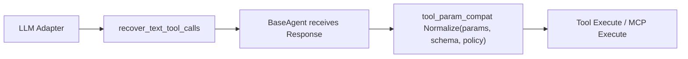

# Tool 参数 Schema 归一化兼容层

**Status**: Implemented Design (2026-05-13), default policy revised 2026-05-14
**Scope**: 兼容所有 OpenAI-compatible 模型在 protocol-level tool-call 参数 JSON 上的机械型错误。文本 tool-call envelope 恢复仍保持 opt-in；schema 参数归一化默认启用安全子集。

---

## 1. 背景

真实日志里出现过两类相近但不同的问题：

- 模型没有返回协议级 `tool_calls`，而是在 assistant 文本里吐出工具调用 JSON。
- 模型已经返回了协议级 `tool_calls`，但 `arguments` 里的字段类型不符合 schema，例如 `read_file.offset` 是字符串 `"146"`，schema 要求 integer；或 `emit_analysis.keywords` 是 `"agent,count"`，schema 要求 `[]string`。

第一类已有 `recover_text_tool_calls` 处理，位置在 LLM adapter 层；它负责把 assistant 文本中的工具调用 envelope 恢复成协议级 tool call，默认关闭。兼容模式还允许一种保守裸参数恢复：当 assistant 文本是完整 JSON 参数对象、没有工具名 envelope、且本轮工具 schema 只有一个唯一匹配项时，恢复成该工具调用；匹配只看 JSON Schema 的 required / properties / nested items.required，不读取用户问题或模型散文语义。第二类不能继续塞进 prompt 或 adapter：adapter 看不到本轮完整工具 schema，也不应该理解 tool 的业务含义；prompt 改动又会影响所有模型的稳定性。

因此新增一个独立的 **schema-aware tool 参数兼容层**，运行在 BaseAgent 收到 LLM response 之后、真正执行 tool 之前。

---

## 2. 设计目标

- **默认安全收益**：未配置时默认开启 `repair` 的 schema-proven 子集，减少所有模型的机械参数返工。
- **显式风险边界**：文本 envelope 恢复仍 opt-in；非完全等价的 delimited string array split 也 opt-in。
- **provider / agent scoped**：通过 `providers.yaml` 随模型路由配置，不靠 prompt 分支。
- **只修机械错误**：只做 schema 可证明的类型归一化，不猜、不补、不删。
- **先审计再修复**：支持 `audit` 模式观测 repairable payload，不改变执行。
- **复用现有 schema**：直接使用工具已经暴露给模型的 JSON Schema，不为单个问题硬编码。
- **fail-loud 配置**：非法 mode 启动时报错，不静默降级成奇怪行为。

非目标：

- 不做完整 JSON Schema validator，已有 tool `Execute` 和各 emit validator 继续负责业务合法性。
- 不修自然语言 prose、不从 content 里猜参数、不填 missing required 字段。
- 不改任何 agent prompt。

---

## 3. 运行位置



两层兼容边界：

| 层 | 配置 | 位置 | 解决的问题 |
|---|---|---|---|
| Text tool-call recovery | `recover_text_tool_calls` | `internal/llm` adapter response parse 后 | assistant 文本中完整工具调用 envelope 没进协议字段 |
| Tool param compatibility | `tool_param_compat` | `internal/agent.BaseAgent` 执行 tool 前 | 协议级 tool call 存在，但参数字段类型机械错误 |

`recover_text_tool_calls` 的裸参数模式有三个硬边界：

- 只在 tool_choice 要求工具、或 named tool_choice 指定具体工具时运行；auto 模式不会把普通 JSON 聊天误判成工具调用。
- 多工具场景必须由 JSON Schema 唯一胜出；例如多个工具都有 `items[]` 时，会继续比较 `items[].required` 和已知字段命中率，不能唯一归属就保留为文本。
- 只恢复完整 JSON 参数对象；不补 required 字段，不按用户问题关键词选择工具，不按模型解释性文字推断工具名。

---

## 4. 配置

```yaml
llm:
  default:
    provider: openai
    model: "local-model"
    recover_text_tool_calls: true
    tool_param_compat:
      mode: repair             # off | audit | repair
      split_string_arrays: false

  agents:
    finalizer:
      tool_param_compat:
        mode: off              # per-agent override
```

字段语义：

- 未配置：runtime 默认注入 `mode: repair` 且 `split_string_arrays: false`。
- `mode: off`：关闭。
- `mode: audit`：识别可修复项并打日志，但把原始参数继续交给 tool。
- `mode: repair`：应用确定性修复，并打 warning 日志。
- `split_string_arrays`：仅当 schema 是 `array` 且 `items.type == string` 时，允许把 `"a,b,c"` / `"a，b"` / 多行文本切成 `[]string`。默认 false，必须显式设为 true；拆分普通字符串不如 JSON-stringified array / scalar parse 那样完全等价。

merge 规则：

- 未配置 `tool_param_compat` 时，CLI runtime 给所有主流水线 agent 注入安全默认 policy。
- `llm.default.tool_param_compat` 可被所有主流水线 agent 继承，并覆盖 runtime 默认 policy。
- `llm.agents.<name>.tool_param_compat` 可覆盖 default。
- `mode: off` 的 agent 不进入 runtime policy map。
- 非法 mode 会在启动时 fail-loud。

---

## 5. 修复规则

所有规则都必须同时满足：

- 原始 `params` 本身是合法 JSON。
- 本轮工具 schema 中存在同名 tool。
- 字段路径能在 schema `properties` / `items` 中找到。
- 转换是确定性的、无业务推断的。

当前规则：

| schema 期待 | 模型给出 | repair |
|---|---|---|
| object | JSON string，内容是 `{...}` | decode 为 object，并递归修内部字段 |
| array | JSON string，内容是 `[...]` | decode 为 array，并递归修 item |
| array of string | 普通分隔字符串 | split 为 `[]string`（默认 runtime 不启用；可显式开启） |
| integer | `"123"` / `"-5"` | parse 为 integer |
| number | `"0.75"` | parse 为 finite number |
| boolean | `"true"` / `"false"` | parse 为 boolean |

明确不做：

- `"one"` → `1`
- `"yes"` → `true`
- 缺 `path` 时猜一个 path
- 删除 unknown 字段
- 根据 enum 做同义词映射
- 根据 tool 名写专用分支

---

## 6. 代码落点

- `internal/types/providers.go`
  - `ToolParamCompatConfig`
  - `ToolParamCompatOff/Audit/Repair`
  - mode 规范化和默认值逻辑
- `internal/config/providers.go`
  - provider merge 支持 `tool_param_compat`
- `cmd/root.go`
  - `resolveToolParamCompatByAgent`
  - 启动时校验配置并派发到 `agent.Dependencies`
- `internal/toolparam/normalize.go`
  - 纯函数 normalizer，输入 raw params + schema + policy，输出 normalized params + report
- `internal/agent/agent.go`
  - `normalizeToolCallParams`
  - 在 LLM response 到 tool execution 之间调用

---

## 7. 质量边界

对模型质量的保护：

- 只在已有协议级 tool call 上运行，不从 prose/thinking 补工具或答案。
- 默认 policy 只启用 schema-proven 等价修复，不启用普通字符串拆数组。
- `audit` 不改变 payload，用于线上观察。
- 只有 `repair` 改写参数，且只在配置 resolver 注入/启用的 agent 上生效。
- schema 缺失、JSON 非法、规则不确定时全部 no-op。
- 修复后再次 `json.Marshal` 并 `json.Valid`，失败则 no-op。

对本地模型兼容性的提升：

- 解决 double-encoded arguments（根对象是 JSON string）。
- 解决本地模型把完整 function-call envelope 当作参数对象发送的情况，例如 `{"name":"emit_analysis","arguments":"{...}"}` 或 `{"function":{"name":"...","arguments":{...}}}`；仅当外层没有 schema 字段、只包含标准 envelope 元数据、且解包后的对象与当前工具 schema 有字段交集时才修复。
- 解决最常见的 `"offset":"146"` / `"limit":"25"`。
- 解决 emit 类工具里的 `[]string` 字段被本地模型写成字符串的问题。
- 与 `recover_text_tool_calls` 组合后，覆盖“文本 envelope 恢复 + 参数类型归一化”的完整链路。

---

## 8. 验证策略

单元测试覆盖：

- provider merge 和 per-agent override。
- config mode fail-loud。
- off / audit / repair 三种模式。
- string scalar → integer / number / boolean。
- JSON-stringified root object / nested array。
- delimited string → `[]string`，以及关闭该规则。
- 不猜、不补、不改 unknown 字段。
- agent 层 copy-on-write，不污染 caller 的原始 `ToolCall` slice。

真实端到端验证建议：

1. 需要排查 provider 参数形态时，可临时开 audit：

   ```yaml
   tool_param_compat:
     mode: audit
   ```

2. 用 debug log 观察 `[tool_param_compat] ... audit repairable`。
3. 默认线上无需配置即可获得安全修复；如需兼容本地小模型的分隔字符串数组，再显式开启：

   ```yaml
   tool_param_compat:
     mode: repair
     split_string_arrays: true
   ```

4. 回归 “系统中有多少个agent？” 等 REPL 问题，重点看 `read_file` slice 参数和 emit 工具数组字段是否进入正常执行链路。
