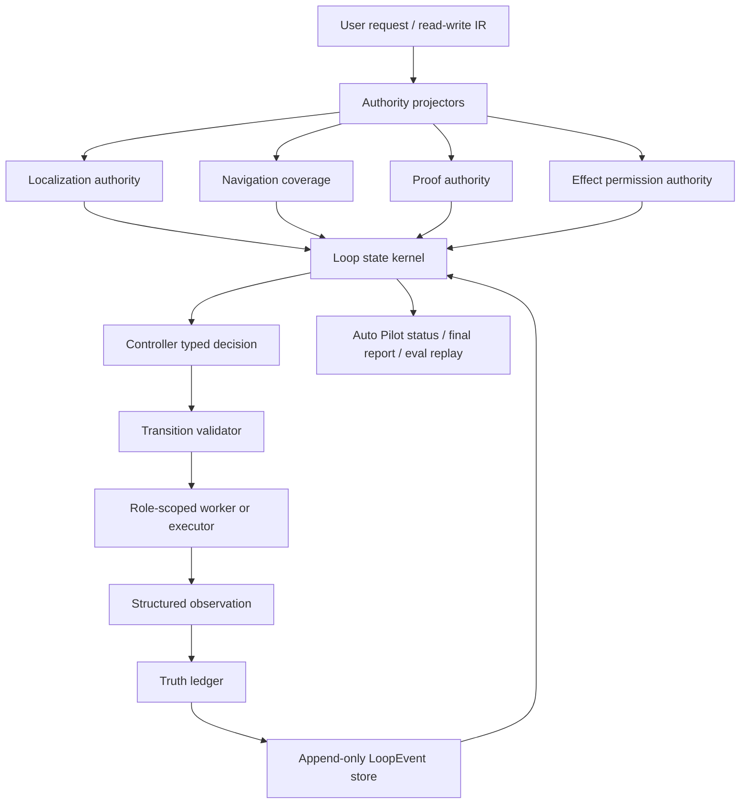
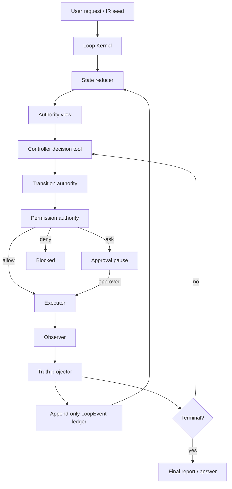
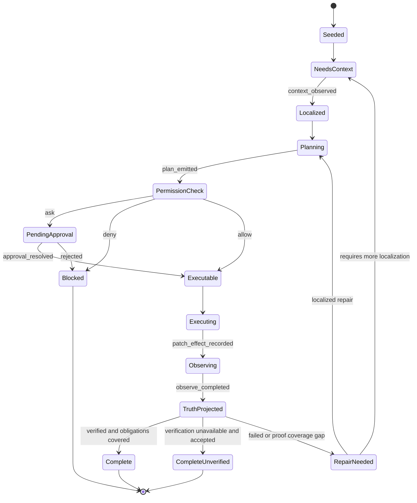

# Codrax Loop Engine 2.0 Architecture And Roadmap

Date: 2026-06-19

Status: project-fit regenerated design ledger, based on `/Users/han/opt/loop_v2.md`, current `main` code audit, SWE/manual-audit gaps, and public agent-system practice.

Audience: Codrax engineering team.

Revision scope:

- This document supersedes the first generic Loop Engine v2 sketch in this file.
- It keeps the parts already proven in `main`: controller-first write mode, typed artifacts, `loopkernel` shadow state, localization/proof authority projections, patch/impact/convention/verification ledgers, and read-mode Analyzer-v3 stability.
- It narrows the next architecture target to the highest-leverage Codrax gaps: shared localization authority, online proof coverage, unified truth ledger, role-scoped permission/effect kernel, evidence-producing workers, typed repo_map navigation coverage, and one Auto Pilot status surface.
- It deliberately avoids fitting individual SWE cases. All hard logic described here consumes typed artifacts only, never user keywords, model rationale, prompt prose, or terminal narrative.

## Executive Summary

Codrax already has many of the right ingredients for a commercial coding agent:

- write mode is controller-first and persists `WriteWorkflowRun`;
- the controller consumes typed `WriteWorkflowDecision`, not model prose;
- risk, approval, observation, patch effect, impact, convention, localization, context pack, and final report artifacts are already typed;
- read mode has an Analyzer-v3 DAG scheduler and repo_map has typed navigation lenses.

The remaining gap is not "add another prompt" or "patch one SWE case". The system still lacks a single execution kernel that makes the agent loop itself deterministic, replayable, and observable at the minimal execution unit.

This project-fit revision proposes **Loop Engine 2.0 as a Codrax state kernel**, not a replacement product:

- a shared state-machine kernel above write/read workflows;
- append-only loop events with deterministic reducers;
- runtime execution units smaller than today's write slices;
- multi-layer truth projection where runtime truth overrides static reasoning;
- role-scoped workers behind one kernel, instead of many autonomous agents competing for control;
- effect-based permission gates that reduce user interruptions while preserving hard safety.

The design intentionally reuses existing Codrax types where possible. It does not preserve legacy write-mode semantics, because write mode has no customer compatibility requirement, but it must preserve read/log/trace/data/operation/computer stability and all documented red lines.

The architecture answer is therefore:

1. Keep `runReadSchedulerLoop` stable and add read authority sidecars first.
2. Keep write mode controller-first, but move the source of truth from batch fields plus mutable bus state toward append-only loop events plus reducers.
3. Promote localization and proof from report/audit fields into scheduling authorities.
4. Wrap patch effect, runtime observation, impact, convention, localization, and proof into one truth ledger instead of creating parallel engines.
5. Replace broad agent freedom with bounded typed actions, role-scoped workers, and effect-level permission.

## 2026-06-20 Project-Fit Regeneration

This section is the refreshed design generated after re-reading `/Users/han/opt/loop_v2.md` and auditing current `main`. The important conclusion is that Codrax should not chase a generic "Claude Code clone". The project already has a controller-first write DAG, typed IR, repo_map navigation facts, context packs, patch/impact/convention/proof artifacts, and a shadow `loopkernel`. The best architecture is therefore an **authority-first online kernel** that promotes the already-typed facts into scheduling authority.

### Loop v2 Requirement To Current Code Mapping

| loop_v2.md requirement | Current Codrax substrate | Remaining architecture gap | Project-fit design decision |
| --- | --- | --- | --- |
| `execute -> observe -> repair` loop | `write_controller_scheduler.go`, `WorkflowExecutionView`, runtime-unit projection, verify/replan actions | Some controller decisions still read workflow fragments rather than one replayed state/truth view. | Drive write next-actions from `LoopStateView + WorkflowExecutionView + TruthLedger`, then keep legacy workflow fields as projections. |
| state machine loop over prompt loop | `ValidateWorkflowTransition`, `loopkernel.ReduceEvents`, typed `WriteWorkflowDecision` | State validation is split between writeflow view, controller normalization, and stage hooks. | Move legal transition checks behind a single kernel validator; controller proposes typed actions only. |
| structured observation | `ObservationAuthorityView`, `VerificationProofLedger`, `ChangeReport`, typed verifier reasons | Observation/proof/impact/critic are not one online terminal authority. | Introduce `TruthLedger` with runtime-failure precedence and unavailable-as-unverified semantics. |
| deterministic replay | `LoopEvent`, reducer, atomic event store, shadow write adapter | Replay is not yet authoritative for full write run reconstruction or eval artifacts. | Make append-only loop events the source of audit/replay, with workflow JSON as denormalized compatibility during migration. |
| bounded action space | controller action enum, plan/apply/verify/replan/split/append, typed plan tools | Worker roles and tool permissions are still partly enforced near individual tools. | Use per-role effect descriptors and shared allow/ask/deny permission decisions for every runtime unit and worker. |
| execution trace as first-class artifact | workflow progress ledger, slice events, loop event refs, final report | Trace is not yet uniformly attached to predictions/final reports. | Persist event refs and truth refs into final reports and SWE/eval predictions. |
| context compression and handoff | `WriteContextPack`, owner anchors, P0-P3 context, navigation coverage | Top-N context is available, but lost proof/localization cause is not always the scheduler authority. | Authority views choose whether to localize/prove/repair; prompts receive only the scoped Top-N view. |
| subagent isolation | `SubAgentRuntime`, scope validation, `SubExplorer` | Evidence-worker set is thin. | Add Localizer/ImpactAnalyzer/PatchCritic/ProofAuditor/FailureAnalyzer as typed evidence producers; mutation remains kernel-owned. |

### Refreshed Architecture Thesis

Codrax Loop Engine 2.0 should be:

1. **Thin model, thick harness**: the model chooses among typed actions; deterministic code validates, gates, executes, observes, and decides terminal states.
2. **Authority-first**: localization, proof coverage, permission, navigation coverage, and truth verdicts are first-class scheduler inputs, not final-report decorations.
3. **Online by runtime unit**: write mode should converge one minimal execution unit at a time, preserving verified independent units and repairing only the failed slice.
4. **Read/write shared where the problem is shared**: owner localization and repo understanding must be shared between read finalization and write planning, because wrong-source patches and evidence-dropping answers have the same root.
5. **Effect-permission kernel**: safety decisions are made from typed effect descriptors, repo-relative paths, parser results, fingerprints, and role profiles; never from prompt text, user keywords, or model rationale.
6. **Replayable commercial audit**: every mutation and terminal answer should have enough typed event/truth refs to audit without re-running tools or LLM calls.

### Current Implementation Status After Audit

| Capability | Current status | Commercial-grade gap |
| --- | --- | --- |
| Loop event reducer | Implemented as shadow state in `internal/loopkernel`. | Needs to become the authoritative run/replay source for write/eval artifacts. |
| Localization authority | Consumed by write controller, planner/replan, final report, and read finalization sidecar. | Needs Localizer worker and broader read scheduler authority consumption without touching L1 scheduler byte identity. |
| Proof authority | Derived from attempts, completion verdicts, proof ledger/profile, impact targets, patch review, and verifier availability. | Needs `TruthLedger` projection so proof, runtime, patch, graph, and convention obligations cannot disagree. |
| repo_map navigation coverage | Typed coverage exists for read/write artifacts and can trigger write/read localizer retries. | Needs workerized graph navigation for impact/proof obligations and eval replay visibility. |
| Runtime unit loop | Runtime-unit authority is projected and consumed by apply/observe/checkpoint policy; verified units can be preserved across replan. | Needs deterministic micro-slice splitter and per-unit event/truth persistence as the primary execution object. |
| Permission/effect kernel | Role/effect profiles, fingerprints, external-dir/git/main-repo/doom-loop decisions exist. | Needs runtime-unit permission events, scoped approval cache, and worker-role envelopes. |
| Subagents/workers | Runtime exists, default worker set is narrow. | Needs typed evidence workers; no autonomous mutating agents. |
| UX | Advanced workflow commands and typed next-action views exist. | Needs one routine Auto Pilot status card that hides command burden unless high-risk/blocked. |

### Updated Target Architecture



### Updated State Machine Contract

The state machine must be interpreted over typed events and authority views:

| State | Entry event/view | Legal next action | Hard authority |
| --- | --- | --- | --- |
| `seeded` | run seed + request IR | context/localize/plan | route enum and write enablement |
| `needs_context` | localization missing, navigation missing, or proof target unresolved | localizer/repo_map/read-only worker | `LocalizationAuthority`, `RepoMapNavigationCoverage` |
| `planning` | owner-supported or budget-accepted context | plan/replan current unit | plan schema and context pack refs |
| `permission_check` | effect described | allow/ask/deny | `EffectDescriptor`, risk policy, fingerprint |
| `pending_approval` | permission ask | approve/reject/resume | approval record + fingerprint |
| `executing` | permission allow | apply bounded unit | checkpoint + active runtime unit |
| `observing` | patch effect recorded | run typed verify/observe | observation report and proof targets |
| `truth_projected` | observation + patch/impact/critic/convention/proof | complete/repair/localize/add proof | `TruthLedger` precedence |
| `repair_needed` | failed/weak truth | repair same unit or split/follow-up | failed unit evidence + P2 handoff |
| `complete_unverified` | unavailable local proof accepted | final report | unavailable typed reason |
| `complete_verified` | proof covered | final report | covered truth ledger |
| `blocked` | deny/budget/safety conflict | stop | typed reason code |

No transition may be driven by model prose, user-text keywords, prompt hints, rendered logs, or `<think>` content. Those can remain visible to users for transparency, but they are not control signals.

### Updated P0/P1 Task Order

The implementation order that best fits current Codrax is:

1. **Finish effect permission kernel**: emit runtime-unit permission events, add approval fingerprint cache, and extend worker-role effect envelopes as L8 lands.
2. **TruthLedger v1**: wrap patch truth, runtime observation, impact obligations, convention hints, localization, and proof into one precedence view.
3. **Deterministic micro-slice splitter**: turn `slice` into minimal runtime units using owner/path/permission/impact coupling.
4. **Evidence workers**: add Localizer, ImpactAnalyzer, PatchCritic, ProofAuditor, FailureAnalyzer as read-only typed artifact producers.
5. **Replay/eval artifacts**: attach loop event refs and truth refs to final reports and SWE predictions.
6. **Auto Pilot status card**: render routine state from `LoopStateView`; keep `/workflow` commands for audit only.

This order keeps stable read/log/trace/data/operation/computer paths protected while landing the highest SWE/manual-audit leverage first.

## Inputs

### Local Inputs

- `/Users/han/opt/loop_v2.md`
- `AGENTS.md`
- `docs/architecture.md`
- `docs/design/write_mode_claude_code_online_convergence_architecture_20260617.md`
- `docs/design/write_mode_root_cause_closure_20260618.md`

### Public Practice Inputs

- Paper: [Dive into Claude Code: The Design Space of Today's and Future AI Agent Systems](https://arxiv.org/abs/2604.14228)
- Claude Code docs: [How Claude Code works](https://code.claude.com/docs/en/how-claude-code-works)
- OpenCode docs: [Permissions](https://opencode.ai/docs/permissions/)
- OpenAI Codex docs: [Agent approvals and security](https://developers.openai.com/codex/agent-approvals-security)

The borrowed ideas are architectural, not surface-copying:

- thin agent loop, thick deterministic harness;
- gather context, act, verify, repeat;
- allow / ask / deny permission lattice;
- sandbox/worktree/checkpoint boundaries;
- append-oriented session storage;
- subagent isolation with constrained tool permissions;
- structured observations instead of free-form narrative as authority.

## Project-Fit Code Audit Map

This table is the current `main` baseline. It is the main reason this design should land as an integration architecture rather than a rewrite.

| Capability | Current code substrate | Current maturity | Project-fit next step |
| --- | --- | --- | --- |
| Read scheduler | `internal/orchestrator/orchestrator.go::runReadSchedulerLoop`, `internal/orchestrator/scheduler.go` | Stable Analyzer-v3 DAG with validation-feedback requeue. Protected by L1 byte-preservation. | Add sidecar authority projection and validation-feedback hooks only after tests prove no scheduler regression. |
| Write controller | `internal/orchestrator/write_controller_scheduler.go` | Canonical controller-first workflow with typed `WriteWorkflowDecision`, transition validation, durable run resume, apply/verify/replan/append. | Consume a richer `LoopStateView` and `TruthLedger` for next-action selection, instead of reading scattered plan/report fields. |
| Workflow state | `internal/types/write_workflow_run.go`, `WriteWorkflowRun`, batches, slices, attempts, progress ledger | Durable enough to resume, but state is denormalized across run JSON, mutable bus state, plans, reports, and worktree artifacts. | Make append-only `LoopEvent` the replay source, then project legacy run fields during migration. |
| Loop substrate | `internal/loopkernel/types.go`, `reducer.go`, `write_adapter.go`, `authority.go` | Shadow event schema, reducer, localization/proof/permission projections already exist. | Promote from shadow projection to scheduler/controller state input; add truth/effect/replay stores. |
| Transition authority | `internal/writeflow/workflow_execution_view.go`, `workflow_transition_validator.go` | Enforced before controller effects; already blocks stale apply/verify and weak localization in typed cases. | Move validation under or behind the loop kernel and expand from batch state to runtime-unit state. |
| Localization | `SourceLocalizationReviewFromTurnA`, `SourceLocalizationReviewFromWritePlanContext`, `loopkernel.DeriveLocalizationAuthority`, final-answer owner anchors | Shared artifact exists and some write/read surfaces consume it, but it is not yet the universal read/write scheduling authority. | Add a read/write `LocalizationAuthority` owner-anchor gate and localizer worker that narrows observed-only or auxiliary-only surfaces. |
| Proof coverage | `ObservationAuthorityView`, `VerificationProofProfile`, `VerificationProofLedger`, `ProofCoverageAuthority`, `WriteFinalReport.ProofLedger` | Available as typed artifacts and partially projected into controller/status; weak proof follow-up is only partially routed. | Derive proof authority from full ledger/profile/impact/patch-review and make low coverage an online next-action signal. |
| Patch truth | `PatchEffectRecordFromUnifiedDiff`, `PatchEffectRecord`, applied-patch scope review | Actual diff truth exists and is used by impact/critic/report. | Make patch truth a mandatory event for every runtime unit and have it override plan claims. |
| Impact analysis | `internal/writeflow/impact`, `ImpactAnalysisResult`, impact obligations and verification targets | Real graph-backed engine exists for changed surfaces, edges, and targets. | Put impact obligations into `TruthLedger` and controller proof/repair queue as first-class obligations. |
| Patch critic | `internal/writeflow/patch_review.go`, `PatchReviewRecord` | Reviews actual diff, impact, scope, convention, semantic coverage. | Treat critic findings as truth/proof obligations, not just report decoration. |
| Convention graph | `internal/types/convention_graph.go`, `internal/writeflow/convention` | Learns and persists local pattern hints; correctly advisory. | Feed Top-N convention hints into planner/critic as P3 soft guidance and never hard-gate on convention alone. |
| repo_map navigation | `RepoMapNavigationPolicy`, repo_map lenses, tool advisories | Good typed soft guidance, but still mostly model-chosen. | Add `NavigationCoverage` authority and scheduler/localizer actions when required lenses are missing. |
| Subagents | `SubAgentRuntime`, `RegisterDefaultSubAgents`, `SubExplorer` | Runtime/scoping/reduction exist; role set is thin. | Add role-scoped evidence workers: Localizer, ImpactAnalyzer, PatchCritic, ProofAuditor, FailureAnalyzer. |
| Permission/risk | `internal/safety/permission.go`, `write_policy.go`, `risk.go`, operation approval ideas | allow/ask/deny lattice and structured policy exist. | Add effect descriptors and per-role tool/effect profiles; record permission events in loop ledger. |
| UX/status | `/workflow show`, `WriteWorkflowNextActionView`, REPL status cards | Advanced commands work; routine path still exposes too much workflow vocabulary. | One Auto Pilot status card from `LoopStateView`, only interrupting for high-risk ask or blocked states. |
| Eval/audit | SWE adapter, final report, event projections | Predictions and reports exist, but manual correctness audit shows localization/proof gaps. | Attach loop/truth refs to predictions and make correctness review replayable without re-running LLM/tools. |

## Project-Fit Architecture Decisions

### ADR-1: State kernel over prompt loop

Codrax should not ask the model to remember when to explore, verify, repair, or finish. The controller can propose typed actions, but legality and terminal state must come from reducers and transition validators.

Why:

- `runReadSchedulerLoop` and `ValidateWorkflowTransition` already prove Codrax can encode workflow control deterministically.
- SWE/manual-audit failures mostly came from wrong localization or weak proof, not from missing prose instructions.
- A state kernel lets REPL, CLI, eval, and final reports consume the same state.

### ADR-2: Sidecar first for read mode

Read mode remains stable. The first read-mode upgrade is a `ReadAuthorityPack` sidecar derived from existing TurnA artifacts, repo_map navigation coverage, log/trace anchors, and final-answer evidence. It should feed validation feedback and final answer rendering, but only after it is tested outside the scheduler loop.

Why:

- L1 says read scheduler stability matters.
- Existing `runReadSchedulerLoop` already supports selective requeue; the missing piece is better typed evidence about what to requeue.
- Sidecar projection avoids destabilizing log/trace/data and answer finalization paths.

### ADR-3: Write mode may be restructured, but not by adding another batch layer

Write mode has no customer compatibility constraint, so it can move from batch/slice to runtime units. The migration should still reuse `WriteWorkflowRun` as the durable envelope until event replay is authoritative.

Why:

- Current write controller already does dynamic DAG and typed actions.
- The remaining risk is blast radius: too many changes before observation.
- Runtime units give Claude-Code-like "edit, observe, repair" without surrendering control to a prompt loop.

### ADR-4: One truth ledger, many truth producers

Patch effect, runtime verify, impact, convention, localization, and proof should not become separate competing engines. They should be producers into `TruthLedger`, with explicit precedence.

Why:

- Codrax already has the typed producers.
- A unified ledger is what lets controller, final report, SWE audit, and user status agree.
- It avoids case-by-case routing from patch critic, impact, or proof modules.

### ADR-5: Per-role permission via effect descriptors

Permissions should be decided over typed effects, not free-form commands or model intent. Role profiles constrain what actions are even possible, and effect descriptors decide allow/ask/deny.

Why:

- OpenCode-style allow/ask/deny maps cleanly to Codrax `safety.PermissionDecision`.
- Approval fatigue drops when low/medium worktree-contained effects auto-run.
- High/critical handling stays deterministic and auditable.

### ADR-6: Subagents are evidence producers, not autonomous writers

Use `SubAgentRuntime` for isolated read-only evidence workers. Mutation remains kernel-owned.

Why:

- The existing runtime already solves scope validation and parallel reduction.
- Autonomous writers would fragment approval, replay, and handoff.
- Evidence workers solve the real gaps: localization, impact, proof, failure analysis.

## Current Codrax Audit

### What Is Already Strong

#### Write Controller

`internal/orchestrator/write_controller_scheduler.go` already establishes the right main direction:

- `runWriteControllerWorkflow` is the canonical write-mode DAG.
- The scheduler routes only on schema-validated controller actions.
- Model prose is not interpreted as routing logic.
- Resume hydration rebuilds retry ledgers, active plans, and verify-failure handoff from durable typed records.
- Verification can run at completion even after step-budget exhaustion, avoiding "applied but never observed" runs.
- `ValidateWorkflowTransition` is enforced before controller effects run.

This is the correct top-level posture. Loop Engine 2.0 should refactor around it, not replace it with a prompt-only loop.

#### Durable Workflow Envelope

`internal/types/write_workflow_run.go` already carries:

- `WriteWorkflowRun`
- `WriteWorkflowBatch`
- `WriteWorkflowSlice`
- `WriteWorkflowAttempt`
- `WriteWorkflowSliceEvent`
- checkpoint and restore metadata
- typed completion verdicts: `verified`, `unverified`, `accepted_failed`

This is close to an event-sourced workflow but not yet a true append-only replay model.

#### Typed Observation Authority

`internal/writeflow/observation_authority.go` is the correct authority shape:

- report/attempt fields decide `verified`, `unverified`, `failed`, or `missing`;
- unavailable local verification downgrades confidence instead of forcing wrong code replan;
- failed code observations require replan;
- finish gating reads typed state only.

This should become one projector inside a broader truth ledger.

#### Permission And Risk

`internal/safety/permission.go` already has the right lattice:

- `allow`
- `ask`
- `deny`

`FoldPermissionDecisions` gives deny priority over ask, and ask priority over allow. `internal/safety/write_policy.go` also extracts structured content signals from JSON/YAML/XML/PEM-like artifacts without reading model/user prose as hard authority.

#### Localization, Context, Patch, Impact, Convention

The following typed artifacts already exist and should be reused:

- `SourceLocalizationReview`: read/write shared source-owner localization evidence.
- `WriteContextPack`: priority handoff with P0-P3 semantics.
- `PatchEffectRecord`: actual diff truth.
- `ImpactAnalysisResult`: changed surfaces, edges, verification targets, obligations.
- `ConventionGraph`: evidence-backed local convention hints, soft only.
- `PatchReviewRecord`: actual-diff review and semantic findings.
- `WriteFinalReport`: typed final delivery artifact.

These are the core "truth ingredients" for Loop Engine 2.0.

#### Repo Understanding

`repo_map` is already a structured navigation index, not a semantic citation source. It exposes navigation lenses such as:

- `overview`
- `file_map`
- `task_map`
- `call_path`
- `edit_impact`
- `semantic_subgraph`
- `relation_map`
- `source_inventory`
- `implementers`

This is the right substrate for read-mode understanding and write-mode localization, but it is still mostly a tool the model chooses. Loop Engine 2.0 should promote it into an authority-producing workflow component.

#### Read Scheduler

`internal/orchestrator/scheduler.go` already has Analyzer-v3 DAG scheduling:

- entry conditions;
- success criteria;
- validation feedback;
- fine-grained requeue of named upstream evidence nodes.

This is valuable and should not be destabilized. Read-mode upgrades should initially be sidecar authorities and structured projectors, not a rewrite of `runReadSchedulerLoop`.

### Main Gaps

#### Gap 1: Workflow State Is Split Across Several Ledgers

Today the write state is spread across:

- `WriteWorkflowRun.ProgressLedger`
- `WriteWorkflowBatch.SliceEvents`
- `WriteWorkflowAttempt`
- plan/report artifacts
- worktree checkpoint metadata
- mutable bus fields

The system can resume, but it does not yet have a single append-only `LoopEvent` ledger plus deterministic reducer that reconstructs the entire runtime view. This makes debugging and eval audit harder than necessary.

#### Gap 2: Slice Is Still Too Large For Claude-Code-like Online Convergence

Current write mode has moved toward online convergence, but the natural execution unit is still a `slice` inside a plan. A slice can include multiple edits and can still defer some observation until too much changed.

For production, the unit of execution should be:

`slice -> micro_slice -> runtime_execution_unit`

Each runtime unit must own:

- exact planned change subset;
- permission envelope;
- worktree checkpoint;
- actual patch effect;
- observation frame;
- truth projection;
- repair/follow-up obligations.

#### Gap 3: Truth Exists But Is Not One Ledger

Patch truth, runtime truth, graph truth, convention truth, localization truth, and proof confidence are implemented as separate artifacts. The controller has to look in several places.

Codrax needs a `TruthLedger` view with precedence rules:

1. runtime failure overrides static reasoning;
2. actual diff overrides plan claims;
3. graph truth creates obligations, not pass/fail by itself;
4. convention truth guides style and critic confidence, never hard gates alone;
5. unavailable local verification produces `unverified`, not fake failure and not fake success.

#### Gap 4: Read And Write Share Artifacts But Not A Common Authority Kernel

`SourceLocalizationReview` is shared, and read mode can produce useful owner anchors. But read mode still largely depends on model tool choice to call `repo_map`, inspect files, and preserve final evidence.

The common system should expose:

- `LocalizationAuthority`
- `RepoUnderstandingAuthority`
- `ProofCoverageAuthority`
- `ContextProjectionAuthority`

Write mode can then consume the same typed owner anchors that read mode uses for grounded answers.

#### Gap 5: Subagent Runtime Is General But Worker Roles Are Thin

`SubAgentRuntime` validates proposals, bounds task count, normalizes scopes, and runs parallel subagents. Currently, the registered implementation set is narrow, and subagents share a read bus. This is useful for exploration, but not yet a full worker model for localization, proof, impact, and failure repair.

The right next step is not many autonomous agents. It is one deterministic loop kernel with role-scoped workers that have constrained inputs, outputs, budgets, and tool permissions.

#### Gap 6: Permission Is Plan/Tool Oriented More Than Effect Oriented

The safety lattice exists. The missing commercial layer is an effect descriptor per runtime unit:

- paths touched;
- file roles;
- commands needed;
- external directories;
- network/dependency/script/workflow/secrets signals;
- approval fingerprint;
- matching cached approval scope.

That enables fewer user interruptions:

- low/medium effects run automatically;
- high effects ask once per fingerprint or safe session scope;
- critical effects deny;
- repeated identical tool/action patterns trigger doom-loop handling.

#### Gap 7: UX Still Exposes Too Many Recovery Concepts

Commands like `/workflow`, `/plan`, `/approve`, `/reject`, `/verify`, `/merge` should remain available for advanced audit/recovery, but normal users should mostly see a single Auto Pilot status card:

- current phase;
- last observation;
- next automatic action;
- whether action is waiting on user approval;
- what was verified or why it is unverified.

The status should be derived from one state view, not assembled independently by CLI/REPL paths.

## Codrax-Specific Landing Priorities

This section is the concrete project fit. It maps the most valuable external practices and the current code audit to P0/P1 implementation decisions.

### P0: Promote Localization To A Shared Scheduling Authority

Current code:

- `SourceLocalizationReviewFromTurnA` derives read-side source/owner anchors from read files and grounded evidence.
- `SourceLocalizationReviewFromWritePlanContext` checks whether write-plan source paths are owner-supported by prior context.
- `WriteContextPack` can carry localization evidence into planner/verifier/controller views.
- `repo_map` can provide typed navigation facts, but the model still often decides whether to call it.

System gap:

Localization is present as handoff/audit, but not yet the shared scheduling authority for read and write.

Target:

Add `LocalizationAuthority` as a typed view consumed by:

- read scheduler sidecar;
- write controller;
- planner and replan prompts;
- final answer/report builders;
- Auto Pilot status card.

Authority states:

| State | Meaning | Next action |
| --- | --- | --- |
| `owner_supported` | target source paths have owner anchors | allow plan/apply/finalize to continue |
| `observed_only` | files were read, but no owner/supporting anchor | trigger narrow localizer before risky edit or low-confidence final answer |
| `auxiliary_only` | tests/docs/logs observed without production owner | trigger repo_map/read localizer |
| `missing` | no source surface found | explore or ask only if typed budgets are exhausted |
| `conflicted` | multiple plausible owners with weak support | split/localize before patching |

Controller policy:

- If a write plan edits a path with `observed_only`, `auxiliary_only`, or `missing` localization and exploration budget remains, schedule `explore_code` or `localize_source` before apply.
- If verify failure points at a new source path, project that path into `LocalizationAuthority` and replan only after localizing the owner boundary.
- If final answer lacks owner-supported source evidence for role-subject questions, read finalization should surface uncertainty or trigger one more narrow evidence pass through existing validation feedback lanes.

This addresses two observed production failure families with one system mechanism:

- read mode final answers losing exploration evidence;
- write mode producing non-empty patches on the wrong source surface.

Hard red line:

Do not infer localization from user keywords or model summaries. The authority consumes only typed paths, evidence refs, source roles, owner symbols, repo_map graph facts, and read/grep/file evidence.

### P0: Make Proof Coverage An Online Controller State

Current code:

- `ObservationAuthorityView` already classifies `verified`, `unverified`, `failed`, and `missing`.
- `ImpactAnalysisResult` emits verification targets and obligations.
- `PatchReviewRecord` and proof-confidence artifacts can detect weak patch/verification alignment.
- `WriteFinalReport` can record verified/unverified outcomes.

System gap:

Proof coverage is still too close to final reporting. It should become a next-action state while the loop still has budget.

Target:

Add `ProofCoverageAuthority` derived from:

- latest `ObservationAuthorityView`;
- `ImpactAnalysisResult.VerificationTargets`;
- patch critic findings over actual diff;
- verification proof/confidence profile;
- runtime unavailable reason codes.

Authority states:

| State | Meaning | Next action |
| --- | --- | --- |
| `covered` | changed behavior has relevant proof | continue/finish |
| `weak` | tests passed but did not cover changed surfaces | add proof unit, targeted verify, or localize before finish |
| `unavailable` | runner/dependency/parser unavailable | mark unverified, do not treat as code failure |
| `failed` | typed build/test/code failure | replan/repair smallest unit |
| `missing` | no observation was attempted | verify before finish |

Controller policy:

- If proof is `weak` and budget remains, prefer proof-seeking actions over finish-with-caveat.
- If proof is `unavailable`, do not replan source code unless patch truth, runtime error locations, or impact evidence indicate code failure.
- If proof is `failed`, repair the minimal runtime unit and carry P2 failure evidence into replan.

Hard red line:

Do not treat "test passed" prose as proof. Only typed package/build/test verdicts and proof targets count.

### P0: Build A Unified Per-Agent Tool And Permission Kernel

Current code:

- `safety.PermissionDecision` already provides `allow / ask / deny`.
- `FoldPermissionDecisions` gives deny priority.
- `write_policy.go` extracts structured high/critical content signals.
- write risk reads typed plan/path/change/IR signals.

System gap:

Permission is not yet a single role-aware event system across controller/planner/coder/verifier/localizer. Some command/tool policies still live near individual tools or stage behavior.

Target:

Add a role-scoped permission kernel:

| Role | Allowed surface | Denied surface |
| --- | --- | --- |
| controller | decision tool, status view | file mutation, free shell |
| localizer | repo_map/read_file/grep/list_files, safe graph views | mutation, unrestricted shell |
| planner/replanner | read-only context, typed plan emit, typed dry-run probes | ordinary `exec_command`, mutation |
| executor | bounded apply/edit in worktree | external directory, main HEAD mutation |
| verifier | typed verify/test/build tools, safe probes | arbitrary edit, unrelated shell |
| proof auditor | read-only artifacts and reports | mutation |

Shared permission events:

- `external_directory`
- `secret_path`
- `dependency_lifecycle`
- `workflow_privilege`
- `network_required`
- `doom_loop`
- `destructive_git`
- `main_branch_mutation`

OpenCode's useful pattern is the allow/ask/deny lattice and per-agent override shape. Codrax should implement it through typed effect descriptors and policy events, not shell-pattern keyword matching as hard logic.

### P1: Upgrade Subagents Into Isolated Evidence Producers

Current code:

- `SubAgentRuntime` validates subtask IDs, registered subagents, scopes, and objectives.
- Orchestrator is the single entry point.
- Parallel execution and reduction already exist.
- Default subagent capability is still narrow.

Target worker set:

| Worker/Subagent | Isolation | Output |
| --- | --- | --- |
| `Localizer` | read-only, scoped | `SourceLocalizationReview` and owner anchors |
| `ImpactAnalyzer` | read-only graph/artifact view | `ImpactAnalysisResult` |
| `PatchCritic` | read-only actual diff/worktree view | `PatchReviewRecord` |
| `ProofAuditor` | read-only reports/tests/impact view | `ProofCoverageAuthority` |
| `FailureAnalyzer` | read-only verifier artifacts | P2 failure handoff and repair source snapshots |

These workers should return typed artifacts and compact evidence refs, not large prose blobs. Mutation remains kernel-owned.

### P1: Make repo_map A Typed Navigation Workflow

Current code:

- `repo_map` supports multiple structured lenses.
- Its tool description correctly states it is navigation fact, not semantic citation.
- `RepoMapNavigationPolicy` exists as soft guidance.

System gap:

When the model does not voluntarily call repo_map, Codrax can still miss owner boundaries and relationship surfaces.

Target:

Promote navigation coverage into typed observable state:

```go
type RepoMapNavigationCoverage struct {
    State          RepoMapNavigationCoverageState
    ReasonCode     string
    RequiredRoutes []RepoMapNavigationRoute
    ObservedRoutes []RepoMapNavigationRoute
    CoveredRoutes  []RepoMapNavigationRoute
    MissingRoutes  []RepoMapNavigationRoute
    EvidenceRefs   []string
}
```

Current landing:

- `repo_map` successful tool results publish typed `repo_map_navigation_route` observations for all views.
- `relation_map` still publishes its graph edge typed rows next to the navigation route row.
- `source_inventory` keeps current-source candidate facts in the existing mutable inventory observation, while ToolResult observations stay in the cross-repo navigation lane and cannot become current-source citations.
- `RepoMapNavigationCoverageFromToolResults` derives covered/missing route state from policy enum steps and typed tool observations only.
- write planner observation sync projects coverage into `WriteContextPack` as P1 context for controller/planner/verifier consumption.

Scheduler/controller use:

- if localization is weak and `relation_map`/`source_inventory`/`implementers` coverage is missing for the typed question shape, schedule localizer;
- if write impact obligations reference dependencies without graph coverage, schedule impact navigation;
- if answer finalization lacks candidate-universe coverage for enumeration questions, requeue evidence node through existing read validation feedback.

Hard red line:

Navigation policy is based on typed question structure, analysis IR, repo graph, and missing coverage enums. It must not match natural-language user keywords directly in runtime hard logic.

### P1: Collapse Routine UX Into One Auto Pilot Status Card

Current code:

- workflow/plan/approve/reject commands exist and are useful for audit.
- write mode already has typed next-action concepts.

System gap:

Routine usage still exposes too many recovery commands and mental models.

Target:

One status view derived from `LoopStateView`:

- what the loop is doing now;
- why it is exploring/replanning/verifying;
- whether user action is required;
- whether the result is verified/unverified/failed;
- what evidence refs back the state.

The message text can be friendly, but the reason must be a typed reason code.

## Loop Engine 2.0 Architecture

### Design Principle

Model reasoning chooses among bounded typed actions. Deterministic kernel code decides whether the action is legal, safe, executable, observed, and terminal.

Hard gates consume only precise typed artifacts:

- enum values;
- booleans;
- fingerprints;
- repo-relative paths;
- parser results;
- structured test/build reports;
- event codes;
- authority verdicts.

No hard gate may consume:

- user intent keyword matches;
- model rationale;
- model summaries;
- progress prose;
- terminal narrative;
- prompt text.

### Tool Schema And Prompt Hygiene

The loop kernel should make model tool calls easier by narrowing schemas and repairing shape errors centrally. It should not move correctness into prompt folklore.

Current substrate:

- `WriteWorkflowDecisionSchema` and `ValidateWriteWorkflowDecision` already define schema-normalized controller actions.
- `toolparam.Normalize` and agent tool-parameter compatibility tests already repair common JSON shape issues from schemas.
- Answer finalization already has structured emit/patch repair paths for `emit_answer_document`.

Target:

- Every new loop/controller/worker tool owns a Go type, JSON schema, normalizer, validator, and focused schema-repair test.
- New prompts describe how to choose among typed actions, but hard routing reads only normalized tool payloads.
- Unsupported or deprecated action aliases are rejected by validator tests, not silently interpreted.
- Planner/replanner/verifier/localizer hints must mention typed artifacts by name and scope, avoiding vague "think harder" instructions.
- Hygiene tests must assert that runtime hard routing does not inspect:
  - raw user request text;
  - model `reason`, `summary`, `rationale`, or `<think>` content;
  - rendered prompt/hint strings.

This keeps user-visible thinking/progress transparent while preserving the system red line: transparency can be rendered, but it cannot become control flow.

### High-Level Diagram



### Layering

| Layer | Responsibility | Model Involvement |
| --- | --- | --- |
| Controller | choose next bounded action from current state view | yes, via typed tool only |
| State Kernel | validate transitions, fold events, derive canonical state | no |
| Permission Authority | allow/ask/deny effect envelope | no, optional auto-review later |
| Executor | apply edit, run command, invoke deterministic worker | no or tightly bounded |
| Observer | collect build/test/probe/static observation | no or tool-backed |
| Truth Projector | convert patch/runtime/graph/convention/proof into typed truth | no |
| Worker | role-scoped analysis or planning output | yes for planner/localizer where needed |
| Renderer | REPL/CLI/user status and final report | no hard routing |

### New Core Data Structures

The v2 schema should live under `internal/loopkernel` and reuse existing type refs instead of duplicating large artifacts.

```go
type LoopRun struct {
    RunID        string
    Mode         string // read, write, verify, eval
    Goal         string
    Status       LoopRunStatus
    ActiveUnitID string
    EventRefs    []string
    Budget       LoopBudget
    CreatedAt    time.Time
    UpdatedAt    time.Time
}

type LoopEvent struct {
    ID           string
    RunID        string
    UnitID       string
    Kind         LoopEventKind
    Source       string
    ReasonCode   string
    ArtifactRefs []ArtifactRef
    Payload      json.RawMessage
    At           time.Time
}

type RuntimeExecutionUnit struct {
    UnitID          string
    ParentBatchID   string
    ParentSliceID   string
    Status          RuntimeUnitStatus
    PlanID          string
    PlanFingerprint string
    ChangeIndexes   []int
    Paths           []string
    EffectRef       string
    PermissionRef   string
    CheckpointRef   string
    PatchEffectRef  string
    ObservationRef  string
    TruthRef        string
    Attempts        []RuntimeUnitAttempt
}

type ObservationFrame struct {
    FrameID          string
    UnitID           string
    ObservationState string // verified, unverified, failed, missing
    ReportRef        string
    PatchEffectRef   string
    ImpactRef        string
    PatchReviewRef   string
    ProofRef         string
    FailureHandoffRef string
    ReasonCode       string
    CreatedAt        time.Time
}

type TruthLedger struct {
    LedgerID       string
    UnitID         string
    PatchTruthRef  string
    RuntimeTruthRef string
    GraphTruthRef  string
    ConventionTruthRef string
    LocalizationTruthRef string
    ProofTruthRef string
    Verdict       TruthVerdict
    ReasonCodes   []string
}
```

### Loop Event Kinds

Required v2 event kinds:

- `run_seeded`
- `context_requested`
- `context_observed`
- `localization_projected`
- `plan_requested`
- `plan_emitted`
- `unit_created`
- `effect_described`
- `permission_decided`
- `approval_requested`
- `approval_resolved`
- `checkpoint_created`
- `unit_apply_started`
- `unit_apply_completed`
- `patch_effect_recorded`
- `observe_started`
- `observe_completed`
- `truth_projected`
- `repair_requested`
- `unit_completed`
- `unit_blocked`
- `run_completed`
- `run_blocked`

Every event is append-only. Existing workflow fields can be denormalized projections, but the event ledger is the source of replay.

### State Machine



State transitions must be validated by typed state and action enums. The current `ValidateWorkflowTransition` should move under the state kernel or be wrapped by it, then expanded from batch-level states to unit-level states.

### Deterministic Replay Model

Replay is mandatory for production debugging and eval.

Implementation:

1. Store `LoopEvent` as JSON artifacts using the existing atomic write patterns used by plan/workflow stores.
2. Reducer sorts events by monotonic event sequence and timestamp tie-break.
3. Reducer reconstructs:
   - active unit;
   - unit statuses;
   - permission state;
   - approval validity;
   - latest patch effect;
   - latest observation;
   - truth verdict;
   - next legal actions.
4. REPL/CLI status renders only reducer output.
5. Eval harness stores event ledger refs next to predictions.

Replay must not call LLM, tools, filesystem mutation, or network. It only folds stored typed events.

## Write Mode Upgrade

### From Slice Batch To Runtime Micro-Loop

Current shape:

`batch -> plan -> slice -> apply -> verify -> replan`

Target shape:

`batch -> slice -> micro_slice -> runtime_execution_unit -> apply -> observe -> truth -> repair/next`

`slice` remains useful as a planning group. `micro_slice` is the deterministic split that bounds blast radius. `runtime_execution_unit` is the executable object.

### Micro-Slice Rules

The splitter should be deterministic and conservative:

- one file or one tightly coupled owner group when possible;
- keep generated test + source pair together if the plan marks them as one behavior unit;
- keep public API change + required call-site updates together only when impact graph marks the call sites as mandatory;
- do not cross permission classes in one unit;
- do not mix high-risk config/workflow/dependency edits with ordinary source edits;
- cap unit size by changed paths, hunks, and estimated verification scope.

### Runtime Unit Loop

```go
for !state.Terminal() {
    view := kernel.DeriveStateView(events)
    decision := controller.Decide(view) // typed tool output

    checked := kernel.ValidateTransition(view, decision)
    if !checked.Allowed {
        events.Append(TransitionRejected(checked))
        continue
    }

    effect := effects.Describe(decision, view)
    permission := permissions.Decide(effect)
    events.Append(PermissionDecided(permission))

    switch permission.Action {
    case allow:
        executor.Apply(effect)
    case ask:
        pauseForApproval()
    case deny:
        block()
    }

    patch := patchtruth.RecordActualDiff(effect)
    observation := observer.Observe(patch, view)
    truth := truth.Project(patch, observation, view)

    events.Append(PatchEffectRecorded(patch))
    events.Append(ObservationCompleted(observation))
    events.Append(TruthProjected(truth))
}
```

The code above is illustrative. The production implementation should use existing orchestrator stores, writeflow types, and tool registries rather than adding a parallel application stack.

### Avoiding Batch Failure Explosion

Failure containment policy:

- A failed unit only invalidates dependent units, not the whole batch.
- Independent completed units remain checkpointed.
- Repair plans receive:
  - failed unit patch effect;
  - verifier failure locations;
  - impact obligations;
  - source localization anchors;
  - convention hints as P3 only.
- Replan must target the failed unit or explicitly append a dependent unit.

### Avoiding Stale Plan Execution

Every runtime unit must bind:

- `PlanFingerprint`
- selected change indexes;
- base worktree ref;
- active checkpoint ref;
- permission fingerprint;
- expected path set;
- dependency unit IDs.

Before apply:

- plan fingerprint must still match;
- worktree base must match or be a known checkpoint descendant;
- dependent unit truth must not be failed;
- approval fingerprint must match the effect envelope.

### Avoiding Over-Approval

Approval should move from plan-level to effect-level:

- low/medium source edits in isolated worktree auto-allow;
- high-risk effect asks once per fingerprint;
- critical effect denies automatically;
- repeated equivalent high-risk effect can reuse approval within run/session if fingerprint and scope match;
- approval asks display effect summary, not raw plan prose.

## Read Mode Enhancement

Read mode is stable and protected by L1. Loop Engine 2.0 should improve it through sidecar authorities first.

### Repo Understanding Engine

Add a `ReadAuthorityPack` sidecar produced during analysis/exploration:

```go
type ReadAuthorityPack struct {
    RunID             string
    Localization      *types.SourceLocalizationReview
    RepoUnderstanding *RepoUnderstandingView
    ImpactNavigation  *types.ImpactAnalysisResult
    ConventionGraph   *types.ConventionGraph
    ProofCoverage     *types.VerificationProofProfile
    ContextPacks      []types.WriteContextPack
}
```

The name can change, but the contract should stay:

- it is typed;
- it is persisted;
- it is advisory except where a precise authority already exists;
- final answer rendering can consume it but cannot cite it as source behavior unless backed by code evidence.

### Trace/Log + Code Unified Reasoning

Trace/log artifacts should become first-class evidence carriers:

- runtime artifact path and line/offset;
- parsed error code, file path, line number, symbol if available;
- source owner anchor found from the code graph;
- handoff item priority.

The model may explain the symptom, but source localization must come from typed file/path/symbol/evidence anchors.

### Impact-Aware Retrieval

Read mode should use graph views to decide where to inspect next:

- `repo_map(edit_impact)` for "what changes affect this";
- `repo_map(relation_map)` for selected source surfaces;
- `repo_map(call_path)` for concrete execution path questions;
- `repo_map(implementers)` for interface/trait/protocol families;
- `repo_map(source_inventory)` for scoped member inventories.

This should be compiled into soft navigation policy from `AnalysisIR`, not left entirely to prompt memory. Hard answer claims still require `read_file`, grep evidence, or typed aggregate facts.

### Convention-Aware Retrieval

Convention graph in read mode should answer:

- how similar code is organized;
- where tests usually live;
- how registration/dispatch patterns are wired;
- which local mechanisms are repeated.

It must remain soft:

- conventions can propose files to inspect;
- conventions can explain confidence;
- conventions cannot prove code behavior without evidence.

### Grounding Strategy

Final answers must preserve rich exploration information through:

- priority context packs;
- source localization anchors;
- evidence refs;
- aggregate facts;
- answer document blocks.

The answer generator should consume Top-N typed views, but the full evidence pack should stay persisted for audit.

## Multi-Layer Truth System

### Truth Layers

| Layer | Existing substrate | Authority role |
| --- | --- | --- |
| Patch truth | `PatchEffectRecord` | actual diff facts override plan claims |
| Runtime truth | `ChangeReport`, `ObservationAuthorityView` | tests/build/probes decide verified/failed/unverified |
| Graph truth | repo_map graph, `ImpactAnalysisResult` | creates obligations and retrieval targets |
| Convention truth | `ConventionGraph` | soft local-pattern guidance and critic confidence |
| Localization truth | `SourceLocalizationReview` | owner/path coverage for read and write |
| Proof truth | verification proof/confidence records | says whether verification covered changed behavior |

### Precedence

1. Runtime failed with typed code/test reason means repair is required.
2. Runtime unavailable means proof is downgraded to `unverified`; it must not cause source replan unless patch/impact/proof evidence also points to code failure.
3. Actual patch effect is the source of changed paths, hunks, and effect events after apply.
4. Plan claims are only intent before apply.
5. Graph impact can require more tests or inspection, but it cannot alone say a patch is wrong.
6. Convention mismatch is advisory unless paired with concrete broken behavior or forbidden policy.

### Truth Projection Contract

Every applied runtime unit must produce an `ObservationFrame` and `TruthLedger`. Missing proof is a typed state, not a hidden footnote.

Expected controller actions from truth:

- `verified`: finish unit or continue next unit;
- `unverified`: finish only through explicit unverified lane or add proof-seeking unit;
- `failed`: repair/replan/explore;
- `coverage_gap`: add proof/impact unit;
- `localization_gap`: explore/localize before editing more;
- `policy_block`: block or ask based on permission action.

## Worker And SubAgent Model

### Decision

Use **single execution kernel + role-scoped workers**.

Do not create many autonomous top-level agents with independent control loops.

### Why

Multiple autonomous agents are flexible but make it harder to guarantee:

- deterministic replay;
- single source of approval truth;
- bounded tool permissions;
- handoff completeness;
- no prompt/prose hard routing;
- no duplicate incompatible actions.

Role-scoped workers give most of the benefit with less coordination risk.

### Worker Roles

| Worker | Type | Writes files? | Main output |
| --- | --- | --- | --- |
| Controller | LLM + typed decision tool | no | next bounded action |
| Localizer | LLM/tool + deterministic projector | no | `SourceLocalizationReview`, owner anchors |
| Planner | LLM + plan tool | no | bounded `ChangePlan` |
| Micro-splitter | deterministic | no | runtime units |
| Permission authority | deterministic | no | `PermissionDecision` |
| Patch executor | deterministic tool path | yes, worktree only | applied diff/checkpoint |
| Observer/verifier | deterministic tool path with optional model summary | no source writes | `ChangeReport` |
| Failure analyzer | LLM/tool, bounded | no | failure handoff and repair hints |
| Impact projector | deterministic | no | `ImpactAnalysisResult` |
| Patch critic | deterministic + optional reviewer | no | `PatchReviewRecord` |
| Convention learner | deterministic projector | no | `ConventionGraph` |

Subagents remain useful for parallel read-only exploration and localizer/failure-analysis branches. They should not own mutation. Mutation belongs to the kernel-controlled executor.

## Permission And Safety Model

### Effect Descriptor

```go
type EffectDescriptor struct {
    EffectID       string
    UnitID         string
    Kind           string // edit, command, dependency, workflow, external_path
    Paths          []EffectPath
    Commands       []CommandIntent
    ContentSignals []safety.WriteContentSignal
    ExternalPaths  []string
    NetworkAccess  bool
    RiskLevel      string
    Fingerprint    string
}
```

### Mapping To allow / ask / deny

| Effect | Default |
| --- | --- |
| read-only repo exploration | allow |
| repo_map/read_file/grep inside active repo | allow |
| ordinary source/test edit in isolated worktree | allow for low/medium |
| generated lockfile/dependency manifest edit | ask or deny based on structured parser signals |
| workflow/CI permission escalation | deny if critical, ask if high |
| secret material in change | deny |
| external directory edit | deny unless explicit configured trust scope |
| repeated identical failed action | ask, then block by budget |
| destructive git/main-branch mutation | deny in Auto Pilot |

This aligns with OpenCode-style allow/ask/deny and Codex-style sandbox/approval separation, while retaining Codrax's typed policy red line.

### Approval Fatigue Reduction

Default user path:

- no prompt for low/medium worktree-contained edits;
- no prompt for read-only exploration;
- no prompt for local verification commands that match known safe runners;
- one prompt for high-risk effect fingerprint;
- critical denial is automatic and explanatory;
- `/approve` and `/reject` remain advanced recovery commands.

## UX Model

Routine REPL/CLI should show one status card derived from `LoopStateView`:

```text
Auto Pilot
State: observing unit 3/8
Last: tests passed for parser error path
Next: apply low-risk source edit in src/foo.ts
Verification: 2 units verified, 1 unverified because pytest missing
Action needed: none
```

If user action is required:

```text
Auto Pilot paused
Reason: high-risk dependency lifecycle script
Effect: package.json scripts.postinstall changed
Options: approve once, reject
```

Advanced commands stay:

- `/workflow show|list|resume|clear`
- `/plan show|list`
- `/approve`
- `/reject`
- `/verify`
- `/merge`

But the normal path should not require knowing these commands.

## Module Breakdown

### `internal/loopkernel`

Responsibilities:

- `LoopEvent` schema;
- event store interface;
- deterministic reducer;
- state machine;
- transition validator;
- `LoopStateView`;
- replay command helpers.

### `internal/loopkernel/writeadapter`

Responsibilities:

- map current `WriteWorkflowRun` to `LoopRun`;
- emit loop events from current workflow transitions;
- project loop state back to workflow batch/slice fields during migration;
- preserve current write stores until event ledger is authoritative.

### `internal/loopkernel/readadapter`

Responsibilities:

- produce read-side authority pack from current read artifacts;
- do not mutate `runReadSchedulerLoop` in Phase 1;
- expose localization/repo-understanding/proof views to final answer and write handoff.

### `internal/truth`

Responsibilities:

- patch truth projector;
- runtime truth projector;
- graph truth projector;
- convention truth projector;
- localization truth projector;
- proof truth projector;
- `TruthLedger` merge/precedence rules.

Existing `internal/writeflow` projectors can move gradually or be wrapped first.

### `internal/effect`

Responsibilities:

- effect descriptor construction;
- plan-to-unit effect mapping;
- command intent classification;
- worktree boundary/path resolver;
- fingerprinting.

This should reuse `internal/safety` and existing write policy logic.

### `internal/worker`

Responsibilities:

- role-scoped worker contracts;
- tool permission profiles by role;
- worker result normalization;
- worker budgets.

Subagent runtime can remain under `internal/agent`; this package can provide typed worker contracts consumed by orchestrator.

### `internal/ui/status`

Responsibilities:

- status-card view model from `LoopStateView`;
- REPL/CLI rendering;
- no routing logic.

## Detailed Delivery Task Ledger

The implementation must move in small commercial batches. Each batch updates this ledger before commit/push.

### Regenerated Project-Fit Delivery Roadmap

The table below is the active roadmap after re-reading `/Users/han/opt/loop_v2.md` and auditing current `main`. It supersedes a generic phase order. Earlier completed batches remain valid history, but new implementation should follow this order because it fixes the root gaps observed in SWE/manual audits first.

| Order | Priority | Batch | Why this comes now | Concrete deliverable |
| --- | --- | --- | --- | --- |
| 1 | P0 | Proof authority completion | Current code can report proof, but weak/local-unavailable proof is not yet consistently a controller state. | Full proof authority synthesis from `ObservationAuthorityView`, `VerificationProofLedger`, `VerificationProofProfile`, impact targets, and patch review; weak proof routes to proof-seeking next action when budget remains. |
| 2 | P0 | Shared localization authority v2 | Wrong-source patches and read final-answer evidence loss have the same root: owner localization is not yet a scheduling authority everywhere. | Read/write shared `LocalizationAuthority` with owner anchors, localizer worker, repo_map/read fallback, and final answer/report consumption. |
| 3 | P0 | Truth ledger v1 | Patch/observe/impact/critic/convention/proof exist but controller still assembles meaning from scattered artifacts. | `TruthLedger` schema and projector wrapping existing artifacts, with runtime-failure precedence and unavailable-as-unverified semantics. |
| 4 | P0 | Effect permission kernel | Existing allow/ask/deny policy is strong but not yet role/effect-native. | `EffectDescriptor`, per-role permission profiles, approval fingerprint reuse, external-directory and doom-loop events. |
| 5 | P0 | Runtime micro-unit loop | Batch/slice units are still too large for online convergence. | Deterministic micro-slice splitter, unit checkpoint, unit apply, unit observe, unit truth projection, failure containment. |
| 6 | P1 | repo_map navigation coverage | repo_map usage is still mostly prompt-guided. | `NavigationCoverage` authority from typed IR/lenses and scheduler/localizer triggers for missing required coverage. |
| 7 | P1 | Evidence workers | Subagent runtime exists but evidence roles are thin. | Localizer, ImpactAnalyzer, PatchCritic, ProofAuditor, FailureAnalyzer workers with typed artifacts only. |
| 8 | P1 | Auto Pilot status | Routine UX still exposes too many commands. | One status card from `LoopStateView`, advanced commands kept for audit. |
| 9 | P1 | Replay/eval hardening | SWE/manual audit needs replayable correctness evidence. | Event/truth refs in predictions/final reports, replay CLI, multi-language canaries, full regression. |

### Root-Gap To Module Mapping

| Observed gap | System fix | Primary modules | Tests |
| --- | --- | --- | --- |
| Non-empty SWE patches on wrong source surface | Owner localization authority before planning/apply/replan | `types.SourceLocalizationReview`, `loopkernel`, `writeflow`, read authority sidecar, localizer worker | read role-subject, write plan localization, SWE localization canaries |
| Verify passed but proof too narrow | Online proof coverage and truth obligations | `types.VerificationProofLedger`, `loopkernel`, `writeflow`, controller proof queue | passed-but-weak, unavailable, failed, missing proof |
| Final answer drops exploration richness | Persisted priority authority/context projection into finalizer | `AnswerDocumentV2`, `WriteContextPack`, read authority pack | final-answer handoff retention |
| repo_map not chosen when needed | Navigation coverage state and localizer trigger | `RepoMapNavigationPolicy`, repo_map lenses, read/write scheduler sidecars | navigation missing-lens tests |
| Planner/verifier tool freedom too broad | Role-scoped permission/effect kernel | `internal/safety`, `writeflow`, tool registries | planner no unrestricted shell, verifier typed probes |
| Patch critic/impact/convention not decisive enough | Truth ledger obligations with precedence | `writeflow/patch_review`, `writeflow/impact`, `writeflow/convention`, `truth` | critic/impact obligation routing |
| Too many routine commands | Auto Pilot status from one state view | `loopkernel`, REPL/CLI status renderers | paused/running/unverified/blocked cards |
| Eval audit hard to reproduce | Replayable event/truth artifacts | `loopkernel/store`, final reports, SWE adapter | replay idempotence, prediction artifact refs |

| Batch | Status | Scope | Deliverables | Verification |
| --- | --- | --- | --- | --- |
| L0 | complete | Design ledger and task breakdown | This document, P0/P1 mapping, batch checklist, progress ledger | `git diff --check` |
| L1 | complete | Loop kernel skeleton | `internal/loopkernel` event schema, reducer, typed authority projections, atomic event persistence | focused `go test ./internal/loopkernel` |
| L2 | complete | Shadow write adapter | emit loop events from current write controller without changing effects; reducer parity with `WriteWorkflowRun` | loopkernel/repl focused tests |
| L3 | complete | Localization authority consumption | shared `LocalizationAuthority` consumed by read sidecar, write controller, planner/replan, final report | read/write localization tests |
| L4 | complete | Proof coverage online state | `ProofCoverageAuthority` enters controller next-action; weak proof seeks proof while budget remains; unavailable stays unverified | proof/observation/controller tests |
| L5 | complete | Role-scoped permission kernel | per-role tool/effect permission profiles; external directory and doom-loop events unified | safety/writeflow/tool tests |
| L6 | complete | Typed navigation workflow | repo_map navigation coverage from IR and graph lenses; localizer scheduling on missing coverage | repo_map/read scheduler tests |
| L7 | complete | Micro-loop execution | deterministic runtime-unit authority projection consumed by apply/observe/checkpoint policy, with verified-unit preservation across replan | writeflow/orchestrator runtime-unit tests |
| L8 | complete | Worker/subagent evidence producers | Localizer, ImpactAnalyzer, PatchCritic, ProofAuditor, FailureAnalyzer typed outputs | subagent/worker tests |
| L9 | pending | Auto Pilot UX | single status card from `LoopStateView`; routine path avoids command burden | REPL/CLI rendering tests |
| L10 | pending | Commercial hardening | replay CLI/eval artifacts, SWE smoke, multi-language canaries, full regression | `go test ./...`, `make test`, eval smoke |

### L1 Task Breakdown

- [x] Add `LoopRun`, `LoopEvent`, `LoopStateView`, and runtime-unit status enums.
- [x] Add deterministic event normalization and reducer.
- [x] Add `LocalizationAuthorityView` projection from `SourceLocalizationReview`.
- [x] Add `ProofCoverageAuthorityView` projection from existing verification proof types.
- [x] Add `PermissionAuthorityView` projection from `safety.PermissionDecision`.
- [x] Add atomic JSON event persistence using existing `types.AtomicWriteFileSync`.
- [x] Add reducer/store/authority tests.
- [x] Update stale comments that contradict current enforcement.

### L2 Task Breakdown

- [x] Add write adapter that projects `WriteWorkflowRun` fields into shadow `LoopEvent` records.
- [x] Persist shadow events beside workflow run artifacts.
- [x] Add parity tests for planned, pending approval, applying, verifying, unverified complete, and blocked states.
- [x] Keep scheduler effects unchanged in this batch.

### L3 Task Breakdown

- [x] Project `WriteContextPack` localization anchors into `LocalizationAuthority` loop events.
- [x] Persist the projected localization authority in shadow workflow loop event artifacts.
- [x] Render `LocalizationAuthority` in `/workflow show` and the running next-action card from typed reason codes.
- [x] Add `LocalizationAuthority` consumer to write controller state view.
- [x] Redirect first ready-to-plan/replan transition with weak production-source localization to `explore_code` using typed candidate paths and owner-evidence requirements; analyzer scope/expected paths remain advisory unless a read/evidence anchor makes the localization gate eligible.
- [x] Extend auxiliary-only/no-signal/missing localization handling beyond explicit production batch expected paths and context-pack evidence: no-signal active batches project typed `missing` authority for audit, auxiliary/missing remain soft guidance, and no-candidate missing never becomes a hard planning gate.
- [x] Add read sidecar projection from TurnA artifacts into the final `AnswerDocumentV2` artifact without rewriting the read scheduler loop.
- [x] Render read-mode localization authority/status supplements from typed final-answer artifacts, including observed-only status without pretending it is owner proof.
- [x] Feed owner-supported Top-N anchors into planner/replan/write final report via existing context-pack owner views and `WriteFinalReport.SourceAuthority`.
- [x] Add tests proving model prose cannot bypass typed localization hard routing.

### L4 Task Breakdown

- [x] Add shared typed reason-code classification for code-failure vs verifier-unavailable states so proof/observation consumers do not duplicate string logic.
- [x] Derive `ProofCoverageAuthority` from durable write verify attempts and completion verdicts, in addition to existing proof profile/ledger projections.
- [x] Persist/project active proof authority into loop events and `WorkflowExecutionView`.
- [x] Render proof authority in `/workflow show` from typed loop state, including unavailable local verification without implying code repair.
- [x] Feed `VerificationProofLedger` uncovered obligations with typed path/symbol/contract refs into the existing controller proof/impact follow-up queue so new proof obligation kinds can trigger bounded proof batches without new dispatch machinery.
- [x] Render completed unverified workflows with the unverified status card and explicit verify/skip-verify guidance instead of the verified/applied card.
- [x] Derive proof authority from full verification proof ledger, impact targets, patch review, verification confidence, and latest verify attempt inside controller state.
- [x] Preserve existing controller proof/impact follow-up routing while feeding it stronger proof authority; weak proof with actionable typed refs remains routed through the bounded follow-up queue.
- [x] Preserve unavailable runner/dependency states as `unverified` through proof authority synthesis instead of turning weak obligations into source repair.
- [x] Add tests for passed-but-weak, unavailable, failed, missing, planner-probe ignored, and budget-exhausted proof states across authority/view/transition decisions.

### L5 Task Breakdown

- [x] Introduce typed `EffectDescriptor`, stable effect fingerprinting, and built-in per-role permission profiles.
- [x] Move external-directory, git metadata, main-repo mutation, and doom-loop observations into shared effect permission decisions.
- [x] Add loop-kernel projection from typed effects into the existing permission authority view.
- [x] Put the write planner's blocked tool surface behind the shared role/effect profile while preserving existing typed repair codes.
- [x] Move verifier default-`run_tests` parameter policy behind the shared effect profile without weakening the current schema restriction.
- [x] Emit/persist permission events for runtime-unit effect descriptions, not just final plan approval.
- [x] Cache high-risk approvals by effect fingerprint and scope.
- [x] Add effect-profile coverage for worker roles as L8 workers land.

### L6 Task Breakdown

- [x] Add `RepoMapNavigationCoverage` over repo_map routes.
- [x] Publish typed repo_map navigation-route observations for successful tool calls.
- [x] Derive covered/missing route state from typed policy steps and typed observations.
- [x] Project navigation coverage into write context pack as P1 controller/planner/verifier context.
- [x] Persist navigation coverage as typed `WriteContextItem.NavigationCoverage` and surface it on `WorkflowExecutionView`.
- [x] Route write controller transitions to bounded `explore_code` when typed navigation coverage is partial/missing while localization still needs owner context.
- [x] Stamp read-mode `AnswerDocumentV2.ReadNavigationCoverage` from `AnalysisIR` + TurnA typed `ToolResult` observations, preserving it across patch retries.
- [x] Render read-side navigation coverage as a final supplement while keeping repo_map as navigation fact, not semantic citation.
- [x] Compile additional required lenses from typed localization gaps beyond the initial analysis policy.
- [x] Trigger write controller localizer exploration from typed missing navigation coverage before asking the user or planning.
- [x] Trigger read scheduler localizer retry from typed localization/navigation floor without rewriting `runReadSchedulerLoop`.
- [x] Trigger write impact-navigation workers when proof/impact obligations require graph coverage.
- Keep repo_map as navigation fact, never semantic citation.

### L7 Task Breakdown

- [x] Project plan/workflow slices into `RuntimeUnitView` by path, owner anchor, permission class, and impact dependency.
- [x] Surface active runtime unit and unit ledger from `WorkflowExecutionView` for controller/UX/eval consumers.
- [x] Record patch truth, patch review, observation, approval, impact, and checkpoint/restore projections per unit.
- [x] Make controller transitions consume `RuntimeUnitView` as the first-class apply/observe/checkpoint authority for apply scope, observe preconditions, post-apply recovery, and next-unit selection.
- [x] Preserve verified independent units on failure through unit-level stale-plan and dependency guards.
- [x] Add write E2E coverage for multi-unit edit/run/observe with one failed later unit and preserved earlier unit.

### L8 Task Breakdown

- [x] Define scoped read-only evidence worker contracts.
- [x] Return typed artifact refs and compact evidence refs only.
- [x] Keep mutation kernel-owned through shared effect-profile validation.
- [x] Add worker budgets, scope validation, and contract tests.
- [x] Add concrete deterministic Localizer producer with read/write input adapters.
- [x] Add concrete ImpactAnalyzer / PatchCritic / ProofAuditor / FailureAnalyzer typed artifact producers.
- [x] Add focused worker reduction/normalization tests for each producer.

### L9 Task Breakdown

- Render one Auto Pilot state card from `LoopStateView`.
- Hide advanced commands from routine path while keeping them available for audit.
- Explain next action and pause reasons from typed reason codes.

### L10 Task Breakdown

- Add replay/audit command.
- Attach loop event refs/truth refs to eval predictions and final reports.
- Run full Go tests, Make tests, SWE prediction harness smoke, and multi-language canaries.
- Update docs and examples.

### Remaining Implementation Backlog

The remaining work must land as small batches. Each batch below has a typed artifact, deterministic owner, acceptance gate, and regression scope. Hard routing remains forbidden from reading user-keyword matches, model rationale, prompt text, or rendered progress prose.

| Batch | Priority | Detailed implementation plan | Primary files/modules | Acceptance and tests |
| --- | --- | --- | --- | --- |
| L5.1 | P0 | Finish shared `run_tests` effect parameter authority. Convert planner/verifier `run_tests` parameter shapes into `safety.RunTestsEffectDescriptor`, let `DecideEffectPermission` return role-specific allow/deny reason codes, and keep agent repair output as a schema-repair mapping layer only. | `internal/safety/effect.go`, `internal/agent/agent.go`, `internal/safety/effect_test.go`, `internal/agent/agent_tool_context_test.go` | Verifier accepts only `{}`/empty params; verifier explicit selectors deny; planner allows only `dry_run + verification_probe`; focused safety/agent tests pass. |
| L5.2 | P0 | Persist runtime-unit permission events. For each active runtime unit, emit `effect_described` and `permission_decided` loop events with effect fingerprint, paths, role, action, and reason code. Project those events back into `LoopStateView.Permission`; pending workflow approval still appends a stronger ask event. | `internal/loopkernel`, `internal/safety`, workflow event store | Every mutation-capable unit has an effect and permission event before apply; replay reconstructs permission state; no prompt/prose hard routing; loopkernel/safety/repl tests pass. |
| L5.3 | P0 | Add scoped approval reuse. Bind approval records to plan fingerprint, normalized effect fingerprint, and runtime-unit scope. Reuse only when plan bytes and effect scope match; changed plan/path/unit asks again. Critical deny never caches as allow. | `internal/types` approval records, `internal/writeflow` effect binding, write controller/REPL approval paths | High-risk duplicate effect in the same scoped run resumes without another prompt; changed path/unit/content asks again; critical still denies; approval resume tests pass. |
| L8.1 | P1 | Define worker contracts without introducing autonomous mutation. Add typed `WorkerRequest`, `WorkerResult`, role enum reuse, input artifact refs, output artifact refs, budgets, and scope validation. | new `internal/worker` or existing `internal/agent/subagent*`, `internal/types` | Worker schema tests prove outputs are typed artifacts; mutation roles are denied by effect policy; no write effects in read-only workers. |
| L8.2 | P1 | Implement Localizer worker. It consumes `LocalizationAuthority`, `RepoMapNavigationCoverage`, read/file evidence refs, and candidate paths, then returns `SourceLocalizationReview` with owner anchors and compact evidence refs. | `internal/agent/subagent*`, `internal/types/source_localization_review.go`, write/read adapters | Observed-only or auxiliary-only gaps can produce owner-supported anchors; no user-keyword routing; read/write localization tests pass. |
| L8.3 | P1 | Implement ImpactAnalyzer, PatchCritic, ProofAuditor, and FailureAnalyzer workers as evidence producers. Reuse existing impact/patch-review/proof/failure projectors; workers coordinate scope and budgets, not new business logic. | `internal/writeflow/impact`, `internal/writeflow/patch_review*`, proof/failure handoff code, worker contracts | Workers return existing typed artifacts; controller consumes artifact refs; mutation remains kernel-owned; focused worker/writeflow tests pass. |
| L3T.1 | P0 | Add `TruthLedger` v1 schema and projector. Merge patch truth, runtime observation, impact obligations, convention hints, localization, and proof into one precedence view. Runtime failed overrides static; unavailable becomes unverified; actual diff overrides plan claims; convention remains soft. | new `internal/truth` plus schemas in `internal/types`, adapters from `writeflow` artifacts | Truth precedence tests cover failed/weak/unavailable/covered cases; controller and final report can read a single truth view. |
| L3T.2 | P0 | **Delivered 2026-06-20.** Wire truth obligations into controller next-action. If truth is failed, repair smallest unit; if weak and budget remains, seek proof; if unavailable, finish unverified or continue without source replan; if localization gap, localize before further edits. | write controller normalization, transition validator, final report | Verify-passed but weak proof no longer silently finishes when actionable proof remains; unavailable pytest/deps do not trigger blind source replan. |
| L7.1 | P0 | **Delivered 2026-06-20.** Add deterministic micro-slice splitter beyond current runtime-unit projection. Split by owner path, permission class, impact dependency, and verification coupling. Avoid crossing high-risk and ordinary source edits in one unit. | `internal/writeflow` slice/runtime unit code, plan validation | Multi-file plans become bounded units; unit size caps and dependency preservation tests pass. |
| L7.2 | P0 | **Delivered 2026-06-20.** Make runtime unit event/truth persistence authoritative. Workflow batch/slice fields become projections from events for write mode; replay can recover active unit, permission, checkpoint, observation, truth, and terminal state. | `internal/loopkernel`, workflow store, write adapter | Replay idempotence tests pass; restart/resume preserves pending approval and failed-unit state. |
| L9.1 | P1 | Render one Auto Pilot status card from `LoopStateView` plus `WorkflowExecutionView`. Routine CLI/REPL should say current state, reason, next action, proof status, approval need, and evidence refs. Advanced `/workflow` commands remain but are not needed for the happy path. | REPL/CLI status rendering, docs/user guide | Running/paused/unverified/blocked cards render from typed reason codes; no log/prose parsing; UX tests pass. |
| L10.1 | P1 | Add replay/eval audit artifacts. Final reports and SWE predictions carry loop event refs, truth refs, patch refs, and proof/localization summaries so correctness can be audited without rerunning LLM/tools. | SWE adapter, final report, loop event store | Predictions remain official-harness consumable; replay command reconstructs state; eval smoke passes. |
| L10.2 | P1 | Multi-language hardening. Keep Python-specific heuristics out of hard gates; extend proof/verification canaries across JS/TS, Ruby, Java/Kotlin, Go, and config/workflow files using existing typed verification probes and test surface abstraction. | `internal/tool/run_tests*`, proof profile, eval fixtures | Multi-language canaries pass; language-specific failures degrade to typed unavailable where appropriate. |

### Detailed Next-Batch Implementation Rule

Before each batch:

1. Re-read the touched modules and existing tests.
2. Prefer existing typed artifacts and projectors over new parallel engines.
3. Add or update the task checkbox and progress ledger before commit.
4. Run focused tests plus `go test ./...` and `make test` for behavior-affecting code.
5. Commit and push to `main` with a batch-scoped message.

During each batch:

1. Hard gates consume only typed fields, enums, booleans, fingerprints, repo-relative paths, parser results, structured verifier verdicts, or loop events.
2. Prompts and hints may describe choices, but cannot become routing inputs.
3. Handoff must preserve P0/P1/P2/P3 context through artifact refs and Top-N typed views, not raw prose blobs.
4. REPL/CLI happy path should auto-continue unless typed permission says high-risk ask or terminal blocked.

### Progress Ledger

| Date | Batch | Status | Evidence |
| --- | --- | --- | --- |
| 2026-06-19 | L0 | complete | Document includes current code audit, Codrax-specific P0/P1 priorities, detailed delivery task ledger, and phased roadmap. |
| 2026-06-19 | L1 | complete | Added `internal/loopkernel` event schema, reducer, authority projections, atomic event persistence, and focused tests. `go test ./internal/loopkernel` passed. |
| 2026-06-19 | L2 | complete | Added `EventsFromWriteWorkflowRun`, shadow event persistence under `workflows/events/<runID>.json`, Clear cleanup, and parity tests. Focused `loopkernel`/`repl` tests passed. |
| 2026-06-19 | L3 | complete | Shadow loop events now include `LocalizationAuthority` projected from typed `WriteContextPack.LocalizationAnchor` evidence. `/workflow show` and the running next-action card render typed localization state/reason/action. `WorkflowExecutionView` consumes localization authority, projects batch `ExpectedPaths` as advisory context, and transition validation redirects the first weak production-source ready-to-plan/replan action to `explore_code` only when read/evidence anchors make the gate eligible. Read mode now persists `ReadSourceLocalization` on `AnswerDocumentV2` and renders typed localization-status supplements, including observed-only status without owner-proof inflation. Existing planner/replan context-pack owner views and `WriteFinalReport.SourceAuthority` cover owner-supported Top-N consumption; added hygiene coverage proving model prose cannot bypass the typed localization gate. No-signal active batches now project typed `missing` authority for audit, while auxiliary-only/missing-without-candidates stay advisory and do not hard-block planning. Focused `loopkernel`/`writeflow`/`orchestrator`/`agent`/`tool`/`types`/`repl` tests passed. |
| 2026-06-19 | L4 | in_progress | Added shared typed verifier reason classification, `ProofCoverageAuthority` projection from durable verify attempts/completion verdicts, loop-event projection for active proof state, `WorkflowExecutionView.Proof`, and `/workflow show` proof authority rendering. Focused `types`/`loopkernel`/`writeflow`/`repl` tests passed. Remaining work: full ledger/profile/impact/patch-review controller policy and weak-proof next-action routing. |
| 2026-06-19 | L4 | in_progress | Added `VerificationProofLedger` obligation projection into the existing controller proof/impact follow-up queue, including ledger-only proof kinds such as rendered-text placement contracts. The projection requires typed path/symbol/contract refs, so proof records without actionable refs remain telemetry instead of spawning blind batches. Focused orchestrator proof-follow-up tests passed. Remaining work: full proof authority synthesis from ledger/profile and status-card finish policy hardening. |
| 2026-06-19 | L4 | in_progress | `/workflow show` now renders proof authority in both Chinese and English branches and uses the unverified status card for completed workflows whose typed completion verdict is `unverified`. Focused REPL status-card tests passed. Remaining work: full proof authority synthesis from ledger/profile and weak-proof next-action routing. |
| 2026-06-19 | L4 | complete | Added `DeriveProofCoverageAuthorityFromArtifacts`, `MergeProofCoverageAuthority`, and `DeriveWorkflowExecutionViewWithReport` so controller state combines latest verify attempt with full proof profile/ledger from typed reports, impact targets, patch review, and verification confidence. The change deliberately keeps proof follow-up routing in the existing actionable-ref queue instead of broad hard-gating every weak proof, preserving stable low-friction write paths. Focused `loopkernel`/`writeflow` tests cover passed-but-weak, failed-ledger override, unavailable preservation, and planner-probe ignored. |
| 2026-06-19 | L6 | in_progress | Added typed repo_map navigation-route observations, `RepoMapNavigationCoverage` coverage derivation, source_inventory/relation_map ToolResult side-channel coverage, and write context-pack projection as P1 controller/planner/verifier context. This batch intentionally stops before read scheduler/localizer hard routing: coverage is now observable and durable, while automatic localizer scheduling remains the next L6 step. Focused `types`/`tool/repomap`/`orchestrator` tests passed. |
| 2026-06-19 | L6 | in_progress | Promoted navigation coverage from prompt context into controller state: `WriteContextItem` now persists typed `NavigationCoverage`, `WorkflowExecutionView` surfaces the active batch coverage, and transition validation converts premature plan/replan/finish decisions into bounded `explore_code` when required repo_map routes are missing while localization still needs owner context. Recovery exploration requests carry typed `repo_map_navigation_requirement` rows alongside owner-localization requirements. Focused `types`/`writeflow`/`orchestrator` tests passed. Remaining L6 work: read scheduler localizer consumption and impact-navigation worker triggers. |
| 2026-06-20 | L6 | in_progress | Added the read-mode authority sidecar for typed repo_map navigation coverage: `AnswerDocumentV2.ReadNavigationCoverage` is stamped from `AnalysisIR` + TurnA typed `ToolResult` observations, preserved across patch retries and mutable-state clones, and rendered as a user-visible final supplement that explicitly distinguishes navigation facts from semantic citations. This keeps `runReadSchedulerLoop` byte-preserved while making missing navigation coverage durable for the next read localizer/impact-worker batch. |
| 2026-06-20 | L6 | in_progress | Added typed localization-gap navigation augmentation: `SourceLocalizationReview`/`LocalizationRequirementSet` open owner-anchor gaps now add `file_map` + `relation_map` required lenses to `RepoMapNavigationPolicy`; read TurnA artifacts and write planner observation packs both feed this shared path. Owner-missing-only reviews now produce open localization requirements, and planner read-file observations persist missing navigation coverage when no repo_map lens has covered the gap. Focused `types`/`orchestrator`/`writeflow` tests passed. Remaining L6 work: automatic read localizer and write impact-navigation worker scheduling from the durable missing-coverage state. |
| 2026-06-20 | L6 | in_progress | Added write-controller automatic localizer exploration from durable missing navigation coverage: `normalizeControllerTypedStateDecision` now converts user-interrupting or planning actions into bounded `explore_code` when `WorkflowExecutionView` shows missing/partial required repo_map lens coverage while localization still needs owner context. The exploration request preserves typed candidate paths plus `repo_map_navigation_requirement` and `typed_owner_localization_anchor` rows, reducing REPL/CLI interruptions without relying on prompt prose. Focused `orchestrator`/`writeflow` tests passed. Remaining L6 work: read scheduler localizer sidecar trigger and independent impact-navigation worker scheduling. |
| 2026-06-20 | L6 | in_progress | Added read-scheduler localizer retry through the existing pre-finalize floor, without editing `runReadSchedulerLoop`: `ReadLocalizerFollowup` is derived from typed source-localization review plus repo_map navigation coverage, stamped on `AnswerDocumentV2`, preserved across patch/mutable clones, rendered as a final supplement, and consumed by `checkTier1Floor` to requeue exploration while retry budget remains. The gate reads only typed TurnA artifacts, `AnalysisIR`, repo_map observations, and localization requirements; prompt prose is only a retry hint. Focused `types`/`tool`/`agent`/`orchestrator` tests passed. Remaining L6 work: independent write impact-navigation worker scheduling. |
| 2026-06-20 | L6 | complete | Added write impact-navigation worker trigger for graph-derived obligations: dependent/dependency/test-surface impact targets can now stay in the typed follow-up queue, set `NeedsCodeExploration=true`, and append `repo_map_navigation_requirement` rows for `edit_impact` and `relation_map` before repair planning. Controller normalization rewrites premature finish/replan into `explore_code` with typed graph-navigation evidence requirements for unverified graph-impact follow-up batches. Passed-verify graph targets remain soft telemetry and non-graph proof obligations such as behavior contracts keep the existing direct proof/probe path. Focused orchestrator tests passed. |
| 2026-06-20 | L7 | in_progress | Added deterministic `RuntimeUnitView` projection in `writeflow`: active workflow slices now expose unit-level owner anchors, approval/risk authority, impact obligations, actual patch truth, patch review coverage, observation authority, and checkpoint/restore metadata. `WorkflowExecutionView` surfaces the active runtime unit plus unit ledger for controller/UX/eval consumers. This batch is pure projection and does not change apply effects; focused writeflow runtime-unit tests passed. Remaining L7 work: make controller transitions consume the unit view as the first-class apply/observe/checkpoint authority and add multi-unit E2E preservation tests. |
| 2026-06-20 | L7 | in_progress | Promoted `RuntimeUnitView` from projection to controller/stage-hook consumption: active apply pending scope, active patch review slice, observe-slice precondition, post-apply pending-verify recovery, and next runnable unit selection now read the shared runtime-unit kernel instead of reimplementing slice traversal. The old next-slice dependency selector was removed from controller code. Focused writeflow/orchestrator tests cover active unit change selection and skipping an unsatisfied dependent unit while preserving an independent runnable unit. Remaining L7 work: stale-plan guard and multi-unit E2E failure-preservation coverage. |
| 2026-06-20 | L7 | complete | Added precise runtime-unit stale-plan preservation: verified independent units now carry checkpoint/apply/observe/completion evidence across replan only when the next plan has identical edit fingerprints and satisfied dependencies. The controller now passes the prior plan into replan slice initialization and filters failed execution state by the current plan ID, so old failed verify attempts do not reset a newly replanned unit. Active patch review also filters cumulative declared applied paths to the active slice, preventing earlier verified units from blocking the next unit. Focused writeflow/orchestrator E2E coverage proves `a.go,b.go,b.go` apply order for a two-unit repair where the second unit fails, replans, and succeeds without reapplying the first verified unit. |
| 2026-06-20 | L5 | in_progress | Added the first shared role/effect permission kernel in `internal/safety`: typed `EffectDescriptor`, stable effect fingerprints, built-in per-role profiles for controller/planner/replanner/coder/verifier/localizer/impact analyzer/patch critic/proof auditor/failure analyzer, and deterministic external-directory/git-metadata/main-repo/doom-loop decisions. `loopkernel` can now derive permission authority from effect descriptors, and the write planner's blocked tool surface is driven by the shared profile while keeping existing typed repair codes. Focused `safety`/`loopkernel`/`agent` tests cover planner shell denial, verifier evidence-only policy, read-only worker roles, external-directory ask/deny, mutating doom-loop deny, and fingerprint normalization. Remaining L5 work at that checkpoint: verifier parameter-policy migration, runtime-unit permission-event persistence, scoped approval cache, and worker-role effect envelopes as L8 lands. |
| 2026-06-20 | L5 | in_progress | Moved planner/verifier `run_tests` parameter authority behind typed `RunTestsEffectDescriptor`: verifier default `{}` selection is now enforced by shared effect policy, planner dry-run probes are allowed only as typed `dry_run + verification_probe`, and agent repair output only maps effect reason codes to existing schema-repair hints. This preserves the current verifier schema restriction while reducing scattered tool policy logic. Focused `safety` and `agent` tests cover default verifier params, explicit verifier selector denial, planner typed dry-run allow, and missing-probe denial. Remaining L5 work: runtime-unit permission-event persistence, scoped approval cache, and worker-role effect envelopes as L8 lands. |
| 2026-06-20 | L5 | in_progress | Added runtime-unit effect and permission event persistence through the existing workflow event store: `EventsFromWriteWorkflowRun` now emits typed `EffectEventPayload` with normalized `EffectDescriptor` and stable fingerprint for planned/applying/verifying units, followed by effect-derived permission authority. Pending approval still appends a stronger ask event, so replay preserves approval pauses. `safety.NormalizeEffectDescriptor` now detects `../` path escapes as external-directory effects. Focused `loopkernel` and `safety` tests cover ordinary allow, external path deny, and permission replay. Remaining L5 work: scoped approval cache and worker-role effect envelopes as L8 lands. |
| 2026-06-20 | L5 | in_progress | Added scoped approval reuse: `WriteApprovalRecord` now carries `effect_fingerprint`, normalized `effect_scope`, and `effect_source`, all included in the record tamper hash. `writeflow.ApprovalEffectBinding` derives effect/scope from the active runtime unit or plan paths, and both REPL `/approve` and apply-pre approval records stamp the same fields. Manual approval reuse now requires matching plan fingerprint, effect fingerprint, and effect scope; changed plan/path/unit requires re-approval. Focused `types`/`writeflow`/`orchestrator`/`repl` tests passed. Remaining L5 work: worker-role effect envelopes as L8 lands. |
| 2026-06-20 | L5 | complete | Finished the worker-role effect envelope by adding typed evidence-worker contracts that project every read-only worker request into `safety.EffectDescriptor` and fold through the shared allow/ask/deny policy. L5 now has one permission kernel for planner/verifier/coder/runtime units/approvals/workers. |
| 2026-06-20 | L8.1 | complete | Added `internal/worker` typed `Request`/`Result` contracts, role-kind mapping, budgets, repo-relative scope normalization, input/output artifact refs, compact evidence refs, and validation. Completed worker results must carry typed artifact/evidence refs; blocked/failed results need typed reason codes; worker mutation requests are denied by the same safety policy; external-directory scope becomes a typed permission event instead of prompt prose. Focused `worker`/`safety` tests passed. |
| 2026-06-20 | L8.2 | complete | Added deterministic Localizer worker projection in `internal/worker`: read adapters consume `AnalysisIR`/TurnA localization/navigation artifacts; write adapters consume durable workflow context packs and `LocalizationAuthority`; output includes normalized `SourceLocalizationReview`, `LocalizationAuthority`, localization requirements, typed artifact refs, and compact evidence refs. Tests cover owner-supported promotion, observed-only open gaps, partial owner coverage, repo_map evidence preservation, and read/write adapter consumption without prompt/prose routing. |
| 2026-06-20 | L8.3 | complete | Added deterministic typed producers for ImpactAnalyzer, PatchCritic, ProofAuditor, and FailureAnalyzer. Each producer reuses existing artifacts (`ImpactAnalysisResult`, actual `PatchReviewRecord`, `VerificationProofProfile`/`VerificationProofLedger`, `VerifyFailureHandoff`) and emits normalized worker request/result refs plus compact evidence refs. Focused tests prove worker outputs validate, artifact refs survive, failure paths use structured build-error paths, and no new prompt/prose routing is introduced. |
| 2026-06-20 | L3T.1 | complete | Added `types.TruthLedger` / `TruthSignal` schema and `internal/truth` projector over `WorkflowExecutionView`, runtime observation, proof authority, localization, repo_map navigation coverage, actual patch review, and impact analysis. Precedence tests cover runtime failed overriding covered proof, unavailable verification becoming unverified, localization gaps preferring localize, patch hard-block failures, impact/proof weak obligations, and covered signals converging to verified truth. Failed truth does not auto-mark `accepted_failed`; completion verdict remains a separate typed disposition. |
| 2026-06-20 | L3T.2 | complete | Wired `TruthLedger` into controller next-action normalization. Failed truth in post-observe states now folds terminal/interrupting actions into bounded `replan_batch`; weak proof on completed batches folds finish/ask into `verify_batch`; actionable localization gaps fold ask/finish into bounded `explore_code` only when the existing typed localization/navigation gates are eligible. Unverified verifier outcomes and pre-apply ready plans do not trigger blind repair/proof loops. Focused orchestrator tests cover failed repair, weak proof, actionable localization, unavailable/unverified preservation, ready-plan preservation, and existing semantic follow-up recursion guards. |
| 2026-06-20 | L7.1 | complete | Added deterministic online slice policy for write mode: `OnlineChangePlanSliceOptions` derives bounded runtime units with max 4 changes, isolates operational/sensitive surfaces such as workflow files, manifests, lockfiles, PEM/key material, and migration paths, and splits ordinary edits on typed source-path role plus owner directory. Write controller plan hooks and slice preparation now use this policy, while generic slice APIs keep explicit options for stable non-controller projections. Focused types/orchestrator tests cover automatic isolation, role/owner splitting, dependency preservation, and multi-slice source/test convergence after replanning off-scope build drift. |
| 2026-06-20 | L7.2 | complete | Promoted write workflow event replay from active-slice shadowing to per-runtime-unit persistence. `EventsFromWriteWorkflowRun` now emits unit/effect/permission/checkpoint/apply/observe/proof/truth events for every workflow slice, moves the active slice last for active-unit replay, and keeps no-slice batch fallback behavior. `LoopStateView` and each `RuntimeUnitView` now carry typed `TruthLedger`, so replay/eval can distinguish prior covered units from active observing or failed repair-needed units. Focused loopkernel/repl/orchestrator/types/writeflow tests passed. |

## Phased Roadmap

### Priority To Phase Mapping

The engineering phases below are ordered by dependency, but P0 business gaps must become visible early. The intended mapping is:

| Priority | Capability | First visible delivery | Full delivery |
| --- | --- | --- | --- |
| P0 | `LocalizationAuthority` | Phase 1 shadow state view includes localization verdict | Phase 4 read scheduler/write controller consumption |
| P0 | `ProofCoverageAuthority` | Phase 1 state view includes proof verdict from existing observation/proof artifacts | Phase 3 truth ledger and controller next-action policy |
| P0 | role-scoped permission kernel | Phase 1 event schema records permission events | Phase 5 per-worker enforcement |
| P0 | loop replay/state reducer | Phase 1 reducer parity tests | Phase 6 replay CLI/eval artifacts |
| P1 | evidence-producing subagents/workers | Phase 4 localizer/failure sidecar | Phase 5 role-scoped worker contracts |
| P1 | repo_map typed navigation workflow | Phase 4 navigation coverage view | Phase 4/5 scheduler/controller actions |
| P1 | Auto Pilot status card | Phase 1 minimal `LoopStateView` renderer | Phase 6 polished CLI/REPL UX |

This avoids an implementation trap where the kernel lands as plumbing but the customer-visible gaps remain untouched.

### Phase 0: Architecture Alignment

Deliverables:

- land this design document;
- add a code audit map linking existing artifacts to Loop Engine concepts;
- update stale comments such as transition validator "advisory until wired" where runtime already enforces it;
- add schema spike tests for event normalization and replay ordering;
- define the first `LocalizationAuthority`, `ProofCoverageAuthority`, and permission-event view structs as design-level schemas, even if they are initially projected from existing artifacts.

Acceptance:

- no runtime behavior changes;
- `go test ./...` remains green;
- read/write red lines unchanged.

### Phase 1: Execution Loop Kernel

Tasks:

1. Add `internal/loopkernel` with `LoopEvent`, `LoopRun`, `LoopStateView`, reducer, and in-memory store tests.
2. Add atomic JSON event store under `.codrax/workflows` or the existing workflow artifact root.
3. Wrap `ValidateWorkflowTransition` through kernel state validation.
4. Emit shadow loop events from existing write controller without changing write behavior.
5. Project P0 authority views into `LoopStateView`:
   - `LocalizationAuthority` from `SourceLocalizationReview`;
   - `ProofCoverageAuthority` from `ObservationAuthorityView`, proof profile, and impact targets;
   - permission event summary from existing risk/approval records.
6. Add replay tests for:
   - pending approval;
   - stale approval;
   - apply then observe;
   - failed verify then replan;
   - unverified finish.

Acceptance:

- existing write controller behavior is byte-for-byte semantically unchanged at effect boundaries;
- loop replay can reconstruct the same active batch/action class as the workflow run;
- status rendering can explain localization/proof/permission state from typed views;
- no prompt changes drive hard logic.

### Phase 2: Micro-Loop Execution

Tasks:

1. Introduce deterministic micro-slice splitter from `ChangePlan` and current slices.
2. Add `RuntimeExecutionUnit` schema and projection into existing workflow batches.
3. Apply one unit at a time with checkpoint creation before/after each unit.
4. Record `PatchEffectRecord` per unit.
5. Run bounded observation per unit.
6. Preserve successful independent units when one unit fails.
7. Add stale-plan guard using plan fingerprint, worktree ref, dependency unit state, and effect fingerprint.

Acceptance:

- a multi-file task can apply and verify in small units;
- failed unit does not discard unrelated verified units;
- controller cannot apply stale plan bytes;
- unit-level patch effect exists for every mutation.

### Phase 3: Truth System Upgrade

Tasks:

1. Add `TruthLedger` and `ObservationFrame`.
2. Project existing `PatchEffectRecord`, `ObservationAuthorityView`, `ImpactAnalysisResult`, `ConventionGraph`, `SourceLocalizationReview`, and proof records into one truth view.
3. Implement precedence rules.
4. Add proof coverage action policy:
   - proof covered -> continue/finish;
   - proof gap -> add proof unit or finish unverified only with typed disposition;
   - runtime unavailable -> unverified, not failed;
   - runtime failed -> repair.
5. Feed truth view to controller/planner/verifier Top-N context.

Acceptance:

- final report states verified/unverified/accepted_failed from truth ledger;
- verify-passed but proof-weak cases are distinguishable;
- missing dependency/runner does not force source replan unless paired with code-failure evidence.

### Phase 4: Read Authority Sidecar

Tasks:

1. Add `ReadAuthorityPack`.
2. Project `SourceLocalizationReviewFromTurnA` into read finalization and write handoff consistently.
3. Compile repo_map navigation policy into typed read-side guidance from `AnalysisIR`.
4. Add impact-aware retrieval guidance for relation/call/implementer/source inventory shapes.
5. Persist context/evidence refs so final answer can retain rich exploration results.
6. Add read-mode tests for:
   - role-subject classification stability;
   - repo_map tool-use guidance for structural questions;
   - no answer-side evidence loss;
   - source localization owner anchors.

Acceptance:

- read answers retain key exploration evidence in final answer;
- write planner receives owner-supported anchors from read exploration;
- L1 scheduler stability remains protected.

### Phase 5: Worker And Permission Redesign

Tasks:

1. Define role-scoped worker contracts.
2. Add permission profiles by worker role:
   - controller decision only;
   - localizer read-only;
   - planner no mutation and no unrestricted shell;
   - executor bounded edit/apply;
   - observer safe test/probe commands;
   - failure analyzer read-only plus typed failure artifacts.
3. Add `EffectDescriptor` and permission envelope per runtime unit.
4. Cache approvals by effect fingerprint and scope.
5. Add doom-loop detection at effect/tool level.

Acceptance:

- low/medium write tasks run without extra user commands;
- high-risk effects pause once with clear status;
- critical effects deny automatically;
- no worker can mutate outside its role.

### Phase 6: UX And Production Hardening

Tasks:

1. Add Auto Pilot status card from `LoopStateView`.
2. Make `/workflow` commands advanced/audit, not routine flow.
3. Add replay CLI/audit command.
4. Extend SWE-bench/eval artifacts with loop event refs and truth ledger refs.
5. Add multi-language canaries:
   - Python;
   - JavaScript/TypeScript;
   - Ruby;
   - Java/Kotlin;
   - Go;
   - config/workflow files.
6. Run full regression:
   - `go test ./...`
   - `make test`
   - write-mode E2E
   - read-mode stability suite
   - SWE-bench prediction + official harness consumption smoke.

Acceptance:

- commercial audit can replay a run without LLM/tool calls;
- every mutation has effect, permission, checkpoint, patch truth, observation, and truth ledger;
- normal REPL/CLI write path is automatic unless typed safety requires user action.

## Migration Strategy

1. Keep `WriteWorkflowRun` as the external durable envelope during migration.
2. Add LoopEvent ledger as a shadow source first.
3. Once reducer parity is proven, make loop state the authority and project old workflow fields from it.
4. Preserve read-mode scheduler until sidecar authority tests are green.
5. Do not keep old write-mode behavior as public compatibility. Keep only internal rollback/testing hooks if needed.

## Test Matrix

| Area | Required tests |
| --- | --- |
| Event reducer | event ordering, duplicate handling, replay idempotence |
| Transition authority | illegal action override/block before effects |
| Permission | allow/ask/deny, deny priority, approval fingerprint mismatch |
| Micro-loop | one unit apply/observe, multi-unit failure containment |
| Patch truth | actual diff path/hunk/event extraction |
| Runtime truth | passed, failed, unavailable, missing report |
| Impact truth | changed surface -> dependent verification target |
| Convention truth | advisory only, never hard gate |
| Localization | read owner anchors -> write plan coverage |
| UX | status card for running, paused, unverified, blocked |
| Evals | SWE prediction export, official harness consumability, manual audit artifacts |
| Regression | read/log/trace/data/operation/computer untouched |

## Non-Goals

- Do not parse model prose to decide hard state transitions.
- Do not keyword-match user intent to classify safety or correctness.
- Do not make convention text a hard blocker.
- Do not add a broad new dependency stack.
- Do not rewrite read mode scheduler until sidecar authorities are proven.
- Do not expose users to more routine commands.

## Commercial Acceptance Criteria

- All writes run through runtime-unit effect permission.
- Low/medium effects proceed automatically in isolated worktree.
- High-risk effects require explicit approval.
- Critical effects are denied.
- Every applied unit has:
  - effect descriptor;
  - permission decision;
  - checkpoint;
  - patch effect;
  - observation frame;
  - truth ledger.
- Failed observations repair the smallest affected unit.
- Unavailable local verification is represented as `unverified`, not fake failure.
- Read and write share source localization and context-pack evidence.
- Final answer/report preserves proof, localization, patch, impact, and verification evidence refs.
- Loop replay can reconstruct run state without LLM/tool execution.
- Existing read/log/trace/data/operation/computer stable paths do not regress.

## Open Engineering Questions

1. Whether `LoopEvent` should be stored inside the existing workflow run JSON or as separate event files with refs. Recommendation: separate files with compact refs to avoid large rewritten blobs.
2. Whether `TruthLedger` lives under `internal/types` or `internal/truth`. Recommendation: schema in `types`, projection logic in `truth`.
3. Whether read-mode sidecar authority should be persisted for every read request. Recommendation: persist when source localization, repo_map navigation, trace/log artifacts, or final answer confidence needs audit.
4. Whether role-scoped workers should reuse `SubAgentRuntime`. Recommendation: reuse for read-only parallel exploration; keep mutation workers deterministic and kernel-owned.

## Immediate Next Tasks

1. Complete L4 proof authority:
   - synthesize `ProofCoverageAuthority` from full proof ledger/profile, impact targets, patch review, and latest observation;
   - expose the synthesized proof state in controller transition validation and status rendering;
   - route weak-but-passed proof to proof-seeking append/replan actions while budget remains;
   - keep verifier-unavailable states as `unverified`, not source-code failure.
2. Land shared localization authority v2:
   - create a read/write authority pack with owner anchors, source roles, repo_map navigation coverage, and evidence refs;
   - add a localizer worker/subagent that only returns typed owner evidence;
   - let read validation feedback and write controller consume the same owner-localization state.
3. Introduce `TruthLedger` v1:
   - wrap existing patch effect, observation, impact, convention, localization, and proof artifacts;
   - enforce precedence rules in one projector;
   - feed truth obligations into controller next-action, final reports, and eval artifacts.
4. Build effect-level permission kernel:
   - add `EffectDescriptor`;
   - define role profiles for controller/localizer/planner/executor/verifier/proof-auditor;
   - unify external-directory, doom-loop, high-risk, and critical-deny events.
5. Start runtime micro-unit execution only after the above authorities are stable:
   - split slices deterministically by owner/path/permission/impact coupling;
   - checkpoint, apply, observe, and truth-project one unit at a time;
   - preserve completed independent units when a later unit fails.
