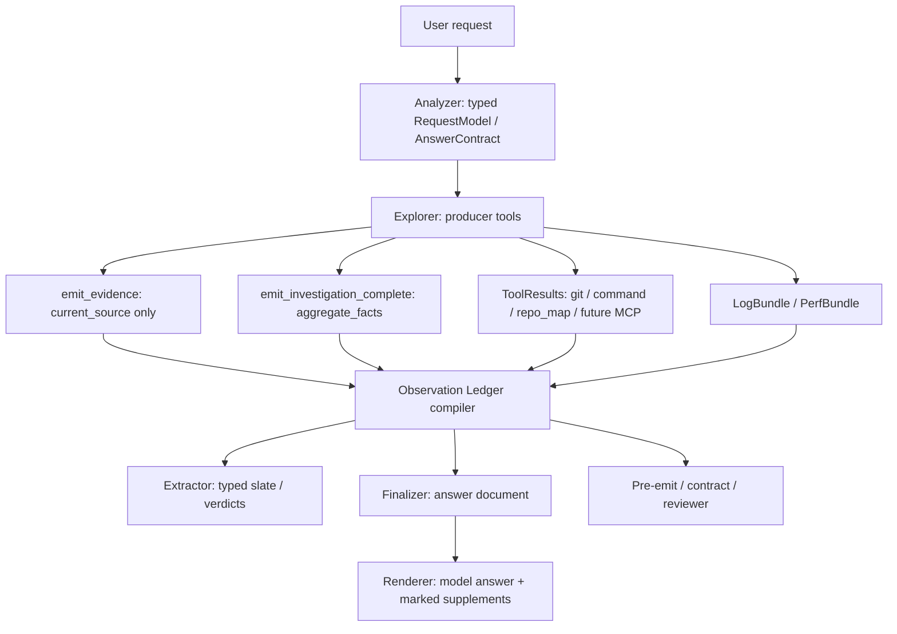

# Unified Observation Ledger Contract

**Date**: 2026-05-21
**Status**: design + phased implementation plan
**Owner**: read-mode evidence/answer architecture

## 1. Problem Statement

Codrax now has several valid evidence carriers:

- current checkout source facts in `EvidenceItem` via `emit_evidence`;
- model-authored derived facts in `emit_investigation_complete.aggregate_facts`;
- runtime log / trace bundles in `LogBundle` and `PerfBundle`;
- VCS and shell outputs in `ToolResult` / blob-backed raw tool output lanes;
- early MCP scaffolding in `MCPResponse`.

This split is historically reasonable, but it leaves the system with two risks:

1. Every new non-code source family, such as web pages, MCP resources, database rows, or monitoring snapshots, may add another bespoke path.
2. Downstream stages can accidentally reinterpret a non-code fact as source evidence, or ignore rich non-code context because it is only present in raw tool output.

The desired contract is a single internal observation ledger that indexes accepted facts by origin, source reference, span reference, and claim role. Existing carriers become producer adapters into that ledger; `emit_evidence` remains source-line-only.

## 2. Red Lines

1. `emit_evidence` remains current-checkout source/config/doc evidence only. It must not accept git commits, old diff hunks, runtime artifact rows, command output rows, web paragraphs, MCP JSON fields, or fake `file:line` anchors.
2. The system must not collapse a rich requested answer shape into a scalar just because one origin contains a literal value.
3. Hard gates may only use precise typed signals. Raw tool prose, search rank, similarity, model free text, or broad “looks related” heuristics are soft guidance only.
4. Non-code facts may be principal answer evidence, but their citation/support shape is origin-specific and must not enter repo `citations[]` unless a real current-source line was read separately.
5. Positive and negative facts share the same origin/scope boundary. A zero-result fact for one target must never suppress a present value for another target in the same answer.

## 3. Current Code Audit

### 3.1 Producers

| Source family | Current producer | Current carrier | Code entry points | Current status |
| --- | --- | --- | --- | --- |
| Current checkout source/config/docs | `read_file` / `grep` + `emit_evidence` | `EvidenceItem` | `internal/tool/emit_evidence.go`, `internal/tool/ground/*`, `internal/types/evidence.go` | Good. Source grounding is strict and should stay separate. |
| Scoped repo absence | grep/search + `aggregate_facts.kind=negative_search` | `AnswerAggregateFact` dimensions | `internal/types/answer_aggregate_fact.go`, `internal/tool/emit_investigation_complete.go` | Good for repo-scoped absence; strict `repo` is correct. |
| Non-repo absence | git/log/trace/command/repo_map no-hit + `negative_observation` | `AnswerAggregateFact` dimensions | `internal/types/answer_aggregate_fact.go`, `internal/types/answer_evidence_origin.go` | Good as F.12 compatibility slice; needs generic observation form. |
| Git metadata/history | `git_log`, metadata `git_show`, `git_history_search`, git-like `exec_command` | typed banner + raw `ToolResult` + optional `aggregate_facts` | `internal/tool/builtin.go`, `internal/types/answer_evidence_origin.go` | Working for many cases; arbitrary narrative remains raw/support unless model emits aggregates. |
| Git diff | `git_diff`, patch `git_show`, diff-like `exec_command` | typed banner + raw `ToolResult` + optional `aggregate_facts` | `internal/tool/builtin.go` | Mostly working; mixed diff + current-source questions need stronger source/diff lane binding. |
| Deterministic command measurements | `exec_command` count proof | typed banner + deterministic aggregate enrichment | `internal/tool/builtin.go`, `internal/tool/emit_investigation_complete.go` | Working for counts; arbitrary command facts need an observation adapter. |
| Runtime logs | `emit_log_triage` | `LogBundle.Errors`, `LogBundle.Observations` | `internal/tool/emit_log_triage.go`, `internal/types/log_bundle.go` | Good for observation-only logs with artifact-local lines. |
| Perf / HiTrace / atrace | `emit_perf_trace` | `PerfBundle.Frames/Janks/Stalls/Startup/Observations` | `internal/tool/emit_perf_trace.go`, `internal/types/perf_bundle.go` | Partially connected; complex perf ownership/facet gaps remain. |
| Repo-map / index | `repo_map` | raw `ToolResult`; optional aggregate dims | `internal/tool/repomap/*`, `internal/tool/builtin.go` | Partial; no first-class index observation adapter. |
| MCP | registry/tool scaffolding | `MCPResponse`, `RelevantMCPNotes` | `internal/mcp/*`, `internal/context/builder.go` | Not evidence-grade yet. No origin enum, no resource span, no ledger adapter. |
| Web / connector resources | none | none | not implemented | Future gap. Needs external resource origins before any tool is introduced. |

### 3.2 Stage Handoff

- Explorer output is preserved in `TurnAArtifacts`: notes, read files, tool results, accepted closure reason, accepted aggregate facts, runtime observation-only marker, evidence items, and flow findings.
- Parallel explorer forks merge evidence, Turn A artifacts, aggregate facts, and retained closure state through `MutableState.MergeExploreFork`.
- Extractor/finalizer cannot re-run investigation tools; therefore every principal fact that matters must be in one of the typed carriers or the bounded raw tool output lane before Turn A closes.

Relevant code:

- `internal/types/context.go`: `TurnAArtifacts`, `ToolResult`, `MCPResponse`, `BusContext`.
- `internal/agent/turn_a_merge.go`: Turn A artifact merge.
- `internal/context/builder.go`: raw tool output, origin-boundary, attached artifact, and MCP note rendering.

### 3.3 Consumers

| Consumer | Current inputs | Risk |
| --- | --- | --- |
| Explorer prompt | origin boundary hints, producer tools, current source evidence tool | Good, but prompt text still has duplicated policy across builder/evaluator. |
| Extractor prompt | Turn A artifacts, raw tool outputs when typed as citation-free/history, aggregate facts | Useful, but raw tool outputs are capped and not addressable by claim ID. |
| Finalizer prompt | answer intent contract, claim bindings, accepted closure, aggregate facts, support lanes, raw tool output, runtime disposition | Functional but distributed. Model must reconcile multiple sections. |
| Pre-emit validators | `EvidenceItem`, aggregate facts, runtime markers, answer doc | Some validators still have source-first assumptions and need origin-aware ledger checks. |
| Contract / semantic reviewer | answer doc, claim binding summaries, evidence, tool outputs | Better than before, but still not a single interpretation source. |
| Renderer / answer panel | accepted `AnswerDocumentV2` + display attachments | Should not decide evidence semantics; only display model answer and clearly marked system supplements. |

## 4. Hidden Gaps

### G1. No Single Accepted Fact View

The logical contract exists, but the physical view is spread across `EvidenceItem`, `AnswerAggregateFact`, `ToolResult`, `LogBundle`, `PerfBundle`, `MCPResponse`, and raw prompt sections. This makes every downstream consumer choose its own interpretation.

### G2. External Origins Are Missing

`AnswerEvidenceOrigin` currently has no `web_page`, `mcp_resource`, `external_document`, or `connector_resource`. Reusing `runtime_artifact` for these would be convenient but wrong: runtime artifacts are observed execution traces/logs, not general external documents.

### G3. Span References Are Not Unified

Current source has `file:line`. Runtime artifacts have artifact-local lines. VCS diffs have commits and hunks. MCP/web resources may need URI + JSON pointer, table row, DOM selector, paragraph index, or text range. This needs a typed `ObservationSpan`, not overloaded strings.

### G4. Positive Non-Code Facts Depend Too Much On Raw Tool Output

Git history and command narratives can be answer-grade, but if the model forgets to emit `aggregate_facts`, the finalizer sees them only as raw snippets. That is acceptable for fallback, but not for stable commercial behavior.

### G5. Negative Observations Need More Room

`AnswerAggregateDimension` is capped at 8 dimensions. That is enough for simple `origin + target + scope + result_count + searched_at`, but future web/MCP negatives may also need `source_ref`, `span_ref`, `method`, `resource_kind`, and `query_language`.

### G6. MCP Is Currently Context, Not Evidence

`MCPResponse` can be rendered as a note, but it does not compile into claim bindings or origin-specific support. MCP tools/resources should be able to contribute evidence without pretending to be repo files.

### G7. Repo-Map / Cross-Repo Index Facts Are Under-Structured

Repo-map output often answers architecture/scope questions. Today it is mostly raw output or optional aggregate dimensions. It needs a first-class `cross_repo_index` observation adapter.

### G8. Prompt Duplication And Conflict Risk

Origin policy exists in both upstream context builder and finalizer evaluator. The content has been reduced, but ledger migration should make a single compiled view feed each stage.

### G9. Mixed-Origin Questions Need Explicit Lane Coupling

Questions like “基于历史 diff + 当前代码分析影响” need both `vcs_diff` and `current_source`. The system must not let a diff observation satisfy a current-source claim, or force a current-source read for a pure history question.

### G10. Stale / Failed Closure Pollution

Earlier audits found failed or downgraded closure payloads could leak into later context. A ledger must record only accepted producer outputs, with provenance state (`accepted`, `rejected`, `diagnostic_only`) explicit.

### G11. External Observation Paging And Local Anchors

Current command/git tools already store large output through the blob mechanism and
return `ToolResult.RawRef`; attached log/trace triage can page the artifact blob
with `read_file`. The new ledger type can express this through
`ObservationSourceRef.RawRef` plus `ObservationSpan` fields (`line_start`,
`line_end`, `row`, `json_pointer`, `paragraph`, `text_range`, time spans).

The remaining gap is end-to-end uniformity: future MCP/web/connector producers, and
some existing non-code observations, must materialize large external payloads into
the same blob-backed paging surface and carry stable local coordinates. Otherwise
the finalizer can know that an external observation exists, but exploration cannot
reliably page to line/row N or cite an artifact-local coordinate when the user asks
"第几行/第几个/哪个字段".

### G12. Mixed-Origin Evidence Ordering Must Be Intent-Aware

The ledger deliberately treats git/history, logs, traces, command output, MCP,
web, connector data, and current source as peer observation origins. That does
not mean every origin has equal priority for every question. Mixed requests such
as "基于这次 diff 分析当前代码影响", "结合日志第 N 行和源码定位原因", or
"根据 MCP 文档再解释实现" need external observations and current-source
evidence to remain coupled but not flattened into one lane.

Ordering must be derived from typed `RequestModel` / `AnswerContract` origins
and typed observation attributes only. It must not inspect raw user prose or
model prose keywords. The invariant is:

- if the request requires current-code analysis, grounded/current/read source
  records with concrete file spans and definition/config anchors must survive the
  prompt budget and outrank incidental external summaries;
- if the request is pure history/log/trace/MCP/web lookup, requested external
  observations outrank incidental source reads;
- if both are requested, both families stay visible, and exact current-source
  evidence is ranked above broad external summaries when it is needed to explain
  current behavior;
- rich summaries, raw refs, and local spans are carried forward; compact prompt
  projections may budget them, but must not mutate the underlying ledger.

## 5. Target Architecture

### 5.1 Core Type

Introduce a read-only compiled ledger under `internal/types`:

```go
type ObservationRecord struct {
    ID              string
    Origin          AnswerEvidenceOrigin
    Producer        string
    Role            AnswerAggregateRole
    GroundingPolicy ClaimGroundingPolicy

    SourceRef       ObservationSourceRef
    Span            ObservationSpan

    ClaimKey        string
    Subject         string
    Predicate       string
    Object          string
    Value           string
    Unit            string
    Negative        bool
    ResultCount     *int

    Summary         string
    RawExcerpt      string
    RichNotes       []string
    SupportRefs     []string
    ObservedAt      string
    Scope           string
    Confidence      float64
}
```

`ObservationSourceRef` and `ObservationSpan` are typed:

- current source: `repo`, `path`, `line_start`, `line_end`;
- VCS metadata: `repo`, `commit`, `range`, `pathspec`;
- VCS diff: `repo`, `commit/range`, `file`, `old_line/new_line`, `hunk_header`;
- runtime artifact: `artifact_id`, `artifact_kind`, `line_start`, `line_end`, `timestamp_ms`;
- command: `tool_call_id`, `command`, `raw_ref`;
- cross-repo index: `repo`, `view`, `entity`;
- web page: `url`, `fetched_at`, `paragraph`, `selector`, `text_range`;
- MCP resource: `server`, `resource_uri`, `mime_type`, `json_pointer` / `row` / `line`.

Every non-inline external producer that may exceed prompt budget should also expose
a blob/page handle in `SourceRef.RawRef` (or an equivalent resource URI that a
future paging tool can dereference) and an artifact-local coordinate in
`ObservationSpan` when the source has lines, rows, JSON pointers, paragraphs, or
trace timestamps. These spans are external-resource coordinates, not current-repo
citations.

### 5.2 Compiler

Add a side-effect-free compiler:

```go
func CompileObservationLedger(input ObservationLedgerInput) ObservationLedger
```

Inputs are existing carriers:

- `[]EvidenceItem`
- stable `[]AnswerAggregateFact`
- `[]ToolResult`
- `*LogBundle`
- `*PerfBundle`
- `[]MCPResponse`
- request model and answer contract

The compiler must be deterministic, read only accepted state, and avoid raw user/model prose classification.

### 5.3 Producer Adapters

| Adapter | Output |
| --- | --- |
| `EvidenceItem` adapter | `origin=current_source`, hard/repairable policy by role, file span. |
| `AnswerAggregateFact` adapter | scalar/list/count/absence records with model-authored value and dimensions. |
| `ToolResult` adapter | VCS/command/cross-repo records when typed origin banners are present; otherwise support-only raw record. |
| `LogBundle` adapter | runtime observations and error frames with artifact-local line spans. |
| `PerfBundle` adapter | runtime timing/frame/span observations. |
| `MCPResponse` adapter | future `origin=mcp_resource` or `connector_resource`, not current-source. |
| Web adapter | future `origin=web_page`, with URL/time/span and quote limits. |

### 5.4 Consumer Rule

Downstream stages should consume `ObservationLedger` first:

1. Finalizer sees a compact, origin-grouped ledger plus rich notes. Raw tool output remains only for audit/backstop.
2. Pre-emit and reviewer read the same ledger, so they do not independently infer origin/gate policy.
3. `citations[]` remains current-source only. Non-source observations use `citation_ref=-1` and visible provenance prose, or a future separate artifact/reference panel.
4. System supplements may add missing ledger-derived details only in clearly marked sections; they must not replace or rewrite model-authored rich answer blocks.

### 5.5 External Paging Contract

External observations have two layers:

1. **Discovery summary**: compact `Summary` / `RichNotes` in the ledger so the
   finalizer can answer without rereading large payloads.
2. **Paged backing artifact**: a stable `RawRef` / resource URI plus local
   `ObservationSpan` so exploration can fetch more bytes when the user asks for
   exact lines, neighboring context, table rows, JSON fields, trace windows, or a
   second pass over a large git/log/trace/web/MCP result.

Short-term implementation reuses existing tool blobs and `read_file` pagination
for command/git/log/trace files. Long-term implementation should add a typed
external-resource paging adapter rather than teaching every producer a private
pagination format.

### 5.6 Intent-Aware Ledger Prioritization

All prompt/reviewer consumers that need a compact ledger view should call one
shared type-layer helper:

```go
func PrioritizeObservationRecords(
    records []ObservationRecord,
    rm *RequestModel,
    contract *AnswerContract,
    limit int,
) []ObservationRecord
```

The helper ranks by typed requested origins from `CompileAnswerIntentContract`,
record role, origin, exact-source anchor quality, negative/positive state, and
summary richness. It is intentionally conservative: current-source records get
the strongest boost only when current source is requested and the record has a
concrete path/line span, non-ungrounded status, and a definition/config-style
anchor. External-only questions continue to prefer their requested external
origins.

Finalizer and semantic reviewer must share this helper. Any future compact
consumer should reuse it rather than adding a private origin sorter.

## 6. End-To-End Data Flow



## 7. Commercial-Grade Implementation Plan

### Batch 0 — Design Baseline

- [x] Audit current producers, handoff state, consumers, and gaps.
- [x] Record the end-to-end design and task list in this document.
- [x] Commit the design baseline before code changes. Commit: `f23d6a2e`.

### Batch 1 — Ledger Skeleton And Origin Extensibility

- [x] Add `AnswerEvidenceOriginWebPage`, `AnswerEvidenceOriginMCPResource`, `AnswerEvidenceOriginExternalDocument`, and `AnswerEvidenceOriginConnectorResource`.
- [x] Add `ObservationRecord`, `ObservationSourceRef`, `ObservationSpan`, `ObservationLedger`, and `ObservationLedgerInput` in `internal/types`.
- [x] Add tests proving unknown/current behavior remains unchanged and new origins are valid but do not become current-source.
- [x] Add a red-line test proving non-current origins default to non-hard current-source citation pressure.

### Batch 2 — Compile Existing Accepted Carriers

- [x] Compile current-source `EvidenceItem` rows into ledger records.
- [x] Compile stable `aggregate_facts` into ledger records, including `negative_search` and `negative_observation`.
- [x] Compile runtime `LogBundle` / `PerfBundle` observations into ledger records with artifact-local spans.
- [x] Compile typed `ToolResult` banners for VCS metadata/diff and command measurement into support records.
- [x] Add tests for mixed positive + negative facts and mixed VCS diff + current-source facts.

### Batch 3 — Finalizer / Reviewer Consumption

- [x] Render a compact `Observation Ledger` prompt section before raw tool output.
- [x] Update claim binding rendering to point at ledger record IDs where possible.
- [x] Keep raw tool output as fallback/audit, not principal interpretation.
- [x] Update semantic reviewer input to consume ledger summaries.
- [x] Route finalizer and semantic reviewer compact ledger views through one
  shared intent-aware prioritizer.
- [x] Add tests that a git feature-summary answer is not compressed to a commit hash.

### Batch 4 — MCP / Web Future-Proofing

- [x] Compile `MCPResponse` into support-only ledger records when MCP is present.
- [ ] Define future `web_page` record shape and span policy before any web-read tool lands.
- [ ] Define a shared external-resource paging contract: producers store large
  MCP/web/connector payloads in blob-backed resources, ledger records carry
  `RawRef` / resource URI plus artifact-local spans, and paging never becomes a
  current-source citation.
- [ ] Add eval skeletons for MCP JSON field, MCP absent field, web paragraph fact, and web absent term.
- [ ] Ensure external resource observations never import `internal/tool/ground` or enter repo citations.

### Batch 4B — External Artifact Paging And Anchor Readiness

- [x] Audit every non-code producer (`git_log`, `git_show`, `git_diff`,
  `exec_command`, attached log/trace, future MCP/web/connector) for whether large
  payloads expose `RawRef` and whether exact local coordinates are recoverable.
- [x] Reuse the existing blob session + `read_file` paging path for large
  command/git/log/trace outputs; do not invent a second storage mechanism.
- [x] Add tests that ledger records preserve `RawRef` for blob-backed command/git
  output and preserve artifact-local line/row/JSON/time spans where available.
- [x] Project VCS tool banner coordinates (`ref`, `pathspec`, `window_path`,
  `diff_path`, `answer_count`, command string) into ledger `SourceRef` /
  `ResultCount` so consumers can distinguish commit/diff/history coordinates
  from current-source citations.
- [ ] Add eval cases for "log line N", "trace window around event", "git diff hunk
  around file", "MCP JSON field exists/absent", and "web paragraph contains/does
  not contain term".

### Batch 4C — Mixed-Origin Ranking And Prompt Budget Guardrails

- [x] Implement `types.PrioritizeObservationRecords` as the single ranking path
  for compact ledger projections.
- [x] Add tests for mixed history/diff + current-code analysis: exact grounded
  source evidence remains visible and does not get displaced by broad external
  observations.
- [x] Add tests for external-only history/log/trace questions: requested
  external observations outrank incidental current-source reads.
- [x] Add a prompt-budget diversity guard: when a mixed request has multiple
  typed requested origins, the compact ledger keeps the best record for each
  requested origin before filling the remaining budget by rank. This prevents
  many current-source rows from squeezing out equally relevant git/diff/log
  observations while preserving exact current-source rows first when current
  code is part of the request.
- [x] Add tests that shared context adapters prefer accepted Turn A artifacts
  over analyzer/pre-scan noise.
- [x] Add eval backlog / executable guards for "基于 git diff + 当前源码分析影响"
  and "结合日志第 N 行和当前源码解释原因". MCP/web mixed-content cases remain
  backlog until those producers have executable eval plumbing.

### Batch 5 — Gate Consolidation

- [ ] Replace scattered origin checks in finalizer pre-emit, contract check, and reviewer with ledger-based helpers.
- [x] Add shared `AnswerEvidenceOriginCarriesOriginSpecificSupport` helper so
  VCS/diff/runtime/command/repo-negative/cross-repo/external/web/MCP/connector
  support lanes are not re-listed by every consumer.
- [x] Add shared helpers for current-source citation eligibility:
  `ObservationRecordHasCurrentSourceLineSpan`,
  `ObservationRecordHasStrongCurrentSourceAnchor`, and
  `AnswerClaimBindingHasExactCurrentSourceSupport`. These helpers are the only
  accepted predicates for deciding that a current-source claim can create
  source-line citation pressure.
- [x] Keep source evidence gates hard only for `origin=current_source` records
  with exact source spans, and downgrade current-source aggregate/ledger records
  without file-line support to `repairable` rather than forcing a broad rewrite.
- [ ] Make non-source repair paths prefer local supplement / boundary disclosure over broad finalizer rewrite.
- [x] Add type-layer red-line tests that external/web/MCP/connector observations
  never import `internal/tool/ground`, never become repo citations, and preserve
  origin-specific support instead of fake `file:line` anchors.
- [x] Add regression tests for no fake `file:line`, no duplicated raw table, no stale failed closure record.

### Batch 6 — Eval And Gap Closure

- [ ] Run targeted evals: git latest feature, recent-N commits, diff+current analysis, log line anchor, trace line anchor, negative observation mixes.
- [ ] Add web/MCP placeholder evals once tools are available.
- [ ] Update `docs/design/eval_20260520_full_sweep_gap_tracking.md` with every observed retry/reject and whether it was model error or system over-gate.

## 8. Immediate Development Order

1. Batch 1 first: it is low-risk and gives all future producers a stable type target.
2. Batch 2 next: compile current carriers into a read-only ledger without changing prompts. Tests prove no behavior regression.
3. Batch 3 only after Batch 2 tests pass: begin consuming the ledger in finalizer/reviewer.
4. Batch 4 can proceed in parallel with MCP implementation later, but the origin/type contract should land now.
5. Batch 5 is the cleanup batch that removes duplicate origin logic after ledger consumers are stable.

## 9. Open Decisions

1. Whether `connector_resource` should be a separate origin or folded into `mcp_resource` with `source_ref.kind=connector`. Current recommendation: keep both, because MCP is a protocol and connector data may come from first-party app integrations.
2. Whether non-source observations should get a user-visible reference panel separate from `citations[]`. Current recommendation: yes, but not in Batch 1/2.
3. Whether arbitrary command output should be auto-parsed into ledger records. Current recommendation: only when a deterministic parser recognizes the shape or the model emits a structured aggregate; otherwise keep it support-only.

## 10. Progress Log

- 2026-05-21: Created design baseline from code audit. No code changes yet.
- 2026-05-21: Batch 1 completed: added external evidence origins, ledger
  skeleton types, source/span model, no-op compiler API, and origin-policy
  tests. This batch intentionally does not change prompts or runtime behavior.
  Validation: `go test ./internal/types ./internal/agent ./internal/tool
  ./internal/orchestrator`.
- 2026-05-21: Batch 2 completed in type layer: `CompileObservationLedger`
  now compiles current-source evidence, aggregate facts, typed VCS/command tool
  result banners, log observations, perf observations, and support-only
  `MCPResponse` records. It remains read-only and is not consumed by prompts yet.
  Validation so far: `go test ./internal/types`.
- 2026-05-21: Batch 3 partial completed: finalizer now receives a compact
  read-only `Observation Ledger` section compiled from accepted Turn A evidence,
  stable aggregate facts, typed VCS/diff/command tool-result banners,
  log/perf bundles, and MCP responses carried on `AgentContext`. Raw tool output
  remains a fallback/audit channel rather than the principal interpretation
  channel. Regression tests cover VCS feature summaries not collapsing to a
  scalar commit id, mixed diff+current-source lanes, and MCP resources avoiding
  current-source citation pressure.
- 2026-05-21: Added G11 / Batch 4B after design review: external git/log/trace,
  command, MCP, web, and connector observations need a uniform blob-backed paging
  and artifact-local anchor contract. Existing command/git blobs and attached
  artifact paging are the reuse target; the missing work is making every
  external producer expose a ledger `RawRef` / resource URI and local spans when
  the source supports line/row/JSON/time coordinates.
- 2026-05-21: Batch 3 claim-binding bridge completed: the finalizer's claim
  binding handoff now lists matching `Observation Ledger` record ids where the
  relationship is exact (aggregate index + origin) or runtime-artifact typed
  bundle matching is available. This keeps bindings and ledger records aligned
  without adding another origin inference path.
- 2026-05-21: Batch 4B first guardrail landed in the type layer: aggregate facts
  can carry `raw_ref` / `blob_ref` into `ObservationSourceRef.RawRef`, and tests
  now verify command/git blob refs plus log/perf artifact-local line/time spans
  are preserved. This is not the full external-resource paging adapter yet; it
  locks down the reusable blob/span contract before MCP/web/connector producers
  grow their own implementations.
- 2026-05-21: Batch 3 semantic-reviewer consumption completed: reviewer input
  now carries compact `Observation Ledger` summaries compiled through the same
  `types.CompileObservationLedger` path as finalizer. Tests verify VCS history
  observations and blob refs are visible to the reviewer without becoming
  current-source citation requirements.
- 2026-05-21: Consumer input construction was lifted into `internal/types` via
  `ObservationLedgerInputFromAgentContext` and
  `ObservationLedgerInputFromBusContext`. Finalizer and semantic reviewer now
  share the same accepted-carrier projection rules instead of each manually
  stitching evidence, Turn A tool results, aggregate facts, runtime bundles, and
  MCP responses. Tests pin that accepted Turn A tool results outrank noisy bus
  history and that MCP/runtime observations survive the shared adapter.
- 2026-05-21: Added G12 / Batch 4C for mixed-origin prompt budgeting. The key
  rule is typed and request-aware: current-source evidence must stay prominent
  when current code is part of the question, while external-only questions must
  not be dominated by incidental source reads. Finalizer and reviewer compact
  views will share `types.PrioritizeObservationRecords` to avoid future drift.
- 2026-05-21: Batch 4C implementation completed: `types.PrioritizeObservationRecords`
  now centralizes compact ledger ordering, finalizer and semantic reviewer both
  call it, and tests cover mixed history/diff + current-code priority,
  external-only history priority, shared accepted-carrier context adapters, and
  finalizer/reviewer prompt ordering. Validation: `go test ./...`.
- 2026-05-21: Batch 4C eval guards added: `u7o` covers latest diff + current
  source impact, and `logtri_line_current_code` covers artifact-local log line
  + current-code explanation. MCP/web mixed-origin evals stay explicitly
  tracked but unimplemented until the runner has those producers.
- 2026-05-21: Batch 4C prompt-budget guard refined: `PrioritizeObservationRecords`
  now seeds the compact view with one best record per typed requested origin
  before filling by score. This keeps mixed code+git/diff/log/trace evidence
  balanced under prompt pressure without changing external-only or source-only
  ordering semantics.
- 2026-05-21: Batch 4B VCS/tool coordinate projection completed: git/diff/history
  and exec-command observations now keep blob `RawRef` plus structured
  `ref/pathspec/window_path/diff_path/answer_count/command` coordinates in the
  ledger. This keeps VCS/diff facts addressable without pretending they are
  current-checkout `file:line` citations.
- 2026-05-21: Batch 5 first consolidation guard landed: origin-specific
  support classification is now a shared `types` helper and the root-cause /
  narrative-support path consumes it. Tests cover new external/MCP origins so
  future consumers do not forget them when deciding whether a non-source claim
  can be locally disclosed instead of forcing current-source citation repair.
- 2026-05-21: Batch 5 follow-up scope refreshed: the next implementation slice
  centralizes current-source citation eligibility in the type layer. The intent
  is not to weaken exact current-code grounding; it is to prevent aggregate,
  command, git, log, trace, MCP, web, or connector observations from being
  mistaken for source-line citation obligations when they do not carry an exact
  current-checkout span.
- 2026-05-21: Batch 5 current-source citation eligibility implemented:
  `ObservationRecordHasCurrentSourceLineSpan` and
  `ObservationRecordHasStrongCurrentSourceAnchor` now drive ledger ranking and
  hard-policy downgrades, while `AnswerClaimBindingHasExactCurrentSourceSupport`
  exposes the same distinction to finalizer and reviewer prompts. Current-source
  aggregate/ledger records without exact line support become `repairable`; log /
  trace artifact-local lines, VCS hunks, command output rows, MCP/web/connector
  resources, and other non-current origins stay origin-specific support. Tests
  cover source-location members, no-support current-source aggregates, artifact
  local lines, and type-layer no-import of `internal/tool/ground`.
- 2026-05-21: Batch 5 regression guards refreshed: the table compiler already
  had explicit no-duplicate / preserve-authored-markdown / marked-supplement
  tests; this batch added stale failed-closure coverage so in-flight
  downgraded `aggregate_facts` cannot replace the accepted stable pool, plus the
  current-source/external span tests above for no fake `file:line`.
- 2026-05-21: Batch 6 targeted eval tranche started. `u7o` (latest diff +
  current source impact) and `logtri_line_current_code` both passed with
  `finalizer_iters=1` and no repair/rewrite. `u7n` exposed a true follow-up:
  two-target history existence checks must not remain `return_value` /
  scalar-answer shaped, and committed absent-marker literals can self-poison git
  history evals. The gap is recorded as `E20260521-G142` in
  `docs/design/eval_20260520_full_sweep_gap_tracking.md`; this batch adds a
  typed analyzer reconciliation plus an eval marker construction fix.
- 2026-05-21: Batch 6 mitigation verified. The analyzer and answer-intent
  contract now demote multi-target history existence lookups from anonymous
  scalar output to per-target set/enumeration output unless the request is a true
  count or role-locate scalar. The renderer also preserves a model-authored
  scalar `title` as the visible label, so any remaining titled scalar is not
  flattened into generic `值/Value` wording. `u7n-20260521-113334` passed with
  `requested outputs: summary, enumeration`, one finalizer round, and no
  repair/rewrite; the absent-marker eval now constructs the marker from split
  shell fragments to avoid committing the exact negative token into git history.
- 2026-05-21: Batch 6 source-boundary follow-up completed. `u7c` proved the
  scalar compression was fixed, but also exposed a separate system-origin shape
  escalation: pure VCS history narratives were still routed through
  `architecture_explain`, which loaded component-relation blocks and current-code
  reviewer pressure. The typed boundary is now end-to-end: pure non-scalar
  history narratives stay `generic`, generic facet coverage does not attach
  current-source/component/diagram facets, and reviewer/caveat consumers skip
  current-source-oriented pressure unless the request carries mixed-code,
  diagram, diagnostic, change-impact, relation, scalar, or count signals.
  `u7c-20260521-120536` passed with `family=generic`, required summary only,
  `semantic_quality_concerns=0`, and one finalizer round.
- 2026-05-21: Batch 6 mixed-lane check: `u7o` remains deliberately outside the
  pure-history shortcut because the user asks for latest diff plus current source
  impact. The run kept `family=architecture` with VCS/current-source lanes
  visible; the eval guard was refined so quoting the old scalar label `**值：**`
  while explaining the rendering bug is not treated as product failure. This
  preserves the contract split: pure VCS narratives avoid current-source
  pressure, mixed diff+implementation questions still require current-source
  reasoning. Rerun `u7o-20260521-122249` passed with one finalizer round and no
  semantic-quality concern; residual cost (`explorer_iters=32`,
  `midloop_inject=9`) is tracked as a performance follow-up, not as an answer
  contract failure.
- 2026-05-21: Batch 7 planned from the attached failure-flow diagnostic image.
  The remaining risk is not a single case answer: it is gate promotion of
  support-tier signals. Implementation order:
  1. analyzer gate hard rejection becomes an explicit allowlist; search-hint
     coverage is soft telemetry because it is derived from hint coverage rather
     than a broken runtime graph;
  2. ERM unsatisfied state remains exploration guidance only and cannot by
     itself set `MissingFacts` / fact-retry after the model has otherwise
     completed investigation;
  3. targeted tests cover analyzer soft coverage, still-hard structural gates,
     and ERM-only non-retry so future contributors cannot reintroduce the
     screenshot class by adding a new default-hard check.
- 2026-05-21: Batch 7 step 1 shipped in `78cfa938`: analyzer gate hard rejects
  now use a typed allowlist, and coverage/search-hint gaps remain visible but
  cannot alone retry analysis.
- 2026-05-21: Batch 7 step 2 implemented: ERM requirement satisfaction remains
  a readiness face and positive completion signal, but ERM-only unsatisfied
  breadth gaps no longer demote `HasEnoughFacts` or build an explorer fact
  retry. Targeted tests pin that an otherwise-ready investigation completes
  without the old `explorer.retry.erm-unsatisfied` path.
- 2026-05-21: Batch 7 targeted eval check: `qf_sequence_analyzer_gate` and
  `read_combo_analyze_retry_anchor` both passed with one finalizer turn and no
  analyzer hard-retry, so the screenshot-class analyzer/ERM loop is mitigated.
  The second run exposed a separate P1 performance/UX gap: multi-topic
  mechanism questions can still trigger enumeration/partial-read mid-loop
  guidance in parallel lanes (`explorer_iters=52`, `midloop_inject=28`). Track
  this as the next batch, scoped to typed principal-member enumeration only.
- 2026-05-21: Batch 8 implemented the scoped mid-loop part of that follow-up.
  Enumeration coverage hints now require a typed principal member-set shape
  (`IsCategoryEnumerationAnswerShape`, explicit enumeration boundary /
  completeness obligation, or required member-set handoff). Mechanism and
  architecture explanations with multiple subtopics can still use evidence
  guidance, but they no longer inherit exhaustive enumeration coverage pressure
  from a stale fork-local flag.
- 2026-05-21: Batch 8 rerun result: `read_combo_analyze_retry_anchor` passed
  again; the erroneous enumeration hint disappeared, `explorer_iters` improved
  from 52 to 42, and `midloop_inject` improved from 28 to 21. Residual work is
  now split into two explicit gaps: semantic-quality diagram concern noise for
  mechanism questions without an explicit diagram request, and parallel-lane
  convergence / forced-read repair churn after one lane has already closed a
  grounded principal answer.
- 2026-05-21: Batch 9 implemented the semantic-quality part of that residual.
  Non-hard `diagram_spine` facets are no longer sent to the semantic reviewer as
  required/promoted coverage unless the typed answer semantic view has a required
  diagram plan. This preserves explicit diagram requests while preventing broad
  architecture/mechanism family defaults from turning "no diagram" into a
  reviewer concern.
