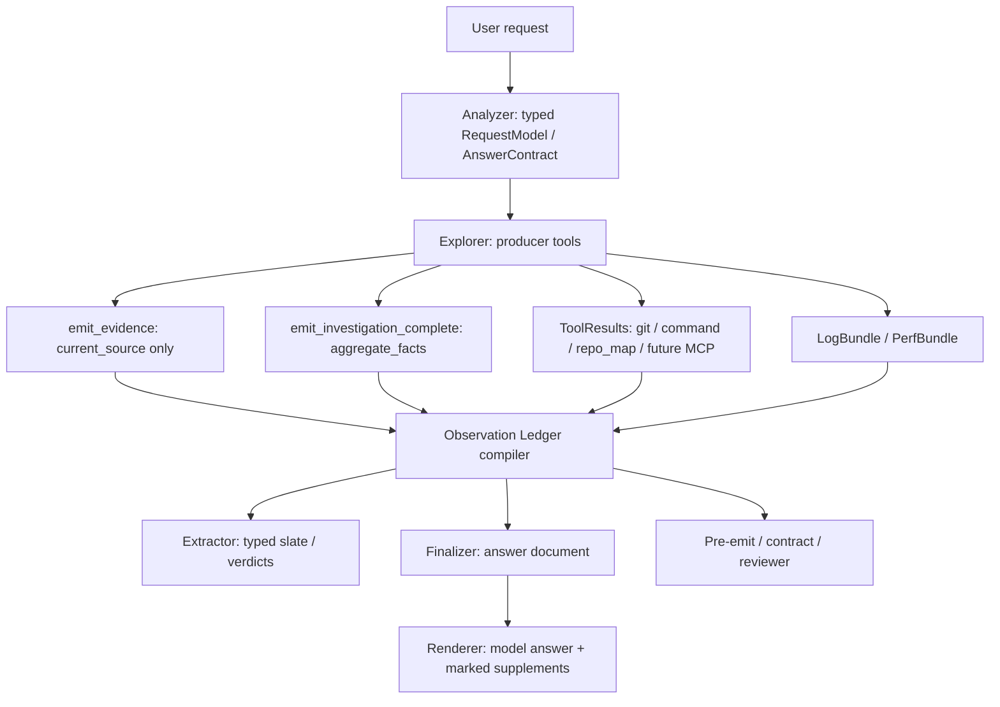

# Unified Observation Ledger Contract

**Date**: 2026-05-21
**Status**: design + phased implementation plan
**Owner**: read-mode evidence/answer architecture

## 1. Problem Statement

Codrax now has several valid evidence carriers:

- current checkout source facts in `EvidenceItem` via `emit_evidence`;
- model-authored derived facts in `emit_investigation_complete.aggregate_facts`;
- runtime log / trace bundles in `LogBundle` and `PerfBundle`;
- VCS and shell outputs in `ToolResult` / blob-backed raw tool output lanes;
- early MCP scaffolding in `MCPResponse`.

This split is historically reasonable, but it leaves the system with two risks:

1. Every new non-code source family, such as web pages, MCP resources, database rows, or monitoring snapshots, may add another bespoke path.
2. Downstream stages can accidentally reinterpret a non-code fact as source evidence, or ignore rich non-code context because it is only present in raw tool output.

The desired contract is a single internal observation ledger that indexes accepted facts by origin, source reference, span reference, and claim role. Existing carriers become producer adapters into that ledger; `emit_evidence` remains source-line-only.

## 2. Red Lines

1. `emit_evidence` remains current-checkout source/config/doc evidence only. It must not accept git commits, old diff hunks, runtime artifact rows, command output rows, web paragraphs, MCP JSON fields, or fake `file:line` anchors.
2. The system must not collapse a rich requested answer shape into a scalar just because one origin contains a literal value.
3. Hard gates may only use precise typed signals. Raw tool prose, search rank, similarity, model free text, or broad “looks related” heuristics are soft guidance only.
4. Non-code facts may be principal answer evidence, but their citation/support shape is origin-specific and must not enter repo `citations[]` unless a real current-source line was read separately.
5. Positive and negative facts share the same origin/scope boundary. A zero-result fact for one target must never suppress a present value for another target in the same answer.

## 3. Current Code Audit

### 3.1 Producers

| Source family | Current producer | Current carrier | Code entry points | Current status |
| --- | --- | --- | --- | --- |
| Current checkout source/config/docs | `read_file` / `grep` + `emit_evidence` | `EvidenceItem` | `internal/tool/emit_evidence.go`, `internal/tool/ground/*`, `internal/types/evidence.go` | Good. Source grounding is strict and should stay separate. |
| Scoped repo absence | grep/search + `aggregate_facts.kind=negative_search` | `AnswerAggregateFact` dimensions | `internal/types/answer_aggregate_fact.go`, `internal/tool/emit_investigation_complete.go` | Good for repo-scoped absence; strict `repo` is correct. |
| Non-repo absence | git/log/trace/command/repo_map no-hit + `negative_observation` | `AnswerAggregateFact` dimensions | `internal/types/answer_aggregate_fact.go`, `internal/types/answer_evidence_origin.go` | Good as F.12 compatibility slice; needs generic observation form. |
| Git metadata/history | `git_log`, metadata `git_show`, `git_history_search`, git-like `exec_command` | typed banner + raw `ToolResult` + optional `aggregate_facts` | `internal/tool/builtin.go`, `internal/types/answer_evidence_origin.go` | Working for many cases; arbitrary narrative remains raw/support unless model emits aggregates. |
| Git diff | `git_diff`, patch `git_show`, diff-like `exec_command` | typed banner + raw `ToolResult` + optional `aggregate_facts` | `internal/tool/builtin.go` | Mostly working; mixed diff + current-source questions need stronger source/diff lane binding. |
| Deterministic command measurements | `exec_command` count proof | typed banner + deterministic aggregate enrichment | `internal/tool/builtin.go`, `internal/tool/emit_investigation_complete.go` | Working for counts; arbitrary command facts need an observation adapter. |
| Runtime logs | `emit_log_triage` | `LogBundle.Errors`, `LogBundle.Observations` | `internal/tool/emit_log_triage.go`, `internal/types/log_bundle.go` | Good for observation-only logs with artifact-local lines. |
| Perf / HiTrace / atrace | `emit_perf_trace` | `PerfBundle.Frames/Janks/Stalls/Startup/Observations` | `internal/tool/emit_perf_trace.go`, `internal/types/perf_bundle.go` | Partially connected; complex perf ownership/facet gaps remain. |
| Repo-map / index | `repo_map` | raw `ToolResult`; optional aggregate dims | `internal/tool/repomap/*`, `internal/tool/builtin.go` | Partial; no first-class index observation adapter. |
| MCP | registry/tool scaffolding | `MCPResponse`, `RelevantMCPNotes` | `internal/mcp/*`, `internal/context/builder.go` | Not evidence-grade yet. No origin enum, no resource span, no ledger adapter. |
| Web / connector resources | none | none | not implemented | Future gap. Needs external resource origins before any tool is introduced. |

### 3.2 Stage Handoff

- Explorer output is preserved in `TurnAArtifacts`: notes, read files, tool results, accepted closure reason, accepted aggregate facts, runtime observation-only marker, evidence items, and flow findings.
- Parallel explorer forks merge evidence, Turn A artifacts, aggregate facts, and retained closure state through `MutableState.MergeExploreFork`.
- Extractor/finalizer cannot re-run investigation tools; therefore every principal fact that matters must be in one of the typed carriers or the bounded raw tool output lane before Turn A closes.

Relevant code:

- `internal/types/context.go`: `TurnAArtifacts`, `ToolResult`, `MCPResponse`, `BusContext`.
- `internal/agent/turn_a_merge.go`: Turn A artifact merge.
- `internal/context/builder.go`: raw tool output, origin-boundary, attached artifact, and MCP note rendering.

### 3.3 Consumers

| Consumer | Current inputs | Risk |
| --- | --- | --- |
| Explorer prompt | origin boundary hints, producer tools, current source evidence tool | Good, but prompt text still has duplicated policy across builder/evaluator. |
| Extractor prompt | Turn A artifacts, raw tool outputs when typed as citation-free/history, aggregate facts | Useful, but raw tool outputs are capped and not addressable by claim ID. |
| Finalizer prompt | answer intent contract, claim bindings, accepted closure, aggregate facts, support lanes, raw tool output, runtime disposition | Functional but distributed. Model must reconcile multiple sections. |
| Pre-emit validators | `EvidenceItem`, aggregate facts, runtime markers, answer doc | Some validators still have source-first assumptions and need origin-aware ledger checks. |
| Contract / semantic reviewer | answer doc, claim binding summaries, evidence, tool outputs | Better than before, but still not a single interpretation source. |
| Renderer / answer panel | accepted `AnswerDocumentV2` + display attachments | Should not decide evidence semantics; only display model answer and clearly marked system supplements. |

## 4. Hidden Gaps

### G1. No Single Accepted Fact View

The logical contract exists, but the physical view is spread across `EvidenceItem`, `AnswerAggregateFact`, `ToolResult`, `LogBundle`, `PerfBundle`, `MCPResponse`, and raw prompt sections. This makes every downstream consumer choose its own interpretation.

### G2. External Origins Are Missing

`AnswerEvidenceOrigin` currently has no `web_page`, `mcp_resource`, `external_document`, or `connector_resource`. Reusing `runtime_artifact` for these would be convenient but wrong: runtime artifacts are observed execution traces/logs, not general external documents.

### G3. Span References Are Not Unified

Current source has `file:line`. Runtime artifacts have artifact-local lines. VCS diffs have commits and hunks. MCP/web resources may need URI + JSON pointer, table row, DOM selector, paragraph index, or text range. This needs a typed `ObservationSpan`, not overloaded strings.

### G4. Positive Non-Code Facts Depend Too Much On Raw Tool Output

Git history and command narratives can be answer-grade, but if the model forgets to emit `aggregate_facts`, the finalizer sees them only as raw snippets. That is acceptable for fallback, but not for stable commercial behavior.

### G5. Negative Observations Need More Room

`AnswerAggregateDimension` is capped at 8 dimensions. That is enough for simple `origin + target + scope + result_count + searched_at`, but future web/MCP negatives may also need `source_ref`, `span_ref`, `method`, `resource_kind`, and `query_language`.

### G6. MCP Is Currently Context, Not Evidence

`MCPResponse` can be rendered as a note, but it does not compile into claim bindings or origin-specific support. MCP tools/resources should be able to contribute evidence without pretending to be repo files.

### G7. Repo-Map / Cross-Repo Index Facts Are Under-Structured

Repo-map output often answers architecture/scope questions. Today it is mostly raw output or optional aggregate dimensions. It needs a first-class `cross_repo_index` observation adapter.

### G8. Prompt Duplication And Conflict Risk

Origin policy exists in both upstream context builder and finalizer evaluator. The content has been reduced, but ledger migration should make a single compiled view feed each stage.

### G9. Mixed-Origin Questions Need Explicit Lane Coupling

Questions like “基于历史 diff + 当前代码分析影响” need both `vcs_diff` and `current_source`. The system must not let a diff observation satisfy a current-source claim, or force a current-source read for a pure history question.

### G10. Stale / Failed Closure Pollution

Earlier audits found failed or downgraded closure payloads could leak into later context. A ledger must record only accepted producer outputs, with provenance state (`accepted`, `rejected`, `diagnostic_only`) explicit.

## 5. Target Architecture

### 5.1 Core Type

Introduce a read-only compiled ledger under `internal/types`:

```go
type ObservationRecord struct {
    ID              string
    Origin          AnswerEvidenceOrigin
    Producer        string
    Role            AnswerAggregateRole
    GroundingPolicy ClaimGroundingPolicy

    SourceRef       ObservationSourceRef
    Span            ObservationSpan

    ClaimKey        string
    Subject         string
    Predicate       string
    Object          string
    Value           string
    Unit            string
    Negative        bool
    ResultCount     *int

    Summary         string
    RawExcerpt      string
    RichNotes       []string
    SupportRefs     []string
    ObservedAt      string
    Scope           string
    Confidence      float64
}
```

`ObservationSourceRef` and `ObservationSpan` are typed:

- current source: `repo`, `path`, `line_start`, `line_end`;
- VCS metadata: `repo`, `commit`, `range`, `pathspec`;
- VCS diff: `repo`, `commit/range`, `file`, `old_line/new_line`, `hunk_header`;
- runtime artifact: `artifact_id`, `artifact_kind`, `line_start`, `line_end`, `timestamp_ms`;
- command: `tool_call_id`, `command`, `raw_ref`;
- cross-repo index: `repo`, `view`, `entity`;
- web page: `url`, `fetched_at`, `paragraph`, `selector`, `text_range`;
- MCP resource: `server`, `resource_uri`, `mime_type`, `json_pointer` / `row` / `line`.

### 5.2 Compiler

Add a side-effect-free compiler:

```go
func CompileObservationLedger(input ObservationLedgerInput) ObservationLedger
```

Inputs are existing carriers:

- `[]EvidenceItem`
- stable `[]AnswerAggregateFact`
- `[]ToolResult`
- `*LogBundle`
- `*PerfBundle`
- `[]MCPResponse`
- request model and answer contract

The compiler must be deterministic, read only accepted state, and avoid raw user/model prose classification.

### 5.3 Producer Adapters

| Adapter | Output |
| --- | --- |
| `EvidenceItem` adapter | `origin=current_source`, hard/repairable policy by role, file span. |
| `AnswerAggregateFact` adapter | scalar/list/count/absence records with model-authored value and dimensions. |
| `ToolResult` adapter | VCS/command/cross-repo records when typed origin banners are present; otherwise support-only raw record. |
| `LogBundle` adapter | runtime observations and error frames with artifact-local line spans. |
| `PerfBundle` adapter | runtime timing/frame/span observations. |
| `MCPResponse` adapter | future `origin=mcp_resource` or `connector_resource`, not current-source. |
| Web adapter | future `origin=web_page`, with URL/time/span and quote limits. |

### 5.4 Consumer Rule

Downstream stages should consume `ObservationLedger` first:

1. Finalizer sees a compact, origin-grouped ledger plus rich notes. Raw tool output remains only for audit/backstop.
2. Pre-emit and reviewer read the same ledger, so they do not independently infer origin/gate policy.
3. `citations[]` remains current-source only. Non-source observations use `citation_ref=-1` and visible provenance prose, or a future separate artifact/reference panel.
4. System supplements may add missing ledger-derived details only in clearly marked sections; they must not replace or rewrite model-authored rich answer blocks.

## 6. End-To-End Data Flow



## 7. Commercial-Grade Implementation Plan

### Batch 0 — Design Baseline

- [x] Audit current producers, handoff state, consumers, and gaps.
- [x] Record the end-to-end design and task list in this document.
- [ ] Commit the design baseline before code changes.

### Batch 1 — Ledger Skeleton And Origin Extensibility

- [ ] Add `AnswerEvidenceOriginWebPage`, `AnswerEvidenceOriginMCPResource`, `AnswerEvidenceOriginExternalDocument`, and `AnswerEvidenceOriginConnectorResource`.
- [ ] Add `ObservationRecord`, `ObservationSourceRef`, `ObservationSpan`, `ObservationLedger`, and `ObservationLedgerInput` in `internal/types`.
- [ ] Add tests proving unknown/current behavior remains unchanged and new origins are valid but do not become current-source.
- [ ] Add a red-line test proving non-current origins default to non-hard current-source citation pressure.

### Batch 2 — Compile Existing Accepted Carriers

- [ ] Compile current-source `EvidenceItem` rows into ledger records.
- [ ] Compile stable `aggregate_facts` into ledger records, including `negative_search` and `negative_observation`.
- [ ] Compile runtime `LogBundle` / `PerfBundle` observations into ledger records with artifact-local spans.
- [ ] Compile typed `ToolResult` banners for VCS metadata/diff and command measurement into support records.
- [ ] Add tests for mixed positive + negative facts and mixed VCS diff + current-source facts.

### Batch 3 — Finalizer / Reviewer Consumption

- [ ] Render a compact `Observation Ledger` prompt section before raw tool output.
- [ ] Update claim binding rendering to point at ledger record IDs where possible.
- [ ] Keep raw tool output as fallback/audit, not principal interpretation.
- [ ] Update semantic reviewer input to consume ledger summaries.
- [ ] Add tests that a git feature-summary answer is not compressed to a commit hash.

### Batch 4 — MCP / Web Future-Proofing

- [ ] Compile `MCPResponse` into support-only ledger records when MCP is present.
- [ ] Define future `web_page` record shape and span policy before any web-read tool lands.
- [ ] Add eval skeletons for MCP JSON field, MCP absent field, web paragraph fact, and web absent term.
- [ ] Ensure external resource observations never import `internal/tool/ground` or enter repo citations.

### Batch 5 — Gate Consolidation

- [ ] Replace scattered origin checks in finalizer pre-emit, contract check, and reviewer with ledger-based helpers.
- [ ] Keep source evidence gates hard only for `origin=current_source` records with exact source spans.
- [ ] Make non-source repair paths prefer local supplement / boundary disclosure over broad finalizer rewrite.
- [ ] Add regression tests for no fake `file:line`, no duplicated raw table, no stale failed closure record.

### Batch 6 — Eval And Gap Closure

- [ ] Run targeted evals: git latest feature, recent-N commits, diff+current analysis, log line anchor, trace line anchor, negative observation mixes.
- [ ] Add web/MCP placeholder evals once tools are available.
- [ ] Update `docs/design/eval_20260520_full_sweep_gap_tracking.md` with every observed retry/reject and whether it was model error or system over-gate.

## 8. Immediate Development Order

1. Batch 1 first: it is low-risk and gives all future producers a stable type target.
2. Batch 2 next: compile current carriers into a read-only ledger without changing prompts. Tests prove no behavior regression.
3. Batch 3 only after Batch 2 tests pass: begin consuming the ledger in finalizer/reviewer.
4. Batch 4 can proceed in parallel with MCP implementation later, but the origin/type contract should land now.
5. Batch 5 is the cleanup batch that removes duplicate origin logic after ledger consumers are stable.

## 9. Open Decisions

1. Whether `connector_resource` should be a separate origin or folded into `mcp_resource` with `source_ref.kind=connector`. Current recommendation: keep both, because MCP is a protocol and connector data may come from first-party app integrations.
2. Whether non-source observations should get a user-visible reference panel separate from `citations[]`. Current recommendation: yes, but not in Batch 1/2.
3. Whether arbitrary command output should be auto-parsed into ledger records. Current recommendation: only when a deterministic parser recognizes the shape or the model emits a structured aggregate; otherwise keep it support-only.

## 10. Progress Log

- 2026-05-21: Created design baseline from code audit. No code changes yet.
