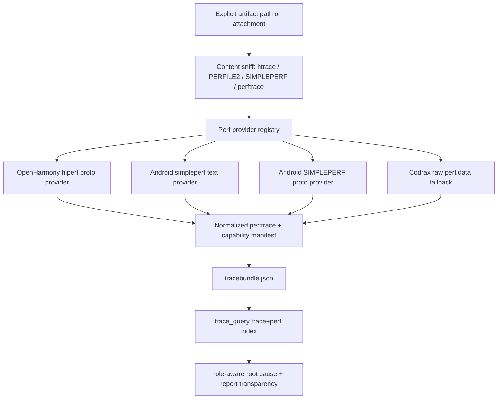

# Perf Sample Parser Capability Audit And Delivery Plan (2026-06-18)

## Scope

This document re-audits the `/Users/han/opt/perf_query.md` goal against current
Codrax code and public Harmony/OpenHarmony + Android perf-sample parser sources.
It deliberately treats the gap as an architecture problem, not as a single eval
patch:

```text
runtime trace / htrace / perf.data / report-sample artifact
        -> parser provider registry
        -> normalized perftrace + capability manifest
        -> trace_query trace+perf bundle
        -> role-aware root-cause handoff + report transparency
```

No user-intent decision should be made from a file suffix, keyword, or model
prose. Hard behavior must come from explicit structured request fields, readable
artifact content/magic, official adapter availability, and typed parser
capabilities.

## Reference Requirement

`/Users/han/opt/perf_query.md` asks Codrax to answer questions that current pure
trace analysis cannot answer alone:

- Which functions actually executed inside a runnable/running window?
- Which hot symbols/callchains belong to a wakeup-chain dependency?
- Which binder peer/server code path consumed sampled CPU?
- Which CPU samples support a frame root-cause bundle?

The requested system shape is:

```text
hiprofiler_data.htrace
        -> trace_convert
        -> *.perftrace
        -> trace_query EventPerfSample
        -> window_stats / perf_stats / perf_timeline / trace_perf_bundle
        -> root_cause_rank + frame_root_cause_bundle perf contexts
```

## Public Source Findings

### OpenHarmony / Harmony

- `developtools_hiperf` describes `hiperf` as an OpenHarmony command-line
  performance tool similar to Linux perf. It records sampling data to
  `perf.data`, provides `report`, `dump`, JSON/ProtoBuf report flows, host
  binaries such as `hiperf_host`, and symbol collection helpers:
  https://gitee.com/openharmony/developtools_hiperf
- `proto/report_sample.proto` defines the official hiperf protobuf report
  stream. `CallStackSample` exposes `time`, `tid`, repeated call-stack frames,
  `event_count`, and `config_name_id`. `VirtualThreadInfo` provides `tid/pid/name`.
  `SymbolTableFile` provides DSO path and function names. There is no sample CPU
  field:
  https://gitee.com/openharmony/developtools_hiperf/raw/master/proto/report_sample.proto
- `developtools_profiler` `TraceFileHeader` defines standalone payload data
  types. `HIPERF_DATA` is data type `1`, with a fixed 1024-byte header and
  standalone plugin name/version fields:
  https://gitee.com/openharmony/developtools_profiler/raw/master/device/services/profiler_service/src/trace_file_header.h
- The profiler hiperf plugin writes a standalone plugin file from
  `/data/local/tmp/perf.data`, marks it as `HIPERF_DATA`, and registers
  `hiperf-plugin` as standalone file data:
  https://gitee.com/openharmony/developtools_profiler/raw/master/device/plugins/hiperf_plugin/src/hiperf_module.cpp
- `report_protobuf_file.cpp` writes `PerfRecordSample` into the protobuf stream:
  sample time, tid, call frames, period/event count, config name, thread info,
  symbol files, and lost-statistic records:
  https://gitee.com/openharmony/developtools_hiperf/raw/master/src/report_protobuf_file.cpp

Implication: OpenHarmony htrace captures can embed raw `HIPERF_DATA` perf.data
payloads, but the commercially safe symbolized lane is still the official
`hiperf report --proto` provider. CPU identity is structurally unknown in that
official proto, so Codrax must expose `cpu_unknown` as a first-class quality fact
instead of treating CPU 0 as a fallback.

### Android

- AOSP `report_sample.py` reports samples in a perf-script-like text format and
  prints `thread_comm`, `pid/tid`, CPU, timestamp, period, event name, leaf
  symbol/DSO, and call-chain entries:
  https://android.googlesource.com/platform/system/extras/+/refs/heads/main/simpleperf/scripts/report_sample.py
- `simpleperf_report_lib.py` exposes `SampleStruct` fields including `ip`, `pid`,
  `tid`, `thread_comm`, `time` in ns, `cpu`, and `period`; symbol and call-chain
  structs expose DSO, symbol name, and frame ordering. It also documents
  trace-offcpu modes and metadata/build-id access:
  https://android.googlesource.com/platform/system/extras/+/refs/heads/main/simpleperf/scripts/simpleperf_report_lib.py
- Android simpleperf docs state that `report_sample.py` converts profiling data
  to perf-script text, while `simpleperf_report_lib.py` is the Python API for
  reading samples, symbols, call chains, record options, architecture, and meta
  strings:
  https://android.googlesource.com/platform/system/extras/+/refs/heads/main/simpleperf/doc/scripts_reference.md
- `report_sample.py` is itself a thin official wrapper over
  `GetReportLib(record_file)`, then consumes `GetNextSample`,
  `GetEventOfCurrentSample`, `GetSymbolOfCurrentSample`,
  `GetCallChainOfCurrentSample`, `GetTracingDataOfCurrentSample`, and
  `GetRecordCmd`. So Codrax's official text lane should execute the wrapper,
  while understanding that `simpleperf_report_lib.py` is the underlying library:
  https://android.googlesource.com/platform/system/extras/+/refs/heads/main/simpleperf/scripts/report_sample.py
- `simpleperf_report_lib.py` exposes both native `ReportLib` and proto-backed
  `ProtoFileReportLib`, including build-id, record command, arch, tracing data,
  thread, and symbol helper APIs:
  https://android.googlesource.com/platform/system/extras/+/refs/heads/main/simpleperf/scripts/simpleperf_report_lib.py
- `record_file.h` confirms the official reader owns attr id mapping, feature
  descriptors, build-id, cmdline, meta-info, file features, and
  `GetAttrIndexByEventId`:
  https://android.googlesource.com/platform/system/extras/+/refs/heads/main/simpleperf/record_file.h
- The generated `report_sample_pb2.py` declares `cmd_report_sample.proto` and the
  `SIMPLEPERF` report-sample proto record shape: `Sample`, `File`, `Thread`,
  `MetaInfo`, `ContextSwitch`, and lost records:
  https://android.googlesource.com/platform/system/extras/+/refs/heads/main/simpleperf/scripts/report_sample_pb2.py

Implication: the current text adapter is correct as one provider, but Android
has a richer official provider surface than the text regex alone. A production
system should treat text, raw perf.data, and `SIMPLEPERF` proto as separate
formats behind one provider registry.

## Current Codrax Coverage

Already implemented on current `main`:

- `trace_convert` extracts OpenHarmony standalone `HIPERF_DATA` sidecars from
  htrace-like captures.
- Official OpenHarmony hiperf adapter runs `report --proto` and manually reads
  the official `HIPERF_PB_` protobuf stream into `.perftrace`.
- Official Android adapter runs configured/discovered `report_sample.py` and
  normalizes the perf-script text into `.perftrace`.
- Raw perf.data fallback parses a bounded Linux/simpleperf-like subset:
  `PERFILE2`, attrs with matching sample layouts, attr id sections, `COMM`,
  `MMAP/MMAP2`, and sample fields such as IP, TID, TIME, CPU, PERIOD, and
  CALLCHAIN.
- `.tracebundle.json` can preserve `.systrace`, `.perf.data`, and `.perftrace`
  together.
- `trace_query` supports `EventPerfSample`, `event_types=["perf_sample"]`,
  `window_stats.perf_samples`, `perf_stats`, `perf_timeline`,
  `trace_perf_bundle`, root-cause candidate `perf_context`, role-aware
  `perf_contexts`, and frame-bundle perf roles.
- Prompt/schema/hints already teach that perf samples are supporting
  code-execution evidence, while scheduler overlap, wakeup-chain relevance,
  binder peer state, D-state/IO, CPU/core/frequency/affinity, and supply
  pressure remain the causal basis.
- Recent UX work exposes attached/request-path runtime artifacts in CLI/REPL and
  markdown/html reports and preserves runtime artifact paths as external
  observations rather than current-source facts.

## Initial Gaps Closed By This Plan

The following architecture gaps were found at the beginning of the audit and
are now closed on current `main` unless a residual caveat is explicitly stated:

1. **Provider selection and capability metadata.** Parser providers now emit
   `PerfProviderDecision` and `PerfArtifactCapability` through `Result`,
   `.tracebundle.json`, and `trace convert` output. Provider behavior is driven
   by parser mode, content-sniffed input format, official tool availability, and
   typed capability data, not by user-intent keywords or model prose.

2. **Direct perf input detection.** Direct raw `PERFILE2`, Android
   `SIMPLEPERF`, generated `.perftrace`, and tracebundle inputs are identified
   by content and typed artifact metadata, not only by suffix.

3. **Android SIMPLEPERF proto.** `SIMPLEPERF` report-sample protobuf files are
   first-class inputs. Codrax reads the public `cmd_report_sample.proto` fields
   needed for trace_query, emits `cpu_known=false` when CPU is not exposed, and
   separates `sample_kind=on_cpu|off_cpu|unknown`.

4. **Official Android tool integration.** `report_sample.py` remains the
   official executable wrapper, while `simpleperf_report_lib.py` is treated as
   the underlying library. If users configure the library path, Codrax resolves
   a sibling wrapper or reports an actionable `--perf-tools-status` caveat.

5. **Raw fallback hardening.** Raw `perf.data` fallback now parses matching
   multi-attr layouts, attr id sections, safe extra sample fields, feature
   metadata, exact-path build-id DSO labels, and record-order `COMM/FORK/EXIT`
   thread identity. Residual caveat: raw fallback still does not perform
   kernel/JIT/Java symbolization or fuzzy build-id/path joins; those remain
   official-tool responsibilities and are deliberately not inferred.

6. **Clock and off-CPU semantics.** Tracebundle clock alignment metadata and
   trace_query `perf_quality` expose `assumed|calibrated|unknown` confidence.
   Off-CPU samples are visible as `sample_kind=off_cpu` and must not be narrated
   as running CPU execution.

7. **UX and handoff transparency.** CLI/REPL runtime artifact status,
   `--perf-tools-status`, markdown/html runtime artifact tables, and
   AnswerDocument V2 all preserve provider/source/symbolization/CPU/clock/
   callchain/sample-kind caveats before hotspot prose.

8. **JSON repair boundary.** This delivery adds backend-owned output/status
   fields only. No model-authored provider filter was added; therefore no new
   trace_query JSON repair alias is required. If a future user-facing filter is
   introduced, it must be added to schema teaching and unified structured JSON
   repair together.

## Target Architecture



### Provider Capability Contract

Every perf-related artifact should carry:

- provider kind/name
- detected input format and output format
- time domain and alignment confidence
- thread identity quality
- CPU identity quality
- period/event weight semantics
- symbolization quality
- callchain quality
- DSO/build-id quality
- off-cpu semantics
- trace_query readiness
- degraded flag and caveats

This is typed data for backend consumption, not an LLM-authored input field.
Therefore it does not need a new `trace_query` JSON repair alias unless a future
view adds model-authored filters such as `perf_provider` or `sample_kind`.

### Causal Semantics

Perf samples answer "what code was sampled" inside an already-bounded runtime
candidate. They should support:

- target running/compute-supply explanation
- same-CPU competitor explanation during runnable delay
- on-chain dependency explanation inside wakeup chains
- binder peer/server explanation
- IO/D-state code-path annotation when samples overlap

They must not independently prove a scheduling root cause without interval,
chain, resource, binder, or supply evidence.

## Delivery Plan

### Batch A - Capability Contract And Content Detection

- [x] Add `PerfArtifactCapability` to converter artifacts and tracebundle JSON.
- [x] Detect direct perf inputs by content magic (`PERFILE2`, `SIMPLEPERF`,
  `perf_sample:`) instead of suffix/config-only triggers.
- [x] Mark raw `.perf.data` source artifacts as not trace_query-ready, and mark
  normalized `.perftrace` as trace_query-ready.
- [x] Expose provider/capability in `trace convert` artifact lines.
- [x] Add tests proving no-suffix raw perf.data and no-suffix SIMPLEPERF proto
  inputs are detected by content.

### Batch B - Provider Registry Refactor

- [x] Replace ad-hoc `maybeConvert*` calls with a small provider registry:
  `Detect -> Plan -> Convert -> Capability`.
- [x] Make provider selection explicit: official Harmony, official Android text,
  official Android proto, raw fallback, disabled.
- [x] Return a structured provider decision log in `Result` and tracebundle.
- [x] Keep selection driven by parser mode, content format, and tool availability;
  never by model prose or user intent keywords.

Batch B implementation notes:

- `PerfProviderDecision` is now a typed system output alongside
  `PerfArtifactCapability`, not a model-authored `trace_query` input field.
  Therefore it does not need prompt-side JSON repair aliases yet.
- `Result`, `.tracebundle.json`, and `trace convert` CLI output expose provider
  decisions with `selected/attempted/succeeded/fallback/trace_query_ready`,
  parser mode, input format, artifact path, reason, and caveat.
- Current registry entries cover `openharmony_hiperf_report_proto`,
  `android_simpleperf_report_sample`, future `android_simpleperf_report_proto`,
  `codrax_raw_perfdata`, and disabled perftrace generation. The Android proto
  entry is explicit but still implemented in Batch C.
- Selection remains based on structured parser mode, content sniffed input
  format, and tool availability. No user-intent keyword or model prose is used
  as a hard gate.

### Batch C - Android SIMPLEPERF Proto Provider

- [x] Add a provider for files starting with `SIMPLEPERF`.
- [x] Prefer official `simpleperf_report_lib.py` when available.
- [x] Add a bounded manual proto reader only for the public
  `cmd_report_sample.proto` fields needed by Codrax: sample time/thread/event
  count, callchain file/symbol ids, thread pid/tid/name, file path/symbols, meta
  event types, context_switch for off-cpu state.
- [x] Emit `sample_kind=on_cpu|off_cpu|unknown` from
  `MetaInfo.trace_offcpu` plus nearest per-thread `ContextSwitch`.
- [x] Add round-trip tests through trace_query.

Batch C implementation notes:

- Direct `SIMPLEPERF` content now uses `android_simpleperf_report_proto` before
  the older text adapter lane. The provider reads the official
  `cmd_report_sample.proto` stream directly and emits normalized
  `perf_sample` rows.
- The Android official text lane intentionally executes `report_sample.py`,
  because official sources show it is the wrapper over `simpleperf_report_lib.py`.
  If users configure or expose `simpleperf_report_lib.py`, Codrax resolves a
  sibling `report_sample.py` / `simpleperf_report_sample.py` / `report_sample`
  wrapper and records that provider source. If the wrapper is absent,
  `--perf-tools-status` explains that the library alone is not the executable
  adapter and points users at `--simpleperf-report-sample`.
- SIMPLEPERF proto samples intentionally emit `cpu=-1 cpu_known=false` because
  the official proto has no sample CPU field. This remains a typed quality fact,
  not a concrete CPU/core attribution.
- `trace_query` now parses `sample_kind`, includes it in perf examples and
  `perf_quality.sample_kinds`, and adds a caveat that `off_cpu` rows must not be
  narrated as running CPU execution.
- `sample_kind` is a trace_query output field and event-search pattern token.
  No model-authored filter field was added, so there is no new JSON repair alias
  to maintain in this batch.

### Batch D - Raw Fallback Hardening

- [x] Parse multiple perf attrs and event ids instead of first attr only.
- [x] Parse feature sections for build-id, cmdline, arch, and meta information
  when present.
- [x] Add COMM/FORK/EXIT lifetime repair where fixtures prove pid/tid identity
  would otherwise be wrong.
- [x] Improve mmap/build-id DSO labeling without inventing symbols.
- [x] Preserve unsupported sample bits as typed caveats instead of failing
  entire files when partial extraction is safe.

Batch D implementation notes:

- Raw fallback now parses `read_format` and safely skips `PERF_SAMPLE_READ`,
  `PERF_SAMPLE_RAW`, `PERF_SAMPLE_WEIGHT`, `DATA_SRC`, `TRANSACTION`,
  `PHYS_ADDR`, `CGROUP`, `DATA_PAGE_SIZE`, and `CODE_PAGE_SIZE` payload fields
  while preserving IP/TID/TIME/CPU/PERIOD/CALLCHAIN evidence.
- Skipped non-causal payload fields are emitted as `parser_caveats` on generated
  `perf_sample` rows so trace_query/event_search/handoff can keep degraded raw
  parser provenance visible.
- Unsafe variable-context fields such as regs, stack, aux, and branch stack
  remain fail-loud until attr-aware parsing is added; this avoids shifted
  records and invented symbols.
- Raw fallback now parses multiple attr entries when they share a sample layout,
  reads attr id sections, and maps `PERF_SAMPLE_IDENTIFIER` / `PERF_SAMPLE_ID`
  rows to the corresponding `event=` label. If multi-event attrs use different
  sample layouts, raw fallback fails loud and tells the user to use official
  hiperf/simpleperf tooling rather than risking shifted evidence.
- Raw fallback now reads bounded perf feature descriptors, extracts safe
  metadata for `FEAT_ARCH`, `FEAT_CMDLINE`, `FEAT_META_INFO`, and BUILD_ID
  record counts, and carries it through `parser_caveats`. BUILD_ID is not yet
  applied to DSO labeling because Linux/simpleperf build-id records have ABI
  quirks; without real fixtures, Codrax exposes the count and
  `build_id_dso_labeling=not_applied` instead of inventing symbol provenance.
- Raw fallback now binds `COMM` by record lifetime when samples are read, uses
  `FORK` to inherit known parent comm labels, and clears active labels on
  `EXIT`. This prevents later thread renames from rewriting earlier samples in
  generated `.perftrace` rows.
- Raw fallback now parses simpleperf/Linux-style BUILD_ID feature records enough
  to extract `filename -> build_id`, and only appends `#build_id=<hex>` to the
  DSO label when that filename exactly matches the mmap path selected for the
  sample IP. It does not infer symbols, rewrite paths, or apply fuzzy basename
  joins.

### Batch E - Time Alignment And Off-CPU Semantics

- [x] Add optional tracebundle clock alignment metadata:
  `perf_time_ns -> trace_seconds` offset/slope/confidence.
- [x] Teach trace_query to expose alignment status per perf context.
- [x] Separate on-cpu and off-cpu sample contexts so off-cpu sample weights do
  not get narrated as running CPU execution.
- [x] Add tests for assumed, calibrated, and unknown clock alignment.

Batch E implementation notes:

- Tracebundle JSON now emits `perf_clock_alignments` for every generated
  `.perftrace` artifact using provider capability metadata. Uncalibrated
  providers expose confidence such as `assumed` and do not invent offset/slope.
- `trace_query` already exposes per-context `clock` and `clock_confidence`
  through `perf_quality`; Batch C added `sample_kind` so off-cpu samples are
  visible and caveated instead of silently mixed into running CPU narration.
- Added helper-level coverage for assumed, calibrated, and unknown
  `perf_clock_alignments` states. Calibrated offset/slope values are still not
  invented without a capture-level clock map; the test only locks the typed
  confidence/caveat semantics.

### Batch F - UX, Prompt, Handoff, And JSON Repair

- [x] Update `--perf-tools-status` with install/check commands for hiperf,
  report_sample.py, symfs, kallsyms, and symbol roots.
- [x] Add docs showing official-first and raw fallback workflows.
- [x] Add report sections that summarize provider capabilities before hotspot
  prose.
- [x] If any provider-related filter becomes a model-authored `trace_query`
  field, add it to schema, enum aliases, and unified structured JSON repair.
- [x] Add low-prebake evals covering path-only, attachment, bundle, official
  symbolized, raw degraded, CPU-unknown, and no-suffix content-detected inputs.

Batch F implementation notes:

- Existing perf/runtime evals cover path-mentioned perftrace, simpleperf
  symbolized rows, raw fallback degraded rows, Harmony CPU-unknown rows, and
  runtime trace path handling.
- Added `trace_query_perf_quality_simpleperf_proto_offcpu` so SIMPLEPERF proto
  rows with `sample_kind=off_cpu` and `cpu_known=false` are guarded without
  giving the model a prewritten root-cause answer.
- Generated `.perftrace` rows now use `sample_weight=` for perf sample
  event/count weights. `trace_query` still accepts imported `period`,
  `sample_period`, `period_weight`, `event_count`, and `count` aliases, but all
  model-facing summaries, typed observations, trace_query examples, and runtime
  report notes render `sample_weight` / `total_sample_weight` so the model does
  not misread perf period values as elapsed time.
- CPU-unknown guidance now says samples cannot be attributed to any concrete
  CPU/core. It avoids negated concrete CPU names in prompts and caveats, while
  preserving real CPU0 evidence when actual trace rows carry `cpu=0`.
- `--perf-tools-status` now emits `check=`, `aux_check=`, `install=`, and
  `docs=` for the OpenHarmony hiperf official lane, Android simpleperf
  official lane, and Codrax raw fallback lane. `aux_check` covers symbol roots,
  symfs, and kallsyms quality dependencies. These are backend-owned status
  fields, not model-authored `trace_query` inputs.
- `docs/user_guide.md` already documents official-first, official-only, raw
  fallback, disabled-perftrace, and direct tracebundle analysis workflows; it
  now also explains the preflight `check/aux_check/install/docs` fields.
- Final answer documents now preserve `sample_kind`, `cpu_known/cpu_unknown`,
  source, symbolization, clock confidence, callchain quality, and DSO in the
  auto-materialized `Perf 证据质量` block. Markdown/HTML runtime artifact tables
  also surface off-CPU, CPU-unknown, and assumed/unknown clock-confidence
  details when they are present in perftrace rows.
- Confirmed this batch adds only backend-owned status/output fields. No
  model-authored provider filter was introduced, so the unified tool-call JSON
  repair layer needs no new alias/schema entry for this batch.
- Verification evidence captured on 2026-06-18:
  `go test ./...`, `make`, and four perf-quality evals in two-case batches all
  passed with `flagged=0`: `trace_query_perf_quality_harmony_cpu_unknown`,
  `trace_query_perf_quality_simpleperf_symbolized`,
  `trace_query_running_perf_context`, and
  `trace_query_perf_quality_raw_fallback`. The off-cpu SIMPLEPERF proto eval
  also passed after adding guards against `period=7000`, `7000ms`, and related
  elapsed-time misreadings.

## Acceptance Criteria

- Users can attach or mention Harmony/OpenHarmony/Android trace+perf artifacts
  without manually understanding sidecars.
- `trace_convert` reports what it generated, which provider was used, what the
  provider can and cannot guarantee, and which artifact should be passed to
  `trace_query`.
- `trace_query` consumes perf samples as role-aware execution context without
  changing scheduler/resource causality rules.
- Final reports preserve source/symbolization/CPU/clock/callchain caveats.
- Every model-authored input field is present in prompt teaching, schema, and
  JSON repair; output-only capability fields remain backend-owned.

## Completion Evidence

- Static/build verification on current `main`:
  `GOCACHE=/private/tmp/codrax-gocache go test ./...` and
  `GOCACHE=/private/tmp/codrax-gocache PYTHONPYCACHEPREFIX=/private/tmp/codrax-pycache make`.
- Targeted unit coverage includes official Android wrapper/library resolution,
  SIMPLEPERF proto off-CPU/CPU-unknown parsing, raw multi-attr event id mapping,
  safe skipped sample fields, raw feature metadata, exact-path build-id DSO
  labels, record-order `COMM/FORK/EXIT` comm lifetime, clock alignment states,
  report quality materialization, and runtime artifact report tables.
- Low-prebake eval cases cover raw fallback quality, SIMPLEPERF proto off-CPU
  quality, Harmony CPU-unknown quality, simpleperf symbolized quality, and
  running-window perf context. The latest verified runs on 2026-06-18 used
  two-case parallel batches and all passed with `flagged=0`:
  `perf_proto_offcpu_raw_after_eval_sample_weight_fixture_20260618_summary.md`,
  `perf_quality_harmony_simpleperf_sample_weight_20260618_summary.md`, and
  `perf_running_raw_sample_weight_20260618_summary.md`.
