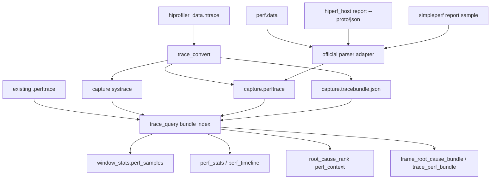

# Perf Sample Trace Query Integration Plan (2026-06-17)

## Goal

Build a commercial-grade, system-level perf sample lane for Codrax so a Harmony/OpenHarmony or Android trace question can join scheduler, wakeup, binder, IO, resource pressure, and sampled CPU call stacks in one deterministic `trace_query` evidence flow.

This is not a case-specific patch. The gap is architectural: current Codrax has a strong ftrace/systrace query engine, but CPU sampling data is a separate time-series artifact. The right fix is to normalize perf samples into the same typed runtime-artifact model, preserve provenance through handoff, and expose stable views and prompts so the model can consume the data without guessing.

## Source Material

### User Reference

`/Users/han/opt/perf_query.md` asks for:

- `hiprofiler_data.htrace -> trace_convert -> Perf Sample text -> trace_query -> Trace + Perf joint analysis`
- `EventPerfSample` and `event_types=["perf_sample"]`
- `window_stats.perf_samples.top_symbols/top_dso/top_callchains`
- root-cause and frame-bundle supporting evidence from CPU samples
- views such as `perf_stats`, `perf_timeline`, and `trace_perf_bundle`
- no separate analysis framework; reuse `trace_convert`, `trace_query`, `WindowStats`, `RootCauseRank`, and `FrameRootCauseBundle`

### OpenHarmony / Gitee

OpenHarmony's Gitee organization currently states that the community moved to GitCode on 2025-09-15 while Gitee still serves as a mirror. The useful mirrored repos for this work are:

- `openharmony/developtools_profiler`
- `openharmony/developtools_hiperf`
- `openharmony/docs` for user-facing tool documentation and subsystem context

Official links:

- https://gitee.com/openharmony
- https://gitee.com/openharmony/developtools_profiler
- https://gitee.com/openharmony/developtools_hiperf
- https://gitee.com/openharmony/docs

Key findings:

- `developtools_profiler/README_zh.md` documents `hiprofiler_cmd` with `plugin_name: "hiperf-plugin"` and `record_args` such as `-f 1000 -a ... --call-stack dwarf --clockid monotonic --offcpu -m 256`.
- `developtools_profiler/device/plugins/hiperf_plugin/src/hiperf_module.cpp` declares `hiperf-plugin` as `isStandaloneFileData=true`, default `outFileName="/data/local/tmp/perf.data"`, and writes that file with `WriteStandalonePluginFile(..., DataType::HIPERF_DATA)`.
- `developtools_profiler/device/services/profiler_service/src/trace_file_header.h` defines `DataType::HIPROFILER_PROTOBUF_BIN = 0`, `HIPERF_DATA = 1`, and `STANDALONE_DATA = 1000`; the header reserves 1024 bytes and records standalone plugin name/version.
- `developtools_hiperf/README.md` documents host output `hiperf_host` and `libhiperf_report.so`; the `report` command reads `perf.data` and converts it to JSON or ProtoBuf.
- `developtools_hiperf/proto/report_sample.proto` defines the official report protobuf stream with `CallStackSample{time, tid, callStackFrame, event_count, config_name_id}`, `VirtualThreadInfo{tid,pid,name}`, `SymbolTableFile{path,function_name}`, and `ReportInfo{config_name}`.
- `developtools_hiperf/src/report_protobuf_file.cpp` writes samples from `PerfRecordSample` into that protobuf stream; this is the best supported source for per-sample time, tid, period/event count, symbol file, and function names.

Implication: OpenHarmony `.htrace` does not expose hiperf samples as ordinary `ProfilerPluginData` rows. It embeds a standalone `perf.data` segment. Codrax must extract the standalone `HIPERF_DATA` payload, then use the official hiperf parser/export path when available. Hand-writing a full raw `perf.data` parser in Go is duplicate work and higher risk.

### Android / AOSP

AOSP `simpleperf` provides the corresponding Android parser vocabulary:

- https://android.googlesource.com/platform/system/extras/+/master/simpleperf/
- https://android.googlesource.com/platform/system/extras/+/master/simpleperf/scripts/report_sample.py
- https://android.googlesource.com/platform/system/extras/+/master/simpleperf/scripts/simpleperf_report_lib.py

- `SampleStruct` includes `ip`, `pid`, `tid`, `thread_comm`, `time` in ns, `cpu`, and `period`.
- `SymbolStruct` includes `dso_name`, `symbol_name`, and addresses.
- `CallChainStructure` exposes call-chain entries with symbols.
- `report_sample.py` demonstrates a stable text report shape: `comm pid/tid [cpu] timestamp: period event:` followed by symbol and call-chain lines.
- `simpleperf_report_lib.py::SampleStruct` exposes `ip`, `pid`, `tid`, `thread_comm`, `time` in ns, `cpu`, and `period`.
- `simpleperf_report_lib.py::SymbolStruct` exposes `dso_name`, `symbol_name`, symbol addresses, and mapping information.
- `simpleperf_report_lib.py::CallChainStructure` documents that for a runtime stack `A -> B -> C`, call-chain entries are emitted as `[B, A]`; the current sample symbol is `C`.

Implication: Android should use a simpleperf adapter rather than a Codrax-owned raw perf parser. Both Harmony hiperf and Android simpleperf can normalize into one Codrax `perftrace` text format.

## Current Codrax Flow

### `trace_convert`

`cmd/trace_convert.go` calls `internal/hitraceconv.ConvertFile`. The converter parses binary hitrace metadata, event formats, cmdlines, tgids, and raw ftrace pages, then renders known ftrace events. Batch D1/D2 extend this from one output into a multi-artifact result:

- `.systrace` for ftrace-compatible scheduler/trace rows when the input contains a supported binary hitrace container.
- `.perf.data` sidecars for standalone OpenHarmony profiler blocks with `TraceFileHeader::DataType::HIPERF_DATA`.
- `.perftrace` sidecars when an official `hiperf_host` / `hiperf` adapter is configured or found and can export `report --proto`.
- Android direct `perf.data` sidecar-only conversion when an official `simpleperf/scripts/report_sample.py` adapter is configured or found.
- `.tracebundle.json` provenance that lists all generated artifacts and caveats.

### `trace_query`

`internal/tracequery` has:

- `EventType` for sched, binder, trace_mark, block IO, filesystem, storage, IRQ, workqueue, DMA fence, resource/plugin events, and related signals.
- `Event` fields for scheduler state, wakeups, binder IPC, IO inode fields, block/storage latency, resource observations, plugin metrics, and trace spans.
- `WindowStats`, `RootCauseRank`, and `FrameRootCauseBundle` with scheduler, wakeup-chain, state-churn, runnable context, CPU supply, IO pressure, IRQ, workqueue, trace-mark, and resource sections.

It does not have:

- `EventPerfSample`
- parsed sample fields such as `period`, `event`, `symbol`, `dso`, `ip`, `callchain`
- `window_stats.perf_samples`
- perf-aware root-cause or frame-bundle handoff
- `perf_stats`, `perf_timeline`, or `trace_perf_bundle`

### Tool Schema / Prompt / JSON Repair

`internal/tool/trace_query.go` already sends tool calls through `applyStructuredPayloadCompat` before strict decoding. Schema-driven repair supports enum style aliases, explicit enum aliases, and split-string arrays. Therefore every new model-facing field must be represented in the `trace_query` schema, enum aliases, and hint/prompt teaching. Output-only fields do not need model JSON repair.

Current prompt teaching in `internal/skill/defaults.go` and `internal/skill/trace_query_views.go` covers trace spans, scheduler, binder, IO, runnable context, state churn, and path-based trace questions. It does not teach how to request perf sample views or how to interpret perf context as supporting evidence instead of a standalone hard root cause.

## System-Level Gaps

1. **Single-artifact trace model**: current code assumes one text trace file. Perf sample data may be a sidecar file or a standalone segment inside `.htrace`. The system needs a bundle model with systrace plus perftrace provenance.

2. **Converter output model**: `trace_convert` writes exactly one `.systrace`. It must be able to produce `.systrace`, `.perftrace`, and a small bundle metadata file without requiring the user to understand the split.

3. **Perf parser lane**: no `perf_sample` event type or parser exists. Without a normalized event, every downstream view would need ad-hoc parsing.

4. **Aggregation and ranking**: window stats and root-cause ranking cannot explain "what code was executing" during running, runnable competitors, binder peers, or wakeup-chain dependencies.

5. **Handoff preservation**: frame and root-cause bundles do not carry top symbols/callchains tied to target/on-chain/server/competitor roles, so rich sample evidence would be lost before final answer generation.

6. **Official parser reuse**: OpenHarmony and Android already provide parsers. Codrax should wrap their output into a stable internal text format instead of owning raw `perf.data` parsing first.

7. **Prompt/schema repair**: new views and filters must be taught and accepted through the unified JSON repair layer. The model should not need to remember exact spellings such as `perf_sample` vs `cpu_sample` when a safe alias can map them.

8. **CLI/REPL mental burden**: users should be able to provide a `.htrace`, `.perftrace`, `.perf.data`, or explicit path in a question and have Codrax attach/discover the relevant runtime artifacts. They should not have to switch modes or manually correlate sidecars.

## Target Architecture



### Normalized `perftrace` Text

Codrax-owned text format, one sample per line, ftrace-like enough for `trace_query` to parse and grep:

```text
app-5678 ( 1234) [005] .... 928.081774: perf_sample: pid=1234 tid=5678 cpu=5 period=10000 event=cpu-cycles symbol=Foo::bar dso=libfoo.so ip=0x1234 callchain=main;A;B;Foo::bar
```

Rules:

- Timestamp is seconds, same unit as ftrace/systrace. Harmony hiperf `time` from monotonic ns converts to seconds.
- `pid` is process id when known; `tid` is sampled thread id.
- `period` is the sample weight/event count. If absent, count each sample as period 1.
- `event` is the hardware/software event name such as `cpu-cycles`.
- `symbol` is the leaf/hot function; `dso` is the mapped binary/library.
- `callchain` is semicolon-separated from root to leaf when the adapter can determine order; parser records the raw string and does not infer missing frames.
- Values may be quoted when they contain whitespace. Parser must preserve symbol/dso text and avoid path invention.

### Event Model

Add `EventPerfSample` and perf fields to `tracequery.Event`:

- `perf_pid`, `perf_tid`, `perf_comm`
- `perf_period`, `perf_event`
- `perf_symbol`, `perf_dso`, `perf_ip`
- `perf_callchain`
- optional `perf_source` and `perf_clock`

The raw `FieldText` remains available for event_search. `event_types=["perf_sample"]` filters only sample rows.

### Aggregation

Add a reusable `PerfContext`:

```json
{
  "sample_count": 0,
  "total_period": 0,
  "top_symbols": [],
  "top_dso": [],
  "top_callchains": [],
  "top_threads": [],
  "top_events": [],
  "coverage": {}
}
```

Each hotspot row should carry:

- `symbol`, `dso`, `event`
- `sample_count`, `period`, `percent`
- `threads`, `cpus`
- `line_start`, `line_end`, `example`

`window_stats.perf_samples` is the broad same-window summary. Role-specific contexts should be separate in causal views:

- `target_running_perf`: samples on the target thread while it was running
- `on_chain_perf`: samples on wakeup-chain dependency threads
- `binder_peer_perf`: samples on synchronous-looking binder peer/server threads
- `same_cpu_competitor_perf`: samples on threads running on CPUs relevant to target runnable delay

### Causal Semantics

Perf samples are supporting evidence for "what was executing"; they are not by themselves proof of a scheduling root cause.

Use them as:

- running-state explanation: target spent CPU in top symbols during frame/startup window
- runnable-delay explanation: same-CPU competitors or waker threads consumed CPU in top symbols during target wait
- wakeup-chain explanation: on-chain upstream dependency thread was runnable/running/D-state plus had hot callchain evidence
- binder explanation: blocking candidate shows peer/server state and peer samples
- IO explanation: D-state/iowait plus IO pressure remains primary; samples annotate code path if present

Ranking still starts from deterministic intervals, overlap, and chain relevance. Perf contexts attach to ranked candidates and help explain code-level hotspots.

### Tool Views

Add three views:

- `perf_stats`: aggregate samples in a window by symbol, dso, callchain, thread, CPU, and event.
- `perf_timeline`: bucket sample periods by time for a target thread, process, CPU, event, symbol, or dso.
- `trace_perf_bundle`: line-backed joint bundle combining window stats, root-cause rank, wakeup/binder chain evidence, and role-specific perf contexts.

Existing views should be enhanced:

- `window_stats`: include `perf_samples`.
- `root_cause_rank`: attach `perf_context` to relevant candidates without making samples a standalone hard gate.
- `frame_root_cause_bundle`: include role-specific perf contexts and next-call guidance.
- `event_search`: support `event_types=["perf_sample"]` and literal search over symbol/dso/callchain/thread/event.

### Converter / Adapter Strategy

Batch implementation should prefer official parsers:

1. `.perftrace` direct parser: always available; tests and evals can use synthetic text.
2. `.htrace` standalone extractor: find nested `TraceFileHeader` with `DataType::HIPERF_DATA` and write the payload as `.perf.data`.
3. OpenHarmony adapter: call configured/discovered `hiperf_host` or `hiperf` as `report --proto -i <perf.data> -o <perf.proto>`, then parse the official `report_sample.proto` stream into `.perftrace`.
4. Android adapter: call configured/discovered `simpleperf/scripts/report_sample.py`, then convert official text output to `.perftrace`.
5. Codrax raw `perf.data` fallback: parse a narrow, explicitly versioned subset of raw perf records only when official adapters are unavailable or disabled and the user asks for local conversion. This is a lower-confidence extraction lane, not a replacement for official symbolization.

### OpenHarmony Adapter Contract

Implemented D2 path:

- `Options.HiperfPath` or `CODRAX_HIPERF_HOST` selects the official host tool; otherwise the converter looks for `hiperf_host` then `hiperf` on `PATH`.
- `Options.HiperfSymbolDirs` / CLI `--hiperf-symbol-dir` passes symbol roots through `--symbol-dir`.
- CLI `--no-perftrace` disables adapter invocation and preserves only `.perf.data`.
- The adapter command is executed without a shell: `report --proto -i <perf.data> -o <temp.proto>`.
- Codrax parses only the official protobuf stream header `HIPERF_PB_`, version `1`, and `HiperfRecord` fields from `developtools_hiperf/proto/report_sample.proto`.
- `CallStackSample.time` ns becomes the ftrace-style seconds timestamp.
- `VirtualThreadInfo` provides pid/tid/name.
- `SymbolTableFile` provides dso path and function names.
- `ReportInfo.config_name` provides event name.
- `CallStackSample.event_count` becomes `period`; missing/zero period is normalized to `1`.
- OpenHarmony report protobuf does not carry a guaranteed CPU id, so generated `.perftrace` rows use prefix CPU `000` but explicit `cpu=-1`. `trace_query` consumes `cpu=-1` as unknown rather than attributing samples to CPU0.
- `sample.callStackFrame[0]` is treated as the leaf/hot frame, matching hiperf report's non-callstack path. The stored `callchain` is reversed into root-to-leaf text for model consumption.

If the official adapter fails or is not available, conversion still succeeds for `.systrace` / `.perf.data` and emits a caveat. This keeps trace conversion stable while avoiding false confidence in raw perf parsing.

### Android Simpleperf Adapter Contract

Implemented D3 path:

- `Options.SimpleperfReportPath` or `CODRAX_SIMPLEPERF_REPORT_SAMPLE` selects the official AOSP `simpleperf/scripts/report_sample.py` script or a compatible executable wrapper.
- `Options.SimpleperfPythonPath` or `CODRAX_SIMPLEPERF_PYTHON` selects the Python executable when the report adapter path ends in `.py`; otherwise the adapter is executed directly without a shell.
- `Options.SimpleperfSymfsDir` and `Options.SimpleperfKallsymsPath` pass through `--symfs` and `--kallsyms`.
- CLI flags are `--simpleperf-report-sample`, `--simpleperf-python`, `--simpleperf-symfs`, and `--simpleperf-kallsyms`.
- Direct Android `perf.data` inputs are sidecar-only: `trace_convert` emits `.perftrace` and `.tracebundle.json`, but no fake `.systrace`.
- Codrax parses only official `report_sample.py` text output:
  - sample header: `<comm>\t<pid>/<tid> [<cpu>] <sec>.<usec>: <period> <event>:`
  - first symbol row: sampled/leaf function
  - following symbol rows: callchain entries emitted by simpleperf
- The normalized `callchain` reverses simpleperf callchain entries into root-to-leaf order and appends the leaf sample symbol, so model-facing output matches Harmony hiperf `callchain` semantics.
- Sample CPU is taken from `SampleStruct.cpu`, so Android `.perftrace` rows carry real CPU ids when available.

As with OpenHarmony, the official simpleperf report library remains the source of truth for complete symbols, Java/ART frames, unwinding, symfs, and kallsyms.

### Raw Perf.Data Fallback Strategy

The user experience should support two explicit options:

1. `official_adapter` (default/preferred): use `hiperf_host` / `hiperf` / `simpleperf report_sample.py`, then normalize to `.perftrace`.
2. `raw_perfdata_fallback` (Codrax-owned fallback): parse raw `perf.data` directly enough to produce a degraded `.perftrace` when official tools are unavailable.

The fallback must be honest and typed:

- It must emit `source=raw_perfdata_fallback`.
- It must add `symbolization_status=unsymbolized|partial|build_id_only|symbolized` once the perf sample event model carries that field.
- It should preserve `ip`, `pid`, `tid`, `cpu`, `period`, `time`, event name/id, and callchain IPs when sample_type contains them.
- It may use `PERF_RECORD_COMM`, `PERF_RECORD_MMAP/MMAP2`, and build-id feature sections for partial DSO labels, but it must not invent function names.
- It should emit clear caveats when symbols/callchains/time/cpu are unavailable in the file's `sample_type`.
- It should not parse model prose or user intent; selection is by explicit CLI/env/config option, adapter availability, and file format validation.

Raw fallback task list:

- [ ] Add `internal/perfdata` with a bounded reader for Linux/simpleperf perf.data headers, attrs, data section records, and selected feature sections.
- [ ] Support sample records for `PERF_SAMPLE_IP`, `TID`, `TIME`, `ADDR`, `ID/IDENTIFIER`, `CPU`, `PERIOD`, and `CALLCHAIN`.
- [ ] Support side-band `COMM`, `MMAP/MMAP2`, `FORK/EXIT` enough to label pid/tid/comm and DSO ranges.
- [ ] Normalize fallback samples to `.perftrace` with `source=raw_perfdata_fallback`.
- [ ] Add CLI `--perf-parser=auto|official|raw` (or equivalent config) so users can choose dependency-first or local fallback behavior without prompt guessing.
- [ ] Add parser tests from synthetic perf.data fixtures and a real small fixture if licensing permits.
- [ ] Teach trace_query prompts that raw fallback samples are lower confidence execution context.

## JSON Repair / Prompt Contract

Model-facing additions must enter all three surfaces:

- schema: `view` enum and aliases for `perf_stats`, `perf_timeline`, `trace_perf_bundle`; `event_types` description and aliases for `perf_sample`, `cpu_sample`, `sample`, `top_symbols`, `callchain`.
- repair: rely on existing `applyStructuredPayloadCompat` plus schema markers; add tests that string arrays and friendly aliases normalize correctly.
- prompt/hints: teach when to use perf views, how to interpret perf context, and that `.htrace`/`.perf.data`/`.perftrace` path questions should stay on runtime-artifact tooling.

Do not add hard gates that inspect model prose. Use typed tool fields and deterministic output only.

## Batches

### Batch A: Core Perftrace Parser and Window Aggregation

- Add `EventPerfSample` and perf fields.
- Parse `perf_sample` ftrace-like lines.
- Add `event_types=["perf_sample"]`.
- Add `PerfContext` aggregation and `window_stats.perf_samples`.
- Add parser/window unit tests.

### Batch B: Tool Views, Schema, Prompt, and Repair

- Add `perf_stats`, `perf_timeline`, and `trace_perf_bundle` view enum rows.
- Update `internal/skill/trace_query_views.go` and trace-query-first prompt teaching.
- Add enum aliases and event type aliases in schema/normalization tests.
- Add summary/hint output so empty perf results guide the next call.

### Batch C: Causal Join and Handoff

- Attach perf contexts to root-cause candidates by interval overlap, pid/tid/cpu, and chain relevance.
- Add role-specific perf contexts to `FrameRootCauseBundle`.
- Add binder peer/server sample join for sync-looking blocking candidates.
- Add same-CPU competitor sample join for runnable root causes.
- Preserve top evidence rows with lines/examples.

Status: implemented. `RootCauseRankItem.perf_context` is populated after deterministic scheduler/wakeup ranking, using the candidate thread and candidate time window so sample hotspots annotate causes without becoming the cause. `FrameRootCauseBundle` now carries broad `perf_samples` plus role-specific `target_running_perf`, `on_chain_perf`, `binder_peer_perf`, and `same_cpu_competitor_perf`. Tool summaries, evidence facts, typed observations, schema descriptions, and prompt/view-matrix teaching all describe these as supporting execution context.

### Batch D: Converter Multi-Artifact Output

- Extend `hitraceconv.Result` to report multiple outputs.
- Extract standalone `HIPERF_DATA` payloads from `.htrace` into `.perf.data`.
- Add adapter command plumbing for `hiperf_host` and simpleperf when configured/found.
- Emit `.perftrace` and `.tracebundle.json` with provenance.
- Keep `.systrace` behavior stable for traces without perf data.

Status: in progress. D1 landed multi-artifact result metadata, official `TraceFileHeader` scanning for `DataType::HIPERF_DATA`, `.perf.data` sidecar extraction, `.tracebundle.json` provenance output, CLI/REPL artifact reporting, and converter tests for both systrace+perf and standalone-only perf inputs. Remaining D work is the official parser adapter path that turns extracted `.perf.data` into normalized `.perftrace`.

D2 landed the OpenHarmony hiperf adapter path: `ConvertFile` can now run a configured/discovered official `hiperf_host`/`hiperf report --proto`, parse the official `report_sample.proto` stream without adding a new dependency, emit `.perftrace`, include it in `.tracebundle.json`, and preserve `.perf.data` with caveats. CLI supports `--hiperf-host`, `--hiperf-symbol-dir`, and `--no-perftrace`; REPL keeps the simple `/htrace convert` form and directs users to CLI when a specific official adapter path is needed.

D3 landed the Android simpleperf adapter path: direct `perf.data` inputs can now be converted through official `report_sample.py` output into normalized `.perftrace` without generating a fake systrace. CLI supports `--simpleperf-report-sample`, `--simpleperf-python`, `--simpleperf-symfs`, and `--simpleperf-kallsyms`; tests cover both parser round-trip and direct adapter sidecar bundle generation.

### Batch E: CLI/REPL and Attachment UX

- Auto-discover sibling `.perftrace` / `.tracebundle.json` when users attach or mention a trace path.
- Keep read mode default; do not require users to enter write mode for analysis.
- Ensure explicit path questions with one or more runtime artifacts route to `trace_query(path)` instead of source-code analysis.
- Update user guide examples.

Status: in progress. `tracequery.BuildIndex` now accepts `.tracebundle.json` directly, promotes `*.systrace` / `*.perftrace` to a sibling `*.tracebundle.json` when present, and auto-merges sibling `*.systrace + *.perftrace` pairs when no bundle exists. The merge keeps existing parser/view code as the single consumer, so model tool calls can pass one path and still get joint trace+perf context.

### Batch F: Evals and Regression Guard

- Add minimal synthetic perftrace evals without over-prebaked analysis.
- Add trace+perf bundle eval covering runnable + waker samples.
- Add binder peer perf eval.
- Add `.htrace` converted sidecar fixture eval once converter support lands.
- Run selected existing trace evals in pairs to guard no regression in trace-only flows.

## Test Plan

Unit tests:

- `go test ./internal/tracequery`
- `go test ./internal/tool -run TraceQuery`
- `go test ./internal/hitraceconv`

Coverage targets:

- parser accepts `perf_sample` text and preserves symbol/dso/callchain
- `event_search` finds samples by symbol, dso, callchain, and event type
- `window_stats.perf_samples` reports top symbols/dso/callchains
- `perf_stats` and `perf_timeline` are line-backed and bounded by time/thread/pid filters
- `root_cause_rank` keeps scheduler/chain ranking primary while attaching perf context
- `frame_root_cause_bundle` preserves on-chain and binder-peer perf context
- `trace_convert` emits sidecar perf artifacts only when data exists
- schema repair accepts friendly aliases and split-string `event_types`

Eval targets:

- a direct `.perftrace` query
- a trace + perf sidecar query with runnable delay and same-CPU competitor samples
- a wakeup-chain query with on-chain thread samples
- a binder wait query with peer/server samples
- existing Donghu/Harmony trace cases, state-churn cases, inode IO cases, and explicit path trace cases

## Delivery Checklist

- [x] Batch A implemented, committed, pushed.
  - Landed `EventPerfSample`, normalized perf sample fields, `event_types=["perf_sample"]`, `window_stats.perf_samples`, summary/evidence/typed-observation handoff, prompt/schema teaching, JSON-repair aliases, and unit tests.
- [x] Batch B implemented, committed, pushed.
  - Landed `perf_stats`, `perf_timeline`, and `trace_perf_bundle` views, view aliases through schema repair, prompt/view-matrix teaching, empty-result perf hints, summary rendering, and view tests.
- [x] Batch C implemented, committed, pushed.
  - Landed candidate-level `perf_context`, frame bundle role contexts, summary/evidence/typed-observation handoff, prompt/schema teaching for the new output fields, and synthetic tests for root-cause and role-specific perf joins.
- [ ] Batch D implemented, committed, pushed.
  - [x] D1 converter sidecar extraction and bundle metadata implemented, committed, pushed.
  - [x] D2 OpenHarmony official hiperf adapter to normalized `.perftrace` implemented.
  - [x] D3 Android/simpleperf adapter parity implemented.
- [ ] Batch E implemented, committed, pushed.
- [ ] Raw perf.data fallback designed, implemented, committed, pushed.
- [ ] Batch F evals added and representative cases run two at a time.

## Open Decisions

- Runtime config-file keys for perf adapters beyond CLI/env. Current implementation supports explicit CLI flags, env vars, and PATH discovery.
- Whether `trace_perf_bundle` should be a new concrete view or an alias to enhanced `frame_root_cause_bundle` when a frame/span window is selected. Initial plan keeps it concrete because non-frame startup/binder/runnable windows also benefit from joint output.
