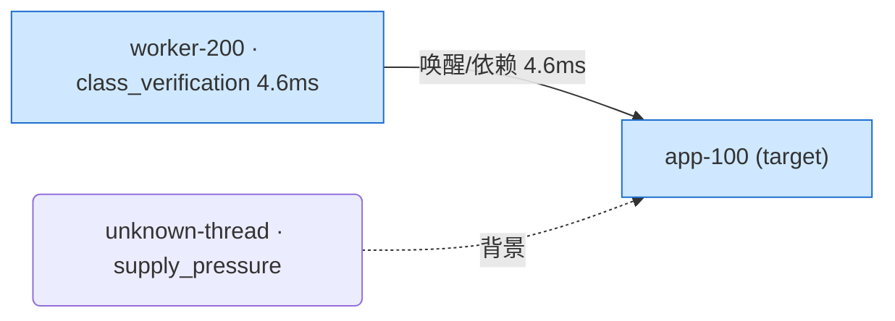
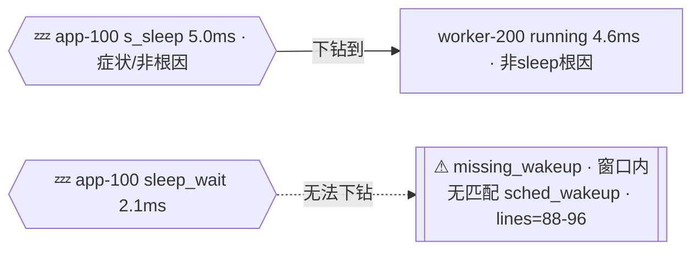

# Trace 分层根因下钻方法论 —— 现状审计与优化建议(2026-07-01)

> 本文档是**只读代码审计**的产出,不包含任何代码改动。审计对象是 `internal/tracequery/`(引擎,~11700+1583+2377+634 行)、`internal/tool/trace_query.go`(工具外壳+teaching prompt,~5900 行)、`internal/skill/`(软引导 prompt)、`internal/types/observation_ledger.go` / `trace_causal_projection.go` / `trace_observation_coverage.go`(typed 载体)、`internal/tool/answer_document_mutation_runtime.go`(finalize 期自动注入)、`internal/agent/answer_document_evaluator.go`(finalize 软引导)。审计基线是 `origin/main@abedbc7b`(2026-07-01 09:38,审计过程中仓库仍在演进,§6 记录了审计期间实时落地的修复)。
>
> **v2 更新**:补充审计 on-chain 三种终止状态(Runnable/Running/D-state·IO-wait)各自"下一跳"应识别的具体根因——Runnable 的优先级反转(含鸿蒙/东湖优先级语义)、Running 的算力供给与 perf_sample/代码对照深挖、IO 的聚类 inode 定位。发现原先 §2.3/§4-O3 把这三个状态一概判定为"终止节点、无下一跳"过于笼统:实际上 `buildRootCauseRankFrom` 用了一种**不同于 `expandChain` 图遍历的并行独立候选流 + on-chain 线程集合过滤**模式,已经让算力供给(compute_supply)和聚类 inode(file_io_hot_inode/block_io_by_inode)在依赖线程本身或已被 sleep 链发现的线程上生效;唯独 Runnable 的优先级比较未被同样接入。详见 §2.3.1-§2.3.3(新增)与修订后的 §4-O3。
>
> **v3 更新**:新增 §2.8"数据溯源"——把 §2 每个计算指标逐一回溯到具体的原始 `EventType` 和内核/用户态 tracepoint 名称(状态判定唯一来自 `sched_switch`、唤醒链来自 `sched_wakeup`/`sched_waking`、D-state/IO 原因来自 `sched_blocked_reason`、算力供给来自 `cpu_frequency`/`cpu_idle`、Binder 来自 6 个 `binder_*` 事件、IO 聚类来自 `f2fs_*`/`android_fs_*`/`ext4_*` 等文件系统事件叠加 `block_rq_*` 存储层事件、JIT/VerifyClass/shader 语义 span 来自对通用 `trace_mark` 文本做模式匹配、CPU Profiling 来自转换阶段拼装的合成 `perf_sample` 行,等等)。附带发现两点值得记录的数据侧限制:①语义 span 识别没有独立内核事件兜底,是弱类型文本匹配;②Workqueue/DMA Fence 目前只有计数,没有专属结构化字段提取。
>
> **v4/v5 更新**:响应本文档 §2.6.2/O1 提出的容量短板,仓库代码侧实际做了两轮 `trace_query 关键观测核对`/`TraceCausalProjection` 容量扩容(细节见 §2.6.2 与 §6),文档随之同步了最新的 cap 数值。
>
> **v6 更新**:新增 R8(用户显式时间窗必须严格遵守,不能因 VSYNC/帧边界误缩窗)、R9(帧信息 + 显式时间窗同时给出时应取并集)两条规则及对应审计 §2.9。结论:**R8 已满足**——排查了三处会重新计算时间窗的入口(`resolveSpanWindowsForQuery`/`ResolveFrameTarget`/`FrameWindowAutoDerived` 置位条件),全部以"用户是否已显式给出 time_start/time_end"为精确 typed 开关,没有发现"因检测到帧边界而悄悄收窄显式窗口"的代码路径;同时发现一处相关但不同的深度覆盖风险——`interestingIntervals` 会把窗口内目标线程的时间线按状态打分后只取 Top-N 子区间参与递归展开,窗口元数据本身没被收窄,但递归下钻的实际覆盖深度可能小于完整用户窗口。该风险后续已由 v7 的 caveat-only 可观测化修复,不再是静默裁剪。R9 在 v6 审计时未实现,后续 v7/v8 已补齐并集逻辑与 explicit-0 回归测试。
>
> **v7 更新(本批实际修复代码,非纯审计)**:先探索既有代码(`priorityRelation`/`dependencyPriorityRelation`/`threadPriorityNear`/`runnableContextForThread`/`unionTimeWindows` 等既有原语)确认可复用后,修复了 O1、O3、O7、O9(剩余的 `resolveSpanWindowsForQuery` 一侧)、O10(caveat-only 部分),每项都补了新单元测试且全仓 `go build ./... && go test ./...` 全绿。**O2 复核后判定不是真缺口并撤销**(详见 §2.2 更新)。逐项:
> 1. **O1**:`boundTraceMarkSpans` 让 `computeTraceMarks` 的语义 span(jit/verify/shader/runtime compile)单独占 16 个名额,不再和普通 span 抢 8 个名额的时长排名(§2.6.3)。
> 2. **O3**:新增 `applyRunnableTopPriorityInversion`,对 `stats.RunnableTop` 直接候选调用既有的 `runnableContextForThread`(取 `SameCPUTopRunning`)+ `threadPriorityNear` + `dependencyPriorityRelation`,命中鸿蒙/东湖语义下的"竞争者优先级更低"时重分类为已被下游识别为 co-primary 的 `priority_inversion_runnable_wait`(§2.3.1)。
> 3. **O7**:新增 `traceSpanNearMissesSemanticWorkClassification`,对形似编译/校验/shader 但未命中任何具体模式的 span 名追加一条有界(≤3 例)命名漂移 caveat,纯 advisory,不影响任何排序/tier(§2.8)。
> 4. **O9 补完**:把 `ResolveFrameTarget` 已有的 `unionFrameTargetWindows` 提升重命名为通用的 `unionTimeWindows`,同款并集逻辑接到 `resolveSpanWindowsForQuery`(`span_name` + 显式窗口同时给出的场景),不再是"两者都给就直接用显式窗口、丢弃 span 自身边界"(§2.9.2)。
> 5. **O10**:`interestingIntervals` 新增返回值 `qualifying`(截断前的候选总数),`buildWakeupChainWithCache` 在 `qualifying > len(branches)` 时追加一条明确的"N 个候选区间未被递归展开"caveat,不改变截断算法本身(§2.9.1)。
> 6. **O2 撤销**:复核发现 `scheduler_latency_stats`/`critical_blocking_calls`(Runnable/D-state/IO-wait 的推荐 view)都是单次有界聚合、不是像 `wakeup_chain` 那样的多跳递归图遍历,只对碎片化 sleep 做非递归例外是正确设计,不是缺口——被现有测试 `TestStateDrilldownRuleMatrixPinsRecentTracePolicies` 验证锁定,未做改动。
>
> O4(投影显式携带请求窗口)、O6(架构文档补章节)判断为下一批处理,详见 §4。
>
> **v8 更新(第二批实际修复,先跑 8-agent 设计+完备性 workflow 再动手)**:动手前用多智能体 workflow 对每个剩余 gap 产出经对抗验证的 diff 级实现规范 + 完备性批判,再实现。本批:
> 1. **v7 O9 回归修复(最高优先级,completeness critic 发现)**:`unionTimeWindows` 用 `out.StartTs <= 0` 当"未设置",把用户显式 `time_start=0`(`TimeStartSet=true` 可达)误当未设置被 span 起点顶替 → 违反 R8。改为纯几何 min(带 `b.StartTs > 0` 防呆),补 `TestSpanWindowExplicitZeroStartNotShrunkByUnion` + `TestUnionTimeWindowsPreservesExplicitZeroStart` 红转绿(§2.9.2)。
> 2. **R3 显著性阈值**:`StateDrilldownStep` 新增 `WindowProportion`(占窗口比例,clamp[0,1])+ `Significant`(top 状态恒真;低 rank 需过 `stateDrilldownSignificantFloor=0.05` 或 `stateDrilldownSignificantTopRatio=0.25`),从 `stats.Window` 推导 windowMs 不改签名;6 处 lockstep 同步(struct/render/banner/typed emitter/ledger 白名单/skill prompt)。R4 不删任何步骤(§2.1)。
> 3. **O4 投影窗口标注**:`TraceCausalProjectionNode` 新增 `StartTs`/`EndTs`(解析 window RichNote)+ `WithinRequestedWindow *bool`(三态);anchor 唯一精确源 = `frame_target_resolution`(`window_source=query_window` 或 R9 union 白名单),交集语义,无 anchor 保持 nil 不臆造;渲染 tag 仅在非 nil 时追加(§2.5)。
> 4. **O5 端到端渲染测试**:`TestApplyAndPersistMutation_LowImpactSemanticSpanSurvivesToRenderedText` 走 observation→projection→`RenderAnswerDocument` 最终 markdown,断言 2ms 语义 span 的"确定性优化点"+span 名存活(同时覆盖 O4 tag 渲染)。
> 5. **O6 架构文档**:`docs/architecture.md` 新增 §7.2.1 trace_query 分层下钻纲要。
>
> **v11 更新(2026-07-02,工具面 carrier 修复)**:修复路径引用型大 trace(`request_path` preflight,无 `--htrace`、无内联 PerfTrace)在 explore 阶段看不到 `trace_query` 的工具面盲区。新增 `RuntimeArtifactPreflightProfile.HasTraceArtifact()` 作为唯一 typed preflight kind helper;`trace_query` 工具暴露改为消费 **strong carrier OR typed trace preflight**。同时保留硬门边界:`traceQueryToolAvailable` 仍只代表强 carrier,preflight-only 不触发 `runtime_probe_first` 硬拦。强排他场景("本轮必须只分析这个 trace")继续由 `ExternalObservationPolicy{current_source_mode=exclude, exclusion_kind=explicit_user_exclusion}` 承重,不从 raw request / objective 文本重解析意图。

## 背景:用户目标方法论(原始需求逐条整理)

本节是对用户在多轮对话中提出的目标方法论的**逐条规则化整理**,是本文档其余部分的审计基准(下文 §2 每个小节标题都标注了对应规则编号)。原始表述是自然语言,以下整理为可逐条对照代码检查的规则,不改变原意。

- **R1(触发条件)**:当用户的丢帧分析请求已经把具体信息固化下来——某一帧、或某一线程的时间窗(即线程 ID + 时间窗已确定)——分析丢帧原因时,必须由主链(on-chain)分析触发真正的根因下钻,而不是停留在浅层分析。
- **R2(第一层·最长状态必分析)**:第一步,对用户关注的线程做一次快速的线程状态查询,找出整个时间窗里各状态(running / runnable / sleep / IO 等)中时长最长的状态,对其进行根因分析;分析结果必须 typed 化,并 handoff 给下游。
- **R3(第二/第三…层·显著才分析)**:时长第二长的状态,只有当它的时长**显著**(占比高)时才需要做根因分析并 typed 化 handoff;不显著则不需要。第三长、第四长……以此类推,直到 Top-N 个状态都按"是否显著"判断完毕。每一个够格的状态都作为"这一层"的主要关注点,单独进行根因分析。
- **R4(碎片化状态聚类·不下钻但要 handoff)**:对每一层(即每个被下钻到的线程),整个窗口内经过**碎片化状态聚类**(频繁切换、单次都不长,但累计起来时长很长)后排在 Top-N 的状态,**不需要**做递归下钻分析(避免下钻范围无限扩散);但这个维度的分析结论仍然要 typed 化 handoff 到最终答案里——"单次持续时长最长的状态"和"频繁切换但聚类累计后最长的状态"是两个不同维度,都不能丢信息。
- **R5(on-chain 关联线程递归下钻,含三个状态的下一跳细则)**:对每一层已识别的根因,要在 on-chain 关联线程上继续递归下钻,每一层采用与该层状态对应的分析方法,递归直到追到真正的根因为止。三类终止状态各自的下一跳要求:
  - **R5a(Runnable 下一跳)**:要能识别出**优先级反转**作为根因,并且要考虑**鸿蒙(HarmonyOS)/东湖(Donghu)场景的优先级语义**(与 Android 等平台不同,不能套用同一套比较规则)。
  - **R5b(Running 下一跳)**:要能识别出**算力供给**等根因,并支持基于 **perf_sample 的更深入分析**,或**与代码进行对照**。
  - **R5c(IO 下一跳)**:要能识别出具体的、经过**聚类的 inode**(如果 trace 里有相关数据)。
- **R6(时间窗内投影汇总 + 最终总结)**:逐层根因分析全部完成后,要把所有结论在用户最初指定的时间窗内做一次汇总投影,再产出一次汇总提炼后的最终总结。
- **R7(JIT/VerifyClass/shader 特殊通道)**:在对 on-chain 每一层做分析时,还要关注该层 on-chain 链路上出现的特殊 span——例如(东湖等)trace 场景里常见的 JIT 编译、VerifyClass(类校验)、shader 编译。这些 span 即便占比不高,也必须走一条**独立的特殊通道**处理;在不影响、不干扰其它通用根因分析逻辑的前提下,把它们作为"另一面"信息**强制** handoff 到最终答案里提及——因为这些是确定性的、可直接优化的点,需要提醒用户去解决。
- **R8(严格遵守用户显式时间窗,禁止误缩窗)**:当用户在 trace 分析请求里已经明确指明了某一帧要分析的起始和结束时间窗时,即便窗口中间出现了 VSYNC 信号或其它帧/状态边界,也**不能**因此把分析窗口错误地缩小——线程 ID 和时间窗是用户最关心、已经显式给定的约束,必须严格遵守。只有当用户**只提供了局部信息**(例如只给了帧标识/pattern,没有给出明确的起止时间)时,才允许模型自己去推导时间窗。
- **R9(帧信息 + 显式时间窗同时给出时,取并集而非二选一)**:如果用户既指定了某一帧,又同时给出了显式时间窗,不能只用其中一个而丢掉另一个覆盖的范围——应该把"模型从帧信息推导出的时间窗"和"用户显式给出的时间窗"取**并集**(合并成覆盖范围更大的窗口)进行分析,确保两边各自暗示的时间范围都不被遗漏。

## 0. 结论摘要

用户提出的目标方法论共 9 条规则(R1-R9,见上方背景)。现状实现是**一个真实存在、比表面看起来更完整的确定性子系统**,但不是按"LLM 每层手动重新发起状态查询"的方式实现的——而是把大部分逻辑下沉成了 Go 引擎里的确定性计算 + 事后自动注入,LLM 主要负责"调用 trace_query"和"写叙述性总结"两件事。**v7 已把 §4 里可精确定位、风险可控的高优先级 gap(O1/O3/O7/O9/O10)修复并补测试,O2 复核后判定不是真缺口撤销,O4/O6 明确推后到下一批**,以下是修复后的最新满足度:

| # | 要求(对应规则) | 满足度 | 一句话 |
|---|---|---|---|
| 1 | 窗口内各状态时长 Top-N 识别 + typed handoff(R2/R3) | **满足(v8 补齐占比阈值)** | `buildStateDrilldownPlan` 是真实的窗口级 Top-N;v8 新增 `WindowProportion`+`Significant`(top 恒真、低 rank 需过 5% floor 或 25% top-ratio)显著性软引导,R4 不删任何步骤(§2.1) |
| 2 | 碎片化状态聚类后 Top-N 不递归但仍 typed handoff(R4) | **部分满足** | 只对"碎片化 sleep"做了非递归例外,碎片化 runnable/D-state/IO 的 `Recursive` 标志仍是 true(标签层面),但底层引擎本来就不会为它们递归(见 #3) |
| 3 | on-chain 关联线程递归下钻直到根因(R5/R5a/R5b/R5c) | **基本满足(v7 已修复)** | `expandChain` 图遍历只对 Sleep→Wakeup 边递归(MaxDepth=10,带环检测);Running(算力供给)和 D-state/IO(聚类 inode)通过另一条"并行独立候选流 + on-chain 线程过滤"机制接了下一跳根因;Runnable 的优先级反转比较此前缺失,v7 已用 `applyRunnableTopPriorityInversion` 接上(§2.3.1) |
| 4 | 固化线程ID+时间窗触发主链根因下钻(而非浅层 grep)(R1) | **架构性满足(soft-guidance-by-design)** | 没有 typed pin 载体和硬门,只有 prompt 软引导"prefer trace_query before grep";但这本身符合仓库自己的"精确信号才能做硬门"红线,不算缺陷 |
| 5 | 逐层根因分析后,在用户时间窗内投影汇总 + 最终总结(R6) | **基本满足(v8 补齐窗口标注)** | `TraceCausalProjection` 无条件自动注入最终答案文档;v8 新增 `WithinRequestedWindow`(存在 `frame_target_resolution` 精确 anchor 时标注节点是否落在用户请求窗口内),把"投影回用户窗口"从隐式变显式(§2.5)。残留:注入的是结构化 fact sheet 而非叙述性总结,叙述仍靠 LLM(软引导) |
| 6 | JIT/VerifyClass/shader 特殊通道,占比再低也必须 handoff,且不干扰通用根因分析(R7) | **满足(v7 已修复上游口子)** | 仓库此前新增了完全独立于 `root_cause_rank` 排名的 `trace_semantic_span` typed observation 通道 + 专属"确定性优化点"渲染区块,并有 golden test 证明"即使不进 root_cause_rank 候选池也照样 handoff"。此前唯一未解决的口子——`computeTraceMarks(idx, q, 8)` 按原始时长硬顶 8 条、不感知语义类别——v7 已用 `boundTraceMarkSpans` 给语义 span 单独留 16 个名额修复(§2.6.3) |
| 7 | 严格遵守用户显式时间窗,不因 VSYNC/帧边界误缩窗(R8) | **满足(v8 修复 v7 引入的 explicit-0 回归)** | 三处窗口推导入口都以 `.Set()` typed 布尔为精确开关直接透传;**v7 的 O9 `unionTimeWindows` 曾用 `<=0` 当未设置,把用户显式 `time_start=0` 误缩到 span 起点——v8 已改纯 min 修复并补红转绿测试**;`interestingIntervals` Top-`MaxBranches` 深度覆盖裁剪已在 v7 加 caveat,详见 §2.9 |
| 8 | 帧信息 + 显式时间窗同时给出时取并集,不能二选一丢数据(R9) | **满足(v7 已修复)** | `ResolveFrameTarget` 一侧此前已并集;`resolveSpanWindowsForQuery`(`span_name` + 显式窗口)一侧 v7 用同一个（已提升为通用的）`unionTimeWindows` 补上,不再是"两者都给就只用显式窗口、丢弃 span 自身边界"(§2.9.2) |
| 9 | 测试覆盖 / load-bearing 程度 | **中等,呈碎片化** | 单元测试丰富且断言具体(非仅 JSON 存在性),但没有一条贯穿"低影响 JIT span → 候选产生 → 排序截断 → finalize → 最终渲染文本"的端到端 golden fixture;仓库无 CI,回归全靠人工 `go test` |

审计期间(约 2026-07-01 02:44 – 09:38)仓库有 20+ 次相关提交,说明该子系统正处于**主动收敛**状态,而不是静止的历史欠账;#6 的核心口子在审计过程中被实时补上,这提示优化方向本身与仓库现有开发节奏是一致的。

---

## 1. 现状架构总览

```
[perf_triage(可选前置阶段)]           内联小体量 hitrace/atrace,LLM 摘要成 PerfBundle
        │
        ▼
   explore 阶段(explorer agent)
        │  调用 trace_query 工具(唯一入口,20 个 view)
        ▼
┌─────────────────────────────────────────────────────────────┐
│ internal/tracequery/query.go(~11700 行,确定性 Go 引擎)      │
│  · ComputeWindowStats  —— 单窗口跨线程状态聚合                │
│  · BuildWakeupChain / expandChain —— 递归 sleep→wakeup 因果链  │
│  · BuildRootCauseRank —— 候选合并 + 排序 + tier 分配           │
│  · buildStateDrilldownPlan —— 状态优先的 Top-N 下钻建议        │
│  · traceSpanSemanticWorkClass —— JIT/VerifyClass/shader 识别   │
└─────────────────────────────────────────────────────────────┘
        │ 每次 trace_query 调用的 ToolResult(含 typed observations)
        ▼
internal/types/observation_ledger.go —— 把 ToolResult 文本行解析回 typed ObservationRecord
        │ (跨越 Turn A 全部 trace_query 调用历史累积)
        ▼
internal/types/trace_causal_projection.go —— CompileTraceCausalProjection
        │ (Primary / OnChain / Adjacent / Background / SemanticSpans / WakeupPath)
        ▼
internal/tool/answer_document_mutation_runtime.go
        │ persistMergedAnswerDocument() 在**每一次** emit_answer_document(_patch) 之后
        │ 无条件调用 materializeRuntimeTraceCausalProjectionBlock()
        ▼
最终 AnswerDocumentV2 被系统自动追加一个 "runtime_trace_causal_projection" 结构化区块
        (LLM 写不写都会有;这是本审计中最重要的机制发现)
```

关键认知:**trace_query 不是一个"返回原始数据、全靠 LLM 自己分层推理"的工具**。它内部已经把"哪个状态该优先看""要不要递归""要用哪个 view 分析"这些决策以确定性 Go 代码的形式算好了,通过 `StateDrilldownStep` / `RootCauseRankItem.Tier` / `TraceCausalProjection` 等 typed 结构 + `- state_drilldown ...` 这类可被 ledger 解析的文本行,把结论"喂"给 LLM 和下游 finalizer。LLM 的角色更像是"消费这些结构化建议、决定调用顺序、写叙述性总结",而不是"自己从零发明分层下钻策略"。这个设计与 CLAUDE.md §"精确信号做硬门、噪声信号做软引导"的红线是一致的:状态排序/tier 分配是精确计算,`AppliesTo`/推荐 view 是软引导。

---

## 2. 逐条方法论 vs 现状机制详解

### 2.1 窗口内状态时长 Top-N(要求 1,对应 R2/R3)

核心函数:`buildStateDrilldownPlan`(`internal/tracequery/query.go:3802`)。

```go
addDuration("top_sleep",    StateSSleep,  stats.SleepTop)
addDuration("top_runnable", StateRunnable, stats.RunnableTop)
addDuration("top_running",  StateRunning, stats.TopRunning)
addDuration("top_io_wait",  StateIOWait,  stats.IOWaitTop)
addDuration("top_d_state",  StateDSleep,  stats.DStateTop)
// + 每个线程的 state_churn(碎片化聚类)dominant state
```

`stats.SleepTop` / `RunnableTop` / `TopRunning` / `IOWaitTop` / `DStateTop` 由 `computeOffCPUStats`(query.go ~2183 起)和 `TopRunning` 聚合(query.go:1310-1333)填充,语义是**整个选定窗口里,按该状态耗时排序的线程列表**——即用户最新澄清的"整个窗口里各状态时长最长的状态"。这与本次审计早期认为的"跨线程排行榜、非单线程占比分解"表面上是同一个机制,但用户最新措辞已经把目标本身对齐到这个实现,因此该点判定为**基本满足**。

排序优先级(`stateDrilldownPriority`,query.go:3913):`score = ImpactMs; if ChainRequired { score *= 1.25 }`,再按 `TotalMs`、`LineStart` 兜底排序。去重后 `Rank` 编号,`max` 硬顶 12(query.go:1367、stream_search.go:373)。

**缺口(v8 已修复)**:修复前全程没有"占比"或"相对显著性"的概念,次高/第三高状态"是否显著"只靠"是否进入 Top 12"数量硬顶近似,不是用户 R3 要求的"看占比决定要不要分析"。**v8 落地**:`StateDrilldownStep` 新增 `WindowProportion`(= `ImpactMs / windowMs`,clamp 到 [0,1];windowMs 从既有的 `stats.Window` 推导,不改 `buildStateDrilldownPlan` 签名)+ `Significant`(rank=1 恒真——它就是"最长状态";低 rank 需 `proportion >= stateDrilldownSignificantFloor=0.05` 或 `impact/topImpact >= stateDrilldownSignificantTopRatio=0.25`)。这是精确标量比较驱动的软引导标记,**不删任何 Top-N 步骤**(R4),只告诉 LLM 优先下钻 `significant=true` 的状态。6 处 lockstep 同步:struct + `renderStateDrilldownStep` + banner `writeTraceStateDrilldownSummary` + typed observation emitter + ledger 白名单 `traceQueryStateDrilldownRecord` + skill prompt 软引导。windowMs≤0(测试无 Window)时 proportion=0、rank=1 仍 significant,pinning 测试保持绿。

每个状态对应的分析方法(`stateDrilldownRecommendedViews`,query.go:3928)是真实、彼此不同的:

| 状态 | 推荐 view |
|---|---|
| Sleep | `wakeup_chain`, `root_cause_rank` |
| Runnable | `scheduler_latency_stats`, `root_cause_rank` |
| Running | `trace_perf_bundle`, `perf_stats`, `root_cause_rank` |
| D-state / IO-wait | `critical_blocking_calls`, `window_stats`, `root_cause_rank` |

这精确对应用户"每一层都采用对应的分析方法"的要求。

### 2.2 碎片化状态聚类、非递归、但仍 typed handoff(要求 2,对应 R4)

`state_churn` 是独立于上面 5 个 Top 列表的第二个信息维度,代表"单次最长的连续状态"(`top_sleep` 等)之外的"频繁切换但聚类累计后最长"的状态(`ThreadStateChurnSummary`,由碎片检测 `isFragmentedSleepChurn` 等判定,query.go:3899)。`buildStateDrilldownPlan` 同时把两者都纳入候选池,`Source` 字段区分(`top_sleep` vs `state_churn`),**两个维度都会各自产出一条 typed `StateDrilldownStep`,不会互相覆盖**——这正是用户强调的"某状态持续时长最长"和"状态频繁切换但聚类累计后最长"两个维度都不丢失信息的要求。

非递归例外目前**只精确覆盖了 sleep**:

```go
// query.go:3943
func stateDrilldownNeedsWakeupChainForSource(state, source string) bool {
    if source == "state_churn" && state == string(StateSSleep) {
        return false   // 碎片化 sleep churn:不递归
    }
    return stateDrilldownNeedsWakeupChain(state)
}
```

碎片化 sleep churn 的 `RecommendedViews` 也换成了非递归的 `thread_timeline`/`interaction_stats`/`window_stats`(query.go:3921-3926),与"避免扩散"完全一致,并有专门测试 `TestStreamStateClusterPreservesParentWindowStatePriorities`(`internal/tracequery/tracequery_test.go`,2026-07-01 当天新增)锁定这个矩阵。

**v7 复核撤销此前的"缺口"判定**:碎片化 runnable / D-state / IO-wait churn 仍落到 `stateDrilldownNeedsWakeupChain(state)` 的通用分支,对 Runnable/DSleep/IOWait 返回 `true`(`ChainRequired`/`Recursive: true`)。此前(v1-v6)认为这是"言过其实"的标签,建议把 sleep-only 特判推广到所有 state_churn 来源。**动手前先跑了既有测试 `TestStateDrilldownRuleMatrixPinsRecentTracePolicies` 复核**,发现推广会直接破坏该测试对 fragmented-runnable/fragmented-IO 的显式断言(`ChainRequired=true`/`Recursive=true` + `scheduler_latency_stats`/`critical_blocking_calls`)。深入核实后判定**原诊断是误判**:`ChainRequired`/`Recursive=true` 这个标志的真实含义是"该候选的根因解释需要额外的调度/阻塞上下文 view",不是"会触发 `expandChain` 那种多跳图遍历"——Runnable/D-state/IO-wait 对应的 `scheduler_latency_stats`/`critical_blocking_calls` 都是**单次有界聚合 view**,不像 Sleep 对应的 `wakeup_chain` 那样是递归展开,调用多少次都不会"扩散";只有碎片化 **sleep** churn 需要非递归特判,是因为它唯一对应的下一步 view(`wakeup_chain`)才是真正的多跳递归。因此现状(只对碎片化 sleep 特判)是正确设计,**未做代码改动**,已用该测试重新确认锁定。

### 2.3 on-chain 关联线程递归下钻(要求 3,对应 R5)

核心函数:`expandChain`(`internal/tracequery/query.go:9920`)。这是一个**真正的服务端确定性递归**,不依赖 LLM 多次调用工具:

- `MaxDepth` 默认 10(query.go:611-612),超限记 `max_depth=%d reached` caveat 并停止(query.go:9921)。
- `visited` map 做环检测,命中记 `cycle detected` caveat(query.go:9925-9928)。
- 每个节点先算出该线程在对齐窗口内的 `mostInterestingInterval`(即该线程自己的主导状态,这一步precisely 对应用户所说"对该线程做快速状态查询"),再按状态分流:

```go
switch interesting.State {
case StateSSleep:
    wakeup := cache.findWakeup(...)
    waker := ThreadRef{...}
    childID := expandChain(idx, q, cache, waker, ..., depth+1, ...)   // 唯一真正递归的分支
case StateRunnable:
    res.RootEvidence = append(..., "thread was runnable but not running; inspect CPU pressure")
    // 终止,不递归
case StateDSleep, StateIOWait:
    res.RootEvidence = append(..., "IO or uninterruptible wait is a root-cause candidate")
    // 终止,不递归
case StateRunning:
    res.RootEvidence = append(..., "its own CPU work is root-cause evidence")
    // 终止,不递归
}
```

**递归只在 `StateSSleep` 分支真正调用自身**(`expandChain(...depth+1...)`)。当锚定线程(或链上任意一跳线程)的主导状态是 Runnable/D-state·IO-wait/Running 时,`expandChain` 本身把它当作图遍历的终止节点。但这**不等于**"这三种状态就没有下一跳根因分析"——`buildRootCauseRankFrom` 另外维护了一套**并行独立候选流**(compute_supply、cpu_affinity_or_cpuset、file_io_hot_inode、block_io_by_inode、page_cache_churn 等),每条候选都用 `onChain := threadInSet(chainThreads, thread)` 检查该候选的线程是否等于锚定目标本身或已被 sleep 链发现的线程,命中则以 `on_chain` 优先级进入统一排序。也就是说:对"锚定线程自己"这一层(depth=0,天然在 `chainThreads` 里),Running/D-state/IO 已经有实质性的下一跳数据;真正的空白只在"是否识别出优先级反转"这一件事上(Runnable,§2.3.1)。以下按状态逐一说明现状,对应用户这次追加的三点要求。

#### 2.3.1 Runnable 下一跳:优先级反转(含鸿蒙/东湖优先级语义,对应 R5a)——**v7 已修复**

基础设施是真实存在的,而且**已经正确区分了鸿蒙/东湖与 Android 的优先级语义**:

```go
// query.go:10298 —— 用于 sleep 链上"waker 相对于最初 target 的优先级"比较
func priorityRelation(flavor TraceFlavor, wakeePrio, wakerPrio int) string {
    switch flavor {
    case TraceFlavorHarmonyHitrace:
        if wakerPrio < wakeePrio { return "lower_priority_waker" }   // 鸿蒙:数值越大优先级越高
        if wakerPrio > wakeePrio { return "higher_priority_waker" }
        return "same_priority"
    default:
        return "raw_priority_uninterpreted"   // Android/generic:显式拒绝比较,避免误用鸿蒙语义
    }
}

// query.go:10280 —— 更通用的"当前链节点 vs 最初 target"优先级比较,供 PriorityInversionCandidate 使用
func dependencyPriorityRelation(flavor TraceFlavor, targetPrio, dependencyPrio, depth int) string { /* 同上语义 */ }
```

`default` 分支显式返回 `raw_priority_uninterpreted` 而不是硬套鸿蒙的"数值越大优先级越高"规则,说明这处比较**已经考虑了鸿蒙/东湖与 Android/generic ftrace 优先级语义不同**这件事,与 `docs/architecture.md` 里"HarmonyOS 用户态优先级数值越大优先级越高(1-40=CFS,41-139=RT),Android/generic ftrace 保留原始调度优先级"的既有描述一致。

`PriorityInversionCandidate`(`WakeupCausalImpact`,query.go:10090)和聚合后的 `PriorityInversion`(`WakeupCausalAggregate`,query.go:6194-6208)这两个 typed 标志也是真实存在、且正确接线的——**但仅限于 sleep 链内部**:`summarizeWakeupCausalImpact` 在 `expandChain` 每个节点上都会算一次"当前节点线程优先级 vs 最初 target 优先级",如果某个 sleep 链上的中间 waker 节点自己的 dominant state 恰好是 Runnable 且优先级低于最初 target,才会被标记为 `priority_inversion_runnable_wait`(query.go:7843-7844、10229-10230)。

**缺口**:当**最初被锚定的目标线程自己**(depth=0)就是 Runnable(最常见的场景——用户问"这个线程为什么没抢到 CPU"),`buildRootCauseRankFrom` 走的是 `stats.RunnableTop` 直接构造的独立 `runnable_wait` 候选(query.go:6696-6706):

```go
for _, td := range stats.RunnableTop {
    onChain := threadInSet(chainThreads, td.Thread)
    item := rootCauseItem("runnable_wait", td.Thread, ..., fmt.Sprintf("%s was runnable for %.3fms%s",
        threadLabel(td.Thread), td.DurationMs, durationCPUDetail(td)))   // durationCPUDetail 只有 cpu=/freq=,没有优先级
    ...
}
```

这条路径**完全没有调用 `priorityRelation`/`dependencyPriorityRelation`**,`durationCPUDetail`(query.go:11216)也只拼 `cpu=X freq=Ykhz`,不含任何优先级字段。同一文件里已经存在的"同 CPU 竞争者识别"能力(`appendRootCauseRunnableCompetitorPerfContexts`,query.go:7015,复用 `stats.CPUPressure.TopRunning`/`SameCPUTopRunning` 找出具体是哪个线程占着 CPU)也只附加了该竞争者的 **perf 采样上下文**(它在跑什么代码),同样没有把竞争者的调度优先级取出来和当前线程比较。

**结论**:优先级反转判定的算法原语(含鸿蒙/东湖语义区分)已经写好且被验证过(在 sleep 链场景下),只是没有被接到"目标线程自己直接 Runnable"这条最常见的路径上。这是本次 v2 审计里最精确、最容易修的一个缺口——不需要新造机制,只需要把已有的 `dependencyPriorityRelation` 喂给 `runnable_wait`/`cpu_affinity_or_cpuset` 候选构造,对象是 `appendRootCauseRunnableCompetitorPerfContexts` 已经找到的同 CPU 竞争者。见 §4-O3a。

**v7 修复**:新增 `applyRunnableTopPriorityInversion`(query.go,`durationCPUDetail` 旁),在 `stats.RunnableTop` 循环内对每个 `runnable_wait` 候选调用 `runnableContextForThread(td.Thread, stats.RunnableContext)` 取出已经解析好的 `SameCPUTopRunning[0]`(同 CPU 竞争者,复用既有原语,不重新实现"找竞争者"逻辑),再用 `threadPriorityNear` + `dependencyPriorityRelation(q.TraceFlavor, targetPrio, competitorPrio, 1)` 判定;命中 `lower_priority_dependency` 时把 `item.Type` 重分类为 `priority_inversion_runnable_wait`(该类型已在 `rootCauseShouldBeCoPrimary`/tier 分配逻辑里被消费,只是此前从未被这条路径产出过,纯粹是接线工作)。`TestRootCauseRankFlagsRunnableTopPriorityInversion` 用鸿蒙优先级语义(数值越大优先级越高)构造"高优先级 app 被低优先级 rival 占着 CPU"场景,断言重分类为 `priority_inversion_runnable_wait` 且在 on-chain 时正确升为 `tier=primary`;`TestRootCauseRankDoesNotFlagHigherPriorityCompetitorAsInversion` 复用已有 `schedulerLatencyTrace`(高优先级 rival 合法抢占低优先级 app)断言不会被误判为反转。

#### 2.3.2 Running 下一跳:算力供给 + perf_sample 深挖 + 代码对照(对应 R5b)——**基本满足,一处架构性权衡**

算力供给(compute supply)根因分类是真实、有实质判据的,而且同时覆盖 Running 和 Runnable 两种状态(`computeSupplySummaries`,query.go:3231-3298),核心是 `computeSupplyVerdict`(query.go:3300-3320):

```go
lowFreq := frequency > 0 && frequencyIsLowForCPU(frequency, cpu)
cpuPressure := busyRatio >= 0.80 || pressure.HighPriorityRunningMs >= durationMs*0.50
switch {
case cpuPressure && lowFreq: return "mixed_cpu_pressure_and_low_frequency", 0.78
case cpuPressure:            return "cpu_pressure", 0.76
case lowFreq:                return "low_frequency_signal", 0.68
case cpu.IdleMs > cpu.BusyMs: return "idle_available_check_wakeup_or_affinity", 0.62
default:                      return "insufficient_signal", 0.50
}
```

这个 verdict 会被投影成 `compute_supply` / `low_frequency` 两种 `RootCauseRankItem.Type`(query.go:6893-6895),连同 `cpu_affinity_or_cpuset`(CPU 亲和性/cpuset 限制,query.go:6920)一起,同样走 `onChain := threadInSet(chainThreads, ...)` 过滤后并入统一排序——对锚定目标线程自己(depth=0 天然在 `chainThreads` 里)而言,"算力供给"这个下一跳根因**已经是现成能力**,还带 `CoreClass`(大小核分类)、`Frequency`、`CPUBusyMs`/`CPUIdleMs`、`HighPriorityRunningMs` 等具体判据字段,不是一个模糊标签。

perf_sample 的"更深入分析"同样是真实存在的能力:`perf_stats`/`perf_timeline`/`window_stats.perf_samples` 提供 `top_symbols`/`top_dso`/`top_callchains`/`top_threads`,并带 `symbolization_status`/`sample_kind`/`clock_confidence`/`cpu_known` 等质量元数据(§2.6 之外的另一套独立机制,tool 描述里有大段专门教学),`root_cause_rank` 候选还能挂角色化的 `perf_context`/`perf_contexts`(`target_running`/`same_cpu_competitor`/`compute_supply_cpu` 等)。

**"对照代码"这一步是刻意不自动化的架构选择,而非疏漏**:全仓搜索没有"perf 符号自动解析到当前仓库源码位置"的机制;`internal/skill/defaults.go` 里明确写着 trace_query 的结果"是 runtime-artifact evidence with artifact-local line numbers;do NOT turn trace rows into current-source citations unless separate source evidence proves a current checkout fact"。也就是说,把一个 perf 符号/DSO 变成"当前仓库里第几行代码"必须由 LLM 另外发起一次 `grep`/`read_file` 独立验证,系统不会替它把两者直接拼接——这是防止"trace 里的符号名"和"当前签出代码"因为版本漂移而被误当成同一个事实的既有红线(与 §2.6.3 讨论的"trace 证据 vs 当前源码证据"边界是同一条原则)。这一点判定为**符合架构原则的设计取舍**,不列为缺口,但可以考虑 §4-O3b 的软引导加强,让 LLM 更稳定地记得做这一步。

#### 2.3.3 IO 下一跳:聚类 inode 定位(对应 R5c)——**满足度最高**

`stats.FileIOByInode`(`FileIOSummary`,按 `dev+inode+operation` 聚类,含 `Count`/`CompletionCount`/`Bytes`/`TotalLatencyMs`/`MaxLatencyMs`/`MinOffset`/`MaxOffset`)和 `stats.BlockIOByInode`(`BlockIOByInodeSummary`,把 inode 活动和最近的 block/storage 延迟拼在一起)都是真正的"按 inode 分组聚合"结果,不是原始事件的罗列。两者都在 `buildRootCauseRankFrom` 里各自独立构造 `file_io_hot_inode`(query.go:6594-6613)、`block_io_by_inode`(query.go:6658-6669)候选,同样走 `onChain := threadInSet(chainThreads, ...)` 过滤,附带具体 `inode=`/`dev=`/`op=`/`count=`/`bytes=`/`name=` 字段而非笼统的"该线程在等 IO"。`page_cache_churn`(query.go:6614-6626)和 `io_pressure`(:6627-6641)补充页缓存和聚合压力两个相邻维度。

这一条是本次 v2 追加的三点里满足度最高的:锚定线程(或已被 sleep 链发现的线程)一旦在 D-state/IO-wait,只要该窗口内有对应的 file_io/block_io 记录,`root_cause_rank` 就会把具体 inode 级候选和通用的 `io_wait`/`d_state_or_io_wait` 候选一起呈现,不需要额外改动。唯一值得注意的边界:这些候选的产生依赖 `stats.FileIOByInode`/`BlockIOByInode` 本身有没有数据(即 trace 是否包含对应的 F2FS/EXT4/block 事件),数据缺失时候选自然为空,这是数据源限制而非机制缺陷。

### 2.4 typed handoff 全链路(要求 1/2/3 共同的基础设施,对应 R2/R3/R4/R5)

从"计算出一个状态优先级"到"进入最终答案"要经过 4 层,每层都是 typed,没有裸文本推理环节:

1. **引擎产出结构体**:`StateDrilldownStep`(`internal/tracequery/types.go:755`)、`RootCauseRankItem`(含 `Tier`/`ChainRelevance`/`SemanticClass` 等)。
2. **序列化为可解析文本行**:`renderStateDrilldownStep` 产出形如 `- state_drilldown rank=1 thread=... state=sleep impact=12.500ms ... chain_required=true recursive=true lines=100-120` 的行,随 ToolResult 一起返回给 LLM(同时也是 ledger 的解析入口)。
3. **回收进 ObservationLedger**:`traceQueryStateDrilldownRecord`(`internal/types/observation_ledger.go:2214`)、`traceQueryRootCauseRankRecord`(:1914)把这些行**重新解析**回 typed `ObservationRecord`(`predicate="state_drilldown"` / `"root_cause_"+tier`),不依赖 LLM 复述。
4. **投影进最终结构**:`TraceCausalProjectionFromObservationRecords`(见 §2.5)按 `predicate` 分桶。

这条链路是本审计中确认"typed 且不丢信息"要求满足度最高的部分——从引擎输出到最终文档区块,信息载体全程是结构化字段,LLM 唯一必须做对的事情是"调用 trace_query"本身,而不需要在自己的自然语言输出里正确复述这些数字。

### 2.5 时间窗投影汇总 + 最终总结(要求 5,对应 R6)

核心机制:`TraceCausalProjection`(`internal/types/trace_causal_projection.go`)+ `materializeRuntimeTraceCausalProjectionBlock`(`internal/tool/answer_document_mutation_runtime.go:664`)。

`CompileTraceCausalProjection(ledger)` 遍历 **整个 Turn A 探索期间**累积的 `ObservationLedger.Records`(`ObservationLedgerInputFromBusContext`,`internal/types/observation_ledger_context.go:71`,优先取 Turn A 快照的完整 `ToolResults`,否则退回整个 bus 历史),按 predicate 分类聚合:

```go
type TraceCausalProjection struct {
    PrimaryRootCause  *TraceCausalProjectionNode
    PrimaryRootCauses []TraceCausalProjectionNode  // cap 10
    OnChainCauses     []TraceCausalProjectionNode  // cap 24
    AdjacentCauses    []TraceCausalProjectionNode  // cap 8
    BackgroundCauses  []TraceCausalProjectionNode  // cap 8
    SemanticSpans     []TraceCausalProjectionNode  // cap 16 (2026-07-01 二次扩容,见 §2.6)
    WakeupPath        []string
    SupportingHops    []TraceCausalProjectionNode  // cap 10
}
```

最关键的发现:`persistMergedAnswerDocument`(answer_document_mutation_runtime.go:119)是**每一次** `emit_answer_document` / `emit_answer_document_patch` 成功执行后都会走的共享持久化路径,其中**无条件**调用:

```go
if materializeRuntimeTraceCausalProjectionBlock(merged, ctx) {
    logging.Info("[%s] materialized runtime trace causal projection ...", toolName)
}
```

也就是说:只要 Turn A 期间调用过 trace_query 并产生了可分类的观测,**无论 LLM 自己的 emit_answer_document payload 里写不写这些根因**,系统都会在持久化时**额外追加一个 `runtime_trace_causal_projection` 区块**(`Kind=ordered_list`,`SurfaceRole=Principal`)。这是一条完全不依赖 LLM 主动配合的确定性 handoff 通道,有专门测试 `TestApplyAndPersistMutation_MaterializesRuntimeTraceCausalProjection`(answer_document_mutation_runtime_test.go:618)锁定。

**两个缺口**:
1. **不显式裁剪到用户最初声明的时间窗(v8 已修复)**。修复前 `CompileTraceCausalProjection` 把 Turn A 期间查询过的观测全部聚合,不区分是否落在用户原始窗口内,"汇总投影回用户指定时间窗"是隐式的(靠 LLM 查询纪律)。**v8 落地**:`TraceCausalProjectionNode` 新增 `StartTs`/`EndTs` + 三态 `WithinRequestedWindow *bool`;唯一精确非循环 anchor 是既有但此前被丢弃的 `frame_target_resolution` 记录(`window_source=query_window`/R9 union 白名单,即 R1 固化触发场景),用交集语义标注每个有窗口的节点在窗口内/外,渲染时追加对应 tag。无 anchor 或节点无窗口保持 nil 不臆造——诚实降级(primary root_cause 节点只有行号无窗口,天然标不出)。这把"投影回用户窗口"从隐式变显式,收益兑现在 R1 固化触发路径上。
2. **区块是结构化条目列表,不是叙述性总结(仍为软引导,不投资)**。`runtimeTraceCausalProjectionItems` 产出的是打标签条目 + "怎么读"引导语,是"事实清单附录"而非叙事性 mechanism 解释。真正的叙述性总结仍靠 LLM 在 `summary` block 里写,系统只提供软引导——这符合本仓库"系统不代替 LLM 写用户面板答案"的红线,判定为正确的架构边界,不改。

### 2.6 JIT / VerifyClass / shader 特殊通道(要求 6,对应 R7,用户最关心)

这是本次审计中变化最快的部分,分两层说:**候选产生层**(相对稳定)和**最终 handoff 层**(审计当天被重构)。

#### 2.6.1 候选产生:确定性识别 + 强制 co-primary

`traceSpanSemanticWorkClass`(query.go:9020)按 span 名称模式识别 4 种语义类,并带上不同的强度参数:

| 语义类 | Confidence | ImpactMultiplier | MinOnChainImpactMs |
|---|---|---|---|
| `jit_compile` | 0.82 | 2.60 | 4.0ms |
| `class_verification` | 0.82 | 2.40 | 4.0ms |
| `shader_compile` | 0.80 | 2.40 | 4.0ms |
| `runtime_compile` | 0.78 | 2.10 | 3.5ms |

`rootCauseShouldBeCoPrimary`(query.go:8382)是把"占比不高也要重视"这个要求落到 tier 分配的关键机制:

```go
func rootCauseShouldBeCoPrimary(item RootCauseRankItem) bool {
    if !rootCauseItemIsOnChain(item) || item.ImpactMs <= 0 { return false }
    switch item.Type {
    case ..., "jit_compile", "class_verification", "shader_compile", "runtime_compile", ...:
        return true   // 只要在链上且 impact>0,不看具体数值大小,强制 tier=primary
    }
}
```

即:**只要该语义 span 与 on-chain 因果链有重叠(`chain_relevance=on_chain`)且 impact 大于 0,不论具体数值多小,都会被强制标记为 `tier=primary`**——这精确对应用户"占比不高也不能因排名靠后被忽略"的诉求,而且判据是精确的 `on_chain` 布尔而非模糊阈值,符合仓库自己的"精确信号做硬门"原则。

但这一步发生在 `buildRootCauseRankFrom` 内 `items[:limit]`(`limit` 默认 12,query.go:6827-6834)**截断之后**才调用(`assignRootCauseRanksAndTiers(items)` 在 query.go:6835,晚于 6831-6833 的截断代码),因此如果同一窗口内 on-chain 候选总数超过 12 且该语义 span 的 `effective_impact_ms` 排不进前 12,co-primary 逻辑根本轮不到它执行——这是"tier 强制"这一层本身的局限,不是设计缺陷,而是"强制发生在幸存者身上"的先后顺序问题。

#### 2.6.2 最终 handoff:今日(2026-07-01 09:20,commit `ed109f7f fix: preserve trace semantic span handoff`)新增的独立通道

这次修复直接解决了"co-primary 只能保住已进入候选池的项"这个局限,思路是**开一条完全独立于 `root_cause_rank` 排序/截断逻辑的旁路**:

1. `traceQueryTypedSemanticTraceSpanObservations`(`internal/tool/trace_query.go`,新增 ~190 行)直接遍历 `WindowStats.TraceSpans`,只要 `SemanticClass != "" && DurationMs > 0` 就产出一条 `predicate="trace_semantic_span"` 的 `ObservationRecord`——**完全不检查是否进入过 `root_cause_rank.Items`,也不要求 `chain_relevance=on_chain`**(off-chain/adjacent 的语义 span 一样会被记录,只是 `Confidence` 更低:on_chain=0.82、adjacent=0.70、background=0.62)。golden test `TestTraceQueryTypedObservationsPublishSemanticSpanOutsideRootCauseRank`(`internal/tool/trace_query_typed_observations_test.go:833`)专门构造了一个 `RootCauseRank.Items` 里**不包含**该 `class_verification` span 的场景,断言它依然作为 typed observation 存活——这正是用户"不影响其它通用根因分析"的字面实现:两条通道并行,互不设卡。
2. `TraceCausalProjection` 新增独立字段 `SemanticSpans`(当前 cap 16,`traceCausalProjectionIsSemanticSpan` 按 `predicate=="trace_semantic_span"` 分类,不与 `PrimaryRootCauses` 混在一起)。
3. `runtimeTraceCausalProjectionItems` 里新增专属渲染分支,标签是 **"确定性优化点" / "Deterministic optimization point"**(与用户原话"确定性的优化点"字面一致),并且把原来写死的 "最多 6 条" 上限改成动态 `runtimeTraceCausalProjectionItemLimit`。初始扩容按 `primary+semantic+hops` 需求量在 12~36 之间浮动; 2026-07-01 二次扩容后进一步变为 16~48,同时 primary 展示扩到 10、semantic bucket 扩到 16、`trace_query 关键观测核对`扩到 40 行。这样主链和确定性优化点优先保真,adjacent/background 仍以 bounded summary 呈现,避免语义 span 与其它条目抢位置被挤掉。

#### 2.6.3 上游口子:`computeTraceMarks(idx, q, 8)` 的原始硬顶——**v7 已修复**

即使有了上面这条独立通道,所有语义 span 观测都要先从 `WindowStats.TraceSpans` 里取——而这个字段的唯一来源 `computeTraceMarks(idx, q, 8)`(query.go:1349)在语义分类**之前**就按**原始 `DurationMs` 降序**把 span 列表硬切到 8 条(query.go:4544-4549):

```go
sort.SliceStable(spans, func(i, j int) bool {
    if spans[i].DurationMs != spans[j].DurationMs { return spans[i].DurationMs > spans[j].DurationMs }
    return spans[i].StartLine < spans[j].StartLine
})
if max > 0 && len(spans) > max { spans = spans[:max] }   // max=8,不感知语义类别
```

如果一个窗口里同时存在 8 条以上耗时更长的普通具名 span(比如 `Choreographer#doFrame`、`RSRenderTask` 等常见渲染管线 span)和一条耗时很短的 `JIT compile`/`VerifyClass` span,后者会在语义分类逻辑跑之前就被排除出 `stats.TraceSpans`,从而**永远不会**进入 §2.6.2 描述的独立通道,也不会进入 §2.6.1 的 root_cause_rank 候选池。这是当前审计范围内**唯一残留的、精确定位到具体代码行的口子**,详见 §4 优化建议 O1。

**v7 修复**:新增 `boundTraceMarkSpans`(query.go,`computeTraceMarks` 排序之后调用),在原有"普通 span 硬顶 8 条"截断**之前**先按 `traceSpanSemanticWorkClass(span.Name)` 把语义类 span 单独摘出,generic 与 semantic 两组分别截断(generic 仍旧 8 条,semantic 另设 `traceMarkSemanticSpanCap=16`,与下游 `TraceCausalProjection.SemanticSpans` 当前 cap 对齐,避免"这一层留住了、下一层又被截"),合并后重新按时长排序返回。`TestComputeTraceMarksReservesSlotForShortSemanticSpanBehindLongerGenericSpans` 构造 9 条 10ms 的普通 span + 1 条 1ms 的 `VerifyClass` span,断言普通 span 仍被截到 8 条、但语义 span 独立存活,总计 9 条。

### 2.7 固化线程ID+时间窗触发深度下钻(要求 4,对应 R1)

全仓搜索确认:没有一个跨阶段传递的 typed "PinnedThread"/"PinnedWindow" 载体。`frame_target_resolution`(`trace_observation_coverage.go:10`)、`ResolveFrameTarget`(query.go:8601)都只是**单次 trace_query 调用内部**的锚点解析,不是跨调用持久化的固化事实。用户在自然语言里说"看看这个线程在这个时间窗为什么丢帧",这个"线程ID+时间窗"是否被后续调用复用,完全取决于 LLM 自己在每次调用时手动传入相同的 `pid`/`time_start`/`time_end` 参数——工具描述里有一句提醒("Once a result reports selected_window ... keep that same time_start/time_end ... on every follow-up ... view"),但这是 prompt 软引导,不是运行时校验。

同样,"要不要进入 trace_query 深度下钻"这件事本身也没有硬门:`internal/agent/runtime_triage_tool_filter.go` 只管 log_triage/perf_triage 阶段的 `read_file` 内联附件拦截,与 explore 阶段选 `trace_query` 还是 `grep` 无关。真正起作用的只有 `internal/skill/defaults.go` 里的一句 teaching prompt:"prefer `trace_query` before hand-written grep/awk loops"。

**这一条判定为"架构性满足"而非"缺陷"**:CLAUDE.md 明确写着"精确信号才能做硬门,噪声信号只能做软引导"——"这个问题是不是丢帧根因分析"本身是一个 LLM 语义判断(噪声信号),如果用一个硬门强制"检测到这类问题就必须先跑 trace_query 全套下钻流程",反而会在结构上没问题、只是问题类型判断轻微跑偏的场景里制造用户可见的失败,这正是仓库自己在架构原则里警告要避免的反模式。软引导 + 事后确定性投影兜底(§2.5 的自动注入机制,不管 LLM 是否记得引用都会把关键事实塞进最终文档)是更符合这条红线的设计。

### 2.8 数据溯源:每个计算指标依赖哪些原始 trace 事件

前面 §2.1-§2.7 描述的都是"算出来之后"的逻辑。本节往回倒一层,回答"这些数字最初是从 trace 文件里的哪些原始行读出来的"。整条链路的入口是 `internal/tracequery/parse.go` 的 `classifyEventType`(query.go:1734-1819)——它把每一行原始 ftrace/hitrace/systrace 文本,按事件名前缀/关键字分类成一个 `EventType`(`internal/tracequery/types.go:9-45`);`ComputeWindowStats`(query.go:1158)是唯一的中心聚合入口,对窗口内每个 `Event` 按 `ev.Type` 分流进各自的累加器。也就是说,**全部计算指标最终都可以唯一地追溯到某一类 `EventType`**,不存在"凭空计算"的字段。

| 计算指标(对应 §2 小节) | 具体计算函数(`internal/tracequery/query.go`) | 依赖的 `EventType` | 原始 tracepoint / 行模式 | 关键原始字段 |
|---|---|---|---|---|
| 线程状态(Running/Runnable/Sleep/D-state,§2.1/§2.3) | `stateFromPrevState`(1061)、`ComputeWindowStats` 里 `byCPU` 分桶(1189) | `EventSchedSwitch` | `sched_switch` | `prev_state`(R/S/D 前缀判定)、`prev_comm/prev_pid/prev_prio`、`next_comm/next_pid/next_prio`——**没有独立的"Running"事件**:`next_comm` 在 sched_switch 触发的瞬间即被视为进入 Running,直到下一条 sched_switch 把它切走 |
| IO-wait(D-state 的子分类) | `causalImpactBlockingMs`(10155)、D-state/IO-wait 分流(见 expandChain switch) | `EventSchedBlockedReason` | `sched_blocked_reason` | `iowait=`(非零则归为 IO-wait,否则维持通用 D-state)、`caller=`(阻塞点符号) |
| Sleep→Wakeup 因果链(§2.3) | `expandChain`(9920)、`cache.findWakeup` | `EventSchedWakeup` / `EventSchedWaking` | `sched_wakeup`、`sched_wakeup_new`、`sched_waking` | `comm/pid/prio`(waker)、`target_cpu`、事件自身时间戳作为唤醒时刻 |
| 调度优先级 / 优先级反转(§2.3.1,R5a) | `cache.priorityNear`、`priorityRelation`(10298)、`dependencyPriorityRelation`(10280) | `EventSchedSwitch` / `EventSchedWakeup` | 同上两行的 `prev_prio`/`next_prio`/`wakee_prio` 字段 | 数值优先级 + `TraceFlavor`(鸿蒙 vs Android)共同决定比较方向,原始数值本身来自 sched_switch/sched_wakeup,不是单独的事件 |
| 算力供给:CPU 频率(§2.3.2,R5b) | `computeSupplyVerdict`(3300)、`frequencyIsLowForCPU` | `EventCPUFrequency` | `cpu_frequency`;或 `clock_set_rate` 中经 `isCPUFrequencyClock`(2024)判定为 CPU 频率时钟域(`cpu_freq`/`cpufreq`/`scaling_cur_freq` 等)的行 | `state=`(目标频率,单位 kHz)、`cpu_id=` |
| 算力供给:CPU 忙闲/大小核(§2.3.2) | `computeSupplyVerdict` 的 `cpu.BusyMs/IdleMs`、`CoreClass` | `EventCPUIdle` | `cpu_idle` | `state=`(整数,parse.go:1293 直接 `atoi` 读入,进入/退出 idle 由该值区分)、`cpu_id=`;`CoreClass` 由观测到的频率区间聚类推断(或 `core_topology` 参数显式指定),不是原始事件字段 |
| CPU 亲和性 / cpuset 约束(§2.3.2 相关) | `computeCPUConstraintSummaries` | `EventSchedSwitch`(`next_info*` 字段) / `EventCPUConstraint` | `sched_switch` 行内嵌的鸿蒙 `next_info` 扩展字段;或独立的 `sched_setaffinity`/`sched_migrate_task`/`cpuset_attach`/`cgroup_attach_task` | `next_info_affinity`、`next_info_allowed_cpus`、`next_info_restricted`、`next_info_cgid` |
| Binder IPC(`ipc_graph`) | `attachIPCGraphToChain`、binder 累加器 | `EventBinderTransaction` 及 5 个配套事件 | `binder_transaction`、`binder_transaction_received`、`binder_transaction_alloc_buf`(或 `binder_alloc_buf`)、`binder_lock/locked/unlock`、`binder_reply`(或不带 `transaction_` 前缀的旧式命名) | 收发线程 pid、`flags`(oneway 判定)、事务号用于配对 send/receive |
| Block 层 IO / 存储延迟(`storage_latency_by_layer`) | `computeStorageLatencyByLayer`(5501) | `EventBlockIssue` / `EventBlockRemap` / `EventBlockComplete`,叠加 `EventStorage` | `block_rq_issue`/`block_rq_insert`/`block_getrq`/`block_bio_queue`(发起)、`block_bio_remap`(重映射)、`block_rq_complete`/`block_bio_complete`(完成);存储控制器层 `ufshcd_*`/`mmc_*`/`scsi_*`/`bio_*latency`/`ebpf_bio*`(SmartPerf eBPF 采集) | `dev`、`sector`、`length`,发起↔完成按 `(dev,sector)` 配对算延迟 |
| 文件系统 IO / 聚类 inode(§2.3.3,R5c,`file_io_hot_inode`) | `accumulateFileIO`(5334)、`isFileIOEvent` | `EventFilesystem` | `ext4_*`、`f2fs_*`(如 `f2fs_file_read_iter`/`f2fs_dataread_start` 等)、`android_fs_*`(如 `android_fs_dataread_start`)、`erofs_*`/`z_erofs_*` | `ino=`(聚类 key 的核心)、`dev`、读写方向、`len`/`bytes`、`entry_name`(部分事件带文件名) |
| Page Cache churn(`page_cache_by_inode`) | page cache 累加器(`EventMemory` 分支,`classifyMemoryKind` 判为 `page_cache`) | `EventMemory` | `mm_filemap_add_to_page_cache`/`mm_filemap_delete_from_page_cache` 等 `mm_*`/`filemap`/`page_cache` 关键字行 | `ino`/`dev`(若行内携带)、add/delete 计数用于算 churn |
| IO 压力聚合(`io_pressure_summary`/`io_burst_episodes`) | `computeIOPressureSummary`(5619)、`computeIOBurstEpisodes`(5851) | 上面 Block/Filesystem/`EventSchedBlockedReason` 的组合窗口聚合 | 同上 | 组合 D-state 时长 + block/storage 延迟 + `sched_blocked_reason iowait` 计数 |
| IRQ / SoftIRQ / IPI(供给侧压力) | `IRQCount`/`SoftIRQCount`/`IPICount` 累加(query.go:1204-1225) | `EventIRQ` / `EventSoftIRQ` / `EventIPI` | `irq_*` 前缀、含 `softirq` 关键字的行、`ipi_entry`/`ipi_exit`/`ipi_raise` | IPI 原因由 `parseIPIReason`(parse.go:1356)从 payload 解析(非固定 kv key),`target_mask=`/`target_cpus=`(parse.go:1357)取其一;entry/exit 配对可算 `active_ms`,单独 `ipi_raise` 只作瞬时信号 |
| Workqueue 活动 | Workqueue 累加(`WorkqueueEventCount`) | `EventWorkqueue` | 任意 `workqueue_` 前缀行(如 `workqueue_execute_start`/`_end`) | **没有专属结构化字段**(parse.go 的按类型字段提取 switch 里没有 `EventWorkqueue` 分支),只有事件计数 + 每个事件通用的 `comm`/`pid`/原始行文本(`FieldText`),细粒度信息要靠 `event_search`/`window_stats` 里的原始行文本自己读 |
| DMA Fence | `DMAFenceEventCount` | `EventDMAFence` | 任意 `dma_fence` 前缀行 | 同上,**没有专属结构化字段**,只有计数 + 通用 comm/pid/原始行文本 |
| sched_stat 内核记账(`sched_stat_accounting`,佐证而非替代 sched_switch) | `SchedStatCount` 累加 | `EventSchedStat` | 任意 `sched_stat_` 前缀行(如 `sched_stat_runtime`/`sched_stat_wait`/`sched_stat_iowait`/`sched_stat_blocked`) | 各类内核自记账耗时,与 sched_switch 区间时间独立采集,只作交叉校验 |
| Trace span / 帧管线(`frame_window`/`render_pipeline`等) | `computeTraceMarks`(4485) | `EventTraceMark` | `print`/`tracing_mark_write`/`tracing_mark_write_xacct`/`xacct_tracing_mark_write`,且 payload 经 `isTraceMarkPayload`(2034)判定为合法 B/E/S/F/C 格式 | `span_action`(B/E/S/F/C)、`span_pid`、`span_name`、`span_value`,同 PID 栈式配对 B/E,`marker pid+name+cookie` 配对 S/F |
| **JIT/VerifyClass/shader 语义 span(§2.6,R7)** | `traceSpanSemanticWorkClass`(9020) | 同上 `EventTraceMark` | **没有独立的内核 tracepoint**——语义分类是对 `EventTraceMark` 解析出的 `span.Name` 做纯文本模式匹配(如包含 "jit compile"、"VerifyClass"、"shader" 等 token),即用户态自己打的 trace marker 字符串里的名字凑巧命中这些模式才会被识别,**不是内核态确定性事件**;识别可靠性直接取决于应用/框架打点时用的 span 名字是否规范 | 见上,唯一附加信息是名字文本本身 |
| CPU Profiling / perf_sample(perf_stats/perf_timeline) | `ComputeWindowStats` 里的 `EventPerfSample` 分支(query.go:1429/2005/2086 等) | `EventPerfSample` | 行文本里事件名字面量就是 `perf_sample`——**这不是原始 ftrace/hitrace 里天然存在的行**,而是转换阶段(`internal/hitraceconv/raw_perfdata.go:1937`)把 hiperf/simpleperf 的 **`perf.data` 二进制 CPU 采样记录**,重新拼装成一行形如 `... perf_sample: cpu=.. pid=.. tid=.. symbol=.. dso=.. callchain=.. source=raw_perfdata_fallback symbolization_status=..` 的伪 ftrace 文本,再喂给同一个通用行解析器;因此 perf 样本的"可信度"字段(`symbolization_status`/`sample_kind`/`clock_confidence`)本质是在描述"这次转换有多可信",不是内核确定性保证 | `symbol=`、`dso=`、`callchain=`、`sample_weight=`、`event=`、`cpu_known=` |
| 鸿蒙专属资源监控(Ability/XPower/HiSystemEvent) | `AbilityEventCount`/`XPowerEventCount`/`HiSystemEventCount` 累加 | `EventAbilityMonitor` / `EventXPower` / `EventHiSystemEvent` | 行内文本包含 `ability_monitor`/`AbilityManager`(前者)、`xpower`(中者)、`hisysevent`/`hi_sysevent`/`hi_sys_event`(后者)关键字,均为鸿蒙特有子系统事件,靠关键字而非固定前缀匹配 | 视具体子系统事件而定,是 SmartPerf/HarmonyOS 专属遥测面 |

**几个值得记住的推论**:

1. **状态判定的唯一真源是 `sched_switch` 一个事件**——Running/Runnable/Sleep/D-state 四态里,只有 Sleep(`S`)和 D-state(`D`)是从 `prev_state` 字符串直接读出来的,Runnable 同样来自 `prev_state=R`(表示被切出但仍可运行),Running 则是"隐式的"——某线程在被 `next_comm` 选中的那一刻起,到它自己下一次作为 `prev_comm` 出现之前,都算 Running,中间没有任何独立事件。这意味着**如果一段窗口内该线程完全没有被调度(既不是 prev 也不是 next),引擎无法区分"确实一直在跑"和"数据缺失"**,只能报告 `no decisive scheduler interval found`(`expandChain` 里 `interesting == nil` 分支)。
2. **JIT/VerifyClass/shader 识别本质上是弱类型的文本匹配**,不像 sched_switch/sched_wakeup 那样有内核结构化字段兜底。这是 §2.6.3 提到的 `computeTraceMarks` 截断口子之外,该机制的第二个不确定性来源:如果应用/ArkCompiler/ROM 在不同版本里改了 trace marker 的命名习惯(比如把 "VerifyClass" 改成其它拼写),识别会静默失效,且没有测试覆盖这种命名漂移(呼应 §3 的测试空白)。
3. **perf_sample 是"二等公民"事件**——它不是原始 trace 文件里的行,依赖转换阶段是否成功把 `perf.data` 接进来(`tracebundle_trace_provider`/`tracebundle_trace_coverage` 这些 caveat 字段就是在描述这次转换的完整度)。如果只拿到裸 `.systrace`/`.ftrace` 没有配套 perf.data,§2.3.2 提到的"perf_sample 深挖"这条能力天然不可用,root_cause_rank 仍然可以工作(靠 sched_switch/sched_blocked_reason 等),只是缺少"CPU 时间具体花在哪个符号"这一层解释。
4. **鸿蒙 `next_info` 扩展字段是 CPU 亲和性/cpuset 分析的关键差异化数据源**——这些字段(`next_info_affinity`/`next_info_allowed_cpus`/`next_info_restricted`)内嵌在 `sched_switch` 行本身,是鸿蒙对标准 ftrace `sched_switch` 格式的扩展,Android/generic ftrace 的 `sched_switch` 行不带这些字段,因此"CPU 亲和性限制导致 Runnable"这类根因在纯 Android trace 上的可判定性天然弱于鸿蒙/东湖 trace。

### 2.9 显式时间窗的严格遵守 与 帧信息+时间窗并集(R8/R9)

用户的原始诉求分两层:R8——用户已经明确给出时间窗时,不能因为窗口中间出现 VSYNC 之类的帧边界信号就自作主张收窄;R9——如果用户**同时**给了帧标识(pattern/span_name)和显式时间窗,应取两者并集,不能只用其中一个而丢掉另一个覆盖的范围。本节把这两条分开审计,因为它们在代码里对应的是不同的机制,满足度也不同。

#### 2.9.1 R8:显式窗口是否被误缩——审计结论是**没有发现误缩,三处入口都有精确开关**

排查了 trace_query 里所有会"重新计算"时间窗的地方,一共三处,全部以**用户是否已经给出 `time_start`/`time_end`(哪怕只给一个)** 作为精确的 typed 开关,行为如下:

1. **`span_name` → 窗口推导**(`resolveSpanWindowsForQuery`,query.go:4598-4620):函数入参显式带 `explicitStart bool, explicitEnd bool`。第一件事就是 `if explicitStart && explicitEnd { return spans, caveats }`(query.go:4606-4608)——**两个边界都显式给出时,函数直接返回,完全不touch `q.TimeStart`/`q.TimeEnd`**,哪怕命中的具名 span 实际跨度比用户给的窗口更宽或更窄。只有当 `explicitStart`/`explicitEnd` 各自为 false 时,才会用匹配到的唯一 span 的边界去补齐**缺失的那一侧**(query.go:4613-4618),连"只给了起点没给终点"这种部分显式的情况都处理对了。
2. **frame_root_cause_bundle 的目标线程/窗口解析**(`ResolveFrameTarget`,query.go:8601-8665):函数一开始就判断 `if q.PID > 0 || strings.TrimSpace(q.Thread) != "" || strings.TrimSpace(q.ThreadInput) != "" { ... }`(query.go:8603)——**只要用户给了 pid/thread 中任意一个,直接走 `Source: "explicit_query_target"` 分支,`Window` 原样取自 `q.TimeStart`/`q.TimeEnd`,`WindowSource: "query_window"`,不进入任何"从帧列表候选里猜窗口"的逻辑**(query.go:8605-8616)。只有在没有显式 pid/thread 的分支(`frame_timeline_ui_candidate`)才会走到自动推导窗口的代码,而且还要求 `q.FrameWindowAutoDerived == true` 才会真正改写 `Window`(query.go:8656-8663)。
3. **`FrameWindowAutoDerived` 本身的置位条件**(`Run`,query.go:23-28 和 `traceQueryShouldAutoWindowFromPattern`,tool/trace_query.go:475-483):第一处只有 `q.TimeStart == 0 && q.TimeEnd == 0 && q.Pattern != ""` 才会置 true;第二处的核心判据 `traceQueryHasExplicitIndexWindow(p)`(tool/trace_query.go:1079-1081)是 `p.TimeStart.Set() || p.TimeEnd.Set() || p.LineStart.Int() > 0 || p.LineEnd.Int() > 0`——**只要 `time_start`/`time_end`/`line_start`/`line_end` 里有任何一个被显式设置过,自动窗口推导直接不触发**。

**结论**:三处入口对"用户是否已给窗口"的判断都是**精确的、typed 的**(`.Set()` 布尔态,不是靠数值是否为零去猜),完全符合 CLAUDE.md"精确信号做硬门"的红线,也完全符合 R8 的字面要求——本轮审计**没有找到**"因为检测到 VSYNC/帧边界而把显式给定窗口悄悄收窄"的代码路径。

**但有一处相关但不同的风险,发生在窗口"深度覆盖"层面而不是窗口"边界"层面**:`buildWakeupChainWithCache`(query.go:6097-6127)里,即使 `q.TimeStart`/`q.TimeEnd` 保持用户给定的原值不变(`res.Window` 依然精确等于用户窗口,元数据层面没有任何收窄),内部用来驱动递归下钻的 `branches := interestingIntervals(targetTimeline.Intervals, q.MinDurationMs, q.MaxBranches)`(query.go:6110)会把目标线程在该窗口内的完整时间线拆成多段区间,然后:
- **`StateRunning` 区间被无条件剔除**(`interestingIntervals`,query.go:10350-10352:`if intervals[i].State == StateRunning { continue }`)——如果目标线程在用户窗口内因为处理 VSYNC 回调而短暂 Running,这一段**不会**作为 wakeup-chain 的递归起点被展开(虽然它仍能通过 `stats.TopRunning`/`compute_supply` 这条独立候选流被看到,见 §2.3.2,只是不在这条链式展开里)。
- **候选区间按时长+状态打分后只取 Top `MaxBranches`(默认 8)个**(query.go:10355-10367)——如果目标线程在窗口内状态切换很多(超过 8 段满足 `MinDurationMs` 阈值的非-Running 区间),排名靠后的区间会被**静默丢弃**,不会被 `expandChain` 展开,即用户窗口"名义上"没变,但递归下钻的**实际覆盖深度**可能小于用户给定的整个窗口。

这条风险和 R8 的字面场景("因为 VSYNC 就缩小窗口")不完全等价——`res.Window` 报告给上游的元数据是准的,没有被 VSYNC 直接改写;但当窗口内确实存在一次 VSYNC 触发的短暂唤醒把目标线程的睡眠切成两段时,这套机制会把它们当成两条独立分支分别下钻,而不是把整个窗口当成一个统一的分析单元,且 Running 段完全跳过链式展开。是否需要修正取决于产品对"深度覆盖"这个更细粒度问题的容忍度,已经和窗口边界问题(R8 严格意义上已满足)分开记录,不建议混为一谈。

**v7 修复(caveat-only,不改变截断算法)**:`interestingIntervals` 新增第二个返回值——截断前的合格候选总数;`buildWakeupChainWithCache` 在合格总数大于实际展开的 `branches` 数量时追加一条 caveat,明确写出"目标线程有 N 个候选状态段,只有 M 个(按时长/状态优先级)被展开进唤醒链,K 个较低排名的候选未被递归"。这只是把此前完全静默的裁剪变得可观测,不改变默认 `MaxBranches=8` 或排序算法本身——是否需要提高上限留给后续基于真实案例判断(见 §4-O10)。`TestWakeupChainCaveatsWhenBranchesExceedMaxBranches` 复用既有 `fragmentedChurnTrace`(9 段 runnable 区间超过默认上限 8)断言 caveat 出现,`TestWakeupChainNoCaveatWhenBranchesFitMaxBranches` 断言候选数不超限时没有噪音。

#### 2.9.2 R9:帧信息 + 显式时间窗同时给出时的并集——**v7 已修复剩余的 `resolveSpanWindowsForQuery` 一侧**

v6 对着 §2.9.1 列出的三处入口重新看了一遍"两者都给"的场景,当时发现:

- `resolveSpanWindowsForQuery`:`explicitStart && explicitEnd` 为真时**直接返回,不读取、也不使用匹配到的 span 自身的时间边界**——span 只在 caveat 文本里被提及("selected_window derived from..." 这句提示语只在至少一侧未显式给出时才会拼出来),不会被并入最终窗口。也就是说如果用户给的窗口比实际帧短(比如漏掉了帧收尾的一小段),这段被漏掉的范围**不会**被 span 匹配结果找回来。
- `ResolveFrameTarget`/`applyFrameTargetResolution`(query.go:8767-8780):只要 pid/thread 显式给出,直接用 `query_window`,同样不会去看 `frame_timeline` 候选里对应帧的实际起止时间,更不会和它取并集。
- 全仓搜索(`internal/tracequery/*.go`、`internal/tool/trace_query.go`)没有找到任何对两个时间来源做 `min(startA, startB)` / `max(endA, endB)` 或等价并集操作的代码,`TimeWindow` 结构体本身也没有提供"合并两个窗口"的辅助函数。

**v6 结论**:当时实现在"用户同时给了帧信息和显式时间窗"这个场景下的行为是**"显式窗口整体胜出,帧信息只用来定位/校验目标线程,不参与窗口范围计算"**——这满足了 R8(不会因为帧信息把窗口缩得比用户给的更小),但不满足 R9(帧信息暗示的、可能比用户窗口更大的范围,不会被并入分析)。如果用户给的时间窗因为记忆/换算误差而比实际帧窗口略窄,旧实现会忠实地只分析用户给的那部分,不会自动把帧的完整范围补进来。该缺口已在 v7/v8 修复,当前不再作为 open gap 排队。

**v7 修复**:`ResolveFrameTarget` 一侧此前已经由一次并行提交修复(见 §6 的 `acc70dbc`),新增了 `unionFrameTargetWindows` 并接到 `frameTargetQueryHasExplicitSelectorWindow` 分支。v7 把这个函数**提升为通用的 `unionTimeWindows`**(改名,单一调用点改双调用点,行为不变,只补了一行文档注释)并接到 `resolveSpanWindowsForQuery`:当 `explicitStart && explicitEnd` 为真且唯一匹配到一个 span 时,不再直接 `return spans, caveats`,而是用 `unionTimeWindows(explicitWindow, spanWindow)` 计算并集,只有并集确实比显式窗口更宽时才改写 `q.TimeStart`/`q.TimeEnd` 并追加一条"preserved explicit query window ... unioned it with matched span ..." caveat(并集等于原窗口时保持静默,不产生噪音)。`TestSpanWindowExplicitQueryWindowUnionsMatchedSpanWindow` 断言窄显式窗口被并集扩展到完整 span 边界,`TestSpanWindowExplicitQueryWindowAlreadyCoveringSpanIsUnchanged` 断言显式窗口已覆盖 span 时保持不变且无多余 caveat。

**v8 修复 v7 这里引入的一个 R8 正确性回归(completeness critic 静态发现 + 真实 `Run()` 红测复现)**:v7 的 `unionTimeWindows` 用 `out.StartTs <= 0` 当"起点未设置"判据。但用户显式给出的 `time_start=0`(JSON `"time_start":0` → `TimeStartSet=true`、值为 0,`queryExplicitTimeStart` 在 `TimeStartSet` 时直接返回 true)会被这个判据误当成未设置,于是被匹配到的 span 起点(如 1.0)顶替——窗口起点从 0 被悄悄收窄到 1.0,正是 R8 明令禁止的"因帧/span 边界误缩用户显式窗口"。**v8 改为纯几何 min**:`if b.StartTs > 0 && b.StartTs < out.StartTs { out.StartTs = b.StartTs }`(删 `<=0` 特判;`b.StartTs > 0` 防呆防止未来某个未设置的 derived 起点把窗口误扩到 0 以下,与终点 `if b.EndTs > out.EndTs` 只向上扩天然安全对称)。补 `TestSpanWindowExplicitZeroStartNotShrunkByUnion`(真实 `Run()` 路径)+ `TestUnionTimeWindowsPreservesExplicitZeroStart`(直接单测)红转绿;两条既有 union 测试(非零起点)不受影响。explicit `time_start=0` 在真实 hitrace 里罕见(trace clock 通常是大单调值),但属静态可审的字面正确性回归,不留给实测兜底。

---

## 3. 测试覆盖与 load-bearing 程度(要求 7)

确认存在且具体断言(非仅 JSON 字段存在性)的相关测试:

- `TestStreamStateClusterPreservesParentWindowStatePriorities`(tracequery_test.go)——4 线程 4 状态混合场景,断言 `StateDrilldownPlan` 里每个状态对应正确的 `ChainRequired`/`Recursive`/`RecommendedViews`。
- `TestRootCauseRankKeepsOffChainSemanticTraceSpanAsSupporting` / `TestRootCauseRankSortsShortOnChainSemanticSpanByEffectiveImpact`(tracequery_test.go:3037-3094、3207+)——覆盖语义 span 的 on-chain/off-chain 分流与 `ImpactMultiplier` 排序提权。
- `TestTraceQueryTypedObservationsPublishSemanticSpanOutsideRootCauseRank`(trace_query_typed_observations_test.go:833)——今日新增,是本审计范围内**质量最高**的一条测试:直接构造"未进入 root_cause_rank"的反例场景来证明独立通道生效。
- `TestApplyAndPersistMutation_MaterializesRuntimeTraceCausalProjection`(answer_document_mutation_runtime_test.go:618)——验证 `persistMergedAnswerDocument` 会自动追加投影区块,并断言区块的 `ID`/`Kind`/`SurfaceRole`/条目内容。
- `trace_causal_projection_test.go`——多个用例覆盖 `CompileTraceCausalProjection` 的分桶/去重/排序逻辑。

**测试覆盖复核**:
1. `computeTraceMarks(idx, q, 8)` 的"普通 Top-8 + 短语义 span sidecar"场景已由 v7 的 `TestComputeTraceMarksReservesSlotForShortSemanticSpanBehindLongerGenericSpans` 锁住,不再是未覆盖项。
2. (v8 已补)贯穿到最终渲染文本的用例已由 `TestApplyAndPersistMutation_LowImpactSemanticSpanSurvivesToRenderedText` 覆盖:低影响语义 span 经 `render.RenderAnswerDocument` 后"确定性优化点"区块 + span 名仍在最终 markdown 里,不被 summary/cap 逻辑吞掉。
3. (v8 已补)端到端(analyzer→explore→extract→finalize 全链路)的 trace 丢帧场景 eval fixture 已由 `eval/cases/trace_query_frame_semantic_span_optimization.case` 落地,经 `eval/run.sh` 跑真实全链路 + 真实 LLM **PASS**——低影响 `VerifyClass` 语义 span 稳定出现在最终用户可见答案里(详见 §4-O5 第 3 项)。至此 §3 三项测试空白全部补齐。

仓库本身"无 linter、无 CI 配置"(CLAUDE.md 原文),意味着这些测试目前只在有人记得手动跑 `go test ./...` 时才生效,不能拦截无意中破坏这些不变量的未来改动。

---

## 4. 优化建议(按优先级排序)

**O1(最高优先级,精确定位到代码行)—— ✅ v7 已修复 —— 让 `computeTraceMarks` 的 Top-N 截断感知语义类别。**
现状:当前 `computeTraceMarks` 仍先按 `DurationMs` 排序,但不再直接 `spans[:max]`;v7 新增 `boundTraceMarkSpans`,把普通 span 与语义 span 分桶截断:普通 span 仍保留 Top-8,命中 `traceSpanSemanticWorkClass` 的 JIT/VerifyClass/shader/runtime-compile span 走独立 `traceMarkSemanticSpanCap=16` sidecar。这样短语义 span 不再和普通长 span 抢 8 个名额,能进入后续 `trace_semantic_span` typed observation、`TraceCausalProjection.SemanticSpans` 与"确定性优化点"渲染链路。

**v7 落地**:新增 `boundTraceMarkSpans`,语义 span 单独 cap=16,详见 §2.6.3。`TestComputeTraceMarksReservesSlotForShortSemanticSpanBehindLongerGenericSpans` 锁定。O1 本身已关闭;O5 的用户可见渲染与真实全链路 eval 看护已在 v8 补齐。

**O2 —— ❌ v7 复核后撤销(不是真缺口)—— 把碎片化状态的"非递归"例外从 sleep 推广到 runnable/D-state/IO-wait。**
现状:`stateDrilldownNeedsWakeupChainForSource`(query.go:3943)只对 `state_churn + StateSSleep` 返回 `false`。
~~建议:改成 `if source == "state_churn" { return false }`~~ —— **v7 动手前先跑了 `TestStateDrilldownRuleMatrixPinsRecentTracePolicies`,发现这个改动会破坏该测试对 fragmented-runnable/fragmented-IO 的显式断言。深入核实后判定原诊断误判了 `Recursive` 标志的含义(它标的是"需要额外单次有界聚合 view",不是"会触发像 `wakeup_chain` 那样的多跳递归"),现状是正确设计,详见 §2.2 更新。未做代码改动。**

**O3(第二高优先级,精确定位到代码行,v2 新增)—— ✅ v7 已修复 —— 把已有的优先级比较原语接到 Runnable 的直接候选构造上。**
现状(§2.3.1):`priorityRelation`/`dependencyPriorityRelation`(query.go:10280-10314)已经是正确的、鸿蒙/东湖与 Android 分流的优先级比较原语,`PriorityInversionCandidate` 标志也已验证可用——但只在 `expandChain` 的 sleep 链节点上被调用。`stats.RunnableTop` 直接构造的 `runnable_wait` 候选(query.go:6696-6706)完全没有调用它,`durationCPUDetail`(query.go:11216)只输出 `cpu=`/`freq=`,不含优先级;同 CPU 竞争者虽然已经能被 `appendRootCauseRunnableCompetitorPerfContexts`(query.go:7015)识别出来,但只附加了竞争者的 perf 采样上下文,没有把它的调度优先级取出来比较。
建议:在构造 `runnable_wait`(及 `cpu_affinity_or_cpuset`)候选时,对 `appendRootCauseRunnableCompetitorPerfContexts` 已经找到的同 CPU 竞争者调用 `cache.priorityNear` 取其优先级,再用 `dependencyPriorityRelation(q.TraceFlavor, td.Priority, competitor.Priority, 0)` 判定是否 `lower_priority_dependency`,命中则和 sleep 链一样标记 `PriorityInversionCandidate=true`、`type=priority_inversion_runnable_wait`。这是纯粹的"接线"工作,不需要新造算法,风险低、收益直接对应用户提出的诉求。
**v7 落地**:新增 `applyRunnableTopPriorityInversion`,复用 `runnableContextForThread`(而非 `cache.priorityNear`,因为这条路径没有 `chainQueryCache`,改用等价的无缓存版本 `threadPriorityNear`),详见 §2.3.1。

**O3b(低优先级,软引导型,v2 新增)—— 给 Running/compute_supply 主根因加一条"去对照代码"的软引导。**
现状(§2.3.2):算力供给判定(`computeSupplyVerdict`)和 perf_sample 分析本身已经足够深入,"perf 符号 → 当前仓库源码"的对照是刻意不自动化的架构选择(避免 trace 证据和当前源码证据被误拼)。
建议:不改变这条架构边界,只在 `internal/skill/defaults.go` 的 "TRACE QUERY" 教学块里补一句:当 `root_cause_rank` 的主根因(tier=primary)是 `running`/`compute_supply`/`low_frequency` 且带 `perf_context`/`perf_contexts` 时,提醒 LLM 用 `grep`/`read_file` 独立验证 `top_symbols`/`top_dso` 对应的当前源码位置,再引用为 current-source citation。属于纯 prompt 层面的加固,不涉及数据结构改动。

**O3c(信息性,v2 新增)—— IO 下一跳的聚类 inode 定位(§2.3.3)判定为已满足,暂不需要改动。**
`file_io_hot_inode`/`block_io_by_inode` 已经是真正的按 inode 聚类结果并接入统一排序,本轮审计未发现需要改动的地方;如果未来要加强,方向是扩大 `stats.FileIOByInode`/`BlockIOByInode` 的事件源覆盖(依赖具体 trace 是否采集了对应的文件系统/block 层事件),而不是查询引擎本身的逻辑。

**O4 —— ✅ v8 已修复 —— 让 `TraceCausalProjection` 显式携带"用户原始请求窗口"并在渲染时标注状态。**
现状(修复前):§2.5 指出投影不区分"落在用户原始窗口内"与"下钻过程中扩展查询到的相邻窗口"。
**v8 落地**:`TraceCausalProjectionNode` 新增 `StartTs`/`EndTs`(先取 `record.Span`,回退解析 window RichNote,复用既有 `traceCausalProjectionFloat`)+ `WithinRequestedWindow *bool`(三态:未知/内/外)。用户窗口的唯一**精确非循环** anchor 是既有但此前被丢弃的 `frame_target_resolution` 观测记录——只认 `window_source ∈ {query_window, explicit_query_union_previous_frame_end_to_current_frame_end}`(精确 typed 串白名单,即 R1 固化触发/R9 并集场景),用交集语义判定 within;无 anchor 或节点无窗口时保持 nil 不臆造。渲染侧 `runtimeTraceCausalProjectionWindowDetail` 仅在非 nil 时追加"落在用户请求窗口内"/"下钻到请求窗口外的上游依赖"tag,保证无 anchor 场景 byte-identical。已知边界:primary root_cause 节点只有行号无 per-node 窗口,故天然标不出——诚实降级,已在测试里锁定(`TestTraceCausalProjection*WithinRequestedWindow` 等 5 条)。

**O5(低成本、高价值)—— ✅ v8 三项全部落地 —— 补齐 §3 指出的回归测试空白。**
1. ✅ `computeTraceMarks` 截断 + 语义 span 共存:v7 已补 `TestComputeTraceMarksReservesSlotForShortSemanticSpanBehindLongerGenericSpans`。
2. ✅ 端到端渲染:v8 补 `TestApplyAndPersistMutation_LowImpactSemanticSpanSurvivesToRenderedText`——2ms 语义 span 走 observation → 自动注入 projection block → `render.RenderAnswerDocument` 最终 markdown,断言"确定性优化点"+`VerifyClass`+`class_verification` 全程存活(render 已是 tool 既有依赖,零 import cycle)。
3. ✅ **全链路真实 eval**:v8 新增自包含 case `eval/cases/trace_query_frame_semantic_span_optimization.case`(inline HTRACE:app-100 固化帧窗口 5.000~5.007s + worker-200 唤醒链 + on-chain `VerifyClass` 语义 span + 优先级反转),经 `eval/run.sh` 跑**真实 analyze→explore→extract→finalize 全链路 + 真实 LLM**,**PASS**(126s)。最终用户可见答案里:LLM 自己叙述"确定性可优化点为 VerifyClass 运行时字节码类校验…AOT 预编译预校验消除",系统自动注入的 projection block 第 8 项"确定性优化点 — worker-200 -> class_verification … chain_relevance=on_chain",并正确识别优先级反转(`priority=20/ohos_cfs` 阻塞 `target_priority=52/ohos_rt`,`relation=lower_priority_dependency`,鸿蒙优先级语义)。metrics:`tool_trace_query=1`、windowed+thread-filtered、`trace_query_final_projection_blocks=1`。这条 case 同时端到端验证了 v7 的 O1(语义 span 不被截断,`semantic_multiplier=2.40 hidden_cost_boost=true`)、O3(优先级反转下一跳)与 v8 的投影自动注入。

**O6(文档性,不涉及代码)—— ✅ v8 已修复 —— 在 `docs/architecture.md` 新增一节补充 trace_query 的分层下钻方法论。**
**v8 落地**:`docs/architecture.md` 新增 §7.2.1 "trace_query — 深度分层根因下钻引擎",纲要描述设计定位(确定性引擎非纯 LLM 推理)+ 四个核心机制(状态优先 Top-N / on-chain 递归 / 语义 span 独立通道 / 投影汇总)+ 窗口纪律,并指回本审计文档。

**O7(低成本、高价值,v3 新增)—— ✅ v10 已补齐 caveat + codrax.yaml 配置化增强 —— 给语义 span 识别加一条命名漂移可观测/可配置兜底,降低对单一用户态命名习惯的依赖。**
现状(§2.8):`jit_compile`/`class_verification`/`shader_compile`/`runtime_compile` 全部靠对 `trace_mark` 里的 span 名字做文本模式匹配(`traceSpanLooksLikeJITCompile` 等),没有任何内核态结构化事件兜底;如果应用/ArkCompiler/ROM 版本升级后打点字符串命名习惯改变,识别会静默失效且无法被现有测试发现(现有测试固定用标准命名造 fixture,不会检测命名漂移)。
建议:短期低成本方案是在 `traceSpanSemanticWorkClass` 命中/未命中两侧都打一条可观测的 caveat(比如"检测到形如编译/校验语义但未匹配已知模式的 span,可能是新命名"),给 LLM 和后续维护者一个"模式可能过期了"的信号;中期可以考虑允许通过 `codrax.yaml` 追加自定义模式列表,而不是把所有命名规则硬编码在 Go 源码里。
**v7 落地短期方案**:新增 `traceSpanNearMissesSemanticWorkClassification` + 有界(≤3 例)caveat,详见 §2.8。
**v10 落地中期方案**:`RuntimeSettings.TraceSemanticSpanPatterns` / `codrax.yaml :: trace_semantic_span_patterns` 接入 `tracequery.SetSemanticSpanPatterns`。支持的 class 仍限定为既有 `jit_compile`、`class_verification`、`shader_compile`、`runtime_compile`;内置规则优先,配置只补充客户私有命名。该机制是 typed trace span 分类输入,不是 hard gate。

**O8(信息性,v3 新增)—— 视需要给 Workqueue/DMA Fence 补充结构化字段提取。**
现状(§2.8):这两类事件目前只有计数(`WorkqueueEventCount`/`DMAFenceEventCount`),没有像 Binder/Block IO 那样的专属结构化字段,细节要靠 LLM 自己读原始行文本。这两类事件目前不在用户提出的 7 条规则直接覆盖范围内,暂不建议单独立项,仅记录在案供后续如果有具体案例需要(比如 workqueue 延迟成为某次丢帧根因)时参考。

**v12 复核与排队(2026-07-02)**:重新对照当前 `main` 后发现文档状态已部分过期。`workqueue_activity` 已经进入 `WindowStats`、`RootCauseRank`、`FrameRootCauseBundle`、`EvidenceFact` 和 `trace_query` typed `ObservationRecord`,不再是"只有计数"。真正残留的是 `dma_fence` 仍停留在 `DMAFenceEventCount` + event_search 事件层,缺少 activity 聚合、rank 候选和 handoff observation。该残留会让显示/渲染栅栏等待类问题在最终答案中容易退回原始行文本或被 counts 隐没。

**v12 任务列表与交付状态。**

- **Batch 1: 文档校准。** ✅ 已完成。将 O8 从"Workqueue/DMA 均缺结构化字段"校准为"`workqueue_activity` 已交付,`dma_fence_activity` 缺失"。
- **Batch 2: DMA Fence typed activity。** ✅ 已完成。在既有 `WindowStats` 内新增 `DMAFenceActivity`,按 deterministic `dma_fence_*` 事件字段(driver/timeline/context/seqno)聚合 count、paired wait、duration、line/time window、summary。
- **Batch 3: root-cause / bundle / evidence handoff。** ✅ 已完成。`dma_fence_activity` 已接入 `root_cause_rank` supporting/on-chain candidate、`FrameRootCauseBundle`、`EvidenceFact` 和 `trace_query` typed `ObservationRecord`。它只作为 soft runtime handoff,不成为 `emit_investigation_complete`、证据校验或成文硬门。
- **Batch 4: tests。** ✅ 已完成。增加 tracequery + tool + coverage focused tests,覆盖 paired fence wait 聚合、root_cause_rank 可见、frame bundle携带、typed observation 落地。反向保护:没有配对或字段不足时 fail-open,不阻塞完成。
- **Batch 5: 验证与提交。** ✅ 已完成。验证命令:`go test ./internal/tracequery ./internal/tool ./internal/types -run 'DMAFence|FrameRootCauseBundle|WindowStatsComputesP1ResourceSummaries|TraceObservationCoveragePreserves|TraceQuerySchemaDocumentsViews' -count=1` 与 `go test ./internal/tracequery ./internal/tool ./internal/types -count=1` 均通过。

**v12 安全边界。** 只消费 parsed trace event type、event name、key/value fields、line/time window 和既有 typed tracequery result;不解析用户原文、模型散文、工具 summary、localized UI、elapsed time 或 eval label。该能力只提高 handoff/可观测性,不得新增 completion hard gate。

**O9(第二高优先级,精确定位到代码行,v6 新增)—— ✅ v7 已修复 —— 给"帧信息 + 显式时间窗同时给出"的场景补上并集逻辑。**
现状(§2.9.2):`resolveSpanWindowsForQuery`(query.go:4606-4608)在 `explicitStart && explicitEnd` 为真时直接返回,不读取匹配到的 span 自身边界;`ResolveFrameTarget`(query.go:8603-8616)在显式给了 pid/thread 时直接用 `query_window`,不去看 `frame_timeline` 里对应帧候选的实际起止时间。两处都没有对"用户显式窗口"与"帧信息推导窗口"做并集。
建议:给 `TimeWindow` 加一个 `UnionTimeWindow(a, b TimeWindow) TimeWindow`(`start=min(a.Start,b.Start)`、`end=max(a.End,b.End)`)辅助函数,在上述两处"两个来源都存在"的分支里调用它,而不是直接 early-return / 直接用 query_window;`WindowSource` 相应地增加一个 `explicit_window_union_frame_window` 之类的取值,方便下游区分"纯显式"和"并集后"两种情况,不破坏 §2.9.1 已经确认满足的 R8 行为(纯显式窗口、没有帧信息时不受影响)。
**v7 落地**:`ResolveFrameTarget` 一侧此前已由并行提交(`acc70dbc`)修复;v7 把它的 `unionFrameTargetWindows` 提升为通用 `unionTimeWindows` 并接到 `resolveSpanWindowsForQuery`,详见 §2.9.2。

**O10(低优先级,v6 新增)—— ✅ v7 已修复(caveat-only 部分)—— 视情况评估是否需要让 wakeup_chain 的 `branches` 覆盖用户整个显式窗口,而不是只取 Top-`MaxBranches`。**
现状(§2.9.1):`interestingIntervals`(query.go:10324-10381)把目标线程在用户窗口内的时间线按状态打分后只保留 Top `MaxBranches`(默认 8)个非-Running 区间进入 `expandChain` 递归展开,`res.Window` 元数据本身没有被收窄,但递归下钻的实际覆盖深度可能小于用户给定的整个窗口范围,且 Running 区间被无条件跳过链式展开(仍可通过独立候选流 §2.3.2 看到)。
建议:这是一个比 O9 更值得先观察真实案例再决定是否要动的问题——如果后续在具体丢帧案例里发现"因为 MaxBranches=8 截断导致真正的根因区间被漏掉"的实例,再考虑提高默认 `MaxBranches`、或者在 `res.Caveats` 里显式提示"目标线程窗口内被裁剪掉 N 个候选区间"(当前没有这类 caveat,裁剪是完全静默的),让 LLM/用户至少能感知到覆盖不完整,而不是贸然改变递归展开的算法本身。
**v7 落地建议的 caveat 部分**:`interestingIntervals` 现在返回截断前的合格总数,`buildWakeupChainWithCache` 据此追加可观测 caveat,详见 §2.9.1。是否提高默认 `MaxBranches` 仍留给后续基于真实案例判断,未在本批处理。

**O11(工具面 carrier gap,2026-07-02)—— ✅ v11 已修复 —— 路径引用型 trace 必须看到 `trace_query`,但不能因此触发硬门。**
现状(修复前):大 trace 只在请求里点名路径、没有通过 `--htrace` 附加、且 analyzer 尚未产出 `RequestModel` trace carrier 时,`RuntimeArtifactPreflight` 已经能确定这是一个真实 runtime trace artifact,但 explore 的 `skillToolSuggestionBlocked` 仍只看 `traceQueryToolAvailable` 强 carrier,导致 `trace_query` 被工具面移除;与此同时 context 的 `HasTrace` 已能渲染 trace-first 软提示,形成"提示模型用一个不可调用工具"的漂移。直接放宽 `traceQueryToolAvailable` 不可接受,因为它同时喂给 `RuntimeProbeHardRequired`,会把 request_path preflight 升级成硬拦。
落地:v11 新增 `RuntimeArtifactPreflightProfile.HasTraceArtifact()` / `HasLogArtifact()` / `RuntimeArtifactPreflightArtifact.RuntimeArtifactKind()` 统一 kind 判定;新增 `traceQueryToolVisible = traceQueryToolAvailable || typed trace preflight`,只用于工具面暴露。`traceQueryToolAvailable` 保持强 carrier 语义并加注释防止回归。测试锁定三条边界:raw objective path 不暴露工具;typed preflight trace 暴露工具但不触发 `explorerTraceQueryFirstRequired`;typed `ExternalObservationPolicy` observation-only trace 仍能在 trace_query 有运行时观测后拒绝源码/grep fallback。

---

## 5. 附录:关键文件/函数索引

> v7 之后行号已因插入代码而普遍漂移(query.go 净增约 150 行),以下仅保留函数名作稳定锚点,不再逐一核对行号;需要精确定位时以函数名 grep 为准。

| 主题 | 文件 | 关键符号 |
|---|---|---|
| 状态 Top-N 下钻计划 | `internal/tracequery/query.go` | `buildStateDrilldownPlan`(3802)、`stateDrilldownPriority`(3913)、`stateDrilldownRecommendedViews`(3928) |
| 碎片化状态聚类 | `internal/tracequery/query.go` | `isFragmentedSleepChurn`(3899)、`stateDrilldownNeedsWakeupChainForSource`(3943) |
| 递归因果链(仅 sleep) | `internal/tracequery/query.go` | `expandChain`(9920)、`q.MaxDepth` 默认值(611-612) |
| 候选合并/排序/tier | `internal/tracequery/query.go` | `buildRootCauseRankFrom`(6537)、`sortRootCauseRankItems`(7373)、`assignRootCauseRanksAndTiers`(8371)、`rootCauseShouldBeCoPrimary`(8382) |
| 优先级反转(仅 sleep 链接线,v2) | `internal/tracequery/query.go` | `priorityRelation`(10298)、`dependencyPriorityRelation`(10280)、`PriorityInversionCandidate`(10090)、`causalImpactIsPrioritySensitiveRoot`(10146) |
| Runnable 直接候选优先级反转(v7 已接) | `internal/tracequery/query.go` | `runnable_wait` 构造循环、`applyRunnableTopPriorityInversion`(v7 新增)、`durationCPUDetail`、`appendRootCauseRunnableCompetitorPerfContexts` |
| Running/Runnable 算力供给(v2) | `internal/tracequery/query.go` | `computeSupplySummaries`(3231)、`computeSupplyVerdict`(3300) |
| IO 聚类 inode(v2) | `internal/tracequery/query.go` | `file_io_hot_inode` 构造(6594)、`block_io_by_inode` 构造(6658) |
| 语义 span 识别 | `internal/tracequery/query.go` | `traceSpanSemanticWorkClass`(9020)、`rootCauseItemFromSemanticTraceSpan`(7597) |
| 语义 span 上游截断(v7 已修复) | `internal/tracequery/query.go` | `computeTraceMarks`(调用 `boundTraceMarkSpans`,v7 新增,`traceMarkSemanticSpanCap=16`) |
| 语义 span 独立 typed 通道(今日新增) | `internal/tool/trace_query.go` | `traceQueryTypedSemanticTraceSpanObservations` |
| ObservationLedger 解析 | `internal/types/observation_ledger.go` | `traceQueryStateDrilldownRecord`(2214)、`traceQueryRootCauseRankRecord`(1914) |
| 时间窗投影 | `internal/types/trace_causal_projection.go` | `CompileTraceCausalProjection`(64)、`TraceCausalProjection` struct(22) |
| 自动注入最终文档 | `internal/tool/answer_document_mutation_runtime.go` | `persistMergedAnswerDocument`(119)、`materializeRuntimeTraceCausalProjectionBlock`(664) |
| 软引导 prompt | `internal/skill/defaults.go` | "TRACE QUERY:"(100)、"TRACE SEMANTIC SPAN ROOT CAUSES:"(105) |
| view teaching 表 | `internal/skill/trace_query_views.go` | `TraceQueryViewTeachings` |
| Running/compute_supply 代码对照软引导(v7 新增,O3b) | `internal/skill/defaults.go` | "TRACE RUNNING/COMPUTE-SUPPLY CODE CROSS-REFERENCE:" |
| 语义 span 命名漂移 caveat(v7 新增,O7) | `internal/tracequery/query.go` | `traceSpanNearMissesSemanticWorkClassification` |
| 帧信息+显式窗口并集(v7 已修复,O9) | `internal/tracequery/query.go` | `unionTimeWindows`(原 `unionFrameTargetWindows` 改名),`resolveSpanWindowsForQuery` 新分支 |
| 递归展开截断 caveat(v7 新增,O10) | `internal/tracequery/query.go` | `interestingIntervals`(新增 `qualifying` 返回值)、`buildWakeupChainWithCache` |
| 显式窗口透传(R8,已满足,v6) | `internal/tracequery/query.go` | `resolveSpanWindowsForQuery`(4598,`explicitStart && explicitEnd` 早退 4606-4608)、`ResolveFrameTarget`(8601,`explicit_query_target` 分支 8603-8616)、`applyFrameTargetResolution`(8767) |
| 自动窗口推导开关(仅无窗口时触发,v6) | `internal/tracequery/query.go` / `internal/tool/trace_query.go` | `Run` 里 `FrameWindowAutoDerived` 置位(query.go:23-28)、`traceQueryShouldAutoWindowFromPattern`(tool/trace_query.go:475)、`traceQueryHasExplicitIndexWindow`(tool/trace_query.go:1079) |
| 窗口内深度覆盖裁剪(R8 相关但不同,v6) | `internal/tracequery/query.go` | `interestingIntervals`(10324,Top-`MaxBranches` 截断 10365-10367,Running 跳过 10350-10352)、`buildWakeupChainWithCache`(6097) |
| 帧信息+显式窗口并集(R9,v7/v8 已修复) | `internal/tracequery/query.go` | `unionTimeWindows`,`resolveSpanWindowsForQuery`,`ResolveFrameTarget`;v8 修复 explicit `time_start=0` 回归 |

## 6. 审计期间(2026-07-01)实时落地的相关提交

供参考,说明审计对象在审计过程中本身就在演进:

- `3fd90913` test: pin trace wakeup depth schema
- `179cf119` test: guard trace causal depth handoff
- `8af399e4` test: guard trace parent state clustering
- `ed109f7f` **fix: preserve trace semantic span handoff**(§2.6.2 描述的独立通道)
- `abedbc7b` fix: expand trace observation supplements(渲染层截断上限从 8 放宽到 24)

本文档基线为拉取上述提交之后的 `origin/main`(`abedbc7b`)。如果后续继续有提交落地,建议以 `git log --oneline -- internal/tracequery internal/tool/trace_query.go internal/tool/answer_document_mutation_runtime.go internal/types/trace_causal_projection.go` 复核本文档是否过期。

**v2 修订说明**:v2 未拉取新的远程提交,基线仍是 `abedbc7b`,是对同一份代码补充审计 §2.3.1-§2.3.3(Runnable 优先级反转 / Running 算力供给+perf_sample+代码对照 / IO 聚类 inode 三个"下一跳"细项)与对应的 O3/O3b/O3c 建议,并修正 v1 里"Runnable/D-state/IO/Running 一概是终止节点"的过度笼统表述——实际只有 Runnable 的优先级比较是真正缺失的,Running 的算力供给和 IO 的聚类 inode 已经通过独立候选流机制覆盖。

**v3 修订说明**:审计期间又新落地一个不相关提交(`39a42409` fix: preserve repo-wide source inventory members,属于 source-inventory 子系统,与 trace_query 无关,未改变本文档基线)。v3 新增 §2.8 数据溯源表,把 §2 的每个计算指标逐一回溯到 `internal/tracequery/parse.go` 的 `classifyEventType`(1734-1819)分类出的具体 `EventType` 和原始 tracepoint 名称,补充了原文档没有覆盖的"这些数字最初从 trace 里怎么读出来"这一层。表中每一条 tracepoint/字段引用均已对照 `parse.go` 源码逐条核实(包括修正了草稿阶段两处未经验证的猜测:`cpu_idle` 的 `state=` 具体编码值、IPI `reason` 字段的解析方式),避免把"合理推测"当成"已验证事实"写进审计文档。

**v4 修订说明**:本批继续响应"补充块最多 6 条明显短板"的反馈,在不新增硬门、不解析用户原文/模型散文/工具 summary 的前提下,把 trace causal projection 的最终保留面从 16w 的 primary=6 / semantic=12 / max=36 扩到 primary=10 / semantic=16 / max=48,并把 `trace_query 关键观测核对`从 24 行扩到 40 行。该修订只扩大 hard-grounded typed trace_query observation 的 handoff/审计容量,背景与 adjacent 仍保持 bounded summary,避免为"完整性"引入新的噪音循环。

**v5 修订说明**:继续复核"补充块最多 6 条"后发现另一条 typed handoff 仍停在旧上限:`Typed Exploration Enrichment Facts` 的 `FlowFindings` / `Flow/source-sink rows`。这不是 trace causal projection 本身,但它承载探索阶段已经落地的 typed flow/source-sink 证据,在多窗口、多层唤醒链、跨组件调用链场景中同样可能把第 7 层之后的链路从 finalizer prompt 中挤掉。本批把 trace/root-cause 请求的 flow supplement 扩到 12 条,跨组件/调用链请求保留 8 条 preferred surface,普通请求仍保持 3 条小默认值。该通道仍是 bounded prompt/handoff,不是 completion hard gate;只消费 `FlowFindingDigest` 和 typed request intent/family/predicate enums,不解析用户原文、模型散文、工具 summary、localized UI 或 eval label。

**v6 修订说明**:审计期间发现本文档在此期间被并行地(基线 `4e53584d` → `4d5467a4`,共 7 个提交,其中 `264f0cd7`/`ae8fc57f`/`4d5467a4` 三次直接改了本文档自身,详见上面 v4/v5 段)持续更新,已用 `git reset --hard origin/main` 对齐到最新版本,不覆盖已有内容。v6 新增 R8/R9 两条规则(§背景)与对应审计 §2.9、新优化建议 O9/O10、附录索引新增 4 行。R8/R9 的判定不依赖前面几轮已经改动的 cap 数值(那些改的是 trace causal projection 的候选保留条数,和窗口边界计算是两回事),因此本轮结论与 §2.6.2 记录的最新 cap 数值不冲突。

**v8 复核说明(容量机制,并行提交 `29332679`)**:按当前代码再次复核 `ae8fc57f6 fix: expand trace causal handoff capacity` 与 `d0eddd6c7 docs: update trace audit doc with v7 fix status` 后确认,容量扩展机制仍在:`TraceCausalProjection` 的 primary/on-chain/context/semantic/supporting-hops cap 分别为 10/24/8/16/10,最终 `runtime_trace_causal_projection` 动态上限为 48,`trace_query 关键观测核对`上限为 40,链路分层摘要每类展示 4 个代表节点。此前 O1 的上游选择保真也已由 v7 的 `boundTraceMarkSpans` 修复,不再登记为 open gap。O5 的端到端渲染项已由下面的 v8 修订说明落地(`TestApplyAndPersistMutation_LowImpactSemanticSpanSurvivesToRenderedText`),全链路 eval fixture 也已由 `ab5174f70` 补齐并 PASS。

**v9 复核说明(同步至 `origin/main@ab5174f70`)**:重新拉取最新代码后复核,O1-O10 已全部落地或明确判定(O2 撤销、O8 记录在案),R1-R9 九条规则全部满足或正确降级。此前残留的文档漂移已修正:测试覆盖区不再写"未覆盖",附录不再保留 R9 的旧状态。当前可排队的唯一 trace 层增强是 O7 的中期配置化方向:把语义 span 模式扩展从 Go 源码内置迁移/补充为 `codrax.yaml` 可配置 pattern,用于适配客户私有 ROM / ArkCompiler / 应用自定义打点命名漂移;这是可观测性与可维护性增强,不是当前阻断性 correctness gap。

**v10 更新(补齐 O7 中期配置化增强)**:`codrax.yaml` 新增 `trace_semantic_span_patterns`,由 `cmd/root.go` 转换为 `tracequery.SemanticSpanPattern` 并安装进 tracequery 分类器。分类器仍先走内置 JIT/VerifyClass/shader/runtime-compile 规则,自定义 pattern 只作为补充;未知 `semantic_class`、空 pattern 会被忽略。该配置只消费管理员结构化 YAML + trace_mark span 名,不读取用户意图、模型 rationale 或自然语言 summary,且只影响 semantic span typed classification / handoff,不作为 hard gate。测试覆盖:配置解析、cmd 转换、未知 class 忽略、内置规则优先、自定义 trace_mark 名进入既有 `class_verification` 元数据链路。

**v8 修订说明(第二批实际修复)**:动手前先跑一个 8-agent 设计+完备性 workflow(4 design + 4 adversarial verify),对每个剩余 gap 产出经对抗验证的 diff 级实现规范并让"完备性批判"agent 独立复核 v7 五项修复是否真生效。批判 agent 用真实 `Run()` 红测复现了 v7 O9 亲手引入的 `unionTimeWindows` explicit-0 起点收窄回归(R8 字面正确性 bug),v8 第一件事就修它。随后落地 R3(占比显著性)、O4(投影窗口标注)、O5 端到端渲染测试、O6(架构文档 §7.2.1),每项都有新单测,`go build ./... && go test ./...` 全绿。O5 第三项(全链路真实 eval)也已在本轮补齐并 **PASS**——新增 `eval/cases/trace_query_frame_semantic_span_optimization.case`,经 `eval/run.sh` 跑真实 analyze→explore→extract→finalize + 真实 LLM,确认低影响 `VerifyClass` 语义 span、优先级反转、自动注入 projection block 都稳定出现在最终用户可见答案里(126s PASS)。至此 §4 的 O1-O10 全部落地或明确判定(O2 撤销、O8 记录在案),R1-R9 九条规则全部满足或正确降级;当时唯一剩余的是 O7 中期增强项(codrax.yaml 自定义语义 span 模式化,属配置化增强而非缺口),已在 v10 补齐。

---

## 7. 展示层 gap:『Trace 因果投影』章节渲染优化(2026-07-01,仅设计不改代码)

> 本节由用户反馈提炼:最终 markdown/HTML 报告里"Trace 因果投影"章节的**排版表现不够直观、用户不友好**,属于**展示层 gap**(不是 correctness gap——底层 typed 证据大多已在,是渲染方式的问题)。初版先记录需求 + 经 9-agent 设计 workflow(4 理解 → 3 独立设计 → 综合 + 对抗审查)提炼方案;当前实现状态见 §7.9、§7.11、§7.12、§7.13。设计已逐条对照代码核实,并做了独立的无损性字段核算。

### 7.1 当前渲染现状(gap 的证据)

`materializeRuntimeTraceCausalProjectionBlock`([answer_document_mutation_runtime.go:664](../../internal/tool/answer_document_mutation_runtime.go))只发**一个** `AnswerBlock`,`Kind = BlockOrderedList`,`ID = runtime_trace_causal_projection`;其 `Items[]` 由 `runtimeTraceCausalProjectionItems`(:701)把**六个分层切片全部拍平**进一条扁平 `[]AnswerBlockItem`:①各 primary/co-primary 根因(每个一条)②唤醒链(`WakeupPath` join 成一句"a -> b -> c"+逐 hop 散文)③链路分层(on/adjacent/off-chain 塌成**一句**最多点名 4 个 subject 的散文,超出丢名)④语义 span ⑤supporting hop。每条 item 的 `Text` 是一句自然语言(`Subject→Object，主要表现为 <summary>（括号里塞一串 metric/relevance/causality/depth/rank/窗口/证据 明细子句）`)。markdown 输出即 `1. **主根因** — …` 的**扁平有序列表**,无表格、无 mermaid、无分组标题。

### 7.2 六条 gap 与根因

| gap | 用户反馈 | 代码层根因 |
|---|---|---|
| **a 分层不明显** | 各分层散落在平铺 items 里 | 六个 typed 切片(`PrimaryRootCauses`/`OnChainCauses`/`AdjacentCauses`/`BackgroundCauses`/`SemanticSpans`/`SupportingHops`,[trace_causal_projection.go:26](../../internal/types/trace_causal_projection.go))在渲染时被 flatten,`Role` 字段没驱动可见分组 |
| **b 唤醒链不清晰** | on-chain 关系不清 | `WakeupPath` 渲染成散文一句 + 逐 hop 重复句,不是图/拓扑;on-chain 只在括号里出现"on-chain 主链"字样 |
| **c 投影时长不直观** | 各 item 时长没量感 | `metric()`(:1010)只输出**一个** metric(cumulative 或 projected 二选一)纯文本,无数字列、无量级条 |
| **d sleep 不算根因需下钻** | sleep→非sleep根因/支撑 投影不清 | **数据层缺**:`TraceCausalProjectionNode` **没有** state / drilldown-target 字段;`sleep_wait` 当普通 `root_cause_primary` 渲染成"主根因",与真根因无区别 |
| **e sleep 无法下钻未展示** | 无匹配 sched_wakeup 时没明确标注 | **数据层缺**:projection 完全不消费 `missing_wakeup`(`RootEvidence.Type="missing_wakeup"`,[tracequery/query.go:10177](../../internal/tracequery/query.go))——它现在只停在 projection 上一层的 `res.Caveats` |
| **f off-chain 背景不直观** | 背景支撑表现形式差 | on/adjacent/off-chain 塌成一句散文、超 4 个名字直接丢(`等 N 个节点`) |

**关键判定**:a/b/c/f 是**纯展示层**(typed 信号已在,只是渲染方式);**d/e 是小的数据层增强**——需要给 node 加 typed 字段,但**数据源已存在只是没被消费**(见 §7.4),不是凭空造。

### 7.3 推荐方案:**分层表为无损骨架 + 两张 flowchart 做直观增强**

一个共享 principal 身份的 **block 簇**(替换现在的单一扁平 `BlockOrderedList`):

1. **intro `Text`**:一句话导读 + 纯文本唤醒链 glyph 行 `worker-200 ▸ app-100 (target)`(散文,终端/HTML 一致,不依赖任何图)。
2. **`BlockDiagram` DiagramFlow(`flowchart LR`)—— 唤醒链拓扑**:一节点一 `WakeupPath` 项,边带 `-->|唤醒 4.6ms|` 标签;on-chain 用矩形 `id[name]`、off-chain 用圆角 `id(name)`(形状区分**在终端也存活**,颜色 classDef 是 HTML-only 装饰、绝不做唯一载体)。
3. **`BlockDiagram` DiagramFlow —— sleep 下钻树**:`SLEEP{{💤 症状/非根因}} -->|下钻到| ROOT[非sleep根因]`;无法下钻时画成**无出边的终止节点** `SLEEP{{💤 …}} -.无法下钻.-> UNRES[[⚠ missing_wakeup · 窗口内无匹配 sched_wakeup · lines]]`。
4. **`BlockTable`(结构化 `Columns`+`Items[].Cells`)—— 唯一无损骨架**:一节点一行,**按层用整行 group-header 分组**(首格 `▛ 主根因层 / Primary root cause`、其余空)。列:`层/节点(Subject→Object) | 状态 | Impact(方块条·ms) | 链路/深度 | 窗口 | 下钻→ | 语义 | 证据`。

**核心原则(无损靠冗余)**:**表是唯一权威无损面,两张 flowchart 是"装饰性冗余"**——图上每个信息在表里都有对应格。因此终端 L7 降级(mermaid 解析失败→```text fence + `# ·` 前导 + 剥 classDef/subgraph)**一个字段都不丢**,表不受影响。

**为什么表做骨架而非图**:projection 每节点是**多维定量**(cum/proj ms、depth、rank、chain-relevance、窗口、下钻目标、证据)= 表的活;只有两处**真关系型**(唤醒链 b、sleep 下钻 d/e)才用图。避免把 7 个量塞进一个 flowchart 节点标签。

**为什么只用 flowchart**:`DiagramFlow` 序列化成 `flowchart`,是终端仅支持的三个关键字(`flowchart`/`graph`/`sequenceDiagram`)之一;`gantt`(真比例条,本来最适合 c)**终端不支持且没有 typed DiagramKind**(`DiagramKind` 只有 flow/sequence/call_dag/architecture),故 c 的量级改用**表格单元里的纯 unicode 方块条**(`████████░░`,面无关,终端/HTML/```text 三面一致)。

### 7.4 d/e 的唯一非渲染改动:给 node 加 3 个 typed 字段(数据源已存在)

渲染层不能凭空造字段(违反"精确信号才做硬门" / "系统不代替 LLM 写答案")。d/e 要无损且精确,必须先在编译层给 `TraceCausalProjectionNode` 加:

- `StateKind string`(如 `s_sleep`/`running`/`runnable`)
- `DrilldownTarget *TraceCausalProjectionNode`(解析出的非 sleep 根因/支撑)
- `UndrillableReason string`(typed enum,如 `missing_wakeup`)

**数据源(已核实存在、projection 现在没消费)**:`TraceObservationCoverageRecord.DrilldownSource`/`RecursiveDrilldown`/`ChainRelevance`([trace_observation_coverage.go:60-64](../../internal/types/trace_observation_coverage.go),已从 rich notes 填充)+ `missing_wakeup` RootEvidence(query.go:10177,Summary 带 Thread/DurationMs/LineStart/LineEnd)+ completeness caveat。属**真 correctness 增强**,须走强制的 **6-spot typed-signal sync**(struct + schema desc + skill prompt + retry hint + decoder remap + cooccurrence/render,见 `feedback_typed_signal_six_spot_sync`)。

### 7.5 无损性字段核算(对抗审查判"not lossless",本节把它做实)

综合方案的表 + 图 + 明细子行需覆盖 `TraceCausalProjectionNode` **全部 ~21 字段**。核算后**需显式安置**的长尾字段(否则会丢):**`Predicate` / `Tier` / `Causality` / `Rank` / `Confidence`** —— 这些当前列没有专格,应落到每节点后的**斜体明细子行**(与语义 span 子字段 `SpanKind`/`SpanCategory`/`SpanSubcategory`/`SemanticClass` 及 `Summary` 原文机器 token 一起)。其余字段→列:Role→group-header、Subject/Object→节点列、StateKind→状态、Impact*→方块条、ChainRelevance/ChainDepth→链路/深度、StartTs/EndTs/WithinRequestedWindow→窗口(三态,nil 留空不回填)、Drilldown*→下钻、Evidence*→证据。加上明细子行后**全字段无损**。

### 7.6 可行性(全部落在现有能力内,不加新 block 种类)

- **block 模型**:`BlockTable`(`renderV2StructuredTable`,answerdoc.go:639-698,发真 GFM `| … |` 网格;:757 `renderV2CompactEmptyStructuredColumns` 会压掉全空列但**保留首格非空的行**——正是 group-header 行成立的机制,已核实)+ `BlockDiagram`(`renderV2BlockDiagram`,发 ` ```<lang> ` fence)。都是系统注入的 principal block(非 LLM/finalizer emit),不触 `plan.Diagram.Required` 契约门。
- **mermaid 终端/HTML 非对称是设计绕过而非对抗**:只用 `flowchart`;边标签+节点形状终端 ASCII 会 parse(形状存活),classDef/style 终端剥离(颜色 HTML-only,故 on-chain 同时是表格列+节点形状,绝不颜色唯一);subgraph 终端 `flattenMermaidSubgraphs` **无损展平**(节点/边全留)。
- **红线**:①block 保持 `ClaimUses=[ClaimExternalObservation]`、每 item `CitationRef=-1`(golden 已钉)②`WithinRequestedWindow` 保持三态、nil 时**字节一致**(空窗口格,不回填"未知")③L7/L8 降级由现有 shim 兜底、系统 authored 无 prompt-leak 顾虑④方块条/表/glyph 是 typed 数字/enum 的机械投影,不是编辑性叙述(叙述性总结仍 LLM authored)。
- **golden lockstep**:扁平列表→block 簇会重写 `answer_document_mutation_runtime_test.go` 几乎所有断言(现钉 `主根因`/`共同主因`/`因果链路`/`累计影响 11.000ms`/`on-chain`/`Per-hop relation:` 等精确子串),**ZH+EN 两套 golden 必须同步更新**(不放宽 eval bar)。item cap(16..48 / on-chain 24 / adjacent-background 8 / hop 10 / semantic 16)仍守:**图节点数按可读性截断,但表行全留**(表是无损面)。

### 7.7 示例渲染(含 on-chain 唤醒链 + 可下钻 sleep + 无法下钻 sleep)





| 层 / 节点 (Subject→Object) | 状态 | Impact (bar · ms) | 链路 / 深度 | 窗口 | 下钻→ | 语义 | 证据 |
|---|---|---|---|---|---|---|---|
| **▛ 主根因层 / Primary root cause** |  |  |  |  |  |  |  |
| worker-200 → class_verification | running | `██████████` cum 4.600 · proj 4.600 | ● on-chain·深度1 | 窗口内 | — | class_verification / VerifyClass Foo | trace:4-7 |
| **▟ 邻近链层 / Adjacent** |  |  |  |  |  |  |  |
| app-100 → sleep_wait | 💤 sleep · ⛔ 无法下钻 | `████░░░░░░` 2.100 | ◐ adjacent·深度3 | 窗口内 | ⛔ 无法下钻 (missing_wakeup, lines=88-96) | — | trace:88-96 |
| **▟ 背景支撑层 / Off-chain background** |  |  |  |  |  |  |  |
| unknown-thread → supply_pressure | running | `██░░░░░░░░` 2.000 | ○ off-chain | — | — | — | trace:30-33 |
| **▟ 支撑节点 / Supporting hop** |  |  |  |  |  |  |  |
| app-100 → s_sleep | 💤 sleep (非根因) | `██████████` cum 5.000 | ● on-chain·深度0 | 窗口内 | worker-200 running (下钻根因) | — | trace:3-9 |
| └─ 下钻根因: worker-200 → running | running | `█████████░` proj 4.600 | ● on-chain·深度2 | 窗口内 | (drilled) | — | trace:4-7 |
| _明细: tier=primary · causality=直接唤醒链 · rank=1 · confidence=0.92 · effective_impact=11.040ms actual_impact=4.600ms_ |  |  |  |  |  |  |  |

> 无 sleep 时"下钻→"列由 `renderV2CompactEmptyStructuredColumns` 自动压掉、sleep 下钻图不发,章节降为 intro + 唤醒链图 + 表。

### 7.8 历史备选与裁定状态(已由 §7.9 / §7.11-§7.13 承接)

> **当前状态(2026-07-02)**:本节是 §7 初版设计时的备选记录,不再代表当前 open task。用户已裁定并落地"表骨架 + 两图";后续 §7.11-§7.13 又把单大表继续拆成根因总览、on-chain 链路、影响时长、背景支撑、证据索引多视图,并把证据索引从宽表改为审计列表。

- **备选:纯 markdown 表、完全不用 mermaid**(最稳、零 L7/L8 暴露、改动面最小=渲染层+d/e 同样的编译字段)。代价是丢"一眼看懂"的链拓扑(b)与可见的症状→根因边(d),降级成 glyph 行 + 表格列。推荐的混合方案把表做骨架,正是为了"砍掉两张图=无损减法",若终端/CJK 对齐实测不佳可随时退到此备选。
- **已裁定 1(无损 vs 噪音边界)**:`Summary` 原始机器 token 不再塞回主读表;typed 字段优先进入专门视图,剩余审计字段保留在 evidence/audit 列表中,避免主表宽化。
- **已裁定 2(effective/actual 三元组)**:已抽 `EffectiveImpactMS` / `ActualImpactMS` typed 字段,影响时长拆到独立 `runtime_trace_causal_projection_impact` 表。
- **已裁定 3(窄终端表格宽度)**:已由 §7.12/§7.13 多视图重构、短 action label、`E#` 短引用和 bullet evidence index 收敛,不再依赖 8 列单大表作为主读面。

**结论**:本节仅保留历史设计取舍;当前承重实现和测试状态以 §7.9、§7.11、§7.12、§7.13 为准。

### 7.9 已实现(2026-07-01,用户裁定后落地)

用户裁定:①采用"**表骨架 + 两图**";②`Summary` 原始机器 token **暂保留不清洗**;③**抽 `EffectiveImpactMS`/`ActualImpactMS`** 两个 typed 字段做完整三列时长。已按此落地。

**编译层**(`internal/types/trace_causal_projection.go`):`TraceCausalProjectionNode` 新增 typed 字段 `StateKind` / `UndrillableReason` / `EffectiveImpactMS` / `ActualImpactMS` / `DrilldownTarget` / `DrilldownEvidenceID` / `DrilldownRelation`。状态/时长/无法下钻字段全部从**既有确定性 rich note** 填充(`dominant_state`、`effective_impact_ms`、`actual_impact_ms`、`root_evidence:missing_wakeup`);`DrilldownTarget*` 只从 trace_query typed `wakeup_chain_edge` 或 deterministic `wakeup_chain:path` fallback 填充,且只有 immediate waker 唯一时才承重,多候选/缺边保持空。`StateKind` 缺省时回退到 node.Object(仅当是识别的调度状态词),`IsSleepState()` 精确窄化到 S-sleep 家族(`s_sleep`/`sleep`/`sleep_wait`;`io_wait`/`d_state` 有各自 inode/资源下钻路径、不归此面)。

**渲染层**(`internal/tool/answer_document_mutation_runtime.go`):`materializeRuntimeTraceCausalProjectionBlock` 重写为 **block 簇**:lead `BlockTable`(principal 身份 + Title + intro 含链 glyph)+ `BlockDiagram` 唤醒链 flowchart + `BlockDiagram` sleep 下钻 flowchart。表:8 列(层/节点·状态·Impact·链路/深度·窗口·下钻→·语义·证据)、整行 group-header 分层、unicode 方块条 + `cum·proj·eff·act` 三/四元、每节点斜体明细子行(tier/causality/rank/confidence/predicate + `Summary` 原文逐字);空值用 `""` 让 `renderV2CompactEmptyStructuredColumns` 自动压空列;全 `CitationRef=-1`;`WithinRequestedWindow` 三态 nil 留空。sleep 图:症状 `{{💤}}` `-->|下钻到|` 非sleep根因;undrillable `{{💤}} -.-> [[⚠ missing_wakeup lines]]`(无出边终止节点)。

**终端可渲染性**(用户"能渲则渲,不能则简化/原文,不强求"):GFM 表在终端(glamour)正常;mermaid 走 pgavlin ASCII 渲染成网格(emoji/CJK 优雅降级,`·`→`*`、`⚠`→`?`),失败则 L7 降级 text fence——表始终无损承载全字段。**踩到并修掉两个渲染坑**:①`-.<CJK label>.->` 虚线边被 mermaid-subset 误解析成节点→改用无标签 `-.->`(背景/无法下钻靠节点形状 `(...)`/`[[...]]` 区分);②`classDef`/`class` 样式行被 pgavlin 误渲成一个 "class" 节点→**删除所有样式指令**(颜色是 HTML-only 装饰,on-chain 已由表格「链路」列 + 节点形状 矩形/圆角 无损承载)。

**与设计的偏差已收口(2026-07-01)**:最初为了避免脆弱跨记录链接,渲染层曾从 `IsSleepState()` + `WakeupPath` + `resolvedRoot`(首个非-sleep 主/on-chain 根)派生 sleep→根因边。HEAD 复核确认这会在多 sleep/多分支场景把不同 sleep 都指向同一个全局 root。最新实现改为编译期 per-sleep typed edge:`wakeup_chain_edge` 的 `waker -> wakee` 是唯一精确承重点;无 edge 时可用 deterministic `wakeup_chain:path` 作 fallback;多个 waker 候选时不硬连,表格显示"下钻见唤醒链"。

**测试**:`internal/types/trace_causal_projection_test.go` 加字段填充单测;`answer_document_mutation_runtime_test.go` **ZH/EN golden 同步重写**(扁平列表→block 簇断言:BlockTable/Columns/group-header/方块条/DiagramFlow body/CitationRef=-1)+ 新增端到端 `TraceCausalProjectionSleepDrilldownAndTriad`(gap c/d/e 在最终 markdown 里全钉:💤·非根因、下钻到根因、⛔ 无法下钻 missing_wakeup、cum/eff/act 三元 + 方块条、`| 层 / 节点 |` 表 + ` ```mermaid `)。既有 O5 `LowImpactSemanticSpanSurvivesToRenderedText`(语义 span + O4 窗口标注)不改自动通过。`go build ./... && go test ./...` 全绿。

**gap a-f 落地对照**:a=group-header 分层;b=唤醒链 flowchart + glyph + ●on-chain 列;c=方块条 + cum/proj/eff/act;d=💤 非根因 + 下钻→列 + sleep 图实线下钻边;e=⛔ 无法下钻 + missing_wakeup 终止节点;f=off-chain 独立分层行 + 圆角虚线节点。

### 7.10 HEAD 复核补充(2026-07-01, `origin/main@a6d9fabdd`)

最新代码已把"扁平列表"重构为 block 簇,且 focused tests 覆盖了 `TraceCausalProjection` 字段投影、低影响语义 span 保留、sleep drilldown/triad 渲染、ZH/EN golden。HEAD 复核后发现的多分支精度 gap 已在本批收口:

**P1: sleep 下钻目标从展示层全局推导升级为 per-sleep typed edge —— 已交付。**

- 新增字段:`TraceCausalProjectionNode.DrilldownTarget` / `DrilldownEvidenceID` / `DrilldownRelation`。
- 承重来源:优先 `wakeup_chain_edge` typed 记录(`Subject=waker,Object=wakee`);无 edge 时只用 deterministic `wakeup_chain:path` 作 fallback;同一 wakee 对应多个 waker 时标为歧义,不填 target。
- 渲染规则:`下钻→` 列和 sleep 图只使用 node 自己的 `DrilldownTarget`;没有唯一 target 的 sleep 显示"下钻见唤醒链",不再指向全局 `resolvedRoot`。
- 测试:
  - `TestTraceCausalProjectionSleepDrilldownTargetsImmediateWaker`
  - `TestTraceCausalProjectionSleepDrilldownAmbiguousWakerDoesNotInventTarget`
  - `TestApplyAndPersistMutation_TraceCausalProjectionSleepDrilldownAndTriad`

**P2: O7 中期配置化增强已完成。**

语义 span 识别当前已有内置 near-miss caveat、semantic sidecar cap,并支持 `codrax.yaml :: trace_semantic_span_patterns` 追加客户私有 ROM / ArkCompiler / 应用自定义 trace_mark 命名模式。配置只影响 typed 候选归类/提示,不能作为硬门。

### 7.11 补充展示层 gap:降级可见性与表格美化(2026-07-02)

本节记录用户对 §7 已交付展示层的追加反馈:在大 trace / heavy-view guard / 结果截断等场景下,`trace_query` 可能没有产出可承重的背景统计或因果投影行,最终报告会缺少"为什么没有背景层/为什么没有分层因果表"的解释;同时表格中"层 / 节点"列可能被长线程名、长 span 名撑宽,中文报告里的 `Impact` 表头与 `cum/proj/eff/act` 内容没有本地语言跟随。

**P0: typed 降级可见性必须进入报告。**

- 证据:当前 `materializeRuntimeTraceCausalProjectionBlock` 在 `CompileTraceCausalProjection` 不 active 或 table rows 为空时直接 `return false`;但 `trace_query` 已经通过 `ToolRefinementHint.ReasonCode` 精确记录 `trace_query_heavy_view_requires_scope`、`trace_query_index_event_limit`、`trace_query_result_compacted` 等 typed 降级/截断原因。
- 风险:用户看到报告中没有背景层/因果表,可能误解为"系统证明没有背景影响",而真实含义只是"本轮没有可审计的 typed 背景统计/因果行"。
- 任务:当 `trace_query` 已运行但没有可承重因果投影时,追加一个小型 `BlockCaveat` 说明覆盖边界;当 projection active 但 `BackgroundCauses` 为空时,在 intro 中明确"未获得可承重 off-chain/background 行,不等于背景无影响"。
- 红线:只消费 `ToolResult.ToolName`、`ToolRefinementHint.ReasonCode`、`ToolResult.Observations`、`ObservationLedger` 等 typed carrier;不得解析用户原文、模型散文或工具 summary 做硬判断。

**P1: 表格首列需要压缩,但完整节点身份不能丢。**

- 证据:`runtimeTraceCausalProjectionNodeRow` 直接把 `Subject -> Object` 放进首列;长包名/长线程名/长 span 名会撑宽整张表。
- 任务:首列改为 display label(短箭头 + bounded rune cap);完整 `Subject -> Object` 固定进入斜体明细子行的 `node=`/`节点=` 字段,保证表格更窄且无损。

**P1: 表格语言本地化需要补齐。**

- 证据:中文表头仍为 `Impact`,时长 cell 仍使用 `cum/proj/eff/act`。
- 任务:中文表头改为 `影响`;中文时长 token 改为 `累计/投影/有效/实际`,英文维持 `Impact` 与 `cum/proj/eff/act`。

**测试任务。**

- 覆盖 heavy-view guard/refinement 无因果 rows 时生成 coverage caveat。
- 覆盖 active projection 无 background rows 时 intro 出现背景统计边界说明。
- 覆盖中文表头/时长本地化、英文保持原样。
- 覆盖长节点首列被压缩且完整节点身份进入明细子行。

**已实现(2026-07-02)。**

- `materializeRuntimeTraceCausalProjectionBlock` 现在先编译 `ObservationLedgerInput`,当 `TraceCausalProjection` 没有 active rows 且本轮 `trace_query` 明确带 typed refinement / repair / failure 降级信号时,注入 `runtime_trace_causal_projection_coverage` caveat。普通 metric snapshot / next-step 观测不会触发该 caveat,避免报告噪音。该 caveat 只消费 `ToolResult.ToolName`、`ToolRefinementHint.ReasonCode`、`ToolRepair.Code`、`ToolResult.Success`,不读 raw request / model prose / tool summary。
- active projection 若没有 `BackgroundCauses`,intro 追加背景层边界说明:未产出可承重 off-chain/background 行不等价于背景无影响,只是本轮缺可审计背景统计。
- 中文列头 `Impact` 改为 `影响`;中文时长 token 改为 `累计/投影/有效/实际`;英文仍保持 `Impact` 与 `cum/proj/eff/act`。
- 首列改为 compact display label(`Subject → Object`,bounded rune cap);完整 `Subject -> Object` 永久进入每个节点的斜体明细子行 `节点=`/`node=`,保证表更窄但无损。
- 看护测试:
  - `TestApplyAndPersistMutation_TraceCausalProjectionCoverageBoundaryWhenGuarded`
  - `TestApplyAndPersistMutation_TraceCausalProjectionNoBackgroundAndLongNodePresentation`
  - 既有 `TraceCausalProjectionSleepDrilldownAndTriad` / ZH / EN projection 测试同步更新。

### 7.12 展示层 gap:单张大表仍然过载,需要多视图投影(2026-07-02)

用户继续反馈:即使 §7.11 压缩首列、缩短 evidence ref 后,`Trace 因果投影` 仍然不够清晰。根因是当前主表同时承担了五种职责:用户结论总览、on-chain 链路关系、影响时长解释、背景统计、审计明细。结果是:

- 表格 cell 仍可能出现大段文字,证据列若直接显示 artifact path / full ref 会撑宽。
- `累计/投影/有效/实际` 挤在同一列,用户难以理解"影响到底是什么"。
- 同一节点的主行和斜体明细行交替出现,视觉上松散,不适合作为第一眼根因面。
- on-chain 的"谁影响谁、影响是什么、为什么用户要关注"没有被拆成清晰链路。
- 背景支撑和 on-chain 主因混在一张表里,容易把保守背景统计误读成主因。

**设计原则。**

- 主表回答"用户该先看什么",不是无损审计表。
- on-chain 链路单独回答"谁影响谁、每一层影响是什么"。
- 时长拆解单独回答"用户窗口影响/有效归因/实际时长"。
- 背景层保守展示,不和 on-chain 主因抢主线。
- 审计明细和完整证据路径移到"证据索引/审计明细",主表只放 `E1/E2` 短 ref。
- 所有块仍只消费 `TraceCausalProjection` typed nodes、`SupportRefs`、typed timing fields;不解析用户原文/模型散文。

**任务分解。**

- **Batch 1: Root Cause Overview 重构。**
  - 将 `runtime_trace_causal_projection` lead block 从"全字段大表"改成"根因总览"小表。
  - 列收敛为:优先级、层级、节点、状态、影响、用户要关注什么、证据。
  - 只展示 principal/on-chain/semantic/top adjacent 的代表节点;背景不进入主表。
  - 证据列只显示 `E#` 短 ref。

- **Batch 2: On-chain 链路拆解。**
  - 新增 `runtime_trace_causal_projection_on_chain` 表,按 `WakeupPath` / `ChainDepth` 展示逐层关系。
  - 列收敛为:深度、上游→下游、状态/现象、影响、结论、证据。
  - sleep 节点显示"症状,看上游 waker";running/runnable/io_wait/d_state 等显示对应影响解释。

- **Batch 3: 影响时长拆解。**
  - 新增 `runtime_trace_causal_projection_impact` 表,拆开累计/投影/有效/实际。
  - 列收敛为:节点、累计、投影、有效、实际、窗口标记、证据。
  - 保留 unicode bar 但不再把四个数挤进一个 cell。

- **Batch 4: 背景支撑与证据索引。**
  - 背景支撑单独 block,只列 top background/adjacent,文案保守:支撑/压力,不是主因。
  - 新增 `runtime_trace_causal_projection_evidence` 证据索引表,把 `E#` 映射到完整 artifact/local line ref 或 support ref。
  - 审计明细不再穿插在主表中,必要字段进入索引/短 note。

- **Batch 5: 测试与回归。**
  - ZH/EN projection golden 更新。
  - 覆盖短证据 ref 不含全路径、完整 ref 在索引中保留。
  - 覆盖 on-chain 链路和影响时长拆解。
  - 覆盖背景层为空/存在两种路径。

**已实现(2026-07-02)。**

- lead block `runtime_trace_causal_projection` 已从全字段大表改为"根因总览"小表:优先级、层级、节点、状态、影响、用户要关注什么、证据。它只承载 principal/on-chain/semantic/top adjacent 的用户决策面,不再穿插审计明细行。
- 新增 `runtime_trace_causal_projection_on_chain`:只展示直接唤醒/依赖链节点,按 depth + `上游` / `下游或影响点` 拆列表达链路关系与每层影响。
- 新增 `runtime_trace_causal_projection_impact`:把强度 bar、累计、投影、有效、实际、窗口、证据拆成独立列,避免四元时长挤在一个 cell。
- 新增 `runtime_trace_causal_projection_background`:背景支撑单独展示,文案明确它是压力/环境证据,不自动等同于 on-chain 主因。
- 新增 `runtime_trace_causal_projection_evidence`:主表只显示 `E#`;完整 support ref / artifact line / full node identity / typed audit fields 移入证据索引。
- 保留 wakeup / sleep diagram 作为关系图辅助,但表格主读法不再依赖 diagram 渲染成功。
- 看护测试更新:
  - `TestApplyAndPersistMutation_MaterializesRuntimeTraceCausalProjection`
  - `TestApplyAndPersistMutation_TraceCausalProjectionSleepDrilldownAndTriad`
  - `TestApplyAndPersistMutation_TraceCausalProjectionNoBackgroundAndLongNodePresentation`
  - `TestApplyAndPersistMutation_MaterializesRuntimeTraceCausalProjectionInEnglish`
  - `TestApplyAndPersistMutation_ExpandsRuntimeTraceCausalProjectionCapacity`

### 7.13 展示层 gap:多视图已落地但主读面仍可被长文本拖宽(2026-07-02)

用户继续反馈:当前 `Trace 因果投影` 已经拆成多视图,但实际阅读仍可能出现三类问题:

1. 根因总览的"用户要关注什么"仍可能是较长解释句,与表格本身争夺宽度;总览行数也可能过多,第一屏不像"先看这里"。
2. `runtime_trace_causal_projection_evidence` 用表格承载完整 artifact path / support ref / audit fields,在终端和 HTML 里都可能把表撑宽;主读表虽然只显示 `E#`,但审计表仍会成为视觉噪音。
3. 文件内仍残留旧的单大表/ordered-list helper,当前没有生产调用,但会增加维护噪音和未来误接回旧表法的风险。

**原则。**

- 主读面只回答"先看哪个根因/为什么要处理",必须短、稳定、适合第一屏扫描。
- 链路关系、影响时长、背景支撑继续保持独立视图;不把审计字段塞回主表。
- 完整证据定位必须保留,但用审计列表承载,不再用宽表撑开页面。
- 所有逻辑仍只消费 `TraceCausalProjection` typed nodes、`SupportRefs`、typed timing fields、typed role/relevance/causality;不得解析用户原文、模型散文、rendered summary、localized UI 或 eval label。

**任务分解。**

- **Batch 1: 文档与任务冻结。**
  - 本节记录 gap、原则、任务列表、测试看护,避免后续又把旧单表逻辑接回。

- **Batch 2: 根因总览瘦身。**
  - `runtime_trace_causal_projection` 只保留最重要的代表节点,默认总览上限收敛到 8 行左右。
  - "用户要关注什么"改为短 action label,例如 `等待症状→查上游`、`执行/算力`、`调度/优先级`、`阻塞/IO`、`确定性优化点`。
  - 完整解释仍在 on-chain/impact/background/evidence 视图中保留,不丢 typed 信息。

- **Batch 3: 证据索引从宽表改成审计列表。**
  - `runtime_trace_causal_projection_evidence` 从 `BlockTable` 改为 `BlockBulletList`:每条 `E#` 一行,自然换行显示 `节点 / 定位 / 审计字段`。
  - 主表、on-chain 表、impact 表、background 表只显示 `E#` 短 ref;完整 artifact path 只出现在审计列表文本里。

- **Batch 4: 退役旧展示 helper。**
  - 删除当前未调用的旧单大表/ordered-list helper(`runtimeTraceCausalProjectionTableModel`、`runtimeTraceCausalProjectionItems` 及仅由它们使用的子函数)。
  - 保留仍被新多视图路径消费的 compact/node/key/semantic/window helper。

- **Batch 5: 测试看护。**
  - 覆盖根因总览行数有上限,且 action label 不出现长解释句。
  - 覆盖 evidence index 是 bullet/list 而不是 table,完整 ref 只在索引 block 出现。
  - 覆盖旧 helper 不再有生产调用入口,避免回归到单大表/ordered-list。
  - 保持 ZH/EN projection、sleep drilldown、semantic span、coverage boundary 既有测试通过。

**已实现(2026-07-02)。**

- 根因总览 `runtime_trace_causal_projection` 从"用户要关注什么"长解释列收敛为短 `关注点/Focus` action label;默认最多展示 8 个代表节点。完整链路、影响、背景、证据仍在各自视图中保留,总览只做第一屏决策面。
- typed action label 只消费 `TraceCausalProjectionNode` 的 `StateKind`、`Role`、`Predicate/Object` 中的结构化根因类型、`DrilldownTarget`、`UndrillableReason`:例如 `等待→查上游`、`执行/算力`、`调度/优先级`、`阻塞/IO`、`确定性优化点`。不消费用户原文、模型散文或 rendered summary。
- `runtime_trace_causal_projection_evidence` 从宽 `BlockTable` 改为自然换行的 `BlockBulletList`:主读表继续只显示 `E#`,完整 node/ref/audit 字段只在索引列表中保留。
- 删除旧单大表/ordered-list 展示 helper,避免未来维护时把已经退役的 `层/节点 + 斜体明细行` 路径重新接回。
- 看护:focused projection tests 覆盖总览 8 行上限、短 action label、证据索引 list 化、长路径不进入主表、ZH/EN projection、sleep drilldown、coverage boundary;`go test ./internal/tool` 通过。

### 7.14 展示层 gap:多视图后的 on-chain 可读性仍需二次收敛(2026-07-02)

用户继续反馈:当前 `Trace 因果投影` 已经从单大表拆成总览、on-chain、影响、背景、证据索引,但实际阅读时仍有三个商用可读性短板:

1. `runtime_trace_causal_projection_on_chain` 的 `上游 → 下游` 单列仍可能被两个长线程/span 名撑宽,层级关系看起来像一段文本,不够像逐层链路。
2. on-chain 表的 `结论` 列仍使用解释句,在表格里显得偏长;第一眼应该看到短动作标签,长解释留给正文/证据索引/图。
3. `runtime_trace_causal_projection_impact` 的 `累计/投影/有效/实际` 表头虽然本地化了,但业务含义仍不够直观;用户需要直接看出哪些是链上累计影响、哪个是本节点投影、哪个是排序/归因用的有效影响、哪个是底层状态实际持续。

**原则。**

- 继续复用现有 `TraceCausalProjection` typed projection,不新增模型字段、不解析用户原文/模型散文/工具 summary。
- 表格主读面要更短:关系拆列、结论短标签、完整解释仍由图/证据索引/typed audit 保留。
- 不改变 root-cause 排序、trace_query 观测、on-chain/off-chain 判定或 handoff 内容;本批只改展示投影。

**任务列表。**

- **Batch 1: 文档落账本。** 本节记录当前反馈、原则和任务拆解,避免后续把展示问题误修到 trace_query 算法或 completion hard gate。
- **Batch 2: on-chain 表关系拆列。** 将 `上游 → 下游` 单列拆为 `上游` 与 `下游/影响点`,每个 cell 独立压缩,让链路层次比长文本更明显。
- **Batch 3: on-chain 结论短标签化。** on-chain 表不再渲染长解释句,改用与总览一致的短 `关注/Focus` 标签:如 `等待→查上游`、`执行/算力`、`调度/优先级`、`阻塞/IO`、`确定性优化点`。
- **Batch 4: 影响表业务列名。** 中文列改为 `链上累计 / 本节点投影 / 有效归因 / 实际状态`,英文改为 `Chain total / Node projection / Attribution / Actual state`,降低用户解释成本。
- **Batch 5: 测试看护。** 更新 ZH/EN projection focused tests,断言 on-chain 表拆列、长解释不进入 on-chain 表、影响表业务列名存在、主表仍只使用 `E#` 短证据。

**已实现(2026-07-02)。**

- `runtime_trace_causal_projection_on_chain` 已从 `上游 → 下游` 单列改为 `上游` + `下游/影响点` 双列,每列独立压缩,避免两个长节点名把链路表撑宽。
- on-chain 表的长 `结论` 句已退役,统一使用短 `关注/Focus` action label。sleep/running/runnable/IO/D-state/semantic span 分别渲染为 `等待→查上游`、`执行/算力`、`调度/优先级`、`阻塞/IO`、`优化点·<semantic_class>` 等短标签;完整解释仍通过 wakeup/sleep 图、影响表和证据索引保留。
- `runtime_trace_causal_projection_impact` 中文列名改为 `链上累计 / 本节点投影 / 有效归因 / 实际状态`,英文列名改为 `Chain total / Node projection / Attribution / Actual state`。
- 删除未调用的旧 `runtimeTraceCausalProjectionWhyCell` / `runtimeTraceCausalProjectionRelationCell` 展示 helper,避免未来把长解释列或单列链路误接回生产渲染。
- 看护:focused projection tests 已覆盖短标签、双列链路、业务化时长列名、主表短证据与语义 class 保留。

### 7.14.1 展示层 gap:on-chain 影响拆解仍不够直观(2026-07-02)

用户继续反馈:多视图拆分后,主读表已经短了,但 `runtime_trace_causal_projection_on_chain` 仍需要用户在"影响"列和单独 impact 表之间来回对照,才能理解每一层 on-chain 关系到底给目标线程/用户窗口带来多少影响。这个 gap 不应回退到长解释句,也不应修改 `trace_query` root-cause 算法;它是 typed projection 的**业务读法**问题。

**原则。**

- on-chain 第一优先级满足:链路表必须直接回答"这一层是谁影响谁"和"这层影响有多大"。
- 继续保持表格短列:不把完整四元解释塞回 on-chain 表,完整 `累计/投影/有效/实际` 仍由 impact 表承载。
- 只消费 `TraceCausalProjectionNode.CumulativeImpactMS / ImpactMS / EffectiveImpactMS / ActualImpactMS` typed 数值和 `ChainDepth / WakeupPath` typed 关系,不解析用户原文、模型散文、工具 summary 或最终答案文本。

**任务列表。**

- **Batch 1: 文档落账本。** 本节记录 on-chain 影响读法 gap,避免后续把展示问题误修到 trace_query 算法或 completion hard gate。
- **Batch 2: on-chain 表影响拆列。** 将 `runtime_trace_causal_projection_on_chain` 的单个 `影响/Impact` 列拆成 `链上影响/Chain impact` 与 `本层影响/Node impact`。
- **Batch 3: impact 表保留完整四元。** `runtime_trace_causal_projection_impact` 继续保留 `链上累计/本节点投影/有效归因/实际状态`,作为完整审计面。
- **Batch 4: 测试看护。** 更新 ZH/EN focused projection tests,断言 on-chain 表出现 `链上影响 / 本层影响`,且不回退到旧 `上游 → 下游` 或长解释列。

**已实现(2026-07-02)。**

- `runtime_trace_causal_projection_on_chain` 已将单个 `影响` 列拆为 `链上影响` 与 `本层影响`;英文为 `Chain impact` 与 `Node impact`。
- `链上影响` 优先显示 `CumulativeImpactMS`,缺失时降级到 `EffectiveImpactMS/ImpactMS`;`本层影响` 优先显示 `ImpactMS`,缺失时降级到 `ActualImpactMS/EffectiveImpactMS`。这是 deterministic typed numeric projection,不消费散文。
- `runtime_trace_causal_projection_impact` 仍保留完整四元拆解,不丢审计信息。
- focused 渲染测试已更新,看护 on-chain 影响拆列。

### 7.14.2 展示层 gap:Trace 因果投影仍缺“用户可读责任面”(2026-07-02)

用户继续反馈:多视图拆分、短证据 ID、on-chain 影响拆列之后,最终报告仍有商用可读性短板:

1. `证据索引` 虽然已经从表格改为列表,但条目里仍可能出现完整本地绝对路径或长 artifact ref,在 HTML/终端里继续制造视觉噪音。主表只显示 `E#` 是对的,但索引也需要默认显示短定位,完整定位保留在原始 `trace_query` typed observation / 工具日志中供审计复盘。
2. on-chain 表仍要求用户把“责任/关注点”和“链上影响/本层影响”两列在脑中拼起来,才能理解这一层到底为何影响用户窗口。客户需要第一眼看到“这一层的责任是什么 + 影响读法是什么”,而不是跨表推断。
3. 根因总览已经短,但“哪些 on-chain 根因需要先处理”仍主要靠 P0/P1 和层级列暗示;展示层应更明确地区分用户行动面、on-chain 责任面、完整时长审计面。

**原则。**

- 这仍是展示投影问题,不改 `trace_query` 根因排序、on-chain/off-chain 判定、completion hard gate 或 LLM prompt 硬逻辑。
- 用户首读面优先服务“先处理什么、为什么这层重要”;完整四元时长和审计定位继续由 impact 表 + 证据索引承载。
- 所有判断只消费 `TraceCausalProjectionNode` 的 typed 字段:role/predicate/object/state/chain depth/impact durations/support refs/drilldown target/undrillable reason。不得从用户原文、模型散文、工具 summary 或最终答案文本解析意图。
- 证据定位的短显示只做路径格式化和 rune 上限控制;不能把短显示当作新的证据权威。完整 ref 仍以原始 `ObservationRecord.SupportRefs` / trace_query tool result 为权威。

**任务列表。**

- **Batch 1: 文档落账本。** 本节记录本轮展示层反馈和任务拆解,避免后续继续把表格美化问题修到算法/硬门里。
- **Batch 2: 证据索引短定位。**
  - `runtime_trace_causal_projection_evidence` 默认显示 `E# -> 短节点 + 短定位 + typed audit 摘要`。
  - 短定位保留文件/trace 名尾部组件和行号/行区间;本地绝对路径、Windows 长路径、`.codrax/blob/...` 前缀不进入默认用户面。
  - 若定位被缩短,条目明确“完整定位见原始 trace_query 记录”,避免误导为证据丢失。
- **Batch 3: on-chain 责任/影响合并读法。**
  - `runtime_trace_causal_projection_on_chain` 将 `关注 + 链上影响 + 本层影响` 重组为更直观的 `责任/影响` + `链上累计` + `本层投影`。
  - `责任/影响` 使用短 typed label,例如 `等待症状: 下钻上游唤醒者`、`执行/算力: 本层运行占用`、`调度/优先级: runnable 未获 CPU`、`阻塞/IO: 本层等待资源`、`确定性优化点: 语义 span`。
  - 完整四元时长仍留在 `runtime_trace_causal_projection_impact`,避免 on-chain 表再次变宽。
- **Batch 4: 用户关注优先级看护。**
  - 根因总览继续保留 `P0/P1/P2` 和短 `处理方向`,不引入长解释句。
  - focused tests 断言主表/on-chain 表不出现完整绝对路径;证据索引不再显示完整本地路径;on-chain 表存在 `责任/影响`、`链上累计`、`本层投影`;impact 表仍保留完整四元。
- **Batch 5: 回归与代表性验证。**
  - 先跑 `go test ./internal/tool -run TraceCausalProjection -count=1` 和相关 focused tests。
  - 再跑 `go test ./internal/tool ./internal/types -count=1`;若改动影响渲染公共面,补跑 `go test ./...`。

**已实现(2026-07-02)。**

- `runtime_trace_causal_projection_evidence` 已从“完整路径定位”改为短定位显示:保留 trace/artifact 文件名尾部组件 + line/lines 后缀,去掉本地绝对路径和 `.codrax/blob/...` 长前缀;若发生缩短,条目明确提示“完整定位见原始 trace_query 记录”。
- `runtime_trace_causal_projection_on_chain` 已将列面收敛为 `深度 / 上游 / 下游或影响点 / 状态 / 责任/影响 / 链上累计 / 本层投影 / 证据`;英文为 `Responsibility / impact / Chain total / Node projection`。
- `责任/影响` 单元格使用 typed action + typed state/cause 组合,例如 `阻塞/IO: 本层资源/IO 等待`、`执行/算力: 本层运行/算力占用`、`等待→查上游: 下钻上游唤醒者`、`优化点·class_verification: 确定性优化 span`;不读取用户原文或模型散文。
- 根因总览列名从 `关注点/Focus` 收敛为 `处理方向/Action`,继续只放短标签;完整四元时长仍由 `runtime_trace_causal_projection_impact` 承载。
- focused tests 已更新:看护 on-chain 责任/影响列、短定位、绝对路径不进入用户可见投影、旧 `链上影响/本层影响/关注` 表头不回归。

### 7.15 Eval 暴露 gap:trace-only 答案误保留 current-status verdict lane(2026-07-02)

代表性 eval `trace_query_donghu_real_frame_multicausal` 暴露:最终答案已经给出完整 trace 根因链,但又额外输出了 `current_status_verdict=not_enough_evidence`,把"只分析 trace,不分析代码"的根因报告误包装成"当前代码是否仍存在/已修复"的状态判断。该问题不是 Donghu shape 特例,而是 runtime-only answer surface 的 typed projection 漂移:

- `AnswerSurfacePlan` 已能在 runtime observation 足够、current-source 义务为 soft/caveat-only 时将 `CurrentStatusDiagnosticRequired=false`。
- `AnswerSemanticView` / dynamic schema / prompt checklist / pre-emit normalizer 仍可能从原始 `AnswerContract.CurrentStatusDiagnostic` 看到 active decision lane,导致 finalizer 被要求输出 `still_present|fixed|not_enough_evidence`。
- 这会和 Runtime Grounding Disposition 中"不要输出 current_status_verdict"的指令冲突,给模型制造心智噪音,并把 runtime artifact 事实错误投影到 current-code verdict 面。

**原则。**

- trace/log/runtime-only 根因分析只回答"artifact 中观察到什么、根因链是什么、证据边界是什么";只有 typed current-version/current-source verification anchor 精确存在时,才打开 current-status verdict lane。
- 当 surface plan 已将 `CurrentStatusDiagnosticRequired` 降为 false,semantic view、schema、prompt、pre-emit normalizer 必须同步退役 decision verdict lane,不能让不同消费者各自读旧 contract。
- 本修复只消费 `AnswerSurfacePlan`、`RuntimeSourceAnswerAuthoritySnapshot`、typed runtime observation ledger、`CurrentStatusDiagnosticContract` 等结构化载体;不得通过用户原文、模型 rationale、最终答案散文或 eval banned token 判断。

**任务列表。**

- **Batch 1: 文档落账本。** 本节记录 trace-only verdict lane 漂移、原则和任务,避免把 `not_enough_evidence` 泄漏误修成字符串禁词。
- **Batch 2: Semantic view cutover。** 在 `BuildAnswerSemanticView` 的统一收口处,当 `plan.CurrentStatusDiagnosticRequired=false` 时清空 `view.CurrentStatusDiagnostic` 并移除 required decision block,确保 family compile 与 plan 最终状态一致。
- **Batch 3: Schema / prompt / pre-emit 看护。** 增加 focused 测试:runtime-only + active raw current-status contract 的最终 prompt 不含 `current_status_verdict`/`Current Status Diagnostic`;dynamic schema 不暴露 current-status field;runtime-only decision block 被 deterministic normalizer 删除。
- **Batch 4: Eval 复测。** 重跑 `trace_query_donghu_real_frame_multicausal`,要求保留 ThreadPoolForeg/NetworkService/CookieMonsterCl 多层根因链,且最终用户可见答案不出现 `still_present` / `not_enough_evidence` current-code status token。

**进展(2026-07-02)。**

- Batch 2-3 已落地:`AnswerSemanticView` 现在消费 `AnswerSurfacePlan` 的 lane override;runtime-only/source-optional surface 会移除 current-status decision block 并把 current-code facet 降为 optional。
- 新增 focused 看护:semantic view、dynamic schema、finalizer prompt 三层均覆盖 trace-only + raw current-status contract 的退役路径。
- Batch 4 首轮 eval 复测暴露 §7.16 completion-form 表单债务循环,故 §7.15 的 final eval 验收顺延到 §7.16/§7.17 一起复测。

### 7.16 Eval 暴露 gap:completion-form 表单债务误触发 trace 重探索循环(2026-07-02)

同一 eval 在 §7.15 修复后继续暴露第二个 P0 gap:模型已经通过 `trace_query` 获得硬 runtime observation,且 trace-only/source-optional surface 已足够回答,但 `emit_investigation_complete` 的 `aggregate_facts.member_set.support_refs` 表单债务仍会返回 completion repair。后续循环把"结构化落地字段不完整"误理解成"证据不足",重新进入 `trace_query` / `read_file` / 校验阶段,甚至尝试从 trace blob 里找源码式行号。

这不是 Donghu shape 特例,而是**证据闭合**和**结构化落地**没有彻底分层:

- `support_refs` 是 current-source member row 对齐 finalizer 的落地字段;对 runtime trace/log artifact 的成员关系,证据锚点应来自 `ObservationRecord` 的 runtime artifact coordinates / payload ref / time span,不能强制伪造仓库源码 file:line。
- route-backed mixed turn 中,`RuntimeSourceAnswerAuthoritySnapshot` 已能把 source lane 降为 optional/caveat,但 `decorated member_set` 的 support_refs gate 仍可能读到旧的 current-source/explicit-origin 要求。
- completion-form repair 是本地结构化落地债务,不应重新开放普通探索工具;只有精确 current-source verification lane 仍承重时,才允许它阻塞完成。

**原则。**

- 证据闭合与表单落地分离:trace/log/runtime-only 或 source-optional answer 在 `trace_query` 已产生 hard runtime observations 后,`member_set` 的 display decorator / support_refs 缺失只能本地规范化、降级 caveat 或投影为 runtime artifact support,不能触发宽探索。
- 精确源码义务优先:用户明确要求"结合当前源码确认"、typed current-source anchor 已精确存在、或 current-source lane 已有承重 proof 时,decorated code member 仍必须有可解析 support_refs;不能因为 runtime observation 存在而放松源码验证。
- 本地 landing repair 有边界:只允许消费当前 `ObservationLedger`、`RuntimeSourceAnswerAuthoritySnapshot`、`AnswerSurfacePlan`、`AnswerAggregateFact` typed fields;不得读用户原文、模型 rationale、tool summary prose 或最终答案散文。
- 重试兜底:同一 completion-form debt 低增量重复后必须 force-complete with caveat,且不应把非关键落地债务转化为 `repo_map/read_file/grep` 的新探索目标。

**任务列表。**

- **Batch 1: 文档落账本。** 本节记录 trace-only/source-optional completion-form loop,明确 support_refs 是 current-source row alignment 字段,不是 runtime artifact 证据闭合硬门。
- **Batch 2: Runtime landing authority 收口。** 在 `emit_investigation_complete` 的 decorated member_set support_refs gate 前新增 typed helper:当 runtime authority 允许 runtime-only/caveat completion,且 current-source lane 不承重,并且 ledger 有 addressable deterministic runtime observations 时,decorated runtime member_set 可依赖 runtime artifact provenance,不要求 repo file:line support_refs。
- **Batch 3: 精确源码义务保护。** 保留并扩展 current-source trace 请求测试:只要 `CurrentSourceExplanationProfile` / typed source anchor 精确承重,缺 support_refs 仍只能 completion-form downgrade,不能标记 investigation complete。
- **Batch 4: 局部落地修复回归。** 增加 route-backed mixed trace_query 用例:`TurnRouteHint` 需要 repo access、raw current-status contract active、但 surface plan 降为 source optional 时,decorated runtime `member_set` 无 support_refs 也必须完成调查,不返回 completion repair。
- **Batch 5: Eval 复测。** 重跑 `trace_query_donghu_real_frame_multicausal`,要求 `trace_query` first-hop、无 `read_file`/`grep` 追 trace blob、completion 只执行一次或 bounded local repair,最终进入成文。

**进展(2026-07-02)。**

- Batch 2-4 已落地:`emit_investigation_complete` 的 decorated member_set/support_refs gate 已接入 runtime/source authority;runtime-only/source-optional trace 不再把 runtime member_set 的 support_refs 表单债务升级成重新探索。
- 精确源码义务保护测试同步保留:带 path-anchored current-source obligation 的 trace/current-source 请求仍需要可解析 current-source support refs。
- Batch 5 首轮复测显示 completion-form repair 已消失,但暴露 §7.17 的 pre-finalize localizer 误承重,因此最终 eval 验收顺延到 §7.17 后。

### 7.17 Eval 暴露 gap:runtime trace closure 后 pre-finalize localizer 误承重(2026-07-02)

§7.16 修复后继续重跑 `trace_query_donghu_real_frame_multicausal`,`emit_investigation_complete` 已成功且没有 completion-form repair,但 scheduler 随后输出 `pre-finalize read localizer follow-up: reason=read_localizer_navigation_missing` 并重新调度 explorer。日志同时显示 `read_status_authority ... lane=excluded ... runtime=728 ... source=8 ... query=728`,说明系统一边认为当前问题是 runtime trace closure,一边又把 localizer/repo_map lens 当成 finalize 前硬门。

进一步审计发现两个泛化风险:

- 性能预检 / 其它 trace 辅助阶段如果调用 `read_file` 读取 `.codrax/blob/.../attached_trace.txt` 或原始 `.systrace/.htrace/.atrace`,`ToolReadCoverage`/`ObservationLedger` 可能把该 runtime artifact 片段投成 `current_source`,让 `RuntimeSourceAnswerAuthoritySnapshot.CurrentSourceSatisfied=true`。
- `acceptedClosureMissingRequiredOriginsForAutoComplete` 只看 `AnswerIntentContract` 的 mixed origin required lanes,没有先消费 runtime/source authority;当 current-source lane 已被 typed authority 降为 optional/excluded 时,它仍会返回 `missing_origin_lanes=current_source`。
- Batch 5 首轮复测继续暴露一个同类投影漂移:虽然 `CurrentSourceLaneDecision=excluded`,但 `RequestedAnswerDimensionRole=current_key_code` 仍可在 `ExploreLanePlan` 里重新派生 `current_source` lane;同时历史/偶发的 current-source observation record 会让 localizer 误以为还需要补齐 repo_map/source lens。注意:已经接受的 current-source proof 仍应保留给最终答案,不能在通用 authority 层丢弃。

**原则。**

- runtime artifact blob 不是 current checkout source。任何 `read_file` 对 log/trace/perf artifact 的读取,即使有 line gutter,也只能作为 runtime artifact observation/coverage,不能发布 current-source read coverage。
- localizer/repo_map pre-finalize follow-up 只对 load-bearing current-source lane 生效;当 `RuntimeSourceAnswerAuthoritySnapshot.AllowsRuntimeEvidenceWithoutCurrentSource()` 为真且 `KeepsCurrentSourceLaneLoadBearing()` 为假时,缺 repo_map lens 只能是 caveat/审计信息,不能重开探索。
- accepted closure auto-complete 必须优先消费 runtime/source authority;不能让旧 mixed-origin contract 在 source-excluded/source-optional trace-only 场景继续制造 `missing_origin_lanes=current_source`。
- `CurrentSourceLaneDecision=excluded` 是比 display dimension 更高优先级的 typed scheduling authority。答案维度可以说明用户想看的 runtime 维度,但不能在 source-excluded turn 中重新生成 current-source 调度 lane;偶发 current-source records 不能触发额外 localizer/repo_map 补读。若 current-source proof 已经被明确接受,最终答案仍可保留它,但调度不得因此追加 source-lens 硬门。

**任务列表。**

- **Batch 1: 文档落账本。** 本节记录 completion 成功后被 localizer gate 重开探索的根因和任务。
- **Batch 2: Runtime artifact read coverage 切断。** 修改 `readFileTypedSourcePath`/typed coverage 投影:runtime artifact path、attached trace/log blob 不再生成 `ToolReadCoverage` 或 current-source `ObservationRecord`;补 `read_file` 单测。
- **Batch 3: Accepted-closure origin gate 接 authority。** 在 `acceptedClosureMissingRequiredOriginsForAutoComplete` 前置 runtime/source authority 判断:runtime carrier 已足够且 current-source lane 不承重时返回 nil;补 orchestrator 单测。
- **Batch 4: Localizer follow-up 回归。** 用 trace_query + prior read_file(attached_trace) 的组合测试 `checkTier1Floor` 不返回 `read_localizer_navigation_missing`,确保不会再显示“正在补齐校验信息”后重新探索。
- **Batch 5: Source-excluded lane projection 收口。** `CompileExploreLanePlan` 删除 excluded current-source origin 和由 display dimensions 误派生的 source dimension;pre-finalize localizer / accepted-closure origin gate 在 lane excluded 且 runtime carrier 足够时不因 incidental source records 追加 repo_map/source-lens 硬门;补 types/orchestrator 回归。
- **Batch 6: Eval 复测。** 重跑 Donghu trace case,要求 `emit_investigation_complete` 后直接进入 extract/finalize,不出现 localizer retry hint、repo_map/read_file 追源码、`current_status_verdict`。

**进展(2026-07-02)。**

- Batch 2 已落地:`read_file` 对 `.systrace/.htrace/.atrace/.log` 等 runtime artifact path 不再发布 `ToolReadCoverage` 或 current-source `ObservationRecord`。
- Batch 3 已落地:`acceptedClosureMissingRequiredOriginsForAutoComplete` 先消费 `RuntimeSourceAnswerAuthoritySnapshot`;runtime carrier 已足够且 current-source lane 不承重时不再返回 `missing_origin_lanes=current_source`。
- Batch 4 已落地:新增 `trace_query` + prior trace artifact `read_file` 的 `checkTier1Floor` 回归,钉住不会再次触发 `read_localizer_navigation_missing`。
- Batch 5 已落地:`CompileExploreLanePlan` 现在遵守 `CurrentSourceLaneDecision=excluded`,不会让 `current_key_code` 等展示维度重新生成 `current_source` lane;调度层 localizer/origin gate 在 excluded lane 下不会因为 incidental source record 重开源码探索,同时通用 authority 仍保留已接受 current-source proof 供最终答案使用。
- Batch 6 已复测:`go test ./...` 与 `make` 通过;`trace_query_donghu_real_frame_multicausal` 复测 PASS。实测 `emit_investigation_complete` 一次成功,pre-finalize localizer 以 `runtime_observation_closure` 被抑制,explorer 阶段无 `repo_map/list_files/source_inventory` 追源码。eval 指标中仍有 pre-stage perf triager 对 attached trace blob 的 `read_file` 分页,这是性能预诊断阶段的 artifact-local 读取,不发布 current-source coverage;若后续要进一步收敛 trace 预诊断工具面,另起 runtime-prestage 任务,不混入本节完成门修复。

### 7.18 Eval 暴露 gap:analysis JSON 冗余字段导致 runtime-only policy 丢失(2026-07-02)

Donghu trace eval 的新日志显示:模型第一轮 `emit_analysis` 已经正确发出 `external_observation_policy.current_source_mode=exclude`、`exclusion_kind=explicit_user_exclusion` 和用户锚定 quote `只分析这份 trace，不分析代码`,但同一个 JSON 根对象还多带了冗余 `"type":"emit_analysis"`。严格解码把整个 `emit_analysis` 拒绝后,第二轮模型重新填写结构化分类时漏掉了 `external_observation_policy`,同时把 `diagnostic_profile.current_risk=true` 打开。后续 `RuntimeSourceAnswerAuthoritySnapshot` 因此看到 `lane=required`,把已经闭合的 trace 调查重新拉入 current-source localizer。

这个 gap 不是 trace_query 算法问题,也不是 source localizer 单点问题,而是**结构化工具参数安全修复层**没有兜住 provider/模型常见的冗余 tool metadata 字段,导致正确的 typed policy 被丢弃。

**原则。**

- 只做 schema-aware、lossless、metadata-only 修复:根对象的 `"type"` 只有在 schema 没有 `type` 字段、值精确等于当前工具名、且 payload 同时包含至少一个 schema 字段时才可剥离。
- 不吞普通未知字段:其它 unknown field 仍 fail-loud 并返回 typed repair,避免模型把错误字段当成逻辑事实。
- 不从模型散文或用户原文补 policy:修复层只保留已经在 JSON tool payload 中出现的 typed `external_observation_policy`;若模型完全没发 policy,后续仍只能按 typed authority 处理。
- analyzer 阶段不可调用 `trace_query` 的问题单独跟踪:它会造成无效工具调用噪音,但不应混入本批 source-lane 修复。

**任务列表。**

- **Batch 1: 文档落账本。** 本节记录冗余 tool metadata 字段导致 runtime-only policy 丢失的根因。
- **Batch 2: 共享结构化参数修复。** 在 `applyStructuredPayloadCompat` 增加 root-level redundant tool-name `type` repair,精确匹配当前工具名后剥离,并记录 telemetry。
- **Batch 3: emit_analysis 回归。** 增加 trace-only payload 回归:含 `"type":"emit_analysis"` 且含 `external_observation_policy=exclude` 时必须成功落地 policy,并修正 diagnostic current-source flags。
- **Batch 4: 不放宽 unknown field。** 保持普通未知字段/错工具名 `type` fail-loud,避免把 JSON 修复层变成静默字段删除器。
- **Batch 5: Eval 复测。** 重跑 Donghu trace case,要求第一轮 analysis 不因 `type` 字段失败,`CurrentSourceLaneDecision=excluded`,完成调查后直接进入 extract/finalize。

**进展(2026-07-02)。**

- Batch 2-3 已落地:共享结构化参数修复层已支持冗余 root `type=<tool_name>` 剥离;`emit_analysis` trace-only 回归钉住 `external_observation_policy=exclude` 不丢失,并确认 `current_risk/current_version_check/historical_regression` 在 exclude 下被修正为 false。
- Batch 4-5 已验证:普通 unknown field / 错工具名 `type` 仍保持 fail-loud,冗余 `type=emit_analysis` 只作为 metadata repair 剥离;focused tests、`go test ./...`、`make` 通过。`trace_query_donghu_real_frame_multicausal` 复测第一轮 analysis 不再因冗余 `type` 字段失败,`CurrentSourceLaneDecision=excluded` 生效,完成调查后直接进入 extract/finalize。

### 7.19 Eval 暴露 gap:trace-only typed policy 因缺 enum 被降级(2026-07-02)

2026-07-02 代表性 6-case eval 再次暴露 trace-only lane 漂移的新入口:模型第一轮 `emit_analysis` 已经发出 `external_observation_policy.current_source_mode=exclude`、`artifact_citation_mode=external_only` 和当前请求锚定 quote `只分析这份 trace，不分析代码`,但漏填 `exclusion_kind=explicit_user_exclusion`。现有 normalize 逻辑把该 exclude 判为 invalid 并在 runtime artifact 场景 fail-open 为 `allow`,导致 `CurrentSourceLaneDecision` 从 expected `excluded` 变成 `required/soft`,后续 mixed-origin autocomplete / localizer 又把完成的 trace-only 调查拉回 repo_map/read_file。

这不是 Donghu shape 特例,而是**typed policy 局部字段缺失时的安全修复粒度不足**:

- 不能简单把所有缺 `exclusion_kind` 的 exclude 都当真,否则会破坏"结合当前源码解释"一类 mixed source 请求的 fail-open 红线。
- 但当 TurnPolicy 已经给出 typed `source=artifact/external_tool/mixed` 且 `needs_repo_access=false`,`emit_analysis` 又发出了 `current_source_mode=exclude` 和当前请求锚定 `source_quotes`,系统可以安全补齐 missing enum:它消费的是两个结构化 typed artifacts + 精确 quote provenance,不是 raw 用户关键词或模型散文。
- `current_source_explanation_profile` 仍是更高优先级的 mixed-source 信号;若它 active,后续 normalize 继续把 exclude softens to allow,避免把真实源码解释请求关掉。

**原则。**

- typed enum 缺失修复必须是 schema-aware、bounded、可审计:只补 `exclusion_kind` 这一枚举,不从自然语言重新判断用户意图。
- 缺 enum 的补齐条件必须同时满足:raw tool payload 明确 `current_source_mode=exclude`;normalized policy 至少有一个通过 current-request provenance 校验的 `source_quote`;TurnRouteHint 是 external observation turn 且 `needs_repo_access=false`;当前 turn 有 runtime artifact carrier。
- 没有 TurnRouteHint、route hint 要 repo access、source quote 未锚定、或 mixed current-source profile active 时,继续 fail-open 到 source lane。

**任务列表。**

- **Batch 1: 文档落账本。** 本节记录缺 enum 导致 runtime-only policy 丢失的根因和安全修复边界。
- **Batch 2: typed route-backed enum repair。** 在 `emit_analysis` normalize 链路中,在 invalid exclude promote-to-allow 前,用 TurnRouteHint + anchored source_quotes + runtime carrier 补齐 missing `exclusion_kind=explicit_user_exclusion`。
- **Batch 3: 回归看护。** 新增测试:trace-only/artifact route + missing `exclusion_kind` 应落成 `CurrentSourceLaneExcluded`;既有"结合当前源码解释但缺 kind"测试保持 fail-open;current_source_explanation_profile active 仍 softens to allow。
- **Batch 4: eval 复测。** 重跑 `trace_query_donghu_real_frame_multicausal`,要求 analysis 第一轮生效 `CurrentSourceLaneDecision=excluded`,完成调查后不再触发 repo_map/read_file 源码补齐。

**当前进展。** Batch 1-4 已落地:`emit_analysis` 只在 typed route 明确 external-observation 且 `needs_repo_access=false`、存在 runtime artifact carrier、raw policy 已显式 `current_source_mode=exclude` 且带 anchored source quote 时补齐 missing `exclusion_kind`;没有这些 typed 条件时仍 fail-open。`trace_query_donghu_real_frame_multicausal` 复测 PASS,repo_map/list_files/source_lens 均为 0;仍出现的 `read_file=2` 是 `.codrax/blob/attached_trace.txt` artifact-local 行锚读取,不是源码 lane 回流。

### 7.20 Eval 暴露 gap:perf_triage 旧 LLM 预分诊仍分页读取 multi-MiB trace(2026-07-02)

同一 eval 显示 trace-only run 在真正进入 explore 前,`perf_triage` 预阶段连续 `read_file` 了 1.8MiB systrace blob 多轮。虽然这些读取是 artifact-local,不再发布 current-source coverage,但仍带来三个商用风险:①用户界面上看起来像系统在用 `read_file` 分析 trace,削弱 "trace_query-first" 心智;②multi-MiB trace 会推高 wall time/context/token 压力;③当模型在 perf_triage 阶段分页失败时,容易把 raw trace 行号债务带到后续阶段。

该问题已有 `perf_triage_llm_max_bytes` 可配置承接,但默认 8MiB 过宽;代表性 trace 1.8MiB 已经足够触发多轮分页和 context prune。修复方向不新增并行机制,只让既有配置默认值更保守。

**原则。**

- 小型内联 trace 仍可走 perf_triage 轻量摘要;multi-MiB 及以上 trace 默认交给 `trace_query` 的确定性索引/窗口根因引擎。
- 这是性能与 UX 默认值收敛,不是 completion hard gate;用户仍可通过 `codrax.yaml::perf_triage_llm_max_bytes` 显式调大恢复旧 LLM 预分诊。
- 跳过 perf_triage 时 StageReport 必须明确 "delegated to trace_query",不静默丢 runtime artifact。

**任务列表。**

- **Batch 1: 文档落账本。** 本节记录 perf_triage 旧 LLM 预分诊默认过宽的证据和任务。
- **Batch 2: 默认 cap 收敛。** 将 `DefaultPerfTriageSettings().LLMMaxBytes` 从 8MiB 收敛到 512KiB;保持 `<=0` 显式禁用 cap 的兼容语义。
- **Batch 3: 配置/文档同步。** 更新 `internal/config/runtime.go` 注释、`codrax.yaml.example`、`docs/user_guide.md/html`、`docs/architecture.md` 中的默认值说明。
- **Batch 4: 回归看护。** 新增/更新 `perf_triager` tests:默认设置下 1MiB trace 直接跳过旧 LLM 预分诊并提示 `trace_query`;小于 cap 的行为不在本批强改。
- **Batch 5: eval 复测。** 重跑 trace-only representative case,要求 perf_triage 不再出现 multi-round trace `read_file` 分页;主要 runtime authority path 由 `trace_query` 承重。

**当前进展。** Batch 1-5 已落地:默认 `perf_triage_llm_max_bytes` 收敛到 512KiB,配置注释和用户/架构文档同步,并新增默认 1MiB trace 直接委托 `trace_query` 的回归测试。`trace_query_donghu_real_frame_multicausal` 复测日志显示 `perf_triage` 对 1.9MiB trace 直接 skipped/delegated to `trace_query`,未调用 `emit_perf_trace`,不再出现 perf_triage 多轮 trace `read_file` 分页。

### 7.21 Gap:analyze 阶段 trace_query 提示与工具面不一致(2026-07-02)

§7.18 复盘时提到的"analyzer 阶段不可调用 `trace_query`"仍需单独收口。当前工具 allowlist 没有把 `trace_query` 暴露给 analyzer,但两个提示面仍可能让模型误解:

- `analyzer` 的 runtime artifact shortcut 写着"later exploration can ... use `trace_query`",语义上是后续阶段,但没有把"本阶段不能调用"放在同一句工具边界里。
- 通用 `RuntimeArtifactChoice` 上下文段按 typed artifact policy 渲染,在 analyzer 阶段也可能出现 "Use trace_query with the active typed trace source" / "Choose one typed trace source in trace_query.path" 这类当前阶段不可用的动作句。

这不是硬门正确性 gap,但会制造 unavailable-tool 轮次、schema 修复噪音和模型心智偏移。修复应保持工具面透明:analyzer 只记录 typed artifact 选择/边界到 `emit_analysis`;explorer 才使用 `trace_query`。

**原则。**

- stage-aware prompt surface:同一个 typed runtime artifact policy 在 analyzer 阶段只说"写入 `emit_analysis` 的 typed fields",不能说"call/use `trace_query`"。
- explore/finalize 等可用或消费 `trace_query` 的阶段保留原有 trace-query-first 指导。
- 只改提示/上下文投影,不改 completion hard gate,不改变 tool availability。
- 回归必须保护 analyzer hygiene:analyzer prompt/context 不出现可执行 `trace_query` 动词,但可以说明"later explore stage uses trace_query"作为阶段边界。

**任务列表。**

- **Batch 1: 文档落账本。** 本节记录 stage-tool prompt mismatch 和任务拆解。
- **Batch 2: analyzer shortcut 文案收口。** 调整 runtime artifact shortcut / emit-only hint,明确 analyze 阶段唯一动作是 `emit_analysis`,后续 trace evidence 由 explore 阶段的 `trace_query` 处理。
- **Batch 3: RuntimeArtifactChoice stage-aware。** `formatRuntimeArtifactSelection` 根据 `AgentContext.Stage/AgentName` 渲染 analyzer-only guidance,不在 analyzer 段落里写 "Use trace_query..."。
- **Batch 4: 测试看护。** 新增 analyzer prompt/context 测试:explicit trace path + runtime artifact choice 下,analyzer 输出必须包含 emit-only/stage-boundary 文案,不得包含当前阶段可执行的 trace_query 动作句;explorer 测试继续要求 trace-query-first 文案存在。
- **Batch 5: focused 验证。** 跑 analyzer/context prompt tests 和 trace-query-first explorer tests,确认不会破坏 runtime trace 正常探索路径。

**当前进展。** Batch 1-5 已落地:analyzer runtime artifact shortcut 和 terminal emit-only hint 已明确禁止 analyze 阶段调用 `trace_query`;通用 `RuntimeArtifactChoice` 投影改为 stage-aware,analyzer 阶段只要求把 typed artifact 选择写入 `emit_analysis`,explorer 阶段保留 trace-query-first 指导。Focused `internal/agent` analyzer/runtime tests 与 `internal/context` runtime artifact selection / trace workflow tests 已通过。

### 7.22 本轮复核:Trace 因果投影展示层任务闭环(2026-07-02)

用户再次反馈:`Trace 因果投影` 的表格仍可能因为大段文字、全路径证据、层次/关系不明显、on-chain 影响拆解不直观而影响商用阅读。本轮按当前 `origin/main` 重新对照文档、代码和 focused tests 复核,结论是:该问题已经被拆到 §7.11、§7.12、§7.13、§7.14、§7.14.1、§7.14.2 六批实现,当前不再新增平行方案;后续若出现新反馈,必须先判断是否落在下面某个任务类,避免把展示层问题误修到 trace_query 算法、completion hard gate 或 prompt 关键词逻辑里。

**任务列表与承重状态。**

- **Batch A: 降级可见性与基础压缩(§7.11,已交付)。** 无可承重因果投影时输出 coverage caveat;active projection 无 background rows 时明确"未获得可承重背景行不等于背景无影响";首列使用 bounded display label,完整节点身份进证据/审计面;中文 `Impact/cum/proj/eff/act` 本地化。
- **Batch B: 单大表拆成多视图(§7.12,已交付)。** 根因总览、on-chain 链路、影响时长、背景支撑、证据索引拆成独立 blocks;主表只放第一屏决策信息和 `E#` 短证据。
- **Batch C: 主读面瘦身(§7.13,已交付)。** 总览行数默认上限约 8;`用户要关注什么` 退役为短 action label;证据索引从宽表改成 bullet/list;旧单大表 helper 已退役。
- **Batch D: on-chain 可读性二次收敛(§7.14,已交付)。** `上游→下游` 拆成双列;on-chain 表不再渲染长解释句;影响表使用业务化列名 `链上累计/本节点投影/有效归因/实际状态`。
- **Batch E: on-chain 影响拆解(§7.14.1,已交付)。** on-chain 表直接拆出 `链上影响/本层影响`,完整四元仍由 impact 表承载;只消费 typed duration fields。
- **Batch F: 用户可读责任面(§7.14.2,已交付)。** 证据索引默认短定位,去掉本地绝对路径和 `.codrax/blob/...` 长前缀;on-chain 表收敛为 `责任/影响 + 链上累计 + 本层投影`;总览列名收敛为 `处理方向/Action`。
- **Batch G: 测试看护(已交付)。** Focused tests 覆盖 ZH/EN projection、coverage boundary、长路径不进入主表、证据索引 list 化、on-chain 责任/影响列、短 action label、sleep drilldown、semantic span 和 impact 四元拆解。

**当前实现入口。**

- 渲染簇入口:`runtimeTraceCausalProjectionCluster` / `runtimeTraceCausalProjectionOverviewTable` / `runtimeTraceCausalProjectionOnChainTable` / `runtimeTraceCausalProjectionImpactTable` / `runtimeTraceCausalProjectionEvidenceItems` in `internal/tool/answer_document_mutation_runtime.go`。
- 类型权威:`TraceCausalProjection` / `TraceCausalProjectionNode` in `internal/types/trace_causal_projection.go`。
- 证据权威仍是原始 `ObservationRecord.SupportRefs` / trace_query tool result;短定位只是用户面展示投影,不能作为新的证据源。

**本轮复核验证。**

- `go test ./internal/tool -run 'TraceCausalProjection|RuntimeTraceCausalProjection' -count=1`
- `go test ./internal/types -run 'TraceCausalProjection|SemanticSpan|StateDrilldown' -count=1`

两组 focused tests 均已通过。若后续再发现表格宽、关系不清、证据噪音或影响解释不直观,优先在 §7.11-§7.14.2 的相应展示投影任务类内扩展测试与实现;只有 typed trace 根因数据本身缺失时,才进入 trace_query/root-cause 算法层排查。

### 7.22.1 最新反馈复核:不新增平行展示方案(2026-07-02)

用户再次指出 `Trace 因果投影` 可能存在大段文字、全路径证据、层次关系不明显、on-chain 影响拆解不直观等商用阅读问题。本轮按当前 `main@ef9419939` 复核后确认:这些问题已由 §7.11-§7.14.2 的任务类承接并在代码中承重,不应再新增一套平行的表格/图方案。

**复核任务列表与状态。**

- **T1: 大段文字是否仍进入主读表。** 已闭环:总览表只保留短 `处理方向/Action`;on-chain 表使用短 `责任/影响` 标签,长解释不进入主表。
- **T2: 全路径证据是否仍撑宽用户面。** 已闭环:主表/on-chain/impact/background 只显示 `E#`;证据索引用短 locator,完整定位以原始 `trace_query` 记录为权威。
- **T3: 层次/关系是否仍靠用户猜。** 已闭环:on-chain 链路拆成 `深度 / 上游 / 下游或影响点`,并保留 wakeup/sleep flowchart 作为关系图辅助。
- **T4: on-chain 影响是否可直接读。** 已闭环:on-chain 表直接显示 `责任/影响 / 链上累计 / 本层投影`;完整四元仍由 impact 表承载。
- **T5: 后续维护风险。** 已闭环:旧单大表 helper 已退役,focused tests 钉住短标签、多视图、短证据和影响拆列。后续若出现新样本,必须优先扩展这些任务类的测试,而不是回到单大表或改 trace_query 算法。

**本轮复核验证。**

- `go test ./internal/tool -run 'TraceCausalProjection|RuntimeTraceCausalProjection' -count=1`
- `go test ./internal/types -run 'TraceCausalProjection|SemanticSpan|StateDrilldown' -count=1`

### 7.23 最新反馈 gap:Trace 因果投影主读面仍偏宽、on-chain 影响不够一眼可读(2026-07-02)

用户最新反馈指出:即使已经从单大表拆为多视图,`Trace 因果投影` 的用户面仍可能出现三类商用阅读问题:主表列数偏多导致窄屏换行,`层/节点` 等列承载过多身份文本,证据索引仍可能把长路径/长审计摘要带到阅读流;同时 on-chain 的"谁影响谁、为什么算主因、链上累计与本层投影各是多少"还不够一眼可读。

这不是 trace_query 算法缺口,也不是 completion hard gate 缺口。正确修复层是 `AnswerDocumentV2` 的确定性展示投影:只消费 `TraceCausalProjectionNode` 里已有的 typed 字段(`Role/Tier/ChainDepth/ChainRelevance/StateKind/ImpactMS/CumulativeImpactMS/EffectiveImpactMS/ActualImpactMS/SupportRefs` 等),不引入模型散文、不从用户关键词判断意图、不新造平行证据源。

**设计原则。**

- 第一屏只承担"用户现在该看什么":减少列数,把 `优先级+层级` 合并为 `关注`,把状态/责任归并进短 `处理方向`,主表只保留短证据 ID。
- on-chain 表只承担"链路和影响":用 `层 / 链路 / 本层含义 / 影响 / 证据` 五列表达,不在同一行塞长说明;完整四元时长继续由 `影响时长拆解` 表承载。
- 证据索引只做短定位和轻审计:主表不出现完整本地绝对路径;索引最多展示短 locator + tier/rank/confidence 等 typed 审计字段,长 summary 留在原始 `trace_query` 记录。
- 多视图继续保留:不要回退到单大表,不要把证据索引、影响四元、flowchart 挤回主表。

**任务列表。**

- **Batch 1: 文档落账本。** 本节记录最新展示 gap、边界和任务拆解,避免后续误把展示问题修到 trace_query 算法或 prompt hard gate。
- **Batch 2: 第一屏总览瘦身。** 将总览表从 7 列收敛为 5 列:关注、根因/节点、影响、处理方向、证据;节点文本进一步 bounded,保持 `E#` 短证据。
- **Batch 3: on-chain 表重排。** 将 on-chain 表收敛为 5 列:层、链路、本层含义、影响、证据;影响单元用 typed `链上累计/本层投影` 简写表达,完整四元仍保留在 impact 表。
- **Batch 4: 证据索引降噪。** 证据索引 bullet 不再默认带节点长身份和 observation summary;只保留短 locator、typed audit 元数据和"完整定位见原始 trace_query 记录"提示。
- **Batch 5: golden 测试看护。** 更新 ZH/EN projection tests,新增/调整长路径、短列、on-chain 五列表达、evidence index 不含绝对路径/长 summary 的断言。
- **Batch 6: focused 验证与提交推送。** 跑 `go test ./internal/tool -run 'TraceCausalProjection|RuntimeTraceCausalProjection' -count=1` 和相关 types tests,通过后提交推送 main。

**当前进展。**

- Batch 1 已落地:本节记录最新展示 gap、边界和任务拆解。
- Batch 2 已落地:总览表收敛为 5 列 `关注 / 根因或节点 / 影响 / 处理方向 / 证据`,不再把 priority、layer、state 分散成多列;节点文本进一步 bounded。
- Batch 3 已落地:on-chain 表收敛为 5 列 `层 / 链路 / 本层含义 / 影响 / 证据`,用 `链 Xms / 本 Yms` 直接表达链上累计与本层投影;完整四元仍在 `影响时长拆解` 表。
- Batch 4 已落地:证据索引只显示短 locator 与 typed audit 元数据,不再默认带节点长身份或 observation summary;路径展示只取最后一级并 bounded,完整定位继续以原始 `trace_query` 结构化记录为权威。
- Batch 5 已落地:更新 projection golden tests,钉住 5 列总览、5 列 on-chain、短 action label、短证据、长路径不进入主表。
- Batch 6 已验证:`go test ./internal/tool -run 'TraceCausalProjection|RuntimeTraceCausalProjection' -count=1`、`go test ./internal/types -run 'TraceCausalProjection|SemanticSpan|StateDrilldown' -count=1`、`go test ./internal/tool ./internal/types -count=1` 通过。

### 7.24 Eval 暴露 gap:runtime-only trace 被 IR 编译和 localizer 拉回源码(2026-07-02)

2026-07-02 代表性 6-case eval(`eval/parallel_selected_summary_20260702-074818.md`)显示 `trace_query_donghu_real_frame_multicausal` 最终 PASS,但 wall time=866s,`trace_query=66`,`repo_map=4`,`read_file=27`,`investigation_complete=12/1`,`tool_history_prunes=2`。人工读日志确认:用户请求明确是 runtime artifact lane (`只分析这份 trace，不分析代码`),且 perf_triage 因大 trace 正确 delegated to `trace_query`;但 analyzer 第一轮没有把 `external_observation_policy.current_source_mode=exclude` 落成完整 policy,`RequestModel` 也没有因为 perf_triage skip 而携带 `PerfTrace` bundle。于是 `compiler.templateRootCause` 仍生成了 codebase root-cause DAG(`Locate failing component and reproduce the observed symptom in the codebase.`),后续 `tier1_floor` 又注入 `Source localization is not yet narrow enough... Missing repo_map lenses...`,把已经足够的 trace 调查拖回 repo_map/read_file。

这是**runtime artifact source-lane decision 没有在 IR 编译/调度层承重**,不是 trace causal projection 表格问题,也不是单个 Donghu case:

- 现有 `RuntimeArtifactReadSourceNavigationNotRequired(..., attachedRuntimeArtifact=true)` 与 `HasRuntimeArtifactWithoutRequiredCurrentSourceInArtifactContext` 已能表达"attached runtime artifact + current source optional"。
- 但 `buildAnalysisIR` 剥 citation floor 时只调用了不带 context 的 `rm.HasRuntimeArtifactWithoutRequiredCurrentSource()`,没有把 `AgentContext.AttachedHitrace/AttachedLog/RuntimeArtifactPreflight` 的 typed carrier 传进去。
- DAG compiler 同样只看 `RequestModel`,当大 trace 预分诊跳过且没有 `PerfTrace` bundle 时,它不知道当前是 runtime artifact source-optional turn,继续使用源码 root-cause template。
- localizer follow-up 原本应该在 runtime artifact source-optional + answer-grade trace_query observation 后降级为 caveat,但被 code DAG/source objective 放大为重试指令。

同批 eval 还暴露一个相邻但独立的 P1 gap:`read_combo_log_current_source_explanation` FAIL。该 case 明确要求"结合当前源码",但探索侧把 runtime/log 结论闭合后没有读到 load-bearing current-source owner,最终答案只引用了 `internal/repl/repl.go` 的邻近 helper,未覆盖 oracle 期待的 `internal/(orchestrator|agent|llm|render|tool)/...go:<line>`。这属于 mixed log+current-source owner selection 弱,不能用 runtime-only carve-out 掩盖;需要后续单独修。

**原则。**

- runtime artifact source-optional 只能让源码 lane 变 optional,不能把 runtime 事实伪装成 current-source 证据。
- hard gate 和 DAG 承重必须消费 typed runtime carrier + `CurrentSourceLaneDecision`,不能从用户原文关键词或模型 rationale 判断"不分析代码"。
- 若 current-source lane 是 typed required(`current_source_explanation_profile`, required current key-code dimension, resolved runtime frames, source scope, explicit allow 等),仍必须保留源码 DAG/localizer。
- source-optional runtime turn 允许模型自愿查源码作为旁支,但系统不得用 citation floor、DAG objective、localizer retry 或 tool budget 把它强制拉回源码。

**任务列表。**

- **Batch 1: 文档落账本。** 本节记录 6-case eval 新 gap、边界、任务拆解和相邻 mixed-source gap。
- **Batch 2: buildAnalysisIR context-aware carve-out。** 把 `RuntimeArtifactContextActiveFromAgent(ctx)` 接入 `buildAnalysisIR` 的 runtime source-optional 判定;attached/runtime-preflight 场景即使没有 `PerfTrace` bundle,也应剥掉 current-source citation floor。
- **Batch 3: runtime artifact DAG 后处理。** 当 typed runtime artifact source lane 是 optional 且无 current-source required signal 时,把 TaskGraph node objectives/inputs/outputs/SourceMix/NodeBudgetHints 改为 runtime-artifact lane:以 `trace_query/log_triage/perf_triage` 为主,不再写 codebase/source 定位,不再给 `grep/read_file/repo_map` 大额预算。
- **Batch 4: localizer follow-up 看护。** 新增/扩展 tests:attached trace + trace_query observation + source optional 时,`checkTier1Floor` 不得注入 missing repo_map lenses;current-source required runtime case 仍保留 localizer follow-up。
- **Batch 5: 编译/提示回归。** 新增 analyzer/compiler tests:root_cause/performance runtime artifact source-optional 不生成 codebase probe 文案、不保留 citation floor、不产生源码预算提示;真实 mixed current-source case 不受影响。
- **Batch 6: eval 复测。** 重跑 `trace_query_donghu_real_frame_multicausal` 和一个 mixed trace/source case;要求 Donghu 不再出现 repo_map/current-source read_file,investigation_complete 不再多轮回弹,混合源码 case 仍能读 current source。
- **Batch 7: mixed log+current-source owner gap。** 单独分析 `read_combo_log_current_source_explanation` 的 owner selection 弱问题,设计 owner/localizer 对 current-source explanation profile 的强承重修复,避免 runtime-only carve-out 误吞源码义务。

**当前进展。**

- Batch 1 已落地:本节记录 6-case eval 暴露的 runtime-only trace 被 IR/source localizer 拉回源码的 P0 gap,并把 mixed log+current-source owner 弱问题列为独立 P1。
- Batch 2 已落地:`buildAnalysisIR` 现在使用 `RuntimeArtifactContextActiveFromAgent(ctx)` 计算 runtime source-optional 判定;attached/preflight/trace_query runtime carrier 即使没有 `PerfTrace` bundle,也能剥离 current-checkout citation floor。
- Batch 3 已落地:source-optional runtime artifact turn 会经过 deterministic IR 后处理,将 probe/evidence/validate/reconcile/finalize 节点改为 artifact-local 目标/输入/输出;trace 场景的 `SourceMix` 收敛为 `trace_query=100`,不再保留 codebase/call-site 导向目标或源码 search hints。
- Batch 4 已落地:explorer runtime-source helper 改为消费 `RuntimeArtifactContextActiveFromAgent(ctx)`,让 typed preflight/attachment/runtime observation 能阻断 source proof 变成硬门;精确 current-source anchor 仍保持 source lane load-bearing。
- Batch 5 已落地:新增 analyzer/IR 回归钉住 preflight trace source-optional 不生成 codebase DAG、不保留 citation floor、不保留 source hints;新增负例确保精确 current-source trace 问题仍保留 citation/source DAG;相关 agent/orchestrator/types/tool focused tests 通过。
- Batch 6 已复测:重跑 `trace_query_donghu_real_frame_multicausal` 与 `read_combo_trace_current_source_explanation` (`eval/parallel_selected_summary_20260702-082949.md`),两例均 PASS。Donghu 从 866s 降到 178s,`repo_map=0/list_files=0/source_lens=0/trace_query=7`,仅剩 `read_file=2` 且均为 `.codrax/blob/.../trace-query-result-*.json` artifact-local 行锚读取,不是源码 lane 回流;mixed trace+source case 保持 `repo_map=2/read_file=1/trace_query=2`,符合用户明确要求结合当前源码的语义。
- Batch 7 排队:P1 `read_combo_log_current_source_explanation` 的 current-source owner selection 弱问题需要单独设计,不能被 runtime-only carve-out 吞掉。
- Batch 8 新增残留:P1 completion form debt 仍存在一次局部重试(`investigation_complete=3/1`),但没有重开源码探索;继续归入 Local Landing Repair Loop 后续任务,不能再把表单债务误判为证据不足。

### 7.25 Eval 暴露 gap:长唤醒链 intro/diagram 仍过宽(2026-07-02)

§7.23 已经把 `Trace 因果投影` 主表、on-chain 表、影响表和证据索引瘦身,但复测 `trace_query_donghu_real_frame_multicausal` 的最终答案仍暴露一个展示层残留:投影 intro 的 `唤醒链:` 直接把 `projection.WakeupPath` 全量 `strings.Join` 到用户面,当 trace_query 产出几十跳或重复循环链路时,第一屏仍会出现很长的 `ThreadPoolForeg ▸ NetworkService ▸ ...` 链条;mermaid wakeup diagram 同样会把所有节点画出,导致关系图和主读面再次被撑宽。

这不是 trace_query 根因算法 gap,也不是 completion hard gate gap。完整链路必须继续保存在原始 `trace_query` 结构化记录里;用户面只需要 bounded projection:展示前后关键节点、省略计数、重复/循环审计提示,并明确"完整链路见原始 trace_query 记录"。

**原则。**

- 只消费 typed `TraceCausalProjection.WakeupPath`,不从模型散文或用户关键词判断是否压缩。
- 用户面 bounded,证据面无损:AnswerDocument intro/diagram 可以压缩,原始 trace_query observation 仍是完整链路权威。
- 压缩必须泛化:基于节点数量、重复周期、前后保留窗口等结构信号,不针对 ThreadPool/NetworkService/Donghu 等单个 shape。
- on-chain 表仍逐层展示可承重节点;压缩只处理"链路概览/拓扑图太宽",不丢弃影响表和证据索引里的 typed rows。

**任务列表。**

- **Batch 1: 文档落账本。** 本节记录长唤醒链展示残留、边界和任务拆解。
- **Batch 2: bounded path view helper。** 新增 deterministic path projection:清洗空节点,当链路超过上限时保留前后节点并插入省略计数;识别小周期重复链路并输出 typed audit note。
- **Batch 3: intro 接入。** `runtimeTraceCausalProjectionClusterIntro` 使用 bounded path view,长链显示 `…省略N节点…` 与"完整链路见原始 trace_query 记录"。
- **Batch 4: diagram 接入。** `runtimeTraceCausalProjectionWakeupDiagram` 使用同一 bounded view,用一个省略节点代替中间长链,避免 mermaid/终端图爆宽。
- **Batch 5: 回归看护。** 新增长重复唤醒链测试:16 节点循环链路不得在 intro 中全量展开,必须显示省略计数/循环审计提示;diagram 边数必须有界。
- **Batch 6: focused 验证与推送。** 跑 trace causal projection focused tests,更新 eval manual audit,提交推送 main。

**当前进展。** Batch 1-6 已落地:新增 bounded path view 与长重复链路测试,并已接入 intro/diagram;focused `TraceCausalProjection|RuntimeTraceCausalProjection` tests、types focused tests、`go test ./internal/tool ./internal/types -count=1` 均通过。

### 7.26 最新反馈 gap:Trace 因果投影仍缺第一屏责任卡片(2026-07-02)

用户继续反馈:`Trace 因果投影` 虽然已经拆成多视图,但用户第一眼仍可能被表格形态干扰:

1. 根因总览仍是 5 列 table,窄屏下 `根因/节点`、`处理方向`、`影响` 容易换行,读感像审计表而不是结论卡片。
2. `runtime_trace_causal_projection_on_chain` 仍把 `上游→下游` 放进 `链路` 单列,再把 `链上累计/本层投影` 放进一个 `影响` 单元,用户需要再次拆读才能理解"谁影响谁、这一层到底贡献多少"。
3. 证据索引虽然已改成短 locator,但单条 audit 默认 72 字符,对商用阅读仍偏审计化;主读流只需要 `E#`,完整定位和长审计仍以原始 `trace_query` typed record 为权威。

这仍是 **AnswerDocumentV2 展示投影层** gap,不是 trace_query 根因算法 gap,也不是 completion hard gate gap。修复必须只消费 `TraceCausalProjectionNode` 的 typed 字段和 `TraceCausalProjection.WakeupPath`,不得解析用户原文、模型散文、工具 summary 或最终答案文本。

**目标架构。**

- 根因总览从 table 改成 bullet/card:每条只表达 `优先级/层级 + 节点 + 影响 + 处理方向 + E#`,让第一屏像"要处理的责任卡片",不是审计矩阵。
- on-chain 链路表改成短列:拆出 `上游`、`下游/影响点`、`链上累计`、`本层投影`,避免让用户从一个长 `链路` 或 `影响` 单元里二次解析。
- 证据索引继续降噪:短 locator 上限更短,audit 只保留 typed 元数据摘要;完整路径、完整 raw payload、完整链路仍在原始 `trace_query` 结构化记录里。
- 影响审计表继续保留完整四元:第一屏和 on-chain 表负责读法,`runtime_trace_causal_projection_impact` 负责完整审计,二者不互相挤占。

**任务列表。**

- **Batch 1: 文档落账本。** 本节记录 residual gap、目标架构、边界和任务拆解,避免后续把展示问题误修到 trace_query 算法或 prompt 逻辑。
- **Batch 2: 根因总览卡片化。** 将 `runtime_trace_causal_projection` 从 `BlockTable` 改为 `BlockBulletList`,每项用短 label + text 承载 typed priority/layer/node/impact/action/evidence。
- **Batch 3: on-chain 短列化。** 将 `runtime_trace_causal_projection_on_chain` 从 `层/链路/本层含义/影响/证据` 改为 `深度/上游/下游或影响点/责任或影响/链上累计/本层投影/证据`。
- **Batch 4: 证据索引进一步压缩。** 将短 locator 与 audit 摘要长度继续收紧;保留"完整定位见原始 trace_query 记录"提示。
- **Batch 5: golden 看护。** 更新 ZH/EN projection tests,钉住总览 bullet/card、on-chain 短列、证据不含绝对路径、语义优化点/长 sleep/背景行仍不丢。
- **Batch 6: focused 验证与推送。** 跑 `go test ./internal/tool -run 'TraceCausalProjection|RuntimeTraceCausalProjection' -count=1`、`go test ./internal/types -run 'TraceCausalProjection|SemanticSpan|StateDrilldown' -count=1`、必要时 `go test ./internal/tool ./internal/types -count=1`,通过后提交推送 main。

**当前进展。**

- Batch 1 已落地:本节记录 residual gap 和任务拆解。
- Batch 2 已落地:`runtime_trace_causal_projection` 从宽表改为 `BlockBulletList` 根因卡片,每项只显示 priority/layer/node/impact/action/E#。
- Batch 3 已落地:`runtime_trace_causal_projection_on_chain` 改为 `深度 / 上游 / 下游或影响点 / 责任/影响 / 链上累计 / 本层投影 / 证据`,不再把链路和影响塞进单个长单元。
- Batch 4 已落地:证据索引 audit 摘要进一步压缩;locator 只显示文件名尾部和行号,完整路径继续以原始 `trace_query` record 为权威。
- Batch 5 已落地:更新 ZH/EN projection tests,钉住 card overview、split-column on-chain table、短证据、不含本地绝对路径、sleep drilldown/semantic span/background caveat 不丢。
- Batch 6 已验证:`go test ./internal/tool -run 'TraceCausalProjection|RuntimeTraceCausalProjection' -count=1`、`go test ./internal/types -run 'TraceCausalProjection|SemanticSpan|StateDrilldown' -count=1`、`go test ./internal/tool ./internal/types -count=1` 均通过。

### 7.27 最新复核 gap:Explorer 暴露巨大 per-tool budget 数字误导模型过度探索(2026-07-02)

`read_combo_log_current_source_explanation` 最新 PASS 样本恢复了当前源码 owner 证据,但代价仍高:`read_file=12`、`explorer_iters=29`、`tool_history_prunes=4`。日志复核发现 explorer prompt 同时渲染了 typed repo_map owner-localization 路线和一段原始 Tool Budget Plan:`grep ×66, read_file ×57, repo_map ×41`,并写明"largest allowance marks the tool expected to carry discovery"。这会把内部 hard cap 当成模型的工作配额和优先级信号,与 repo_map-first / owner-localization 软路线互相打架,诱导模型花更多 grep/read_file 轮次。

这不是 sourcemix 调度硬 cap 错误;hard cap 仍需要保留在 `sourcemix.BudgetForTool` 和 dispatch 拒绝层。gap 在于**把内部限额数字原样暴露给模型**。模型应该知道"有预算护栏,不要把一个工具刷爆",但不应看到大数字或被告知最大 cap 就是发现主工具。

**原则。**

- 内部 hard cap 继续承重;prompt 只渲染低噪音 soft guidance。
- 不展示具体 cap 数字,不把最大 cap 解释为首选工具;首选工具由 typed navigation route、runtime artifact policy、source-inventory authority、trace_query policy 等更精确的调度视图决定。
- 预算提示只消费 `ExploreBudget.PerToolCap` 的 typed 工具名集合和内置工具类别优先级,不解析用户原文、模型散文、工具 summary、localized UI、elapsed time 或 eval label。
- 该提示不得成为 completion hard gate;它只减少噪音和心智负担。

**任务列表。**

- **Batch 1: 文档落账本。** 本节记录 tool-budget prompt 噪音和边界,避免后续把 explorer_long 误修成更大硬门。
- **Batch 2: budget prompt 降噪。** `renderExplorerToolBudgetPlan` 不再渲染 `×N` 数字和 "largest allowance" 排序语义,改为展示 bounded tool lanes 和"cap 是护栏不是工作清单"。
- **Batch 3: route 优先级保护。** 当 budget 包含 source-code 工具时,提示明确"typed navigation/runtime policy 优先;repo_map 用于未 pin owner 的结构发现,read_file 只读已选 evidence anchor";不要让 grep/read_file cap 覆盖 repo_map-first route。
- **Batch 4: 测试看护。** 更新 `explorer_tool_budget_plan_test`,断言不出现 raw allowance 数字、不出现 largest-allowance 文案,且当 `grep` cap 大于 `repo_map` 时不会提示 grep 因 cap 最大而优先。
- **Batch 5: focused 验证。** 跑 `go test ./internal/agent -run 'ExplorerToolBudgetPlan|RuntimeTrace|RepoMapFirst' -count=1`;后续 representative eval 观察 `read_combo_log_current_source_explanation` 的 explorer_iters/read_file/tool_history_prunes 是否下降。

**当前进展。**

- Batch 1 已落地:本节记录 tool-budget prompt 噪音和边界。
- Batch 2 已落地:`renderExplorerToolBudgetPlan` 不再渲染 `×N` raw allowance 数字,也不再把最大 cap 解释为 discovery 主工具。
- Batch 3 已落地:budget prompt 改为"dispatch safety rail, not a work quota",并明确 route priority 来自 typed navigation/runtime policy;source-code lanes 的展示顺序优先 `repo_map`,避免 `grep/read_file` 大 cap 覆盖 owner-localization 路线。
- Batch 4 已落地:`explorer_tool_budget_plan_test` 钉住 raw allowance/`largest allowance` 文案不回归,并覆盖 `grep` cap 大于 `repo_map` 时仍不提示 grep 优先。
- Batch 5 已验证:`go test ./internal/agent -run 'ExplorerToolBudgetPlan|RuntimeTrace|RepoMapFirst|BuildInitialInstruction_SourceOptionalTrace|ExplicitTracePathUsesTraceQueryFirst' -count=1` 与 `go test ./internal/agent -run 'BuildInitialInstruction_CurrentSourceExplanation|CurrentSourceExplanationProfile|RepoMapRoute|CapabilityQueryStartsFocusedAuthorityDepth' -count=1` 通过。后续 representative eval 继续观察 `read_combo_log_current_source_explanation` 的 explorer_iters/read_file/tool_history_prunes。

### 7.28 最新复核 gap:Broad grep summary 与 typed repo_map refinement 互相打架(2026-07-02)

继续复核 `read_combo_log_current_source_explanation` PASS 日志后,发现 7.27 只解决了 explorer prompt 中的预算数字噪音,但工具结果自身仍有一个独立冲突:当 `grep` 结果过宽时,`ToolRefinementHint` 已经通过 typed repo-map navigation policy 输出 `preferred_next_tool=repo_map`,但 compacted summary 的 `next_shape` 仍先写"re-run grep with path set to one top production file / read_file exact evidence",`repo_map` 只作为后置 `relation_navigation_hint=consider ...` 出现。模型会优先跟随第一条 next_shape,导致 broad grep -> grep/read_file -> broad grep 的长链,即使 typed refinement 已经指向 repo_map。

这不是 grep 本身不能用;问题是**过宽结果之后的收敛建议应该由同一个 typed refinement authority 承重**。当已有 typed `RepoMapNavigationPolicy` 或 source-inventory principal navigation 时,summary 和 JSON refinement 必须一致地先引导 owner/scope navigation,再读 selected anchors。没有 typed policy 的普通 grep 仍保留现有 line-window / exact-file 收敛建议。

**原则。**

- 只消费 `ToolRefinementHint` / `RepoMapNavigationPolicy` / `SourceInventoryProfile` / `ExploreLanePlan` 这些 typed artifacts;不解析用户原文、模型散文、工具 summary、localized UI、elapsed time 或 eval label。
- 这是 soft guidance,不是 hard gate;如果模型已经有精确文件/行号,仍可直接 `read_file`。
- runtime trace/log artifact 继续走 `trace_query` 或 artifact-local line-window recovery,不得被 repo_map policy 抢走。
- summary 和 refinement 必须使用同一份 preferred tool/params,避免给模型相互矛盾的下一步。

**任务列表。**

- **Batch 1: 文档落账本。** 本节记录 broad grep summary/refinement 冲突,标明 typed-only 与 soft-guidance 边界。
- **Batch 2: 统一 next_shape。** `compactBroadGrepOutput` 在非 runtime artifact broad result 下,若 `grepBroadResultRefinement` 的 normalized preferred tool 是 `repo_map`,则首条 `next_shape` 渲染 repo_map owner/scope navigation,不再先渲染 re-run grep/read_file。
- **Batch 3: 保留普通 grep 收敛。** 没有 typed repo-map navigation policy 的普通 grep、plain log artifact、trace artifact broad grep 均保持现有收敛路线。
- **Batch 4: 测试看护。** 更新 broad grep tests:relation/current-source/source-inventory broad grep 的 summary 首条 next_shape 应是 repo_map;普通 broad grep 仍是 grep/read_file;trace artifact broad grep 仍是 trace_query 且不出现 repo_map。
- **Batch 5: focused 验证。** 跑 `go test ./internal/tool -run 'BroadResult|ListFilesBroadResult|ToolRefinement' -count=1` 和 `go test ./internal/tool -count=1`;后续 eval 观察 `read_combo_log_current_source_explanation` 的 `grep/read_file/explorer_iters/tool_history_prunes` 是否下降。

**当前进展。**

- Batch 1 已落地:本节记录 gap、边界和任务拆解。
- Batch 2 已落地:`compactBroadGrepOutput` 在 typed refinement 已偏向 `repo_map` 时,首条 `next_shape` 使用同一份 preferred tool/params,先做 owner/scope navigation,再读 selected anchors。
- Batch 3 已落地:普通 broad grep 仍保留 exact-line grep/read_file recovery;plain log artifact 仍保留 artifact-local line-window recovery;trace artifact broad grep 仍保留 `trace_query` recovery,不会被 repo_map 抢走。
- Batch 4 已落地:`TestGrepTool` 覆盖 ordinary broad grep、relation-shaped broad grep、source-inventory broad grep、mixed runtime/current-source broad grep、trace artifact broad grep 的 summary/refinement 一致性。
- Batch 5 已验证:`go test ./internal/tool -run 'GrepTool|BroadResult|ListFilesBroadResult|ToolRefinement|ExecCommandRefinement' -count=1`、`go test ./internal/types -run 'ToolRefinement|RepoMapNavigation|RuntimeSourceAnswerAuthority' -count=1`、`go test ./internal/tool -count=1` 均通过。
