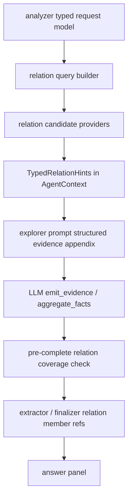

# Typed Relation Coverage Contract

Date: 2026-05-24

## 1. Problem

T12 fixed the first production regression in the typed-relation family:
`interface / trait / protocol -> implementer` facts now flow into exploration,
finalization, and the pre-complete relation member-set guard. That fix is
intentionally narrow, but the current code still has an architectural smell:
the pre-complete guard is named and implemented as `Implementer`-specific logic.

The next step must not add one gate per relation. The correct shape is one
common relation coverage contract, with individual relation carriers plugged in
only when they have precise typed data.

Target relation families:

- interface / trait / protocol -> implementer
- class/type inheritance and subclass
- overrides / conformance
- caller / callee
- references / type usage
- registration / binding
- import / dependency
- package/module/export membership
- config key -> read site
- route -> handler
- event -> observer/subscriber
- external observation -> current-source anchor

## 2. Red Lines

1. User intent and model-authored answer remain authoritative.
2. System-generated relation facts are prompt/context hints or append-only
   supplements. They must not replace or delete model output.
3. No hard gate may read raw user prose or model free-form prose.
4. A relation hard gate is allowed only when every input signal is precise:
   typed relation carrier, grounded evidence for the same member, requested
   source scope, and a model-authored principal member_set that omitted that
   member without an explicit exclusion.
5. Graph-only candidates are never enough for a hard gate.
6. Name-only / ambiguous carriers are soft guidance unless they resolve to
   canonical symbol IDs or exact file paths.
7. The contract must be language-neutral across every language repomap supports.

## 3. Current Code Inventory

### Analyzer and request traits

- `internal/types/request_traits.go`
  - `ShouldSurfaceTypedRelationHints`
  - `HasTypedRelationMemberSetShape`
  - `RequiresRelationMemberSetHandoff`
- These helpers already use typed analyzer fields, not keyword matching.
- Current gap: relation shape is mostly reduced to `AxisImplement` or generic
  `IsRelationalLookup`. Other relation axes do not yet have a common kind list.

### Prompt/context relation hints

- `internal/context/typed_relations.go`
  - `ProbeTypedRelations`
  - `probeImplements`
- `internal/types/typed_relation_hint.go`
  - `TypedRelationHint`
  - `TypedRelationMember`
  - `TypedRelationAnchorKind`
  - `AllTypedRelations`
- `internal/context/builder.go`
  - `renderTypedRelationAppendix`
  - `evidenceLineForTypedMember`
- Current gap: the file already documents a future probe table, but only
  `implements` is implemented.

### Repomap graph carriers

- `internal/tool/repomap/types/types.go`
  - `Symbol`
    - `Implements`
    - `RequiredMethods`
    - `Parent`, `Receiver`, `Doc`, `Signature`
  - `Import`
  - `Relation`
    - `Kind`: `import`, `call`, `reference`, `type_usage`, `inheritance`,
      `embedding`
    - `ToEP` with `SymbolID`, `Name`, `Receiver`, `File`, `Line`
  - `FileInfo`
    - `Symbols`, `Imports`, `Relations`, `Package`
- `internal/tool/repomap/types/graph.go`
  - `ImplementersOf`
  - `FilesImporting`, `FilesImportedBy`
  - `SymbolsInFile`
  - `CallersOfID`
  - `ResolveCallTarget`
  - `TransitiveDeps`, `TransitiveReverseDeps`
- Current gap: these primitives are not exposed through one generic relation
  provider. Downstream code imports relation families ad hoc.

### Multi-repo bridge

- `internal/types/typed_relation_hint.go`
  - `TypedRelationImplementerSource`
- `internal/tool/repomap/multigraph/multigraph.go`
  - `ImplementerMembersOf`
- Current gap: only implementers have a cycle-free interface. Other relation
  families need the same boundary so `internal/tool` does not import concrete
  multigraph code and create cycles.

### Exploration pre-complete guard

- `internal/tool/emit_investigation_complete.go`
  - `relationMemberSetHandoffDowngrade`
  - `relationMemberSetGroundedImplementerGaps`
  - `relationTypedImplementersForRequest`
  - `relationGroundedImplementerEvidenceKeys`
  - `relationPrincipalMemberSetKeys`
- Current gap: the safety rule is correct, but the implementation is
  implementer-specific. It should become:
  `typed relation candidates + grounded same-member evidence + requested scope`
  instead of `implementer candidates`.

### Aggregate/finalizer consumption

- `internal/types/answer_aggregate_fact.go`
  - `PrincipalRelationMemberSetFactRefsForRequest`
  - `AnswerAggregateFactHasRelationMembers`
  - `AnswerAggregateMemberRelationParts`
  - relation left-axis helpers
- `internal/types/answer_support_plan_facet_evidence.go`
  - `aggregateRelationMemberEvidence`
  - `aggregateEvidenceSupportsRelationMember`
  - endpoint and path matching helpers
- These are already relation-generic and should be reused.

## 4. Unified Contract

### 4.1 Relation Kind

Keep the current external string values initially to avoid a schema flag day,
but centralize them as a typed closed set:

```go
type TypedRelationKind string

const (
    RelationImplements   TypedRelationKind = "implements"
    RelationExtends      TypedRelationKind = "extends"
    RelationOverrides    TypedRelationKind = "overrides"
    RelationCalledBy     TypedRelationKind = "called-by"
    RelationReferences   TypedRelationKind = "references"
    RelationImports      TypedRelationKind = "imports"
    RelationExports      TypedRelationKind = "exports"
    RelationRegisters    TypedRelationKind = "registers"
    RelationScopedTo     TypedRelationKind = "scoped-to"
)
```

Existing JSON remains unchanged: the values still serialize as strings.

### 4.2 Relation Query

The context probe and pre-complete guard should use one request object:

```go
type TypedRelationQuery struct {
    Kinds       []TypedRelationKind
    Sources     []string
    Request     *RequestModel
    MaxMembers  int
    Purpose     TypedRelationPurpose // PromptHint or CoverageGate
}
```

The query consumes typed analyzer fields and existing structural-scope helpers.
It must not inspect raw user text.

### 4.3 Relation Candidate

`TypedRelationMember` can remain the prompt-facing row. Coverage needs a richer
internal candidate:

```go
type TypedRelationCandidate struct {
    Relation   TypedRelationKind
    SourceName string
    SourceFile string
    SourceLine int
    Member     TypedRelationMember
    Carrier    TypedRelationCarrierKind
    Precision  TypedRelationPrecision
}
```

Precision levels:

- `ExactSymbolID`: canonical symbol ID or exact file path relation.
- `ExactFile`: exact file-to-file import/dependency relation.
- `ExactEvidence`: evidence-origin relation with exact source/line or external
  artifact anchor.
- `NameOnly`: graph has names but not enough identity; prompt hint only.
- `Heuristic`: never hard gate.

### 4.4 Provider Boundary

Add one cycle-free interface in `internal/types`:

```go
type TypedRelationCandidateSource interface {
    TypedRelationCandidates(TypedRelationQuery) []TypedRelationCandidate
}
```

Concrete providers:

- single-repo graph adapter in `internal/context` or repomap-facing package
- multi-repo adapter in `internal/tool/repomap/multigraph`
- external observation adapter over the existing observation/evidence ledger

Do not make `internal/tool` import concrete repomap/multigraph packages beyond
the graph type it already reads. Prefer the interface for multi-repo and
external observations.

### 4.5 Hard Gate Rule

A pre-complete missing-member gap is reported only when:

1. `RequiresRelationMemberSetHandoff(rm)` or a future typed relation handoff
   trait is true.
2. Provider returns an `ExactSymbolID`, `ExactFile`, or `ExactEvidence`
   candidate inside requested source scope.
3. `ctx.Mutable.EmittedEvidence()` has grounded or recovered evidence for the
   same relation member and the same file/artifact anchor.
4. A model-authored principal member_set exists but omits that member.
5. The omitted member is not present in `excluded[]`.

If no member_set exists, the existing downgrade should ask for a structured
handoff. If candidates exist but no same-member grounded evidence exists, the
system may provide soft guidance only.

## 5. Relation Family Maturity Matrix

| Relation family | Existing carrier | Initial contract mode | Notes |
|---|---|---:|---|
| implements | `Symbol.Implements`, `Graph.ImplementersOf`, `MultiGraph.ImplementerMembersOf` | Hard-gate eligible | Already shipped for exact + grounded evidence; migrate to common helper first. |
| import/dependency | `FileInfo.Imports`, `ImportGraph`, `ReverseImports`, transitive deps | Hard-gate eligible for exact file paths | Works across resolver-supported languages; unresolved imports are negative/uncertain evidence, not hard coverage. |
| inheritance/subclass | `Relation.Kind=inheritance`, symbols parent/receiver | Prompt hint first, hard-gate after exact source/member evidence | Extractor support varies by language; gate only exact rows with file/line. |
| caller/callee | `CallersOfID`, `ResolveCallTarget`, `Relation.Kind=call` | Hard-gate eligible only with canonical target ID | `CallersOf(name)` remains legacy/name-only and must be soft. |
| references/type usage | `Relation.Kind=reference/type_usage`, `RankIndex.RefCountByID` | Soft first | Often high volume and noisy; use as ranking/hints unless exact endpoint evidence exists. |
| overrides/conformance | language extractors and `Relation.Kind=inheritance` derivatives | Soft first | Need extractor audit before hard-gate. |
| registration/binding | LLM evidence, `AnchorAssignment`, relation labels | Evidence-driven first | Different languages/frameworks express this differently; graph-only carrier is not stable enough yet. |
| scoped-to / package exports | `FileInfo.Package`, `SymbolsInFile`, exported flag | Prompt hint / source-inventory boundary | Must not revive old source-inventory rewrite bugs; append-only support only unless user asks inventory. |
| route/config/event observer | framework-specific evidence and external observation anchors | Evidence-driven | Add typed relation only when upstream emits exact structured evidence. |
| external observation -> source anchor | observation ledger, runtime artifact evidence, source evidence | Hard-gate eligible after exact artifact anchor + source anchor | Covers logs, traces, VCS, command output, MCP/web/connector artifacts. |

## 6. Data Flow



The same provider feeds prompt hints and coverage checking, but the purpose flag
changes behavior:

- `PromptHint`: may include exact and soft candidates, clearly tagged by
  provenance/precision.
- `CoverageGate`: exact candidates only, and only when paired with grounded
  same-member evidence.

## 7. Implementation Plan

### R0. Design and inventory

Status: **Done**

- [x] Inspect `TypedRelationHint`, context probe, graph carriers, aggregate
  relation matchers, and pre-complete relation member-set guard.
- [x] Confirm there are reusable graph primitives for imports, calls,
  inheritance, references, scoped symbols, and implementers.
- [x] Confirm existing aggregate/finalizer helpers are already relation-generic
  and should not be duplicated.
- [x] Land this design and link it from the gap tracker.

### R1. Common relation types and provider boundary

Status: **Done**

- [x] Add typed constants around existing relation string values.
- [x] Add `TypedRelationQuery`, `TypedRelationCandidate`,
  `TypedRelationCandidateSource`, precision enum, and helper canonicalizers in
  `internal/types`.
- [x] Keep JSON/string wire values stable.
- [x] Add structural tests:
  - every `AllTypedRelations()` value maps to anchor kind
  - every relation kind has a declared precision policy
  - provider boundary has no package cycle
- [x] Add a generic `MultiGraph.TypedRelationCandidates` bridge for the already
  precise implementer relation while preserving the older
  `TypedRelationImplementerSource` compatibility path.
- [x] Centralize relation carrier selection in
  `internal/context.typedRelationCarriersFromBus`: merge generic
  `BusContext.MultiGraph` providers and legacy `Mutable.SearchGraph()` with
  stable de-dup. This prevents future single-vs-multi repo drift where a caller
  accidentally reads only one graph-shaped field, and also handles early prompt
  assembly when a MultiGraph provider is present but currently returns no active
  candidates.

### R2. Migrate implementer coverage to common helper

Status: **Done**

- [x] Replace `relationTypedImplementerGap` and
  `relationMemberSetGroundedImplementerGaps` with a generic relation coverage
  helper.
- [x] Keep existing implementer behavior equivalent:
  - graph-only members not forced
  - production source scope honored
  - omitted grounded implementer prompts structured handoff
  - multi-repo provider still works
- [x] Add regression tests that prove the generic helper catches the current s5a
  class without mentioning implementers in gate logic.

Implementation note: this batch deliberately does not activate imports,
inheritance, caller/callee, or registration carriers yet. It only moves the
existing precise implementer safety rule onto the common candidate contract, so
future relation families can reuse the same exact-carrier + grounded-evidence +
scope + model-authored-member_set rule without adding one-off gates.

Regression note: the first focused replay after R1/R2 initially failed because
the explorer prompt still read typed relation hints only from
`Mutable.SearchGraph()`, while the normal single-repo run was using
`BusContext.MultiGraph` as the active carrier. A later replay exposed the
opposite edge: MultiGraph may be present but empty/early, so relation hints must
not stop there. The fix is not a one-off qf patch: relation probes now go
through the centralized carrier sequence and merge outputs with relation/source/
member/file de-dup. Tests pin provider-preferred, legacy fallback, and
cross-carrier de-dup behavior.

Schema-repair note from the same replay: the finalizer can emit a block with a
valid typed `diagram` payload but a stale outer `kind` discriminator (for
example `kind=section`). This is a lossless schema mismatch, not a content
error. The unified answer-block normalizer and final persist chokepoint now
repair only this precise condition by setting `kind=diagram`. The system still
does **not** infer diagrams from Mermaid-looking prose or `text`, and still
rejects `kind=diagram` blocks that omit the typed `diagram` object.

Axis-drift note: a later replay showed the analyzer can classify an explicit
interface type-relationship diagram as `predicate_axis=define` while still
emitting typed `answer_subject=interface_name` and `diagram_hint=architecture`.
The short-term repair allows typed relation probes for this schema shape, but
this must remain a prompt-hint allowance only: hard coverage still requires
exact graph candidates plus grounded same-member evidence. The long-term
architecture task is to move this and future relation triggers into one central
`TypedRelationQuery` kind-selection policy:

- interface / trait / protocol diagrams may request `implements` and `extends`;
- caller/callee questions map through typed axis/profile to `called-by`;
- import/export/dependency questions map through typed axis/profile to
  `imports` / `exports`;
- registration/event/config/route/external-observation relations enter through
  their precise typed profiles or evidence carriers;
- no relation kind is selected from raw user prose or model free-form text.

### R3. Import/dependency relation provider

Status: **Pending**

- Add exact file relation candidates for direct imports and reverse imports.
- Use `ImportGraph` / `ReverseImports` rather than scanning import strings.
- Treat unresolved imports as negative/uncertain evidence, not hard coverage.
- Add Go + at least one non-Go fixture/eval case.

### R4. Inheritance/subclass relation provider

Status: **Pending**

- Read `Relation.Kind=inheritance` and symbol definitions.
- Emit prompt hints across languages that populate inheritance relations.
- Allow hard coverage only for exact source/member evidence.
- Add fixtures for at least Java/Kotlin/TypeScript/Python or other supported
  languages with reliable extractor output.

### R5. Caller/callee provider

Status: **Pending**

- Prefer `CallersOfID` and `ResolveCallTarget`.
- Mark `CallersOf(name)` results as `NameOnly` / prompt-only.
- Add tests where same method name appears on multiple receivers.

### R6. Registration/binding and event observer evidence carrier

Status: **Pending**

- Start evidence-driven: only exact LLM/tool-emitted evidence enters hard
  coverage.
- Share the same relation member parser and support-ref matching.
- Avoid framework-specific keyword tables.

### R7. External observation relation carrier

Status: **Pending**

- Model log/trace/VCS/command/MCP/web/connector observations as relation
  candidates only when they have exact artifact anchor plus current-source
  anchor.
- Reuse existing external evidence/artifact ledgers and blob/page readers.
- Add negative observation support through the same exact/uncertain split.

### R8. Prompt and finalizer ledger alignment

Status: **Pending**

- Keep typed relation hints as a single unified structured-evidence appendix.
- Do not create duplicate per-relation sections.
- Ensure rich `summary` / `note` from model evidence beats dry graph hints for
  duplicate tuples.
- Preserve localized append-only supplement wording.

### R9. Central relation-kind selection

Status: **Pending**

- Replace scattered relation-trigger checks with one
  `TypedRelationQuery`-building policy that maps typed request shape to allowed
  relation kinds.
- Keep current short-term interface-diagram support as the first test case, but
  migrate it into this central selector.
- Add tests for interface diagram, call relation, import/export relation,
  registration/event relation, and external-observation→source-anchor relation.
- Prove every selector input is typed (`AnswerSubject`, `DiagramHint`,
  `PredicateAxis`, request profiles, or precise evidence carrier), never raw
  request/model prose.

### R10. Eval and telemetry

Status: **Pending**

- Add focused evals for import/dependency, caller/callee, inheritance, and
  external observation + current source.
- Record for each relation family:
  - prompt hint count
  - hard gate count
  - soft guidance count
  - finalizer retry count
  - answer richness retention

## 8. Non-goals

- Do not make source-inventory repair a relation answer author.
- Do not infer relation intent by keyword matching raw user/model text.
- Do not force graph-only candidates into final answers.
- Do not replace model tables or prose with system-generated tables.
- Do not implement framework-specific route/config/event detectors until a
  precise structured carrier exists.

## 9. First Batch Recommendation

Start with R1 + R2 only. They lower architecture risk without expanding
behavioral surface. After implementers are migrated to the common helper and
tests prove parity, add imports/dependencies as R3 because that carrier is exact
file-to-file data and broadly useful across languages.
