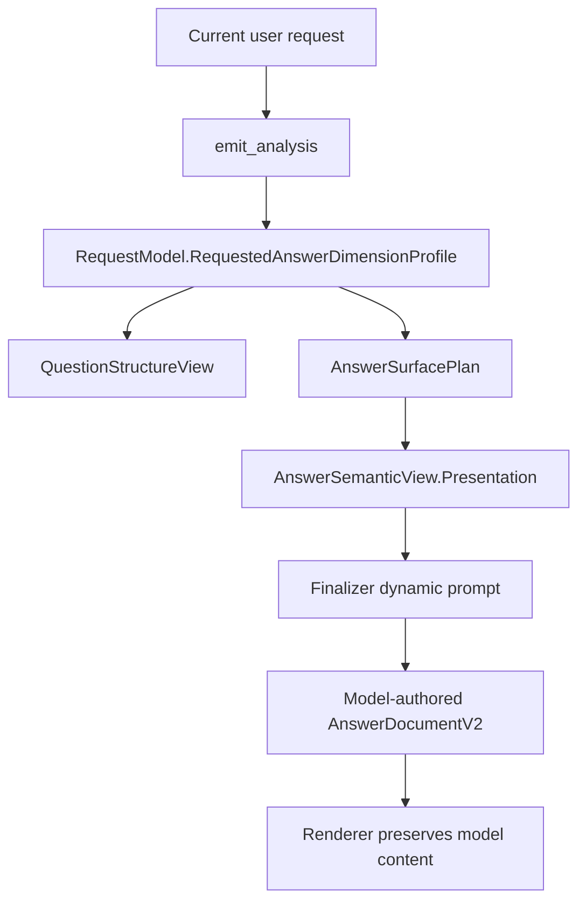

# User Requested Answer Dimensions Contract

Date: 2026-05-24

## Problem

Recent mixed VCS/current-source evals exposed a surface-preservation gap:
the system can correctly collect VCS diff observations and current-source
evidence, yet the final answer may not visibly preserve the dimensions the user
explicitly asked to see. Example:

> 对比最近两次提交的代码 diff，再结合当前源码分析它们分别影响了哪些当前实现链路；请说明每次提交的 diff 线索、当前关键代码、作用和影响，不要只给 commit id。

The answer was useful and not scalar-collapsed, but it did not reliably keep
the visible axes "diff 线索 / 当前关键代码 / 作用 / 影响". This is not a JSON
repair issue and should not be solved by case-specific regex checks. It is a
missing typed contract for user-requested presentation dimensions.

## Existing Infrastructure To Reuse

Do not build a parallel answer-shape stack. The current code already has the
right places to carry this:

- Analyzer typed output: `emit_analysis` and `RequestModel`.
- Structural obligations: `RequestModel.QuestionStructure()` already carries
  count, completeness, and buckets.
- Answer surface authority: `AnswerSurfacePlan`.
- Final answer contract: `AnswerSemanticView` and
  `AnswerPresentationContract`.
- Evidence/output separation: `AnswerIntentContract` and `ObservationLedger`.
- User partitioning: `QuestionBucket` already preserves explicit bucket labels.

The new contract should be a small extension of these surfaces, not a new
agent, not a raw prompt-only rule, and not a renderer-side inference pass.

## Design

### Analyzer Profile

Add an optional analyzer profile:

```go
type RequestedAnswerDimensionProfile struct {
    IsDimensionedAnswer bool
    Dimensions          []RequestedAnswerDimension
    Confidence          float64
    Rationale           string
}

type RequestedAnswerDimension struct {
    Label       string
    Role        RequestedAnswerDimensionRole
    SourceQuote string
    Required    bool
    Index       int
}
```

`Label` is the user-facing phrase to preserve. It may be Chinese, English, or
mixed, and should remain verbatim enough for the final answer. `Role` is a
small language-neutral enum that helps downstream sort and reason without
parsing the label:

- `diff_clue`
- `current_key_code`
- `function_or_purpose`
- `impact`
- `comparison_axis`
- `evidence_source`
- `boundary`
- `other`

This role list is not code-language-specific; it applies to Go, Java, C++,
ArkTS, Cangjie, logs, traces, VCS, MCP, web, and connector evidence alike.

### Validation

The profile is optional and soft:

- Every dimension must have a non-empty `label`.
- `source_quote`, when present, must be copied from the current request using
  the same whitespace-insensitive quote validation as existing question
  structure fields.
- Unanchored dimensions are dropped with warnings, not hard rejected.
- Missing profile never blocks analyze. The answer can still be good without it.

This follows the red line: hard gates consume precise typed fields; noisy or
optional signals become prompt guidance and telemetry.

### Projection

The normalized profile should be stored on `RequestModel`, exposed through
`QuestionStructureView`, copied into `AnswerSurfacePlan`, and compiled into
`AnswerPresentationContract`.

Downstream consumers should read only the typed profile:

- Finalizer prompt: render a "User-requested answer dimensions" section.
- Semantic view trace: include dimension count for debugging.
- Future telemetry: measure whether dimensions were visible, without forcing
  a rewrite unless a later precise rule proves a deterministic loss.

### Finalizer Prompt Contract

When dimensions exist, the finalizer should see a localized instruction:

- Preserve these requested dimensions as section headings, table columns, list
  labels, or compact paragraphs.
- Keep the user's labels where natural.
- If a dimension is unsupported by evidence, say so in a caveat or boundary
  note rather than inventing content.
- Do not replace model-authored content with a system table. This is guidance
  for the model's answer, not permission for deterministic rewriting.

For mixed requests, the dimensions complement `AnswerIntentContract`:

- `diff_clue` pairs naturally with `vcs_diff`.
- `current_key_code` pairs naturally with `current_source`.
- `impact` / `function_or_purpose` are visible answer outputs, not evidence
  origins.

### Supplement Policy

Batch 1 is prompt-only plus typed telemetry. It does not add a hard validator.
If future logs prove a missing-dimension answer is common, add a narrow
accepted-path supplement that appends a clearly marked localized note only when
all of these hold:

- A typed dimension exists and is request-anchored.
- The final visible answer clearly omits that label or any equivalent section.
- The missing content can be summarized from existing typed evidence without
  changing or deleting model-authored content.

Never mutate or replace a model table; supplements must be separate and marked
as system-provided.

## End-To-End Data Flow



No step scans the model's prose to infer user intent. Render-time visibility
checks may inspect the already-rendered answer only as telemetry or future
soft supplement input.

## Task List

| Batch | Status | Task | Validation |
| --- | --- | --- | --- |
| D0 | Done | Create this design and link it from the gap retriage document. | Doc review |
| B1 | Done | Add typed structs, analyzer schema/prompt, parser normalization, RequestModel projection, and semantic-view/presentation projection. | `go test ./internal/types ./internal/tool` |
| B2 | Done | Render finalizer prompt section from the typed dimensions; add prompt tests for mixed VCS+current-source and generic dimensioned answers. | `go test ./internal/agent -run RequestedAnswerDimensions` |
| B3 | Done | Add eval coverage for recent diff+current-source dimensions, log+current-code dimensions, and trace+current-code dimensions. | focused eval batch |
| B4 | Done | Analyze eval logs and decide whether a soft accepted-path supplement is justified. Current evidence says no supplement is justified; the missing behavior was a source-lane routing bug fixed at `RequestModel.HasRuntimeArtifactCurrentVerificationAnchor`. | gap doc update |

## Open Risks

- Analyzer may omit the profile. This is acceptable; the profile is a richness
  preservation lane, not the sole answer route.
- Too much prompt pressure could make answers formulaic. Keep the section short
  and allow headings, columns, lists, or prose.
- A later supplement must not create the old "system补表 beats model answer"
  failure mode. Any deterministic supplement must be separate, localized, and
  append-only.

## Progress

- 2026-05-24 B1/B2 complete:
  - Added `RequestedAnswerDimensionProfile` and normalized request-anchored
    dimensions with soft warnings for unanchored entries.
  - Wired the profile through `RequestModel`, `QuestionStructureView`,
    `AnswerSurfacePlan`, `AnswerPresentationContract`, and semantic-view trace.
  - Extended `emit_analysis` schema and analyzer skill guidance without making
    the profile required.
  - Added a finalizer prompt section that preserves the user's requested answer
    dimensions as headings, columns, list labels, or prose labels while
    explicitly forbidding table-forcing and content replacement.
  - Validation:
    - `go test ./internal/types ./internal/tool ./internal/agent`
    - `git diff --check`

- 2026-05-24 B3 partial:
  - `eval/cases/read_combo_git_two_diffs_current_code.case` passed once at
    `eval/results/read_combo_git_two_diffs_current_code-20260524-005936`.
  - The run confirmed analyzer → semantic view projection:
    `answer_dimensions=4` and `requested_dimensions=4`; finalizer completed in
    one iteration with no rewrite.
  - Added explicit-dimension mixed artifact cases:
    `read_combo_log_current_code_dimensions` and
    `read_combo_trace_current_code_dimensions`.

- 2026-05-24 B3/B4 complete:
  - Initial log/trace explicit-dimension runs failed without finalizer retries:
    both answered from the runtime artifact only and did not read current
    source. This was not a local-model issue; it exposed a system trait gap.
  - Root cause: `HasRuntimeArtifactCurrentVerificationAnchor` treated external
    log/trace dispatches as observation-only unless analyzer emitted
    `required_files`, `exact_targets`, or resolved artifact files. It did not
    consume the newly typed `requested_answer_dimensions.current_key_code`
    signal, even though that signal is a request-anchored, language-neutral
    current-source lane request.
  - Fix: `current_key_code` dimensions now open the current-source lane for
    external runtime artifacts; other presentation dimensions such as `impact`
    remain observation-only so ordinary log/trace summaries do not trigger repo
    reads.
  - Validation after the fix:
    - `read_combo_log_current_code_dimensions-20260524-011006`: PASS,
      `tool_read_file=8`, `finalizer_iters=1`.
    - `read_combo_trace_current_code_dimensions-20260524-011006`: PASS,
      `tool_read_file=11`, `finalizer_iters=1`.
    - `read_combo_git_two_diffs_current_code-20260524-005936`: PASS,
      `answer_dimensions=4`, `requested_dimensions=4`, `finalizer_iters=1`.
  - Decision: no accepted-path supplement is needed for this batch. The
    correct fix was upstream lane routing, not renderer-side table or prose
    supplementation.

- 2026-05-24 follow-up during explorer-convergence B5:
  - `read_combo_git_two_diffs_current_code-20260524-113636` completed without
    finalizer retry (`finalizer_iters=1`) and contained both VCS and
    current-source evidence, but the visible answer did not preserve the labels
    `diff 线索 / 当前关键代码 / 作用 / 影响` under each commit, causing the
    eval regex to fail.
  - Root cause: the prompt section correctly listed requested dimensions, but
    did not explicitly say that a per-subject answer (per commit/log event/trace
    span/component/file) should repeat those labels under each subject. The
    model naturally wrote a rich prose/list answer instead of preserving the
    user-facing labels.
  - Fix: strengthened the finalizer prompt only. It now asks models to preserve
    requested dimension labels per subject where possible, and to state a
    boundary under that subject when a dimension lacks evidence. This remains
    soft presentation guidance: no hard gate, no deterministic table
    replacement, and no system-side rewrite of model-authored content.
  - Re-run after the prompt-only fix:
    `read_combo_git_two_diffs_current_code-20260524-114950` passed. It kept
    `finalizer_iters=1` with no reject/rewrite, reduced the run to
    `analyzer_iters=2`, `explorer_iters=8`, `midloop_inject=3`, and rendered the
    requested per-commit labels as `diff 线索与当前关键代码` and `作用与影响`.
    This confirms the fix is upstream presentation guidance rather than a
    renderer supplement or a hard contract.
  - REPL UX follow-up: the analysis result summary now shows typed requested
    dimensions and current-source explanation profile signals, for example
    `答案维度 2 个：diff 线索, 当前关键代码` and `源码关联 2 个：...`. This helps users
    see that the analyzer captured the dimension contract without changing
    downstream model prompts or validators.
