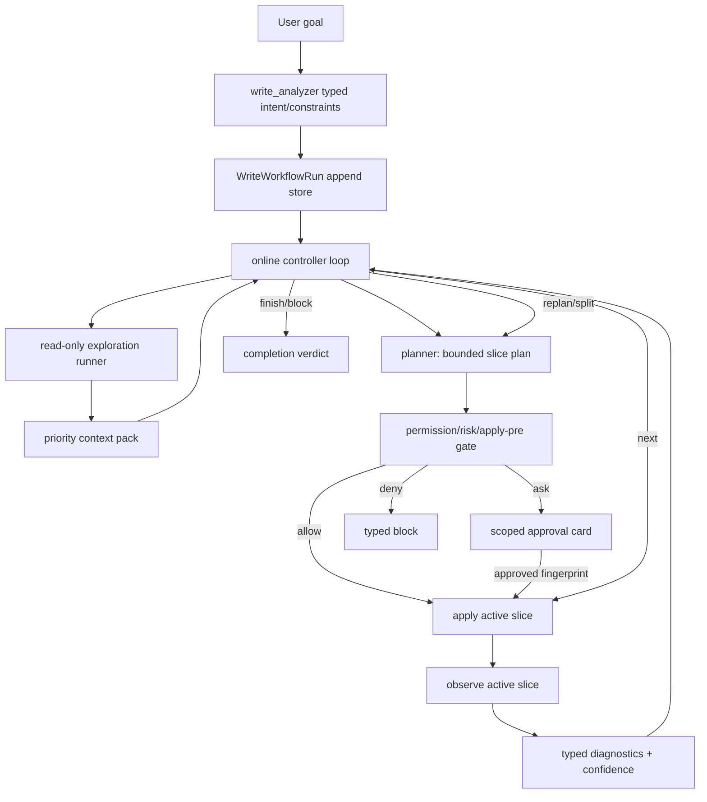

# Codrax Write Mode Claude-Code-Inspired Control Plane Design

Date: 2026-06-16
Branch: main
Status: design ledger, active delivery input

## Summary

This document translates public Claude Code architecture research into a
Codrax-specific write-mode design. The target is not to copy Claude Code's UX
or implementation. The target is to absorb the production architecture lesson:
the model can stay flexible only when the surrounding control plane is
deterministic, typed, observable, recoverable, and safe.

Primary references:

- *Dive into Claude Code: The Design Space of Today's and Future AI Agent
  Systems*: <https://arxiv.org/abs/2604.14228>
- Public companion analysis repository:
  <https://github.com/VILA-Lab/Dive-into-Claude-Code>
- Claude Code Agent SDK loop, permissions, subagents, checkpointing,
  observability, and task-tracking docs:
  <https://code.claude.com/docs/en/agent-sdk/agent-loop>,
  <https://code.claude.com/docs/en/agent-sdk/permissions>,
  <https://code.claude.com/docs/en/agent-sdk/subagents>,
  <https://code.claude.com/docs/en/agent-sdk/file-checkpointing>,
  <https://code.claude.com/docs/en/agent-sdk/observability>,
  <https://code.claude.com/docs/en/agent-sdk/todo-tracking>
- Public architecture synthesis of Claude Code tools, memory, hooks, MCP,
  sandboxing, and permissions:
  <https://www.penligent.ai/hackinglabs/inside-claude-code-the-architecture-behind-tools-memory-hooks-and-mcp/>
- Anthropic agent architecture guidance:
  <https://resources.anthropic.com/hubfs/Building%20Effective%20AI%20Agents-%20Architecture%20Patterns%20and%20Implementation%20Frameworks.pdf>

The useful abstraction is:

```text
simple online agent loop + thick deterministic harness
```

For Codrax write mode this becomes:

```text
observe typed state -> edit bounded slice -> run focused check -> observe typed
verdict -> continue / replan / split / block / finish
```

This replaces batch-thinking with online convergence while preserving Codrax
red lines:

- hard routing reads only typed artifacts;
- prompts are soft guidance;
- no user-intent keyword matching;
- no model rationale/summary/prose parsing for business logic;
- visible `<think>` logs remain user-facing transparency, not hard evidence;
- read/log/trace/data/operation/computer modes stay isolated.

## External Research Takeaways

### R1: The agent loop is simple; infrastructure carries production quality

The paper describes Claude Code as a simple loop that calls the model, executes
tools, and repeats, while most engineering weight lives around that loop:
permissions, tool routing, context management, subagent isolation, persistence,
and recovery. The companion repository summarizes the same point as a small AI
decision core surrounded by deterministic infrastructure.

Codrax implication:

- Do not build a large prompt-only planner hierarchy.
- Keep controller decisions small and typed.
- Put reliability into scheduler state, permission policy, context packs,
  run stores, diagnostics, and validators.

### R2: One execution engine, many surfaces

Claude Code's public architecture analysis emphasizes one core loop reused by
CLI, headless, SDK, and IDE surfaces. Only rendering and user interaction vary.

Codrax implication:

- REPL and CLI write mode must share the same controller-first online loop.
- `/workflow`, `/plan`, `/approve`, and CLI phase flags are audit/recovery
  surfaces, not alternate business engines.
- `--plan-file` imports a workflow seed and still flows through the same
  permission, apply, observe, and completion path.

### R3: Autonomy needs a safety gradient, not constant interruption

The research highlights permission modes, deny-first rules, classifier-assisted
auto mode, sandboxing, and the tension between approval fatigue and safety.

Codrax implication:

- Low/medium deterministic risk auto-runs.
- High deterministic risk pauses once for scoped approval.
- Critical risk denies automatically.
- Approval is bound to the smallest useful fingerprint: active slice plus
  relevant plan metadata.
- The system must not ask for approval simply because the model is uncertain.
  It should explore or run typed probes first when safe.

### R4: Context is a runtime resource, not a transcript

Claude Code uses compaction, memory, skills, and subagents to keep useful state
available without dumping every prior token into the next model call.

Codrax implication:

- `WriteContextPack` is the write-mode memory bus.
- Full evidence persists by artifact ref.
- Controller/planner/verifier consume Top-N typed views by priority and
  consumer, not raw transcripts.
- Completed slices render as compact typed ledger rows.
- Failed/unverified observations render as P2 must-carry diagnostics.

### R5: Subagents are isolation boundaries

Public analysis frames subagents as separate context windows with narrower
capability and summarized returns, not merely parallelism.

Codrax implication:

- Heavy localization should continue to use read-only exploration runners.
- Exploration returns typed handoff: target paths, symbols, invariants,
  evidence refs, test surfaces, and unknowns.
- Coder/verifier should not inherit raw exploratory transcripts or broad
  exploratory tool privileges.

### R6: Append-oriented session state enables resume and audit

The paper and public analyses emphasize persistent sessions and append-style
event logs as part of recovery and governance.

Codrax implication:

- `WriteWorkflowRun` must be the durable source of truth.
- Slice events, apply refs, observe refs, diagnostics, approvals, budget, and
  completion verdicts are append-only audit data.
- UI status cards and eval adapters should render from typed state, never from
  model prose or progress text.

## Design-Space Mapping To Codrax

The paper frames Claude Code as one point in a broader design space. Codrax
should choose a nearby, but not identical, point: keep the model's local
freedom, but make every irreversible boundary a typed harness decision. The
following mapping is the canonical product direction for write mode.

| Design question | Claude Code/public pattern | Codrax write-mode answer |
| --- | --- | --- |
| Where does reasoning live? | Model decides the next tool call; harness validates and executes. | Controller/planner/verifier decide with typed tools; scheduler/risk/validator/store enforce. No scheduler branch reads prose. |
| What is the loop shape? | Evaluate, execute tool(s), observe results, repeat until no tool calls. | Observe typed state, apply one bounded slice, run focused check, append typed observation, then continue/replan/split/block/finish. |
| How many engines? | One loop reused by CLI/SDK/IDE; surfaces only render differently. | CLI, REPL, plan-file, SWE-bench adapter, and advanced recovery commands all enter the same durable workflow engine. |
| How much upfront planning? | Planning is lightweight guidance; the loop adapts online. | Initial plan is a rolling slice graph, not a full final answer. The controller may append/split/replan nodes as observations arrive. |
| How are approvals reduced without losing safety? | Deny-first rules, permission modes, hooks, and scoped approvals. | Low/medium typed risk auto-runs; high risk asks once per slice fingerprint; critical denies. Approval fatigue is treated as a safety bug. |
| What consumes context? | Context window is the scarce runtime resource; subagents and compaction reduce pressure. | Context packs store full evidence by ref and render per-consumer Top-N views. Exploration summaries must carry typed file/symbol/evidence/test refs. |
| How is noisy work isolated? | Subagents run in separate contexts and return summary-only results. | Read-only exploration runners/localizers collect evidence outside coder context; planner/coder/verifier consume typed handoff views, not raw transcript dumps. |
| How is state recoverable? | Append-oriented transcripts, subagent sidechains, and checkpoints support resume/fork/rewind. | `WriteWorkflowRun` is append-style durable state with slice events, attempts, approvals, diagnostics, and completion verdicts. Checkpoint/rewind maps to git worktree isolation and slice-scoped applied refs. |
| How are tasks surfaced to users? | Task/todo streams show progress without making the user schedule each step. | REPL/CLI status cards show next-action state. `/workflow` and `/plan` are recovery/audit surfaces, not routine steering commands. |
| How is production governance handled? | Telemetry reports tool/model/cost/failure spans. | Codrax emits typed ledger fields for eval and audit: local verdict, confidence, context coverage, exported patch coverage, approval/refusal, and completion reason. |

This mapping rejects two tempting but unsafe directions:

- do not turn prompts into a hidden state machine;
- do not hard-code issue text, SWE-bench IDs, model summaries, or `<think>` logs
  into routing.

It also rejects the opposite overcorrection:

- do not make the harness a rigid LangGraph-style graph that prevents the model
  from choosing timely exploration, local probes, or smaller repair slices.

## Codrax Current Gap Reframe

Recent online convergence and SWE-bench work closed large pieces of the
foundation: controller-first write mode, durable workflows, active slices,
typed completion verdicts, behavior contracts, contract polarity, parser
subreasons, verification diagnostics, and SWE-bench environment prep.

The remaining commercial gaps cluster around the control plane:

| Gap | Systemic impact | Required direction |
| --- | --- | --- |
| Online loop still mixes batch concepts | Large plans can still feel like plan/apply/verify with smaller internal state | Make Edit/Run/Observe the primary scheduler contract and batch only a storage grouping |
| Observation confidence is not strong enough | Weak probes can mark semantically wrong patches as locally passed | Add behavior-contract coupling, changed-symbol coupling, optional baseline probes, and confidence records |
| Verify environment unavailable can hide richer earlier evidence | Missing pytest/deps should not block delivery, but should not erase probe errors or contract gaps | Keep full diagnostic lane and confidence downgrade separate from pass/fail |
| Context-pack consumer views are still uneven | Planner/verifier can miss key exploration or failure evidence after retries | Enforce P0/P1/P2 Top-N per consumer with dedupe keys and artifact refs |
| Decision repair still costs model turns | Minor missing fields or edit anchor failures trigger repeated retries | Hydrate from durable state and provide one compact `PlanRepairPack` |
| User command burden remains a product risk | Too many slash commands make users act as outer scheduler | Auto-resume safe work, render typed next-action cards, reserve commands for audit/recovery |

## Target Architecture

### Control Plane Layers



### The Core Loop

The write-mode runtime should operate as:

```text
while workflow not terminal:
  assemble typed active-state view
  model emits one typed controller action
  harness normalizes/hydrates/validates action
  harness executes one bounded effect
  harness appends observation event
```

The model chooses among typed actions, but the harness decides whether that
action is executable under current durable state, permission policy, budget,
approval, and diagnostics.

### Slice-First State

`WriteWorkflowBatch` should remain a grouping unit, but `WritePlanSlice` should
be the execution unit:

- `slice_id`
- `status`
- `change_indexes`
- `paths`
- `depends_on_slices`
- `risk_ref`
- `approval_ref`
- `apply_attempt_ref`
- `observe_attempt_ref`
- `verification_diagnostic_refs`
- `confidence_ref`
- `completion_verdict`

Batch status derives from slice statuses plus terminal batch verdict. It should
not be inferred from rendered logs.

### Observation Spine

Observation is not just tests. It is a typed evidence spine:

- syntax/build preflight;
- bounded verification probes;
- project runner verdict;
- runner/environment availability;
- behavior-contract coverage;
- changed-symbol/path coupling;
- optional baseline delta;
- diagnostic provenance.

`ChangeReport.verification_status` remains a compact verdict:

- `passed`
- `failed`
- `unavailable`

Commercial audit should additionally consume `verification_diagnostics[]` and
`confidence_records[]`, so unavailable environments can deliver code without
pretending the local patch was proven.

### Confidence Is Separate From Delivery

Customer environments often miss pytest, native deps, databases, services, or
test fixtures. That cannot be a hard blocker for useful code delivery.

Therefore:

- delivery state says whether Codrax produced and applied a bounded patch;
- verification state says what local checks proved;
- confidence state says whether those checks were behavior-coupled.

This is critical for SWE-bench and real customers:

```text
exportable patch + unverified environment != failed code
passed weak probe != high confidence
```

### Context Pack Contract

Context packs become the durable handoff bus:

| Priority | Contents | Consumers |
| --- | --- | --- |
| P0 | user constraints, scope, risk, approval, behavior contract atoms | all |
| P1 | target paths, symbols, invariants, line-backed evidence | planner, verifier |
| P2 | build/test/probe diagnostics, failure path/line, repair packets | controller, planner, verifier |
| P3 | style and local conventions | planner |

Consumer views are deterministic projections. The renderer may use prose, but
the selector reads typed priority, source stage, consumer tags, path/symbol,
reason code, and evidence refs.

### Permission And Approval Contract

Use a shared permission engine across write and operation lanes where possible:

- `allow`: execute without user interruption;
- `ask`: pause with a typed card and exact fingerprint;
- `deny`: block automatically.

Rules:

- deny wins over ask and allow;
- critical risk denies automatically;
- high risk asks once per slice fingerprint;
- low/medium risk auto-runs;
- fingerprint drift invalidates approval;
- approval records include run, batch, slice, plan, policy, risk level,
  decision, reasons, source, and timestamp.

The approval gate reads path policy, parser outputs, command policy, risk
records, and plan/slice fingerprints. It must not read user prose, model
summary, rationale, `<think>`, or issue keywords.

### Tool Boundary

| Agent | Primary tools | Explicitly avoided in hard logic |
| --- | --- | --- |
| controller | `emit_write_workflow_decision`, workflow state view | parsing summaries or tool-output prose |
| planner | read windows, repo map, typed dry-run probes, emit plan tools | broad ordinary shell after localization |
| coder/apply | bounded apply/edit through current plan slice | free-form external mutation |
| verifier | typed `run_tests`, syntax/build/probe runners | narrative pass/fail |
| explorer | read-only search, repo map, bounded file reads | writes, approval, merge |

Planner dry-run probes should be a typed probe lane, not a generic
`exec_command` escape hatch.

### UX Principle

Users should not be the outer scheduler.

Routine flow:

```text
describe goal -> Codrax continues -> user only intervenes for high-risk
approval, missing user-owned fact, critical block, or merge/publish
```

Slash commands remain advanced audit/recovery controls:

- `/workflow show/list/resume/clear`
- `/plan show/list`
- `/approve` / `/reject`
- `/verify`
- `/merge`

The normal status surface is a typed next-action card:

- running, no action needed;
- needs approval, approve/reject current fingerprint;
- complete verified;
- complete unverified with reason;
- blocked with reason and refs.

## Prompt Hygiene Red Lines

- Prompt text may teach the model the desired style of online convergence.
- Hard gates must read only typed fields and parser output.
- Unsupported controller actions must not appear in prompt examples.
- No hard route may depend on user intent keywords, issue IDs, model prose,
  natural-language summaries, `<think>`, or logs.
- Tool JSON repair should normalize toward the schema, then strict decode.
  Business logic consumes decoded typed structs only.

## Delivery Plan

### Batch C0: Design Ledger

- Add this document.
- Link it from the online convergence and SWE-bench gap ledgers.
- Record the public research references and Codrax-specific mapping.

Acceptance:

- Document exists under `docs/design/`.
- Progress ledgers point to it.

### Batch C1: Observation Confidence Spine

- Add typed `WriteVerificationConfidence` records.
- Populate confidence from behavior-contract refs, changed-symbol/path refs,
  baseline probe availability, syntax/build preflight, project-runner status,
  and unavailable diagnostics.
- Keep confidence separate from delivery and `ChangeReport.verification_status`.

Acceptance:

- Weak probes can pass local execution but downgrade confidence.
- Missing pytest/dependencies remain `unavailable`, not code failure.

### Batch C2: Probe Baseline And Coupling

- Add optional baseline probe execution for probes marked
  `expects_baseline_failure`.
- Record baseline/current deltas as typed diagnostics.
- Require high-confidence probe observations to cover required contract refs
  and changed symbols or paths.

Acceptance:

- A probe that passes before apply cannot produce high confidence.
- A probe that does not exercise changed code cannot produce high confidence.

### Batch C3: Consumer-Specific Context Views

- Implement controller/planner/verifier Top-N projections with stable dedupe
  keys.
- Always include P0 contracts/risk and P2 verify/repair evidence for replan.
- Store full evidence refs durably.

Acceptance:

- Replan prompts lead with the latest typed failure/diagnostic evidence.
- Rich exploration evidence survives retries and process resume.

### Batch C4: Unified PlanRepairPack

- Consolidate validator failures into one typed packet:
  reason code, path, change index, current ref, expected ref, safe edit kinds,
  retry scope, carrier recommendation, and evidence ref.
- Feed the packet to planner before prose hints.
- Detect repeated identical repair packets and switch carrier or block.

Acceptance:

- Wrong-anchor and repeated `emit_change_plan` loops converge in bounded
  retries.
- Hard logic consumes packet fields only.

### Batch C5: Full Online Scheduler Contract

- Make Edit/Run/Observe the scheduler's primary internal contract.
- Ensure all apply/observe transitions are slice-first.
- Preserve existing CLI/REPL surface while removing command burden from the
  routine path.
- Auto-resume safe active runs.

Acceptance:

- A multi-file task advances slice-by-slice with observe after each slice.
- A failed later slice replans only that slice unless typed dependency impact
  invalidates earlier slices.

### Batch C6: Permission Per Slice

- Move high-risk approval to active-slice fingerprint where possible.
- Surface whole-plan risk as context, but do not ask for broader approval than
  necessary.
- Keep critical deny automatic.

Acceptance:

- Low/medium slices proceed without user action.
- High-risk slice approval does not authorize unrelated future slice changes.

### Batch C7: SWE-bench And Real-Issue Eval Harness

- Continue non-Go SWE-bench Lite slices.
- Add symptom-first issue cases where the request contains behavior symptoms,
  not implementation hints.
- For each run record: prediction export, official harness consumability,
  local verdict, confidence, manual patch audit, context coverage, and gaps.

Acceptance:

- Predictions JSONL is valid and harness-consumable.
- Audit can distinguish verified, unverified, failed, and low-confidence.

### Batch C8: Commercial Hardening

- Full `go test ./...` and focused read/log/trace/data/operation regressions.
- Prompt hygiene tests for unsupported actions and prose hard-routing.
- State-resume tests for pending approval, unverified completion, and failed
  slice replan.
- UX tests for no-action-needed cards and high-risk approval cards.

Acceptance:

- No read-mode L1 regression.
- No operation/log/trace/data behavior change outside documented shared
  permission or diagnostics code.
- Worktree cleanup and no-auto-merge invariants remain intact.

### Batch C9: Claude-Code-Style Harness Consolidation

- Collapse routine write-mode status into one next-action card backed by
  `WriteWorkflowNextActionView`.
- Ensure every surface renders from the same run/batch/slice/completion fields:
  REPL, CLI, SWE-bench adapter, report HTML, and docs examples.
- Add regression tests that mutate model-authored reason text and prove workflow
  routing, completion verdict, approval state, and user action requirements do
  not change.

Acceptance:

- Users do not need to learn `/workflow` for safe routine Auto Pilot runs.
- Prose/thinking/log rendering can change without changing hard workflow state.

### Batch C10: Exploration Delegation And Context Budgeting

- Add an explicit `ExplorationBudget` projection to controller state:
  remaining rounds, candidate paths, known evidence refs, and unanswered typed
  questions.
- Let the controller launch read-only localization when typed state lacks target
  files/symbols/test surfaces or when observation diagnostics identify a new
  failure path outside the active slice.
- Persist the exploration side transcript as an artifact ref; only the typed
  handoff enters planner/verifier prompt views.

Acceptance:

- Symptom-first bugs trigger localization without the user writing
  implementation hints.
- Repeated exploration is bounded by typed budget counters, not by prompt
  exhortation.

### Batch C11: Checkpoint And Rewind Semantics

- Add slice-level restore metadata to the workflow run:
  pre-slice git diff hash, applied paths, and worktree checkpoint ref.
- Allow verifier/controller to request a typed rewind of the active slice when
  an apply attempt produces structural corruption or repeated no-progress
  replan packets.
- Keep rewind inside the isolated worktree; main repo HEAD and merge state
  remain untouched.

Acceptance:

- A bad later slice can be rewound without discarding verified earlier slices.
- Rewind decisions are typed state transitions, not narrative instructions to
  the model.

### Batch C12: Observability And Cost Governance

- Add per-run counters for model turns, tool calls, apply attempts, verify
  attempts, context-pack item counts, and approval pauses.
- Export a compact JSONL event stream under `.codrax/plans/workflows/` for
  external observability without introducing a new service dependency.
- Record runaway-loop guard trips as typed events with reason codes.

Acceptance:

- A failed or long write run can be audited from durable JSON without replaying
  raw logs.
- Cost/latency regressions are visible per stage and per slice.

## Test Matrix

| Area | Required tests |
| --- | --- |
| Unit | slice state, confidence records, repair packets, context view projection |
| Controller | apply/observe/replan/split/finish/block transitions |
| Permission | allow/ask/deny precedence, stale approval, critical deny |
| Verify | passed/failed/unavailable, diagnostics chain, baseline probe deltas |
| UX | next-action cards, auto-resume, pending approval, unverified completion |
| Eval | SWE-bench Lite non-Go, symptom-first issue cases, official harness dry-run |
| Regression | `go test ./...`, read-mode L1, operation/log/trace/data isolation |

## Progress Ledger

| Date | Item | Status | Evidence |
| --- | --- | --- | --- |
| 2026-06-16 | C0 | validated locally | Public Claude Code design-space paper, companion repository, and public architecture synthesis reviewed; Codrax-specific control-plane mapping recorded here. Local validation for the companion code/doc batch: `go test ./...`, `eval/swebench/smoke_local.sh`, Python py_compile, shell syntax check, and `git diff --check`. |
| 2026-06-16 | C1 | implemented locally | Added `ChangeReport.verification_confidence[]`, derived from typed plan contracts/probes, command outcomes, syntax preflight, and unavailable verdicts. Context packs, verify-failure handoff, planner replan prompt, and SWE-bench results telemetry now consume the same typed confidence lane. Focused tests passed for `internal/tool`, `internal/types`, and `internal/agent`. |
| 2026-06-16 | C4 evidence carrier follow-up | implemented locally | SWE-bench smoke 19 showed replan prompts referenced prior attempt diff/surface artifacts through `read_file` after the materialization-only schema had removed repository read tools. Planner now inlines bounded previews of typed `VerifyFailureHandoff` diff/surface artifacts so failure evidence survives tool-surface narrowing. |
| 2026-06-16 | JSON schema cognitive-load follow-up | implemented locally | SWE-bench smoke 19 showed a model placing `verification_probes[]` inside the relevant `changes[]` row. `emit_change_plan` now accepts change-local probes and merges them into the canonical plan-level probe lane before typed validation, reducing model JSON burden without adding prose routing. |
| 2026-06-16 | SWE-bench smoke 19 | audited | `pallets__flask-4045`, `pytest-dev__pytest-9359`, and `sphinx-doc__sphinx-8273` all exported non-empty predictions and official harness dry-run consumed the predictions file. Manual audit found compatibility/correctness gaps: Flask stable `ValueError` surface, Pytest decorator-boundary logic, and Sphinx compatibility config/default behavior. These feed C10-C12 and compatibility-contract work. |
| 2026-06-16 | duplicate-definition gate hardening | implemented locally | Targeted `pytest-dev__pytest-9359` rerun exposed a false positive where a plan modifying `_get_assertion_exprs` was blocked by existing `Source.__getitem__` typing overloads. The stutter validator now allows typed `@overload` definitions and compares pre-plan/post-plan duplicate counts so unrelated pre-existing structure does not block current-slice progress. |
| 2026-06-16 | selected JSON carrier repair for plan tools | implemented locally | The same targeted rerun exposed `changes` arriving as a JSON-encoded string. Plan tools now apply selected structural repair for schema-known array fields (`changes`, `acceptance_tests`, `verification_probes`, `edits`) before strict decode. This reduces model JSON burden through typed JSON repair, not prompt keyword routing. |
| 2026-06-16 | SWE-bench targeted rerun | validated | `pytest-dev__pytest-9359` rerun at `eval/results/swebench/lite-smoke-20260616-pytest9359-after-json-repair` exported a 562-byte non-empty source patch, local adapter validation accepted `empty_patch=0`, official harness command accepted the predictions path, and workflow reached verify. Local confidence remained `predicted_unverified` with typed `pytest_import_startup_error`, correctly avoiding a hard block on environment/report startup failure. |
