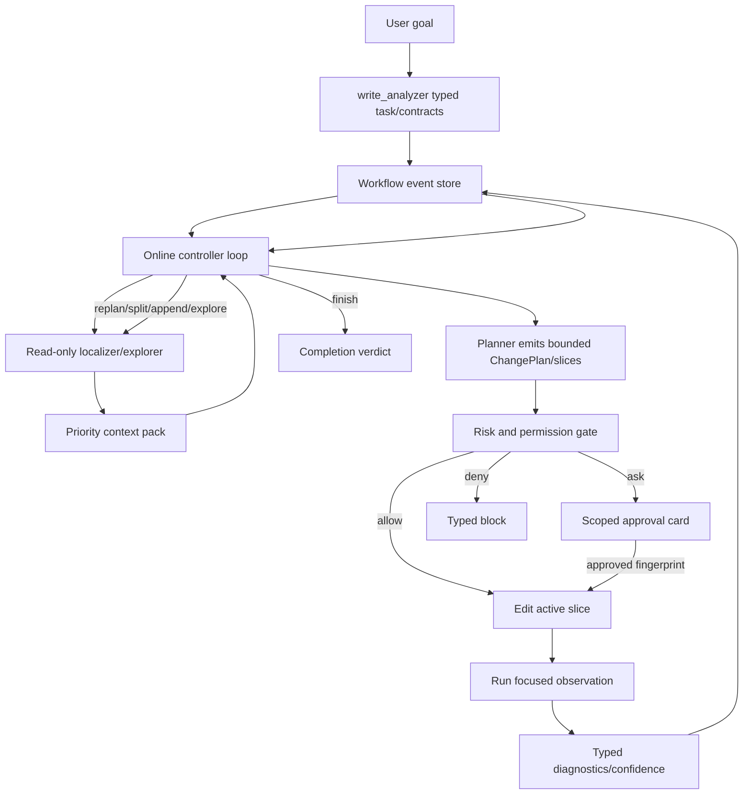

# Codrax Write Mode Claude Code Online Convergence Architecture

Date: 2026-06-17
Branch: main
Status: architecture design, delivery input

## Summary

This document redesigns Codrax write mode around the agent-system lessons from
the 2026 paper *Dive into Claude Code: The Design Space of Today's and Future
AI Agent Systems* and public Claude Code architecture material.

The target is not to clone Claude Code. The target is to absorb the production
architecture principle:

```text
model flexibility lives inside a deterministic, typed, observable harness
```

For Codrax this becomes:

```text
observe typed state -> choose one safe next action -> edit a bounded slice ->
run focused checks -> append typed observation -> continue / explore / replan /
split / ask / block / finish
```

The important shift is from batch processing:

```text
plan all -> apply all -> verify all
```

to online convergence:

```text
edit -> run -> observe -> edit -> run -> observe
```

The DAG is not precomputed in full. It is materialized incrementally from typed
controller actions, slice dependencies, observations, and durable events. This
gives the model room to explore when new facts appear, while keeping hard
state transitions outside prompt prose.

## Sources

Research and public architecture references consulted on 2026-06-17:

- *Dive into Claude Code: The Design Space of Today's and Future AI Agent
  Systems*, arXiv 2604.14228:
  <https://arxiv.org/abs/2604.14228>
- VILA-Lab companion repository:
  <https://github.com/VILA-Lab/Dive-into-Claude-Code>
- Claude Code "How Claude Code works":
  <https://code.claude.com/docs/en/how-claude-code-works>
- Claude Agent SDK agent loop:
  <https://code.claude.com/docs/en/agent-sdk/agent-loop>
- Claude Code permissions:
  <https://code.claude.com/docs/en/permissions>
- Claude Code hooks:
  <https://code.claude.com/docs/en/hooks>
- Claude Code subagents:
  <https://code.claude.com/docs/en/sub-agents>
- Claude Code settings scopes:
  <https://code.claude.com/docs/en/settings>
- Anthropic containment architecture:
  <https://www.anthropic.com/engineering/how-we-contain-claude>
- Anthropic autonomy/checkpoints/subagents/hooks announcement:
  <https://www.anthropic.com/news/enabling-claude-code-to-work-more-autonomously>

Only public documentation, public research summaries, and the paper's own
analysis are used here. This design does not depend on copying proprietary
source code or private material.

## Research Takeaways

### R1: The loop is simple; the harness is the product

The paper describes a simple agentic loop that repeatedly calls the model, runs
tools, and feeds results back. Its main observation is that production value
lives in the surrounding infrastructure: permissions, tool routing, context
management, subagent isolation, recovery, and persistence.

Codrax implication:

- keep `write_controller` actions small and typed;
- move reliability into scheduler state, validators, run stores, risk policy,
  context packs, and verification diagnostics;
- do not make prompts carry hidden state-machine logic.

### R2: One engine should serve all surfaces

Claude Code exposes CLI, headless, SDK, IDE, and related surfaces around the
same core loop.

Codrax implication:

- REPL, CLI, `--plan-file`, SWE-bench adapter, and recovery commands must share
  one workflow engine;
- slash commands are audit/recovery controls, not a parallel scheduler;
- routine Auto Pilot should continue automatically when typed policy allows.

### R3: Safety needs a gradient, not approval fatigue

Claude Code's public model combines deny-first rules, ask/allow modes,
classifier-assisted auto mode, hooks, sandboxing, and checkpoints. The lesson
is not "ask for everything"; over-asking trains users to approve blindly.

Codrax implication:

- low/medium deterministic risk auto-runs;
- high risk asks once, scoped to the smallest useful slice fingerprint;
- critical risk denies automatically;
- uncertainty should trigger safe exploration or typed probes before asking the
  user;
- hard gates must read typed path/content/command/schema/AST signals, never
  user keywords or model rationale.

### R4: Context is a scarce runtime resource

Claude Code uses layered context shaping, memory, subagents, and summary-only
returns to keep long sessions useful without dumping all prior tokens into the
next call.

Codrax implication:

- `WriteContextPack` is the write-mode memory bus;
- raw transcripts stay durable, but controller/planner/verifier consume
  consumer-specific Top-N typed views;
- P0/P1/P2 evidence must survive retries, compaction, process restart, and
  replan;
- visible `<think>` logs remain user transparency, but hard logic must never
  parse them.

### R5: Subagents are isolation boundaries

Claude Code treats subagents as separate context windows with specialized
tools, permissions, and summary returns.

Codrax implication:

- heavy localization should run in read-only exploration/localizer workers;
- those workers return typed handoff, not raw exploration prose;
- coder and verifier should not inherit broad exploration privileges;
- subagent output is lower-trust data unless converted into typed artifacts
  with evidence refs.

### R6: Append-oriented state enables resume, audit, and fork

Claude Code's session persistence direction is append-oriented transcripts and
sidechains. Session state outlives live context; permissions are rebuilt on
resume rather than blindly trusted.

Codrax implication:

- `WriteWorkflowRun` should be the durable source of truth;
- controller events, slice attempts, approvals, checks, artifacts, and
  completion verdicts should append to a ledger;
- resume should rebuild executable state from typed records and current
  policies;
- UI and eval adapters should render from typed state, not progress prose.

## Current Codrax Baseline

Current main already contains major foundations:

- controller-first write mode via `runWriteControllerWorkflow`;
- typed `emit_write_workflow_decision`;
- durable `WriteWorkflowRun` with batches, attempts, progress, context packs,
  completion verdicts, slices, and slice events;
- `ChangePlanSlice` derivation and slice-aware active apply/observe helpers;
- `WriteContextPack` P0-P3 handoff;
- apply-pre risk/approval gate with plan fingerprints;
- post-apply typed verify reports, diagnostics, confidence records, and
  SWE-bench prediction export;
- isolated git worktree execution and unconditional cleanup invariants;
- read/log/trace/data/operation/computer modes isolated from write tools.

This is directionally correct. The remaining gaps are about control-plane
coherence, not adding more prompt instructions.

## Gap Ledger

### G1: Online loop is not yet the only mental model

The runtime has slice structs and active-slice helpers, but several surfaces
still describe or behave like `plan -> apply -> verify`. Large tasks can still
feel like one big batch with smaller internal bookkeeping.

Required direction:

- make `Edit/Run/Observe` the primary scheduler contract;
- make batch a grouping/persistence unit, not the execution unit;
- every terminal decision must be based on active slice/batch typed verdicts.

### G2: Observation confidence can accept weak local evidence

SWE-bench Lite smoke runs can produce harness-consumable predictions while
manual audit still finds wrong-layer or incomplete patches. Examples observed
in the latest local run:

- `matplotlib__matplotlib-24149`: patch handled one failing safe-first-finite
  path but not the companion path in the gold fix;
- `sympy__sympy-12481`: patch changed a nearby helper instead of the root
  `Permutation.__new__` behavior;
- `pylint-dev__pylint-6506`: local probe passed but confidence downgraded
  because behavior-contract refs were not attached.

Required direction:

- separate "local command passed" from "behavior contract sufficiently covered";
- require typed confidence records for contract refs, changed-symbol refs, and
  source-localization coverage;
- allow delivery under unavailable environments, but export confidence and
  caveats instead of pretending success.

### G3: Exploration-to-planner handoff can lose localization strength

When a failure requires locating code from symptoms, the planner can still miss
the actual root symbol if read budget is exhausted or if earlier evidence is
rendered too weakly.

Required direction:

- exploration must produce typed target symbols, root-cause hypotheses,
  negative evidence, and line-backed evidence refs;
- planner must receive active slice P0/P1/P2 views with dedupe and must-carry
  rules;
- if a plan edits outside the evidence-backed localization set, confidence
  should downgrade or the controller should re-explore while budget remains.

### G4: Tool-output and request preprocessing can inject noisy entities

Recent evaluation showed analyzer pre-scan caution can treat large code or
traceback fragments as identifier-like hints, which bloats context and may
distract write planning.

Required direction:

- hard preprocessors should apply structural candidate hygiene:
  newline/control-character rejection, bounded length, bounded whitespace and
  punctuation density, source-origin awareness when available;
- this must be a generic syntax/shape filter, not matching issue keywords or
  model summaries.

### G5: Planner repair still costs too much model attention

`emit_change_plan` repair has improved, but repeated schema/anchor/JSON-string
carrier failures still spend turns and can reopen exploration unnecessarily.

Required direction:

- provide a compact typed `PlanRepairPack` on rejection;
- hydrate missing stable fields from durable context where safe;
- keep validation strict, but reduce model working memory by returning exact
  allowed enum/options/current bytes in one bounded repair surface.

### G6: Verify unavailable is not a failure, but it is not success

Customer repositories may lack pytest, project deps, compilers, services, or
external test fixtures. This must not hard-block code delivery. It also must
not erase evidence that the patch may be incomplete.

Required direction:

- keep `verified`, `unverified`, and `accepted_failed` as separate completion
  verdicts;
- project dependency/env failures should become typed diagnostics and P2
  context, not hard failure of the code;
- syntax/build failures in touched source remain hard failures;
- behavior probes and contract coverage should drive confidence even when full
  suite is unavailable.

### G7: UX still exposes too many recovery controls

`/workflow`, `/plan`, `/approve`, `/reject`, `/verify`, `/merge` are useful for
debugging, but routine users should not act as the outer scheduler.

Required direction:

- Auto Pilot should resume safe active runs automatically;
- status cards should show what Codrax is doing and why it paused;
- only high-risk approval, critical denial, missing user facts, or exhausted
  budgets should require user action.

## Target Architecture

### Layered Control Plane



### Runtime Loop

The write-mode engine should converge on this loop:

```text
for workflow not terminal:
  state_view = assemble_typed_view(run, active_slice, context_pack, diagnostics)
  decision = model_emit_controller_action(state_view)
  decision = hydrate_and_validate(decision, run, mode, policy, budget)
  event = execute_one_bounded_effect(decision)
  append_event(run, event)
  compact_or_project_context(run)
```

Rules:

- model may choose the next typed action;
- harness decides whether the action is executable;
- state changes are produced by scheduler transitions, tool results, and
  append events;
- no hard branch reads natural-language prose, user keyword matches, model
  summary/rationale, or visible `<think>` logs.

### Incremental DAG

The DAG is a materialized event graph:

```text
Run
  Batch
    Slice
      explore_ref?
      plan_ref
      approval_ref?
      apply_ref
      observe_ref
      confidence_ref
      completion
```

Edges:

- `seed`: task or imported plan enters workflow;
- `explore`: localizer evidence updates context pack;
- `plan`: `ChangePlan` or replan updates slice graph;
- `apply`: active slice edited in worktree;
- `observe`: focused probes/tests/build checks run;
- `split`: one problem decomposes into smaller slices;
- `followup`: verified slice reveals new needed work;
- `replan`: failed/unverified slice gets a new plan;
- `block`: policy, budget, or missing-fact stop.

The controller can add nodes when reality demands it. The user should not have
to predict the DAG upfront.

## Agent And Tool Roles

| Role | Purpose | Tools | Hard limits |
| --- | --- | --- | --- |
| controller | choose next workflow action | `emit_write_workflow_decision` | no file writes, no shell, no direct patching |
| write_analyzer | typed task/contracts/risk seed | `emit_write_analysis`, limited reads | no broad exploration loop |
| localizer | symptom-driven code exploration | read/search/repomap/read-only test discovery | returns typed handoff only |
| planner | produce bounded plan/slices | read/search windows, dry-run typed probes, plan emit | cannot mutate worktree |
| coder | apply active slice | `apply_patch` over plan-owned changes | cannot author new content outside plan |
| verifier | observe active slice | typed probes, build/test tools, bounded read-only checks | cannot declare success by narrative |
| policy engine | gate actions | typed path/content/command/schema signals | deny-first, no prompt prose |

Tool surfaces should be assembled per role. Forbidden tools should be absent
from the schema when possible, and runtime guards should remain as a second
line of defense.

## Permission And Approval Model

Use a unified `allow / ask / deny` decision:

- `allow`: low/medium deterministic risk, worktree-bounded, repo-relative,
  typed command policy permits, no critical path/content signal;
- `ask`: high deterministic risk, scoped to active slice fingerprint;
- `deny`: critical risk, external path without explicit configured trust,
  `.git` mutation, secret material, destructive command, policy disallowed
  managed scope.

Approval record:

```text
policy_version
risk_level
action
reason_codes[]
plan_id
slice_id
fingerprint
user_decision
decided_at
source
```

Approval fatigue controls:

- ask at most once per slice fingerprint;
- if the plan changes, fingerprint changes and approval must be reacquired;
- safe retries and re-observations never ask;
- high-risk approval pauses the run, but safe unrelated completed slices stay
  intact;
- critical denial is automatic and visible as a typed block.

## Observation And Confidence

Verifier output must be a typed package:

```text
syntax: passed | failed | skipped
build: passed | failed | unavailable | skipped
tests: passed | failed | unavailable | skipped
probes: []ProbeVerdict
behavior_contract_coverage: []ContractCoverage
changed_symbol_coverage: []SymbolCoverage
environment: []EnvDiagnostic
confidence: high | medium | low | unverified
reason_codes[]
```

Rules:

- source syntax/build errors in touched files are hard failures;
- missing pytest/deps/test harness is `unavailable`, not code failure;
- passing a weak probe can only raise confidence when it references behavior
  contracts or changed symbols;
- verify narrative is trace-only;
- `ChangeReport.Passed` must derive from typed verdicts, not subtest prose;
- P2 context pack must preserve failure path, line, command, stderr summary,
  artifact refs, and next focused surface.

Completion verdicts:

- `verified`: typed checks prove the active obligations passed;
- `unverified`: local environment/test surface unavailable, but no hard source
  failure;
- `accepted_failed`: explicit typed finish disposition accepts residual failure;
- `blocked`: policy, missing facts, retry budget, or source failure prevents
  safe continuation.

## Context Pack And Handoff

`WriteContextPack` should be treated as a durable context store with per-consumer
views:

- P0: user constraints, safety boundaries, behavior contracts, approval/risk,
  scope boundaries;
- P1: target files, symbols, root-cause hypotheses, invariants, line-backed
  evidence refs;
- P2: test surfaces, verify failures, environment diagnostics, unknowns,
  negative evidence;
- P3: style/pattern hints and repo conventions.

Consumer projections:

| Consumer | View |
| --- | --- |
| controller | P0 safety + active batch/slice state + latest P2 diagnostics |
| planner | P0 contracts + P1 localization + active P2 failure + exact byte anchors |
| verifier | P0 contracts + slice paths + probes + P2 test surfaces |
| final/status UI | completion verdict + top caveats + artifact refs |

Dedup keys should include:

```text
priority + consumer + kind + path + symbol + line_range + evidence_ref +
contract_ref + source_stage
```

This avoids repeated exploration while preserving evidence richness.

## Context Shaping

Borrow the idea of layered context shaping, adapted to Codrax:

1. tool-output budgeting: large outputs stored as artifacts with previews;
2. per-role Top-N context-pack projection;
3. active-slice view: only current slice plus dependency summaries;
4. failure-focused P2 carry: latest failed observation is must-carry;
5. compact ledger rows for completed slices;
6. raw transcript/log visibility remains for the user and audit, but is not
   model-facing by default once projected into typed artifacts.

This is not vector memory. Codrax should favor inspectable JSON/Markdown
artifacts because the project already prizes reproducibility, local files, and
typed red lines.

## Subagent And Worker Isolation

Codrax should use subagent-style isolation for heavy reads and verification:

- `LocalizerWorker`: read-only, search/repomap/windowed reads, returns
  `WriteExplorationHandoff` and context-pack items;
- `ProbeWorker`: builds typed probes from P0 contracts when planner omitted
  coverage metadata, but never changes source;
- `VerifierWorker`: runs focused checks and normalizes outputs into typed
  `ChangeReport`/diagnostics.

Each worker should have:

- explicit tool allowlist;
- independent budget;
- sidechain log/artifact refs;
- summary-only typed return;
- trust boundary marking so parent controller does not treat worker prose as
  hard evidence.

## UX Design

Routine flow:

```text
user asks for change
Codrax explores if needed
Codrax edits one bounded slice
Codrax runs focused checks
Codrax continues
Codrax pauses only for high-risk approval or true blockage
```

User-visible surfaces:

- progress cards from `WriteWorkflowNextActionView`;
- active slice and latest observation summary;
- high-risk approval card with paths, reason codes, fingerprint, and diff
  preview;
- completion card with `verified` / `unverified` / `accepted_failed` verdict;
- audit links to workflow run, plan, report, diff, and context pack artifacts.

Advanced commands remain but should not be part of routine use:

- `/workflow show|list|resume|clear`;
- `/plan show|list`;
- `/approve` and `/reject` when paused;
- `/verify` for manual audit;
- `/merge` as explicit final consent.

No new routine command should be introduced unless it removes more user burden
than it adds.

## Design Differences From Claude Code

Codrax should intentionally differ in several places:

- Codrax has a strict read-mode L1 byte-preservation red line; write changes
  must not perturb read scheduler behavior.
- Codrax is repository-bound and already worktree-isolated; it does not need a
  broad plugin/MCP extension surface for write-mode MVP.
- Codrax should prefer typed artifacts over conversational memory for
  production hard gates.
- Codrax should not persist session-scoped approvals as ambient future trust;
  approvals bind to slice fingerprints.
- Codrax's eval path must export prediction confidence and harness
  consumability separately from local verification.

## Delivery Tasks

### Batch 0: Design Ledger

- Add this architecture document.
- Record sources, current gap ledger, target architecture, task list, red
  lines, and acceptance criteria.
- Commit and push.

### Batch 1: Pre-scan And Context Hygiene

- Add structural candidate hygiene for analyzer/request entity surfaces:
  newline/control rejection, length cap, whitespace density cap, punctuation
  density cap, source-origin demotion when available.
- Ensure filters are generic shape constraints, not user intent keywords.
- Add tests that multiline code/traceback fragments are omitted while valid
  identifiers, dotted symbols, and repo-relative paths remain.
- Verify read-mode behavior and write-mode analyzer hints.

Primary files:

- `internal/agent/analyzer.go`
- `internal/analysis/prescan/`
- `internal/agent/analyzer_overview_test.go`

### Batch 2: Observation Confidence Contract

- Promote behavior-contract coverage and changed-symbol coverage into a first
  class `VerificationConfidence` package consumed by controller, verifier, eval
  adapter, and status surfaces.
- Ensure weak probes cannot produce high confidence without contract or symbol
  coupling.
- Make unavailable environment diagnostics visible but non-blocking.

Primary files:

- `internal/types/change_plan.go`
- `internal/writeflow/verify_attempt_outcome.go`
- `internal/orchestrator/write_controller_scheduler.go`
- `eval/swebench/validate_predictions.py`

### Batch 3: Active Slice State Machine

- Make active slice the scheduler execution unit everywhere.
- Add transitions:
  `pending -> applying -> observing -> verified|unverified|failed|blocked`.
- Protect previously verified slices from replan unless typed dependency impact
  says they are stale.
- Ensure batch status derives from slice states.

Primary files:

- `internal/types/change_plan_slice.go`
- `internal/types/write_workflow_run.go`
- `internal/orchestrator/write_controller_scheduler.go`
- `internal/writeflow/attempt_state.go`

### Batch 4: Localizer Worker And Evidence-Coverage Gate

- Wrap read-only exploration as a named localizer worker with sidechain
  artifacts.
- Require planner to receive P0/P1/P2 active-slice views after localization.
- Add a typed evidence-coverage gate: if a plan edits outside evidence-backed
  localization and budget remains, downgrade confidence or request
  re-exploration.

Primary files:

- `internal/orchestrator/write_exploration_subflow.go`
- `internal/types/write_context_pack.go`
- `internal/agent/write_context_pack_prompt.go`
- `internal/writeflow/context_pack.go`

### Batch 5: PlanRepairPack

- Consolidate schema/patch/old-text/probe rejection into a compact typed
  `PlanRepairPack`.
- Return bounded current bytes, accepted enum values, failing field paths, and
  exact validator reason codes.
- Do not relax validation.
- Do not route from rejection prose.

Primary files:

- `internal/tool/emit_change_plan.go`
- `internal/tool/emit_plan_change.go`
- `internal/agent/tool_params_repair.go`
- `internal/types/change_plan.go`

### Batch 6: Permission Engine Unification

- Centralize write/operation permission decisions into a shared typed policy
  engine.
- Keep deny-first precedence.
- Bind approval to active slice fingerprint.
- Add scoped high-risk prompts and critical auto-deny tests.
- Ensure forbidden tools are absent from schema where possible and blocked at
  runtime as defense in depth.

Primary files:

- `internal/writeflow/risk.go`
- `internal/operation/approval.go`
- `internal/tool/exec_supervisor.go`
- `internal/orchestrator/write_approval_gate_test.go`

### Batch 7: Context Shaping And Durable Sidechains

- Store large tool outputs and worker transcripts as artifacts.
- Render active-slice compact views into controller/planner/verifier prompts.
- Preserve raw visibility in logs/output artifacts for user transparency.
- Add dedupe keys and Top-N tests for context packs.

Primary files:

- `internal/types/write_context_pack.go`
- `internal/agent/write_context_pack_prompt.go`
- `internal/orchestrator/write_controller_scheduler.go`
- `.codrax` artifact store integration points

### Batch 8: UX Auto Pilot Polish

- Make routine REPL/CLI write flow command-light:
  auto-resume safe active runs, render typed status cards, and pause only when
  user action is genuinely required.
- Keep `/workflow` and `/plan` as advanced audit/recovery tools.
- Update `docs/user_guide.md`, `docs/user_guide.html`, and
  `docs/architecture.md`.

Primary files:

- `internal/repl/`
- `internal/orchestrator/write_run_guidance.go`
- `docs/user_guide.md`
- `docs/user_guide.html`
- `docs/architecture.md`

### Batch 9: SWE-bench And Customer-Style Evaluation

- Run multiple non-Go SWE-bench Lite instances.
- Include symptom-only issue cases where Codrax must localize before fixing.
- Validate predictions are non-empty and accepted by the official harness.
- Manually audit correctness against gold patches and record gaps.
- Treat missing pytest/deps as unverified diagnostics, not hard blocker.

Primary files:

- `eval/swebench/run_codrax_swebench.py`
- `eval/swebench/validate_predictions.py`
- `docs/design/write_mode_direct_build_commercial_delivery_20260614.md`

### Batch 10: Commercial Hardening

- Full regression:
  - `go test ./...`
  - `make`
  - `git diff --check`
  - SWE-bench local smoke
  - selected Lite smoke
- Red-line tests:
  - read scheduler L1 byte-preserved;
  - write tools do not import read grounding;
  - prompt hygiene forbids hard routing via prose/user keywords/model summary;
  - visible `<think>` remains allowed in user-facing logs;
  - worktree cleanup invariant holds.

## Acceptance Criteria

- Write mode runs a true online loop: edit one bounded slice, observe, then
  continue or replan.
- Controller can dynamically add exploration, split, followup, and replan nodes
  without a precomputed full plan.
- Low/medium risk work proceeds without routine approval; high risk asks once
  per active slice fingerprint; critical risk denies.
- Verification result is a typed package; controller never treats subtest
  narrative or model prose as success.
- Missing pytest/deps does not hard-block delivery, but completion is marked
  `unverified` with diagnostics and confidence caveats.
- Exploration evidence and verify failures survive handoff into planner and
  controller via priority context packs.
- Planner repair uses typed `PlanRepairPack`, not repeated broad retries.
- User routine flow is Auto Pilot; advanced commands are for audit/recovery.
- Read/log/trace/data/operation/computer modes are not regressed.
- SWE-bench predictions are harness-consumable and carry confidence/verdict
  metadata suitable for manual audit.

## Prompt And Routing Red Lines

- Prompt text may guide, but cannot enforce.
- Hard gates read only typed artifacts, enums, booleans, numeric budgets,
  schema results, AST/parser output, file paths, fingerprints, and tool
  verdicts.
- No user-intent keyword matching.
- No model summary/rationale/prose parsing.
- No `<think>` parsing for business logic.
- No case-specific SWE-bench ID routing.
- No broad new dependencies; prefer existing Go stdlib and current
  `gopkg.in/yaml.v3` allowance.

## Progress Ledger

| Batch | Status | Notes |
| --- | --- | --- |
| 0 | complete | Architecture ledger added and ready for commit. |
| 1 | pending | Pre-scan/context hygiene. |
| 2 | pending | Observation confidence contract. |
| 3 | pending | Active slice state machine. |
| 4 | pending | Localizer worker and evidence coverage. |
| 5 | pending | PlanRepairPack. |
| 6 | pending | Permission engine unification. |
| 7 | pending | Context shaping and durable sidechains. |
| 8 | pending | UX Auto Pilot polish. |
| 9 | pending | SWE-bench/customer-style eval. |
| 10 | pending | Commercial hardening. |
