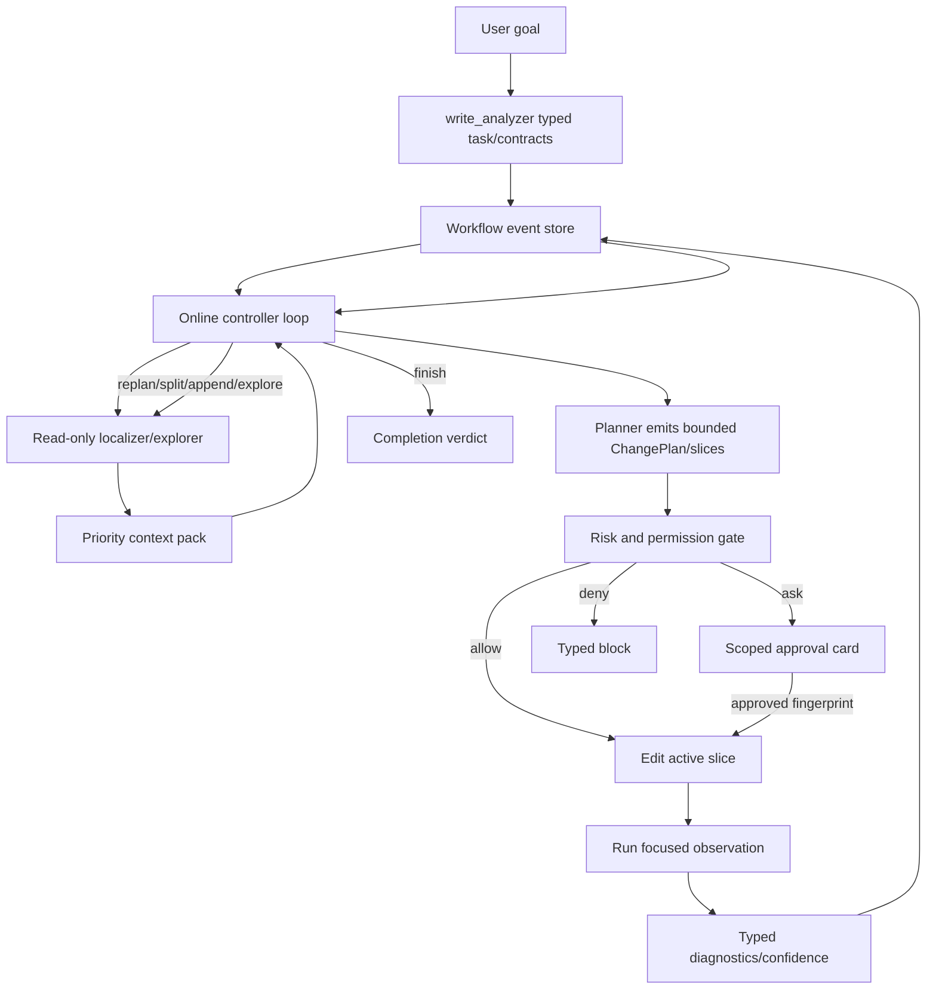

# Codrax Write Mode Claude Code Online Convergence Architecture

Date: 2026-06-17
Branch: main
Status: architecture design, delivery input

## Summary

This document redesigns Codrax write mode around the agent-system lessons from
the 2026 paper *Dive into Claude Code: The Design Space of Today's and Future
AI Agent Systems* and public Claude Code architecture material.

The target is not to clone Claude Code. The target is to absorb the production
architecture principle:

```text
model flexibility lives inside a deterministic, typed, observable harness
```

For Codrax this becomes:

```text
observe typed state -> choose one safe next action -> edit a bounded slice ->
run focused checks -> append typed observation -> continue / explore / replan /
split / ask / block / finish
```

The important shift is from batch processing:

```text
plan all -> apply all -> verify all
```

to online convergence:

```text
edit -> run -> observe -> edit -> run -> observe
```

The DAG is not precomputed in full. It is materialized incrementally from typed
controller actions, slice dependencies, observations, and durable events. This
gives the model room to explore when new facts appear, while keeping hard
state transitions outside prompt prose.

## Sources

Research and public architecture references consulted on 2026-06-17:

- *Dive into Claude Code: The Design Space of Today's and Future AI Agent
  Systems*, arXiv 2604.14228:
  <https://arxiv.org/abs/2604.14228>
- VILA-Lab companion repository:
  <https://github.com/VILA-Lab/Dive-into-Claude-Code>
- Claude Code "How Claude Code works":
  <https://code.claude.com/docs/en/how-claude-code-works>
- Claude Code permissions:
  <https://code.claude.com/docs/en/permissions>
- Claude Agent SDK hooks:
  <https://code.claude.com/docs/en/agent-sdk/hooks>
- Claude Agent SDK subagents:
  <https://code.claude.com/docs/en/agent-sdk/subagents>
- Claude Code settings scopes:
  <https://code.claude.com/docs/en/settings>
- OpenCode permissions, for an independent public comparison point on
  `allow / ask / deny` and agent-scoped permission surfaces:
  <https://opencode.ai/docs/permissions/>
- OpenCode agents, for task/subagent permission and max-step UX comparison:
  <https://opencode.ai/docs/agents/>
- VILA-Lab companion architecture deep dive:
  <https://github.com/VILA-Lab/Dive-into-Claude-Code/blob/main/docs/architecture.md>
- Public architecture synthesis covering tools, memory, hooks, MCP, sandboxing,
  and permissions:
  <https://www.penligent.ai/hackinglabs/inside-claude-code-the-architecture-behind-tools-memory-hooks-and-mcp/>
- Anthropic managed-agents engineering note on brain/hand separation and
  long-horizon context:
  <https://www.anthropic.com/engineering/managed-agents>
- Anthropic containment architecture:
  <https://www.anthropic.com/engineering/how-we-contain-claude>
- Anthropic autonomy/checkpoints/subagents/hooks announcement:
  <https://www.anthropic.com/news/enabling-claude-code-to-work-more-autonomously>

Only public documentation, public research summaries, and the paper's own
analysis are used here. This design does not depend on copying proprietary
source code or private material.

## Evidence Boundary

This design deliberately treats the paper and public Claude Code material as
architecture research, not as an implementation source. The useful signal is
the design-space shape:

- production coding agents converge on a small model loop surrounded by a thick
  deterministic harness;
- the public product loop blends context gathering, action, and verification
  rather than forcing a one-shot plan;
- the paper's seven-component decomposition is a vocabulary for choosing
  Codrax boundaries, not a file-by-file recipe;
- public permission, hook, and subagent docs explain product semantics and
  failure modes that Codrax can adopt with its own typed artifacts;
- any source-leak-specific detail that is not reproduced in the paper or
  official/public documentation remains out of scope.

The resulting Codrax design must therefore be evaluated against Codrax's own
red lines: typed hard gates, no prompt/prose routing, no user-intent keyword
matching, worktree isolation, read-mode byte preservation, visible reasoning
transparency, and stable non-write modes.

## 2026-06-17 Public Research Refresh

The latest external check reconfirmed four architecture lessons that should
shape the Codrax write-mode control plane:

- The arXiv paper frames Claude Code as a small model/tool while-loop wrapped
  by a much thicker production harness: permissions, tool routing, context
  management, subagent orchestration, recovery, and append-oriented session
  storage. Codrax should therefore keep the online controller simple and put
  commercial reliability into deterministic state assembly, action validation,
  permission brokerage, effect execution, observation normalization, context
  projection, and event appending.
- Official Claude Code documentation describes the product loop as repeated
  model evaluation, tool calls, observations, and continuation until no further
  tool calls are needed. It also documents that practical bug-fix work may run
  tests, read files, edit, and rerun tests in multiple turns. Codrax should make
  `edit -> run -> observe` the write-mode execution invariant rather than a
  prompt suggestion layered on top of batch apply.
- Official context/session documentation highlights automatic compaction,
  context-cost visibility, deferred tool schemas, skills loaded on demand, and
  subagents with separate context windows that return summaries. Codrax should
  rebuild model-facing write context from durable typed views and artifact refs,
  while keeping raw logs and visible reasoning available for user transparency.
- Official safety documentation highlights checkpoints and permissions as
  complementary controls: permissions decide what can be attempted without
  asking, while checkpoints/isolated execution reduce blast radius. Codrax
  should approve or deny immediately before each bounded slice effect, bind
  high-risk approval to slice fingerprints, and keep file restore metadata for
  each applied slice.

These points do not justify importing Claude Code's product surface wholesale.
Codrax is a repository-bound code-analysis and change system, so the correct
architecture is a task harness: one durable workflow loop, role-scoped tools,
typed permissions, priority handoff, worktree isolation, and command-light Auto
Pilot UX.

## Research Takeaways

### R1: The loop is simple; the harness is the product

The paper describes a simple agentic loop that repeatedly calls the model, runs
tools, and feeds results back. Its main observation is that production value
lives in the surrounding infrastructure: permissions, tool routing, context
management, subagent isolation, recovery, and persistence.

Codrax implication:

- keep `write_controller` actions small and typed;
- move reliability into scheduler state, validators, run stores, risk policy,
  context packs, and verification diagnostics;
- do not make prompts carry hidden state-machine logic.

### R2: One engine should serve all surfaces

Claude Code exposes CLI, headless, SDK, IDE, and related surfaces around the
same core loop.

Codrax implication:

- REPL, CLI, `--plan-file`, SWE-bench adapter, and recovery commands must share
  one workflow engine;
- slash commands are audit/recovery controls, not a parallel scheduler;
- routine Auto Pilot should continue automatically when typed policy allows.

### R3: Safety needs a gradient, not approval fatigue

Claude Code's public model combines deny-first rules, ask/allow modes,
classifier-assisted auto mode, hooks, sandboxing, and checkpoints. The lesson
is not "ask for everything"; over-asking trains users to approve blindly.

Codrax implication:

- low/medium deterministic risk auto-runs;
- high risk asks once, scoped to the smallest useful slice fingerprint;
- critical risk denies automatically;
- uncertainty should trigger safe exploration or typed probes before asking the
  user;
- hard gates must read typed path/content/command/schema/AST signals, never
  user keywords or model rationale.

### R4: Context is a scarce runtime resource

Claude Code uses layered context shaping, memory, subagents, and summary-only
returns to keep long sessions useful without dumping all prior tokens into the
next call.

Codrax implication:

- `WriteContextPack` is the write-mode memory bus;
- raw transcripts stay durable, but controller/planner/verifier consume
  consumer-specific Top-N typed views;
- P0/P1/P2 evidence must survive retries, compaction, process restart, and
  replan;
- visible `<think>` logs remain user transparency, but hard logic must never
  parse them.

### R5: Subagents are isolation boundaries

Claude Code treats subagents as separate context windows with specialized
tools, permissions, and summary returns.

Codrax implication:

- heavy localization should run in read-only exploration/localizer workers;
- those workers return typed handoff, not raw exploration prose;
- coder and verifier should not inherit broad exploration privileges;
- subagent output is lower-trust data unless converted into typed artifacts
  with evidence refs.

### R6: Append-oriented state enables resume, audit, and fork

Claude Code's session persistence direction is append-oriented transcripts and
sidechains. Session state outlives live context; permissions are rebuilt on
resume rather than blindly trusted.

Codrax implication:

- `WriteWorkflowRun` should be the durable source of truth;
- controller events, slice attempts, approvals, checks, artifacts, and
  completion verdicts should append to a ledger;
- resume should rebuild executable state from typed records and current
  policies;
- UI and eval adapters should render from typed state, not progress prose.

### R7: Public docs confirm the edit/run/observe loop as a product contract

The Claude Code Agent SDK documentation describes the loop as: evaluate the
prompt, request tool calls, execute tools, feed results back, and repeat until
there are no more tool calls. It also documents the practical example that a
task may run tests, read files, edit code, and run tests again in successive
turns. Public permission docs describe allow/ask/deny, deny precedence across
scopes, scoped tool rules, and hooks that can intercept calls without bypassing
permission rules. Public subagent docs emphasize separate context windows,
specific tool access, independent permissions, and summary-only returns for
verbose side work.

Codrax implication:

- the user-facing write product should feel like a continuous repair loop, not
  a sequence of commands the user has to orchestrate;
- permission and action validation must happen immediately before each bounded
  effect, not only around a large plan artifact;
- subagent/localizer output must be summarized into typed context items before
  the controller or planner can rely on it;
- progress visibility should be streamed from typed lifecycle events while raw
  reasoning/log text remains transparent but non-authoritative.

### R8: The query loop is stateful, but state is not model prose

The paper's source-level analysis describes a fixed query pipeline around the
while-loop: resolve settings, initialize one mutable state object, assemble
post-compaction context, apply context shapers, call the model, dispatch tool
uses, then continue from updated state. The companion repository highlights the
same architectural split: only a small fraction of the product is model
decision logic; most reliability comes from deterministic infrastructure.

Codrax implication:

- introduce a small write-loop runtime kernel instead of another large prompt:
  state assembler, action validator, permission broker, effect executor,
  observation normalizer, context projector, and event appender;
- every model turn receives a typed `WriteWorkflowStateView`, not an
  accumulated transcript dump;
- every continuation point writes a new immutable event row, then derives the
  next state view from the durable ledger;
- raw logs and visible `<think>` remain transparent to users, but never become
  continuation state unless a typed tool/projector converts them into a schema
  artifact.

### R9: Deferred tools, result budgets, and subagent summaries are context
control mechanisms

The paper calls out deferred tool schemas, per-tool-result budgets, and
summary-only subagent returns as production context controls. Public subagent
docs similarly emphasize tool allowlists, permission modes, scoped MCP access,
and summary returns.

Codrax implication:

- role tool surfaces should be schema-thin and loaded by need: controller sees
  only decisions, localizer sees read/search, coder sees bounded edit/apply,
  verifier sees typed checks;
- large command output must be artifact-backed with a bounded preview and typed
  diagnostic rows;
- localizer/probe/verifier workers should return typed summaries plus artifact
  refs, never raw full transcripts as planner authority;
- prompt cost and attention cost are first-class scheduler resources, not only
  LLM token accounting.

### R10: Permissions, hooks, and checkpoints are layered controls

Public Claude Code permission docs describe layered evaluation: hooks first,
then deny rules, ask rules, permission mode, allow rules, and callback. Public
checkpointing docs also document an important limitation: file checkpoints
track built-in edit/write tools, not arbitrary shell mutations.

Codrax implication:

- Codrax should keep deny-first `allow / ask / deny`, but tie every approval to
  the active slice fingerprint rather than ambient session trust;
- lifecycle hooks should initially be internal typed scheduler hooks, not
  user-authored shell hooks with broad host authority;
- before each applied slice, the worktree should have a typed restore point:
  plan fingerprint, pre-apply diff/ref, changed path set, and policy record;
- command tools that can mutate files must either be prohibited for write roles
  or tracked as explicit effects with restore metadata. Otherwise they stay in
  read-only/probe lanes.

### R11: Authority and approval fatigue must be designed together

The paper's value framing treats human decision authority and safety as
separate but coupled concerns. Public permission material also shows why
argument-pattern approval rules are fragile for shell commands and why
read-only command recognition should be structural.

Codrax implication:

- user authority should appear at high-value boundaries: high-risk active
  slice approval, explicit merge/publish, and true missing facts;
- routine low/medium edits and read-only investigation should continue without
  interrupting the user;
- approval records must be narrow, typed, fingerprinted, and resumable;
- command policy should parse command structure, wrappers, compounds, argv, cwd
  and environment effects instead of relying on prompt instructions or broad
  textual allow rules;
- "more prompts" is not safer when it trains operators to approve blindly.

### R12: OpenClaw contrast argues for a task harness, not a gateway clone

The paper contrasts Claude Code with OpenClaw and notes that recurring design
questions stay stable while deployment answers differ. OpenClaw's gateway
control plane is a good answer for multi-channel personal assistants; Codrax is
repo-bound and code-change focused.

Codrax implication:

- keep write mode as a repository harness centered on worktree, typed plan,
  typed observe, and durable workflow state;
- do not add a broad gateway plugin/MCP write surface as part of this redesign;
- operation/data/computer workflows can keep their own provider DAGs, while
  write mode exposes only typed handoff boundaries to them;
- subagent-like workers should be specialized internal workers first
  (`LocalizerWorker`, `ProbeWorker`, `VerifierWorker`) before user-configurable
  nested agent hierarchies are introduced.

### R13: Long-horizon success depends on checkpoints and state derivation

The paper's persistence discussion and public session/checkpoint docs point to
one lesson: resume cannot trust live context. Executable state must be derived
from persisted events and current policy.

Codrax implication:

- `WriteWorkflowRun` is the only durable authority for write progress;
- each active slice needs pre-apply restore metadata, effect refs, observe
  refs, confidence records, and completion verdicts;
- resume should recompute permission/approval validity from current policy and
  fingerprints, not replay old model text;
- future fork/rewind support should use the same slice event store and worktree
  snapshots, not a second state system.

### R14: Tool schema exposure is part of context management

The paper calls out deferred tool schemas and result budgets as context
controls. Public subagent docs similarly emphasize narrow tool access and
summary-only parent returns.

Codrax implication:

- controller turns should see only controller actions and typed state view;
- localizer turns should see read/search/code-map tools and bounded output
  artifact refs;
- planner turns should see exact-byte windows, dry-run probes, prior context,
  and plan emit tools;
- coder turns should see only the active slice plan and apply tool;
- verifier turns should see test/probe/build tools and typed observation emit;
- large tool outputs must become artifacts with previews before the next model
  call.

## Research To Codrax Decision Matrix

The following matrix translates the public research into Codrax-specific
architecture. It is intentionally phrased as implementation decisions rather
than prompt tips.

| Research signal | Codrax design decision | Hard-gate boundary |
| --- | --- | --- |
| Agent loop blends gather/action/verify and repeats until done. | Replace write-mode batch thinking with an online slice loop: localize, apply one bounded slice, observe, then continue/replan/split. | Controller consumes only `WriteWorkflowDecision`, slice state, `ChangeReport`, and policy records. |
| Production value lives around the simple loop: permission, context, persistence, recovery. | Keep prompts small; put commercial behavior into typed stores, validators, event ledgers, context packs, and approval records. | No state transition is inferred from model prose, rationale, summaries, logs, or `<think>`. |
| Permissions use deny-first policy and mode-specific auto approval. | Low/medium deterministic writes continue automatically; high-risk slice fingerprints ask; critical paths/commands deny. | Path/content/command policy consumes normalized paths, parsers, fingerprints, and typed command classification only. |
| Subagents preserve context and enforce tool boundaries. | Localizer/probe/verifier workers return typed artifacts with evidence refs; coder does not inherit broad exploration privileges. | Worker summaries are soft guidance until converted into `WriteContextPack`, `WriteExplorationHandoff`, `ChangePlan`, or `ChangeReport`. |
| Long sessions need compaction, resume, checkpoints, and artifact sidechains. | `WriteWorkflowRun` is append-oriented durable state; large outputs live as artifact refs; active-slice state persists before and after edits. | Resume rebuilds trust from current policy plus persisted typed records, not old conversation text. |
| Public best practices emphasize verification and early course correction. | Verification confidence, probe coverage, failure evidence, and prior-context coverage become explicit audit signals; unavailable local env lowers confidence without blocking patch export. | Confidence signals can trigger soft re-explore/replan decisions but do not become hidden keyword gates. |

## Paper/Public-Research Architecture Mapping

The 2026 Claude Code paper and companion public analysis describe a production
coding agent as seven functional components:

```text
user -> interfaces -> agent loop -> permission system -> tools ->
state/persistence -> execution environment
```

Codrax should adopt the shape, not the implementation. The write-mode design
choice is:

```text
user/repl/cli/swebench -> one online workflow controller ->
typed permission/effect broker -> role-scoped tools/worktree ->
append-only workflow/context store -> typed observation loop
```

The important consequence is that the model never owns the whole workflow
state. The model owns local judgment inside one typed turn. The harness owns
state transitions, permission decisions, budget accounting, artifact retention,
and completion semantics.

### Component Mapping

| Paper component | Claude Code/public research signal | Codrax component |
| --- | --- | --- |
| User | Human authority remains central, but approval fatigue is a safety bug. | User supplies goal and approves only high-risk active-slice fingerprints or explicit merge/publish. |
| Interfaces | CLI/SDK/IDE/web surfaces converge on one loop. | REPL, CLI, plan-file import, SWE-bench adapter, and recovery commands all enter `runWriteControllerWorkflow`. |
| Agent loop | Assemble context, model chooses action, permission/tool execution, observe, repeat. | `write_controller` consumes `WriteWorkflowStateView`, emits one `WriteWorkflowDecision`, scheduler executes one bounded effect, appends observation. |
| Permission system | Deny-first, graduated trust, hooks/policy, sandboxing, resume re-establishes trust. | Shared typed policy: `allow/ask/deny`, deny precedence, slice fingerprint approval, worktree boundary, command/path/content parsers. |
| Tools | Tool namespace is also the governance vocabulary. | Role-scoped tool bundles: controller decision only; localizer read-only; planner plan/probe; coder apply-only; verifier typed checks. |
| State and persistence | Append-oriented sessions, checkpoints, compaction sidechains. | `WriteWorkflowRun` event ledger plus context-pack artifact refs; resume rebuilds from typed state and current policy. |
| Execution environment | Bounded shell/edit environment and checkpoints reduce blast radius. | Isolated git worktree, unconditional cleanup, no automatic main merge, apply-pre risk gate for every write. |

### Turn Pipeline

Codrax write mode should converge on a deterministic turn nucleus:

```text
1. assemble_state_view(run, active_slice, policy, context_pack, diagnostics)
2. model emits exactly one typed controller action
3. hydrate action from durable state where this is lossless
4. validate action against schema, budget, state, permission, and role policy
5. execute one effect: explore | plan | apply | observe | split | append | block | finish
6. normalize tool output into typed artifacts
7. append event and artifact refs
8. project updated context views for next consumer
9. render user-facing progress from typed state
```

This mirrors the public loop shape while preserving Codrax red lines:
state transitions never read model prose, user intent keywords, summaries,
rationale, `<think>`, or natural-language logs. Those remain transparent
runtime text for users and audit, not control inputs.

### Write Loop Runtime Kernel

To avoid building another fragile agent graph, Codrax should narrow the write
runtime to seven deterministic components:

| Component | Responsibility | Non-goal |
| --- | --- | --- |
| `StateAssembler` | Build `WriteWorkflowStateView` from durable run, active slice, policy, context-pack projections, diagnostics, and budgets. | Does not summarize raw chat for hard routing. |
| `ActionValidator` | Validate `WriteWorkflowDecision` against mode, schema, budget, state machine, and supported action set. | Does not infer intent from controller prose. |
| `PermissionBroker` | Produce `allow / ask / deny` from typed path/content/command/risk/fingerprint signals. | Does not read issue keywords or model rationale. |
| `EffectExecutor` | Execute exactly one bounded effect: explore, plan, apply, observe, split, append, block, finish. | Does not run broad side effects outside role policy. |
| `ObservationNormalizer` | Convert tool/build/test output into typed verdicts, diagnostics, confidence, and artifact refs. | Does not treat passing narrative as success. |
| `ContextProjector` | Project P0-P3 durable context into role-specific Top-N views and compact completed slices. | Does not drop must-carry safety/failure evidence. |
| `EventAppender` | Append immutable events and restore/checkpoint metadata before deriving the next state. | Does not mutate historical decisions in place. |

This keeps model flexibility where it is useful: choosing the next typed action
inside the current state view. It keeps commercial correctness where it belongs:
in the harness that validates, gates, records, observes, and resumes.

### Online Slice Scheduler

The Claude Code-style "edit/run/observe" lesson should be encoded as a
scheduler invariant:

```text
large task -> derive dependency-aware slices -> apply one runnable slice ->
observe immediately -> continue only from typed observation
```

Guidelines:

- target slices should be bounded by path set, behavior contract set, and
  changed-symbol set, not by arbitrary token count;
- large file-count tasks should prefer small dependency-ordered groups, with a
  default soft target around 5-15 files per observe boundary;
- verified slices become stable checkpoints and should not be reopened unless
  a typed dependency impact marks them stale;
- failed/unverified slices carry P2 diagnostics into a focused replan rather
  than restarting broad exploration;
- the controller may append or split DAG nodes when observations reveal new
  obligations, but it must do so through `WriteWorkflowDecision`, not hidden
  prose.

### Context And Memory Design

The paper's compaction and memory findings translate to a Codrax-specific
context design:

- raw logs/transcripts remain durable and user-visible;
- model-facing context is rebuilt as typed views, never as accumulated chat;
- P0/P1/P2 must-carry information survives compaction, retries, and process
  restart;
- completed slices collapse to compact ledger rows;
- failed observations, exact edit-anchor repair packets, and environment
  diagnostics stay expanded until consumed by planner/verifier/controller;
- subagent/localizer outputs are untrusted prose until projected into
  `WriteContextPack` items with priority, consumer, source stage, path/symbol,
  line/evidence refs, and dedupe keys.

### Governance And Extensibility

Public Claude Code research emphasizes that hooks, permissions, skills,
subagents, MCP, and plugins are different extension surfaces with different
context and security costs. Codrax should introduce extension only where it
reduces user burden without weakening hard gates:

- keep prompt/skill content as soft workflow guidance only;
- represent lifecycle interception as typed hooks/events inside the write
  scheduler before exposing new user-configurable hooks;
- do not add a broad write-mode MCP/plugin surface until permission policy,
  artifact provenance, and context-cost accounting are unified;
- prefer role-specific workers over general subagents when the required output
  can be typed (`LocalizerWorker`, `ProbeWorker`, `VerifierWorker`);
- treat slash commands as operator controls over durable state, not as the
  product's normal workflow language.

### Commercial Design Target

The production target is an online, command-light write mode:

```text
describe goal -> Codrax localizes if needed -> edits one slice -> observes ->
continues/replans/splits automatically -> asks only on high risk or true user
facts -> finishes with verified/unverified/blocked typed verdict
```

The model gets more flexibility because it can choose exploration, split,
append, replan, observe, or finish at each turn. The system gets more reliable
because each choice is accepted only through typed schemas, deterministic
policy, append-only state, and immediate observation.

## Paper-Grounded Online Kernel v2

The paper and public Claude Code documentation are most useful when treated as
a control-plane pattern:

```text
thin model loop + thick deterministic harness + append-only recoverable state
```

For Codrax, the next architecture step is not more user commands and not a
larger prompt. It is a smaller online kernel that lets the model choose the
next local action while the harness owns state, permissions, execution,
observation, and resume.

### Design Goal

Codrax write mode should behave as:

```text
user goal
  -> assemble typed state view
  -> localize if evidence is insufficient
  -> plan one bounded slice
  -> apply immediately when deterministic policy allows
  -> observe immediately through typed checks
  -> append result
  -> continue, replan, split, ask, block, or finish
```

The user should not have to know `/workflow`, `/plan`, `/approve`, or `/verify`
for normal work. Those commands remain advanced recovery and audit surfaces.
The default loop should continue automatically through low/medium risk work and
pause only for high-risk slice fingerprints or true missing user facts.

### P0 Gaps From The Latest Audit

1. Plan state and approval state still leak old batch semantics.
   A freshly emitted `ChangePlan` can have `Status=pending_approval` while its
   typed approval record says `action=auto_execute`. This is an inconsistent
   state view. It causes eval adapters and UI surfaces to classify an
   auto-safe plan as blocked/pending even though policy allows it.

2. Apply is still sometimes one controller turn too late.
   The controller chooses `plan_batch`, planner emits a safe plan, and the
   scheduler waits for another model turn to say `apply_plan`. Claude Code's
   public loop treats tool results as the next observation in the same
   while-loop; Codrax should likewise execute the next deterministic effect
   once a typed action has produced an auto-safe plan.

3. Empty-patch and status reporting overcollapse actionable causes.
   A true high-risk pending approval, a failed plan emission, a timeout, and an
   in-progress auto-safe plan should not all become generic
   `workflow_in_progress_empty_patch`. The adapter and REPL cards must render
   the typed next action.

4. Verification observation is still not first-class enough.
   `run_tests` and verifier results have improved, but the online invariant
   should be stronger: after a slice applies, observe through typed package,
   build, syntax, probe, and test verdicts before planning unrelated work.

5. Context handoff needs cost-aware durability.
   Public context-window docs show that subagents and compaction are ways to
   control the main context budget. Codrax has `WriteContextPack`, but the next
   step is to make context-cost, consumer limits, dedupe keys, and stale-slice
   invalidation explicit in the state assembler.

### Target State Model

Replace plan-status-as-control with a derived execution view:

| Layer | Durable record | Derived meaning |
| --- | --- | --- |
| Plan proposal | `ChangePlan` bytes, target paths, slices, fingerprint | What can be applied if policy allows. |
| Approval | `WriteApprovalRecord{action,risk,fingerprint,user_decision}` | Whether the active slice may execute now. |
| Slice execution | `WriteWorkflowSlice` attempts/events/checkpoint refs | What actually changed and what must be observed. |
| Batch/run | `WriteWorkflowRun` event ledger and completion verdicts | User-facing progress, resume, eval export, and recovery. |

`pending_approval` should be a derived execution wait state only when the
current approval action is `manual` or a previously approved fingerprint no
longer matches. A plan that has `action=auto_execute` should be rendered as
`slice_ready` or immediately moved to `applying`, never as user-pending.

### Online Kernel Components

| Component | Contract |
| --- | --- |
| `StateAssembler` | Builds a compact `WriteWorkflowStateView` from run events, active slice, approval record, verification records, and context-pack projections. |
| `ControllerDecisionTool` | The model emits exactly one schema-valid action; prose and `<think>` remain transparent but non-authoritative. |
| `ActionValidator` | Validates mode, state, budget, supported action, batch/slice IDs, and missing typed prerequisites. |
| `PermissionBroker` | Produces `allow / ask / deny` from normalized paths, parser results, command classification, external-directory policy, fingerprints, and org settings. |
| `EffectExecutor` | Executes exactly one bounded effect, but may chain deterministic follow-on effects when policy already decided them, such as plan -> auto-apply. |
| `ObservationRunner` | Runs typed syntax/build/probe/test/package checks and normalizes failures into P2 context with path/line/error refs. |
| `ContextProjector` | Projects durable P0-P3 context into per-role Top-N views with dedupe, TTL, stale-slice invalidation, and cost accounting. |
| `EventAppender` | Appends immutable workflow events, artifacts, checkpoints, and restore metadata before the next model turn. |

### Scheduler Invariants

- Every model action must be represented by `WriteWorkflowDecision`.
- Every write effect must pass apply-pre policy using typed artifacts.
- A safe plan produced by the planner in `ModeApply` should auto-apply in the
  same scheduler loop without waiting for another controller turn.
- A successful apply creates a slice checkpoint and forces the next action
  toward observation unless a stronger typed block exists.
- A failed observation writes P2 diagnostics and narrows the next planner view
  to the failing slice; it does not restart broad exploration by default.
- A high-risk decision pauses on the active slice fingerprint only; rejecting
  it returns to controller with a typed reason instead of poisoning the whole
  run.
- Critical risk denies without asking.
- Missing local dependencies or unavailable test runners downgrade confidence
  and append environment diagnostics; they are not hard blockers for patch
  export.

### Role And Tool Surface

| Role | Tools | Output |
| --- | --- | --- |
| Controller | `emit_write_workflow_decision` only | One next action. |
| Localizer | read-only repo map, search, read, typed dry-run probes | `WriteContextPack` P1/P2 evidence refs. |
| Planner | plan emit tools, structured edit repair feedback, optional typed dry-run check tools | One bounded `ChangePlan` for the active slice. |
| Coder | bounded apply/edit tools only | Applied slice attempt and checkpoint refs. |
| Observer | typed syntax/build/test/probe tools | `ChangeReport` plus P2 diagnostics. |
| Exporter/eval | durable plan/report/workflow readers | Predictions and confidence/audit fields. |

Planner/replan should not need the general shell. If a dry-run is needed, the
system should expose a typed dry-run build/test/probe tool so the result is
schema-normalized and budgeted.

### User-Mind UX

Normal path:

```text
user describes task
Codrax streams: localizing -> editing slice 1 -> observing -> editing slice 2
Codrax asks only if: high-risk fingerprint / true missing user fact / merge
Codrax finishes: verified | unverified-with-env-caveat | blocked-with-reason
```

Advanced recovery commands remain, but the system should prefer automatic
resume/status cards:

- active safe run auto-resumes;
- pending high-risk run shows one approval card;
- verified/unverified/blocked completion is rendered from `WriteWorkflowRun`;
- eval adapters read the same typed fields as REPL, so local audit and
  SWE-bench export do not diverge.

### Delivery Tasks From v2

| Priority | Task | Acceptance |
| --- | --- | --- |
| P0 | Derive plan/apply/approval UI state from `WriteApprovalRecord` and active slice, not from initial plan proposal status alone. | `auto_execute` plans never render as user-pending; high-risk plans still pause. |
| P0 | Auto-apply freshly planned low/medium-risk slices in the same scheduler loop. | Controller calls reduce by one for safe plan -> apply; apply-pre gate still runs. |
| P0 | Add typed empty-patch reasons for pending approval, timeout, blocked no-plan, and incomplete failed verify. | SWE-bench/result JSON explains the true typed cause. |
| P0 | Force post-apply observation before unrelated planning. | After apply, controller actions that delay verify are overridden to `verify_batch` from typed state. |
| P1 | Promote verify result to a single typed authority across package/build/test/probe verdicts. | `finish` cannot rely on passing narrative or missing reports. |
| P1 | Add slice checkpoint refs and restore metadata. | A failed slice can be rewound/forked without losing prior verified slices. |
| P1 | Add context-pack cost/dedupe/TTL/stale-slice metadata. | Planner/verifier receive Top-N typed views and P0/P1/P2 evidence survives compaction/resume. |
| P1 | Convert repeated `emit_change_plan` repair failures into deterministic repair-pack state. | Retried plans apply structured current bytes/field errors rather than re-sending the same invalid JSON. |
| P2 | Add role-scoped typed dry-run tools for planner/replan. | Planning stages avoid ordinary `exec_command` while still getting structured build/probe evidence. |
| P2 | Align REPL/CLI/SWE-bench status rendering on `WriteWorkflowNextActionView`. | Normal users do not need command knowledge; advanced commands remain audit/recovery only. |

### State-Kernel Delivery Plan

Status: not complete. The current code has budget-boundary auto-apply and
post-apply verification overrides, but the general Claude Code-style
`plan -> apply -> observe` online chain is not yet safe to enable
unconditionally. The failed direct scheduler experiment proved the missing
state-kernel pieces:

- approval execution authority must be exact-fingerprint typed state, not plan
  lifecycle status;
- cancellation and controller dispatch errors must keep their current stop
  semantics;
- stale failed-verify state must force replan before another apply/verify;
- post-apply observe must stay mandatory;
- batch/slice context handoff must be swapped when the active batch changes.

Implementation must therefore land in foundation-first batches:

| Batch | Scope | Concrete work | Acceptance |
| --- | --- | --- | --- |
| SK-1 | Approval execution authority | Add a typed `ApprovalExecutionView` derived from `ChangePlan.Approval`, current `PlanFingerprint`, record integrity, user decision, and action. Update workflow invariants to consume this view instead of raw `Approval.Action`. | `auto_execute` with matching fingerprint is executable; stale/tampered `auto_execute` is not; pending approval is a contradiction only for executable current approval. |
| SK-2 | Next-action state assembler | Add `WriteWorkflowExecutionView` that combines run, active batch, active slice, approval execution view, latest verify attempt, budgets, and mode. It is read-only and does not execute effects. | REPL/status/eval can render plan-ready/apply-ready/observe-required/replan-required from one typed view; no prose/log parsing. |
| SK-3 | Deterministic transition validator | Add a validator for controller decisions against `WriteWorkflowExecutionView`: allowed actions, cancellation state, stale failed verify, apply-ready, observe-required, pending approval, and blocked reasons. | Existing controller tests pass; new tests prove canceled dispatch cannot auto-apply, failed verify cannot finish, and stale handoff cannot cross batches. |
| SK-4 | Safe effect chaining | Move plan->apply chaining into an `EffectExecutor` lane that may run only when SK-2 says `apply_ready` and SK-3 says the deterministic transition is allowed. | Safe freshly planned slices apply without an extra controller turn; current cancellation/recovery/re-explore/replan/post-apply observe tests remain green. |
| SK-5 | Observation authority | Promote package/build/syntax/probe/test verdicts into one typed observe result consumed by finish and replan decisions. | Passing narrative cannot finish; missing local deps produce unverified confidence downgrade; code failures force replan/split/block. |
| SK-6 | Context and handoff durability | Add context-pack dedupe/cost/stale-batch metadata and make active batch switch clear stale verify-failure carriers deterministically. | Planner/verifier/controller consume Top-N typed views; prior P0/P1/P2 evidence survives resume while stale batch diagnostics do not leak. |
| SK-7 | UX/eval unification | Render REPL/CLI/SWE-bench status from the same execution/next-action view. | Normal safe runs continue without command burden; high-risk shows one approval card; official SWE-bench predictions remain consumable. |
| SK-8 | SWE-bench regression groups | Run at least two more non-Go SWE-bench Lite groups plus targeted Sphinx/Django regressions. | Predictions JSONL validates, official harness dry-run accepts, manual audit records correctness/gaps, and new gaps become typed backlog or fixes. |

Batch discipline:

- each batch updates this ledger before commit;
- runtime behavior changes start only after SK-1/SK-3 tests establish the
  state authority;
- hard gates consume typed structs/enums/fingerprints/reports only;
- no user-intent keyword matching or model prose parsing;
- read/log/trace/data/operation/computer paths remain out of scope except for
  regression tests.

## Current Codrax Baseline

Current main already contains major foundations:

- controller-first write mode via `runWriteControllerWorkflow`;
- typed `emit_write_workflow_decision`;
- durable `WriteWorkflowRun` with batches, attempts, progress, context packs,
  completion verdicts, slices, and slice events;
- `ChangePlanSlice` derivation and slice-aware active apply/observe helpers;
- `WriteContextPack` P0-P3 handoff;
- apply-pre risk/approval gate with plan fingerprints;
- post-apply typed verify reports, diagnostics, confidence records, and
  SWE-bench prediction export;
- isolated git worktree execution and unconditional cleanup invariants;
- read/log/trace/data/operation/computer modes isolated from write tools.

This is directionally correct. The remaining gaps are about control-plane
coherence, not adding more prompt instructions.

## Gap Ledger

### G1: Online loop is not yet the only mental model

The runtime has slice structs and active-slice helpers, but several surfaces
still describe or behave like `plan -> apply -> verify`. Large tasks can still
feel like one big batch with smaller internal bookkeeping.

Required direction:

- make `Edit/Run/Observe` the primary scheduler contract;
- make batch a grouping/persistence unit, not the execution unit;
- every terminal decision must be based on active slice/batch typed verdicts.

### G2: Observation confidence can accept weak local evidence

SWE-bench Lite smoke runs can produce harness-consumable predictions while
manual audit still finds wrong-layer or incomplete patches. Examples observed
in the latest local run:

- `matplotlib__matplotlib-24149`: patch handled one failing safe-first-finite
  path but not the companion path in the gold fix;
- `sympy__sympy-12481`: patch changed a nearby helper instead of the root
  `Permutation.__new__` behavior;
- `pylint-dev__pylint-6506`: local probe passed but confidence downgraded
  because behavior-contract refs were not attached.

Required direction:

- separate "local command passed" from "behavior contract sufficiently covered";
- require typed confidence records for contract refs, changed-symbol refs, and
  source-localization coverage;
- allow delivery under unavailable environments, but export confidence and
  caveats instead of pretending success.

### G3: Exploration-to-planner handoff can lose localization strength

When a failure requires locating code from symptoms, the planner can still miss
the actual root symbol if read budget is exhausted or if earlier evidence is
rendered too weakly.

Required direction:

- exploration must produce typed target symbols, root-cause hypotheses,
  negative evidence, and line-backed evidence refs;
- planner must receive active slice P0/P1/P2 views with dedupe and must-carry
  rules;
- if a plan edits outside the evidence-backed localization set, confidence
  should downgrade or the controller should re-explore while budget remains.

2026-06-17 direct-plan handoff follow-up:

- `pytest-dev__pytest-5227` and `scikit-learn__scikit-learn-25500` started from
  typed micro-scope `ready_to_plan` seeds and skipped the read-only exploration
  node. Both runs had useful `WriteAnalysisIR.ScopeAnchors`, but the durable
  workflow context pack contained only risk/plan items before this fix. As a
  result, SWE-bench audit reported `plan_context_missing_source_paths` for files
  that had in fact been identified by write analysis.
- Generalized fix: every new `WriteWorkflowRun` now persists a
  `WriteContextPackFromWriteAnalysisIR` pack before plan context coverage is
  computed. This is durable backend handoff, not a prompt routing hack: planner
  and controller already receive `WriteAnalysisIR` through their typed task
  sections, and the seeded pack is used by run persistence, adapter audit,
  recovery, and later context projection.
- Verification: a focused controller test proves a direct-plan micro-scope
  workflow seeds `scope_anchor` context and that `attachPlanContextPackToWorkflowRun`
  reports `covered=1/1` instead of a missing source path. A follow-up
  `pytest-dev__pytest-5227` run exported the same source patch and changed
  `plan_context_missing_source_paths` from `['src/_pytest/logging.py']` to `[]`.

### G3.1: Planner can choose the symptom site instead of the owner boundary

The new `scikit-learn__scikit-learn-25500` run produced a harness-consumable
patch, but manual audit against the SWE-bench gold fix found a wrong-layer
repair:

- Codrax patched `_CalibratedClassifier.predict_proba` with
  `np.ravel(calibrator.predict(this_pred))`.
- The gold fix changes `IsotonicRegression.predict` so it bypasses the
  `transform_output="pandas"` wrapper and always returns an ndarray by calling
  a private `_transform` helper.
- Codrax's patch may satisfy the explicit CalibratedClassifier symptom, but it
  leaves the broader owner invariant unresolved: `predict()` should not inherit
  `transform()`'s configured container wrapping.

Required direction:

- Add an owner-boundary/root-cause depth signal for plans whose proposed change
  edits the consumer/caller while the observed failure is caused by a typed
  callee return-shape or wrapper/configuration boundary.
- The signal must be structural: call graph edges, changed-symbol refs,
  behavior-contract subjects, and prior context packs. It must not use issue
  keywords, model rationale, or gold patches.
- Initially keep this as audit/confidence and planner handoff guidance; promote
  to a hard re-explore action only after repeated evidence shows low false
  positives.

2026-06-17 owner-boundary audit follow-up:

- Added SWE-bench adapter telemetry for Python ChangePlans whose structured
  edits wrap an existing call result in a return-shape/type adapter
  (`np.ravel(...)`, `np.asarray(...)`, `.to_numpy()`, etc.).
- The signal is derived from ChangePlan edit ASTs: old expression call sites,
  new expression adapter calls, and nested old-call identity. It does not parse
  issue text, model rationale, plan summaries, stdout, or gold patches.
- The adapter now exports `plan_owner_boundary_signals` and
  `plan_owner_boundary_reason_codes`; when a probe-only local pass has no
  stronger downgrade, `caller_return_shape_adapter` lowers local confidence.
- Historical validation on `scikit-learn__scikit-learn-25500` flags
  `adapter=np.ravel`, `inner_call=calibrator.predict`,
  `path=sklearn/calibration.py`, matching the manually audited wrong-layer
  symptom-site repair without hard-blocking official prediction export.

### G4: Tool-output and request preprocessing can inject noisy entities

Recent evaluation showed analyzer pre-scan caution can treat large code or
traceback fragments as identifier-like hints, which bloats context and may
distract write planning.

Required direction:

- hard preprocessors should apply structural candidate hygiene:
  newline/control-character rejection, bounded length, bounded whitespace and
  punctuation density, source-origin awareness when available;
- this must be a generic syntax/shape filter, not matching issue keywords or
  model summaries.

### G5: Planner repair still costs too much model attention

`emit_change_plan` repair has improved, but repeated schema/anchor/JSON-string
carrier failures still spend turns and can reopen exploration unnecessarily.

Required direction:

- provide a compact typed `PlanRepairPack` on rejection;
- hydrate missing stable fields from durable context where safe;
- keep validation strict, but reduce model working memory by returning exact
  allowed enum/options/current bytes in one bounded repair surface.

### G6: Verify unavailable is not a failure, but it is not success

Customer repositories may lack pytest, project deps, compilers, services, or
external test fixtures. This must not hard-block code delivery. It also must
not erase evidence that the patch may be incomplete.

Required direction:

- keep `verified`, `unverified`, and `accepted_failed` as separate completion
  verdicts;
- project dependency/env failures should become typed diagnostics and P2
  context, not hard failure of the code;
- syntax/build failures in touched source remain hard failures;
- behavior probes and contract coverage should drive confidence even when full
  suite is unavailable.

2026-06-17 SWE-bench follow-up:

- `matplotlib__matplotlib-24149` now emits required behavior contracts for the
  explicit bug and every distinct `expected_outcomes` fallback. The accepted
  plan's probes referenced all required contracts, including the previously
  missed `ax.bar([np.nan], [0])` path.
- The generated patch modified both `_safe_first_finite` exception handlers in
  `lib/matplotlib/axes/_axes.py`, matching the manually audited issue need.
- Local Matplotlib verification remained unavailable because the historical
  checkout's C extension/import setup fails on the host. This is not a hard
  export blocker, but `results.jsonl` now records
  `prediction_verdict=predicted_unverified`,
  `prediction_confidence_downgrade_reason=no_tests`, and
  `verify_confidence_reason_codes=[no_tests, verification_probe_import_error]`.

2026-06-17 verify-infra follow-up:

- `django__django-13933` exposed a final-state authority gap: the active plan
  had applied bytes and no final `ChangeReport`, but lower-level verify
  post-hook status could still leave the durable plan as `verify_failed`.
- This is a control-plane bug, not a Django-specific bug. `verify_failed` must
  mean a typed report/build/test verdict found a code failure for the active
  plan. Missing report, canceled verifier, wall-time, or executor transport
  failure are infra/unavailable observations.
- Generalized fix: no-report verify post-hook marks the plan `unverified`, and
  the controller verify-infra budget exhaustion path also marks the active plan
  `unverified` before blocking the run. SWE-bench audit classification reads
  the latest typed workflow progress reason and reports
  `workflow_blocked_after_verify_infra` instead of collapsing the situation
  into `workflow_blocked_after_failed_verify`.
- Hard boundary: the fix reads only report presence, `ChangeReport` typed
  fields, plan status, workflow progress reason codes, and controller outcome
  enums. It does not parse stdout, model prose, user text, or visible
  `<think>`.

### G7: UX still exposes too many recovery controls

`/workflow`, `/plan`, `/approve`, `/reject`, `/verify`, `/merge` are useful for
debugging, but routine users should not act as the outer scheduler.

Required direction:

- Auto Pilot should resume safe active runs automatically;
- status cards should show what Codrax is doing and why it paused;
- only high-risk approval, critical denial, missing user facts, or exhausted
  budgets should require user action.

### G8: Task-level high risk must bind the apply gate

The latest SWE-bench Lite audit found a security-sensitive SymPy equality fix
where `WriteAnalysisIR.Request.Risk.Overall=high` was downgraded to advisory
medium, allowing `auto_safe` to apply the first plan automatically. The
individual risk booleans are intentionally noisy and should remain advisory
unless corroborated, but the closed overall risk enum is a typed task-level
verdict and must remain a hard approval boundary.

Required direction:

- keep `AffectsPublicAPI`, `ChangesPersistence`, and `ChangesBuildSystem`
  booleans as medium advisory unless precise path/content/symbol evidence
  escalates them;
- treat `Overall=high` as `RiskHigh` so `auto_safe` asks for approval;
- continue to derive critical/deny from deterministic structural policy such
  as outside-repo paths, `.git`, secrets, privileged workflow content, and
  destructive command policy;
- test this at the permission engine layer so future prompt or planner changes
  cannot bypass it.

## Target Architecture

### Layered Control Plane



### Runtime Loop

The write-mode engine should converge on this loop:

```text
for workflow not terminal:
  state_view = assemble_typed_view(run, active_slice, context_pack, diagnostics)
  decision = model_emit_controller_action(state_view)
  decision = hydrate_and_validate(decision, run, mode, policy, budget)
  event = execute_one_bounded_effect(decision)
  append_event(run, event)
  compact_or_project_context(run)
```

Rules:

- model may choose the next typed action;
- harness decides whether the action is executable;
- state changes are produced by scheduler transitions, tool results, and
  append events;
- no hard branch reads natural-language prose, user keyword matches, model
  summary/rationale, or visible `<think>` logs.

### Incremental DAG

The DAG is a materialized event graph:

```text
Run
  Batch
    Slice
      explore_ref?
      plan_ref
      approval_ref?
      apply_ref
      observe_ref
      confidence_ref
      completion
```

Edges:

- `seed`: task or imported plan enters workflow;
- `explore`: localizer evidence updates context pack;
- `plan`: `ChangePlan` or replan updates slice graph;
- `apply`: active slice edited in worktree;
- `observe`: focused probes/tests/build checks run;
- `split`: one problem decomposes into smaller slices;
- `followup`: verified slice reveals new needed work;
- `replan`: failed/unverified slice gets a new plan;
- `block`: policy, budget, or missing-fact stop.

The controller can add nodes when reality demands it. The user should not have
to predict the DAG upfront.

## Agent And Tool Roles

| Role | Purpose | Tools | Hard limits |
| --- | --- | --- | --- |
| controller | choose next workflow action | `emit_write_workflow_decision` | no file writes, no shell, no direct patching |
| write_analyzer | typed task/contracts/risk seed | `emit_write_analysis`, limited reads | no broad exploration loop |
| localizer | symptom-driven code exploration | read/search/repomap/read-only test discovery | returns typed handoff only |
| planner | produce bounded plan/slices | read/search windows, dry-run typed probes, plan emit | cannot mutate worktree |
| coder | apply active slice | `apply_patch` over plan-owned changes | cannot author new content outside plan |
| verifier | observe active slice | typed probes, build/test tools, bounded read-only checks | cannot declare success by narrative |
| policy engine | gate actions | typed path/content/command/schema signals | deny-first, no prompt prose |

Tool surfaces should be assembled per role. Forbidden tools should be absent
from the schema when possible, and runtime guards should remain as a second
line of defense.

## Permission And Approval Model

Use a unified `allow / ask / deny` decision:

- `allow`: low/medium deterministic risk, worktree-bounded, repo-relative,
  typed command policy permits, no critical path/content signal;
- `ask`: high deterministic risk, scoped to active slice fingerprint;
- `deny`: critical risk, external path without explicit configured trust,
  `.git` mutation, secret material, destructive command, policy disallowed
  managed scope.

Approval record:

```text
policy_version
risk_level
action
reason_codes[]
plan_id
slice_id
fingerprint
user_decision
decided_at
source
```

Approval fatigue controls:

- ask at most once per slice fingerprint;
- if the plan changes, fingerprint changes and approval must be reacquired;
- safe retries and re-observations never ask;
- high-risk approval pauses the run, but safe unrelated completed slices stay
  intact;
- critical denial is automatic and visible as a typed block.

## Observation And Confidence

Verifier output must be a typed package:

```text
syntax: passed | failed | skipped
build: passed | failed | unavailable | skipped
tests: passed | failed | unavailable | skipped
probes: []ProbeVerdict
behavior_contract_coverage: []ContractCoverage
changed_symbol_coverage: []SymbolCoverage
environment: []EnvDiagnostic
confidence: high | medium | low | unverified
reason_codes[]
```

Rules:

- source syntax/build errors in touched files are hard failures;
- missing pytest/deps/test harness is `unavailable`, not code failure;
- passing a weak probe can only raise confidence when it references behavior
  contracts or changed symbols;
- verify narrative is trace-only;
- `ChangeReport.Passed` must derive from typed verdicts, not subtest prose;
- P2 context pack must preserve failure path, line, command, stderr summary,
  artifact refs, and next focused surface.

Completion verdicts:

- `verified`: typed checks prove the active obligations passed;
- `unverified`: local environment/test surface unavailable, but no hard source
  failure;
- `accepted_failed`: explicit typed finish disposition accepts residual failure;
- `blocked`: policy, missing facts, retry budget, or source failure prevents
  safe continuation.

## Context Pack And Handoff

`WriteContextPack` should be treated as a durable context store with per-consumer
views:

- P0: user constraints, safety boundaries, behavior contracts, approval/risk,
  scope boundaries;
- P1: target files, symbols, root-cause hypotheses, invariants, line-backed
  evidence refs;
- P2: test surfaces, verify failures, environment diagnostics, unknowns,
  negative evidence;
- P3: style/pattern hints and repo conventions.

Consumer projections:

| Consumer | View |
| --- | --- |
| controller | P0 safety + active batch/slice state + latest P2 diagnostics |
| planner | P0 contracts + P1 localization + active P2 failure + exact byte anchors |
| verifier | P0 contracts + slice paths + probes + P2 test surfaces |
| final/status UI | completion verdict + top caveats + artifact refs |

Dedup keys should include:

```text
priority + consumer + kind + path + symbol + line_range + evidence_ref +
contract_ref + source_stage
```

This avoids repeated exploration while preserving evidence richness.

## Context Shaping

Borrow the idea of layered context shaping, adapted to Codrax:

1. tool-output budgeting: large outputs stored as artifacts with previews;
2. per-role Top-N context-pack projection;
3. active-slice view: only current slice plus dependency summaries;
4. failure-focused P2 carry: latest failed observation is must-carry;
5. compact ledger rows for completed slices;
6. raw transcript/log visibility remains for the user and audit, but is not
   model-facing by default once projected into typed artifacts.

This is not vector memory. Codrax should favor inspectable JSON/Markdown
artifacts because the project already prizes reproducibility, local files, and
typed red lines.

## Subagent And Worker Isolation

Codrax should use subagent-style isolation for heavy reads and verification:

- `LocalizerWorker`: read-only, search/repomap/windowed reads, returns
  `WriteExplorationHandoff` and context-pack items;
- `ProbeWorker`: builds typed probes from P0 contracts when planner omitted
  coverage metadata, but never changes source;
- `VerifierWorker`: runs focused checks and normalizes outputs into typed
  `ChangeReport`/diagnostics.

Each worker should have:

- explicit tool allowlist;
- independent budget;
- sidechain log/artifact refs;
- summary-only typed return;
- trust boundary marking so parent controller does not treat worker prose as
  hard evidence.

## UX Design

Routine flow:

```text
user asks for change
Codrax explores if needed
Codrax edits one bounded slice
Codrax runs focused checks
Codrax continues
Codrax pauses only for high-risk approval or true blockage
```

User-visible surfaces:

- progress cards from `WriteWorkflowNextActionView`;
- active slice and latest observation summary;
- high-risk approval card with paths, reason codes, fingerprint, and diff
  preview;
- completion card with `verified` / `unverified` / `accepted_failed` verdict;
- audit links to workflow run, plan, report, diff, and context pack artifacts.

Advanced commands remain but should not be part of routine use:

- `/workflow show|list|resume|clear`;
- `/plan show|list`;
- `/approve` and `/reject` when paused;
- `/verify` for manual audit;
- `/merge` as explicit final consent.

No new routine command should be introduced unless it removes more user burden
than it adds.

## Design Differences From Claude Code

Codrax should intentionally differ in several places:

- Codrax has a strict read-mode L1 byte-preservation red line; write changes
  must not perturb read scheduler behavior.
- Codrax is repository-bound and already worktree-isolated; it does not need a
  broad plugin/MCP extension surface for write-mode MVP.
- Codrax should prefer typed artifacts over conversational memory for
  production hard gates.
- Codrax should not persist session-scoped approvals as ambient future trust;
  approvals bind to slice fingerprints.
- Codrax's eval path must export prediction confidence and harness
  consumability separately from local verification.

## Delivery Tasks

### Batch 0: Design Ledger

- Add this architecture document.
- Record sources, current gap ledger, target architecture, task list, red
  lines, and acceptance criteria.
- Commit and push.

### Batch 1: Pre-scan And Context Hygiene

- Add structural candidate hygiene for analyzer/request entity surfaces:
  newline/control rejection, length cap, whitespace density cap, punctuation
  density cap, source-origin demotion when available.
- Ensure filters are generic shape constraints, not user intent keywords.
- Add tests that multiline code/traceback fragments are omitted while valid
  identifiers, dotted symbols, and repo-relative paths remain.
- Verify read-mode behavior and write-mode analyzer hints.

Primary files:

- `internal/agent/analyzer.go`
- `internal/analysis/prescan/`
- `internal/agent/analyzer_overview_test.go`

### Batch 2: Observation Confidence Contract

- Promote behavior-contract coverage and changed-symbol coverage into a first
  class `VerificationConfidence` package consumed by controller, verifier, eval
  adapter, and status surfaces.
- Ensure weak probes cannot produce high confidence without contract or symbol
  coupling.
- Make unavailable environment diagnostics visible but non-blocking.

Primary files:

- `internal/types/change_plan.go`
- `internal/writeflow/verify_attempt_outcome.go`
- `internal/orchestrator/write_controller_scheduler.go`
- `eval/swebench/validate_predictions.py`

### Batch 3: Active Slice State Machine

- Make active slice the scheduler execution unit everywhere.
- Add transitions:
  `pending -> applying -> observing -> verified|unverified|failed|blocked`.
- Protect previously verified slices from replan unless typed dependency impact
  says they are stale.
- Ensure batch status derives from slice states.

Primary files:

- `internal/types/change_plan_slice.go`
- `internal/types/write_workflow_run.go`
- `internal/orchestrator/write_controller_scheduler.go`
- `internal/writeflow/attempt_state.go`

### Batch 4: Localizer Worker And Evidence-Coverage Gate

- Wrap read-only exploration as a named localizer worker with sidechain
  artifacts.
- Require planner to receive P0/P1/P2 active-slice views after localization.
- Add a typed evidence-coverage gate: if a plan edits outside evidence-backed
  localization and budget remains, downgrade confidence or request
  re-exploration.
- Ensure coverage is computed from prior non-plan context only, so planner
  target paths cannot self-certify evidence coverage.
- Keep evidence coverage as an explicit soft audit/handoff signal until a
  later policy decision promotes any portion of it to a typed controller action.

Primary files:

- `internal/orchestrator/write_exploration_subflow.go`
- `internal/types/write_context_pack.go`
- `internal/agent/write_context_pack_prompt.go`
- `internal/writeflow/context_pack.go`

### Batch 5: PlanRepairPack

- Consolidate schema/patch/old-text/probe rejection into a compact typed
  `PlanRepairPack`.
- Return bounded current bytes, accepted enum values, failing field paths, and
  exact validator reason codes.
- Do not relax validation.
- Do not route from rejection prose.

Primary files:

- `internal/tool/emit_change_plan.go`
- `internal/tool/emit_plan_change.go`
- `internal/agent/tool_params_repair.go`
- `internal/types/change_plan.go`

### Batch 6: Permission Engine Unification

- Centralize write/operation permission decisions into a shared typed policy
  engine.
- Keep deny-first precedence.
- Bind approval to active slice fingerprint.
- Add scoped high-risk prompts and critical auto-deny tests.
- Ensure forbidden tools are absent from schema where possible and blocked at
  runtime as defense in depth.

Primary files:

- `internal/writeflow/risk.go`
- `internal/operation/approval.go`
- `internal/tool/exec_supervisor.go`
- `internal/orchestrator/write_approval_gate_test.go`

Commercial note:

- This batch must preserve the difference between noisy analyzer booleans and
  typed overall risk. The former are advisory unless corroborated; the latter
  binds the approval decision.

### Batch 7: Context Shaping And Durable Sidechains

- Store large tool outputs and worker transcripts as artifacts.
- Render active-slice compact views into controller/planner/verifier prompts.
- Preserve raw visibility in logs/output artifacts for user transparency.
- Add dedupe keys and Top-N tests for context packs.
- Add per-tool-result preview budgets and artifact refs for verbose command
  output, following the research finding that one tool result must not consume
  the next turn's working memory.
- Add slice restore metadata before each apply so future rewind/fork support can
  restore file effects without trusting conversation text.

Primary files:

- `internal/types/write_context_pack.go`
- `internal/agent/write_context_pack_prompt.go`
- `internal/orchestrator/write_controller_scheduler.go`
- `.codrax` artifact store integration points

### Batch 8: UX Auto Pilot Polish

- Make routine REPL/CLI write flow command-light:
  auto-resume safe active runs, render typed status cards, and pause only when
  user action is genuinely required.
- Keep `/workflow` and `/plan` as advanced audit/recovery tools.
- Stream long-running eval/customer automation progress from typed workflow
  state: workflow status, active batch/slice, and latest progress reason. Raw
  stdout remains visible evidence, but is not parsed for scheduler control.
- Update `docs/user_guide.md`, `docs/user_guide.html`, and
  `docs/architecture.md`.

Primary files:

- `internal/repl/`
- `internal/orchestrator/write_run_guidance.go`
- `docs/user_guide.md`
- `docs/user_guide.html`
- `docs/architecture.md`

### Batch 9: SWE-bench And Customer-Style Evaluation

- Run multiple non-Go SWE-bench Lite instances.
- Include symptom-only issue cases where Codrax must localize before fixing.
- Validate predictions are non-empty and accepted by the official harness.
- Manually audit correctness against gold patches and record gaps.
- Treat missing pytest/deps as unverified diagnostics, not hard blocker.

Primary files:

- `eval/swebench/run_codrax_swebench.py`
- `eval/swebench/validate_predictions.py`
- `docs/design/write_mode_direct_build_commercial_delivery_20260614.md`

### Batch 10: Commercial Hardening

- Full regression:
  - `go test ./...`
  - `make`
  - `git diff --check`
  - SWE-bench local smoke
  - selected Lite smoke
- Red-line tests:
  - read scheduler L1 byte-preserved;
  - write tools do not import read grounding;
  - prompt hygiene forbids hard routing via prose/user keywords/model summary;
  - visible `<think>` remains allowed in user-facing logs;
  - worktree cleanup invariant holds.

### Batch 11: Write Loop Runtime Kernel

Refactor the controller implementation into the seven deterministic components
described above without changing non-write schedulers:

- `StateAssembler`: builds a compact `WriteWorkflowStateView` from durable run,
  active slice, policy, budget, context pack, and diagnostics;
- `ActionValidator`: validates controller actions against schema, mode, state,
  budget, and supported action set;
- `PermissionBroker`: computes `allow / ask / deny` from typed policy signals;
- `EffectExecutor`: runs exactly one bounded effect;
- `ObservationNormalizer`: converts command/probe/test/build output into typed
  diagnostics and confidence;
- `ContextProjector`: emits per-consumer Top-N context views and artifact refs;
- `EventAppender`: appends immutable workflow/slice events and restore metadata.

Acceptance:

- `runWriteControllerWorkflow` becomes orchestration glue over these
  components, not a large mixed state machine;
- hard transitions still read only typed state;
- existing slice/apply/verify tests remain green;
- read/log/trace/data/operation/computer schedulers are untouched.

Primary files:

- `internal/orchestrator/write_controller_scheduler.go`
- `internal/writeflow/`
- `internal/types/write_workflow_run.go`
- `internal/types/write_workflow_next_action.go`

### Batch 12: Internal Hook And Effect Ledger

Introduce internal lifecycle hooks as typed scheduler events before exposing
any user-configurable write hooks:

- `pre_effect`: policy, budget, approval, worktree boundary, and restore-point
  checks;
- `post_effect`: artifact capture, observation normalization, event append;
- `pre_tool`: role/tool allowlist and command policy;
- `post_tool`: preview budget, artifact ref, context-pack projection;
- `idle_or_terminal`: status card and recovery guidance rendering.

Acceptance:

- hooks are Go interfaces/events, not shell callbacks;
- they cannot bypass permission or approval;
- all effect metadata is available to eval and `/workflow show`;
- no prompt prose or log text controls hook decisions.

Primary files:

- `internal/writeflow/`
- `internal/orchestrator/write_controller_scheduler.go`
- `internal/orchestrator/write_run_guidance.go`
- `internal/repl/`

### Batch 13: Command Policy Parser Unification

Implement a shared command policy layer inspired by public permission docs'
structural command treatment, adapted to Codrax:

- parse argv/compound commands/wrappers/cwd/env instead of broad string rules;
- classify read-only, verify-safe, write-capable, network, privileged,
  destructive, and unknown operations;
- keep low-risk read-only commands automatic;
- ask for high-risk but potentially legitimate commands;
- deny critical commands, external destructive effects, and untracked writes;
- share the classifier between write mode and operation mode where applicable.

Acceptance:

- no keyword matching of user requests or model summaries;
- compound command tests prove each subcommand is classified independently;
- wrapper tests prove runner wrappers do not hide destructive inner commands;
- write-mode `exec_command` policy is role-aware.

Primary files:

- `internal/tool/exec_supervisor.go`
- `internal/operation/approval.go`
- `internal/writeflow/risk.go`
- new shared package only if it removes duplication.

### Batch 14: Context-Cost Accounting And Deferred Tool Surface

Make context cost a first-class online-loop resource:

- attach byte/token preview budgets to each tool result;
- store verbose outputs as artifact refs with typed summaries;
- render only role-scoped tool schemas and context-pack views;
- add context-cost telemetry to workflow/eval results;
- fail-loud on compaction thrash or repeated no-progress planning, with
  artifact refs for audit.

Acceptance:

- localizer can explore heavily without dumping full transcript into planner;
- planner/verifier receive P0/P1/P2 must-carry evidence but not raw noise;
- SWE-bench adapter exports context coverage and confidence without parsing
  stdout/prose;
- `<think>` remains visible in user logs but is never consumed as state.

Primary files:

- `internal/types/write_context_pack.go`
- `internal/agent/write_context_pack_prompt.go`
- `internal/orchestrator/write_exploration_subflow.go`
- `eval/swebench/run_codrax_swebench.py`

### Batch 15: Slice Checkpoint, Rewind, And Fork Readiness

Prepare long-horizon write mode for safe recovery without adding routine user
commands:

- persist pre-apply diff/worktree metadata per active slice;
- record effect refs and restore metadata before marking a slice applied;
- allow internal rollback of the active failed slice when a replan needs clean
  bytes, while preserving verified prior slices;
- design future fork/rewind as state derived from the event ledger, not from
  chat history.

Acceptance:

- verified slices are not reopened unless dependency impact marks them stale;
- failed slice rollback is bounded to active slice paths;
- worktree cleanup invariant remains unconditional;
- no automatic main-branch merge is introduced.

Primary files:

- `internal/types/write_workflow_run.go`
- `internal/orchestrator/write_controller_scheduler.go`
- `internal/worktree/`
- `internal/tool/apply_patch.go`

## Acceptance Criteria

- Write mode runs a true online loop: edit one bounded slice, observe, then
  continue or replan.
- Controller can dynamically add exploration, split, followup, and replan nodes
  without a precomputed full plan.
- Low/medium risk work proceeds without routine approval; high risk asks once
  per active slice fingerprint; critical risk denies.
- Verification result is a typed package; controller never treats subtest
  narrative or model prose as success.
- Missing pytest/deps does not hard-block delivery, but completion is marked
  `unverified` with diagnostics and confidence caveats.
- Exploration evidence and verify failures survive handoff into planner and
  controller via priority context packs.
- Planner repair uses typed `PlanRepairPack`, not repeated broad retries.
- User routine flow is Auto Pilot; advanced commands are for audit/recovery.
- Read/log/trace/data/operation/computer modes are not regressed.
- SWE-bench predictions are harness-consumable and carry confidence/verdict
  metadata suitable for manual audit.

## 2026-06-17 Online Verify And Plan-State Alignment

Latest gap after the non-Go SWE-bench and pytest-repo write-mode runs:

- `emit_change_plan` treated partial/missing verification-probe
  `contract_refs` as a hard plan-emission failure, while `run_tests` already
  represented the same condition as typed verification confidence. This
  created a contradictory state machine and caused repeated plan emits when a
  typed `PLAN_REPAIR_PACK` named missing ids but the next model turn reused the
  same plan body.
- The verifier prompt still asked the model to inspect the worktree with
  `list_files` / `grep` before calling `run_tests`, even though `run_tests`
  owns typed test-surface detection, syntax fallback, no-tests fallback, and
  dead-end escalation. This added an avoidable LLM/tool round after successful
  apply and made the flow feel like a restarted investigation.

Commercial design decision:

- Plan emit hard gates now validate structure only: unknown behavior-contract
  ids remain a hard rejection, but missing/partial coverage is not a plan
  emission blocker. Coverage strength is evaluated later by
  `VerificationConfidenceRecord` and projected into P2 context for controller
  / planner consumption.
- Verifier default is now online and mechanical: first call is `run_tests({})`.
  `run_tests` builds a deterministic `TestSurface` queue, biases it with the
  typed plan-touched runner when exactly one runner is implied by target paths,
  synthesizes that runner when a bare source file has no manifest/test infra,
  and records `ExecutedCommand.Source=test_surface_default`.
- Customer environments missing pytest/dependencies continue producing usable
  code: syntax/no-tests fallback yields `VerificationStatus=unavailable` plus
  `source_compile_ok` confidence, not a hard code failure. The controller can
  continue delivery while surfacing the confidence caveat.
- Prompt text no longer tells verifier to run `exec_command` for syntax checks;
  syntax fallback is owned by `run_tests`, preserving the typed verifier
  verdict boundary.

Red-line status:

- No user-request keyword matching.
- No parsing model rationale/prose or `<think>`.
- No case-specific SWE-bench routing.
- Hard gates read only schema, ids, typed paths, TestSurface candidates,
  ChangePlan target paths, and ChangeReport confidence/verdict fields.

## 2026-06-17 SWE-bench Lite Online Finish Gate Audit

New non-Go SWE-bench Lite smoke batch:

```text
django__django-14534
pytest-dev__pytest-11143
sympy__sympy-23117
```

Result summary:

- all three instances generated non-empty predictions;
- the generated `predictions.jsonl` passed the local prediction validator;
- the official SWE-bench harness dry-run accepted the predictions file shape;
- manual audit exposed one P0 control-plane defect and two remaining P1/P2
  workflow-quality gaps.

Findings:

- `sympy__sympy-23117`: post-apply verification produced a typed failed
  verdict with `verification_probe_exception`, but the controller allowed a
  later `finish` with `finish_disposition=accept_unverified`. This violated the
  paper-derived boundary that the model may choose the next action while the
  harness owns completion semantics. A model's local judgment about a probe
  being "only a probe issue" must not override typed failed verification.
- `django__django-14534`: a planner probe covered several behavior contracts
  and passed, but a project-suite continuation was skipped even though the plan
  touched a test file and one required completion contract was uncovered. This
  shows that probe-pass confidence and project-suite confidence need a typed
  continuation policy.
- `pytest-dev__pytest-11143`: the project runner was unavailable due local
  pytest import/startup infrastructure. The generated patch was still exported
  as harness-consumable, which is correct for customer environments with
  missing deps, but the planner did not emit a small local behavior probe for a
  directly callable API boundary. This is a planner/probe obligation gap, not a
  hard local acceptance failure.

Commercial design decision:

- `finish_disposition=accept_unverified` is now unavailable-verification only:
  it can complete runs with typed `no_tests`, `runner_missing`, or
  `parser_error` style local-verifier gaps, but it cannot complete
  `tests_failed`, `build_failed`, `verification_probe_exception`, missing
  expected stdout, or other code-failure evidence.
- The hard gate remains in Go state-machine code (`FinishBlockedReason`), not
  in controller prompt prose. The schema description is updated only as soft
  guidance.
- Completion verdicts recovered from old durable runs map
  `failed + parser_error/runner_missing/no_tests` to `unverified`, not
  `accepted_failed`.
- Customer delivery remains smooth: missing pytest/dependencies do not hard
  block patch export; true failed tests/probes force replan, split, or block
  until budget is exhausted.

Remaining task backlog from this audit:

- P1: planner/probe obligation. For symptom-only Python bugfixes where the
  target API is directly callable and project runner is unavailable, planner
  should prefer a bounded behavior probe with `contract_refs` and
  `changed_symbol_refs`.

## 2026-06-17 SWE-bench Lite Budget-Boundary Online Audit

Follow-up regression command:

```bash
WORKDIR=eval/results/swebench/lite-smoke-20260617-online-fix-regression \
INSTANCE_ID='django__django-14534,pytest-dev__pytest-11143,sympy__sympy-23117' \
SWEBENCH_SMOKE_LIMIT=3 SWEBENCH_PREPARE_PYTHON_ENV=1 \
SWEBENCH_ISOLATE_GIT_HISTORY=1 MAX_STEPS=60 CODRAX_TIMEOUT=1800 \
CODRAX_PROGRESS_INTERVAL=60 bash eval/swebench/smoke_lite.sh
```

Observed typed outcomes:

- `django__django-14534`: generated a non-empty patch, but local verification
  failed with `tests_failed` / `verification_probe_missing_required_contract_ref`.
  The tightened finish gate correctly blocked instead of accepting a false green.
- `pytest-dev__pytest-11143`: generated a non-empty patch and exported it as
  `predicted_unverified`; local verification was unavailable due
  `parser_error` / `pytest_import_startup_error`. This remains the desired
  customer behavior: missing local deps lower confidence but do not hard-block
  a harness-consumable patch.
- `sympy__sympy-23117`: controller produced an auto-safe medium-risk plan, but
  the global step budget was exhausted before the next controller turn could
  emit `apply_plan`. The durable run remained `in_progress` with a planned
  batch and the adapter exported an empty patch reason
  `workflow_in_progress_empty_patch`.

Commercial design decision:

- The write scheduler now treats a freshly planned batch that reaches the step
  budget boundary and passes the typed deterministic approval policy as a
  completion-lane transition. It can proceed directly from `plan_batch` to
  apply without another controller LLM turn at the boundary, then the existing
  budget-completion verify lane supplies the final observe verdict.
- This is the Codrax counterpart to Claude Code's online Edit/Run/Observe loop:
  model-selected work remains flexible, but deterministic state transitions do
  not spend another model turn merely to restate the next required action.
- Hard gates are unchanged: the lane only runs in `ModeApply`, only for
  `writePlanCanProceedWithoutApprovalPause(plan)`, and the apply-pre hook can
  still pause for manual approval or deny if the final fingerprint/risk changes.
- The progress ledger records `budget_ready_plan_auto_apply` before the apply
  transition and `budget_completion_verify` before final observe, so UX and
  SWE-bench exports can distinguish auto-continued work from a stuck
  in-progress workflow without parsing stdout or model prose.
- If observe has already completed every durable batch but the controller has
  not spent a final `finish` turn, the budget boundary now marks the run
  complete from typed batch verdicts via `budget_all_batches_complete` or
  `controller_turn_budget_all_batches_complete`.

Post-fix regression:

```bash
WORKDIR=eval/results/swebench/lite-smoke-20260617-budget-boundary-regression \
INSTANCE_ID='django__django-14534,pytest-dev__pytest-11143,sympy__sympy-23117' \
SWEBENCH_SMOKE_LIMIT=3 SWEBENCH_PREPARE_PYTHON_ENV=1 \
SWEBENCH_ISOLATE_GIT_HISTORY=1 MAX_STEPS=60 CODRAX_TIMEOUT=1800 \
CODRAX_PROGRESS_INTERVAL=60 bash eval/swebench/smoke_lite.sh
```

Regression result:

- Official JSONL validation passed: `validated 3 prediction(s); empty_patch=0`.
- Official harness dry-run command was emitted for the generated
  `predictions.jsonl`.
- `sympy__sympy-23117` no longer exports
  `workflow_in_progress_empty_patch`; it exports a non-empty patch with typed
  local verdict `predicted_failed_verify` because the verification probe timed
  out / missed required contract coverage.
- `pytest-dev__pytest-11143` remains `predicted_unverified` with
  `parser_error` / `verification_probe_module_not_found`, preserving the
  desired missing-local-deps behavior.
- `django__django-14534` produced a plausible source patch and local verify
  passed, but the final durable plan was test-only while the exported patch was
  source-only. The SWE-bench adapter correctly kept
  `prediction_audit_block_reason=final_plan_test_only_exported_source_patch`
  because local verification ran against a worktree that had modified tests
  which are dropped from the official prediction.

Backlog from this regression:

- P1: verification-surface mutation policy. When a benchmark/customer lane
  treats tests as verification evidence rather than deliverable code, the
  planner should not use test-only or verification-surface mutations as the
  final successful batch for a source patch. This must be a typed path/policy
  rule over plan changes, exported patch paths, and configured lane semantics;
  not a prose or keyword judgment.
- P1: cumulative source-patch provenance. Workflow audit views should expose
  the union of successfully applied source plans and the final verification
  worktree state, so consumers can explain whether an exported source patch
  came from an earlier applied plan, a final plan, or a source/test mixed
  sequence. Adapter support is now implemented for applied plan IDs,
  cumulative source/test paths, latest applied plan, final-plan alignment, and
  exported-source coverage.

## Prompt And Routing Red Lines

- Prompt text may guide, but cannot enforce.
- Hard gates read only typed artifacts, enums, booleans, numeric budgets,
  schema results, AST/parser output, file paths, fingerprints, and tool
  verdicts.
- No user-intent keyword matching.
- No model summary/rationale/prose parsing.
- No `<think>` parsing for business logic.
- No case-specific SWE-bench ID routing.
- No broad new dependencies; prefer existing Go stdlib and current
  `gopkg.in/yaml.v3` allowance.

## Progress Ledger

| Batch | Status | Notes |
| --- | --- | --- |
| 0 | complete | Architecture ledger added and ready for commit. |
| 1 | complete | Added analyzer overview caution token hygiene for multiline/code-fragment/traceback-shaped candidates, with valid symbol/path retention tests. |
| 2 | complete | Required expected/forbidden behavior contracts now default to completion targets; distinct expected_outcomes append as required fallback contracts even when explicit contracts exist; plan probes preserve known contract refs, while missing/partial probe coverage is evaluated as typed verification confidence instead of blocking plan emission; SWE-bench adapter records typed confidence downgrade reasons for unavailable/unverified local verification without blocking export. |
| 3 | complete | Active slice is the scheduler execution unit with durable transitions. This pass added the missing apply-start transition and later fixed failed-verify replan convergence: `replan_batch` from a failed slice must produce a different typed `PlanFingerprint`, a typed passing planner probe on the already-applied worktree, or a blocked workflow. Reusing the same failed plan no longer leaves the run `in_progress`. |
| 4 | in_progress | Localizer worker and evidence coverage. This pass added prior-context plan coverage as a persisted soft audit/handoff signal: coverage reads P0/P1 non-plan context, excludes test paths and plan-authored target paths, and is attached to the active batch's change-plan pack; SWE-bench adapter applies the same self-coverage exclusion. |
| 5 | complete | PlanRepairPack implemented across `emit_change_plan`, `emit_plan_skeleton`, and `emit_plan_change`: plan emit rejections now attach `ToolResult.Repair.Code=write_plan_repair_pack`, compact typed metadata, accepted enums, failing field paths, exact structured-edit current bytes, and retained-partial retry guidance. Planner prompt guidance consumes the typed repair packet as soft retry input while hard gates still read validators. Verification passed: focused `internal/tool`, `internal/types`, `internal/skill`; `python3 -m py_compile eval/swebench/run_codrax_swebench.py`; `bash eval/swebench/smoke_local.sh`; `git diff --check`; `go test ./...`; `make`. |
| 6 | in_progress | Permission engine unification. This pass fixed task-level `WriteAnalysisIR.Request.Risk.Overall=high` so it remains hard `RiskHigh` and `auto_safe` pauses for approval; individual noisy risk booleans remain medium advisory unless corroborated by precise structural policy. |
| 7 | pending | Context shaping and durable sidechains. |
| 8 | in_progress | UX Auto Pilot polish. This pass adds typed SWE-bench/Codrax workflow heartbeats for long instance runs: the adapter streams Codrax output to `codrax.out` and emits interval progress from durable workflow JSON (`workflow`, active batch/slice, latest progress reason), preserving raw transparency without parsing stdout/prose for control. |
| 9 | in_progress | Ran `matplotlib__matplotlib-24149` after Batch 2, `django__django-11964`/`scikit-learn__scikit-learn-14983`/`sphinx-doc__sphinx-11445` after Batch 6, `django__django-11848`/`scikit-learn__scikit-learn-15535`/`sphinx-doc__sphinx-8721` after Batch 8, `pydata__xarray-4094`/`pylint-dev__pylint-6506`/`pytest-dev__pytest-5413`, `scikit-learn__scikit-learn-14894`/`sphinx-doc__sphinx-8713`/`sympy__sympy-18199`, `sympy__sympy-18532`/`sphinx-doc__sphinx-8282`, `django__django-13933`/`sphinx-doc__sphinx-10451`, `pytest-dev__pytest-5227`/`matplotlib__matplotlib-26020`/`scikit-learn__scikit-learn-25500`, and `matplotlib__matplotlib-25079`/`scikit-learn__scikit-learn-25747`/`sphinx-doc__sphinx-8474` follow-up. Official harness dry-runs accepted generated prediction files. Manual audit exposed failed-verify stale-plan reuse, raw-diff Python unreachable edits, probe-only high confidence without prior context, missing persisted prior-context coverage, non-terminal empty-patch export when planner produced no `ChangePlan`, wall-time canceled empty patches being overcollapsed to generic no-plan, a wrong-layer scikit-learn repair where the caller was patched instead of the owner `IsotonicRegression.predict` boundary, a Matplotlib patch that directly wrote an external object's private `_norm` state instead of fixing callback/autoscale ownership, a Sphinx patch that conditionally suppressed warning output while gold changed the diagnostic message, and repeated `emit_change_plan` retries where a typed `PLAN_REPAIR_PACK` listed missing contract refs but the next model turn resent the same JSON. Current fixes block durable workflows on terminal `plan_batch` failure, add typed empty-patch audit reasons, export/latest-progress-driven wall-time classification, seed durable write-analysis context packs for direct-plan workflows, and downgrade passed/predicted confidence for AST-detected caller return adapters, conditional diagnostic suppression, and external private-state sync workarounds without parsing stdout/prose. More non-Go and symptom-only cases remain, especially deterministic repair-pack application and stage tool-surface materialization. |
| 10 | pending | Commercial hardening. |
| Paper review addendum | complete | Re-read the public paper and official Claude Code architecture/permission/subagent/hook documentation, then added an evidence-boundary section, R11-R14 design takeaways, and Batches 11-15 for the Codrax-specific runtime kernel, internal hooks/effect ledger, shared command policy parser, context-cost accounting, and slice checkpoint/rewind/fork readiness. |
| Verify-infra authority | complete | Fixed the typed status boundary for missing verify reports. `verifyPostHook` and controller infra-budget exhaustion now mark active plans `unverified` instead of `verify_failed` when no `ChangeReport` exists; SWE-bench adapter now classifies blocked verify-infra runs as `workflow_blocked_after_verify_infra`. Focused Go and adapter tests pass. |
| Direct-plan write-analysis handoff | complete | Seeded durable `WriteContextPackFromWriteAnalysisIR` into every new `WriteWorkflowRun`, so micro-scope ready-to-plan workflows preserve P0/P1 write-analysis anchors and behavior contracts even when they do not trigger `explore_code`. The seed is stored on the run for backend consumption and plan-context coverage; planner/controller prompt sections continue to consume `WriteAnalysisIR` through their existing typed task framing. Focused controller test and `pytest-dev__pytest-5227` SWE-bench re-run confirm coverage becomes `1.0` with no missing source paths. |
| Owner-boundary audit telemetry | complete | Added AST-based SWE-bench adapter audit for caller-side return-shape adapters around existing calls. Results expose `plan_owner_boundary_signals` / `plan_owner_boundary_reason_codes`, and probe-only passes can be downgraded by `caller_return_shape_adapter`. This is audit/confidence only; no runtime hard gate and no prose/keyword routing. |
| Public research refresh | complete | Rechecked the arXiv Claude Code design-space paper, the companion public repository, and official Claude Code docs for agent loop, context, hooks, subagents, memory, and permissions. Added the 2026-06-17 public research refresh section that maps the findings to Codrax's task-harness control plane: deterministic state assembler/action validator/permission broker/effect executor/observation normalizer/context projector/event appender around a flexible model loop. |
| Symptom-workaround audit telemetry | complete | Extended the SWE-bench adapter's structural AST audit so successful predictions can be confidence-downgraded when a Python edit conditionally suppresses existing diagnostic output or writes an external object's private state. This caught the latest Sphinx passed-but-wrong warning suppression and Matplotlib private `_norm` sync workaround as typed `diagnostic_signal_conditionally_suppressed` / `external_private_state_sync_workaround` signals. |
| Online verify/default runner alignment | complete | Unified plan/verify state semantics and removed a verifier pre-investigation round. `emit_change_plan` now hard-rejects only unknown behavior-contract ids, while coverage gaps flow to `VerificationConfidenceRecord`; verifier prompts the model to call `run_tests({})` first; `run_tests` defaults to typed `TestSurface` plus plan-touched runner preference, synthesizes bare-source syntax fallback lanes, and records `test_surface_default` command provenance. Verification passed: focused agent/tool tests, `go test ./...`, `make`, SWE-bench adapter unit tests, `git diff --check`, and `bash eval/swebench/smoke_local.sh`. |
| Online finish gate audit | complete | Ran `django__django-14534` / `pytest-dev__pytest-11143` / `sympy__sympy-23117`; predictions are non-empty, validator passed, and official harness dry-run accepted the JSONL. Manual audit found a P0 finish escape where `accept_unverified` could complete true failed verification. This batch tightens the hard gate so `accept_unverified` is unavailable-verification only; true tests/build/probe failures must replan/split/block. Remaining backlog: local behavior-probe obligation for directly callable APIs under unavailable project runners. |
| Probe pass continuation policy | complete | `run_tests` now treats passing pre-suite verification probes as bounded evidence, not an unconditional project-suite skip. It continues to the typed project suite when required contract refs are missing, changed-symbol refs are missing, or the plan touches a deterministic test/spec path; complete probes still skip the suite and record `probe_primary_suite_skipped`. Continuation is recorded as `ExecutedCommand{Source=probe_primary_suite_continued, Outcome=suite_continued, ReasonCode=...}` before the real suite command runs. Verification passed: focused `internal/tool` probe tests and full `go test ./internal/tool`. |
| Attempt failure subreason ledger | complete | `WriteWorkflowAttempt` now records `failure_reason_code` separately from coarse `reason_code`, so durable batch/slice attempts can carry both `parser_error` and subreasons such as `pytest_import_startup_error` without consumers reopening report blobs. Verify attempts project this from `ChangeReport.FailureReasonCode`; missing-report infra attempts mirror the typed outcome reason. Verification passed: focused `internal/types` normalization and parser-error controller tests. |
| Budget-boundary online transition | complete | SWE-bench Lite regression exposed that a freshly planned auto-safe batch could consume the last controller step and remain `in_progress` before apply, yielding `workflow_in_progress_empty_patch`. The scheduler now has typed budget-boundary transitions: when `plan_batch` reaches the step ceiling, `ModeApply` plans that pass `writePlanCanProceedWithoutApprovalPause` run the same apply transition immediately; existing budget completion verify supplies observe; if all batches already have typed completion verdicts, the run completes without another `finish` model turn. The lane records `budget_ready_plan_auto_apply`, `budget_completion_verify`, and `budget_all_batches_complete` / `controller_turn_budget_all_batches_complete`, while still honoring final apply-pre approval/deny gates and preserving normal controller-first turns away from the budget boundary. |
| Budget-boundary SWE-bench regression | complete | Re-ran `django__django-14534` / `pytest-dev__pytest-11143` / `sympy__sympy-23117` after the scheduler fix. Generated predictions validate with `empty_patch=0`; `sympy__sympy-23117` now exports a non-empty failed-verify patch instead of `workflow_in_progress_empty_patch`. Manual audit added P1 backlog for typed verification-surface mutation policy and cumulative source-patch provenance because `django__django-14534` passed local verification only after a final test-only plan, while the exported official patch dropped that test mutation. |
| Workflow applied provenance audit | complete | SWE-bench adapter now reads durable workflow apply attempts and plan artifacts to emit `workflow_applied_plan_ids`, `workflow_latest_applied_plan_id`, `workflow_final_plan_is_latest_applied`, `workflow_applied_source_paths`, `workflow_applied_test_paths`, and `workflow_applied_covers_exported_source_patch`. This explains final-plan/export drift without changing verdicts and without parsing stdout or model prose. Verification passed: adapter unit tests, `py_compile`, and `bash eval/swebench/smoke_local.sh`. |
| SWE-bench follow-up env audit | complete | Ran `matplotlib__matplotlib-25433` / `scikit-learn__scikit-learn-15512` / `sphinx-doc__sphinx-8801`; generated predictions validate with `empty_patch=0` and official harness dry-run accepts the JSONL. Manual audit found all three are `predicted_unverified`: Matplotlib/scikit-learn are compile-heavy partial envs, while Sphinx is pure Python but imported an old Sphinx API against modern Jinja2. This batch extends the existing typed Python compat-constraint mechanism with `Jinja2<3.1` when a project declares Jinja2 only with a lower bound. Missing local deps remain confidence downgrades, not hard gates. |
| Paper-grounded online kernel v2 | complete | Re-checked the Claude Code design-space paper, official loop/permission/subagent/checkpoint/context docs, and the companion public repository, then added the v2 online-kernel design section. A direct plan->auto-apply scheduler experiment was rejected by `go test ./internal/orchestrator` because the current controller still relies on a separate turn for cancellation, recovery, re-explore/replan, and post-apply observe ordering. The direction remains valid but must be delivered as the v2 state-kernel batch, not as a local patch. SWE-bench adapter now reports `workflow_pending_approval_empty_patch` for true high-risk pending plans instead of collapsing them into generic in-progress empty output. |
| Approval-action status authority | complete | Tightened the SWE-bench adapter status boundary so empty-patch audit reads the typed `WriteApprovalRecord.action` before labeling an in-progress `pending_approval` plan as manual approval. `Status=pending_approval` alone remains a proposal lifecycle field and no longer proves user action is required when `action=auto_execute`. The adapter now exports plan approval action/risk/reason/user-decision fields for downstream audit without parsing logs or model prose. |
| SK-1 approval execution authority | complete | Added the detailed State-Kernel Delivery Plan for the unfinished Claude Code-style online gap. Implemented `writeflow.ApprovalExecutionView`, a typed authority over `WriteApprovalRecord.action`, current `PlanFingerprint`, record integrity, and user decision. Workflow invariant validation now consumes this view, so a matching `auto_execute` approval can be treated as executable authority while stale/tampered records remain non-executable and cannot falsely contradict `pending_approval`. |
| SK-2 execution state assembler | complete | Added `writeflow.WorkflowExecutionView`, a read-only state-kernel view over mode, run, active batch, active slice, approval execution authority, latest verify attempt, and workflow budget. It derives `apply_ready`, `pending_approval`, `approval_invalid`, `observe_required`, and `needs_replan` from typed state only, so future effect chaining can validate transitions before executing them. ModePlan deliberately renders planned batches as reviewable `plan_ready`, not apply-ready. |
| SK-3 transition validator | complete | Added `writeflow.ValidateWorkflowTransition`, a typed decision validator over `WorkflowExecutionView` and `WriteWorkflowDecision`. It rejects apply-ready interruptions that should apply, apply attempts during manual/stale approval, planning while post-apply observation is required, stale apply/verify/plan after failed verification, invalid decision shapes, and mode-disallowed actions. This remains pure validation and does not yet change scheduler behavior. |
| SK-4a approval-gated effect entry | complete | Wired the no-pause apply predicate to `ApprovalExecutionView`. Budget-boundary auto-apply, ready-plan normalization, and dispatch-error recovery can now proceed without another user/controller pause only when the current approval record matches the active plan fingerprint and is either `auto_allowed` or `manual_approved`. Stale/tampered/manual-required approvals no longer qualify for no-pause apply; apply-pre remains the final hard gate. |
| SK-5a observation authority | complete | Added `writeflow.ObservationAuthorityView`, a typed post-apply observation gate derived only from `ChangeReport` and durable verify-attempt fields. `ClassifyVerifyAttemptOutcome`, `FinishBlockedReason`, batch completion derivation, `DeriveBatchAttemptState`, and `WorkflowExecutionView` now consume this authority so passing narrative cannot finish, typed code failures force replan, unavailable local verification can finish only through the explicit unverified lane, and unknown/infra verify statuses default to observe-required instead of silently passing. |
