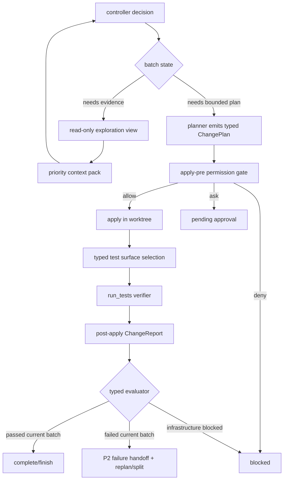

# Codrax Write Mode Eval Gap Commercial Hardening

Date: 2026-06-10
Branch: main

## Scope

This ledger records the post-eval write-mode hardening plan from three non-Go
issue-derived fixtures:

- pallets/click#1921-style relative symlink target resolution.
- psf/requests#6473-style percent-escape casing preservation.
- pytest-dev/pytest#13925-style empty path selection handling.

The rendered `<think>` stream is intentionally user-visible for transparency and
is not a gap.

## Audit Findings

### P0

- Verify state priority is not strict enough. The controller must distinguish
  planner dry-run probes from post-apply verification. Only the active batch's
  typed post-apply verdict may drive finish, replan, split, or block decisions.
- Test runner selection is too coarse. `runner=python` currently means pytest,
  but commercial projects often use unittest, Makefile targets, tox, or project
  manifest commands. Runner choice must become a typed test surface decision.
- Read-only exploration exposes shell affordances that invite write attempts and
  non-allowed commands. The refusals are correct, but the loop wastes turns and
  may pollute handoff with irrelevant "I cannot write" prose.
- Plan/report/workflow artifact persistence is incomplete in failure and
  success paths. `skipping ChangeReport disk save` weakens audit, resume, and
  support triage.

### P1

- LLM-authored unified diff hunk arithmetic is brittle. The validator catches
  failures, but repeated rejections consume turns. Write mode needs structured
  edit artifacts or a deterministic patch builder before falling back to raw
  unified diffs.
- Apply report wording is inconsistent when `git apply` rejects but `patch(1)`
  succeeds. Audit records should expose the actual engine and status.
- Workflow, batch, plan, and approval statuses can render contradictory states,
  such as `pending_approval` next to `auto_execute`, or `progress=batch_verified`
  next to `batch.status=complete`.

### P2

- Language-scoped exploration can be noisy, for example searching Rust patterns
  in a Python fixture.
- Successful paths still show report-dir warnings that do not break execution
  but reduce traceability.

## Design Principles

- Precise signals drive hard gates. The scheduler may read typed enums,
  booleans, ids, fingerprints, parser output, and store records.
- Noisy text guides only model behavior. User prose, model rationale, summaries,
  and natural-language failure narratives must not become hard routing logic.
- Preserve other modes. Read mode byte identity, trace/log/data lanes,
  operation/computer execution, worktree cleanup, and existing red lines remain
  isolated.
- Reuse existing mechanisms. Extend `ChangeReport`, `PlanStageProbeReports`,
  `WriteWorkflowRun`, `WriteContextPack`, `RunTests`, `PlanStore`, and current
  tool validators instead of adding another workflow stack.
- Keep user approval low-friction. Low and medium risk auto-execute, high risk
  asks, critical risk denies, with fingerprinted approval records.

## Target Architecture

## Hardening Plan

### Batch 0: Design Ledger

- Record this ledger.
- Commit and push to `main`.

### Batch 1: Verify Verdict Authority

- Add explicit report provenance/channel to `ChangeReport` or workflow attempts:
  `planner_probe`, `post_apply_verify`, `skipped_verify`.
- Ensure `run_tests(dry_run=true)` only appends to `PlanStageProbeReports` and
  never appears as current-batch verify failure in controller prompt/state.
- Add deterministic active-batch evaluator helpers:
  - current batch complete only when latest verify attempt has typed passed
    verdict for the current plan id.
  - replan only when latest post-apply verify attempt failed.
  - old probe failures become P2 planning context only.
- Add tests for stale dry-run failure followed by post-apply pass.

### Batch 2: Typed Test Surface Selection

- Introduce `TestSurfaceDecision` with fields such as `runner`,
  `framework`, `command_kind`, `working_dir`, `suite`, `source`, and
  `confidence`.
- Keep existing runner whitelist, but split Python framework selection from
  runner identity:
  - `python+pytest`
  - `python+unittest`
  - `make+test/check`
  - fallback syntax check where no tests exist.
- Resolve test surfaces from typed signals:
  manifests, Makefile targets, test filename conventions, acceptance tests,
  plan target paths, and context-pack test surface items.
- Extend `RunTests` command building and parsers to support unittest output
  without adding dependencies.
- Add tests for manifest-less unittest repos, Makefile test targets, pytest
  repos, and missing pytest with available unittest.

### Batch 3: Exploration Tool View And Handoff Hygiene

- Add a read-only exploration tool view that omits write-capable shell
  affordances and exposes typed read/probe operations instead.
- Keep underlying hard refusals for defense in depth.
- Normalize exploration handoff so tool-refusal noise is not promoted as P0/P1
  context unless it is itself a platform failure.
- Add prompt hygiene tests ensuring no keyword-based intent routing or model
  prose hard-routing is introduced.

### Batch 4: Durable Artifact Store

- Guarantee every workflow run has a durable plan directory before verify.
- Persist all batch attempts with artifact refs:
  plan JSON, approval record, apply report, verify report, raw output blob, and
  context pack id.
- Fix `skipping ChangeReport disk save` by deriving a stable report path from
  current plan id, active batch id, or workflow run id.
- Add resume/list/show tests for pending approval, verify failure, and verified
  success.

### Batch 5: Structured Edit Builder

- Add a bounded edit unit shape that can express line replacement, insertion,
  deletion, and whole-file create/delete/rename.
- Deterministically compile structured edits into unified diffs inside the tool
  validator using current file bytes.
- Keep raw `kind=patch` for complex edits, but prefer structured edits for
  micro and localized changes.
- Add validator tests for indentation, duplicate edits, overlapping ranges,
  stale context, and reviewable diff output.

### Batch 6: Apply Report Consistency And State Rendering

- Persist actual apply engine and outcome per change: `git_apply`,
  `patch_fallback`, `structured_builder`, `failed`.
- Render plan approval/action as separate fields so `pending_approval` does not
  conflict with `auto_execute`.
- Normalize progress ledger terminal states: progress events are events, batch
  status is state.
- Add snapshot tests for workflow prompt rendering and user-facing summaries.

### Batch 7: Regression Matrix

- Re-run the three GitHub-derived fixtures.
- Add focused Go tests for all typed state transitions and runner decisions.
- Run:
  - `go test ./internal/writeflow ./internal/types ./internal/tool ./internal/orchestrator`
  - `go test ./...`
  - `make test`
- Confirm read/log/trace/data/operation/computer paths are untouched except for
  shared type additions that remain backward-compatible.

## Acceptance Criteria

- A stale planner dry-run failure cannot cause replan after current post-apply
  verification passes.
- Python unittest and Makefile test projects verify without requiring pytest.
- Read-only exploration no longer spends turns attempting writes through a shell
  interface.
- Every write run leaves durable workflow, plan, approval, apply, verify, and
  context artifacts sufficient for audit and resume.
- Structured edit plans for micro changes avoid repeated invalid diff hunk
  generation.
- Prompt changes are soft guidance only and pass hygiene tests against
  keyword/prose hard routing.
- Other modes remain stable; no read-mode or operation-mode behavioral coupling
  is introduced.

## Progress Ledger

- 2026-06-10 Batch 0 started: design ledger recorded from eval findings.
- 2026-06-10 Batch 0 complete: design ledger committed and pushed to `main`.
- 2026-06-10 Batch 1 complete: `run_tests(dry_run=true)` now routes by typed
  pipeline stage, so controller apply-mode planning probes stay in
  `PlanStageProbeReports`; authoritative controller artifacts filter to the
  current plan's post-apply `ChangeReport`.
- 2026-06-10 Batch 2 complete: `run_tests` now carries typed Python framework
  selection (`pytest` vs `unittest`), detects standard-library unittest suites
  from repo test-surface signals, parses unittest output into `ChangeReport`,
  and keeps Makefile verification on the existing typed runner path.
- 2026-06-10 Batch 3 complete: write workflow exploration now has a typed
  read-only tool view. `exec_command`, apply, plan, test, and verifier tools are
  filtered from the StageExplore schema when a `WriteExplorationRequest` is
  active, and runtime validation rejects bypass attempts with typed repair
  metadata.
- 2026-06-10 Batch 4 complete: post-apply `ChangeReport` persistence now
  backfills missing `PlanID` from the current typed `ChangePlan` or active
  workflow batch, persists in-memory controller plans through the existing
  PlanStore when available, falls back to the run workdir for stripped-down
  embeddings, and records workflow `VerifyRef` with the same artifact-safe
  report id.
