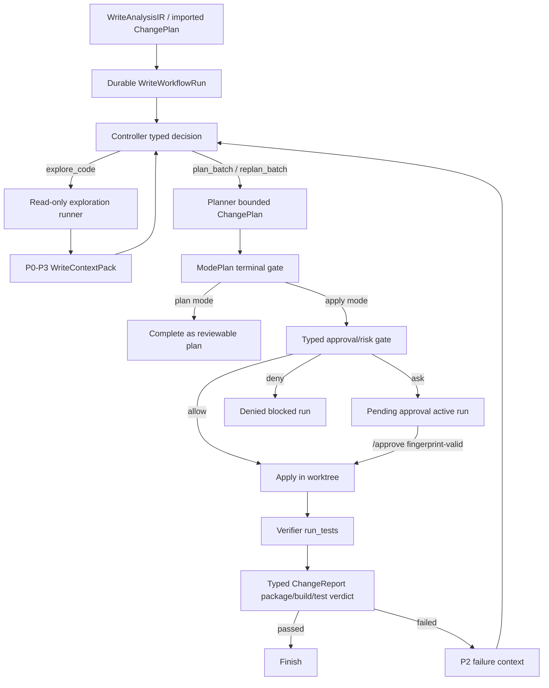

# Write Mode Eval Hardening Delivery

Date: 2026-06-10
Status: In progress
Branch: codex/write-mode-commercial-workflow

## 1. Objective

This delivery reopens write-mode commercial hardening after representative
evals exposed runtime gaps that the previous completion ledger did not catch.

The goal is not to patch the eval cases. The goal is to harden the write
workflow as a generic controller-first DAG:

- controller routing consumes typed decisions and typed artifacts only;
- hard gates never inspect user-keyword intent, model prose, rationale, or
  summary text;
- verification is a typed package/build/test verdict, not a narrative;
- pending approval and verify failure survive process/repl boundaries;
- handoff carries the highest-priority evidence to later consumers without
  stuffing raw tool output into prompts;
- read/log/trace/data/operation/computer lanes remain isolated.

## 2. Eval Evidence Ledger

The 2026-06-10 write eval suite used isolated temporary repositories plus one
public issue-style case.

1. Low-risk local Go bugfix succeeded end to end.
   - Task: fix `Average` fractional division and empty-slice behavior.
   - Result: plan/apply/verify completed, 2 tests passed.
   - Gap: read-only exploration attempted a mutation command; tool policy
     refused it, but the stage contract still allowed the model to try.

2. Local Go feature generated a high-risk plan and paused for approval.
   - Task: add `Cart.ApplyDiscount`.
   - Result: high-risk manual approval was required.
   - Gap: a blocked CLI run was not discoverable by `/workflow show/list`, and
     `/approve` could not resume it in the scripted REPL check.

3. Critical imported plan targeting `.git/config` was denied.
   - Result: deterministic apply-pre risk gate denied `critical_write_risk`.
   - Gap: an explicitly unsafe plan summary was blocked by controller prose
     before the typed gate, proving prose can still affect a hard outcome.

4. `go-chi/chi` issue #609 plan mode produced a plan, then tried to apply.
   - Source issue: route `/{:[a-z]+}/` unexpectedly matched `//`.
   - Result: plan JSON was written, then controller emitted `apply_plan` in
     `ModePlan`; scheduler blocked with `apply_plan is not valid in plan mode`.
   - Gap: `ModePlan` terminal semantics are not first-class.

5. Imported `go-chi/chi` plan applied but failed verify and failed to converge.
   - Result: patches were applied into a worktree commit ref; root package build
     failed on a Go string escape, while a sibling package produced 184 passing
     unit rows.
   - Gap: verifier narration described the passing sibling package as all tests
     passed; typed report had `passed=false` but lacked a structured build-error
     row, and controller replan did not get a precise P2 failure target.

## 3. System Gap Ledger

### P0. Typed Verify Verdict

`run_tests` can merge partial project results into `ChangeReport.Passed=false`
while `TestResults` contains only passing unit rows. That shape is valid enough
for a boolean gate but too weak for downstream reasoning: controller and planner
need a structured build/test failure row with path/line/message when available.

Required systemic fix:

- every failed package/project must contribute at least one failed
  `TestResult`;
- build/configure failures must use `TestResultKindBuildError`,
  `BuildFailed=true`, and `FailureKindBuildFailure`;
- aggregate summaries must prioritize failed project/package verdicts before
  passing assertion counts;
- verifier completion must be decided from `ChangeReport`, not model prose.

### P0. ModePlan Terminal Semantics

In plan mode, a successfully emitted `ChangePlan` is terminal for the current
single-shot run. The controller may explore and plan, but must not ask the model
to choose apply/verify after a plan is available.

Required systemic fix:

- after `plan_batch` succeeds in `ModePlan`, mark the run complete and return;
- persist the plan/workflow state as reviewable, not blocked;
- imported or generated plans must still carry risk/context packs for preview.

### P0. Durable Approval Resume

High-risk plans correctly pause, but the resulting run must remain visible and
resumable. A run that requires user approval is not a terminal blocked workflow;
it is a durable `pending_approval` workflow awaiting a human decision.

Required systemic fix:

- store `pending_approval` runs as active/resumable;
- `/workflow show/list/resume` must find pending approval runs;
- `/approve` must bind the active batch plan and continue the same run;
- stale plan fingerprints must still force re-approval.

### P0. Verify Failure Handoff

Verify failure evidence must flow to the next replan as typed P2 context.
Raw stderr can remain blobbed, but the priority pack must carry the actionable
surface: runner, package/suite, failure kind, file, line, column, message, and
blob ref when present.

Required systemic fix:

- project build/test failures project into `WriteContextPack` P2 items;
- controller/planner views surface P2 before generic prior summaries;
- replan receives failure-local targets instead of re-reading the full problem.

### P1. Single State Machine

Observed states such as `pending_approval` after auto-apply or a batch appearing
as both `ready_to_plan` and `verifying` make audit and resume fragile.

Required systemic fix:

- define one state transition table for run/batch/plan/report;
- store apply and verify attempt refs with reason codes;
- avoid using `blocked` for expected approval pauses.

### P1. Stage-Scoped Tools

Planner/replan should not use generic `exec_command` for build verification.
If planning needs a baseline, it should use typed `run_tests` dry-run or a typed
build probe. Exploration must not attempt write operations.

Required systemic fix:

- keep hard enforcement in tool permissions;
- adjust stage tool suggestions so the model sees the right lane;
- add hygiene tests that forbid unsupported workflow actions and prose routing.

### P1. User-Facing Artifact Consistency

The apply result can point at a retained worktree/report path that no longer
exists while the applied commit ref is still valid.

Required systemic fix:

- render only paths that exist;
- prefer stable refs for durable application artifacts;
- write reports to the configured plan store when advertised.

## 4. Target Architecture

## 5. Hard Red Lines

- No hard gate may consume user request keywords, model natural language,
  `summary`, `rationale`, or assistant prose.
- Controller actions come only from `emit_write_workflow_decision` validated
  enums or deterministic typed overrides.
- Risk/approval decisions read typed paths, plan units, parsed structured files,
  command classifications, and policy decisions only.
- Verification decisions read `ChangeReport` fields and `TestResult` rows only.
- Prompt edits are soft guidance and must have hygiene tests.
- Existing read mode byte identity and non-write mode entry points must not be
  touched for write-only hardening.

## 6. Delivery Tasks

### Batch 0: Reopened Hardening Ledger

- [x] Add this document.
- [x] Commit and push `docs: reopen write mode eval hardening ledger`.

### Batch 1: Typed Verify Verdict

- [x] Strengthen Go JSON parser so package-level build failures produce
      `build_error` rows even when sibling packages pass tests.
- [x] Strengthen aggregate summary to lead with failed projects/packages.
- [x] Add parser/unit tests for mixed package build-fail plus passing sibling.
- [x] Ensure controller consumes `ChangeReport.Passed/BuildFailed/TestResults`
      rather than verifier prose for completion.
- [x] Commit and push.

### Batch 2: ModePlan Terminal Gate

- [x] After successful plan in `ModePlan`, mark workflow complete and return.
- [x] Persist reviewable plan/run context without applying or blocking.
- [x] Add controller scheduler tests for `ModePlan` ignoring later apply actions.
- [x] Commit and push.

### Batch 3: Durable Pending Approval Resume

- [x] Treat manual approval as `pending_approval`, not terminal blocked.
- [x] Update active run lookup to include pending approval runs.
- [x] Ensure `/approve` can bind active workflow batch plan after CLI pause.
- [x] Add REPL/run-store tests for pending approval show/list/resume/approve.
- [x] Commit and push.

### Batch 4: Verify Failure Handoff

- [x] Project build errors and failed tests into P2 context pack items.
- [x] Attach verify report refs to the active batch.
- [x] Render planner/controller P2 failure context before generic summaries.
- [x] Add context-pack tests for build file/line/message retention.
- [x] Commit and push.

### Batch 5: State Machine And Attempts

- [x] Normalize batch statuses after plan/apply/verify transitions.
- [x] Attach plan/apply/verify attempt refs and reason codes.
- [x] Add tests for no contradictory `pending_approval` after auto apply.
- [x] Commit and push.

### Batch 6: Stage Tool Contracts And UX

- [ ] Update `/workflow` slash table to expose show/list/resume/clear/cancel.
- [ ] Harden prompt/tool tests so planner uses typed dry-run probes, not generic
      build shell commands.
- [ ] Render only live worktree/report paths; otherwise render stable refs.
- [ ] Commit and push.

### Batch 7: Commercial Regression Matrix

- [ ] `go test ./internal/tool ./internal/types ./internal/writeflow
      ./internal/orchestrator ./internal/repl`.
- [ ] `go test ./...`.
- [ ] Re-run representative write evals for low-risk apply, high-risk approval,
      critical deny, plan mode terminal, imported complex plan verify failure,
      and pending approval resume.
- [ ] Update this ledger with exact commands and outcomes.
- [ ] Commit and push final hardening status.

## 7. Acceptance Criteria

- Low/medium writes run without unnecessary approval.
- High-risk writes pause in an active, discoverable, approvable workflow.
- Critical writes are denied before worktree mutation.
- `ModePlan` never enters apply/verify after a plan is emitted.
- Every failed verify has typed failed rows and actionable P2 context.
- Replan consumes failure-local evidence and does not depend on prose.
- Worktree/report rendering matches durable artifacts on disk.
- Prompt hygiene tests guard against keyword/prose hard routing.
- Non-write modes and read-mode red lines remain green.

## 8. Progress Ledger

| Batch | Status | Commit | Push | Notes |
| --- | --- | --- | --- | --- |
| 0 | complete | `874200f0` | pushed | Hardening reopened from eval evidence. |
| 1 | complete | current batch | pushed | Go parser now preserves package build failures next to passing sibling package tests. Tests: `go test ./internal/tool -run 'TestParseGoTestJSONLines|TestParseGoTest_CompileErrorMapsToBuildFailed|TestRenderBuildFailureSummary|TestFirstBuildErrorAssertionID|TestMergeChangeReports'`, `go test ./internal/tool`. |
| 2 | complete | current batch | pushed | ModePlan now terminates after a reviewable ChangePlan and never reaches apply/verify. Tests: `go test ./internal/orchestrator -run 'TestRunWriteControllerWorkflow_ModePlanStopsAfterPlan|TestRunWriteControllerWorkflow_ExplorePlanFinish|TestRunWriteControllerWorkflow_PendingApprovalKeepsRunActive'`. |
| 3 | complete | current batch | pushed | Typed manual approval pauses as active `pending_approval`; `/workflow` exposes show/list/resume/clear/cancel and pending approval stays discoverable for `/approve`. Tests: `go test ./internal/orchestrator -run 'TestRunWriteControllerWorkflow_PendingApprovalKeepsRunActive|TestRunWriteControllerWorkflow_ModePlanStopsAfterPlan|TestRunWriteControllerWorkflow_ExplorePlanFinish'`, `go test ./internal/repl -run 'TestWriteWorkflowRunStore|TestWorkflowShowDisplaysActiveWriteWorkflow|TestApproveUsesActiveWorkflowBatchPlan|TestWorkflowResumeSelectsSavedWriteWorkflow|TestWorkflowClearDeletesActiveWriteWorkflow|TestSlashSuggest_WorkflowWriteRunSubcommands|TestHelpLines_CoversEveryCommand|TestSlashCommand_HelpBothVariantsNonEmpty'`. |
| 4 | complete | current batch | pushed | Verify report refs now attach to workflow batches; failed build/test evidence and blob refs persist as P2 context for replan. Tests: `go test ./internal/orchestrator -run 'TestRunWriteControllerWorkflow_VerifyFailureCanReplanSameBatch|TestRunWriteControllerWorkflow_VerifyFailureCanReexploreThenReplan|TestRunWriteControllerWorkflow_ExplorePlanFinish'`, `go test ./internal/types -run 'TestWriteContextPackFromChangeReportCarriesVerifyFailure|TestWriteContextPackViewBoundsAndDefensiveCopy'`. |
| 5 | complete | current batch | pushed | Batch attempts now carry plan/apply/verify artifact refs; ordinary apply errors no longer masquerade as pending approval; verified runs synchronize mutable plan status to `applied`. Tests: `go test ./internal/orchestrator -run 'TestRunWriteControllerWorkflow_ExplorePlanFinish|TestRunWriteControllerWorkflow_VerifyFailureCanReplanSameBatch|TestRunWriteControllerWorkflow_ApplyErrorDoesNotBecomePendingApprovalWithoutRecord|TestRunWriteControllerWorkflow_PendingApprovalKeepsRunActive'`, `go test ./internal/types -run 'TestNormalizeWriteWorkflowRunPersistsContextPacks|TestWriteWorkflowRunToFileRoundTrip'`. |
