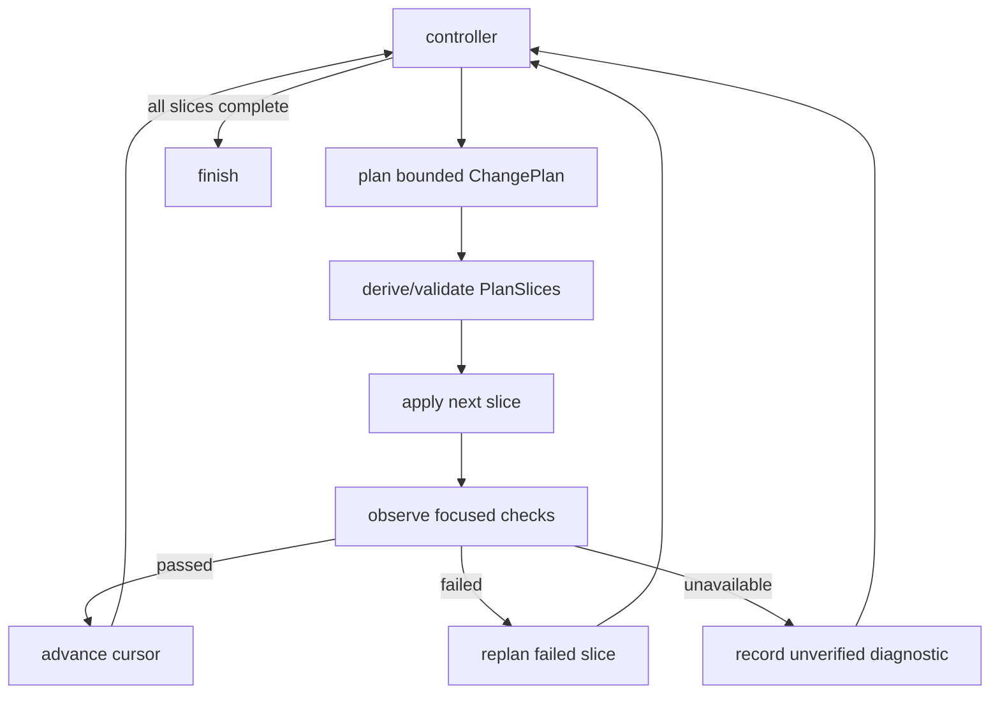

# Codrax Write Mode Online Convergence Delivery Plan

Date: 2026-06-16
Branch: main
Status: active delivery ledger

## Summary

Codrax write mode is already controller-first, durable, approval-gated, and
worktree-isolated. The remaining architectural gap is execution granularity:
the controller still treats a `ChangePlan` as one large apply/verify unit.

For small edits this is fine. For a 100-file migration it is batch processing:

```text
plan all -> apply all -> verify all -> replan from a large failure surface
```

The commercial target is online convergence:

```text
observe -> edit a bounded slice -> run focused checks -> observe -> continue
```

This follows the same operating principle documented in Claude Code best
practices and in the 2026 architecture paper *Dive into Claude Code: The Design
Space of Today's and Future AI Agent Systems*: keep the model in the reasoning
seat, keep execution and enforcement in the harness, give the agent runnable
checks, preserve state durably, and iterate in small observe-driven steps.

Reference material:

- Claude Code best practices:
  <https://code.claude.com/docs/en/best-practices>
- *Dive into Claude Code: The Design Space of Today's and Future AI Agent
  Systems*:
  <https://arxiv.org/abs/2604.14228>
- Public companion repository:
  <https://github.com/VILA-Lab/Dive-into-Claude-Code>
- Key ideas used here:
  - runnable verification closes the loop;
  - explore/plan is useful when the approach is uncertain, but direct
    implementation is better for tiny scoped fixes;
  - early course-correction reduces accumulated wrong context;
  - worktrees and parallel sessions keep large work isolated;
  - auto mode should reduce routine approvals while deterministic gates still
    block unsafe actions;
  - most production value lives in deterministic infrastructure around the
    agent loop: permissions, context management, tool routing, recovery, and
    persistence.

## Research-driven Design Mapping

The paper frames production coding agents as answers to recurring design
questions: where reasoning lives, how many execution engines exist, what safety
posture is default, which resource constrains the loop, how extensibility plugs
in, how delegation is isolated, and how sessions persist. Codrax should answer
those questions explicitly.

| Research principle | Claude Code design point | Codrax online-convergence design |
| --- | --- | --- |
| Model reasons; harness enforces | Model emits tool requests; harness validates, checks permissions, dispatches tools, and records results. | Controller/model may choose high-level actions, but PlanSlice derivation, risk gates, apply permission, observe verdicts, and terminal completion are typed harness logic. |
| Single loop across surfaces | CLI, headless, SDK, IDE feed one agent loop. | REPL and CLI write mode should converge on the same online slice loop; UI/status differs, workflow state does not. |
| Deny-first safety with graduated trust | Deny overrides ask/allow; auto mode reduces approvals while maintaining gates. | Keep low/medium slice auto-execution, high slice ask, critical deny; approval records bind to slice fingerprints. |
| Context as scarce resource | Multiple compaction layers and summary-only subagent returns manage context. | Use durable context packs plus consumer Top-N slice views; carry full refs, render only relevant P0/P1/P2 items. |
| Append-only durable state | Session/tool events are persisted for resume/rewind/audit. | Persist slice attempts, observe reports, diagnostics, and progress ledger; never infer progress from final prose. |
| Minimal scaffolding, maximal harness | Core loop is simple; surrounding infrastructure is where reliability lives. | Do not create a heavy multi-agent planner. Add a small typed slice state machine around existing planner/coder/verifier tools. |
| Isolated delegation | Subagents run in separate contexts and return summaries. | Continue using read-only exploration runner for heavy localization; return typed handoff/context pack rather than raw transcript. |
| Graceful recovery | Recovery paths include compaction, fallback execution, checkpoints, and resume. | On slice failure, replan the failed slice with P2 diagnostics; preserve passed slices and avoid whole-plan restart. |

### Codrax design stance

Codrax is closer to a repository-bound coding harness than a gateway-style
assistant. Therefore, the right trade-off is not a large agent hierarchy. It is
a thin model-facing controller wrapped by strong deterministic infrastructure:

- typed workflow state,
- permission/risk policy,
- worktree isolation,
- append-only attempts,
- context-pack handoff,
- small apply/observe slices,
- bounded retry and recovery.

This also preserves the project red line: hard logic must consume precise
signals. The online loop must not route from natural-language summaries such as
"looks done", "probably safe", or "the model said tests passed".

## Online Convergence Design Principles

1. **Edit/Run/Observe is a state machine, not a prompt style.**
   The controller must know the active slice, what changed, what ran, and what
   the typed verdict was.

2. **Observations are first-class artifacts.**
   A slice is not "done" because the coder stopped calling `apply_patch`; it is
   done when a typed observe report says verified or when typed diagnostics say
   local verification is unavailable.

3. **Small steps are derived from dependency structure.**
   The planner may propose slices, but the harness can derive safe slices from
   `ChangePlan.Changes`, `DependsOn`, risk assessment, and touched paths.

4. **Passed slices are protected.**
   Replanning a failed later slice must not reopen previously verified slices
   unless typed dependency impact says they are stale.

5. **User approval is scoped to reversible risk.**
   Manual approval should apply to the smallest risky slice fingerprint, not
   the whole future migration, reducing approval fatigue.

6. **Context handoff is priority-based.**
   The model sees the next slice's P0/P1/P2 view, not the entire historical
   transcript. Full evidence remains durable and inspectable.

7. **The loop remains one engine.**
   Online convergence must not fork a special CLI-only or REPL-only path.
   Surface differences belong in rendering and guidance, not scheduler state.

This document is a design and delivery ledger. It does not authorize prompt
prose, user keywords, model rationale, or summary text to drive hard routing.
Hard routing must read typed artifacts only.

## Current Architecture Audit

### What already works

- `runWriteControllerWorkflow` is the canonical outer DAG.
- Controller decisions are schema-validated actions such as `explore_code`,
  `plan_batch`, `apply_plan`, `verify_batch`, `replan_batch`, `finish`, and
  `block`.
- `ChangePlan` is durable and carries ordered `Changes[]`.
- `apply_patch` applies one `FileChange` at a time and enforces W1/W1b:
  target-path authorization and dependency ordering.
- `WriteClosure` already tracks `AppliedSet` and `PendingApplies`.
- Verification produces typed `ChangeReport`, `ExecutedCommand`,
  `TestSurface`, and `verification_diagnostics[]`.
- Risk/approval runs at apply-pre and low/medium risk can proceed without
  user approval; high risk pauses; critical risk denies.
- Work happens inside an isolated git worktree; main repo HEAD is not mutated
  automatically.

### Systemic gaps

#### G1: ChangePlan is too coarse as an execution unit

The planner can emit many `FileChange` entries, but the controller only knows:

```text
batch planned -> apply whole plan -> verify whole plan
```

`apply_patch` is granular, yet the scheduler does not observe between groups of
changes. A failure after 100 files leaves a broad failure surface and weaker
replan evidence.

#### G2: Verify is post-hoc instead of interleaved

`run_tests` can already execute focused checks and behavior probes, but the
controller schedules it after all target paths are applied. The system needs a
typed rule for "run after this slice" that is smaller than "run after the
whole batch".

#### G3: The planner has no typed slice contract

The planner can be encouraged to make smaller batches, but prompt-only guidance
is not enough. The plan artifact should include or derive:

- slice IDs,
- change indexes/paths,
- dependency closure,
- expected verification surface,
- observe policy,
- terminal/continuation status.

#### G4: Online state is not durable

Workflow attempts record plan/apply/verify attempts, but not the sub-plan
sequence:

```text
slice-1 edited and passed
slice-2 failed parser startup
slice-2 replan replaced one file
slice-3 not started
```

Without durable slice state, resume, REPL status, and handoff cannot explain
where a long write task is in the online loop.

#### G5: Failure containment is late

When a late verify fails, replan sees the entire changed worktree. The desired
shape is:

- commit or snapshot after each passing slice,
- isolate failure evidence to the latest slice when possible,
- replan only the failed slice or append a follow-up slice,
- avoid revisiting passing slices unless typed dependency impact requires it.

#### G6: User interaction can still be too command-heavy

Advanced `/workflow` and `/plan` commands are useful for recovery, but routine
write mode should feel like Auto Pilot:

- continue automatically while risk is low/medium and checks are passing,
- show progress cards,
- pause only for high-risk approval, critical denial, repeated ambiguous user
  facts, or exhausted budgets,
- resume pending safe work without asking the user to remember commands.

## Target Architecture

### Harness injection points

The online loop has three deterministic injection points, matching the
agent-loop design-space analysis:

```text
assemble -> model decision -> execute
```

- **Assemble**: render the active slice, P0/P1/P2 context-pack view, last
  observe diagnostics, and remaining budget. This is soft context.
- **Model decision**: controller may request plan/replan/apply/observe/finish
  through typed actions only.
- **Execute**: harness normalizes the action against durable slice state, risk
  policy, approval record, path policy, worktree state, and verification
  requirements before any file or command action runs.

The model never directly advances a slice by prose. Slice state changes only
through typed scheduler transitions.

### Core model

Add a durable online convergence layer inside each write batch:

```text
WriteWorkflowRun
  Batches[]
    PlanID
    Slices[]
      SliceID
      Status
      ChangeIndexes / Paths
      DependsOnSlices
      ApplyAttemptRef
      ObserveAttemptRef
      VerifyReportRef
      Completion
```

Controller loop:



### Online loop events

Persist append-only events for every slice transition:

- `slice_planned`
- `slice_apply_started`
- `slice_apply_completed`
- `slice_observe_started`
- `slice_observe_completed`
- `slice_verified`
- `slice_unverified`
- `slice_failed`
- `slice_replan_requested`
- `slice_blocked`

These events are audit and resume state. REPL/CLI status should render them,
but no hard logic should parse rendered status text.

### Slice derivation

`PlanSlices` may be planner-authored, but the system must be able to derive
them deterministically when absent:

- maintain `FileChange` declaration order;
- preserve `DependsOn` closure;
- cap slice size by files and impact;
- keep high-impact/risk paths single-slice by policy;
- keep generated docs/tests near the production path they verify when
  dependency closure makes that explicit;
- never split a change unit itself.

This is structural. No user intent keywords or model prose decide hard routing.

### Apply and observe semantics

Applying a slice means the coder is only allowed to apply paths in the active
slice plus already-satisfied dependency paths. The existing `apply_patch` tool
continues to hydrate content from `ChangePlan`; it should not become a
free-form edit channel.

Observing a slice means:

- prefer slice-scoped verification probes whose `contract_refs` or
  `changed_symbol_refs` intersect slice paths/symbols;
- otherwise choose typed `TestSurface` candidates related to the touched
  working directory;
- fall back to syntax checks only when no real test work exists;
- record unavailable environment/tooling as diagnostics, not hard code failure.

### Commit/snapshot policy

After a slice passes local observation:

- record a slice apply ref;
- keep current worktree bytes;
- optionally create a lightweight internal snapshot/ref for rollback/resume;
- only mark the whole batch verified when every slice terminal status is
  verified or explicitly accepted-unverified.

### Controller action model

Keep the public controller action surface small. Add internal typed state and,
if needed, one tool action:

- `apply_next_slice`
- `observe_slice`

Alternatively, keep public action `apply_plan` and let
`normalizeControllerTypedStateDecision` rewrite it into the next internal slice
operation when online mode is active. This reduces model burden and keeps UX
smooth.

### Safety and approval

Approval must evaluate the active slice fingerprint:

- low/medium slice risk: auto-execute;
- high slice risk: pause once for that slice;
- critical: deny;
- if the slice fingerprint changes after approval, approval is stale.

Whole-plan risk still remains visible, but approvals should be no broader than
necessary. This reduces user approval fatigue while keeping risky mutations
explicit.

### Context pressure control

Online convergence increases the number of loop turns. To avoid context
ballooning:

- keep full raw tool output in artifacts/blob refs;
- render only the active slice's Top-N context-pack view;
- summarize completed verified slices as compact typed ledger rows;
- preserve failed/unverified slice diagnostics as P2 must-carry rows;
- never copy complete prior transcripts into planner/verifier prompts.

This mirrors the research finding that context management is a primary
production constraint, but adapts it to Codrax's existing context-pack store
instead of adding a separate memory subsystem.

### Handoff and context retention

Each slice emits context pack rows:

- P0: user constraints, risk/approval, behavior contract atoms.
- P1: slice paths, symbols, dependency closure, invariants.
- P2: observe result, failed tests, build errors, verification diagnostics.
- P3: style hints.

Controller/planner/verifier consume bounded Top-N views. Full evidence stays
durable in the workflow run and artifact refs.

## Prompt Red Lines

- Prompts may explain online convergence as soft workflow guidance.
- Hard gates must not parse model narrative, rationale, summaries, or user
  intent keywords.
- Routing must read typed fields: slice status, plan fingerprint, approval
  record, `ChangeReport`, `ExecutedCommand`, `TestSurface`,
  `VerificationDiagnostic`, path policy, parser/AST-derived checks.
- Any new prompt/hint must have hygiene tests preventing unsupported actions or
  prose-driven hard routes.

## Delivery Tasks

### Batch 0: Design Ledger

- Add this document.
- Record audit, target architecture, red lines, and executable task list.
- Commit and push to `main`.

Acceptance:

- Document exists under `docs/design/`.
- Worktree clean after push.

### Batch 1: Typed PlanSlice Schema

- Add `ChangePlanSlice` or `WritePlanSlice` typed schema.
- Add slice status enum:
  `pending / applying / observing / verified / unverified / failed / blocked`.
- Add append-only slice event schema for audit/resume/progress rendering.
- Add deterministic normalization:
  - stable IDs,
  - ordered change indexes,
  - deduped paths,
  - dependency closure validation,
  - bounded default max files per slice.
- Add tests for:
  - derive one slice for tiny plans,
  - derive multiple slices for large plans,
  - dependencies keep prerequisites before dependents,
  - event ledger normalizes and dedupes empty rows,
  - high-impact path can be isolated by policy hook.

### Batch 2: Active Slice Apply Boundary

- Add active-slice state to `WriteWorkflowBatch`.
- Add harness normalization that maps `apply_plan` to "apply current slice"
  when online mode is active.
- Seed `WriteClosure.PendingApplies` from the active slice instead of the whole
  plan when online mode is active.
- Update coder context to show only remaining active-slice changes.
- Keep `apply_patch` W1/W1b unchanged and add slice W1s:
  path must belong to active slice unless already applied as dependency.
- Add tests proving a plan with 20 changes applies only slice 1 before observe.

### Batch 3: Observe Slice Executor

- Add `observe_slice` scheduler step using existing `run_tests`.
- Select probes/test surface from typed slice paths, contract refs, and
  changed symbols.
- Store observe report refs on the slice.
- Project observe diagnostics to P2 context pack.
- Treat environment unavailable as slice-unverified, not product-code failure.

### Batch 4: Controller Loop Integration

- Teach `runWriteControllerWorkflow` to advance:
  `apply_next_slice -> observe_slice -> next slice`.
- Preserve existing `ActionApplyPlan` / `ActionVerifyBatch` model surface by
  normalizing model decisions against typed active-slice state.
- On slice failure:
  - set batch back to ready_to_plan,
  - handoff failed slice evidence,
  - replan only failed slice or append a follow-up slice.
- On all slices terminal:
  - run optional final aggregate verify if test surface demands it,
  - finish verified/unverified according to typed slice completions.

### Batch 5: Durable Resume And REPL UX

- Persist slice status in `WriteWorkflowRun`.
- `/workflow show` should display:
  active slice, completed slice count, last observe verdict, pending approval,
  and next automatic action.
- Auto-resume safe active slice work in CLI/REPL; routine users should not need
  `/workflow resume`.
- Keep advanced commands for audit/recovery only.
- Render completed slices compactly and failed/unverified slices with evidence
  refs to avoid context/status noise.

### Batch 6: Approval Per Slice

- Fingerprint active slice plus relevant plan metadata.
- Approval record stores `slice_id`.
- Manual approval is reused only for the same slice fingerprint.
- Critical slice denies without blocking unrelated already-verified slices from
  being auditable.

### Batch 7: Behavior Contract Coupling

- Connect behavior contract atoms to slices.
- Require high-confidence observations to cover the slice's contract refs or
  changed symbols.
- Downgrade final confidence when a slice only has syntax/no-test/unavailable
  observation.

### Batch 8: Eval And Hardening

- Add synthetic eval:
  30-file migration succeeds in 3 slices with checks after each slice.
- Add failure eval:
  slice 2 fails, replan affects only slice 2, slice 1 remains accepted.
- Run SWE-bench Lite non-Go slice:
  verify predictions JSONL, official harness consumability, manual patch audit,
  and context-pack evidence retention.
- Full regression:
  `go test ./...`, `make`, read mode L1 red-line tests, operation/log/trace/data
  smoke coverage.

## Progress Ledger

| Date | Batch | Status | Evidence |
| --- | --- | --- | --- |
| 2026-06-16 | 0 | ready for push | Design ledger created from code audit, Claude Code best-practice review, the Claude Code design-space paper, and the public companion architecture notes. |
| 2026-06-16 | 1 | implemented | Added typed `ChangePlanSlice` derivation/validation and durable workflow slice/event schema with focused `internal/types`, `internal/tool`, `internal/agent`, `internal/orchestrator`, and `internal/repl` regression passing. |
| 2026-06-16 | 2 | implemented | Added active-slice apply target helpers, slice-scoped coder completion/iteration behavior, slice W1 enforcement in `apply_patch`, and slice-scoped pending apply replacement while leaving non-slice workflows on the existing full-plan path. |
| 2026-06-16 | 3 | implemented | Added active-slice observe report recording on top of existing `run_tests`/verify reports: slice attempts, observe refs, terminal slice events, skipped/unverified handling, and an internal observe wrapper for the next controller-loop batch. |
| 2026-06-16 | 4 | implemented | Integrated active slices into the controller loop: plan/imported-plan seeds now initialize durable slices, apply records the active slice, typed observe advances to the next slice or completes the batch, failed slices return to replan under the existing verify retry budget, planner probe-pass restores the slice to observing, and `go test ./...` passed. |
| 2026-06-16 | 5 | implemented | Added typed active-slice progress to the workflow next-action view and REPL/list/banner renderers so routine users see automatic progress without extra commands: active slice id/status, completed/total slices, and no-action-needed status cards; focused `internal/types` and `internal/repl` tests passed. |
| 2026-06-16 | 8 | in progress | SWE-bench Lite smoke re-run on `astropy__astropy-12907`: non-empty prediction exported, official harness dry-run consumed the predictions JSONL, setup.cfg runtime/test dependency discovery now runs, legacy build-ext fallback is attempted, and remaining local unverifiability is attributed to macOS/Python 3.11 C-extension compilation rather than missing pytest/runtime deps. |
| 2026-06-16 | Research mapping | recorded | Added `docs/design/write_mode_claude_code_control_plane_20260616.md`, mapping the public Claude Code design-space paper and companion architecture research to Codrax's online control plane: one execution loop, thick typed harness, context-pack memory bus, per-slice permission, observation confidence, append-only resume/audit, and command-light UX. |
| 2026-06-16 | C1 confidence spine | implemented locally | Added typed `verification_confidence[]` records to `ChangeReport` and projected them into context packs, verify-failure handoff, planner replan prompts, and SWE-bench telemetry. This separates local confidence from pass/fail/unavailable routing and keeps weak-probe evidence available without making missing pytest/deps a hard delivery blocker. |
| 2026-06-16 | Smoke 19 control-plane gaps | implemented locally | SWE-bench smoke on Flask/Pytest/Sphinx exported 3 non-empty predictions and harness dry-run accepted the predictions file. The run exposed two generic friction points now fixed locally: change-local `verification_probes[]` are merged into the canonical plan-level lane, and verify-failure diff/surface artifacts render bounded previews in planner handoff so replan evidence is not lost when read tools are narrowed. |
| 2026-06-16 | Pytest targeted online rerun | validated | `pytest-dev__pytest-9359` rerun exercised symptom-first localization, controller-triggered exploration, plan/apply/verify, prediction export, and official harness consumability. It validated the duplicate-definition validator hardening and selected JSON string-carrier repair; remaining local confidence is intentionally `unverified` due to `pytest_import_startup_error`, not a hard delivery block. |
| 2026-06-16 | Semantic-contract residual | open | The targeted rerun still produced a shallow `_get_assertion_exprs` text normalization (`line.lstrip()`) rather than the stronger decorator-boundary invariant found in prior gold audit. Batch 7/C10 follow-up should encode negative-output and untouched-expression invariants as typed behavior contracts/probes so online Observe can distinguish directionally plausible text changes from semantic fixes. |
