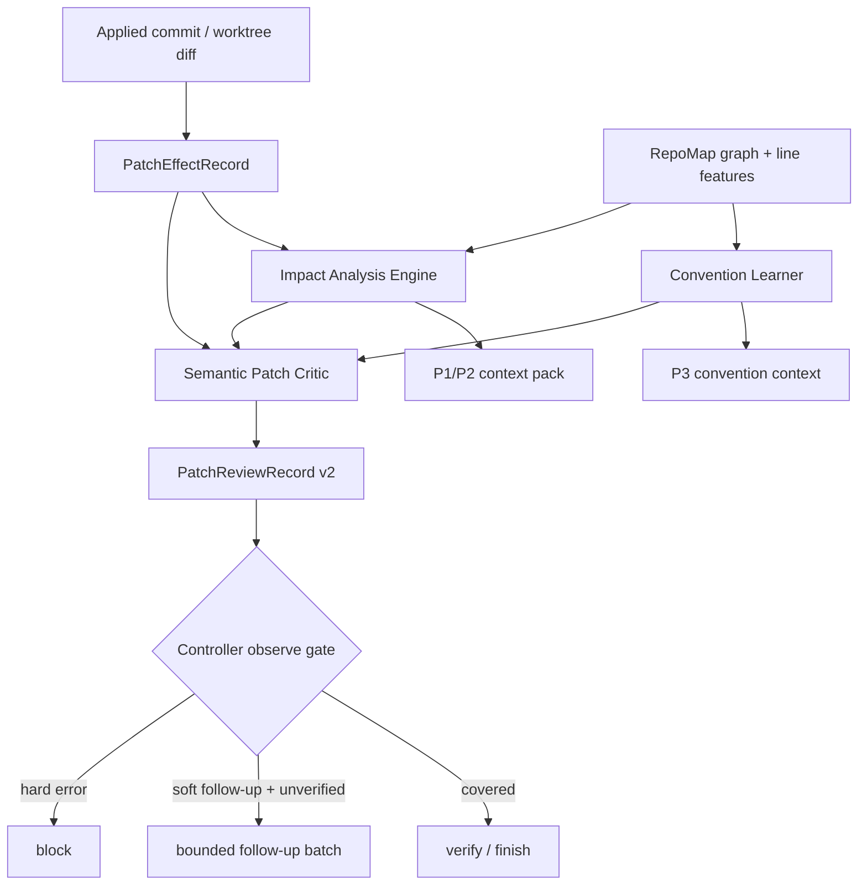

# Codrax Write Mode Patch Critic / Impact Analysis / Convention Graph Delivery

## Summary

This document audits three remaining write-mode gaps against the current code and
turns them into a commercial delivery plan:

1. Patch Critic still behaves mostly like scope and structural review. It now
   consumes the real applied diff through `PatchEffectRecord`, but it does not
   yet produce a unified semantic patch verdict over the actual patch.
2. Impact Analysis exists as `ImpactObligationSet` and context handoff, but it
   is not yet an independent analysis result that can answer "changed A, check
   B/C" for controller scheduling, verifier scope, and patch review.
3. Convention Graph exists as a typed persisted artifact, but the current source
   is mainly exploration handoff. It is not yet a repository convention learner.

All three are worth landing. The correct architecture is not three unrelated
features. They should become one deterministic post-apply observe lane:

Hard logic consumes only typed artifacts: diff records, path roles, repo graph
relations, structured parser results, verification verdicts, and typed enums.
No user intent keywords, model prose, prompt rationale, or `<think>` text may
drive routing or gates.

## Current Code Audit

### Patch Critic

Current code already has the right factual base:

- `internal/writeflow/patch_effect.go` builds `PatchEffectRecord` from the real
  applied commit diff and records files, hunks, added/removed lines,
  fingerprint, file roles, and structured-file parse events.
- `internal/orchestrator/write_controller_scheduler.go` captures the applied
  commit diff after apply through `attachActivePatchEffectRecord`.
- `internal/writeflow/patch_review.go` reviews the actual patch effect against
  plan and active-slice scope.
- `PatchReviewRecord` is persisted on `ChangePlan` and projected into
  `WriteContextPack`.

Gap:

- The critic result is still mostly scope/path and a few patch-effect events.
- It does not compare actual changed symbols, downstream obligations, verify
  coverage, and repository conventions in one semantic verdict.
- Existing semantic follow-up is a narrow typed combination of
  `control_flow_guard_touched` plus `call_site_touched`; this is safe because it
  uses typed codes, but it is not a general patch critic.

Decision:

- Upgrade the existing critic instead of adding another reviewer agent.
- Keep LLM reviewers out of the hard gate. A future LLM patch reviewer may be
  advisory only and must consume the same typed bundle.

### Impact Analysis

Current code already has strong ingredients:

- `internal/writeflow/impact/engine.go` derives obligations from
  `ChangePlan`, `PatchEffectRecord`, and a repo graph provider.
- `ImpactObligationSet` covers changed files, dependencies, reverse imports,
  related tests, changed symbols, behavior contracts, and probe refs.
- `stampChangePlanImpactObligations` persists obligations on the plan.
- `WriteContextPackFromChangePlan` projects obligations to controller, planner,
  and verifier context.

Gap:

- There is no first-class `ImpactAnalysisResult` with durable nodes, edges,
  affected surfaces, ranked verification targets, coverage status, and reason
  codes.
- Controller cannot explicitly schedule "verify changed file, then dependents,
  then related tests" from a single result.
- Verifier cannot report coverage against a typed impact graph; it only sees
  obligations as handoff context.

Decision:

- Promote obligations into a deterministic impact engine output.
- Keep `ImpactObligationSet` as a compatibility-shaped projection, but make the
  richer result the source of scheduling and critic inputs.

### Convention Graph

Current code already has a formal artifact:

- `types.ConventionGraph` / `ConventionNode` model typed, evidence-backed local
  conventions.
- `internal/writeflow/convention/store.go` persists and merges convention
  graphs per workflow run.
- `write_exploration_subflow.go` derives convention nodes from exploration
  handoff and persists Top-N nodes.
- Planner and verifier receive convention context as P3 soft guidance.

Gap:

- There is no repository convention learner. Existing nodes are largely
  exploration summaries and evidence refs, not a systematic view of neighboring
  tests, imported dependents, local error-handling shape, file layout, or
  repeated code patterns.
- Convention nodes are not connected to patch critic or impact analysis.

Decision:

- Add a deterministic repository learner that consumes repo graph and patch
  effect/active paths.
- ConventionGraph remains soft guidance only. It may influence plan hints,
  critic advisory findings, and follow-up goals, but never direct approval,
  deny, or routing gates by itself.

## Target Architecture

### Shared Typed Bundle

Create a shared post-apply bundle owned by the controller observe lane:

- `PatchEffectRecord`: what changed, from actual diff.
- `ImpactAnalysisResult`: what may be affected and what needs verification.
- `ConventionGraph`: local repository patterns relevant to changed files.
- `PatchReviewRecord`: semantic verdict over the above.
- `WriteContextPack`: priority projection for controller/planner/verifier.

The bundle is deterministic, durable, and resumable. It is recomputed from
typed inputs when possible and persisted on the plan/workflow run for audit.

### Patch Critic v2

Patch Critic v2 should:

- review actual diff, not plan prose;
- compare actual patch scope with active slice scope;
- consume structured parse events as hard errors;
- consume changed symbols and downstream impact as semantic warnings;
- consume convention graph as advisory context only;
- emit typed findings with stable reason codes;
- drive bounded follow-up batches only when verification is unavailable or did
  not cover the affected surface.

Hard-block finding examples:

- `patch_effect_path_outside_worktree`
- `structured_file_parse_error`
- `python_top_level_self_method`
- `actual_diff_outside_active_slice`

Soft follow-up finding examples:

- `changed_symbol_without_probe_coverage`
- `dependent_surface_without_verify_coverage`
- `related_test_surface_unverified`
- `convention_surface_available`

### Impact Analysis Engine

Add `ImpactAnalysisResult`:

- `ResultID / PlanID / PatchEffectID / Source / CreatedAt`
- `ChangedSurfaces`: files, symbols, hunks, path roles
- `Edges`: imports, reverse imports, related tests, contract/probe refs
- `VerificationTargets`: ordered target list with strength and source
- `Coverage`: verified / unverified / unavailable / skipped by target
- `ObligationSet`: normalized projection for existing context consumers

The engine may use:

- `PatchEffectRecord` for actual diff surfaces;
- `ChangePlan` for declared contracts and probes;
- repo graph provider for imports/reverse imports/symbol ranges/related tests;
- verifier result for coverage updates.

It must not use:

- model rationale;
- user keywords;
- free-form summaries;
- stdout prose except through typed test/build parsers.

### Convention Learner

Add a repository convention learner under `internal/writeflow/convention`:

- Input: active paths, active symbols, optional `PatchEffectRecord`, repo graph.
- Output: `ConventionGraph`.
- Signals:
  - colocated/related tests from graph and file layout;
  - nearby files with same stem/module directory;
  - reverse-import dependent patterns;
  - line-feature hints around touched hunks;
  - existing handoff evidence refs.
- All convention nodes carry `SourceStage`, `Strength`, source path, optional
  symbol, and evidence ref where possible.

Conventions are P3 soft guidance. They can explain why a follow-up should look
at a nearby test or dependent, but they cannot force approval or denial.

## Prompt And Policy Red Lines

- Prompts may describe the typed bundle and ask the model to use it as context.
- Prompts must not ask the model to decide hard gates from prose.
- Controller hard decisions read typed enums and structs only.
- No keyword matching of user intent or model output.
- No parsing `<think>` or final explanation text for routing.
- No case-specific patching for SWE-bench or single issue patterns.
- New tests must include prompt hygiene checks when prompt text changes.

## Delivery Batches

### Batch 0: Design Ledger

- Add this document.
- Record current code audit, architecture, tasks, and tests.
- Commit: `docs: plan patch impact convention delivery`
- Push to `main`.

### Batch 1: Patch Critic v2 Typed Finding Model

- Extend `PatchReviewFinding` with optional typed fields:
  - `category`, `relation`, `subject_symbol`, `related_path`, `strength`,
    `coverage_status`.
- Keep normalization deterministic.
- Add a semantic review input struct that accepts `PatchEffectRecord`,
  `ImpactAnalysisResult` or `ImpactObligationSet`, and `ConventionGraph`.
- Preserve current hard blocks.
- Replace narrow semantic follow-up predicate with typed finding category /
  coverage status checks.
- Tests:
  - actual diff outside slice still blocks;
  - structured parser error still blocks;
  - semantic warning does not block when verification passed;
  - semantic warning appends one bounded follow-up when verification is
    unavailable.

### Batch 2: ImpactAnalysisResult Engine

- Add `types.ImpactAnalysisResult` and related structs.
- Implement `BuildAnalysisResult` in `internal/writeflow/impact`.
- Keep `ImpactObligationSet` as projection from the result.
- Persist result on `ChangePlan`.
- Project result to `WriteContextPack` with P1 changed surfaces and P2
  verification targets.
- Tests:
  - changed file + reverse import + related test produces ordered targets;
  - auxiliary-only paths do not spawn dependent obligations;
  - changed symbol comes from real hunk/symbol overlap;
  - duplicate graph edges collapse to stable IDs.

### Batch 3: Convention Repository Learner

- Add `convention.LearnFromGraph` or equivalent.
- Use active paths/symbols plus patch effect to produce repository-backed
  convention nodes.
- Merge learner output with exploration handoff graph through existing store.
- Project selected Top-N to planner/verifier as P3 context.
- Tests:
  - related tests produce convention nodes;
  - reverse imports produce relationship convention nodes;
  - repeated nodes dedupe and rank active paths first;
  - no convention node can become a hard gate.

### Batch 4: Controller Observe Integration

- Build the typed bundle after every successful apply before verify.
- Recompute/update coverage after verify.
- Let controller schedule bounded follow-up only from typed review findings plus
  unverified/unavailable coverage.
- Update `/workflow show` if needed to show patch critic and impact summaries
  without adding routine commands.
- Tests:
  - post-apply observe produces patch effect, impact result, convention graph,
    and patch review;
  - verify failure carries impact target evidence to P2 context;
  - local verification unavailable finishes unverified only when critic has no
    uncovered semantic follow-up.

### Batch 5: Commercial Hardening

- Focused package tests for `types`, `writeflow/impact`,
  `writeflow/convention`, `orchestrator`.
- Full `go test ./...` and `make` once unrelated tracequery worktree changes are
  clean or included by their owner.
- SWE-bench Lite smoke: ensure predictions are still generated and official
  harness can consume them.
- Manual audit at least:
  - simple single-file fix;
  - symptom-only issue needing exploration;
  - multi-file dependent surface;
  - unverified environment with missing pytest/dependency;
  - structured-file parse failure.

## Acceptance Criteria

- Patch Critic reviews actual applied diff and not only plan text.
- Impact Analysis is a durable, first-class result consumed by controller,
  verifier, planner context, and Patch Critic.
- Convention Graph has a repository learner and remains soft-only.
- Low/medium-risk flows remain automatic; high-risk approval and critical deny
  are unchanged.
- No hard logic reads prompt prose, model prose, user keywords, or `<think>`.
- Read/log/trace/data/operation/computer modes remain isolated.

## Progress Ledger

| Batch | Status | Notes |
| --- | --- | --- |
| 0 | complete | Design ledger created after code audit and pushed to `main` in `914ed17b`. |
| 1 | complete | Patch Critic v2 typed finding model landed: `PatchReviewFinding` now carries category, relation, related path, subject symbol, strength, and coverage status; post-apply review consumes actual patch effect plus impact/convention typed inputs; semantic follow-up is driven by typed semantic coverage findings instead of specific event-code combinations. |
| 2 | complete | ImpactAnalysisResult engine landed: `ChangePlan` now persists durable changed surfaces, impact edges, ranked verification targets, and the compact obligation projection; controller post-apply observe stamps the result from actual `PatchEffectRecord` plus repo graph; context packs expose P1 changed surfaces and P2 verification targets; Patch Critic can consume the result as its semantic coverage source. |
| 3 | complete | Convention repository learner landed: post-apply review now learns repository-backed soft convention nodes from actual patch surfaces plus typed graph imports/reverse-imports/related tests, merges them with exploration handoff conventions, persists them through the existing convention store, and exposes convention advisory findings without making conventions hard-gate authority. |
| 4 | pending | Controller observe integration. |
| 5 | pending | Commercial hardening and eval runs. |
