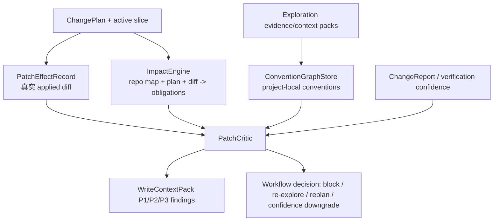

# Codrax 写模式 Project Knowledge + Patch Critic 商用交付方案

## Summary

本设计针对当前还剩的三个系统级差距：

1. **Patch Critic 还没升级**：现有 `PatchReviewRecord` 已能阻断 applied path
   越界，但它审的是计划范围和 applied path，并不审真实 worktree diff 的语义/效应。
2. **Impact Analysis 还不是独立引擎**：现有 `ImpactObligationSet` 只从
   `ChangePlan` 自声明 changes/depends_on/probes/slices 派生，属于 handoff/IR
   能力，不是“改 A 必查 B”的影响分析系统。
3. **Convention Graph 只有 MVP**：已落地 `ConventionGraph` typed handoff，但它
   仅从 exploration handoff 的 `ExistingPatterns` 和 mechanism/relationship/
   registration evidence refs 派生，尚未形成项目级惯例学习、持久化、检索和
   critic 消费闭环。

结论：三项都值得继续落地。它们应统一为一个 **Project Knowledge Kernel**：

硬门仍只消费 typed artifacts：paths, fingerprints, parser/AST results,
structured diff/effect records, risk/approval records, verification verdicts。
用户意图关键词、模型 rationale/summary、issue 散文、`<think>` 和 stdout prose
不得驱动硬逻辑。Noisy signals 只能作为 context、confidence 或 replan guidance。

## Current Code Audit

### Patch Critic

已落地：

- `internal/types/patch_review.go` 定义 `PatchReviewRecord` 和 finding。
- `internal/writeflow/patch_review.go` 的 `ReviewAppliedPatchScope` 只检查
  `TargetPaths`、active slice paths/change indexes、`AppliedPaths` 和 per-change
  apply status。
- `internal/orchestrator/write_controller_scheduler.go` 在 apply 后、verify 前调用
  `reviewActiveAppliedPatchScope`，硬阻断 applied path outside plan/slice。

缺口：

- 不读取真实 applied commit/worktree diff。
- 不知道 hunk、old/new line、函数/类/符号范围、实际新增/删除调用或状态写入。
- 不能识别“计划合理但真实 diff 改错层/扩散效应/递归风险/惯例违背”的情况。
- SWE-bench `matplotlib__matplotlib-26011` 暴露了这个问题：plan 通过并导出
  prediction，但真实 patch 把 shared-axis propagation 移出 `emit` gate，状态为
  `predicted_failed_verify`，当前系统只记录 verify/env 失败，缺少真实 diff critic
  finding。

### Impact Analysis

已落地：

- `internal/types/impact_obligation.go` 定义 `ImpactObligationSet`。
- `updateWorkflowRunBatchPlan` 会把 obligations stamp 到 `ChangePlan`。
- `WriteContextPackFromChangePlan` 投影 `impact_obligation` P1/P2 给 controller /
  planner / verifier。

缺口：

- 来源只有 plan 自声明 changes、depends_on、verification probe contract/symbol refs、
  slice refs。
- 没有 repo-map call graph/import graph/symbol graph 的独立 worker。
- 不会从真实 diff 推导 affected symbols、callers、tests、configs、generated files。
- 不会将“改 A 必查 B”转成 verifier obligations 或 PatchCritic coverage findings。

### Convention Graph

已落地：

- `internal/types/convention_graph.go` 定义 `ConventionGraph` / `ConventionNode`。
- `NormalizeWriteExplorationHandoff` 自动从 exploration handoff 派生 graph。
- `WriteContextPackFromExplorationHandoff` 投影 P3 `convention` items。
- Planner legacy handoff fallback 会渲染 conventions。

缺口：

- 没有项目级 store；graph 生命周期仍绑定单次 handoff。
- 没有 worker 从邻近 tests、同目录实现、repo manifests、accepted prior patches
  提取惯例。
- 没有 task-scoped retrieval/top-N ranking。
- PatchCritic 尚未消费 convention mismatch 作为 typed confidence/replan signal。

## Target Architecture

### Artifact 1: PatchEffectRecord

新增 typed diff/effect 事实层：

- `review_id / plan_id / slice_id / base_ref / head_ref / diff_fingerprint`
- `files[]`：
  - `path / old_path / status / language / is_test / is_generated`
  - `added_lines / removed_lines / hunks[]`
  - `touched_symbols[]`：来自 repo map、简单 parser 或 hunk anchor。
  - `effect_events[]`：结构化、语言无关或 parser-backed 事件。
- 初期 effect events：
  - `path_outside_scope`，hard
  - `generated_or_structured_file_parse_error`，hard when parser precise
  - `test_only_final_patch`，eval/customer policy hard or confidence block
  - `changed_symbol_without_probe_or_context`，soft
  - `control_flow_gate_moved`，soft
  - `call_broadcast_expanded`，soft
  - `external_private_state_write`，soft
  - `diagnostic_signal_suppressed`，soft

注意：`control_flow_gate_moved` / `call_broadcast_expanded` 必须来自 AST/diff
shape，例如 “call moved from inside conditional to outside conditional” 或
“call added inside loop over peer objects”，不能通过关键词或 issue prose 推导。

### Artifact 2: ImpactEngine

新增 `internal/writeflow/impact` 或等价包，输入：

- `ChangePlan`
- `PatchEffectRecord`
- existing `WriteContextPack`
- repo map graph provider
- optional `ChangeReport`

输出 `ImpactObligationSet` v2：

- `changed_file`：计划/真实 diff path。
- `changed_symbol`：真实 hunk touched symbol。
- `callers`：repo map call/reference relation。
- `imports/dependents`：import graph relation。
- `tests`：test surface relation。
- `config_or_generated_pair`：structured file/generated pair relation。
- `effect_followup`：来自 PatchEffectRecord 的 soft effect obligations。

初期不建新数据库，复用 repo map graph 和 durable workflow context。ImpactEngine
先是 per-run worker；确认价值后再做跨 run cache。

### Artifact 3: ConventionGraphStore

把现有 handoff MVP 升级为 store/worker：

- Store：`.codrax/plans/workflows/knowledge/<run_id>/conventions.json` 或 workflow
  context sidechain，原子写。
- Worker 输入：
  - exploration evidence refs
  - target files and neighboring files
  - same-directory tests
  - repo manifests/configs
  - accepted prior patch effects
- Node category：
  - `test_style`
  - `error_handling`
  - `callback_or_event_pattern`
  - `builder_factory_pattern`
  - `api_compatibility`
  - `logging_diagnostic`
  - `generated_file_policy`
  - `local_pattern`
- Retrieval：按 active paths/symbols/impact obligations 取 Top-N，投影为 P3
  context，PatchCritic 可输出 soft `convention_mismatch`。

惯例全部是 soft guidance/confidence，不做 hard gate。

### PatchCritic v2

PatchCritic 消费：

- active slice
- `ChangePlan` and fingerprint
- `PatchEffectRecord`
- `ImpactObligationSet`
- `ConventionGraph`
- `ChangeReport` / verification confidence
- approval/risk record

输出增强版 `PatchReviewRecord`：

- hard findings：scope/fingerprint/parser/policy 精确信号。
- soft findings：impact missing, convention mismatch, owner-boundary suspicion,
  broadcast/control-flow effect expansion, weak verification.
- `next_action`: `continue_verify / replan / reexplore / block / confidence_downgrade`
- `context_pack`: P1/P2/P3 typed items for controller/planner/verifier。

Controller 行为：

- hard finding -> block current slice/run, no apply/verify continuation。
- soft finding + verify failed/unavailable -> prefer replan/re-explore while budget remains。
- soft finding + verify passed -> downgrade local confidence or ask for narrow follow-up
  only when policy requires。
- no finding -> continue verify/finish。

## Delivery Tasks

### Batch 0: Design Ledger

- Add this document.
- Record current code audit, live SWE-bench evidence, target architecture, red
  lines, task list, and acceptance criteria.
- Commit/push:
  `docs: record project knowledge patch critic delivery plan`

### Batch 1: PatchEffectRecord Diff Artifact

- Add `types.PatchEffectRecord`, `PatchEffectFile`, `PatchEffectHunk`,
  `PatchEffectEvent`.
- Add `worktree.CaptureCommitPatch` consumer or a safe wrapper that resolves
  applied ref/base ref and stores actual diff bytes/fingerprint.
- Add a unified diff parser with file/hunk/line stats.
- Attach `PatchEffectRecord` to `ChangePlan` and workflow context after apply.
- Tests:
  - parse create/modify/delete/rename hunks
  - record applied ref diff after worktree commit
  - fingerprint stable
  - no model prose / stdout input

### Batch 2: PatchCritic v2 Scope + Structured File Hard Checks

- Replace/extend `ReviewAppliedPatchScope` to consume `PatchEffectRecord`.
- Hard checks:
  - actual diff path outside target/slice
  - test-only final patch under SWE/customer policy
  - JSON/YAML/XML parse failure for changed structured files
  - plan fingerprint mismatch
- Keep current `PatchReviewRecord` schema compatible by adding fields, not
  adding a parallel record.
- Tests:
  - actual diff catches undeclared path even if `AppliedPaths` lies/missing
  - parser-backed invalid structured file blocks
  - test-only policy blocks in eval lane

### Batch 3: PatchCritic Soft Effect Signals

- Add parser/diff-shape soft events:
  - control-flow gate moved
  - call broadcast expanded
  - external private state write
  - diagnostic signal suppression
- Feed soft findings into `WriteContextPack` P2 for planner/verifier and into
  prediction confidence fields.
- Tests use small synthetic Python/Go/JS snippets; no keyword matching against
  issue text or model rationale.

### Batch 4: ImpactEngine v2

- Introduce `internal/writeflow/impact` with a graph-provider interface.
- First provider consumes existing repo map graph already stored on
  `MutableState.SearchGraph` / repo-map facilities.
- Merge plan-derived, diff-derived, and graph-derived obligations.
- Project obligations into planner/verifier/controller Top-N context.
- Tests:
  - changed symbol -> caller obligation
  - changed import target -> dependent obligation
  - changed source -> related focused test obligation
  - missing impact coverage becomes soft finding, not hard block

### Batch 5: ConventionGraphStore + Worker

- Add durable convention store/sidechain.
- Build worker extraction from:
  - exploration evidence refs
  - same-directory tests/examples
  - manifest/config files
  - accepted patch effects
- Add retrieval by active paths/symbols/impact obligations.
- Tests:
  - graph persists/resumes
  - duplicate conventions dedupe
  - Top-N selection is stable and scoped
  - no convention hard gate

### Batch 6: PatchCritic Integration Loop

- Controller runs PatchCritic after apply and before verify.
- Soft findings + unavailable/failed verify trigger replan/re-explore while
  budget remains.
- Hard findings block active slice.
- Status cards expose concise next action; routine users do not need new
  commands.
- Tests:
  - Matplotlib-like broadcast expansion produces soft finding and replan hint
  - out-of-scope actual diff blocks
  - verify unavailable does not block export but confidence is downgraded

### Batch 7: SWE-bench And Customer Eval Hardening

- Re-run targeted Lite set:
  - `matplotlib__matplotlib-26011`
  - `scikit-learn__scikit-learn-25570`
  - `sympy__sympy-13177`
- Validate predictions JSONL and official harness dry-run consumption.
- Manual audit:
  - answer/patch satisfies issue
  - confidence/finding fields reflect unresolved risk
  - no future git history leakage with isolation flag
- Update this ledger after each run.

## Acceptance Criteria

- PatchReview v2 reads actual applied diff, not just plan paths.
- Critical precise findings block automatically; high risk still uses approval;
  low/medium routine patches continue without extra user interruptions.
- ImpactEngine can derive at least caller/dependent/test obligations from typed
  graph/path/symbol facts.
- ConventionGraph persists beyond one handoff and is retrievable by active
  scope.
- PatchCritic consumes impact/convention/effect artifacts and emits typed
  findings/context.
- No hard logic consumes user intent keywords, model prose/rationale,
  issue text, stdout prose, or `<think>`.
- Read mode, trace/log/data, operation/computer modes remain untouched except
  for shared type additions.
- Full `go test ./...`, `make`, focused writeflow/orchestrator/type tests, and
  SWE-bench adapter validation pass before marking the program complete.

## Progress Ledger

| Batch | Status | Notes |
| --- | --- | --- |
| 0 | complete | Design ledger created from current code audit and live SWE-bench `matplotlib__matplotlib-26011` signal. |
| 1 | complete | Added `PatchEffectRecord` typed schema, unified-diff parser, post-apply capture from the real applied commit, ChangePlan persistence, and P2 `patch_effect` context projection. Current PatchReview still uses scope MVP until Batch 2. |
| 2 | complete | PatchReview now consumes actual `PatchEffectRecord` paths, records reviewed diff identity, hard-blocks true diff paths outside plan/slice, and hard-blocks parser-backed JSON/YAML/XML parse failures emitted as typed patch-effect events. Test-only export remains an eval/customer policy layer, not a global core hard gate, because test-only changes are valid customer tasks. |

## Live Eval Ledger

| Date | Eval | Result | System Signal |
| --- | --- | --- | --- |
| 2026-06-17 | SWE-bench Lite smoke: `matplotlib__matplotlib-26011`, `scikit-learn__scikit-learn-25570`, `sympy__sympy-13177` | 3 predictions generated, 0 empty patches, official harness command validated/dry-run consumable. | Matplotlib prediction exposes true-diff semantic risk: actual patch moved shared-axis propagation outside the `emit` gate and added callback broadcast without typed patch-effect criticism. Scikit-learn exposes verify infrastructure/tooling errors driving repeated replan until budget exhaustion. SymPy exposes env/import incompatibility where export can remain useful but local confidence must stay downgraded. |
