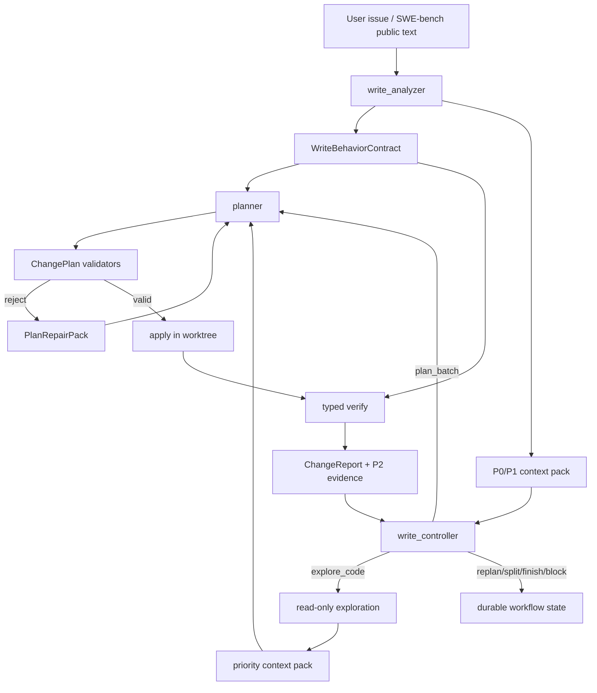

# Codrax Write Mode SWE-bench Gap Closure Plan

Date: 2026-06-16
Branch: main
Status: active delivery ledger

## Summary

This document records the post-clean SWE-bench Lite audit and the next
commercial hardening plan for Codrax write mode. The goal is not to patch one
SWE-bench case. The goal is a generic, typed workflow that can:

- understand symptom-first issues,
- explore code only when needed,
- plan bounded batches,
- apply low/medium risk changes automatically,
- keep high-risk approval explicit,
- verify with typed results,
- preserve failure evidence for replan,
- export SWE-bench predictions without depending on local environment success.

Hard routing continues to consume only typed artifacts: workflow actions,
ChangePlan, ChangeReport, risk/approval records, parser results, path policy,
AST/parser-derived checks, and durable context packs. Prompts remain soft
guidance. User prose, model rationale, summaries, and visible `<think>` logs
must not become hard gates.

## Evidence Ledger

Run:

```text
WORKDIR=eval/results/swebench/lite-smoke-20260616-postclean-flask-pytest-sphinx
INSTANCE_IDS_FILE=[pallets__flask-4045, pytest-dev__pytest-9359, sphinx-doc__sphinx-8273]
SWEBENCH_SMOKE_LIMIT=3
SWEBENCH_ISOLATE_GIT_HISTORY=1
SWEBENCH_RUN_OFFICIAL=0
eval/swebench/smoke_lite.sh
```

Artifacts:

- Predictions:
  `eval/results/swebench/lite-smoke-20260616-postclean-flask-pytest-sphinx/predictions.jsonl`
- Results:
  `eval/results/swebench/lite-smoke-20260616-postclean-flask-pytest-sphinx/results.jsonl`
- Official harness dry-run command was emitted successfully.
- `validate_predictions.py` passed for 3 predictions; `empty_patch=0`.

Observed instance outcomes:

| Instance | Export | Local verify | Manual audit |
| --- | --- | --- | --- |
| `pallets__flask-4045` | non-empty source patch | `unavailable/parser_error` | Patch likely targets right file but planner drifted from typed expected `ValueError` to `AssertionError`; expected behavior contract is too weakly enforced. |
| `pytest-dev__pytest-9359` | non-empty source patch | `passed` by verification probe | Patch only changed `_` to `ast_start` and did not use `ast_start`; probe passed because it was not discriminative for the current Python runtime. |
| `sphinx-doc__sphinx-8273` | non-empty source/doc patch | `unavailable/parser_error` | Patch updates builder path and docs; verify parser_error reports missing JSON report, but raw traceback should be classified as environment/import startup failure and preserved as P2 evidence. |

## Systemic Gaps

### G1: Behavioral Contract Drift

`WriteAnalysisIR.expected_outcomes` carried concrete behavior for Flask, but the
planner emitted acceptance criteria and tests for a different exception type.
This is a generic gap: expected behavior facts are rendered as prose rather than
as a typed contract that ChangePlan validators and verifier probes can compare.

Required direction:

- Add a typed `WriteBehaviorContract` projection from WriteAnalysisIR and issue
  observations.
- Preserve fields such as exception type, output path, file layout, status code,
  command result, and observable before/after behavior as typed atoms.
- ChangePlan must either satisfy or explicitly mark each contract atom as
  unverifiable/local-env-blocked.
- Verification probes should reference contract atom ids, not only prose
  acceptance tests.

### G2: Weak Verification Probe Confidence

`pytest-dev__pytest-9359` passed a probe even though the exported patch was
semantically incomplete. The probe checked current Python behavior and did not
prove the changed line affected the observed bug.

Required direction:

- Add `VerificationProbe.contract_refs[]` and `changed_symbol_refs[]`.
- Probe validation must ensure the probe imports or executes changed production
  code and observes the requested behavior.
- Local confidence should be downgraded when probes are runtime-version
  dependent, lack changed-symbol coupling, or pass on unchanged baseline when a
  baseline run is available.
- Introduce optional pre-apply baseline probe execution for probes marked
  `expects_baseline_failure`.

### G3: Dead Edit Accepted By Plan Validator

The pytest patch changed a discard binding (`_`) to a named binding
(`ast_start`) without reading that binding. This is a structural dead edit that
Python syntax checks cannot catch.

Required direction:

- Add a Python patch validator for named discard-binding introductions.
- If a patch replaces `_` in tuple/list unpacking with a named identifier, that
  identifier must be read somewhere in the final file.
- This is an AST/diff structural rule; it does not read user keywords or model
  prose.

### G4: Misleading Structured Edit Rejection

The pytest planner first hit a `duplicate Python function "__getitem__"` rejection
for an edit whose real issue was a wrong line anchor / incomplete replacement.
The model recovered only after many retries and a skeleton path.

Required direction:

- Validator errors must prioritize direct edit diagnostics over secondary
  dry-build or duplicate-definition findings when structured edit compilation
  already knows the anchor mismatch.
- Rejection payload should include current bytes, minimal replacement range,
  canonical safe edit kinds, and whether skeleton/full-file fallback is
  recommended.
- Planner should receive one compact `PlanRepairPack`, not a long sequence of
  inconsistent textual hints.

### G5: Verify Parser Error Classification Too Coarse

Flask and Sphinx local verification ended as `parser_error`. That should not
block prediction export, but the report should distinguish:

- missing pytest-json-report plugin,
- pytest collection/import startup failure,
- project dependency import failure,
- runner internal error,
- no tests,
- genuine parser incompatibility.

Required direction:

- Keep local code delivery unblocked for environment/tooling unavailable cases.
- Parse raw stdout/stderr into typed unavailable subreasons.
- Put command, exit code, top traceback file/module, import exception, and
  environment hint into P2 context.
- Do not replan on environment unavailable unless a typed probe or syntax check
  identifies a code defect.

### G6: Context Pack Coverage And Consumer Views

The runs showed context coverage ratios of `0.5` for pytest/Sphinx. Handoff
contained important facts, but planner/verifier did not always consume them
enough to avoid weak probes or incomplete patches.

Required direction:

- Dedupe and rank P0-P3 context by consumer.
- Planner top view should include all P0 contract atoms and P1 changed-symbol
  invariants before optional style hints.
- Verifier top view should include P0 contract atoms, P2 failure evidence, and
  probe-contract mapping.

## Target Architecture



## Delivery Tasks

### Batch 0: Documentation Ledger

- Add this document.
- Record the three-instance SWE-bench evidence, gaps, target architecture, and
  task list.
- Commit and push.

Acceptance:

- Document is in `docs/design/`.
- Worktree clean after push.

### Batch 1: Python Dead-Edit Validator

- Add structural validator for Python patches that replace `_` unpack targets
  with named variables.
- Reject when the introduced name is never read in the final planned file.
- Cover both raw patches and structured edits.
- Add unit tests for reject/pass cases.

Acceptance:

- The pytest-style incomplete patch is rejected at plan time.
- A patch that also reads the introduced name is accepted.
- `go test ./internal/tool -run 'DiscardBinding|EmitChangePlan'` passes.
- Full `go test ./...` passes.

### Batch 2: Verify Parser Subreason Classification

- Add typed parser-error subreasons on `ChangeReport` or `ExecutedCommand`.
- Classify pytest startup/import/plugin failures from raw output.
- Preserve top traceback/import exception in failure summary and P2 context.
- Keep these outcomes terminal-unverified, not verify-failed replan triggers.

Acceptance:

- Flask/Sphinx style import startup output no longer appears as only generic
  `parser_error`.
- P2 context includes command, exit code, exception/module, and environment hint.

### Batch 3: Behavior Contract IR

- Introduce `WriteBehaviorContract` typed atoms.
- Project from `WriteAnalysisIR.expected_outcomes`, issue runtime observations,
  and exploration evidence using schema-backed fields.
- Store contract snapshot on ChangePlan.
- Add validator that plan acceptance/probe coverage cannot contradict required
  contract atoms.

Acceptance:

- Exception type/path layout/output contract drift is caught without keyword
  matching user intent.
- Existing simple write mode still auto-runs low/medium risk tasks.

### Batch 4: Probe Confidence And Baseline

- Extend `VerificationProbe` with `contract_refs`, `changed_symbol_refs`, and
  optional `expects_baseline_failure`.
- Add optional baseline probe run before apply when cheap and deterministic.
- Downgrade local confidence if probe passes before apply or lacks changed-code
  coupling.

Acceptance:

- Runtime-version-only probes cannot produce high local confidence.
- SWE-bench adapter results surface confidence downgrade while still exporting
  official predictions.

### Batch 5: PlanRepairPack

- Normalize validation rejections into a typed repair packet:
  reason code, path, edit index, current bytes, expected bytes, safe edit kinds,
  recommended carrier, and retry scope.
- Planner receives the repair packet before prose hints.
- Controller can detect repeated same repair reason and switch carrier or block.

Acceptance:

- Wrong-anchor/patch-hunk failures recover in one or two retries.
- Misleading secondary duplicate-definition diagnostics no longer dominate.

### Batch 6: Handoff Consumer Views

- Add consumer-specific Top-N rendering for controller/planner/verifier.
- P0 contract and risk records are always included.
- P2 verify evidence is always lead context for replan.

Acceptance:

- Context coverage improves on pytest/Sphinx style cases.
- No rich evidence is available only in logs.

### Batch 7: SWE-bench Regression Pack

- Re-run at least the three cases in this document plus two additional symptom
  localization cases.
- Validate predictions and official harness dry-run.
- Manually audit patches and local confidence.
- Update this ledger and push.

## Progress Ledger

- 2026-06-16: Cleaned prior uncommitted work into two commits and pushed:
  `30f95cbe eval: harden swebench prediction audit`,
  `a043c936 read: stabilize role lookup handoff`.
- 2026-06-16: Ran three SWE-bench Lite instances after clean push. Predictions
  validated and official harness dry-run consumed them.
- 2026-06-16: Manual audit found G1-G6 above. Batch 1 implementation starts
  from the Python discard-binding dead-edit validator.
- 2026-06-16: Batch 1 implemented locally. Python plan validation now rejects
  patches that replace `_` unpack discard targets with a named variable that is
  never read in the final planned file. Targeted tests passed:
  `go test ./internal/tool -run 'DiscardBinding|EmitChangePlan'` and
  `go test ./internal/tool -run 'StructuredEdit|RunTests|Pytest'`.
- 2026-06-16: Batch 1 full `go test ./...` passed, then committed and pushed
  as `12a0ea85 write: reject dead python discard binding edits`.
- 2026-06-16: Batch 2 implemented locally. `ChangeReport`,
  `ExecutedCommand`, and `VerifyFailureHandoff` now carry typed parser-error
  subreasons. Pytest parser failures classify import/startup errors,
  collection-without-cases, JSON report missing/unavailable/unreadable, and
  text-summary-missing without reading model/user prose. `WriteContextPack`
  projects `failure_reason_code` and command `reason_code` into P2 evidence.
  Targeted tests passed:
  `go test ./internal/tool -run 'PytestParser|ParsePytest|RunTests'` and
  `go test ./internal/types -run 'WriteContextPack|VerifyFailureHandoff'`.
