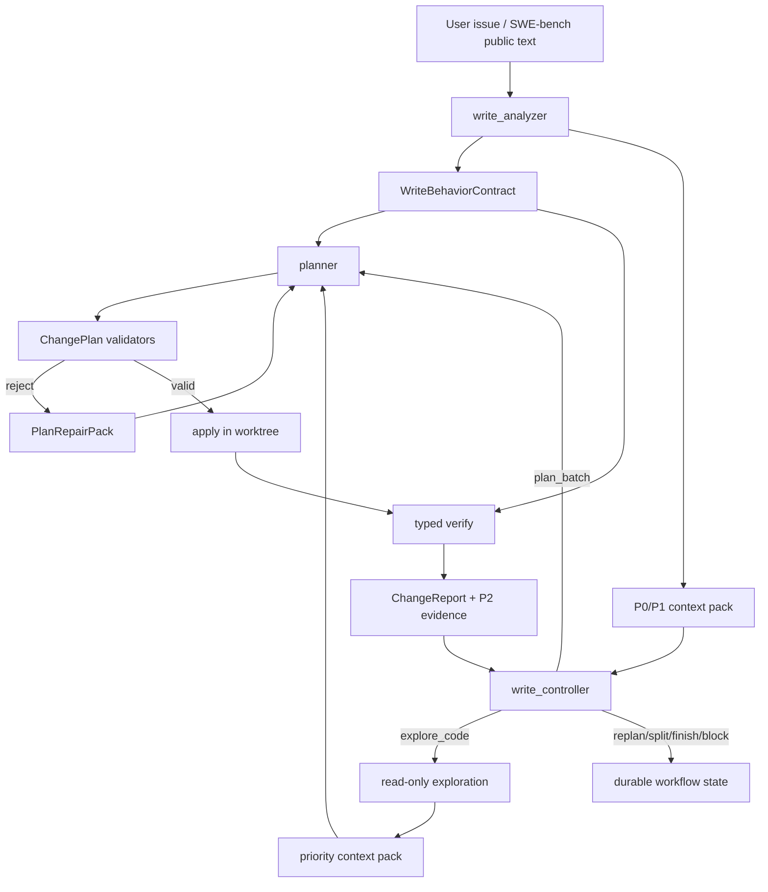
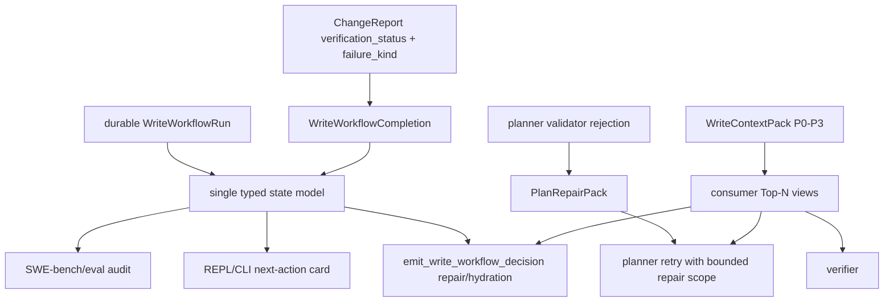

# Codrax Write Mode SWE-bench Gap Closure Plan

Date: 2026-06-16
Branch: main
Status: active delivery ledger

## Summary

This document records the post-clean SWE-bench Lite audit and the next
commercial hardening plan for Codrax write mode. The goal is not to patch one
SWE-bench case. The goal is a generic, typed workflow that can:

- understand symptom-first issues,
- explore code only when needed,
- plan bounded batches,
- apply low/medium risk changes automatically,
- keep high-risk approval explicit,
- verify with typed results,
- preserve failure evidence for replan,
- export SWE-bench predictions without depending on local environment success.

Hard routing continues to consume only typed artifacts: workflow actions,
ChangePlan, ChangeReport, risk/approval records, parser results, path policy,
AST/parser-derived checks, and durable context packs. Prompts remain soft
guidance. User prose, model rationale, summaries, and visible `<think>` logs
must not become hard gates.

## Evidence Ledger

Run:

```text
WORKDIR=eval/results/swebench/lite-smoke-20260616-postclean-flask-pytest-sphinx
INSTANCE_IDS_FILE=[pallets__flask-4045, pytest-dev__pytest-9359, sphinx-doc__sphinx-8273]
SWEBENCH_SMOKE_LIMIT=3
SWEBENCH_ISOLATE_GIT_HISTORY=1
SWEBENCH_RUN_OFFICIAL=0
eval/swebench/smoke_lite.sh
```

Artifacts:

- Predictions:
  `eval/results/swebench/lite-smoke-20260616-postclean-flask-pytest-sphinx/predictions.jsonl`
- Results:
  `eval/results/swebench/lite-smoke-20260616-postclean-flask-pytest-sphinx/results.jsonl`
- Official harness dry-run command was emitted successfully.
- `validate_predictions.py` passed for 3 predictions; `empty_patch=0`.

Observed instance outcomes:

| Instance | Export | Local verify | Manual audit |
| --- | --- | --- | --- |
| `pallets__flask-4045` | non-empty source patch | `unavailable/parser_error` | Patch likely targets right file but planner drifted from typed expected `ValueError` to `AssertionError`; expected behavior contract is too weakly enforced. |
| `pytest-dev__pytest-9359` | non-empty source patch | `passed` by verification probe | Patch only changed `_` to `ast_start` and did not use `ast_start`; probe passed because it was not discriminative for the current Python runtime. |
| `sphinx-doc__sphinx-8273` | non-empty source/doc patch | `unavailable/parser_error` | Patch updates builder path and docs; verify parser_error reports missing JSON report, but raw traceback should be classified as environment/import startup failure and preserved as P2 evidence. |

## Systemic Gaps

### G1: Behavioral Contract Drift

`WriteAnalysisIR.expected_outcomes` carried concrete behavior for Flask, but the
planner emitted acceptance criteria and tests for a different exception type.
This is a generic gap: expected behavior facts are rendered as prose rather than
as a typed contract that ChangePlan validators and verifier probes can compare.

Required direction:

- Add a typed `WriteBehaviorContract` projection from WriteAnalysisIR and issue
  observations.
- Preserve fields such as exception type, output path, file layout, status code,
  command result, and observable before/after behavior as typed atoms.
- ChangePlan must either satisfy or explicitly mark each contract atom as
  unverifiable/local-env-blocked.
- Verification probes should reference contract atom ids, not only prose
  acceptance tests.

### G2: Weak Verification Probe Confidence

`pytest-dev__pytest-9359` passed a probe even though the exported patch was
semantically incomplete. The probe checked current Python behavior and did not
prove the changed line affected the observed bug.

Required direction:

- Add `VerificationProbe.contract_refs[]` and `changed_symbol_refs[]`.
- Probe validation must ensure the probe imports or executes changed production
  code and observes the requested behavior.
- Local confidence should be downgraded when probes are runtime-version
  dependent, lack changed-symbol coupling, or pass on unchanged baseline when a
  baseline run is available.
- Introduce optional pre-apply baseline probe execution for probes marked
  `expects_baseline_failure`.

### G3: Dead Edit Accepted By Plan Validator

The pytest patch changed a discard binding (`_`) to a named binding
(`ast_start`) without reading that binding. This is a structural dead edit that
Python syntax checks cannot catch.

Required direction:

- Add a Python patch validator for named discard-binding introductions.
- If a patch replaces `_` in tuple/list unpacking with a named identifier, that
  identifier must be read somewhere in the final file.
- This is an AST/diff structural rule; it does not read user keywords or model
  prose.

### G4: Misleading Structured Edit Rejection

The pytest planner first hit a `duplicate Python function "__getitem__"` rejection
for an edit whose real issue was a wrong line anchor / incomplete replacement.
The model recovered only after many retries and a skeleton path.

Required direction:

- Validator errors must prioritize direct edit diagnostics over secondary
  dry-build or duplicate-definition findings when structured edit compilation
  already knows the anchor mismatch.
- Rejection payload should include current bytes, minimal replacement range,
  canonical safe edit kinds, and whether skeleton/full-file fallback is
  recommended.
- Planner should receive one compact `PlanRepairPack`, not a long sequence of
  inconsistent textual hints.

### G5: Verify Parser Error Classification Too Coarse

Flask and Sphinx local verification ended as `parser_error`. That should not
block prediction export, but the report should distinguish:

- missing pytest-json-report plugin,
- pytest collection/import startup failure,
- project dependency import failure,
- runner internal error,
- no tests,
- genuine parser incompatibility.

Required direction:

- Keep local code delivery unblocked for environment/tooling unavailable cases.
- Parse raw stdout/stderr into typed unavailable subreasons.
- Put command, exit code, top traceback file/module, import exception, and
  environment hint into P2 context.
- Do not replan on environment unavailable unless a typed probe or syntax check
  identifies a code defect.

### G6: Context Pack Coverage And Consumer Views

The runs showed context coverage ratios of `0.5` for pytest/Sphinx. Handoff
contained important facts, but planner/verifier did not always consume them
enough to avoid weak probes or incomplete patches.

Required direction:

- Dedupe and rank P0-P3 context by consumer.
- Planner top view should include all P0 contract atoms and P1 changed-symbol
  invariants before optional style hints.
- Verifier top view should include P0 contract atoms, P2 failure evidence, and
  probe-contract mapping.

## Target Architecture



## Delivery Tasks

### Batch 0: Documentation Ledger

- Add this document.
- Record the three-instance SWE-bench evidence, gaps, target architecture, and
  task list.
- Commit and push.

Acceptance:

- Document is in `docs/design/`.
- Worktree clean after push.

### Batch 1: Python Dead-Edit Validator

- Add structural validator for Python patches that replace `_` unpack targets
  with named variables.
- Reject when the introduced name is never read in the final planned file.
- Cover both raw patches and structured edits.
- Add unit tests for reject/pass cases.

Acceptance:

- The pytest-style incomplete patch is rejected at plan time.
- A patch that also reads the introduced name is accepted.
- `go test ./internal/tool -run 'DiscardBinding|EmitChangePlan'` passes.
- Full `go test ./...` passes.

### Batch 2: Verify Parser Subreason Classification

- Add typed parser-error subreasons on `ChangeReport` or `ExecutedCommand`.
- Classify pytest startup/import/plugin failures from raw output.
- Preserve top traceback/import exception in failure summary and P2 context.
- Keep these outcomes terminal-unverified, not verify-failed replan triggers.

Acceptance:

- Flask/Sphinx style import startup output no longer appears as only generic
  `parser_error`.
- P2 context includes command, exit code, exception/module, and environment hint.

### Batch 3: Behavior Contract IR

- Introduce `WriteBehaviorContract` typed atoms.
- Project from `WriteAnalysisIR.expected_outcomes`, issue runtime observations,
  and exploration evidence using schema-backed fields.
- Store contract snapshot on ChangePlan.
- Add validator that plan acceptance/probe coverage cannot contradict required
  contract atoms.

Acceptance:

- Exception type/path layout/output contract drift is caught without keyword
  matching user intent.
- Existing simple write mode still auto-runs low/medium risk tasks.

### Batch 4: Probe Confidence And Baseline

- Extend `VerificationProbe` with `contract_refs`, `changed_symbol_refs`, and
  optional `expects_baseline_failure`.
- Add optional baseline probe run before apply when cheap and deterministic.
- Downgrade local confidence if probe passes before apply or lacks changed-code
  coupling.

Acceptance:

- Runtime-version-only probes cannot produce high local confidence.
- SWE-bench adapter results surface confidence downgrade while still exporting
  official predictions.

### Batch 5: PlanRepairPack

- Normalize validation rejections into a typed repair packet:
  reason code, path, edit index, current bytes, expected bytes, safe edit kinds,
  recommended carrier, and retry scope.
- Planner receives the repair packet before prose hints.
- Controller can detect repeated same repair reason and switch carrier or block.

Acceptance:

- Wrong-anchor/patch-hunk failures recover in one or two retries.
- Misleading secondary duplicate-definition diagnostics no longer dominate.

### Batch 6: Handoff Consumer Views

- Add consumer-specific Top-N rendering for controller/planner/verifier.
- P0 contract and risk records are always included.
- P2 verify evidence is always lead context for replan.

Acceptance:

- Context coverage improves on pytest/Sphinx style cases.
- No rich evidence is available only in logs.

### Batch 7: SWE-bench Regression Pack

- Re-run at least the three cases in this document plus two additional symptom
  localization cases.
- Validate predictions and official harness dry-run.
- Manually audit patches and local confidence.
- Update this ledger and push.

## Progress Ledger

- 2026-06-16: Cleaned prior uncommitted work into two commits and pushed:
  `30f95cbe eval: harden swebench prediction audit`,
  `a043c936 read: stabilize role lookup handoff`.
- 2026-06-16: Ran three SWE-bench Lite instances after clean push. Predictions
  validated and official harness dry-run consumed them.
- 2026-06-16: Manual audit found G1-G6 above. Batch 1 implementation starts
  from the Python discard-binding dead-edit validator.
- 2026-06-16: Batch 1 implemented locally. Python plan validation now rejects
  patches that replace `_` unpack discard targets with a named variable that is
  never read in the final planned file. Targeted tests passed:
  `go test ./internal/tool -run 'DiscardBinding|EmitChangePlan'` and
  `go test ./internal/tool -run 'StructuredEdit|RunTests|Pytest'`.
- 2026-06-16: Batch 1 full `go test ./...` passed, then committed and pushed
  as `12a0ea85 write: reject dead python discard binding edits`.
- 2026-06-16: Batch 2 implemented locally. `ChangeReport`,
  `ExecutedCommand`, and `VerifyFailureHandoff` now carry typed parser-error
  subreasons. Pytest parser failures classify import/startup errors,
  collection-without-cases, JSON report missing/unavailable/unreadable, and
  text-summary-missing without reading model/user prose. `WriteContextPack`
  projects `failure_reason_code` and command `reason_code` into P2 evidence.
  Targeted tests passed:
  `go test ./internal/tool -run 'PytestParser|ParsePytest|RunTests'` and
  `go test ./internal/types -run 'WriteContextPack|VerifyFailureHandoff'`.
- 2026-06-16: Batch 2 full `go test ./...` passed, then committed and pushed
  as `d6cfb36b write: classify verify parser subreasons`.
- 2026-06-16: Batch 3 implemented locally. Added typed
  `WriteBehaviorContract` atoms, analyzer schema support, ChangePlan contract
  snapshots, probe `contract_refs` / `changed_symbol_refs` /
  `expects_baseline_failure`, planner/controller/context-pack rendering, and
  structural plan validation for explicit required contract coverage. The
  hard gate only reads typed contract IDs/enums and probe metadata; it does not
  parse user prose, model rationale, or natural-language expected outcomes.
  Targeted tests passed:
  `go test ./internal/tool -run 'EmitWriteAnalysis|EmitChangePlan|VerificationProbe|RunTests'`,
  `go test ./internal/types -run 'WriteContextPack|WriteAnalysisIR|ChangePlan|BehaviorContract'`,
  `go test ./internal/agent -run 'Planner|WriteController|Prompt'`, and
  `go test ./internal/skill`.
- 2026-06-16: Batch 3 full `go test ./...` passed, then committed and pushed
  as `cbab9c9a write: add typed behavior contract coverage`.
- 2026-06-16: Batch 4 implemented locally for the SWE-bench adapter confidence
  lane. A local passed verdict that depends only on verification probes now
  gets `prediction_confidence_downgrade_reason` when explicit required
  behavior contracts are not referenced, changed symbols are missing, or a
  baseline-failure probe lacks a baseline run. This is audit telemetry only:
  predictions still export for the official harness, and environment/setup
  unavailability remains non-blocking.

## 2026-06-16 Architecture Reframe: From Case Fixes To A Control-Plane Contract

Later SWE-bench Lite smoke runs exposed enough recurring patterns that the
remaining work should not continue as case-by-case patching. The systemic issue
is a control-plane contract gap: controller, planner, verifier, CLI/REPL, and
eval all need to consume the same typed state and repair artifacts, while model
prompts remain soft guidance only.

Additional evidence:

```text
WORKDIR=eval/results/swebench/lite-smoke-20260616-astropy-pylint-sympy-contract-current
INSTANCE_IDS_FILE=[astropy__astropy-12907, pylint-dev__pylint-7228, sympy__sympy-12419]
SWEBENCH_SMOKE_LIMIT=3
SWEBENCH_ISOLATE_GIT_HISTORY=1
SWEBENCH_RUN_OFFICIAL=0
eval/swebench/smoke_lite.sh
```

Outcomes:

- All three predictions exported non-empty patches and `validate_predictions.py`
  accepted the JSONL; official harness dry-run command was emitted.
- `astropy__astropy-12907`: plausible bounded source patch, local verify
  `unavailable/parser_error` because the historical checkout could not import
  `erfa`.
- `pylint-dev__pylint-7228`: exported patch was likely semantically wrong
  (`re.UNICODE` does not add `\p{...}` support); local verify was unavailable
  due missing dependency, so control-plane confidence stayed unknown.
- `sympy__sympy-12419`: exported patch referenced `fuzzy_not` without an
  import; historical SymPy import failed under local Python before tests could
  catch it.
- All three durable workflow runs had `status=complete` while final plan/report
  stayed `unverified/unavailable`. That is acceptable as a delivery outcome, but
  not as an audit signal unless completion has a first-class typed verdict.
- One controller decision emitted `replan_batch` with typed `batch.id/status`
  but omitted `batch.goal`, producing a vague `requires batch` retry. The system
  should hydrate from the active durable batch instead of forcing the model to
  restate known typed state.

### Root Cause

The recurring gaps cluster into four architecture-level contracts:

1. **Terminal state contract**: `status=complete` overloaded "controller
   converged" and "locally verified". That made audit consumers and state cards
   infer verification quality from result prose, progress ledger text, or plan
   status combinations.
2. **Decision repair/hydration contract**: tool JSON validation rejected small
   omissions even when the durable run had a precise typed value. This created
   extra model retries and unnecessary user-visible churn.
3. **Semantic verify contract**: local environment gaps must not hard-block code
   delivery, but confidence must degrade when probes or available checks do not
   prove changed behavior. This requires typed contracts and source-coupled
   evidence, not prose acceptance criteria.
4. **Handoff/repair contract**: planner and controller need compact typed
   repair packets and priority consumer views. Long prose hints and logs are
   insufficient; rich evidence must persist and be selected by consumer.

### Target Design



Hard gates continue to read only precise signals:

- JSON/schema-validated tool fields and action enums.
- Durable run/batch ids, goals, attempts, completion verdicts, plan ids.
- ChangePlan paths, structured edits, AST/parser results, command exit status,
  `ChangeReport.verification_status`, and typed `failure_kind`.
- Context pack item priorities, evidence refs, and consumer tags.

Hard gates must not read user intent keywords, SWE-bench ids, model rationale,
free-form summaries, `<think>`, or natural-language logs.

### Updated Delivery Tasks

#### Batch 5A: Terminal Completion Verdict And Decision Hydration

- Add `WriteWorkflowCompletion` to run and batch:
  `verified | unverified | accepted_failed`.
- Backfill completion verdicts from latest typed verify attempts when loading
  old durable runs.
- Record `verified` for passed post-apply verify, `unverified` for
  runner-missing/parser-error/no-tests, and `accepted_failed` only through typed
  `finish_disposition=accept_unverified` on a failed latest verify.
- Surface completion verdict through `BatchAttemptState` and
  `WriteWorkflowNextActionView`.
- Enforce finish hard gate inside `ApplyWorkflowDecisionToRun` as well as the
  scheduler.
- Preserve non-empty batch payloads even when `goal` is omitted; validate as
  `batch.goal` rather than vague `requires batch`.
- Hydrate missing `batch.goal` from the active durable run before validation in
  both `emit_write_workflow_decision` and scheduler dispatch.
- Update `docs/architecture.md`, `docs/user_guide.md`, and
  `docs/user_guide.html`.

Acceptance:

- A completed unverified workflow persists
  `completion.verdict=unverified`, and CLI/REPL/eval can distinguish it from
  `verified`.
- `finish` after failed verify is rejected by the writeflow package unless the
  typed disposition is present.
- `replan_batch` with matching typed `batch.id` can reuse the durable batch
  goal without another model round.
- Tests:
  `go test ./internal/types -run WriteWorkflow`,
  `go test ./internal/writeflow`,
  `go test ./internal/tool -run EmitWriteWorkflowDecision`,
  `go test ./internal/orchestrator -run 'RunWriteControllerWorkflow_(RunnerMissing|ParserError|NoTests|Budget)|Unverified|Workflow'`,
  and full `go test ./...`.

Progress:

- Implemented, regression tested, committed, and pushed as
  `8fde24ea write: record workflow completion verdicts`.

#### Batch 5B: Unified PlanRepairPack

- Introduce a typed repair packet shared by `emit_change_plan`,
  `emit_plan_skeleton`, `emit_plan_change`, and controller retry rendering.
- Fields: `reason_code`, `path`, `change_index`, `current_ref`,
  `expected_ref`, `safe_edit_kinds`, `retry_scope`, `consumer`, and
  `evidence_ref`.
- Emit this packet for anchor mismatch, duplicate/stutter validators,
  full-file truncation guards, unsupported content carriers, and probe
  confidence downgrade.
- Planner sees one compact repair section before prose; repeated identical
  repair packets let controller switch carrier or block.

Acceptance:

- Wrong-anchor and no-op replan loops converge without repeated generic
  exploration.
- Hard logic consumes packet fields only, never model/tool-result prose.

#### Batch 5C: Semantic Verify Confidence Layer

- Add typed static/runtime confidence records separate from pass/fail:
  `source_compile_ok`, `changed_symbol_coupled`, `contract_refs_covered`,
  `baseline_failed`, `probe_unavailable`, `project_runner_unavailable`.
- Add Python changed-identifier/import sanity checks scoped to newly introduced
  identifiers in changed source hunks, with conservative false-positive
  avoidance.
- Keep env/test unavailability non-blocking for delivery/export, but record
  low confidence when behavior is unproved.

Acceptance:

- Pylint/SymPy style wrong patches are surfaced as low-confidence or failed
  static/probe evidence when a precise structural signal exists.
- Missing pytest/dependencies still exports predictions and leaves code
  recoverable.

#### Batch 5D: Priority Handoff Consumer Views

- Persist P0-P3 context pack artifacts by ref, not only inline summaries.
- Build consumer views:
  controller = P0 state/risk/budget + active batch + completion verdict;
  planner = P0 contracts + P1 localized source evidence + P2 repair packets;
  verifier = P0 contracts + changed paths/symbols + P2 runner/probe evidence.
- Deduplicate by path/symbol/contract/evidence ref and enforce Top-N per view.

Acceptance:

- Rich exploration evidence is available to later planner/verifier/controller
  consumers even after retries or process resume.
- Context coverage improves without stuffing raw logs into prompts.

#### Batch 5E: UX Automation And Fewer Commands

- REPL/CLI state card should default to "keep going" when no high-risk approval
  or external missing fact is required.
- `/workflow` commands remain audit/recovery, not normal operation.
- `pending_approval`, `unverified`, and `accepted_failed` cards explain the
  typed reason and the next automatic or explicit action.
- Continue transparent logs, including visible `<think>` and tool calls.

Acceptance:

- Safe active workflows auto-resume and finish/verify/replan without requiring
  users to learn slash-command sequences.
- User intervention is limited to high-risk approval, explicit merge/reject, or
  genuinely missing user-owned facts.

## 2026-06-16 SWE-bench Lite Batch: Contract Polarity Audit

Run:

```text
WORKDIR=eval/results/swebench/lite-smoke-20260616-mpl25498-sklearn14087-sympy13480-current
INSTANCE_IDS_FILE=[matplotlib__matplotlib-25498, scikit-learn__scikit-learn-14087, sympy__sympy-13480]
SWEBENCH_SMOKE_LIMIT=3
MAX_STEPS=60
CODRAX_TIMEOUT=1800
SWEBENCH_ISOLATE_GIT_HISTORY=1
SWEBENCH_RUN_OFFICIAL=0
eval/swebench/smoke_lite.sh
```

Artifacts:

- Predictions:
  `eval/results/swebench/lite-smoke-20260616-mpl25498-sklearn14087-sympy13480-current/predictions.jsonl`
- Results:
  `eval/results/swebench/lite-smoke-20260616-mpl25498-sklearn14087-sympy13480-current/results.jsonl`
- `validate_predictions.py` passed for 3 predictions; `empty_patch=0`.
- Official harness dry-run consumed the same predictions path.

Observed instance outcomes:

| Instance | Export | Local verify | Manual audit |
| --- | --- | --- | --- |
| `matplotlib__matplotlib-25498` | non-empty source patch | `unavailable/parser_error` | Likely incorrect. Analyzer emitted the observed `ZeroDivisionError` as a required `operator=raises` contract while success criteria said it should no longer raise. The patch then set `LogNorm` vmin/vmax fallback to `0/1`, preserving the original divide-by-zero shape. |
| `scikit-learn__scikit-learn-14087` | non-empty source patch | `unavailable/parser_error` | Plausible one-line fix (`self.multi_class` -> local `multi_class`) but unverified because env prep did not install/build NumPy/scikit-learn extension requirements. Analyzer emitted `not_raises`, but current enum normalization displayed it as `satisfies`, losing precision. |
| `sympy__sympy-13480` | non-empty source patch | `unavailable/parser_error` | Correct-looking typo fix (`cotm` -> `cothm`). Planner probe validators worked: first probe was rejected for print-only/no executable failure signal, second probe passed after adding `SystemExit(1)` on `NameError`. |

New systemic gaps:

- **G7: Contract polarity missing.** Runtime traceback facts and target fixed
  behavior were both represented as `WriteBehaviorContract` without a typed
  polarity. This allowed observed bad behavior to become a required completion
  target. Fix direction: add `polarity=expected|forbidden|observed`, keep
  observed facts in handoff, but exclude them from required probe coverage.
- **G8: Unsupported contract operators silently degrade.** `operator=not_raises`
  was emitted by the analyzer but normalized/rendered as `satisfies`. Fix
  direction: add negative operators as schema enums and reject unknown operator
  values with a structured repair message.
- **G9: Controller unavailable-verdict view is still ambiguous.** For
  Matplotlib, controller attempted `replan_batch` after seeing a traceback even
  though typed scheduling correctly normalized env/import unavailable to
  `finish accept_unverified`. Fix direction: expose failure subreason and
  unavailable semantics in the controller state view, or bypass an extra model
  turn when deterministic unavailable policy already applies.
- **G10: Planner dry-run test semantics are too broad.** Planner `run_tests`
  requires `dry_run=true`, but the implementation still runs real pytest and
  may spend time on environment failures. Fix direction: split planner probes
  into bounded typed feasibility/probe execution and keep full suite execution
  in verifier.
- **G11: Python env prep still misses legacy build/runtime requirements.**
  scikit-learn needed NumPy before editable build and extension import, but
  setup remained partial. Fix direction: extend structured requirement
  discovery for legacy setup/pyproject projects and record dependency
  unavailable subreasons without blocking prediction export.

### Batch 5A.1: Contract Polarity And Strict Operator Repair

- Add `WriteBehaviorPolarity`: `expected`, `forbidden`, `observed`.
- Add negative behavior operators such as `not_raises`, `not_contains`, and
  `not_equals`.
- Make `emit_write_analysis` reject unsupported behavior contract enum values
  with explicit repair guidance instead of silently downgrading them.
- Normalize `polarity=observed` contracts to non-required completion evidence.
- Render polarity in controller, planner, and context pack views.
- Keep observed contracts available as handoff evidence while excluding them
  from required verification-probe coverage.

Acceptance:

- `operator=not_raises` round-trips as typed data.
- `polarity=observed required=true` remains visible but does not become a P0
  completion target and does not force probe coverage.
- Unknown behavior contract operators fail loudly with the supported enum list.
- No prompt or hard gate relies on user keywords, SWE-bench ids, model prose,
  summaries, or `<think>` text.

Progress:

- Implemented, regression tested, committed, and pushed as
  `01daacec write: add behavior contract polarity`.

### Batch 5A.2: Verification Probe Parser Subreasons

- Map Python verification probe structured outcomes into
  `ChangeReport.failure_reason_code` and `ExecutedCommand.reason_code`.
- Preserve `parser_error` as the broad unavailable class, but add precise
  subreasons such as `verification_probe_module_not_found`,
  `verification_probe_import_error`, `verification_probe_syntax_error`, and
  `verification_probe_exception`.
- Keep these subreasons derived from probe wrapper JSON and process exit data,
  not from user wording or model prose.

Acceptance:

- Missing module/import failures in bounded probes remain non-blocking local
  verification unavailable outcomes, but downstream controller/eval consumers
  can distinguish dependency/setup gaps from generic parser failure.
- `run_tests` command evidence carries the same reason code as the aggregate
  ChangeReport.
- SWE-bench `results.jsonl` exposes `verify_failure_reason_code` beside
  `verify_failure_kind`, preserving official predictions JSONL shape.

Progress:

- Implemented and regression tested. Verification:
  `go test ./internal/tool -run 'RunTestsVerificationProbe'`,
  `go test ./internal/tool ./internal/types ./internal/agent ./internal/orchestrator ./internal/writeflow`,
  `python3 -m py_compile eval/swebench/run_codrax_swebench.py`,
  `git diff --check`, and `go test ./...`.

### Batch 5A.3: SWE-bench Lite Follow-up Evidence

Run:

- Workdir:
  `eval/results/swebench/lite-smoke-20260616-astropy12907-pytest5221-xarray4094-current`
- Instances:
  `astropy__astropy-12907`, `pydata__xarray-4094`,
  `pytest-dev__pytest-5221`
- Command shape:
  `INSTANCE_IDS_FILE=<ids> SWEBENCH_SMOKE_LIMIT=3 MAX_STEPS=70 CODRAX_TIMEOUT=1800 SWEBENCH_ISOLATE_GIT_HISTORY=1 SWEBENCH_RUN_OFFICIAL=0 eval/swebench/smoke_lite.sh`
- Adapter verification:
  `validated 3 prediction(s); empty_patch=0`; official harness dry-run printed
  a consumable `swebench.harness.run_evaluation` command.

Results:

- `astropy__astropy-12907`: exported source patch exactly matched the SWE-bench
  gold patch. Local verify remained `unavailable/parser_error` because the
  historical checkout missed `erfa`; `verify_failure_reason_code` correctly
  surfaced `verification_probe_module_not_found`.
- `pydata__xarray-4094`: exported a non-empty source patch, but manual gold
  audit found it likely wrong. Correct patch adds `drop=True` to
  `self.sel({variable_dim: k}, drop=True)`; generated patch changed
  `Dataset(data_dict, compat="override")`. Local behavior probe could not run
  because dependency resolution installed NumPy 2.x for a historical xarray
  checkout that still imports `np.unicode_`.
- `pytest-dev__pytest-5221`: exported a non-empty source patch, but manual gold
  audit found output-format drift. Correct patch prints `[session scope]` only
  for non-function scopes and preserves terminal-writer coloring/newline
  behavior; generated patch emitted `[session]` in the verbose line. Local verify
  was unavailable due pytest report/text parser startup failure.

New gaps:

- P0: `ChangeReport.failure_reason_code` can still be empty when an unavailable
  pre-suite verification probe recorded `ExecutedCommand.reason_code` but a
  later project runner produced the aggregate parser report.
- P0: historical Python dependency resolution needs a typed compatibility lane;
  broad lower bounds such as `numpy>=1.15` can resolve to modern incompatible
  majors, disabling behavior probes and letting wrong patches pass to
  `predicted_unverified`.
- P1: plan/context coverage telemetry currently treats symbol labels such as
  `_cstack function` as uncovered paths; audit metrics should separate path
  refs from symbol refs instead of lowering path coverage with mixed namespaces.
- P1: plan status may briefly say `pending_approval` while the approval record is
  already `auto_execute`; Auto Pilot keeps moving, but the durable state model
  should expose one canonical user-facing state.

### Batch 5A.4: Verify Reason Handoff Closure

- Backfill `ChangeReport.failure_reason_code` from typed
  `ExecutedCommand.reason_code` in the final report installation boundary.
- Backfill merge aggregates from command evidence when child reports omitted
  their own reason code.
- Classify unittest loader-only collection/import failures as
  `unittest_loader_import_error` so environment/test-surface failures retain a
  bounded subreason without parsing model prose or user intent.

Acceptance:

- Pre-suite probe unavailability followed by project runner parser failure still
  produces a single `unavailable/parser_error` verdict, but the aggregate report
  carries the command-derived reason codes for downstream controller, handoff,
  and SWE-bench adapter consumers.

### Batch 5A.5: SWE-bench Python Compatibility Constraints

- Generate temporary eval-only pip constraints from structured Python dependency
  declarations when a historical project declares broad lower-bound-only
  requirements with no major-version ceiling.
- Initial policy: if declared requirements include NumPy but no NumPy major
  ceiling, add `numpy<2` to the per-instance venv constraints. This is typed
  dependency policy, not problem-text or model-output matching.
- Expose telemetry as `env_prepare_python_compat_constraints`; allow exact
  environment debugging with `--disable-python-compat-constraints`.

Acceptance:

- Historical Python projects that are incompatible with dependency major
  releases can run behavior probes more often, while prediction export remains
  non-blocking and official SWE-bench scoring remains authoritative.

### Batch 5A.6: Verification Probe Runtime Verdicts

- Treat Python verification probe runtime exceptions as typed behavior failures
  when traceback structure shows the exception reached product code or an
  executable behavior assertion.
- Keep probe-infrastructure failures out of the hard replan lane by using the
  structured `probe_top_level` status emitted by the probe wrapper; a top-level
  probe `NameError` remains `parser_error/unavailable`.
- This avoids the xarray-style gap where a wrong behavioral change raises a
  runtime exception during the probe but the controller incorrectly accepts the
  run as locally unverified.

Acceptance:

- Product-code runtime exceptions from bounded probes normalize to
  `tests_failed/failed` and feed failure evidence into controller replan.
- Probe authoring/configuration failures normalize to
  `parser_error/unavailable`, preserving the rule that missing or broken local
  test harnesses do not hard-block delivery.
